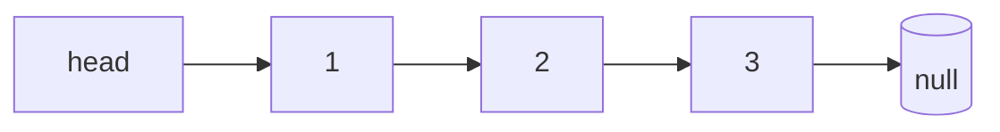

## 先建立直觉

数组是一排连续房间，找第 i 间直接敲门；链表是一串**分散的房间，每间只记住「下一间在哪」**（指针/引用）。好处是**插入删除只需改几个指针**，坏处是**想找第 i 个必须从头走**。

> 链表操作的核心是「别弄丢指针」。经典翻车：先 `cur.next = cur.next.next` 删节点，结果忘了保存后续引用，整条链断掉。画图 + 用临时变量保命。

## 它解决什么问题

1. **频繁头尾插入删除**：链表 O(1)，数组要搬移 O(n)；
2. **面试高频**：反转、环检测、合并，考的就是指针熟练度；
3. **实现其他结构**：队列、LRU 缓存、图的邻接表底层都是链表。



## 核心概念

### 1. 节点定义

```python
class ListNode:
    def __init__(self, val=0, next=None):
        self.val = val
        self.next = next
```

```cpp
struct ListNode {
    int val;
    ListNode* next;
    ListNode(int x) : val(x), next(nullptr) {}
};
```

### 2. 虚拟头节点（Dummy）——最重要技巧

没有 dummy 时，删除/插入**头节点**要特判（因为头没有前驱）。加一个 `dummy` 指向 head，让所有节点都有前驱，代码统一：

```python
def remove_elements(head, val):
    dummy = ListNode(0, head)   # dummy.next = head
    prev = dummy
    while prev.next:
        if prev.next.val == val:
            prev.next = prev.next.next   # 跳过要删的
        else:
            prev = prev.next
    return dummy.next                   # 真正的头
```

> 凡是涉及「删除/插入可能发生在头部」的链表题，先写 `dummy = ListNode(0, head)`，十有八九变简单。

### 3. 反转链表（必背）

```python
def reverse(head):
    prev = None
    cur = head
    while cur:
        nxt = cur.next     # 1. 先存下一个
        cur.next = prev    # 2. 反转指针
        prev = cur         # 3. prev 前移
        cur = nxt          # 4. cur 前移
    return prev            # 新头
# 时间 O(n)，空间 O(1)
```

> 四步顺序不能乱：**存 nxt → 断并反向 → 两指针各进一步**。

### 4. 快慢指针

**求中点**（快走两步、慢走一步，快到尾时慢在中点）：

```python
def middle(head):
    slow = fast = head
    while fast and fast.next:
        slow = slow.next
        fast = fast.next.next
    return slow
```

**检测环**（Floyd 判圈，快慢相遇即有环）：

```python
def has_cycle(head):
    slow = fast = head
    while fast and fast.next:
        slow = slow.next
        fast = fast.next.next
        if slow is fast: return True
    return False
```

### 5. 合并两个有序链表

```python
def merge(l1, l2):
    dummy = ListNode(0)
    cur = dummy
    while l1 and l2:
        if l1.val < l2.val:
            cur.next, l1 = l1, l1.next
        else:
            cur.next, l2 = l2, l2.next
        cur = cur.next
    cur.next = l1 or l2      # 剩的接上
    return dummy.next
```

## 常见坑

1. **反转时先存 nxt**：不存 `cur.next` 就被覆盖，链断，后续全丢。
2. **环检测用 `is` 而非 `==`**：Python 节点比较身份用 `is`，`==` 可能没定义或比 val。
3. **忘了返回 dummy.next**：返回了 dummy 本身，多出一个 0 节点。
4. **改了 head 还用原 head**：反转/删除后 head 可能变，用返回值或 dummy.next 拿新头。
5. **递归反转爆栈**：超长链表用递归反转会栈溢出，优先迭代版。

## 小结

- 链表插入删除 O(1) 但随机访问 O(n)；指针操作别弄丢引用；
- **dummy 虚拟头**统一头/中非头边界，最实用技巧；
- 反转四步：存 nxt → 反向 → prev 进 → cur 进；
- 快慢指针求中点 / 判环（Floyd）；
- 下一章：栈、队列与哈希表——几乎所有题的「辅助三件套」。
