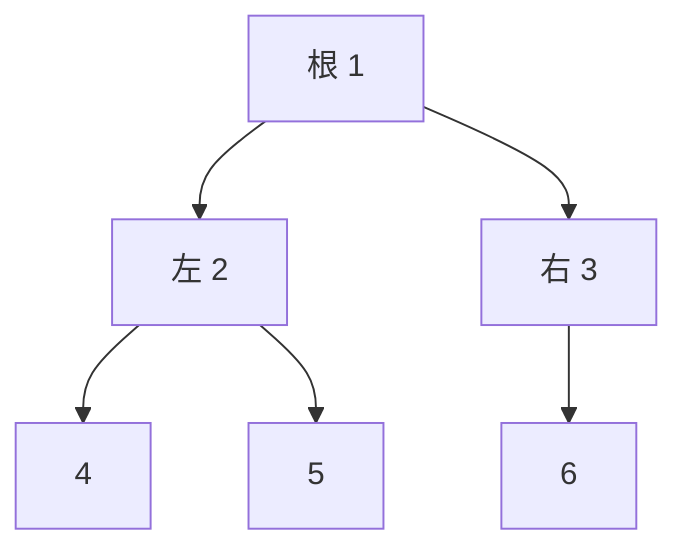

## 先建立直觉

树是「节点 + 边、无环、连通」的结构。二叉树每个节点**最多两个孩子**（左、右）。它是递归的天然载体——「一棵树 = 根 + 左子树 + 右子树」。

> 树的题 90% 用**递归**写：先想「对当前节点做什么」，再「对左右子树递归同样的事」。把大问题拆成「处理根 + 交给孩子处理」，代码就出来了。

## 它解决什么问题

1. **层级/分类数据**：文件系统、组织架构成树；
2. **有序查找**：BST 把查找降到 O(log n)；
3. **动态最值**：堆（优先队列）O(log n) 取最大/最小；
4. **前缀匹配**：Trie 做自动补全、敏感词过滤。



## 核心概念

### 1. 节点与遍历

```python
class TreeNode:
    def __init__(self, val=0, left=None, right=None):
        self.val, self.left, self.right = val, left, right
```

**四种遍历**（递归版）：

```python
def preorder(n):   # 根→左→右
    if not n: return
    print(n.val); preorder(n.left); preorder(n.right)

def inorder(n):    # 左→根→右（BST 中序=升序）
    if not n: return
    inorder(n.left); print(n.val); inorder(n.right)

def postorder(n):  # 左→右→根
    if not n: return
    postorder(n.left); postorder(n.right); print(n.val)

def levelorder(root):   # 层序：用队列
    from collections import deque
    q = deque([root]) if root else []
    while q:
        n = q.popleft()
        print(n.val)
        if n.left: q.append(n.left)
        if n.right: q.append(n.right)
```

### 2. 递归套路模板

「判断两棵树是否相同」「求树的最大深度」都是同一模式：

```python
def max_depth(n):
    if not n: return 0                 # 空树深度 0（递归出口）
    return 1 + max(max_depth(n.left), max_depth(n.right))
```

> 套路 = **定义 `f(节点)` 返回什么** + **空节点返回什么（基线）** + **用左右子树结果组合**。先写基线，再写组合。

### 3. 二叉搜索树 BST

性质：**左子树全部 < 根 < 右子树全部**。因此：
- 中序遍历得到**升序**序列；
- 查找/插入/删除平均 O(log n)；
- 判定 BST：中序遍历看是否严格递增（或更严谨地传上下界）。

```python
def is_bst(n, lo=float('-inf'), hi=float('inf')):
    if not n: return True
    if not (lo < n.val < hi): return False
    return is_bst(n.left, lo, n.val) and is_bst(n.right, n.val, hi)
```

### 4. 堆（优先队列）

堆是「父恒小于/大于子」的完全二叉树，数组实现。Python 用 `heapq`（默认最小堆）：

```python
import heapq
h = []
heapq.heappush(h, 5); heapq.heappush(h, 1); heapq.heappush(h, 3)
heapq.heappop(h)          # 1（最小）
# 取前 k 小、合并 K 个有序链表、Dijkstra 都靠堆
```

> 最大堆：存负数，或 `heapq` 配 `-x`。堆顶 O(1)，插入/删除 O(log n)。

### 5. Trie 前缀树

用于「前缀匹配」，如自动补全：

```python
class Trie:
    def __init__(self): self.children = {}; self.is_end = False
    def insert(self, w):
        node = self
        for c in w:
            node = node.children.setdefault(c, Trie())
        node.is_end = True
    def starts_with(self, p):
        node = self
        for c in p:
            if c not in node.children: return False
            node = node.children[c]
        return True
```

## 常见坑

1. **递归忘了基线（空节点返回）**：导致访问 `None.val` 崩溃，每个树函数第一行先判空。
2. **混淆四种遍历顺序**：记住「前/中/后」指的是**根的位置**，左右永远左在前。
3. **BST 判定只看「根>左孩 && 根<右孩」**：错！需整棵子树都满足（用上下界法）。
4. **heapq 默认最小堆当最大堆用**：直接 `heappush(h, x)` 取出来是最小的，要最大就存 `-x`。
5. **层序遍历用递归**：层序是 BFS，必须用队列，递归写不出「按层」。

## 小结

- 二叉树 = 节点最多两孩子；遍历分前/中/后（根位置）/层序（队列）；
- 递归套路：定义 f(节点) 返回什么 + 空节点基线 + 组合左右结果；
- BST：左<根<右，中序升序，查找 O(log n)；
- 堆 = 优先队列（O(log n) 取最值）；Trie = 前缀匹配；
- 下一章：图与搜索，处理网状关系与路径。
