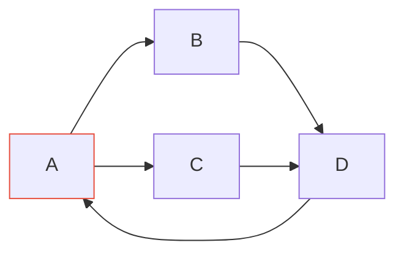

## 先建立直觉

树是「没有环的连通图」。图更一般：节点之间任意连边，可有环、可不连通。现实里社交网络、地图路网、依赖关系都是图。

- **DFS（深度优先）**：一条路走到底，撞墙回头——用**栈/递归**实现，适合「找路径、连通性、排列组合」；
- **BFS（广度优先）**：一圈圈扩散——用**队列**实现，适合「最短步数、按层」。

> 图遍历的命脉是 **visited 集合**：不标记访问过就会在环里无限转。DFS 用递归隐式栈，BFS 用队列显式栈。

## 它解决什么问题

1. **连通性**：两个节点是否可达、有几个连通块；
2. **最短路径**：无权图用 BFS，带权图用 Dijkstra；
3. **依赖排序**：拓扑排序（编译顺序、课程先修）；
4. **环检测**：死锁、依赖循环。



## 核心概念

### 1. 图的两种表示

| 表示 | 结构 | 适用 |
|------|------|------|
| **邻接表** | `adj[u] = [v1, v2, ...]` | 稀疏图（边少），省空间 |
| **邻接矩阵** | `g[u][v] = 权重/0-1` | 稠密图、快速查边 |

```python
# 邻接表（最常用）
adj = {0: [1, 2], 1: [2], 2: [3], 3: []}
```

### 2. DFS 遍历

```python
def dfs(u, adj, seen):
    seen.add(u)
    print(u)
    for v in adj[u]:
        if v not in seen:
            dfs(v, adj, seen)
# 调用：for s in all_nodes: if s not in seen: dfs(s, ...)  # 处理多个连通块
```

> 多连通块时，要「对每个未访问节点都起一次 DFS」，才能遍历全图。

### 3. BFS 最短路径（无权图）

```python
from collections import deque

def bfs_dist(start, adj):
    dist = {start: 0}
    q = deque([start])
    while q:
        u = q.popleft()
        for v in adj[u]:
            if v not in dist:
                dist[v] = dist[u] + 1   # 第一次到达即最短
                q.append(v)
    return dist
```

> 无权图 BFS 第一次到达节点时的距离就是最短距离（因为按层扩散）。

### 4. 拓扑排序（有向无环图 DAG）

用于「有先后的任务」。Kahn 算法：不断删「入度为 0」的节点。

```python
def topo_sort(n, edges):
    indeg = [0] * n
    adj = [[] for _ in range(n)]
    for u, v in edges:
        adj[u].append(v); indeg[v] += 1
    q = deque([i for i in range(n) if indeg[i] == 0])
    order = []
    while q:
        u = q.popleft(); order.append(u)
        for v in adj[u]:
            indeg[v] -= 1
            if indeg[v] == 0: q.append(v)
    return order if len(order) == n else []   # 空=有环
```

### 5. Dijkstra 最短路（带权，边权非负）

```python
import heapq

def dijkstra(start, adj, n):
    dist = [float('inf')] * n
    dist[start] = 0
    pq = [(0, start)]                 # (距离, 节点)
    while pq:
        d, u = heapq.heappop(pq)
        if d > dist[u]: continue       # 过期条目跳过
        for v, w in adj[u]:
            if dist[u] + w < dist[v]:
                dist[v] = dist[u] + w
                heapq.heappush(pq, (dist[v], v))
    return dist
```

> 用「距离最小堆」每次取最近未定节点（贪心）。**边权必须非负**；负权用 Bellman-Ford。

## 常见坑

1. **忘记 visited**：图有环，不标记会死循环。
2. **多连通块只 DFS 一次**：循环所有节点，未访问才起新遍历。
3. **BFS 用 list 当队列**：`pop(0)` O(n) 超时，用 `deque`。
4. **Dijkstra 边权为负**：结果错误，负权改用 Bellman-Ford / SPFA。
5. **拓扑排序遇环**：返回空数组，调用方要判断（有环则无法排序）。

## 小结

- 图 = 任意连边的节点集；邻接表省空间、邻接矩阵查边快；
- DFS（栈/递归）探路径与连通；BFS（队列）求无权最短路/按层；
- 拓扑排序排 DAG 先后（Kahn，入度 0 出队）；
- Dijkstra 求带权最短路（非负权），靠最小堆；
- 下一章：排序与二分，有序就能二分。
