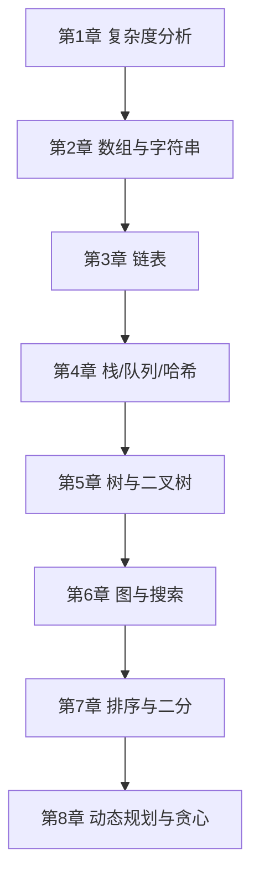

## 1. 这个板块在讲什么

本板块是一份 **从零到能刷中等题** 的数据结构与算法（DSA）教程，沿用「总目录 → 分章节教程」的学习路径：

- **教程总目录**（本页）：8 章按依赖顺序排好，给学习路线、给每章一句话定位；
- **每章一份教程**：`NN-xxx.md`，用「先建立直觉 → 它解决什么问题 → 核心概念 → 动手写 → 常见坑 → 小结」的结构讲清一个主题。

> 算法不是背题，而是**训练「把问题拆成已知模式」的肌肉记忆**。本教程不堆数学证明，而是带你把一条**完整能力链路**建起来：先会算复杂度（判断优劣）→ 掌握每种数据结构（数组/链表/栈/树/图）→ 套用经典算法（双指针/DFS/DP）→ 最后能独立分析新题属于哪一类。哪怕你目标是面试或竞赛，这套链路都够用。

## 2. 推荐学习顺序（自底向上）



**阶段一 · 基本功（第 1–2 章）**
1. 先搞懂「怎么衡量算法好坏」——大 O 复杂度，这是后面所有选择的依据。
2. 数组与字符串是最常用的结构，双指针、滑动窗口等套路从这里开始。

**阶段二 · 线性与哈希（第 3–4 章）**
3. 链表考指针操作（反转、快慢指针），是面试高频。
4. 栈/队列/哈希是「辅助结构」，几乎每道题都离不开它们。

**阶段三 · 非线性与高级（第 5–8 章）**
5. 树与二叉树（含堆、 Trie）是递归思想的主战场。
6. 图与搜索（DFS/BFS/Dijkstra）处理网络、路径类问题。
7. 排序与二分是「有序就能二分」的前提。
8. 动态规划与贪心解决「最优决策」类问题，是难度天花板。

## 3. 环境准备

本教程示例以 **Python 3** 为主（表达最清晰），关键处附 **C++** 对照。你只需：

```bash
# 任选其一即可运行示例
python3 --version          # 推荐 3.8+
g++ --version              # C++17，竞赛/面试常用
```

| 工具 | 在本教程的角色 |
|------|----------------|
| Python 3 | 主示例语言，语法直白、专注思路 |
| C++17 | 对照实现，贴近竞赛/底层性能 |
| 在线判题（LeetCode / 洛谷） | 刷题验证，把示例粘过去跑 |

> **刷题平台建议**：入门用 **LeetCode**（题解多、分类好），打竞赛用 **洛谷 / Codeforces**。本教程每章会点出「对应去刷哪些题」，但不要只刷不动脑——每题先自己想 10 分钟再看解。

## 4. 章节速查

| # | 章节 | 一句话定位 |
|---|------|-----------|
| 01 | 算法入门与复杂度分析 | 大 O、时间/空间复杂度、常见量级对比 |
| 02 | 数组与字符串 | 双指针、滑动窗口、前缀和、字符串技巧 |
| 03 | 链表 | 反转、快慢指针、虚拟头节点、环检测 |
| 04 | 栈、队列与哈希表 | 单调栈、BFS 队列、哈希计数/去重 |
| 05 | 树与二叉树 | 遍历、BST、堆、Trie、递归套路 |
| 06 | 图与搜索 | 表示法、DFS/BFS、最短路 Dijkstra |
| 07 | 排序与二分查找 | 快排/归并、二分模板与边界 |
| 08 | 动态规划与贪心 | DP 状态设计、背包、贪心策略 |

> 本板块持续整理中。每章会逐步补充可运行示例、经典例题与推荐题目；如有错误欢迎通过博客评论或邮件反馈。
