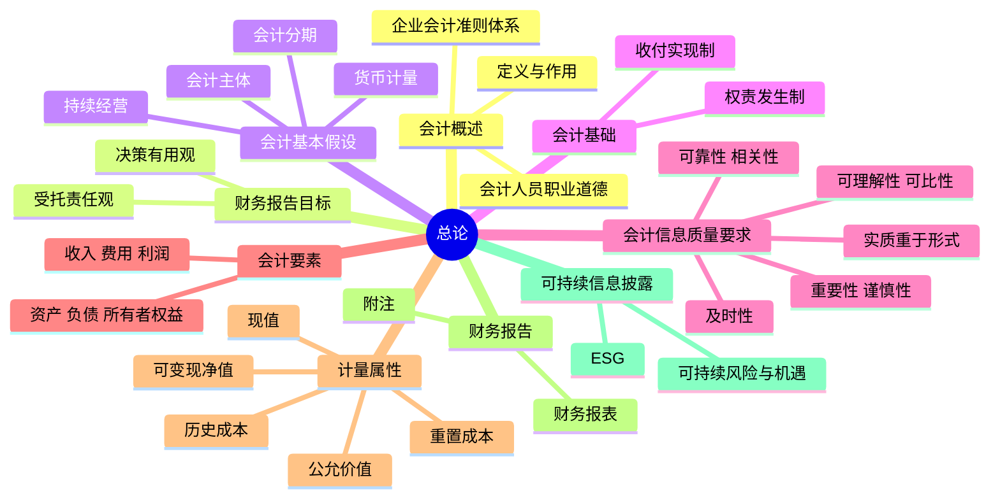

## 📍 章节定位

| 项目 | 信息 |
|------|------|
| **所属科目** | 📒 会计 |
| **难度等级** | ⭐ |
| **历年分值** | 2-3分 |
| **建议学时** | 3-4h |

## 📝 考情分析

本章为会计科目入门章节，理论性强但考点集中。历年考试中通常以 1-2 道单选题或多选题形式出现，分值约 2-3 分。命题热点集中在：会计基本假设的辨析（尤其是会计主体与法律主体的区别）、会计信息质量要求的判断（谨慎性、实质重于形式、重要性、可比性）、会计要素的定义及确认条件、五种计量属性的区分。

近年命题趋势结合新业务场景考查信息质量要求，例如附追索权保理、套期会计等业务体现的会计信息质量要求；同时，可持续信息披露、会计人员职业道德等新增内容也逐渐进入考查范围。本章不单独出主观题，但作为基础理论贯穿全书，是后续各章确认计量原则的理论支撑。

## 🧠 知识框架

## 📖 核心精讲

### 一、会计概述

**会计的定义**：会计是以货币为主要计量单位，反映和监督一个单位经济活动的一种经济管理工作。在企业，会计主要提供企业财务状况、经营成果和现金流量信息，并对企业经营活动和财务收支进行监督。

**会计的作用**：①提供决策有用的信息，提高企业透明度，规范企业行为；②加强经营管理，提高经济效益，促进企业可持续发展；③考核企业管理层经济责任的履行情况。

**企业会计准则体系**：由基本准则、具体准则、应用指南和解释组成。基本准则统驭具体准则的制定，规定财务报告目标、会计基本假设、会计基础、会计信息质量要求、会计要素及其确认计量原则、财务报告等基本问题。2006 年 2 月 15 日财政部发布企业会计准则体系，自 2007 年 1 月 1 日起首先在上市公司范围内施行。2011 年 10 月发布《小企业会计准则》，自 2013 年 1 月 1 日起施行。

### 二、财务报告目标、会计基本假设和会计基础

#### （一）财务报告目标

财务报告目标有两种观点：
- **受托责任观**：形成于公司制企业发端与盛行时期，核心是反映企业管理层受托责任的履行情况，揭示过去的经营活动与财务成果。
- **决策有用观**：源于资本市场发展，核心是向投资者等外部使用者提供决策有用的信息，尤其与企业财务状况、经营成果、现金流量相关的信息。

**我国规定**：我国基本准则兼顾决策有用观和受托责任观，规定财务报告的目标是向财务报告使用者提供与企业财务状况、经营成果和现金流量等有关的会计信息，反映企业管理层受托责任履行情况，有助于财务报告使用者作出经济决策。财务报告使用者主要包括投资者（首要使用者）、债权人、政府及其有关部门和社会公众等。

#### （二）会计基本假设

| 假设 | 含义 | 关注点 |
|------|------|--------|
| **会计主体** | 企业会计确认、计量和报告的**空间范围** | 会计主体不同于法律主体；法律主体必然是会计主体，但会计主体不一定是法律主体（如企业集团、基金） |
| **持续经营** | 在可预见的将来，企业将按当前规模和状态继续经营下去 | 有限寿命主体（如封闭式基金、信托计划）本身不影响持续经营假设成立；破产清算以非持续经营为前提 |
| **会计分期** | 将持续经营的生产经营活动划分为连续、等距的期间 | 会计期间分为年度和中期；中期指短于一个完整会计年度的报告期间（月度、季度、半年度） |
| **货币计量** | 以货币计量反映会计主体的生产经营活动 | 统一货币计量存在缺陷（如经营战略、研发能力难以货币计量），可补充非财务信息 |

#### （三）会计基础

企业会计的确认、计量和报告应当以**权责发生制**为基础：凡是当期已经实现的收入和已经发生或应当负担的费用，无论款项是否收付，都应当作为当期收入和费用计入利润表；凡不属于当期的收入和费用，即使款项已在当期收付，也不应当作为当期收入和费用。

收付实现制与权责发生制相对应，以收到或支付现金作为确认依据。我国行政事业单位预算会计通常采用收付实现制，财务会计通常采用权责发生制。

### 三、会计信息质量要求

| 质量要求 | 核心内容 | 典型应用 |
|---------|---------|---------|
| **可靠性** | 以实际发生的交易或事项为依据，如实反映，内容完整，中立无偏 | 不得根据虚构交易确认计量 |
| **相关性** | 与使用者决策需要相关，具有反馈价值和预测价值 | 区分收入与利得、流动与非流动；引入公允价值 |
| **可理解性** | 清晰明了，便于理解和使用 | 假定使用者具备一定基础知识 |
| **可比性** | 同一企业不同时期可比（纵向）；不同企业相同期间可比（横向） | 会计政策不得随意变更，变更需在附注说明 |
| **实质重于形式** | 按经济实质而非法律形式进行会计处理 | 售后回购、附追索权保理、控制权判断 |
| **重要性** | 反映所有重要交易或事项；省略或错报会影响决策的具有重要性 | 从性质和金额两方面判断 |
| **谨慎性** | 保持应有谨慎，不高估资产或收益、不低估负债或费用 | 计提减值准备、确认预计负债；不允许设置秘密准备 |
| **及时性** | 及时收集、处理、传递会计信息，不得提前或延后 | 及时性与可靠性需权衡 |

### 四、会计要素及其确认与计量

#### （一）会计要素定义及确认条件

会计要素分为资产、负债、所有者权益（侧重反映财务状况）和收入、费用、利润（侧重反映经营成果）六大要素。

| 要素 | 定义 | 确认条件 |
|------|------|---------|
| **资产** | 过去的交易或事项形成的、由企业拥有或控制的、预期会给企业带来经济利益的资源 | ① 与该资源有关的经济利益**很可能**流入企业；② 成本或价值能够**可靠地计量** |
| **负债** | 过去的交易或事项形成的、预期会导致经济利益流出企业的**现时义务**（法定义务或推定义务） | ① 与该义务有关的经济利益很可能流出企业；② 未来流出的经济利益金额能够可靠计量 |
| **所有者权益** | 企业资产扣除负债后由所有者享有的**剩余权益** | 依赖于资产和负债的确认 |
| **收入** | 企业在**日常活动**中形成的、会导致所有者权益增加的、与所有者投入资本无关的经济利益的总流入 | 在客户取得相关商品或服务**控制权**时确认 |
| **费用** | 企业在日常活动中发生的、会导致所有者权益减少的、与向所有者分配利润无关的经济利益的总流出 | ① 经济利益很可能流出企业；② 流出导致资产减少或负债增加；③ 流出额能够可靠计量 |
| **利润** | 企业在一定会计期间的经营成果，包括收入减费用后的净额和直接计入当期利润的利得和损失 | 依赖于收入、费用、利得、损失的确认 |

**关键点**：
- 资产的核心特征是"预期带来经济利益"，未能带来经济利益的项目（如质量欠缺、无法应用场景的原始数据）不应确认为资产。
- 负债的核心是"现时义务"，未来交易形成的义务不属于负债。推定义务源于企业习惯做法、公开承诺或经营政策。

#### （二）会计要素计量属性

| 计量属性 | 含义 |
|---------|------|
| **历史成本** | 取得或制造资产时实际支付的现金或等价物 |
| **重置成本**（现行成本） | 当前市场条件下重新取得同样资产所需支付的现金或等价物 |
| **可变现净值** | 预计售价减去进一步加工成本和销售必需的预计税金、费用后的净值 |
| **现值** | 对未来现金流量以恰当折现率折现后的价值 |
| **公允价值** | 市场参与者在计量日发生的有序交易中，出售一项资产所能收到或转移一项负债所需支付的价格（脱手价格） |

**应用原则**：企业一般应当采用历史成本计量；采用其他计量属性的，应当保证所确定的金额能够取得并可靠计量。我国引入公允价值是适度、谨慎和有条件的，例如数据资源当前尚不具备公允价值计量条件。

### 五、财务报告

财务报告是企业对外提供的反映企业某一特定日期财务状况和某一会计期间经营成果、现金流量等会计信息的文件。财务报告包括财务报表和其他应当在财务报告中披露的相关信息和资料。财务报表由报表本身及其附注构成，至少应当包括资产负债表、利润表和现金流量表；执行企业会计准则体系的企业还应包括所有者权益变动表。小企业编制的报表可以不包括现金流量表。

### 六、可持续信息披露

**可持续信息**是指企业环境、社会和治理方面的可持续议题相关风险、机遇和影响的信息。**ESG**是环境（Environmental）、社会（Social）和治理（Governance）三个英文单词的缩写。可持续信息具有以下特征：
- 围绕特定可持续议题进行信息披露（如气候变化、污染物排放、员工健康与安全、反商业贿赂等）。
- 关于可持续议题相关**风险、机遇和影响**的信息：可持续风险和机遇影响企业发展前景（短期、中期、长期的现金流量、融资渠道及资本成本等）；可持续影响是企业活动对经济、社会和环境产生的实际或潜在影响。

### 七、人工智能在会计审计领域的应用

随着新一代信息技术发展，人工智能（AI）在会计审计领域的应用日益广泛，包括智能凭证识别、自动化账务处理、审计抽样与异常检测、财务预测分析等场景。AI 应用有助于提升会计信息处理效率和审计质量，但也带来数据安全、算法透明度、专业判断边界等新挑战，需要会计人员保持专业胜任能力并遵循职业道德。

## 💡 典型例题

**【例题 1】（基础题，单选题）**

企业发生的下列交易或事项中，符合谨慎性这一会计信息质量要求的是（　　）。
A. 采用加速折旧法计提固定资产折旧
B. 根据业务性质，区分流动资产和非流动资产的列报
C. 同一企业不同的会计期间采用相同的会计政策
D. 计提秘密准备

**答案**：A

**解析**：谨慎性要求企业保持应有谨慎，不高估资产或收益、不低估负债或费用。加速折旧法在资产使用前期计提较多折旧，体现了谨慎性。B 体现的是可比性（或列报要求）；C 体现可比性；D 计提秘密准备违背谨慎性原则，准则不允许设置秘密准备。

**【例题 2】（易错题，单选题）**

甲公司 2×14 年 12 月 20 日与乙公司签订商品销售合同。合同约定：甲公司应于 2×15 年 5 月 20 日前将合同标的商品运抵乙公司，由乙公司验收，在商品运抵乙公司前灭失、毁损、价值变动等风险由甲公司承担。甲公司 2×14 年 12 月 30 日根据合同向乙公司开具了增值税专用发票并于当日确认了商品销售收入。W 商品于 2×15 年 5 月 10 日发出并于 5 月 15 日运抵乙公司验收合格。对于甲公司 2×14 年 W 商品销售收入确认的恰当性判断，除考虑与会计准则规定的收入确认条件的符合性以外，还应考虑可能违背的会计基本假设是（　　）。
A. 会计主体
B. 会计分期
C. 持续经营
D. 货币计量

**答案**：B

**解析**：商品所有权上的主要风险和报酬在 2×15 年 5 月才转移给乙公司，甲公司在 2×14 年 12 月 30 日确认收入，将 2×15 年才能实现的收入提前确认至 2×14 年，违背了会计分期假设，即在错误的会计期间确认了收入。

**【例题 3】（进阶题，单选题）**

下列关于权责发生制与收付实现制的表述中，正确的是（　　）。
A. 采用权责发生制，能更加准确地反映特定期间的财务状况及经营成果
B. 收付实现制考虑了与现金收支行为相连的经济业务实质是否已经发生
C. 我国企业应该以收付实现制为基础进行会计核算
D. 我国行政事业单位预算会计一般采用权责发生制

**答案**：A

**解析**：权责发生制以实际发生为标准确认收入和费用，能更准确反映特定期间的财务状况和经营成果。B 错误，收付实现制以现金实际收付为依据，不考虑经济业务实质是否发生；C 错误，我国企业会计应当以权责发生制为基础；D 错误，我国行政事业单位预算会计一般采用收付实现制，财务会计采用权责发生制。

## 🎯 记忆口诀

- **四大假设**："主体分期货币持续经营"——主体定空间，分期定时间，货币定尺度，持续定前提。
- **八项质量要求**："可可靠相可理解，可比实质重要性，谨慎及时八要求"——可靠性、相关性、可理解性、可比性、实质重于形式、重要性、谨慎性、及时性。
- **六要素**："资产负债所有者权益（财务状况），收入费用利润（经营成果）"——前三要素反映时点财务状况，后三要素反映期间经营成果。
- **五计量属性**："历史重置可变现，现值公允五属性"——一般采用历史成本，其他四种视情况采用。

## ✅ 同步练习

1. （基础题）下列各项中，体现按历史成本计量的是（　　）。提示：参见《必刷 550 题》第一章基础题 2。
2. （进阶题）企业发生的下列交易或事项中，符合谨慎性要求的是？提示：参见《必刷 550 题》第一章基础题 1。
3. （易错题）附追索权保理业务体现的会计信息质量要求是？提示：参见《必刷 550 题》第一章易错题 5。
4. （真题改编）甲公司 2×14 年提前确认销售收入违背的会计基本假设是？提示：参见《必刷 550 题》第一章易错题 7。
5. 综合复习会计要素的定义、确认条件及五种计量属性的应用场景。
