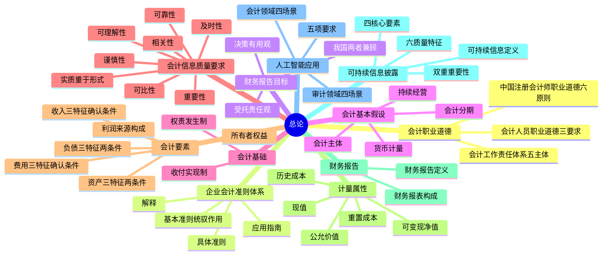

## 1. 章节定位

| 项目 | 信息 |
|------|------|
| 所属科目 | 会计 |
| 难度等级 | 2 |
| 历年分值 | 2-4 分 |
| 建议学时 | 4-6 小时 |
| 知识关联章节 | 全书所有章节（奠定会计基本概念、假设、信息质量要求与要素确认计量基础） |

## 2. 考情分析

本章是会计科目的入门与基础章节，主要介绍会计的基本概念、基本假设、信息质量要求与会计要素的确认计量原则，几乎不单独命制主观题，但客观题年年涉及，是后续所有章节的"地基"。

**命题规律**：本章以客观题为主，分值不高但极为稳定；命题集中在概念辨析、定义判断、计量属性归类、信息质量要求识别等"识记+理解"型知识点。题目难度不高但失分率高，原因是考生普遍轻视基础理论。

**高频考点分布**：

1. **会计信息质量要求**：八项要求的辨识与适用情境，特别是"实质重于形式"（售后回购、附有退货条款销售等）、"谨慎性"（不计提秘密准备、不低估负债费用）、"重要性"（性质与金额双重判断）、"及时性"与"可靠性"的权衡。
2. **会计要素的定义与确认条件**：资产、负债、所有者权益、收入、费用、利润六大要素的特征与确认条件，特别注意"资产=拥有或控制""负债=现时义务""收入=日常活动""利得=非日常活动"的边界。
3. **会计基本假设**：会计主体与法律主体的区别（法律主体必为会计主体，会计主体不一定是法律主体）；持续经营与非持续经营的区分；会计分期产生折旧摊销；货币计量的局限性。
4. **计量属性**：历史成本、重置成本、可变现净值、现值、公允价值五种属性的内涵与适用条件，公允价值"适度、谨慎、有条件"引入的原因。
5. **权责发生制**：与收付实现制的对比，行政事业单位预算会计采用收付实现制、财务会计采用权责发生制。
6. **会计工作责任体系**：单位主体责任、相关人员责任、会计服务机构责任、政府部门监管职责、行业协会自律。
7. **可持续信息披露**：可持续信息的定义、双重重要性、四个核心要素（治理、战略、风险和机遇管理、指标和目标）、六个质量特征。
8. **人工智能在会计审计领域的应用**：会计人员的责任与职业道德要求。

**联动考查方式**：
- 与各章具体业务结合，考查"实质重于形式"在售后回购、租赁、收入确认中的应用；
- 与所得税、金融工具等结合，考查公允价值计量属性；
- 与会计政策变更、差错更正结合，考查可比性与一贯性。

**备考建议**：
- 不要轻视本章，客观题分值稳定且容易得分；
- 牢记"会计要素定义 + 确认条件"是后面所有章节的理论基础；
- 重点理解"实质重于形式"和"谨慎性"两个原则在具体业务中的体现；
- 区分"会计主体"与"法律主体"（法律主体必然是会计主体，反之不成立）；
- 注意 2025 年新增的"会计工作责任体系"与"可持续信息披露"内容，是命题新热点。

## 3. 知识框架

## 4. 核心精讲

### 4.1 会计职业道德

#### 4.1.1 会计人员职业道德

会计人员从事会计工作应当遵守的职业道德要求包括以下三项：

1. **坚持诚信，守法奉公**。会计人员应树立良好职业形象，保持会计工作独立性，不做假账，不提供虚假会计信息，自觉抵制会计造假行为，维护国家财经纪律和经济秩序。
2. **坚持准则，守责敬业**。严格执行准则制度，保证会计信息真实完整；勤勉尽责、爱岗敬业，忠于职守、敢于斗争。
3. **坚持学习，守正创新**。始终秉持专业精神，勤于学习、锐意进取，持续提升会计专业能力，不断适应新形势新要求。

#### 4.1.2 中国注册会计师职业道德

维护公众利益是注册会计师行业的宗旨。公众不仅包括注册会计师服务的客户，也包括投资者、债权人、政府机构、社会公众等其他可能依赖注册会计师提供的信息以作出相关决策的组织或人员。注册会计师应当遵循下列职业道德基本原则：

| 原则 | 内涵 |
|------|------|
| 诚信 | 行业存在和发展的基石，在职业道德基本原则中居首要地位，保持正直、诚实守信 |
| 客观公正 | 不得由于偏见、利益冲突或他人的不当影响而损害职业判断 |
| 独立性 | 鉴证业务的灵魂，从实质上和形式上保持独立性，专门针对审计和审阅业务、其他鉴证业务 |
| 专业胜任能力和勤勉尽责 | 获取并保持应有的专业知识和技能，确保提供具有专业水准的服务 |
| 保密 | 对职业活动中获知的涉密信息保密 |
| 良好职业行为 | 爱岗敬业，遵守相关法律法规，避免损害职业声誉的行为 |

#### 4.1.3 会计工作责任体系

财政部印发《关于进一步压实会计工作责任加强会计法律法规和国家统一的会计制度贯彻实施的意见》（财会〔2025〕25号），构建了主体明确、要求清晰、各方协同、运行有效的会计工作责任体系。共包括五个主体：

| 主体 | 核心责任 |
|------|---------|
| 单位 | 依法办理会计事务，保证会计资料真实完整；不得以虚假业务进行会计核算，不得伪造变造会计凭证账簿；出纳人员不得兼任稽核、会计档案保管、收入支出费用债权债务账目登记及会计软件管理工作 |
| 单位相关人员 | 单位负责人对会计工作和会计资料的真实性、完整性负责；不得授意、指使、强令会计人员违法违规办理会计事项；单位会计人员对不真实不合法的原始凭证有权不予接受 |
| 会计服务机构 | 代理记账机构应拒绝委托人要求的不当会计处理；会计师事务所、注册会计师不得在未履行必要审计程序的情况下出具审计报告；会计软件服务商应保证软件服务质量、加强数据安全管理 |
| 政府部门 | 财政部门对单位是否依法设置会计账簿、会计资料是否真实完整、会计核算是否符合规定等实施监督检查；审计、税务、金融监管等部门依职责实施监督检查并加强协作 |
| 行业协会 | 注册会计师协会督促引导事务所和注册会计师依法依规开展业务；代理记账行业协会督促引导会员机构及其从业人员依法依规开展业务 |

### 4.2 企业会计准则的制定与体系

中国企业会计准则由财政部制定。2006年2月15日，财政部发布了企业会计准则体系，包括《企业会计准则——基本准则》（以下简称基本准则）和具体准则及有关应用指南，实现了与国际财务报告准则的趋同。企业会计准则体系自2007年1月1日起首先在上市公司范围内施行，之后逐步扩大到几乎所有大中型企业。

中国现行企业会计准则体系由**基本准则、具体准则、应用指南和解释**等组成。

**（1）基本准则**

基本准则主要规范了以下内容：①财务报告目标；②会计基本假设（会计主体、持续经营、会计分期、货币计量）；③会计基础（权责发生制）；④会计信息质量要求；⑤会计要素分类及其确认、计量原则（资产、负债、所有者权益、收入、费用、利润六要素；历史成本为基础，可选历史成本、重置成本、可变现净值、现值、公允价值等计量属性）；⑥财务报告。

基本准则在企业会计准则体系中发挥**两大作用**：
- 一是**统驭具体准则的制定**。基本准则是制定具体准则的基础，确保各具体准则的内在一致性。基本准则第三条明确规定："企业会计准则包括基本准则和具体准则，具体准则的制定应当遵循本准则。"
- 二是**为会计实务中出现的、具体准则尚未规范的新问题提供会计处理依据**。当新的交易或事项在具体准则中尚未规范但又急需处理时，企业应当严格遵循基本准则的要求，尤其是关于会计要素定义及其确认与计量的规定。

**（2）具体准则**：在基本准则指导下，对企业各项资产、负债、所有者权益、收入、费用、利润及相关交易事项的确认、计量和报告进行规范的会计准则。

**（3）解释**：对具体准则实施过程中出现的问题、条款规定不清楚或尚未规定的问题作出的补充说明。

**（4）应用指南**：对具体准则相关条款的细化和有关重点难点问题提供的操作性指南。财政部还会在官网发布企业会计准则应用案例和实施问答，发布一段时间后纳入应用指南。

2011年10月18日，财政部发布《小企业会计准则》，自2013年1月1日起在所有适用的小企业范围内施行，标志着我国覆盖所有企业的会计准则体系的建成。

### 4.3 财务报告目标

财务报告目标是指企业编制财务报告提供会计信息的目的，是财务会计概念框架或我国基本准则的最高层次。财务报告目标从传统上有两种观点：

| 观点 | 形成背景 | 核心内容 |
|------|---------|---------|
| **受托责任观** | 公司制企业发端与盛行，所有权与经营权分离 | 财务报告目标应以恰当方式有效反映受托者受托管理委托人财产责任的履行情况，核心是揭示过去的经营活动与财务成果 |
| **决策有用观** | 资本市场发展，股权分散，投资者"用脚投票" | 财务报告应向投资者等外部使用者提供决策有用的信息，尤其是与企业财务状况、经营成果、现金流量等相关的信息，核心是提供有助于未来决策的相关信息 |

**我国规定**：我国基本准则明确，财务报告的目标是向财务报告使用者提供与企业财务状况、经营成果和现金流量等有关的会计信息，反映企业管理层受托责任履行情况，有助于财务报告使用者作出经济决策。即**兼顾决策有用观和受托责任观**，二者是有机统一的。

**财务报告使用者**主要包括投资者、债权人、政府及其有关部门和社会公众等。其中，**投资者是首要使用者**，凸显了保护投资者利益的要求。一般情况下，如果财务报告能够满足投资者的信息需求，也就可以满足其他使用者的大部分信息需求。

### 4.4 会计基本假设

会计基本假设是企业会计确认、计量和报告的前提，是对会计核算所处时间、空间环境等所作的合理设定，包括会计主体、持续经营、会计分期和货币计量。

**（1）会计主体**：是企业会计确认、计量和报告的**空间范围**。

明确会计主体的意义：①划定会计所要处理的各项交易或事项的范围（只有影响企业本身经济利益的交易或事项才能加以确认）；②将会计主体的交易或事项与所有者及其他会计主体的交易或事项区分开来（企业所有者的交易不纳入企业会计核算，但所有者投入企业的资本或企业向所有者分配的利润应纳入）。

**会计主体与法律主体的关系**：法律主体必然是一个会计主体；但会计主体不一定是法律主体，可以是单个法律主体，也可以由多个法律主体构成（如企业集团编制合并财务报表；证券投资基金、企业年金基金等结构化主体虽不是法律主体但是会计主体）。

**（2）持续经营**：是指在可以预见的将来，企业将会按当前的规模和状态继续经营下去，不会停业，也不会大规模削减业务。

明确持续经营假设的意义：意味着会计主体将按照既定用途使用资产，按照既定合约条件清偿债务，会计人员可在此基础上选择会计原则和方法（如固定资产可按历史成本记录并按期计提折旧）。如果判断企业不会持续经营，固定资产就不应采用历史成本记录并按期计提折旧。

**特别规定**：对于封闭式基金、理财产品、信托计划等寿命固定或可确定的结构化主体，**有限寿命本身并不影响持续经营假设的成立**。企业破产清算时按《企业破产清算有关会计处理规定》（财会〔2016〕23号）处理，以非持续经营为前提。

**（3）会计分期**：是指将一个企业持续经营的生产经营活动划分为一个个连续的、长短相同的期间。会计期间分为**年度和中期**，中期是指短于一个完整会计年度的报告期间（月度、季度、半年度等）。

意义：由于会计分期，才产生了当期与以前期间、以后期间的差别，才使不同类型的会计主体有了记账的基准，进而出现了折旧、摊销等会计处理方法。

**（4）货币计量**：是指会计主体在财务会计确认、计量和报告时以货币计量，反映会计主体的生产经营活动。

选择货币作为计量基础的原因：货币是商品的一般等价物，具有价值尺度、流通手段、贮藏手段和支付手段等特点，能够汇总和比较；其他计量单位（重量、长度、容积、台、件等）只能从一个侧面反映，无法在量上汇总。

**缺陷**：某些影响企业财务状况和经营成果的因素（如经营战略、研发能力、市场竞争力等）难以用货币计量，企业可在财务报告中补充披露非财务信息来弥补。

### 4.5 会计基础

企业会计的确认、计量和报告应当以**权责发生制**为基础。

**权责发生制**：凡是当期已经实现的收入和已经发生或应当负担的费用，无论款项是否收付，都应当作为当期的收入和费用，计入利润表；凡是不属于当期的收入和费用，即使款项已在当期收付，也不应当作为当期的收入和费用。

**收付实现制**是与权责发生制相对应的会计基础，以收到或支付的现金作为确认收入和费用等的依据。目前，我国的行政事业单位预算会计通常采用收付实现制，行政事业单位财务会计通常采用权责发生制。

| 项目 | 权责发生制 | 收付实现制 |
|------|---------|---------|
| 确认依据 | 收入实现、费用发生 | 现金收付 |
| 适用主体 | 企业；行政事业单位财务会计 | 行政事业单位预算会计 |
| 优点 | 真实公允反映期间财务状况和经营成果 | 简便直观 |
| 缺点 | 收入费用与现金流量可能不一致 | 不能真实反映当期业绩 |

### 4.6 会计信息质量要求

会计信息质量要求是对企业财务报告中所提供会计信息质量的基本要求，主要包括可靠性、相关性、可理解性、可比性、实质重于形式、重要性、谨慎性和及时性等八项。

#### 4.6.1 可靠性

**可靠性**要求企业应当以实际发生的交易或者事项为依据进行确认、计量和报告，如实反映符合确认和计量要求的各项会计要素及其他相关信息，保证会计信息真实可靠、内容完整。

贯彻可靠性要求应做到：
1. 以实际发生的交易或事项为依据，不得根据虚构的、没有发生的或尚未发生的交易或事项进行确认、计量和报告；
2. 在符合重要性和成本效益原则的前提下，保证会计信息的完整性（包括应当编报的报表及其附注内容等）；
3. 财务报告中的会计信息应当是**中立的、无偏的**。

#### 4.6.2 相关性

**相关性**要求企业提供的会计信息应当与投资者等财务报告使用者的经济决策需要相关，有助于使用者对企业过去、现在或未来的情况作出评价或者预测。

相关的会计信息应当具有**反馈价值**（有助于证实或修正过去的预测）和**预测价值**（有助于预测未来的财务状况、经营成果和现金流量）。例如，区分收入和利得、费用和损失，区分流动资产和非流动资产、流动负债和非流动负债，适度引入公允价值等，都可以提高会计信息的预测价值。

**重要原则**：相关性以可靠性为基础，两者并不矛盾，不应将两者对立起来。

#### 4.6.3 可理解性

**可理解性**要求企业提供的会计信息应当清晰明了，便于投资者等财务报告使用者理解和使用。同时，应假定使用者具有一定的有关企业经营活动和会计方面的知识，并且愿意付出努力去研究这些信息。对于复杂但对决策相关的信息，企业应当在财务报告中予以充分披露。

#### 4.6.4 可比性

**可比性**要求企业提供的会计信息应当相互可比，包括两层含义：

1. **同一企业不同时期可比**（纵向可比）：同一企业不同时期发生的相同或相似的交易或事项，应当采用一致的会计政策，不得随意变更。但若按规定或在会计政策变更后可以提供更可靠、更相关的会计信息，可以变更会计政策，并在附注中说明。
2. **不同企业相同会计期间可比**（横向可比）：不同企业同一会计期间发生的相同或相似的交易或事项，应当采用相同或相似的会计政策，确保会计信息口径一致、相互可比。

#### 4.6.5 实质重于形式

**实质重于形式**要求企业应当按照交易或事项的**经济实质**进行会计确认、计量和报告，而不仅以交易或事项的法律形式为依据。

典型应用：商品已售出，但企业为确保到期收回债款而暂时保留商品的法定所有权时，该权利通常不会对客户取得对该商品的控制权构成障碍，在满足收入确认的其他条件时，企业应确认相应的收入。其他典型应用还包括售后回购、融资租赁、附有销售退回条款的销售等。

#### 4.6.6 重要性

**重要性**要求企业提供的会计信息应当反映与企业财务状况、经营成果和现金流量有关的所有重要交易或者事项。在合理预期下，如果**省略或者错报会影响投资者等财务报告使用者的决策**，则该项目具有重要性。

重要性应当根据企业所处的具体环境，从**项目的性质和金额**两方面予以判断，且判断标准一经确定，不得随意变更：

- **性质判断**：考虑该项目在性质上是否属于企业日常活动，是否显著影响企业的财务状况、经营成果和现金流量等因素；
- **金额判断**：考虑项目金额占资产总额、负债总额、所有者权益总额、营业收入总额、营业成本总额、净利润、综合收益总额等直接相关项目金额的比重或所属报表单列项目金额的比重。

#### 4.6.7 谨慎性

**谨慎性**要求企业对交易或者事项进行会计确认、计量和报告应当保持应有的谨慎，**不应高估资产或者收益、不应低估负债或者费用**。

典型应用：对可能发生的资产减值损失计提资产减值准备；对售出商品可能发生的保修义务等确认预计负债。

**重要原则**：谨慎性的应用**不允许企业设置秘密准备**。如果企业故意低估资产或收益，或故意高估负债或费用，则不符合会计信息的可靠性和相关性要求，扭曲企业实际的财务状况和经营成果。

#### 4.6.8 及时性

**及时性**要求企业对于已经发生的交易或者事项，应当及时进行确认、计量和报告，不得提前或者延后。

贯彻及时性包括三个环节：①及时收集会计信息（及时收集整理各种原始单据或凭证）；②及时处理会计信息（及时对经济交易或事项进行确认、计量，并编制财务报告）；③及时传递会计信息（按规定的时限将财务报告传递给使用者）。

**权衡关系**：及时性与可靠性之间存在权衡。为及时提供信息，可能需要在信息全部获得之前即进行会计处理，可能影响可靠性；反之，等待全部信息获得后再处理，可靠性提高但时效性降低。需要在两者之间以投资者等使用者的经济决策需要为判断标准作相应权衡。

### 4.7 会计要素及其确认条件

会计要素是根据交易或事项的经济特征所确定的财务会计对象的基本分类。会计要素按性质分为资产、负债、所有者权益、收入、费用和利润。其中，资产、负债和所有者权益要素侧重于反映企业的**财务状况**，收入、费用和利润要素侧重于反映企业的**经营成果**。

#### 4.7.1 资产

**定义**：资产是指企业过去的交易或者事项形成的、由企业拥有或者控制的、预期会给企业带来经济利益的资源。

**三大特征**：

| 特征 | 说明 |
|------|------|
| 预期带来经济利益 | 直接或间接导致现金和现金等价物流入企业的潜力；如果原始数据因关联性、精确性、及时性等存在质量欠缺而无法确定预期能带来经济利益，则不应确认为资产 |
| 为企业拥有或控制 | 企业享有所有权，或虽不享有所有权但能控制该资源；所有权是判断首要因素 |
| 由过去交易或事项形成 | 包括购买、生产、建造行为或其他交易或事项；预期未来发生的交易或事项不形成资产 |

**确认条件**（同时满足）：
1. 与该资源有关的经济利益**很可能**流入企业；
2. 该资源的成本或者价值能够**可靠地计量**。

**典型示例**：企业赊销商品形成应收账款，如果判断未来很可能收到款项或能确定收到款项，应确认为资产；如果判断通常情况下很可能部分或全部无法收回，表明该部分应收账款已不符合资产确认条件，应计提坏账准备，减少资产账面价值。

#### 4.7.2 负债

**定义**：负债是指企业过去的交易或者事项形成的、预期会导致经济利益流出企业的现时义务。

**三大特征**：

| 特征 | 说明 |
|------|------|
| 企业承担的现时义务 | 现时义务是指企业在现行条件下已承担的义务；未来发生的交易或事项形成的义务不属于现时义务，不应当确认为负债 |
| 预期导致经济利益流出 | 履行义务时导致经济利益流出企业（现金偿还、实物资产偿还、提供劳务、将负债转为资本等） |
| 由过去交易或事项形成 | 未来发生的承诺、签订的合同等不形成负债 |

**义务的类型**：
- **法定义务**：因合同、法规或其他司法解释等产生的义务（如应付账款、银行借款、应交税款等）。
- **推定义务**：根据企业以往的习惯做法、已公开的承诺或声明、已公开宣布的经营政策而将承担的义务（如售后保修服务形成的预计负债）。

**确认条件**（同时满足）：
1. 与该义务有关的经济利益**很可能**流出企业；
2. 未来流出的经济利益的金额能够**可靠地计量**（法定义务通常按合同或法律规定金额确定；推定义务按履行相关义务所需支出的最佳估计数估计）。

#### 4.7.3 所有者权益

**定义**：所有者权益是指企业资产扣除负债后，由所有者享有的**剩余权益**。公司的所有者权益又称为股东权益。

**来源构成**：所有者投入的资本、直接计入所有者权益的利得和损失（其他综合收益）、留存收益等，通常由股本（或实收资本）、资本公积（含股本溢价或资本溢价、其他资本公积）、盈余公积和未分配利润构成。商业银行等金融企业在税后利润中提取的一般风险准备，也构成所有者权益。

**确认条件**：所有者权益体现的是所有者在企业中的**剩余权益**，其确认主要依赖于其他会计要素（尤其是资产和负债）的确认，其金额的确定也主要取决于资产和负债的计量。

#### 4.7.4 收入

**定义**：收入是指企业在日常活动中形成的、会导致所有者权益增加的、与所有者投入资本无关的经济利益的总流入。

**三大特征**：

| 特征 | 说明 |
|------|------|
| 在日常活动中形成 | 日常活动是指企业为完成其经营目标所从事的经常性活动及与之相关的活动（如工业制造销售产品、商业销售商品、银行对外贷款、租赁公司出租资产等）；用于将收入与利得区分 |
| 与所有者投入资本无关 | 所有者投入资本导致的经济利益流入不应当确认为收入，应直接确认为所有者权益 |
| 会导致所有者权益增加 | 不会导致所有者权益增加的经济利益流入不符合收入定义（如向银行借入款项使企业承担现时义务，应确认为负债而非收入） |

**确认条件**：企业应当在履行了合同中的履约义务，即在客户取得相关商品或服务控制权时确认收入。取得相关商品控制权，是指能够主导该商品的使用并从中获得几乎全部的经济利益。

#### 4.7.5 费用

**定义**：费用是指企业在日常活动中发生的、会导致所有者权益减少的、与向所有者分配利润无关的经济利益的总流出。

**三大特征**：

| 特征 | 说明 |
|------|------|
| 在日常活动中形成 | 日常活动所产生的费用通常包括销售成本（营业成本）、职工薪酬、折旧费、无形资产摊销费等；用于将费用与损失区分 |
| 与向所有者分配利润无关 | 企业向所有者分配利润也会导致经济利益流出，但属于所有者权益的抵减项目，不应确认为费用 |
| 会导致所有者权益减少 | 不会导致所有者权益减少的经济利益流出不符合费用定义 |

**确认条件**（至少符合）：
1. 与费用相关的经济利益应当很可能流出企业；
2. 经济利益流出企业的结果会导致资产的减少或者负债的增加；
3. 经济利益的流出额能够可靠计量。

#### 4.7.6 利润

**定义**：利润是指企业在一定会计期间的经营成果。如果企业实现了利润，表明所有者权益将增加；如果发生亏损，所有者权益将减少。

**来源构成**：利润包括收入减去费用后的净额、直接计入当期利润的利得和损失等。其中，收入减去费用后的净额反映企业**日常活动**的业绩；直接计入当期利润的利得和损失反映企业**非日常活动**的业绩。

直接计入当期利润的利得和损失，是指应当计入当期损益、最终会引起所有者权益发生增减变动的、与所有者投入资本或者向所有者分配利润无关的利得或损失。

**确认条件**：利润反映的是收入减去费用、利得减去损失后的净额，其确认主要依赖于收入和费用以及利得和损失的确认，其金额的确定也主要取决于收入、费用、利得和损失金额的计量。

### 4.8 会计要素计量属性及其应用原则

会计计量是为了将符合确认条件的会计要素登记入账并列报于财务报表而确定其金额的过程。计量属性主要包括以下五种：

#### 4.8.1 五种计量属性

| 计量属性 | 资产计量 | 负债计量 |
|---------|---------|---------|
| **历史成本** | 按购置时支付的现金或现金等价物金额，或按购置资产时所付出对价的公允价值计量 | 按因承担现时义务而实际收到的款项或资产的金额，或承担现时义务的合同金额，或日常活动中为偿还负债预期需要支付的现金或现金等价物金额计量 |
| **重置成本**（现行成本） | 按现在购买相同或相似资产所需支付的现金或现金等价物金额计量 | 按现在偿付该项债务所需支付的现金或现金等价物金额计量 |
| **可变现净值** | 按正常对外销售所能收到的现金或现金等价物金额扣减至完工时估计将要发生的成本、估计的销售费用及相关税费后的金额计量 | （一般不用于负债） |
| **现值** | 按预计从其持续使用和最终处置中所产生的未来净现金流入量的折现金额计量 | 按预计期限内需要偿还的未来净现金流出量的折现金额计量 |
| **公允价值** | 市场参与者在计量日发生的有序交易中，出售一项资产所能收到或转移一项负债所需支付的价格（即**脱手价格**） | 同左 |

**公允价值计量的关键假设**：①应当假定市场参与者在计量日出售资产或转移负债的交易是在当前市场条件下的**有序交易**；②应当假定该交易在该资产或负债的**主要市场**进行；对于不存在主要市场的，应当假定该交易在**最有利市场**进行。

#### 4.8.2 各计量属性之间的关系

- 历史成本通常反映资产或负债**过去**的价值；重置成本、可变现净值、现值、公允价值通常反映资产或负债**现时**的成本或价值，是与历史成本相对应的计量属性；
- 资产或负债的历史成本许多就是根据交易时有关资产或负债的公允价值确定的（如非货币性资产交换具有商业实质且公允价值能可靠计量的，换入资产入账成本应以换出资产公允价值为基础；非同一控制下企业合并的合并成本以购买方付出资产、发生或承担负债等的公允价值确定）；
- 当相关资产或负债不存在活跃市场报价时，需要采用估值技术确定公允价值，其中**现值**是较普遍采用的估值方法；
- 公允价值相对于历史成本具有很强的**时间概念**：当前环境下的历史成本可能是过去环境下的公允价值，当前环境下的公允价值也许就是未来环境下的历史成本。

#### 4.8.3 应用原则

企业在对会计要素进行计量时，**一般应当采用历史成本**。采用重置成本、可变现净值、现值、公允价值计量的，应当保证所确定的会计要素金额能够取得并可靠计量。

我国引入公允价值是**适度、谨慎和有条件**的：考虑到我国尚属新兴的市场经济国家，如果不加限制地引入公允价值，可能出现公允价值计量不可靠，甚至借此人为操纵利润的现象。因此，在投资性房地产和生物资产等具体准则中规定，只有在公允价值能够取得并可靠计量的情况下，才能采用公允价值计量。例如，对于按照企业会计准则相关规定确认为无形资产或存货等资产类别的数据资源，基于数据交易市场的发展现状等情况，当前尚不具备公允价值计量条件，不得以评估等方式得出的金额直接作为后续计量的依据。

### 4.9 财务报告

#### 4.9.1 财务报告及其编制

**财务报告**是企业对外提供的反映企业某一特定日期的财务状况和某一会计期间的经营成果、现金流量等会计信息的文件。

财务报告具有以下几层含义：
1. 财务报告应当是**对外报告**，其服务对象主要是投资者、债权人等外部使用者；
2. 财务报告应当**综合反映**企业的生产经营状况，包括某一时点的财务状况和某一时期的经营成果与现金流量等信息；
3. 财务报告必须形成**一套系统的文件**，不应是零星的或 incomplete的信息。

#### 4.9.2 财务报告的构成

财务报告包括**财务报表**和**其他应当在财务报告中披露的相关信息和资料**。

财务报表由报表本身及其附注两部分构成，附注是财务报表的有机组成部分。报表至少应当包括**资产负债表、利润表和现金流量表**。考虑到小企业规模较小、外部信息需求相对较低，小企业编制的报表可以不包括现金流量表。全面执行企业会计准则体系的企业所编制的财务报表，还应当包括**所有者权益（股东权益）变动表**。

财务报表是财务报告的核心内容，但财务报告还包括其他相关信息（如企业可在财务报告中披露社会责任、对社区的贡献、可持续发展能力等信息），这些信息虽属于非财务信息，但若有规定或使用者有需求，企业应在财务报告中予以披露。

### 4.10 可持续信息披露

#### 4.10.1 可持续信息的定义

**可持续信息**（又称可持续发展信息），是指企业环境、社会和治理方面的可持续议题相关**风险、机遇和影响**（以下简称可持续风险、机遇和影响）的信息。其特征包括：

1. **围绕特定可持续议题进行的信息披露**：可持续议题是指对企业、经济、社会、环境和利益相关方具有影响的事项或因素，如气候变化、污染物排放、员工健康与安全、反商业贿赂等。
2. **关于可持续议题相关风险、机遇和影响的信息**：
   - **可持续风险和机遇**：企业就特定可持续议题与其整个价值链中的利益相关方、经济、社会和环境的互动而产生的可合理预期会影响企业发展前景（即企业短期、中期或长期的现金流量、融资渠道及资本成本等）的风险和机遇。可理解为外部环境和其他利益相关方活动对企业的财务影响。
   - **可持续影响**：企业与特定可持续议题相关的活动对经济、社会和环境产生的实际影响或可预见的潜在影响，包括积极影响或消极影响。可理解为企业相关活动对外部环境和其他利益相关方产生的影响。

**ESG** 是环境（Environmental）、社会（Social）和治理（Governance）三个英文单词的缩写，是近年来兴起的企业管理和金融投资的重要理念。

#### 4.10.2 可持续信息披露的目标与原则

**目标**：向投资者、债权人、政府及其有关部门和其他利益相关方提供有关于企业重要的可持续风险、机遇和影响的信息，从而使其了解可持续议题如何影响企业的未来发展、经营成果和财务状况，并了解企业的经营活动如何影响环境与社会。其中，**投资者和债权人是可持续信息的基本使用者**。

**重要性原则（双重重要性）**：可持续信息披露应当符合重要性原则，应按**财务重要性**和**影响重要性**分别针对可持续风险和机遇信息与可持续影响信息进行评估：

| 维度 | 评估对象 | 评估标准 |
|------|---------|---------|
| 财务重要性 | 可持续风险和机遇信息 | 在合理预期下，某项信息的省略、错报或模糊处理会影响基本使用者决策；评估特定可持续风险和机遇是否给企业带来重要的当期或预期财务影响 |
| 影响重要性 | 可持续影响信息 | 评估企业是否对经济、社会和环境产生了重要影响；消极影响以严重程度（规模、范围、不可补救程度）评估，潜在消极影响以严重程度和发生可能性评估；积极影响以规模和范围评估 |

**报告期间与报告主体**：报告期间应与财务报表的报告期间保持一致；报告主体范围应与财务报表主体保持一致；报告主体为合并主体时，应与合并财务报表合并范围保持一致。此外，可持续信息披露还应考虑企业**价值链**情况。

#### 4.10.3 可持续信息质量要求

企业披露的可持续信息应当具有以下六个质量特征：

| 质量特征 | 内涵 |
|---------|------|
| **可靠性** | 如实反映重要的可持续风险、机遇和影响，保证信息完整、中立和准确；信息完整避免重要信息被省略漏报；信息中立不带有偏见、不低估或夸大；信息准确确保事实信息不存在重要错误 |
| **相关性** | 与信息使用者的决策相关，有助于使用者作出评价或预测；重要性原则是相关性在特定企业应用的体现 |
| **可比性** | 可与企业不同时期提供的信息比较，以及与其他企业（特别是同一行业企业或从事相似经营活动、相似业务模式的企业）提供的信息比较；估计方法变更时应重新计算比较期间数据 |
| **可验证性** | 能够通过信息本身或生成信息的输入值加以证实，不同的具有相关专业知识和经验的独立第三方能够对信息是否如实反映达成共识 |
| **可理解性** | 内容清晰明了，便于使用者理解和使用；可以作为独立报告（如可持续发展报告）对外公告 |
| **及时性** | 能够及时满足使用者的信息需求；通常与财务报表或年度报告同时对外披露 |

#### 4.10.4 可持续信息披露的四个核心要素

企业披露的可持续信息应当使使用者了解企业日常经营活动中与可持续议题相关的各个方面，通常包括**治理、战略、风险和机遇管理（或治理、战略、风险机遇和影响管理）、指标和目标**等四个核心要素。

**国际与国内的差异**：在 ESRS（欧洲可持续报告准则）中，四个核心要素披露适用于可持续风险、机遇和影响；在我国企业可持续披露准则与 ISSB Standards 中，四个核心要素披露仅适用于可持续风险和机遇，可持续影响信息按其他相关规定披露。

**（1）治理**：披露管理和监督可持续风险和机遇所采用的治理架构、控制措施和程序。包括：①负责监督的治理机构或人员的信息（职权范围、专业技能胜任能力、获悉方式和频率、如何考虑、如何监督目标设定）；②管理层在治理架构中的作用信息（岗位或部门职责、控制措施和程序）。

**（2）战略**：披露企业管理可持续风险和机遇所制定的战略和可能结果。包括：①可持续风险和机遇（包括对业务模式和价值链的影响、时间范围——短期1年以内、中期1～5年、长期5年以上）；②风险和机遇如何影响企业的战略和决策；③风险和机遇的当期和预期财务影响；④企业的战略和业务模式对可持续风险的韧性（情景分析等）。

**（3）风险和机遇管理**：披露识别、评估、排序和监控可持续风险和机遇的流程（包括是否及如何融入企业的整体风险管理流程）。

**（4）指标和目标**：披露企业在可持续风险和机遇方面的绩效，包括：①规定要求披露的指标；②企业用于计量和监控的指标（如何定义、绝对值/相对值/定性指标、是否经独立第三方验证、计算方法、修订原因）；③企业设定的目标的进展和国家法律法规、战略规划要求企业实现的目标的进展。

#### 4.10.5 可持续信息与财务报表信息的关联

可持续信息所披露的内容应当与财务报表信息之间相互关联，使使用者更好地理解不同披露之间的联系。关联方式包括：可持续定量信息直接取自财务报表相关项目数值，或取自其中一部分或合计数。

可持续议题相关的风险、机遇和影响，也可能会对财务报表信息产生影响。例如：企业固定资产因自然气候事件（物理风险）或政策变动（转型风险）而无法使用，需重新评估资产使用寿命和残值；企业生产过程造成土壤污染，需估计可能发生的支出并相应确认预计负债。

### 4.11 人工智能在会计审计领域的应用

#### 4.11.1 人工智能概述

人工智能是计算机科学的核心分支，通过机器学习、专家系统、自动化决策、自然语言处理、计算机视觉和情感计算等技术，使计算机具备感知、学习和自适应能力。例如，光学字符识别技术可以扫描PDF文档并转换为数字化文本格式。

#### 4.11.2 在会计领域的应用场景

| 应用场景 | 说明 |
|---------|------|
| 自动化处理 | 自动识别和分类出库单、合同、发票、银行流水等原始凭证，减少手工录入错误，自动生成记账凭证 |
| 智能分析 | 通过机器学习和大模型技术，分析财务数据，预测税务风险，提供多维度数据分析和经营建议 |
| 风险控制 | 实时监测异常交易或数据偏差，通过会计数据规则和财税规则检查实现自动数据核对，预警会计处理差错 |
| 效率提升 | 智能作账机器人等工具可7天×24小时处理重复性工作，使财务人员专注于更高价值的决策支持 |

#### 4.11.3 在审计领域的应用场景

| 应用场景 | 说明 |
|---------|------|
| 审计数据采集与分析 | 利用自然语言处理技术自动识别和提取审计相关数据，进行数据清洗、翻译、转化和整合；利用光学字符识别技术识别扫描件、图片中的文字，利用文本挖掘技术分析合同等 |
| 审计风险识别与评估 | 利用机器学习算法构建审计风险评估模型，对海量数据进行自动分析，识别潜在审计风险点并进行风险等级评估 |
| 审计程序自动化 | 利用机器人流程自动化技术，将重复性、规则性的审计程序自动化（如数据核对等） |
| 审计质量控制和复核 | 对审计工作底稿、审计报告等进行自动复核，识别潜在错漏和风险 |

#### 4.11.4 会计人员的责任与要求

会计人员在开发和使用人工智能时，应至少关注和遵循以下五点要求：

1. **以会计人员职业道德为导向**：以负责任、符合职业道德的方式设计、搭建、部署和使用人工智能解决方案。
2. **压实会计人员工作责任**：会计人员利用人工智能完成工作时，最终也需承担会计工作责任；应充分了解人工智能技术的局限性，保持职业怀疑态度，对数据来源的准确性、及时性进行检查，对处理过程进行验证，对工作成果进行独立的职业判断，避免过度依赖。
3. **以人为本**：积极拥抱人工智能，关注会计人员的需求，解决工作中的困难。
4. **可解释性**：关注和提高人工智能应用的可解释性，以清晰的文档说明开发和训练过程，以及训练过程中所使用的资料。
5. **数据保密**：确保所有数据的获取和使用符合各项隐私和数据法规以及职业道德的要求。

## 5. 典型例题

**【例题 1】（会计主体与法律主体的辨析）**

下列关于会计主体与法律主体的说法中，正确的有（ ）。

A. 法律主体必然是一个会计主体
B. 会计主体一定是法律主体
C. 企业集团作为会计主体应当编制合并财务报表
D. 证券投资基金、企业年金基金等结构化主体属于会计主体

**答案**：A、C、D

**解析**：法律主体必然是一个会计主体，但会计主体不一定是法律主体。企业集团中母子公司虽然是不同的法律主体，但母公司对子公司拥有控制权，应将企业集团作为会计主体编制合并财务报表；证券投资基金、企业年金基金等虽不是法律主体但属于会计主体，应当对每项基金进行会计确认、计量和报告。B选项错误。

**【例题 2】（会计信息质量要求的辨析）**

下列各项中，体现谨慎性要求的有（ ）。

A. 对应收账款计提坏账准备
B. 对售出商品可能发生的保修义务确认预计负债
C. 同一企业不同时期对相同的销售业务采用一致的会计政策
D. 将企业附有售后回购条款的销售作为融资交易处理

**答案**：A、B

**解析**：谨慎性要求企业不应高估资产或者收益、不应低估负债或者费用。A对应收账款计提坏账准备（不高估资产）、B对保修义务确认预计负债（不低估负债费用）均体现谨慎性。C体现的是可比性（同一企业不同时期可比）；D体现的是实质重于形式（按经济实质而非法律形式处理）。需注意，谨慎性的应用不允许设置秘密准备。

**【例题 3】（资产的定义与确认条件）**

下列各项中，不符合资产定义的有（ ）。

A. 购买某存货的意愿或计划（购买行为尚未发生）
B. 经营租入的固定资产（企业不享有所有权且不能控制）
C. 待处理财产损失
D. 企业持有的衍生金融工具形成的资产（公允价值能够可靠计量）

**答案**：A、B、C

**解析**：资产是指企业过去的交易或事项形成的、由企业拥有或者控制的、预期会给企业带来经济利益的资源。A项购买行为尚未发生，不属于"过去的交易或事项形成的"，不形成资产；B项经营租入固定资产，企业既不拥有所有权也不能控制，不符合资产定义；C项待处理财产损失预期不能为企业带来经济利益，不符合资产定义。D项衍生金融工具形成的资产，虽实际成本很小或没有实际成本，但公允价值能够可靠计量，符合资产可计量性的确认条件，可以确认为资产。

**【例题 4】（计量属性的判断）**

下列会计计量中，应采用现值计量属性的有（ ）。

A. 计量资产减值时预计未来现金流量
B. 计量分期付款购买固定资产（具有重大融资成分）
C. 计量存货的期末账面价值
D. 计量交易性金融资产的期末价值

**答案**：A、B

**解析**：A资产减值准则规定，资产预计未来现金流量以折现率折现后的现值计量；B具有重大融资成分的分期付款购买固定资产，应按购买价款的现值确定固定资产成本；C存货期末按成本与可变现净值孰低计量，采用可变现净值；D交易性金融资产期末按公允价值计量。

## 6. 记忆口诀

**会计基本假设**："主、续、分、币"——会计主体（空间范围）、持续经营（时间前提）、会计分期（划分期间）、货币计量（计量基础）。

**会计基础**："企业权责，事业单位预算收付"——企业采用权责发生制；行政事业单位预算会计采用收付实现制，财务会计采用权责发生制。

**信息质量八要求**："可相可实重谨及"——可靠性、相关性、可理解性、可比性、实质重于形式、重要性、谨慎性、及时性。

**会计主体与法律主体**："法律必会计，会计非必法律"——法律主体必然是会计主体；会计主体不一定是法律主体（如企业集团、基金等）。

**持续经营特殊情形**："有限寿命不破持续经营"——封闭式基金、理财产品、信托计划等寿命固定或可确定的结构化主体，有限寿命本身不影响持续经营假设。

**资产三特征**："过去形成、拥有或控制、预期带来经济利益"——同时满足才符合资产定义。

**负债三特征**："现时义务、预期流出、过去形成"——同时满足才符合负债定义。

**收入三特征**："日常活动、与投入资本无关、增加所有者权益"——与利得（非日常活动）相区分。

**谨慎性原则**："不高估资产收益，不低估负债费用；不许设置秘密准备"。

**可比性两层**："纵向同企业不同时期一致，横向不同企业同期一致"。

**计量属性五种**："历史、重置、可变现、现值、公允"——一般采用历史成本；其他四种需金额能可靠计量；公允价值是适度、谨慎、有条件引入。

**公允价值定义**："有序交易脱手价，主要市场优先，无主则最有利"。

**可持续信息双重重要性**："财务重要性看风险机遇，影响重要性看可持续影响"。

**可持续四核心要素**："治理、战略、风险管理、指标和目标"。

**可持续信息六质量**："可靠、相关、可比、可验证、可理解、及时"——比会计信息质量多了"可验证性"。

**ESG 内涵**："E 环境、S 社会、G 治理"——可持续发展理念在企业界和投资界的具象投影。

**人工智能应用五要求**："道德导向、压实责任、以人为本、可解释性、数据保密"。
