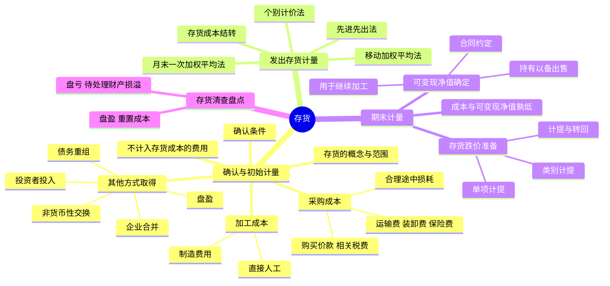

## 📍 章节定位

| 项目 | 信息 |
|------|------|
| **所属科目** | 📒 会计 |
| **难度等级** | ⭐⭐ |
| **历年分值** | 3-4分 |
| **建议学时** | 4-6h |

## 📝 考情分析

本章是会计科目基础章节，历年分值约 3-4 分，以客观题为主，偶尔在综合题中结合收入、所得税等考点出现。命题热点集中在：存货成本构成（采购成本、加工成本、不应计入存货成本的费用）、发出存货计价方法（先进先出法、移动加权平均法、月末一次加权平均法、个别计价法）的计算应用、可变现净值的确定（持有目的不同计算方法不同）、存货跌价准备的计提与转回、存货清查的会计处理。

近年新增考点：数据资源作为存货的确认和计量、合同履约成本与存货的关系、广告营销用特定商品的会计处理。考生需重点掌握可变现净值计算时的"合同价/市场价"判断逻辑，以及材料存货期末计量"以产成品可变现净值与成本比较为基础"的特别规定。

## 🧠 知识框架

## 📖 核心精讲

### 一、存货的确认和初始计量

#### （一）存货的概念与确认条件

存货，指企业在日常活动中持有以备出售的产成品或商品、处在生产过程中的在产品、在生产过程或提供劳务过程中耗用的材料、物料等。具体包括：原材料、在产品、半成品、产成品、商品、周转材料（包装物、低值易耗品、模板等）。

**注意**：①为建造固定资产等各项工程而储备的材料不属于存货（属工程物资）；②消耗性生物资产不属于本章存货范围；③企业日常活动中持有、最终目的用于出售的数据资源，符合存货定义和确认条件的，应确认为存货（如汽车销售企业购进用于销售的二手车）。

**确认条件**：①与该存货有关的经济利益很可能流入企业；②该存货的成本能够可靠地计量。

#### （二）存货的初始计量

存货成本 = 采购成本 + 加工成本 + 使存货达到目前场所和状态所发生的其他成本。

**1. 外购存货的成本（采购成本）**

外购存货成本包括：购买价款、相关税费、运输费、装卸费、保险费以及其他可归属于存货采购成本的费用。

- **购买价款**：发票账单上列明的价款，**不包括**按规定可以抵扣的增值税进项税额。
- **相关税费**：进口关税、消费税、资源税和**不能抵扣**的增值税进项税额等。
- **其他可归属于采购成本的费用**：仓储费、包装费、运输途中的合理损耗、入库前的挑选整理费用等。

**特殊情形**：
- 商品流通企业进货费用金额较小的，可直接计入当期销售费用。
- 采购过程中物资毁损短缺：合理途中损耗计入采购成本；从供货单位、运输机构收回的赔款冲减采购成本；意外灾害损失暂记"待处理财产损溢"，查明后分别计入营业外支出（自然灾害）、其他应收款（责任人赔偿）、管理费用（管理原因）。

**2. 加工取得存货的成本**

加工成本 = 直接人工 + 制造费用。其中：
- **直接人工**：直接从事产品生产的工人的职工薪酬。
- **制造费用**：生产部门管理人员薪酬、折旧费、办公费、水电费、机物料消耗、劳动保护费、季节性和修理期间的停工损失等。

**不应计入存货成本的费用**：
- 非正常消耗的直接材料、直接人工及制造费用（如超定额废品损失、自然灾害损失），计入当期损益。
- 采购入库后发生的仓储费用（生产过程中为达到下一阶段所必需的仓储费用除外），计入当期损益。
- 不能归属于使存货达到目前场所和状态的其他支出，计入当期损益。
- 企业采购用于广告营销活动的特定商品，向客户预付货款未取得商品时作为预付账款，取得商品时计入销售费用。

**3. 其他方式取得存货的成本**

| 取得方式 | 入账价值 |
|---------|---------|
| 投资者投入 | 投资合同或协议约定价值（不公允的按公允价值），差额计入资本公积 |
| 非货币性资产交换 | 按《CAS 7》规定确定 |
| 债务重组 | 按《CAS 12》规定确定 |
| 企业合并 | 按《CAS 20》规定确定 |
| 盘盈 | 按重置成本入账，通过"待处理财产损溢"处理 |

### 二、发出存货的计量

发出存货成本可采用以下方法：**先进先出法、移动加权平均法、月末一次加权平均法、个别计价法**。注意：现行准则**不允许**采用后进先出法。

| 方法 | 计算公式 | 特点 |
|------|---------|------|
| **先进先出法** | 先购入的存货先发出 | 可随时结转成本；物价上升时高估利润和库存价值，物价下降时低估 |
| **移动加权平均法** | 单位成本 = (原有库存成本 + 本次进货成本) / (原有库存数量 + 本次进货数量) | 每次进货都要计算，工作量大，但能及时反映 |
| **月末一次加权平均法** | 单位成本 = (月初库存成本 + 本月全部进货成本) / (月初库存数量 + 本月全部进货数量) | 月末一次计算，简化工作，但不利于日常管理 |
| **个别计价法** | 按各批存货实际成本计算 | 最准确，适用于不能替代使用的存货、为特定项目专门购入的存货、贵重物品（珠宝、名画） |

**存货成本结转**：销售存货时，应将已售存货成本结转为当期营业成本；存货为非商品存货（如材料销售不构成主营业务）的，计入其他业务成本。已售存货计提了跌价准备的，应结转相应跌价准备，冲减当期主营业务成本或其他业务成本。

### 三、期末存货的计量

#### （一）成本与可变现净值孰低

资产负债表日，存货应当按照**成本与可变现净值孰低**计量。存货成本低于可变现净值时，按成本计量；存货成本高于可变现净值时，按可变现净值计量，差额计提存货跌价准备，计入当期损益（资产减值损失）。

**可变现净值** = 估计售价 - 至完工时估计将要发生的成本 - 估计的销售费用 - 相关税费

#### （二）可变现净值的确定

**1. 基本特征**：
- 确定前提是企业进行日常活动（清算状态下不适用）。
- 可变现净值是预计未来净现金流入，不等于售价或合同价。
- 不同存货的构成不同：
  - 直接用于出售的存货（产成品、商品、用于出售的材料）：可变现净值 = 估计售价 - 估计销售费用 - 相关税费。
  - 需要经过加工的材料存货：可变现净值 = 所生产产成品的估计售价 - 至完工时估计将要发生的成本 - 估计销售费用 - 相关税费。

**2. 估计售价的确定**：

| 情形 | 估计售价基础 |
|------|------------|
| 为执行销售合同而持有的存货（数量 = 合同数量） | 合同价格 |
| 持有数量 > 合同数量 | 合同内部分用合同价，超出部分用一般销售价格 |
| 持有数量 < 合同数量 | 合同价格（如为亏损合同，按或有事项准则处理） |
| 没有销售合同约定的存货 | 一般销售价格（市场价格） |
| 用于出售的材料 | 市场价格（有合同约定的用合同价） |

**3. 材料存货的期末计量**：
- 用其生产的产成品可变现净值**高于**成本 → 材料按成本计量。
- 材料价格下降表明产成品可变现净值**低于**成本 → 材料按可变现净值计量。

#### （三）存货跌价准备的计提

- **通常**：按**单个存货项目**计提。
- **数量繁多、单价较低的存货**：可按**存货类别**计提。
- **与具有类似目的或最终用途并在同一地区生产和销售的产品系列相关，且难以分别估计**：可合并计提。

**转回**：以前减记存货价值的影响因素已经消失的，减记的金额应当予以恢复，并在原已计提的存货跌价准备金额内转回，转回的金额计入当期损益。

### 四、存货的清查盘点

存货盘盈：按重置成本入账，通过"待处理财产损溢"科目，报经批准后冲减管理费用。

存货盘亏：通过"待处理财产损溢"科目，按管理权限报经批准后：
- 回收的残料价值 → 计入原材料
- 应由保险公司或过失人赔偿 → 计入其他应收款
- 属于一般经营损失（如管理不善） → 计入管理费用
- 属于自然灾害等非常损失 → 计入营业外支出

### 五、存货的列示与披露

资产负债表"存货"项目应根据材料采购、原材料、低值易耗品、库存商品、包装物、分期收款发出商品、委托加工物资、委托代销商品、生产成本、制造费用、劳务成本、合同履约成本（摊销期限不超过一个正常营业周期的部分）等科目的期末余额合计，减去"存货跌价准备"科目期末余额后的净额填列。

## 💡 典型例题

**【例题 1】（2024 年单选题）**

2×23 年 1 月，甲公司生产车间领用成本 100 万元的零部件用于生产产品，根据历史经验，零部件在加工过程中的正常毁损率为 2%。由于人工操作失误，实际损耗率为 5%。不考虑相关税费和其他因素，甲公司应计入产成品成本的零部件成本为（　　）。
A. 95 万元
B. 97 万元
C. 100 万元
D. 98 万元

**答案**：B

**解析**：正常损耗 2% 计入存货成本，非正常损耗 3%（5%-2%）属于非正常消耗，应计入当期损益，不计入产成品成本。所以应计入产成品成本的零部件成本 = 100 × (1 - 3%) = 97（万元）。

**【例题 2】（计算题）**

甲公司主要从事 X 产品的生产和销售，生产 X 产品所使用的主要材料 Y 材料全部从外部购入。2×22 年 12 月 31 日，甲公司库存 Y 材料的成本为 5600 万元，若将全部库存 Y 材料加工成 X 产品，甲公司估计还需发生成本 1800 万元。预计使用该批材料所生产的 X 产品售价总额为 7000 万元，预计的销售费用及相关税费总额为 300 万元，若将库存 Y 材料全部予以出售，其市场价格为 5000 万元。假定甲公司持有 Y 材料的目的是将其用于 X 产品的生产。不考虑其他因素，甲公司该批 Y 材料的可变现净值是？

**答案**：4900 万元

**解析**：Y 材料用于生产 X 产品，应按所生产的产成品 X 的可变现净值为基础确定材料的可变现净值。
- X 产品可变现净值 = X 产品估计售价 - 估计销售费用及相关税费 = 7000 - 300 = 6700（万元）
- X 产品成本 = 材料成本 + 至完工时估计将要发生的成本 = 5600 + 1800 = 7400（万元）
- 因 X 产品可变现净值 6700 万元 < 成本 7400 万元，表明材料价格下降使产成品可变现净值低于成本，Y 材料应按可变现净值计量。
- Y 材料可变现净值 = X 产品估计售价 - 至完工时估计将要发生的成本 - 估计销售费用及相关税费 = 7000 - 1800 - 300 = 4900（万元）。
- Y 材料应计提存货跌价准备 = 5600 - 4900 = 700（万元）。

**【例题 3】（基础题）**

A 公司对存货采用单个存货项目计提存货跌价准备。2×22 年 9 月 26 日，A 公司与 B 公司签订了一份不可撤销的销售合同，双方约定，A 公司应于 2×23 年 3 月 10 日以每台 56 万元的价格向 B 公司销售 6 台乙产品。2×22 年 12 月 31 日，A 公司库存乙产品 8 台，其单位成本为 56 万元（此前未计提存货跌价准备），市场销售价格为每台 60 万元。假定每台乙产品的销售费用和税金为 1 万元。不考虑其他因素，2×22 年 12 月 31 日，A 公司库存乙产品的账面价值为？

**答案**：442 万元

**解析**：
- 合同部分（6 台）：可变现净值 = 6 × (56 - 1) = 330（万元）；成本 = 6 × 56 = 336（万元）；应计提跌价准备 = 336 - 330 = 6（万元）；账面价值 = 330（万元）。
- 超出合同部分（2 台）：可变现净值 = 2 × (60 - 1) = 118（万元）；成本 = 2 × 56 = 112（万元）；可变现净值 > 成本，不计提跌价准备；账面价值 = 112（万元）。
- 合计账面价值 = 330 + 112 = 442（万元）。

## 🎯 记忆口诀

- **存货成本三要素**："采购加工其他成本"——外购看采购，自制看加工，其他方式单独算。
- **不计入存货成本的支出**："非正常损耗、入库后仓储、广告营销品"——一律计入当期损益。
- **四种计价方法**："先进先出移加月加，再加个别计价法"——禁用后进先出。
- **可变现净值**："售价减完工减销售税费"——核心是"净"字，售价不同目的不同基础。
- **材料期末计量**："产成品净值高于成本，材料按成本；产成品净值低于成本，材料按净值"——判断材料是否跌价看产成品。

## ✅ 同步练习

1. （基础题）下列各项中，不应计入存货采购成本的是？提示：参见《必刷 550 题》第二章基础题。
2. （进阶题）采用一次加权平均法计算月末库存产成品账面余额，注意剔除非正常停工损失。提示：参见《必刷 550 题》第二章进阶题 18。
3. （进阶题）委托加工应税消费品收回后直接用于出售的成本计算，注意消费税构成入库成本。提示：参见《必刷 550 题》第二章进阶题 19。
4. （2024 真题）采用移动加权平均法计算年末原材料应计提的存货跌价准备。提示：参见《必刷 550 题》第二章真题 22。
5. 综合复习可变现净值的确定（合同/无合同/用于生产/用于出售），掌握跌价准备的计提和转回。
