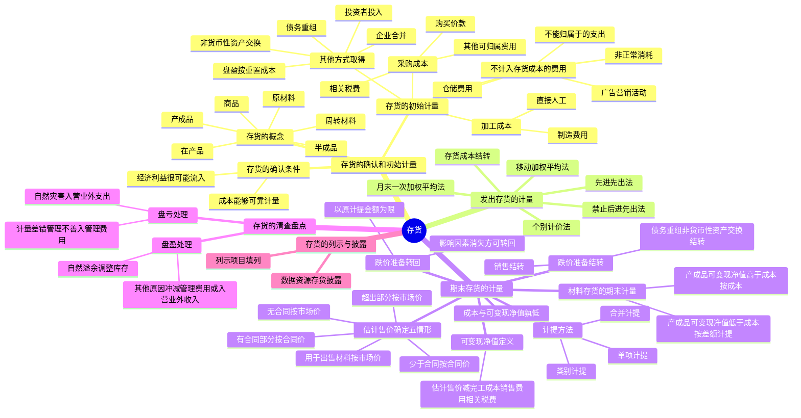

## 1. 章节定位

| 项目 | 信息 |
|------|------|
| 所属科目 | 会计 |
| 难度等级 | 3 |
| 历年分值 | 4-6 分 |
| 建议学时 | 5-7 小时 |
| 知识关联章节 | 第3章 固定资产（工程物资不入存货）、第7章 资产减值（存货跌价）、第13章 金融工具（应收账款）、第17章 收入（合同履约成本）、第19章 所得税（暂时性差异）、第27章 资产负债表日后事项（销售退回） |

## 2. 考情分析

本章是会计科目的基础章节之一，是资产负债表中资产端的重要项目。客观题每年稳定出题，主观题常与所得税、差错更正、资产负债表日后事项等结合考查。

**命题规律**：客观题集中在存货范围辨析、成本构成判断、可变现净值计算；主观题集中在存货跌价准备的计提与转回、可变现净值的确定、存货清查盘亏盘盈的处理。

**高频考点分布**：

1. **存货的范围与确认条件**：工程物资、在建工程、消耗性生物资产、合同履约成本是否属于存货；存货确认的两个条件。
2. **存货的初始计量**：采购成本构成（购买价款、相关税费、其他费用）、商品流通企业进货费用的处理、加工成本（直接人工、制造费用）的归集与分配、投资者投入存货的入账价值、不计入存货成本的费用（非正常消耗、仓储费用、广告营销）。
3. **发出存货的计量方法**：四种方法的特点及物价变动下的影响，禁止后进先出法。
4. **期末计量（成本与可变现净值孰低）**：可变现净值的定义与特征、估计售价的五种确定情形、材料存货的期末计量、计提方法（单项、类别、合并）、跌价准备转回的条件与限制、跌价准备的结转。
5. **存货清查盘点**：盘亏（管理原因→管理费用、自然灾害→营业外支出）、盘盈（自然溢余调整库存、其他原因冲减管理费用或计入营业外收入）的处理。
6. **存货的列示与披露**：存货项目的填列、数据资源存货的特殊披露要求。

**联动考查方式**：
- 与所得税结合：存货跌价准备产生可抵扣暂时性差异；
- 与差错更正结合：错将某些支出计入或未计入存货成本；
- 与日后事项结合：报告年度销售在日后期间退回的存货跌价准备处理；
- 与收入结合：合同履约成本适用收入准则而不适用存货准则。

**备考建议**：
- 牢记存货的核心定义"日常活动中持有以备出售"——据此判断工程物资、合同履约成本是否属于存货；
- 区分"采购入库前"与"采购入库后"的费用归属——前者计入采购成本，后者计入当期损益（生产过程中必需的仓储费用除外）；
- 牢记可变现净值的三种计算口径（直接出售的商品存货、需加工的材料存货、有合同与无合同分别确定）；
- 牢记存货跌价准备转回的限制——以原计提金额为限，且影响因素消失方可转回。

## 3. 知识框架



## 4. 核心精讲

### 4.1 存货的性质与确认条件

#### 4.1.1 存货的概念

**存货**，指企业在日常活动中持有以备出售的产成品或商品、处在生产过程中的在产品、在生产过程或提供劳务过程中耗用的材料、物料等。

企业的存货具体通常包括以下内容：

| 类别 | 含义 | 注意事项 |
|------|------|---------|
| 原材料 | 在生产过程中经加工改变其形态或性质并构成产品主要实体的各种原料及主要材料、辅助材料、外购半成品、修理用备件、包装材料、燃料等 | 为建造固定资产等各项工程而储备的各种材料，由于不符合存货定义，不能作为存货核算 |
| 在产品 | 企业正在制造尚未完工的产品，包括正在各工序加工的产品和已加工完毕但尚未检验或已检验但尚未办理入库手续的产品 | — |
| 半成品 | 经过一定生产过程并已检验合格交付半成品仓库保管，但尚未制造完工成为产成品，仍需进一步加工的中间产品 | — |
| 产成品 | 工业企业已经完成全部生产过程并验收入库，可以按照合同规定的条件送交订货单位，或可以作为商品对外销售的产品 | 接受外来原材料加工制造的代制品和为外单位加工修理的代修品，制造和修理完成验收入库后，视同企业的产成品 |
| 商品 | 商品流通企业外购或委托加工完成验收入库用于销售的各种商品 | — |
| 周转材料 | 企业能够多次使用、但不符合固定资产定义的材料，如包装物、各种工具、管理用具、玻璃器皿、劳动保护用品以及在经营过程中周转使用的容器等低值易耗品和建造承包商的钢模板、木模板、脚手架等 | 周转材料符合固定资产定义的，应当作为固定资产处理 |

**特殊说明**：
- **消耗性生物资产**不属于本章所述的存货范围；
- 通过建造等服务合同归集的**合同履约成本**不适用本章，应按收入准则中合同履约成本的确认、计量和列报原则处理；
- 企业日常活动中持有、最终目的用于出售的**数据资源**，符合存货定义和确认条件的，应当确认为存货（如汽车销售企业购进用于销售的二手车）。

#### 4.1.2 存货的确认条件

存货必须在符合定义的前提下，**同时满足以下两个条件**，才能予以确认：

1. 与该存货有关的经济利益**很可能**流入企业；
2. 该存货的成本能够**可靠地计量**。

### 4.2 存货的初始计量

企业取得存货应当按照**成本**进行计量。存货成本包括**采购成本、加工成本和使存货达到目前场所和状态所发生的其他成本**三个组成部分。企业存货的取得主要是通过外购和自制两个途径。

企业在日常核算中采用计划成本法或售价金额法核算的存货成本，实质上也是存货的实际成本（通过"材料成本差异"或"商品进销差价"科目调整为实际成本）。

#### 4.2.1 外购存货的成本

外购存货的成本即存货的**采购成本**，指企业物资从采购到入库前所发生的相关支出，包括购买价款、相关税费、运输费、装卸费、保险费以及其他可归属于存货采购成本的费用。

| 构成 | 说明 |
|------|------|
| 购买价款 | 企业购入的材料或商品的发票账单上列明的价款，但**不包括**按规定可以抵扣的增值税进项税额 |
| 相关税费 | 企业购买、自制或委托加工存货发生的**进口关税、消费税、资源税和不能抵扣的增值税进项税额**等应计入存货采购成本的税费 |
| 其他可归属于存货采购成本的费用 | 采购过程中发生的仓储费、包装费、运输途中的合理损耗、入库前的挑选整理费用等。能分清负担对象的，直接计入采购成本；不能分清的，按所购存货的数量或采购价格比例分配 |

**数据资源存货的采购成本**：包括购买价款、相关税费、保险费，以及数据权属鉴证、质量评估、登记结算、安全管理等所发生的其他可归属于存货采购成本的费用。

**采购过程中物资毁损、短缺的处理**：

| 情形 | 会计处理 |
|------|---------|
| 合理的途中损耗 | 作为存货的其他可归属于存货采购成本的费用，计入采购成本 |
| 从供货单位、外部运输机构等收回的物资短缺或相应赔款 | 冲减所购物资的采购成本 |
| 遭受意外灾害发生的损失和尚待查明原因的途中损耗 | 暂作为"待处理财产损溢"核算，查明原因报经批准后：自然灾害导致的损失计入营业外支出；应由相关人员赔偿的计入其他应收款；管理原因导致的损失计入管理费用 |

**商品流通企业进货费用的处理**：在采购商品过程中发生的运输费、装卸费、保险费以及其他可归属于存货采购成本的费用等进货费用，应计入所购商品成本。实务中也可以先归集，期末按所购商品的存销情况进行分摊（已售商品的进货费用计入主营业务成本；未售商品的进货费用计入期末存货成本）。进货费用金额较小的，可以在发生时直接计入当期销售费用。

#### 4.2.2 加工取得存货的成本

企业通过进一步加工取得的存货（产成品、在产品、半成品、委托加工物资等），其成本由**采购成本**和**加工成本**构成，某些存货还包括使存货达到目前场所和状态所发生的其他成本（如可直接认定的产品设计费用等）。

**数据资源存货的加工成本**：包括数据采集、脱敏、清洗、标注、整合、分析、可视化等加工成本和使存货达到目前场所和状态所发生的其他支出。

**存货加工成本**由**直接人工**和**制造费用**构成，其实质是企业在进一步加工存货过程中追加发生的生产成本，**不包括**直接由材料存货转移来的价值。

| 项目 | 内容 |
|------|------|
| 直接人工 | 企业在生产产品过程中，直接从事产品生产的工人的职工薪酬。直接人工和间接人工的划分依据通常是生产工人是否与所生产的产品直接相关 |
| 制造费用 | 企业为生产产品和提供劳务而发生的各项间接费用，包括生产部门（如生产车间）管理人员的职工薪酬、折旧费、办公费、水电费、机物料消耗、劳动保护费、季节性和修理期间的停工损失，以及与存货的生产和加工相关的固定资产日常修理费用等。企业在停工停产期间计提的符合存货成本确认条件的固定资产折旧和无形资产摊销等，应当计入相应存货成本 |

**分配方法**：
- **直接人工的分配**：按计时工资或计件工资分配；
- **制造费用的分配**：按生产车间或部门先归集，再按生产工人工资、生产工人工时、机器工时、耗用原材料的数量或成本、直接成本、产成品产量等方法分配。

分配方法一经确定，不得随意变更。如需变更，应当在财务报表附注中予以说明。

**完工产品与在产品之间的成本分配**：企业应根据在产品数量多少、各月在产品数量变化大小、各项成本比重大小及定额管理基础好坏等具体条件，采用适当的分配方法（不计算在产品成本法、在产品按固定成本计价法、在产品按所耗直接材料成本计价法、约当产量比例法、在产品按定额成本计价法、定额比例法等）。成本计算的基本方法有**品种法、分批法和分步法**三种。

#### 4.2.3 其他方式取得存货的成本

| 取得方式 | 入账价值 |
|---------|---------|
| 投资者投入 | 按投资合同或协议约定的价值确定，但合同或协议约定价值不公允的除外；约定价值不公允的，按存货的公允价值作为入账价值，公允价值与约定价值的差额计入资本公积 |
| 非货币性资产交换 | 按《企业会计准则第7号——非货币性资产交换》的规定确定（后续计量和披露执行存货准则） |
| 债务重组 | 按《企业会计准则第12号——债务重组》的规定确定 |
| 企业合并 | 按《企业会计准则第20号——企业合并》的规定确定 |
| 盘盈 | 按其**重置成本**作为入账价值，通过"待处理财产损溢"科目核算 |

#### 4.2.4 不计入存货成本的费用

下列费用不应当计入存货成本，而应当在其发生时计入当期损益：

| 费用 | 处理 | 说明 |
|------|------|------|
| 非正常消耗的直接材料、直接人工及制造费用 | 计入当期损益 | 如超定额的废品损失以及由自然灾害而发生的直接材料、直接人工及制造费用，无助于使存货达到目前场所和状态 |
| 仓储费用（采购入库后） | 计入当期损益 | 但**生产过程中为达到下一个生产阶段所必需的仓储费用**应计入存货成本（如酒类产品为使酒达到规定质量标准而必须发生的仓储费用） |
| 不能归属于使存货达到目前场所和状态的其他支出 | 发生时计入当期损益 | 不符合存货定义和确认条件 |
| 企业采购用于广告营销活动的特定商品 | 取得时计入当期损益（销售费用） | 向客户预付货款未取得商品时，作为预付账款；取得相关商品时计入销售费用 |

### 4.3 发出存货的计量

#### 4.3.1 发出存货成本的计量方法

企业应当根据各类存货的实物流转方式、企业管理的要求、存货的性质等实际情况，合理地选择发出存货成本的计算方法。对于性质和用途相似的存货，应当采用相同的成本计算方法。企业可以采用以下方法，**现行会计准则不允许采用后进先出法**。

| 方法 | 特点 | 优缺点 |
|------|------|--------|
| **先进先出法** | 以先购入的存货应先发出（销售或耗用）这样一种存货实物流转假设为前提 | 可以随时结转存货发出成本，但较烦琐；物价持续上升时，期末存货成本接近于市价，发出成本偏低，会高估当期利润和库存存货价值；物价下降时相反 |
| **移动加权平均法** | 以每次进货的成本加上原有库存存货的成本，除以每次进货数量与原有库存存货数量之和，计算加权平均单位成本 | 能使管理层及时了解存货结存情况，计算的成本比较客观；但每次收货都要计算一次平均单位成本，计算工作量较大，对收发货较频繁的企业不适用 |
| **月末一次加权平均法** | 以当月全部进货数量加上月初存货数量作为权数，去除当月全部进货成本加上月初存货成本，计算出加权平均单位成本 | 只在月末一次计算，简化成本计算工作；但平时无法从账上提供发出和结存存货的单价及金额，不利于日常管理与控制 |
| **个别计价法** | 逐一辨认各批发出存货和期末存货所属的购进批别或生产批别，分别按其购入或生产时所确定的单位成本计算 | 确定的存货成本最为准确；适用于不能替代使用的存货、为特定项目专门购入或制造的存货以及提供的劳务（如珠宝、名画等贵重物品）；在会计信息化支持下可广泛应用 |

**移动加权平均法公式**：

```
存货单位成本 =（原有库存存货的实际成本 + 本次进货的实际成本）÷（原有库存存货数量 + 本次进货数量）
本次发出存货成本 = 本次发出存货数量 × 本次发货前的存货单位成本
本月月末库存存货成本 = 月末库存存货的数量 × 本月月末存货单位成本
```

#### 4.3.2 存货成本的结转

企业销售存货，应当将已售存货的成本结转为当期损益，计入营业成本。

- 存货为商品、产成品的：采用先进先出法、移动加权平均法、月末一次加权平均法和个别计价法确定已销售商品的实际成本，结转至**主营业务成本**；
- 存货为非商品存货（如材料等）的：将已出售材料的实际成本结转至**其他业务成本**（材料销售不构成主营业务的情况下）；
- 已售存货计提了存货跌价准备的：应同时结转已计提的存货跌价准备，冲减当期主营业务成本或其他业务成本（即按已售存货的账面价值结转成本）；按存货类别计提存货跌价准备的，应按比例结转相应的存货跌价准备；
- 周转材料符合存货定义和确认条件的：按照使用次数分次计入成本费用；金额较小的，可在领用时一次计入成本费用（在备查簿上登记）。

### 4.4 期末存货的计量

#### 4.4.1 存货期末计量及存货跌价准备计提原则

资产负债表日，存货应当按照**成本与可变现净值孰低**计量。

- 当存货成本低于可变现净值时，存货按成本计量；
- 当存货成本高于可变现净值时，存货按可变现净值计量，同时按照成本高于可变现净值的差额计提存货跌价准备，计入当期损益（资产减值损失）。

**理论基础**：使存货符合资产的定义，并符合谨慎性的质量要求。当存货的可变现净值下跌至成本以下时，表明该存货为企业带来的未来经济利益低于其账面成本，应将这部分损失从资产价值中扣除，计入当期损益；否则会出现虚计资产的现象。

#### 4.4.2 存货的可变现净值

**可变现净值**，是指在日常活动中，存货的估计售价减去至完工时估计将要发生的成本、估计的销售费用以及相关税费后的金额。这里的销售费用不仅包括销售存货过程中发生的增量成本，还应包括企业将在销售存货过程中必须发生的、除增量成本以外的其他成本（如销售门店发生的水电、摊销等费用）。

**基本特征**：

1. 确定存货可变现净值的前提是企业**在进行日常活动**（如企业处于清算过程，则不能按存货持续计量原则确定可变现净值）；
2. 可变现净值为存货的**预计未来净现金流入**，而不是简单地等于存货的售价或合同价（预计销售存货现金流量扣除销售费用、相关税费及至完工时将要发生的加工成本等抵减项目后，才能确定可变现净值）；
3. 不同存货可变现净值的构成不同：
   - **直接用于出售的商品存货**（产成品、商品、用于出售的材料）：以该存货的估计售价减去估计的销售费用和相关税费后的金额确定；
   - **需要经过加工的材料存货**：以所生产的产成品的估计售价减去至完工时估计将要发生的成本、估计的销售费用和相关税费后的金额确定。

**确定可变现净值时应考虑的因素**：

1. **以取得确凿证据为基础**——存货成本的确凿证据（外来原始凭证、生产成本账簿记录等）；存货可变现净值的确凿证据（产成品或商品的市场销售价格、相同或类似商品的市场销售价格、销货方提供的有关资料和生产成本资料等）；
2. **考虑持有存货的目的**——持有以备出售的存货（分为有合同约定和无合同约定）；将在生产过程或提供劳务过程中耗用的存货（如材料）；
3. **资产负债表日后事项的影响**——以资产负债表日取得最可靠的证据估计的售价为基础，资产负债表日至财务报告批准报出日之间存货售价发生波动的，如有确凿证据表明其对资产负债表日存货已经存在的情况提供了新的或进一步的证据，则应予以考虑，否则不应予以考虑。

#### 4.4.3 存货估计售价的确定

| 情形 | 估计售价的确定 |
|------|--------------|
| 为执行销售合同或劳务合同而持有的存货（合同数量=持有数量） | 以**合同价格**作为可变现净值的计算基础 |
| 持有存货数量多于销售合同订购数量 | 合同部分按合同价格；**超出部分**按一般销售价格（市场销售价格） |
| 持有存货数量少于销售合同订购数量 | 实际持有部分按**合同价格**；如该合同为亏损合同，按或有事项准则处理 |
| 没有销售合同约定的存货（不包括用于出售的材料） | 以一般销售价格（市场销售价格）作为计算基础 |
| 用于出售的材料 | 通常以**市场价格**作为计算基础；存在销售合同约定的，按合同价格 |

#### 4.4.4 材料存货的期末计量

材料存货的期末价值应当以所生产的产成品的可变现净值与成本的比较为基础加以确定：

| 情形 | 材料期末计量 |
|------|------------|
| 用其生产的产成品的可变现净值预计**高于成本** | 该材料仍然按**成本**计量 |
| 材料价格的下降表明产成品的可变现净值**低于成本** | 该材料应当按**可变现净值**计量，按其差额计提存货跌价准备 |

#### 4.4.5 计提存货跌价准备的方法

1. **按单个存货项目计提**（通常情况）：将每个存货项目的成本与其可变现净值逐一比较，按较低者计量存货，按成本高于可变现净值的差额计提存货跌价准备；
2. **按存货类别计提**：对于数量繁多、单价较低的存货，可按存货类别计量成本与可变现净值；
3. **合并计提**：与在同一地区生产和销售的产品系列相关、具有相同或类似最终用途或目的，且难以与其他项目分开计量的存货，可以合并计提存货跌价准备。

**表明存货可变现净值低于成本的情形**：
- 该存货的市场价格持续下跌，并且在可预见的未来无回升的希望；
- 企业使用该项原材料生产的产品的成本大于产品的销售价格；
- 企业因产品更新换代，原有库存原材料已不适应新产品的需要，而该原材料的市场价格又低于其账面成本；
- 因企业所提供的商品或劳务过时或消费者偏好改变而使市场需求发生变化，导致市场价格逐渐下跌；
- 其他足以证明该项存货实际上已经发生减值的情形。

**表明存货可变现净值为零的情形**：
- 已霉烂变质的存货；
- 已过期且无转让价值的存货；
- 生产中已不再需要，且已无使用价值和转让价值的存货；
- 其他足以证明已无使用价值和转让价值的存货。

**重要原则**：资产负债表日，同一项存货中一部分有合同价格约定、其他部分不存在合同价格的，应当**分别确定**其可变现净值，并与其相对应的成本进行比较，分别确定存货跌价准备的计提或转回的金额，**由此计提的存货跌价准备不得相互抵销**。

#### 4.4.6 存货跌价准备转回的处理

1. 企业应当在**每一个资产负债表日**重新确定存货的可变现净值，既不能提前确定，也不能延后确定；
2. 存货跌价准备转回的条件是**以前减记存货价值的影响因素已经消失**，而不是在当期造成存货可变现净值高于成本的其他影响因素；
3. 当符合存货跌价准备转回的条件时，应在原已计提的存货跌价准备的金额内转回，转回的金额以将存货跌价准备余额冲减至零为限。转回的存货跌价准备与计提该准备的存货项目或类别应当存在直接对应关系。

**典型示例**（基于教材例题改编）：2×22年12月31日，W7型机器账面成本500万元，预计可变现净值400万元，计提存货跌价准备100万元。

- 2×23年6月30日：账面成本仍为500万元，可变现净值恢复至475万元，应计提的存货跌价准备为25万元（500-475），当期应冲减已计提的存货跌价准备75万元（100-25）。
- 2×23年12月31日：账面成本仍为500万元，可变现净值恢复至555万元，应计提的存货跌价准备为-55万元（即应转回55万元），但已计提的存货跌价准备余额为25万元，因此当期应转回的存货跌价准备为25万元（以将存货跌价准备余额冲减至零为限）。

#### 4.4.7 存货跌价准备的结转

企业计提了存货跌价准备，如果其中有部分存货已经销售，则企业在结转销售成本时，应**同时结转**对其已计提的存货跌价准备。对于因债务重组、非货币性资产交换转出的存货，也应同时结转已计提的存货跌价准备。

按存货类别计提存货跌价准备的，应当按照发生销售、债务重组、非货币性资产交换等而转出存货的成本占该存货未转出前该类别存货成本的比例，结转相应的存货跌价准备。

### 4.5 存货的清查盘点

**存货清查**是指通过对存货的实地盘点，确定存货的实有数量，并与账面结存数核对，从而确定存货实存数与账面结存数是否相符的一种专门方法。企业应当设置"待处理财产损溢"科目，借方登记存货的盘亏、毁损金额及盘盈的转销金额，贷方登记存货的盘盈金额及盘亏的转销金额。企业清查的各种存货损溢，应在期末结账前处理完毕，期末处理后该科目应无余额。

#### 4.5.1 存货盘亏及毁损的处理

发生存货盘亏或毁损时，借记"待处理财产损溢"科目，贷记"原材料""库存商品"等科目。按管理权限报经批准后，根据造成存货盘亏或毁损的原因，分别处理：

| 原因 | 处理 |
|------|------|
| 计量收发差错和管理不善等原因造成的存货短缺 | 先扣除残料价值、可以收回的保险赔偿和过失人赔偿，将**净损失计入管理费用** |
| 自然灾害等非常原因造成的存货毁损 | 先扣除处置收入（如残料价值）、可以收回的保险赔偿和过失人赔偿，将**净损失计入营业外支出** |
| 属于重大会计差错的 | 按照《企业会计准则第28号——会计政策、会计估计变更和差错更正》处理 |

**重要规定**：因存货盘亏或毁损，按规定不能抵扣的增值税进项税额应当予以转出。

#### 4.5.2 存货盘盈的处理

| 情形 | 处理 |
|------|------|
| 自然溢余（如某些作为存货的化学品） | 调整库存存货数量以及存货的单位成本 |
| 重大会计差错 | 按照《企业会计准则第28号》处理 |
| 其他原因导致的盘盈（如属于日常收发计量且不重大的差错） | 按重置成本冲减当期管理费用或计入营业外收入 |

### 4.6 存货的列示与披露

#### 4.6.1 列示

企业应当在资产负债表中单独列示"存货"项目。该项目应当根据"材料采购""在途物资""原材料""库存商品""发出商品""委托加工物资""周转材料""生产成本""合同履约成本（初始确认时摊销期限不超过一年或一个正常营业周期）"等科目的期末余额合计，**减去**"存货跌价准备""合同履约成本减值准备""商品进销差价"等科目期末余额后的金额填列。对材料采用计划成本核算的企业，还应按加或减"材料成本差异"科目期末余额后的金额填列。

确认为存货的数据资产，应当根据重要性原则并结合本企业的实际情况，在"存货"项目下增设"其中：数据资源"项目，反映资产负债表日确认为存货的数据资源的期末账面价值。

#### 4.6.2 披露

企业应当在附注中披露的与存货有关的信息：

1. 各类存货的期初和期末账面价值；
2. 确定发出存货成本所采用的方法；
3. 存货可变现净值的确定依据，存货跌价准备的计提方法，当期计提的存货跌价准备的金额，当期转回的存货跌价准备的金额，以及计提和转回的有关情况；
4. 用于担保的存货账面价值。

对于确认为存货的数据资源，企业还应当披露：①按照外购存货、自行加工存货等类别披露的相关会计信息；②确定发出数据资源存货成本所采用的方法；③数据资源存货可变现净值的确定依据、存货跌价准备的计提与转回情况；④对企业财务报表具有重要影响的单项数据资源存货的内容、账面价值和可变现净值；⑤所有权或使用权受到限制的数据资源存货，以及用于担保的数据资源存货的账面价值等情况。

## 5. 典型例题

**【例题 1】（外购存货成本的构成）**

甲公司为增值税一般纳税人，2×24年5月购入一批原材料，取得的增值税专用发票上注明的价款为100万元，增值税税额为13万元，另发生运输费5万元（取得增值税专用发票，税率为9%）、装卸费1万元、保险费0.5万元。运输途中发生合理损耗0.2万元，另因运输机构责任造成短缺 corresponding to 2万元的物资（运输机构已同意赔偿）。该批材料入库前的挑选整理费用为0.8万元。假定上述款项均以银行存款支付。

要求：计算该批原材料的入账成本。

**答案**：

运输费可抵扣进项税额 = 5 × 9% = 0.45（万元）

原材料的入账成本 = 购买价款 + 运输费（不含税）+ 装卸费 + 保险费 + 合理损耗 + 挑选整理费用 − 运输机构赔偿
= 100 + 5 + 1 + 0.5 + 0.2 + 0.8 − 2 = **105.5（万元）**

**解析**：
- 增值税进项税额按规定可以抵扣的，不计入存货成本；
- 合理损耗计入采购成本（不扣除）；
- 从运输机构收回的短缺赔款冲减采购成本；
- 入库前的挑选整理费用计入采购成本。

**【例题 2】（可变现净值的确定与跌价准备的计提）**

甲公司2×24年12月31日有关存货资料如下：

| 存货 | 账面成本 | 数量 | 已签合同数量 | 合同价 | 市场价 |
|------|---------|------|------------|--------|--------|
| A商品 | 200万元 | 100件 | 80件 | 2.2万元/件 | 2万元/件 |
| B材料 | 80万元 | — | — | — | — |

A商品估计销售费用和相关税费为0.2万元/件。B材料用于生产B产品，B产品的账面成本为120万元，B产品预计售价为100万元，估计销售费用和相关税费为10万元。甲公司此前未对A商品和B材料计提存货跌价准备。

要求：分别计算A商品和B材料的期末账面价值及应计提的存货跌价准备。

**答案**：

（1）A商品：

合同部分（80件）：可变现净值 = 80 × 2.2 − 80 × 0.2 = 176 − 16 = **160（万元）**；账面成本 = 200 × 80/100 = 160（万元）；成本等于可变现净值，不计提跌价准备。

无合同部分（20件）：可变现净值 = 20 × 2 − 20 × 0.2 = 40 − 4 = **36（万元）**；账面成本 = 200 × 20/100 = 40（万元）；账面价值 = 36（万元），应计提跌价准备 = 40 − 36 = **4（万元）**。

A商品期末账面价值 = 160 + 36 = **196（万元）**，应计提存货跌价准备 = **4（万元）**。

（2）B材料：

B产品可变现净值 = 100 − 10 = 90（万元）；B产品账面成本 = 120（万元）；B产品可变现净值低于成本，因此B材料应按可变现净值计量。

B材料可变现净值 = B产品预计售价 − 估计销售费用和相关税费 − 至完工时估计将要发生的成本 = 100 − 10 − （120 − 80）= 100 − 10 − 40 = **50（万元）**（其中至完工时估计将要发生的成本 = B产品成本 − B材料成本 = 120 − 80 = 40万元）。

B材料应计提存货跌价准备 = 80 − 50 = **30（万元）**，期末账面价值 = **50（万元）**。

**解析**：
- 同一项存货中一部分有合同、其他部分无合同的，应当分别确定其可变现净值，分别计提跌价准备；
- 材料存货的期末计量取决于其所生产的产成品的可变现净值与成本的比较：产成品可变现净值高于成本，材料按成本计量；产成品可变现净值低于成本，材料按可变现净值计量；
- 材料可变现净值 = 产成品估计售价 − 至完工时估计将要发生的成本 − 估计销售费用及相关税费。

**【例题 3】（存货清查盘亏盘盈的处理）**

甲公司在2×24年12月31日的存货盘点中发现：A材料盘亏100千克，实际单位成本1万元/千克，原因待查明；后经查明，其中60千克属于管理不善，40千克属于自然灾害毁损。该批材料购入时增值税税率为13%，残料价值5万元，保险公司应赔偿管理不善部分40万元、自然灾害部分30万元。

要求：编制甲公司有关存货盘亏的会计分录。

**答案**：

（1）发现盘亏时：

借：待处理财产损溢 113
　贷：原材料 100
　　　应交税费——应交增值税（进项税额转出）13

（注：因管理不善造成的存货盘亏，其进项税额应予转出；自然灾害造成的存货盘亏，进项税额无须转出。本题全部材料最初按盘亏处理时统一转出，后续按管理不善部分60千克计算实际转出税额。）

更准确处理：

借：待处理财产损溢 107.8
　贷：原材料 100
　　　应交税费——应交增值税（进项税额转出）7.8

（注：进项税额转出 = 60 × 1 × 13% = 7.8万元，仅管理不善部分转出。自然灾害部分对应的进项税额无须转出。）

（2）报经批准后处理：

管理不善净损失 = 60 × 1 + 7.8 − 40（保险赔偿）= 27.8（万元）→ 计入管理费用；
自然灾害净损失 = 40 × 1 − 30（保险赔偿）− 5（残料价值）= 5（万元）→ 计入营业外支出；
残料入库 5万元；其他应收款 70万元（40 + 30）。

借：管理费用 27.8
　营业外支出 5
　原材料（残料） 5
　其他应收款 70
　贷：待处理财产损溢 107.8

**解析**：
- 因管理不善造成的存货盘亏，其进项税额按规定不能抵扣，应予转出；
- 因自然灾害造成的存货盘亏，进项税额无须转出；
- 管理原因净损失计入管理费用，自然灾害净损失计入营业外支出；
- 残料价值和保险赔偿先予扣除。

## 6. 记忆口诀

**存货范围**："日常持有以备出售"——日常活动+持有+以备出售/在生产中耗用；工程物资、合同履约成本、消耗性生物资产不属于存货。

**存货确认两条件**："很可能流入、可靠计量"——经济利益很可能流入企业 + 成本能够可靠地计量。

**采购成本三构成**："价款、税费、其他费用"——购买价款、相关税费（不含可抵扣增值税）、其他可归属于采购成本的费用。

**采购入库前后**："入库前入成本，入库后入损益（生产必需仓储除外）"——入库前的运输费、装卸费、保险费、合理损耗、挑选整理费计入采购成本；入库后的仓储费用计入当期损益（生产过程中为达到下一个生产阶段所必需的仓储费用除外）。

**加工成本两构成**："直接人工+制造费用"——直接由材料转移的价值不计入加工成本。

**不计入存货成本的费用**："非正常消耗、入库后仓储、不能归属、广告营销"——四类费用发生时计入当期损益。

**发出存货四方法**："先进先出、移动加权、月末一次、个别计价"——禁止后进先出法。

**先进先出物价影响**："上升高估利润，下降低估利润"——物价上升时发出成本偏低、期末存货接近市价，高估当期利润和存货价值。

**期末计量原则**："成本与可变现净值孰低"——成本低按成本，可变现净值低按可变现净值。

**可变现净值定义**："估计售价减完工成本销售费用相关税费"——加工材料存货还要扣除至完工时将要发生的成本。

**估计售价五情形**："有合同按合同，超合同按市场，少于合同按合同，无合同按市场，材料按市场"——分别确定，不得相互抵销。

**材料期末计量**："产成品可变现高于成本，材料按成本；产成品可变现低于成本，材料按差额计提"。

**计提方法三种**："单项通常、类别繁多单价低、合并相关难区分"。

**跌价准备转回**："影响因素消失方可转回，原计提金额为限"——以前减记影响因素消失，转回以存货跌价准备余额冲减至零为限。

**跌价准备结转**："销售结转、债务重组非货币性资产交换结转"——按比例结转。

**盘亏处理**："管理原因入管理费用，自然灾害入营业外支出"——前者进项税额转出，后者不转出；扣除残料价值和保险赔偿。

**盘盈处理**："自然溢余调整库存，其他原因冲减管理费用或入营业外收入"——按重置成本。

**数据资源存货**："外购含权属鉴证等费用，加工含采集清洗标注等成本，列报设其中项目，披露要求更细"。

## 7. 同步练习

**16.（单选题）** 下列各项中，不应计入企业存货成本的是（　）。

A. 确认为存货的数据资源在数据加工过程中发生的数据采集、脱敏等支出
B. 采购原材料入库前所发生的挑选整理费
C. 委托外单位加工一批物资的过程中所产生的消费税（该批物资收回后将继续用于生产应税消费品）
D. 在生产过程中为达到下一个生产阶段所必须发生的仓储费

---

**17.（单选题）** 甲公司为增值税一般纳税人，适用的增值税税率为13%。2×21年购入乙材料150千克，收到的增值税专用发票注明价款900万元，增值税税额为117万元。发生运输费用并取得增值税专用发票注明价款10万元，增值税税额为0.9万元。另发生包装费为3万元，途中保险费用为2.7万元（假定不考虑包装费、保险费的增值税因素）。原材料运抵企业后，验收入库的乙材料为148千克，运输途中发生合理损耗2千克。不考虑其他因素，该批材料的入账价值是（　）。

A. 915.7万元
B. 910万元
C. 913万元
D. 914.7万元

---

**18.（单选题）** 甲公司库存A产成品的月初数量为1000台，月初账面余额为8 000万元；A在产品的月初数量为400台，月初账面余额为600万元。当月为生产A产品耗用原材料、发生直接人工和制造费用共计15400万元，其中包括因台风灾害而发生的停工损失300万元。当月，甲公司完成生产并入库A产成品2000台，销售A产成品2400台。当月末甲公司库存A产成品数量为600台，无在产品。甲公司采用一次加权平均法按月计算发出A产成品的成本。不考虑其他因素，甲公司A产成品当月末的账面余额为（　）。

A. 4710万元
B. 4740万元
C. 4800万元
D. 5040万元

---

**19.（单选题）** A企业为一生产制造型企业，属于增值税一般纳税人，适用的增值税税率为13%。2×20年12月5日委托B企业加工应税消费品（商品加工完工后直接用于出售，同类产品售价为400万元），A企业发出材料成本300万元，支付加工费60万元（不含增值税），该产品适用的消费税率为10%。2×20年12月20日材料加工完成，A企业收回该委托加工物资并验收入库。不考虑其他因素，A企业收回委托加工物资的成本为（　）。

A. 300万元
B. 360万元
C. 400万元
D. 396万元

---

**20.（单选题）** 甲公司主要从事X产品的生产和销售，生产X产品所使用的主要材料Y材料全部从外部购入。2×22年12月31日，甲公司库存Y材料的成本为5600万元，若将全部库存Y材料加工成X产品，甲公司估计还需发生成本1800万元。预计使用该批材料所生产的X产品售价总额为7000万元，预计的销售费用及相关税费总额为300万元，若将库存Y材料全部予以出售，其市场价格为5000万元。假定甲公司持有Y材料的目的是将其用于X产品的生产。不考虑其他因素，甲公司该批Y材料的可变现净值是（　）。

A. 4900万元
B. 5000万元
C. 5300万元
D. 6700万元

---

**21.（单选题）**（2024年）2×23年1月，甲公司生产车间领用成本100万元的零部件用于生产产品，根据历史经验，零部件在加工过程中的正常毁损率为2%，但由于人工操作失误，实际损耗率为5%。不考虑相关税费和其他因素，甲公司应计入产成品成本的零部件成本为（　）。

A. 95万元
B. 97万元
C. 100万元
D. 98万元

---

**22.（单选题）**（2024年）11月1日，甲公司首次购入专门用于生产A产品的原材料10吨，价格为100万元；11月30日购入40吨，价格为135万元；12月领用了10吨用于生产A产品，生产A产品时每件产品需要使用1吨原材料。年末A产品尚未完工，A产品的市场售价为5.5万元/件，将原材料生产成A产品的加工费为1.1万元/件。甲公司发出存货成本采用移动加权平均法核算。不考虑其他因素，甲公司年末对该原材料应计提的存货跌价准备为（　）。

A. 12万元
B. 56万元
C. 20万元
D. 0

---

**23.（单选题）** 下列事项中，不应在资产负债表"存货"项目中列示的是（　）。

A. 自初始确认时起摊销期限不超过一个正常营业周期的合同履约成本
B. 确认为存货的数据资源
C. 因附有销售退回条款的销售业务而确认的应收退货成本
D. 房地产开发企业建造的用于对外出售的商品房

---

**24.（单选题）** A公司对存货采用单个存货项目计提存货跌价准备。2×22年9月26日，A公司与B公司签订了一份不可撤销的销售合同，双方约定，A公司应于2×23年3月10日以每台56万元的价格向B公司销售6台乙产品。2×22年12月31日，A公司库存乙产品8台，其单位成本为56万元（此前未计提存货跌价准备），市场销售价格为每台60万元。假定每台乙产品的销售费用和税金为1万元。不考虑其他因素，2×22年12月31日，A公司库存乙产品的账面价值为（　）。

A. 453万元
B. 447万元
C. 442万元
D. 445万元

---

**25.（单选题）** 下列各项关于存货清查的处理，不正确的是（　）。

A. 由于管理不善造成的存货盘亏净损失计入管理费用
B. 自然灾害造成的存货盘亏净损失计入营业外支出
C. 属于自然溢余的存货盘盈应计入营业外收入
D. 存货盘盈、盘亏如果属于重大会计差错，应当按照前期会计差错更正的相关规定进行会计处理

---

**26.（多选题）** 关于企业在加工存货过程中发生的直接人工和制造费用，下列表述正确的有（　）。

A. 成本计算的基本方法有品种法、分批法和分步法三种
B. 直接人工和制造费用的分配方法一经确定，不得随意更改
C. 企业具体选用哪种方法分配制造费用，由企业自行决定
D. 在各种产品之间分配制造费用的方法包括约当产量比例法、定额比例法等

---

**27.（多选题）** 下列关于可变现净值的说法中正确的有（　）。

A. 确定存货可变现净值时所涉及的销售费用，除包括增量成本外，还应包括将在销售存货过程中必须发生的、除增量成本以外的其他成本
B. 为执行合同而持有的存货，其可变现净值应该以市场价格为基础计算确定
C. 企业销售合同中规定的履约合同的资产尚未生产出来，但企业已经持有专门用于生产该存货的原材料，此时产品可变现净值应以其合同价款为基础计算确定
D. 企业持有的存货数量大于企业销售合同中规定的数量时，该存货的可变现净值应该就合同价款和市场价款的平均数考虑

---

**28.（多选题）** 下列关于发出存货成本计量方法的表述中正确的有（　）。

A. 在物价下降时，采用先进先出法，会高估企业当期利润和库存存货价值
B. 对收发货较频繁的企业不适用移动加权平均法
C. 月末一次加权平均法不利于存货成本的日常管理与控制
D. 个别计价法确认的存货成本最为准确

---

**29.（多选题）** 下列各项中，属于企业存货的有（　）。

A. 为建造生产车间而购入的钢材
B. 汽车销售企业在日常活动中购进并用于销售的二手车
C. 再生资源回收公司收购的废旧钢材，拟经回炉熔炼后进行出售
D. 某工业生产企业购入的低值易耗品

---

**30.（多选题）** 对于确认为存货的数据资源，下列属于企业应当在会计报表附注中披露的信息有（　）。

A. 数据资源的应用场景及行业前景分析
B. 确定数据资源存货发出成本的方法
C. 数据资源存货可变现净值的确定依据
D. 用于形成数据资源的原始数据类型及来源

---

**31.（多选题）**（2021年）下列关于企业存货计量的说法中，正确的有（　）。

A. 季节性停工期间发生的停工损失应计入存货成本
B. 生产设备发生的日常维修费用应计入存货成本
C. 受托加工存货成本中，不应包括委托方提供的材料成本
D. 存货入库后发生的仓储费用应计入存货成本

---

**32.（多选题）** 下列各项中会引起存货账面价值发生增减变动的有（　）。

A. 冲回多计提的存货跌价准备
B. 采购途中因意外灾害发生的物资毁损
C. 发出商品但尚未确认收入
D. 委托外单位加工发出的材料

---

**33.（多选题）** 甲公司为增值税一般纳税人，适用的增值税税率为13%，消费税税率为10%。甲公司2×22年度发生的部分交易或事项如下：①1月1日，甲公司接受乙公司以一批原材料进行投资，双方签订投资合同约定该批原材料的价值为100万元，但是该批原材料在当地存在活跃市场，市场价格仅为80万元。甲公司于当日收到该批原材料，并取得乙公司开具的增值税专用发票，发票注明增值税税额为10.4万元，甲公司另支付运输费1.09万元（含税金额，税法允许按照9%计算进项税额抵扣），人员差旅费0.2万元；②12月31日库存商品M，账面余额为500万元，未计提存货跌价准备。库存商品M中，有40%已签订销售合同，合同价款为230万元；另60%未签订合同，按照一般市场价格预计销售价格为290万元。库存商品M的预计销售费用和税金共计25万元。不考虑其他因素，下列各项关于甲公司存货的相关表述中，正确的有（　）。

A. 接受乙公司投入的原材料，应当以市场价格80万元为基础确定其入账价值
B. 甲公司发生的人员差旅费0.2万元，应计入当期损益
C. 甲公司发生的运费计入存货成本的金额为1万元
D. 期末库存商品M发生减值，应计提存货跌价准备25万元

---

**练习答案**：（本章答案缺失，可参考历年真题）
