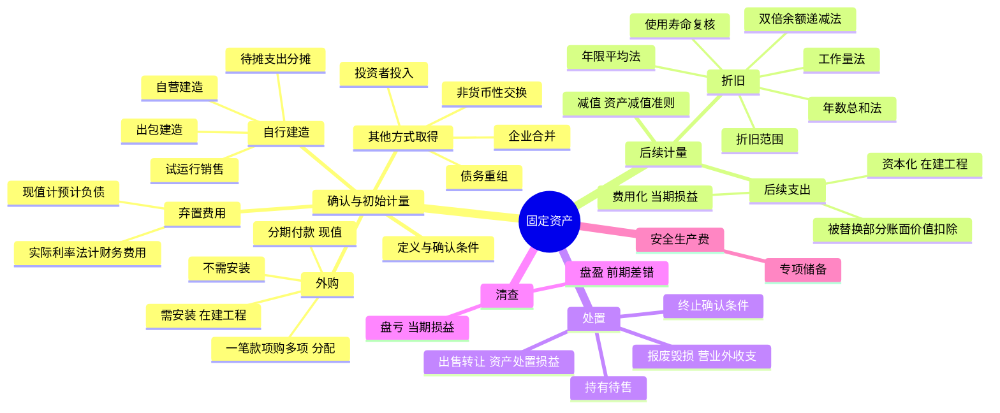

## 📍 章节定位

| 项目 | 信息 |
|------|------|
| **所属科目** | 📒 会计 |
| **难度等级** | ⭐⭐ |
| **历年分值** | 3-4分 |
| **建议学时** | 5-6h |

## 📝 考情分析

本章是会计科目基础章节，历年分值约 3-4 分。题型以客观题为主，主观题常结合借款费用、资产减值、会计政策变更、所得税在综合题中考查。命题热点集中在：固定资产初始计量（外购、自行建造、分期付款购买、存在弃置义务的固定资产）、折旧方法（年限平均法、工作量法、双倍余额递减法、年数总和法）的计算和折旧范围、资本化与费用化后续支出的区分（特别是被替换部分账面价值的扣除）、固定资产处置损益的归属科目（资产处置损益 vs 营业外收支）、固定资产清查（盘盈作为前期差错）。

近年新增考点：试运行销售相关收入和成本分别计入当期损益（不抵减固定资产成本）、安全生产费的会计处理（专项储备）、固定资产改造后使用寿命和折旧年限的复核变更、构成固定资产的各组成部分单独计提折旧。考生需重点掌握双倍余额递减法和年数总和法的计算规则，以及分期付款购买固定资产的现值计量和未确认融资费用分摊。

## 🧠 知识框架



## 📖 核心精讲

### 一、固定资产的确认和初始计量

#### （一）固定资产的定义与确认条件

**固定资产**，是指同时具有下列特征的有形资产：①为生产商品、提供劳务、出租或经营管理而持有；②使用寿命超过一个会计年度。

**特征**：
1. 持有目的不是直接用于出售（"出租"仅指机器设备类，不含建筑物——以经营租赁方式出租的建筑物属于投资性房地产）。
2. 使用寿命超过一个会计年度（属于长期资产）。
3. 是有形资产（与无形资产区别开）。

**确认条件**：①与该固定资产有关的经济利益很可能流入企业；②该固定资产的成本能够可靠地计量。

**特殊处理**：
- 构成固定资产的各组成部分，如果各自具有不同使用寿命或以不同方式为企业提供经济利益，适用不同折旧率或折旧方法的，应当**分别确认为单项固定资产**（如飞机的引擎与机身）。
- 由于安全或环保要求购入的设备，虽然不能直接带来未来经济利益，但有助于从其他相关资产使用中获得未来经济利益的，也应确认为固定资产。

#### （二）固定资产的初始计量

固定资产初始成本 = 企业为购建某项固定资产达到预定可使用状态前所发生的一切合理的、必要的支出。

**1. 外购固定资产的成本**

包括：购买价款、相关税费、运输费、装卸费、安装费和专业人员服务费等（达到预定可使用状态前），**不包括**按规定可以抵扣的增值税进项税额。

- 不需安装：购入即可使用 → 直接记"固定资产"。
- 需安装：通过"在建工程"核算，安装完毕达到预定可使用状态时转入"固定资产"。
- 一笔款项购入多项没有单独标价的资产：按各项固定资产**公允价值比例**对总成本进行分配。

**分期付款购买（具有融资性质）**：
- 固定资产成本 = 各期付款额的**现值**之和。
- 现值与应付金额的差额 = **未确认融资费用**。
- 折现率为反映当前市场货币时间价值和延期付款债务特定风险的利率（实质上是供货企业的必要报酬率）。
- 信用期间内未确认融资费用摊销：达到预定可使用状态前符合资本化条件的计入固定资产成本，其余计入财务费用。

会计分录：
```
借：固定资产/在建工程  （现值）
    未确认融资费用    （差额）
    贷：长期应付款      （应付款总额）
```

**2. 自行建造固定资产的成本**

由建造该项资产达到预定可使用状态前所发生的必要支出构成，包括工程用物资成本、人工成本、相关税费、应予资本化的借款费用以及应分摊的间接费用等。

- **自营建造**：按直接材料、直接人工、直接机械施工费等计量。
  - 建设期间工程物资盘亏、报废及毁损净损失计入工程项目成本；工程完工后的盘盈盘亏计入营业外收支。
  - 已达到预定可使用状态但尚未办理竣工决算的，按估计价值转入固定资产并计提折旧，办理竣工决算后按实际成本调整暂估价值，**但不调整原已计提的折旧额**。
- **出包建造**：成本由建筑工程支出、安装工程支出和待摊支出构成。待摊支出按各项工程支出比例分摊。
- **试运行销售**：固定资产达到预定可使用状态前产出的产品或副产品对外销售，应按收入准则和存货准则分别处理收入和成本，计入当期损益，**不得将净额冲减固定资产成本**。

**安全生产费的会计处理**：
- 提取时：计入相关产品成本或当期损益，同时贷记"专项储备"。
- 使用时（费用性支出）：直接冲减"专项储备"。
- 使用时（形成固定资产）：通过"在建工程"归集，达到预定可使用状态时确认固定资产，同时按固定资产成本冲减"专项储备"并确认相同金额的累计折旧，该固定资产以后期间**不再计提折旧**。
- "专项储备"期末余额在资产负债表所有者权益项下反映。

**3. 存在弃置义务的固定资产**

特殊行业的特定固定资产（如核电站核反应堆、矿山、油气井），确定初始成本时应考虑**弃置费用**。

- 弃置费用现值计入固定资产成本，同时确认**预计负债**。
- 使用寿命内按预计负债的摊余成本和实际利率计算确定的利息费用，计入**财务费用**。
- 弃置费用预计变动：减少以固定资产账面价值为限扣减成本，超出部分确认为当期损益；增加则增加固定资产成本。
- 一般工商企业的固定资产报废清理费用不属于弃置费用，作为固定资产处置费用处理。

**4. 其他方式取得**

- 投资者投入：投资合同或协议约定价值（不公允的按公允价值），差额计入资本公积。
- 非货币性资产交换、债务重组、企业合并：分别按相关准则确定成本，但后续计量执行固定资产准则。

### 二、固定资产的后续计量

#### （一）固定资产折旧

**影响因素**：固定资产原价、使用寿命、预计净残值、固定资产减值准备。

**计提折旧范围**：企业应当对所有固定资产计提折旧，但**已提足折旧仍继续使用**的固定资产和**单独计价入账的土地**除外。

**关键规则**：
- 当月增加的固定资产，当月不计提折旧，从下月起计提；当月减少的固定资产，当月仍计提折旧，从下月起不计提。
- 已达到预定可使用状态但尚未办理竣工决算的，按估计价值确定成本并计提折旧。
- 提足折旧后不论能否继续使用均不再计提；提前报废的不再补提。
- 闲置或退出活跃使用状态的固定资产仍应计提折旧（除非已提足）。

**折旧方法**：

| 方法 | 计算公式 | 特点 |
|------|---------|------|
| **年限平均法**（直线法） | 年折旧率 = (1 - 预计净残值率) / 预计使用寿命 × 100% | 每期折旧额相等 |
| **工作量法** | 单位工作量折旧额 = 原价 × (1 - 净残值率) / 预计总工作量 | 按实际工作量计提 |
| **双倍余额递减法** | 年折旧率 = 2 / 预计使用寿命 × 100%；月折旧额 = 期初净值 × 月折旧率 | **不考虑净残值**；最后两年改按年限平均法 |
| **年数总和法** | 年折旧率 = 尚可使用寿命 / 预计使用寿命年数总和 × 100%；月折旧额 = (原价 - 预计净残值) × 月折旧率 | 折旧基数固定为（原价-净残值） |

**双倍余额递减法举例**（原价 120 万元，使用寿命 5 年，净残值率 4%）：
- 年折旧率 = 2/5 = 40%
- 第 1 年：120 × 40% = 48 万元
- 第 2 年：(120 - 48) × 40% = 28.8 万元
- 第 3 年：(120 - 48 - 28.8) × 40% = 17.28 万元
- 第 4、5 年（改直线法）：(120 - 48 - 28.8 - 17.28 - 120×4%) / 2 = 10.56 万元

**复核**：至少每年年度终了对使用寿命、预计净残值和折旧方法进行复核，如有差异应作为**会计估计变更**处理。

**折旧的会计处理**：
- 基本生产车间 → 制造费用
- 管理部门 → 管理费用
- 销售部门 → 销售费用
- 自行建造固定资产使用 → 在建工程
- 经营租出 → 其他业务成本

#### （二）固定资产后续支出

**处理原则**：符合资本化条件的计入固定资产成本（同时扣除被替换部分账面价值）；不符合资本化条件的计入当期损益。

**资本化的后续支出**：
- 将固定资产原价、累计折旧、减值准备转销，账面价值转入"在建工程"，并**停止计提折旧**。
- 完工达到预定可使用状态时，从在建工程转入固定资产，按重新确定的原价、使用寿命、预计净残值和折旧方法计提折旧。
- **被替换部分**的账面价值应当扣除，避免成本重复计算。如老发动机的账面价值应从在建工程转出，报废则计入营业外支出。

**费用化的后续支出**：
- 与存货生产加工相关的固定资产日常修理费用，按存货成本确定原则处理。
- 行政管理部门、销售机构等发生的日常修理费用，计入管理费用或销售费用。

### 三、固定资产的处置

**终止确认条件**：①该固定资产处于处置状态；②该固定资产预期通过使用或处置不能产生经济利益。

**账务处理流程**（"固定资产清理"科目）：
1. 固定资产转入清理（账面价值转入固定资产清理）。
2. 发生清理费用（清理费用、相关税费）。
3. 出售收入和残料处理（冲减清理支出）。
4. 保险赔偿处理（冲减清理支出）。
5. 清理净损益处理：
   - 正常出售、转让的损失/收益 → **资产处置损益**
   - 自然灾害毁损、丧失使用功能报废的损失 → **营业外支出**
   - 报废清理的净收益 → **营业外收入**

### 四、固定资产的清查

- **盘盈**：作为**前期差错**处理，通过"以前年度损益调整"科目核算。
- **盘亏**：通过"待处理财产损溢"科目，报经批准后计入当期损益（营业外支出）。

## 💡 典型例题

**【例题 1】（计算题）**

甲公司某项设备原价为 120 万元，预计使用寿命为 5 年，预计净残值率为 4%。要求：分别按双倍余额递减法和年数总和法计算各年折旧额。

**答案**：

**双倍余额递减法**（年折旧率 40%）：
- 第 1 年：120 × 40% = 48 万元
- 第 2 年：(120 - 48) × 40% = 28.8 万元
- 第 3 年：(120 - 48 - 28.8) × 40% = 17.28 万元
- 第 4、5 年（改直线法）：(120 - 48 - 28.8 - 17.28 - 4.8) / 2 = 10.56 万元

**年数总和法**（年数总和 = 15，折旧基数 = 120 - 4.8 = 115.2 万元）：
- 第 1 年：115.2 × 5/15 = 38.4 万元
- 第 2 年：115.2 × 4/15 = 30.72 万元
- 第 3 年：115.2 × 3/15 = 23.04 万元
- 第 4 年：115.2 × 2/15 = 15.36 万元
- 第 5 年：115.2 × 1/15 = 7.68 万元

**解析**：双倍余额递减法初期不考虑净残值，按期初净值计算；最后两年改直线法时考虑净残值。年数总和法折旧基数固定为（原价 - 净残值），折旧率逐年递减。

**【例题 2】（综合题）**

某航空公司 2×20 年 12 月购入一架飞机，总计花费 8000 万元（含发动机），发动机当时的购价为 500 万元。公司未将发动机作为单项固定资产核算。2×29 年初，公司更换一部新发动机，新发动机购价 700 万元，另支付安装费用 5.1 万元。假定飞机年折旧率为 3%，不考虑相关税费。

要求：计算新发动机安装完毕后固定资产的入账价值。

**答案**：6405.1 万元

**解析**：
- 2×29 年初飞机累计折旧 = 8000 × 3% × 8 = 1920 万元，账面价值 = 8000 - 1920 = 6080 万元。
- 老发动机账面价值 = 500 - 500 × 3% × 8 = 380 万元，应终止确认（报废无残值，计入营业外支出）。
- 新发动机安装完毕后固定资产入账价值 = 6080 + 700 + 5.1 - 380 = 6405.1（万元）。

**【例题 3】（特殊行业弃置费用）**

乙公司 2×22 年 1 月 1 日建造完成核电站核反应堆并交付使用，建造成本 2500000 万元，预计使用寿命 40 年。根据法律规定，使用期满需将其拆除并整治污染，预计发生弃置费用 250000 万元，适用折现率 10%。

要求：计算固定资产的初始入账成本及第 1 年应负担的利息费用。

**答案**：
- 弃置费用现值 = 250000 × (P/F, 10%, 40) = 250000 × 0.0221 = 5525 万元
- 固定资产初始成本 = 2500000 + 5525 = 2505525 万元
- 第 1 年利息费用 = 5525 × 10% = 552.5 万元

**解析**：特殊行业特定固定资产应将弃置费用按现值计入固定资产成本并确认预计负债；后续按实际利率法计算利息费用计入财务费用，同时增加预计负债账面价值。

## 🎯 记忆口诀

- **固定资产特征**："持有一年以上有形"——持有目的非出售、寿命超一年、有实物形态。
- **折旧四方法**："平均工作量双倍年数"——双倍余额递减最后两年改直线，年数总和基数固定为（原价-净残值）。
- **当月增减折旧规则**："当月增加下月提，当月减少当月提"——简化核算规则。
- **后续支出**："资本化转在建工程并停折旧，费用化直接计入损益"——资本化要扣除被替换部分账面价值。
- **处置损益归属**："出售转让资产处置损益，报废毁损营业外收支"——关键看是否为正常处置。
- **盘盈盘亏**："盘盈前期差错，盘亏当期损益"——固定资产盘盈走以前年度损益调整。

## ✅ 同步练习

1. （基础题）企业外购需安装固定资产的入账成本构成？提示：参见《必刷 550 题》第三章基础题。
2. （进阶题）分期付款购买固定资产的现值计算及未确认融资费用分摊。提示：参见教材例 3-2。
3. （易错题）双倍余额递减法和年数总和法下各年折旧额计算，注意最后两年处理。提示：参见教材例 3-4、3-5。
4. （综合题）固定资产更新改造，被替换部分账面价值的扣除处理。提示：参见教材例 3-9 飞机发动机更换。
5. （特殊业务）存在弃置费用的固定资产初始计量及后续利息费用处理。提示：参见教材例 3-3 核反应堆。
