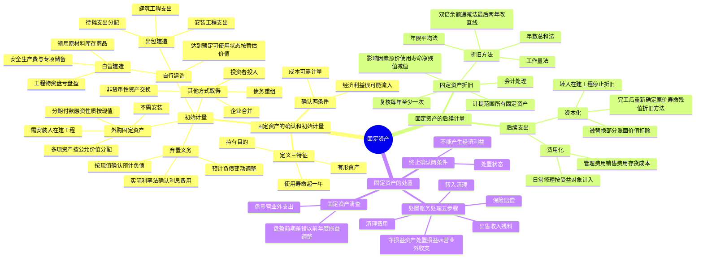

## 1. 章节定位

| 项目 | 信息 |
|------|------|
| 所属科目 | 会计 |
| 难度等级 | 3 |
| 历年分值 | 4-6 分 |
| 建议学时 | 6-8 小时 |
| 知识关联章节 | 第2章 存货（工程物资、周转材料区分）、第4章 无形资产（土地使用权）、第5章 投资性房地产、第7章 资产减值、第11章 借款费用、第15章 持有待售、第17章 收入（试运行销售）、第19章 所得税（折旧差异）、第20章 非货币性资产交换、第24章 会计估计变更 |

## 2. 考情分析

本章是会计科目的基础重难点章节，固定资产作为资产负债表的重要项目，是后续折旧、减值、所得税、合并报表等章节的基础。客观题与主观题均有涉及，主观题常以更新改造、折旧计算、处置损益为核心。

**命题规律**：客观题集中在固定资产的范围、确认条件、折旧方法的特点、后续支出的资本化条件；主观题集中在固定资产的初始计量（含分期付款、弃置费用）、折旧计算、更新改造后的账面价值与折旧、处置损益的计算。

**高频考点分布**：

1. **固定资产的定义与确认条件**：三个特征（持有目的、使用寿命超过一个会计年度、有形资产）；确认条件（经济利益很可能流入、成本能够可靠计量）；组成部分独立确认为单项固定资产；安全或环保设备确认为固定资产。
2. **外购固定资产的成本**：购买价款、相关税费、运输费、装卸费、安装费、专业人员服务费；以一笔款项购入多项没有单独标价资产的分配；分期付款购买具有融资性质的处理（按现值确认成本、未确认融资费用按实际利率法摊销）。
3. **自行建造固定资产的成本**：自营建造（工程物资盘亏盘盈的处理、领用原材料库存商品、安全生产费与专项储备）、出包建造（建筑工程支出、安装工程支出、待摊支出的分配）。
4. **存在弃置义务的固定资产**：按现值确认固定资产成本和预计负债、按实际利率法确认利息费用、预计负债变动的调整原则。
5. **固定资产折旧**：影响折旧的因素（原价、使用寿命、预计净残值、减值准备）；计提范围；折旧方法（年限平均法、工作量法、双倍余额递减法、年数总和法）；复核（每年至少一次）；会计处理。
6. **固定资产后续支出**：资本化条件（更新改造、被替换部分账面价值扣除、转在建工程停止折旧）；费用化处理（日常修理费用按受益对象计入管理费用、销售费用或存货成本）。
7. **固定资产处置**：终止确认的两个条件；处置损益的区分（正常出售转让→资产处置损益；报废毁损→营业外收支）；固定资产清理的账务处理步骤。
8. **固定资产清查**：盘盈作为前期差错处理（通过"以前年度损益调整"科目）；盘亏计入营业外支出。

**联动考查方式**：
- 与所得税结合：折旧方法、预计净残值的差异产生暂时性差异；
- 与会计估计变更结合：使用寿命、预计净残值、折旧方法的变更；
- 与差错更正结合：错将资本化后续支出费用化、错将费用化支出资本化；
- 与合并报表结合：内部交易固定资产的抵销；
- 与持有待售结合：划分为持有待售时停止计提折旧；
- 与借款费用结合：达到预定可使用状态前的借款费用资本化。

**备考建议**：
- 牢记"达到预定可使用状态"是固定资产初始计量的关键时点——之前发生的支出计入成本，之后计入当期损益；
- 区分"测试固定资产可否正常运转的支出"（资本化）与"试运行销售"（按收入准则处理，计入当期损益）；
- 牢记弃置费用按现值确认预计负债，按实际利率法确认利息费用；
- 牢记双倍余额递减法最后两年改为年限平均法；
- 牢记更新改造中被替换部分的账面价值应当扣除（防止成本重复计算）；
- 牢记正常出售转让的处置损益计入"资产处置损益"，报废毁损的损失计入"营业外支出"。

## 3. 知识框架



## 4. 核心精讲

### 4.1 固定资产的定义和确认条件

#### 4.1.1 固定资产的定义

**固定资产**，是指同时具有下列特征的有形资产：①为生产商品、提供劳务、出租或经营管理而持有；②使用寿命超过一个会计年度。

固定资产具有以下**三个特征**：

| 特征 | 说明 | 注意事项 |
|------|------|---------|
| 为生产商品、提供劳务、出租或经营管理而持有 | 企业持有的固定资产是劳动工具或手段，而不是直接用于出售的产品 | "出租"的固定资产是指用于出租的**机器设备类**固定资产，**不包括**出租的建筑物（以经营租赁方式出租的建筑物属于投资性房地产） |
| 使用寿命超过一个会计年度 | 固定资产属于长期资产，随使用和磨损通过计提折旧逐渐减少账面价值 | 使用寿命可按预计期间或按所能生产产品或提供劳务的数量表示（如发电设备按预计发电量，汽车按预计行驶里程） |
| 有形资产 | 固定资产具有实物特征，与无形资产区别开来 | 工业企业所持有的工具、用具、备品备件、维修设备，施工企业的模板、挡板、架料等周转材料，地质勘探企业的管材等，通常确认为存货；但符合固定资产定义和确认条件的（如民用航空运输的高价周转件），应当确认为固定资产 |

**组成部分独立确认为单项固定资产**：构成固定资产的各组成部分，如果各自具有不同使用寿命或者以不同方式为企业提供经济利益，适用不同折旧率或折旧方法的，企业应当分别将各组成部分确认为单项固定资产（如飞机的引擎与飞机机身具有不同使用寿命，应分别确认）。

**安全或环保设备**：企业由于安全或环保的要求购入设备等，虽然不能直接给企业带来未来经济利益，但有助于企业从其他相关资产的使用中获得未来经济利益，也应确认为固定资产。

#### 4.1.2 固定资产的确认条件

固定资产在符合定义的前提下，应当**同时满足以下两个条件**，才能加以确认：

1. 与该固定资产有关的经济利益**很可能**流入企业；
2. 该固定资产的成本能够**可靠地计量**。

**注意**：已达到预定可使用状态但尚未办理竣工决算的固定资产，需要根据工程预算、造价或者工程实际发生的成本等资料，按估计价值确定其成本，办理竣工决算后再按实际成本调整原来的暂估价值。

### 4.2 固定资产的初始计量

固定资产的初始计量是指确定固定资产的取得成本。**取得成本包括企业为购建某项固定资产达到预定可使用状态前所发生的一切合理的、必要的支出**。

#### 4.2.1 外购固定资产的成本

外购固定资产的成本，包括购买价款、相关税费、使固定资产达到预定可使用状态前所发生的可归属于该项资产的运输费、装卸费、安装费和专业人员服务费等，**不包括**按规定可以抵扣的增值税进项税额。

| 类型 | 成本构成 |
|------|---------|
| 不需安装的固定资产 | 实际支付的购买价款、包装费、运杂费、保险费、专业人员服务费和相关税费（不含可抵扣增值税进项税额）等，直接计入"固定资产"科目 |
| 需安装的固定资产 | 在前者基础上加上安装调试成本，先通过"在建工程"科目归集，安装完毕达到预定可使用状态时转入"固定资产"科目 |

**以一笔款项购入多项没有单独标价的资产**：应将各项资产单独确认为固定资产，并按各项固定资产**公允价值的比例**对总成本进行分配，分别确定各项固定资产的成本。如果购入的多项资产中还包括固定资产以外的其他资产，也应按类似方法处理。

**具有融资性质的分期付款购买**：企业购买固定资产通常在正常信用条件期限内付款，但若超过正常信用条件购买（如采用分期付款方式且付款期限较长），购货合同实质上具有融资性质，购入固定资产的成本**不能以各期付款额之和确定**，而应以**各期付款额的现值之和**确定。

**账务处理**：购入固定资产时，按购买价款的现值，借记"固定资产"或"在建工程"科目，按应支付的金额，贷记"长期应付款"科目，按其差额，借记"未确认融资费用"科目。

**未确认融资费用的摊销**：各期实际支付的价款之和与其现值之间的差额，在达到预定可使用状态之前符合借款费用资本化条件的，通过在建工程计入固定资产成本；其余部分在信用期间内按**实际利率法**确认为财务费用，计入当期损益。

**折现率**：反映当前市场货币时间价值和延期付款债务特定风险的利率，实质上是供货企业的必要报酬率。

#### 4.2.2 自行建造固定资产的成本

自行建造固定资产的成本，由建造该项资产达到预定可使用状态前所发生的必要支出构成，包括工程用物资成本、人工成本、缴纳的相关税费、应予资本化的借款费用以及应分摊的间接费用等。

**测试固定资产可否正常运转而发生的支出**属于固定资产达到预定可使用状态前的必要支出，应当计入固定资产成本。测试固定资产可否正常运转，指评估该固定资产的技术和物理性能是否达到生产产品、提供服务、对外出租或用于管理等标准的活动，**不包括评估固定资产的财务业绩**。

**试运行销售**：企业将固定资产达到预定可使用状态前产出的产品或副产品对外销售（包括测试固定资产可否正常运转时产出的样品等情形），应当按照收入准则和存货准则的规定，对试运行销售相关的收入和成本分别进行会计处理，计入当期损益，**不应将试运行销售相关收入抵销相关成本后的净额冲减固定资产成本**。试运行产出的产品或副产品在对外销售前符合存货规定的，应当确认为存货。企业应当判断试运行销售是否属于日常活动，属于日常活动的在"营业收入"和"营业成本"项目列示；属于非日常活动的在"资产处置收益"等项目列示。

**（1）自营方式建造固定资产**

企业以自营方式建造固定资产，其成本应当按照**直接材料、直接人工、直接机械施工费**等计量。

| 项目 | 处理 |
|------|------|
| 工程物资 | 按实际支付的买价、运输费、保险费等相关税费作为实际成本；工程完工后剩余工程物资转为本企业存货的，按实际成本或计划成本结转 |
| 建设期间工程物资盘亏、报废及毁损 | 减去残料价值以及保险公司、过失人等赔款后的**净损失计入所建工程项目成本** |
| 建设期间工程物资盘盈或处置净收益 | **冲减所建工程项目的成本** |
| 工程完工后发生的工程物资盘盈、盘亏、报废、毁损 | 计入当期**营业外收支** |
| 建造固定资产领用工程物资、原材料或库存商品 | 按其实际成本转入所建工程项目的成本 |
| 职工薪酬、辅助生产部门提供的水电气修理运输等劳务 | 计入所建工程项目的成本 |
| 符合资本化条件的借款费用 | 按借款费用准则处理 |

**已达预定可使用状态但未办理竣工决算**：应当自达到预定可使用状态之日起，根据工程预算、造价或者工程实际成本等，按暂估价值转入固定资产，并按有关规定计提折旧。待办理竣工决算手续后再按实际成本调整原来的暂估价值，但**不需要调整原已计提的折旧额**。

**安全生产费与专项储备**：企业按照国家规定提取的安全生产费，应当计入相关产品的成本或当期损益，同时记入"专项储备"科目。使用时：①属于费用性支出的，直接冲减"专项储备"科目；②形成固定资产的，通过"在建工程"科目归集所发生的支出，待安全项目完工达到预定可使用状态时确认为固定资产；同时按照形成固定资产的成本冲减"专项储备"科目，并确认相同金额的累计折旧，该固定资产在以后期间**不再计提折旧**。"专项储备"科目期末余额在资产负债表所有者权益项下的"专项储备"项目反映。

**（2）出包方式建造固定资产**

出包方式下，企业通过招标方式将工程项目发包给建造承包商。其成本由建造该项固定资产达到预定可使用状态前所发生的必要支出构成，包括建筑工程支出、安装工程支出以及需分摊计入各固定资产价值的待摊支出。

| 支出类型 | 内容 |
|---------|------|
| 建筑工程、安装工程支出 | 按合同规定的结算方式和工程进度定期与建造承包商办理工程价款结算，结算的工程价款计入在建工程成本 |
| 待摊支出 | 在建设期间发生的、不能直接计入某项固定资产价值而应由所建造固定资产共同负担的相关费用，包括为建造工程发生的管理费、可行性研究费、临时设施费、公证费、监理费、应负担的税金、符合资本化条件的借款费用、建设期间发生的工程物资盘亏、报废及毁损净损失、负荷联合试车费等 |

**重要原则**：企业为建造固定资产通过出让方式取得土地使用权而支付的土地出让金**不计入**在建工程成本，应确认为**无形资产**（土地使用权）。

**待摊支出的分配**：在建工程达到预定可使用状态时，首先计算分配待摊支出。

```
待摊支出分配率 = 累计发生的待摊支出 ÷（建筑工程支出 + 安装工程支出 + 在安装设备支出）× 100%
某工程应分摊的待摊支出 = 该工程的（建筑工程支出 + 安装工程支出 + 在安装设备支出）× 分配率
```

**已完工固定资产成本**：

- 房屋、建筑物等固定资产成本 = 建筑工程支出 + 应分摊的待摊支出
- 需要安装设备的成本 = 设备成本 + 为设备安装发生的基础、支座等建筑工程支出 + 安装工程支出 + 应分摊的待摊支出

#### 4.2.3 其他方式取得固定资产的成本

| 取得方式 | 入账价值 |
|---------|---------|
| 投资者投入 | 按投资合同或协议约定的价值加上应支付的相关税费作为入账价值，但合同或协议约定价值不公允的除外；约定价值不公允的，按固定资产的公允价值作为入账价值，公允价值与约定价值的差额计入资本公积 |
| 非货币性资产交换 | 按非货币性资产交换准则的规定确定（后续计量和披露执行固定资产准则） |
| 债务重组 | 按债务重组准则的规定确定 |
| 企业合并 | 按企业合并准则的规定确定 |

#### 4.2.4 存在弃置义务的固定资产

对于特殊行业的特定固定资产（如核电站核反应堆、石油天然气开采设施等），确定其初始成本时，还应考虑**弃置费用**。弃置费用通常是指根据国家法律和行政法规、国际公约等规定，企业承担的环境保护和生态恢复等义务所确定的支出。

**初始确认**：由于弃置费用的金额与其现值比较差额通常较大，需要考虑货币时间价值。企业应当根据或有事项准则，按照现值计算确定应计入固定资产成本的金额和相应的预计负债。

**后续计量**：确认弃置费用形成的预计负债后，在固定资产的使用寿命内按照预计负债的**摊余成本**和**实际利率**计算确定的利息费用应当在发生时计入**财务费用**。

**预计负债变动的调整原则**：由于技术进步、法律要求或市场环境变化等原因，特定固定资产的履行弃置义务可能发生支出金额、预计弃置时点、折现率等变动而引起预计负债变动，应按以下原则调整该固定资产的成本：

| 变动方向 | 调整原则 |
|---------|---------|
| 预计负债减少 | 以该固定资产账面价值为限扣减固定资产成本；如果预计负债的减少额超过该固定资产账面价值，超出部分确认为当期损益 |
| 预计负债增加 | 增加该固定资产的成本 |

按照上述原则调整的固定资产，在资产**剩余使用年限内**计提折旧。一旦该固定资产的使用寿命结束，预计负债的所有后续变动应在发生时确认为损益。

**注意**：一般工商企业的固定资产发生的报废清理费用**不属于弃置费用**，应当在发生时作为固定资产处置费用处理。

### 4.3 固定资产折旧

#### 4.3.1 固定资产折旧的定义

**折旧**，是指在固定资产的使用寿命内，按照确定的方法对应计折旧额进行的系统分摊。

**应计折旧额** = 固定资产原价 − 预计净残值 − 已计提的固定资产减值准备累计金额。

#### 4.3.2 影响固定资产折旧的因素

| 因素 | 说明 |
|------|------|
| 固定资产原价 | 固定资产的成本 |
| 使用寿命 | 企业使用固定资产的预计期间，或该固定资产所能生产产品或提供劳务的数量。确定时考虑：①预计生产能力或实物产量；②预计有形损耗（正常使用和自然力作用引起的价值损失）；③预计无形损耗（技术进步和劳动生产率提高带来的价值损失）；④法律或者类似规定对该项资产使用的限制 |
| 预计净残值 | 假定固定资产预计使用寿命已满并处于使用寿命终了时的预期状态，企业目前从该项资产处置中获得的扣除预计处置费用后的金额 |
| 固定资产减值准备 | 已计提的减值准备累计金额。计提减值准备后，应在剩余使用寿命内根据调整后的固定资产账面价值和预计净残值重新计算确定折旧率和折旧额 |

#### 4.3.3 计提折旧的固定资产范围

企业应当对**所有的固定资产**计提折旧，但是，已提足折旧仍继续使用的固定资产和单独计价入账的土地除外。

**注意事项**：

1. 固定资产应当按月计提折旧，并根据用途计入相关资产的成本或者当期损益。固定资产应自达到预定可使用状态时开始计提折旧，终止确认时或划分为持有待售非流动资产时**停止计提折旧**。如果固定资产并未终止确认或划分为持有待售非流动资产，但处于闲置状态或处于退出活跃的使用状态时，**仍应计提折旧**，除非该固定资产已提足折旧。为简化核算，**当月增加的固定资产，当月不计提折旧，从下月起计提折旧；当月减少的固定资产，当月仍计提折旧，从下月起不计提折旧**。
2. 固定资产提足折旧后，不论能否继续使用，均不再计提折旧；提前报废的固定资产也不再补提折旧。
3. 已达到预定可使用状态但尚未办理竣工决算的固定资产，应当按照估计价值确定其成本，并计提折旧；待办理竣工决算后再按实际成本调整原来的暂估价值，但**不需要调整原已计提的折旧额**。

#### 4.3.4 固定资产折旧方法

企业应当根据与固定资产有关的经济利益的**预期消耗方式**合理选择折旧方法。可选用的折旧方法包括年限平均法、工作量法、双倍余额递减法和年数总和法等。固定资产的折旧方法一经确定，不得随意变更。

**重要原则**：企业在确定固定资产折旧方法时，应当根据与固定资产有关的经济利益的预期消耗方式作出决定。由于收入可能受到投入、生产过程、销售等因素的影响，这些因素与固定资产有关经济利益的预期消耗方式无关。因此，企业**不应以包括使用固定资产在内的经济活动所产生的收入为基础计提折旧**。

| 方法 | 计算公式 | 特点 |
|------|---------|------|
| **年限平均法**（直线法） | 年折旧率 =（1 − 预计净残值率）÷ 预计使用寿命（年）× 100%；月折旧率 = 年折旧率 ÷ 12；月折旧额 = 固定资产原价 × 月折旧率 | 每期折旧额均相等；不考虑不同使用年限提供的经济效益不同、维修费用递增等因素 |
| **工作量法** | 单位工作量折旧额 = 固定资产原价 ×（1 − 预计净残值率）÷ 预计总工作量；月折旧额 = 当月工作量 × 单位工作量折旧额 | 假定固定资产价值的降低不是由于时间的推移，而是由于使用 |
| **双倍余额递减法** | 年折旧率 = 2 ÷ 预计使用寿命（年）× 100%；月折旧率 = 年折旧率 ÷ 12；月折旧额 = 固定资产净值 × 月折旧率；**折旧年限到期前两年内**，将固定资产净值扣除预计净残值后的余额平均摊销 | 不考虑预计净残值（最后两年除外）；加速折旧法 |
| **年数总和法** | 年折旧率 = 尚可使用寿命 ÷ 预计使用寿命的年数总和 × 100%；月折旧率 = 年折旧率 ÷ 12；月折旧额 =（固定资产原价 − 预计净残值）× 月折旧率 | 考虑预计净残值；加速折旧法 |

**双倍余额递减法例题**：设备原价120万元，预计使用寿命5年，预计净残值率4%。

- 年折旧率 = 2 ÷ 5 × 100% = 40%
- 第1年折旧额 = 120 × 40% = 48（万元）
- 第2年折旧额 =（120 − 48）× 40% = 28.8（万元）
- 第3年折旧额 =（120 − 48 − 28.8）× 40% = 17.28（万元）
- 第4、5年折旧额 =（120 − 48 − 28.8 − 17.28 − 120 × 4%）÷ 2 = 10.56（万元）

**加速折旧法的特点**：在固定资产使用的早期多提折旧，后期少提折旧，递减速度逐年加快，目的是使固定资产成本在估计使用寿命内加快得到补偿。

#### 4.3.5 固定资产折旧的会计处理

计提的折旧应通过"累计折旧"科目核算，并根据用途计入相关资产的成本或者当期损益：

| 用途 | 计入科目 |
|------|---------|
| 基本生产车间使用的固定资产 | 制造费用 |
| 管理部门使用的固定资产 | 管理费用 |
| 销售部门使用的固定资产 | 销售费用 |
| 自行建造固定资产过程中使用的固定资产 | 在建工程成本 |
| 经营租出的固定资产 | 其他业务成本 |

#### 4.3.6 固定资产使用寿命、预计净残值和折旧方法的复核

企业**至少应当于每年年度终了**，对固定资产的使用寿命、预计净残值和折旧方法进行复核：

- **使用寿命**：如有确凿证据表明预计数与原先估计数有差异，应当调整固定资产使用寿命；
- **预计净残值**：如有确凿证据表明预计数与原先估计数有差异，应当调整预计净残值；
- **折旧方法**：与固定资产有关的经济利益的预期消耗方式发生重大改变时，应相应改变折旧方法。

上述改变应作为**会计估计变更**，按照《企业会计准则第28号——会计政策、会计估计变更和差错更正》处理。

### 4.4 固定资产的后续支出

**后续支出**是指固定资产使用过程中发生的更新改造支出、修理费用等。处理原则：符合资本化条件的，应当计入固定资产成本或其他相关资产的成本，同时将被替换部分的账面价值扣除；不符合资本化条件的，应当计入当期损益。

#### 4.4.1 资本化的后续支出

固定资产发生可资本化的后续支出时，企业一般应将该固定资产的原价、已计提的累计折旧和减值准备转销，将固定资产的账面价值转入**在建工程**，并在此基础上重新确定固定资产原价。当固定资产转入在建工程时，应**停止计提折旧**。在后续支出完工并达到预定可使用状态时，再从在建工程转为固定资产，并按重新确定的固定资产原价、使用寿命、预计净残值和折旧方法计提折旧。

**被替换部分账面价值的扣除**：企业发生的某些固定资产后续支出可能涉及替换原固定资产的某组成部分，当发生的后续支出符合固定资产确认条件时，应将其计入固定资产成本，同时**将被替换部分的账面价值扣除**，避免将替换部分的成本和被替换部分的成本同时计入固定资产成本导致重复计算。

**重要原则**：企业对固定资产进行定期检查发生的大修理费用，有确凿证据表明符合资本化条件的部分，可以计入固定资产成本或其他相关资产的成本；不符合资本化条件的，应当费用化，计入当期损益。

#### 4.4.2 费用化的后续支出

不符合资本化后续支出条件的固定资产日常修理费用，在发生时应当按照**受益对象**计入当期损益或相关资产成本：

| 用途 | 处理 |
|------|------|
| 与存货的生产和加工相关的固定资产日常修理费用 | 按存货准则规定的存货成本确定原则处理（计入存货成本） |
| 行政管理部门发生的固定资产日常修理费用 | 管理费用 |
| 企业专设的销售机构发生的固定资产日常修理费用 | 销售费用 |

### 4.5 固定资产的处置

#### 4.5.1 固定资产终止确认的条件

固定资产满足下列条件**之一**的，应当予以终止确认：

1. **该固定资产处于处置状态**：包括将固定资产划分为持有待售类别，以及出售、转让、报废或毁损、对外投资、非货币性资产交换、债务重组等；
2. **该固定资产预期通过使用或处置不能产生经济利益**：不再符合固定资产的定义和确认条件。

#### 4.5.2 固定资产处置的账务处理

企业出售、转让划分为持有待售类别的固定资产或处置组，按照持有待售准则处理；未划分为持有待售类别而出售、转让的固定资产，通过"**固定资产清理**"科目归集所发生的损益，将处置收入扣除账面价值和相关税费后产生的利得或损失转入"**资产处置损益**"科目，计入当期损益；固定资产因报废或毁损等原因而终止确认的，通过"固定资产清理"科目归集所发生的损益，其产生的利得或损失计入**营业外收入或营业外支出**。

**固定资产清理的五步账务处理**：

| 步骤 | 内容 | 会计分录 |
|------|------|---------|
| 第一步 | 固定资产转入清理 | 借：固定资产清理（账面价值）、累计折旧、固定资产减值准备；贷：固定资产（账面余额） |
| 第二步 | 发生的清理费用 | 借：固定资产清理；贷：银行存款、应交税费等 |
| 第三步 | 出售收入和残料处理 | 借：银行存款、原材料等；贷：固定资产清理、应交税费——应交增值税（销项税额）等 |
| 第四步 | 保险赔偿的处理 | 借：其他应收款、银行存款等；贷：固定资产清理 |
| 第五步 | 清理净损益的处理 | 正常出售、转让的损失：借：资产处置损益，贷：固定资产清理；自然灾害毁损、已丧失使用功能报废清理的损失：借：营业外支出——非流动资产毁损报废损失，贷：固定资产清理。净收益作相反分录 |

**关键区分**：

| 处置类型 | 损益科目 |
|---------|---------|
| 正常出售、转让 | 资产处置损益 |
| 自然灾害毁损、已丧失使用功能报废清理 | 营业外收入或营业外支出 |

#### 4.5.3 固定资产的清查

企业应当定期或者至少每年年末对固定资产进行清查盘点。

**（1）固定资产盘盈的会计处理**

企业在财产清查中盘盈的固定资产，作为**前期差错**处理。在按管理权限报经批准处理前应先通过"**以前年度损益调整**"科目核算，并按照《企业会计准则第28号——会计政策、会计估计变更和差错更正》进行会计处理。

**（2）固定资产盘亏的会计处理**

固定资产盘亏造成的损失，应当计入当期损益。

- 发现盘亏时：借记"待处理财产损溢——待处理固定资产损溢"科目、"累计折旧"科目、"固定资产减值准备"科目，贷记"固定资产"科目；
- 报经批准后处理时：按可收回的保险赔偿或过失人赔偿，借记"其他应收款"科目，按应计入营业外支出的金额，借记"营业外支出——盘亏损失"科目，贷记"待处理财产损溢"科目。

## 5. 典型例题

**【例题 1】（分期付款购买固定资产）**

甲公司2×15年1月1日从乙公司购入一台需要安装的特大型设备。合同约定，甲公司采用分期付款方式支付价款。该设备价款共计900万元（不考虑增值税），在2×15年至2×19年的5年内每半年支付90万元，每年的付款日期分别为当年6月30日和12月31日。2×15年1月1日设备运抵并开始安装，2×15年12月31日达到预定可使用状态，发生安装费398 530.60元。假定甲公司适用的6个月折现率为10%。（P/A，10%，10）= 6.1446。

要求：计算固定资产的入账成本，并编制2×15年1月1日、2×15年6月30日、2×15年12月31日有关会计分录。

**答案**：

（1）购买价款的现值 = 90 ×（P/A，10%，10）= 90 × 6.1446 = 553.014（万元）

（2）2×15年1月1日：

借：在建工程 5 530 140
　　未确认融资费用 3 469 860
　　贷：长期应付款——乙公司 9 000 000

（3）2×15年6月30日（确认融资费用，并支付价款）：

借：在建工程 553 014
　　贷：未确认融资费用 553 014

借：长期应付款——乙公司 900 000
　　贷：银行存款 900 000

（4）2×15年12月31日：

借：在建工程 518 315.40
　　贷：未确认融资费用 518 315.40

借：长期应付款——乙公司 900 000
　　贷：银行存款 900 000

借：在建工程 398 530.60
　　贷：银行存款等 398 530.60

固定资产成本 = 5 530 140 + 553 014 + 518 315.40 + 398 530.60 = **7 000 000（元）**

借：固定资产 7 000 000
　　贷：在建工程 7 000 000

**解析**：分期付款购买具有融资性质的，固定资产成本按购买价款的现值确定；安装期间未确认融资费用的分摊额符合资本化条件，计入固定资产成本；达到预定可使用状态后未确认融资费用的分摊额计入财务费用。

**【例题 2】（更新改造与被替换部分账面价值扣除）**

某航空公司2×20年12月购入一架飞机，总计花费8 000万元（含发动机），发动机当时的购价为500万元。公司未将发动机作为一项单独的固定资产进行核算。2×29年初，公司决定更换一部性能更为先进的发动机。新发动机购价700万元，另需支付安装费用51 000元。假定飞机的年折旧率为3%，不考虑相关税费的影响。

要求：编制更换发动机的会计分录。

**答案**：

（1）2×29年初飞机累计折旧 = 80 000 000 × 3% × 8 = 19 200 000（元），固定资产转入在建工程：

借：在建工程——××飞机 60 800 000
　　累计折旧 19 200 000
　　贷：固定资产——××飞机 80 000 000

（2）安装新发动机：

借：在建工程——××飞机 7 051 000
　　贷：工程物资——××发动机 7 000 000
　　　　银行存款 51 000

（3）2×29年初老发动机的账面价值 = 5 000 000 − 5 000 000 × 3% × 8 = 3 800 000（元），终止确认老发动机的账面价值（假定报废处理，无残值）：

借：营业外支出 3 800 000
　　贷：在建工程——××飞机 3 800 000

（4）发动机安装完毕，投入使用。固定资产入账价值 = 60 800 000 + 7 051 000 − 3 800 000 = 64 051 000（元）：

借：固定资产——××飞机 64 051 000
　　贷：在建工程——××飞机 64 051 000

**解析**：固定资产后续支出涉及替换原组成部分时，应将被替换部分的账面价值从在建工程中扣除（计入营业外支出），避免成本重复计算。

**【例题 3】（双倍余额递减法折旧）**

甲公司某项设备原价为120万元，预计使用寿命为5年，预计净残值率为4%。甲公司未对该设备计提减值准备。

要求：分别按双倍余额递减法和年数总和法计算各年折旧额。

**答案**：

（1）双倍余额递减法（年折旧率 = 2/5 × 100% = 40%）：

| 年份 | 期初净值（万元） | 折旧额（万元） |
|------|----------------|--------------|
| 第1年 | 120 | 120 × 40% = 48 |
| 第2年 | 72 | 72 × 40% = 28.8 |
| 第3年 | 43.2 | 43.2 × 40% = 17.28 |
| 第4年 | 25.92 |（25.92 − 4.8）÷ 2 = 10.56 |
| 第5年 | — | 10.56 |

（2）年数总和法（年数总和 = 1+2+3+4+5 = 15；应计折旧额 = 120 ×（1−4%）= 115.2万元）：

| 年份 | 折旧率 | 折旧额（万元） |
|------|--------|--------------|
| 第1年 | 5/15 | 115.2 × 5/15 = 38.4 |
| 第2年 | 4/15 | 115.2 × 4/15 = 30.72 |
| 第3年 | 3/15 | 115.2 × 3/15 = 23.04 |
| 第4年 | 2/15 | 115.2 × 2/15 = 15.36 |
| 第5年 | 1/15 | 115.2 × 1/15 = 7.68 |

**解析**：双倍余额递减法按固定资产净值计算折旧（不考虑预计净残值），最后两年改为年限平均法并扣除预计净残值；年数总和法按固定资产原价减预计净残值计算，折旧率逐年递减。

## 6. 记忆口诀

**固定资产三特征**："持生用、超一年、有形资产"——为生产商品提供劳务出租或经营管理而持有、使用寿命超过一个会计年度、有形资产。

**出租固定资产范围**："机器设备类入固定资产，建筑物出租入投资性房地产"。

**确认条件两条件**："很可能流入、可靠计量"。

**初始计量原则**："达到预定可使用状态前一切合理必要支出计入成本"。

**外购固定资产成本**："价款税费运装专服，不含可抵扣增值税"——购买价款、相关税费、运输费、装卸费、安装费、专业人员服务费。

**多项资产购入分配**："按公允价值比例分配总成本"。

**分期付款购买**："现值计入成本，差额未确认融资费用，实际利率法摊销，安装期间资本化，达可使用后费用化"。

**自营工程物资盘亏盘盈**："建设期间入工程成本，完工后入营业外收支"。

**达可使用未竣工决算**："按暂估价值入固定资产计提折旧，竣工决算后调整暂估价值但不调整原折旧"。

**安全生产费专项储备**："提取入成本费用同时入专项储备，费用性支出直接冲减，形成固定资产确认等额累计折旧后不再计提"。

**待摊支出分配**："按建筑工程+安装工程+在安装设备支出比例分配"。

**土地出让金**："不计入工程成本，确认为无形资产"。

**试运行销售**："收入成本分别处理计入当期损益，不冲减固定资产成本"。

**弃置费用**："现值入固定资产和预计负债，实际利率法摊销计入财务费用；减少以账面价值为限扣减成本，增加加成本；剩余年限内计提折旧，寿命结束后续变动入损益"。

**计提折旧范围**："所有固定资产，已提足仍使用和单独计价入账土地除外"。

**折旧起止时点**："达可使用状态开始，终止确认或划持有待售停止；闲置仍计提；当月增加下月提，当月减少当月提"。

**折旧方法四种**："年限平均、工作量、双倍余额递减、年数总和"——双倍余额递减法最后两年改为年限平均法。

**双倍余额递减法**："不考虑净残值（最后两年除外），按净值计算，最后两年改直线"。

**年数总和法**："考虑净残值，按原价减净残值乘以尚可寿命除年数总和"。

**折旧方法选择依据**："经济利益预期消耗方式，不以收入为基础"。

**复核**："每年至少一次，变更作为会计估计变更"。

**后续支出原则**："资本化转在建工程停折旧扣被替换部分账面价值，费用化按受益对象计入"。

**费用化后续支出**："存货相关入存货成本，行政入管理费用，销售机构入销售费用"。

**处置损益区分**："正常出售转让入资产处置损益，报废毁损入营业外收支"。

**固定资产清理五步骤**："转入清理、清理费用、出售收入残料、保险赔偿、净损益"。

**盘盈盘亏**："盘盈前期差错入以前年度损益调整，盘亏入营业外支出"。
