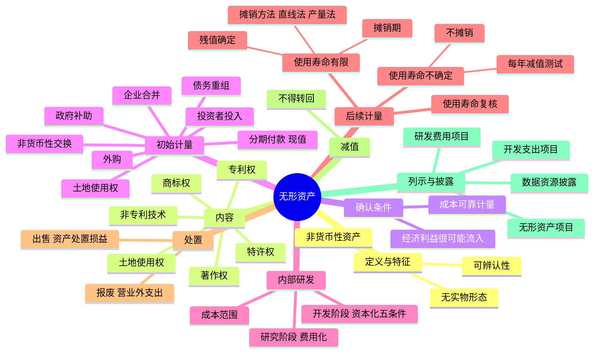

## 📍 章节定位

| 项目 | 信息 |
|------|------|
| **所属科目** | 📒 会计 |
| **难度等级** | ⭐⭐ |
| **历年分值** | 2-3分 |
| **建议学时** | 4-5h |

## 📝 考情分析

本章是会计科目基础章节，历年分值约 2-3 分，以客观题为主，主观题常结合非货币性资产交换、债务重组、所得税、企业合并等在综合题中考查。命题热点集中在：无形资产初始计量（外购、投资者投入、分期付款购买的现值计量）、内部研究开发支出的区分（研究阶段费用化 vs 开发阶段资本化的五项条件）、土地使用权与地上建筑物的处理、使用寿命有限与使用寿命不确定无形资产的后续计量差异（摊销 vs 不摊销但每年减值测试）、无形资产出售损益（资产处置损益）与报废损益（营业外支出）的区分。

近年新增考点：数据资源作为无形资产的确认和计量（外购数据资源的成本构成、数据资源研发支出的资本化条件、数据资源使用寿命的估计因素）、知识产权的额外披露要求。考生需重点掌握开发阶段资本化的五项条件，以及"内部开发无形资产成本仅包括满足资本化条件时点至达到预定用途前发生的支出，之前已费用化的支出不再调整"这一关键原则。

## 🧠 知识框架



## 📖 核心精讲

### 一、无形资产的确认和初始计量

#### （一）无形资产的定义与基本特征

**无形资产**，是指企业拥有或者控制的没有实物形态的可辨认非货币性资产。预计能为企业带来未来经济利益是作为一项资产的本质特征。企业拥有或控制无形资产，是指企业拥有该项无形资产的所有权，且该项无形资产能够为企业带来未来经济利益；但在某些情况下并不需要企业拥有其所有权，如果企业有权获得某项无形资产产生的经济利益，同时又能约束其他人获得这些经济利益，则说明企业控制了该无形资产。

无形资产具有以下三大特征：

**1. 不具有实物形态**：无形资产通常表现为某种权利、某项技术或某种获取超额利润的综合能力，如土地使用权、非专利技术等。某些无形资产的存在有赖于实物载体（如计算机软件存储在介质中），但这并不改变无形资产本身不具有实物形态的特性。判断包含无形和有形要素的资产属于固定资产还是无形资产，通常以哪个要素更重要为依据。例如，计算机控制的机械工具没有特定软件就不能运行时，该软件应作为固定资产处理；如果软件不是相关硬件不可缺少的组成部分，则应作为无形资产核算。

**2. 具有可辨认性**：要作为无形资产核算，该资产必须是能够区别于其他资产可单独辨认的。商誉由于不可辨认，不构成无形资产。符合以下条件之一的，认为其具有可辨认性：
- （1）能够从企业中分离或划分出来，并能单独用于出售或转让等，而不需要同时处置在同一获利活动中的其他资产；
- （2）产生于合同性权利或其他法定权利，无论这些权利是否可以从企业或其他权利或义务中转移或分离。

**注意**：客户关系、人力资源等，由于企业无法控制其带来的未来经济利益，不符合无形资产定义；内部产生的品牌、报刊名、刊头、客户名单等，由于不能与整个业务开发成本区分开来，也不应确认为无形资产。

**3. 属于非货币性资产**：无形资产由于没有发达的交易市场，一般不容易转化成现金，在持有过程中为企业带来未来经济利益的情况不确定，属于非货币性资产。

#### （二）无形资产的内容

| 类别 | 说明 | 期限 |
|------|------|------|
| **专利权** | 发明创造专利申请人在法定期限内享有的专有权利 | 发明专利 20 年；实用新型 10 年；外观设计 15 年（自申请日起） |
| **非专利技术** | 不为外界所知、不享有法律保护、可带来经济效益的各种技术和诀窍 | 用自我保密方式维持独占性 |
| **商标权** | 在指定商品或服务上使用特定名称或图案的权利 | 注册商标有效期 10 年，续展每次 10 年 |
| **著作权** | 作者对其创作的文学、科学和艺术作品依法享有的特殊权利 | 公民作品相关权利保护期为作者终生及死亡后 50 年 |
| **特许权** | 在某一地区经营或销售某种特定商品的权利 | 政府授权或企业间合同约定 |
| **土地使用权** | 国家准许某企业在一定期间内对国有土地享有开发、利用、经营的权利 | 行政划拨、外购、投资者投入等取得方式 |

#### （三）无形资产的确认条件

无形资产应当在符合定义的前提下，同时满足以下两个确认条件时，才能予以确认：
1. **与该无形资产有关的经济利益很可能流入企业**：企业应当对无形资产在预计使用寿命内可能存在的各种经济因素作出合理估计，并且应当有明确证据支持。
2. **该无形资产的成本能够可靠地计量**：如企业内部产生的品牌、报刊名等，因其成本无法可靠计量，不作为无形资产确认。

企业无形项目的支出，除下列情形外，均应于发生时计入当期损益：（1）符合无形资产定义及确认条件的，构成无形资产成本的部分；（2）非同一控制下企业合并中取得的、不能单独确认为无形资产、构成购买方确认的商誉的部分。

#### （四）无形资产的初始计量

无形资产通常按实际成本计量，即以取得无形资产并使之达到预定用途而发生的相关支出作为成本。

**1. 外购的无形资产成本**

外购无形资产成本 = 购买价款 + 相关税费 + 直接归属于使该项资产达到预定用途所发生的其他支出（专业服务费、测试费等）。

**不包括**在初始成本中的项目：
- 为引入新产品进行宣传发生的广告费、管理费用及其他间接费用；
- 无形资产达到预定用途以后发生的费用（如定期发生的安全管理支出）；
- 在形成预定经济规模之前发生的初始运作损失。

**分期付款购买**：如果购入的无形资产超过正常信用条件延期支付价款，实质上具有融资性质的，无形资产的成本为购买价款的**现值**。各期实际支付的价款与购买价款的现值之间的差额，符合借款费用资本化条件的计入无形资产成本，其余部分在信用期间内确认为财务费用。

账务处理：借记"无形资产"（现值）、"未确认融资费用"（差额），贷记"长期应付款"（应支付金额）。

**2. 投资者投入的无形资产成本**

应当按照投资合同或协议约定的价值确定。约定价值不公允的，应按无形资产的**公允价值**作为入账金额，公允价值与约定价值的差额计入资本公积。

**3. 非货币性资产交换、债务重组等方式取得**

分别按照《CAS 7——非货币性资产交换》《CAS 12——债务重组》等规定确定。

**4. 政府补助取得**

按照**公允价值**计量；公允价值不能可靠取得的，按照**名义金额**计量。

**5. 土地使用权的处理**

| 情形 | 会计处理 |
|------|---------|
| 一般情况 | 取得时支付的价款及相关税费确认为无形资产 |
| 用于自行开发建造厂房等地上建筑物 | 土地使用权与地上建筑物分别核算（无形资产 + 固定资产），分别摊销和计提折旧 |
| 房地产开发企业用于建造对外出售的房屋建筑物 | 土地使用权计入所建造的房屋建筑物成本（存货） |
| 外购房屋建筑物，价款含土地和建筑物 | 合理分配；确实无法合理分配的，全部作为固定资产 |
| 改变用途用于出租或增值 | 转为投资性房地产 |

**6. 企业合并中取得的无形资产**

- **同一控制下**：按合并日被合并方相关无形资产在最终控制方合并财务报表中的**账面价值**确认。
- **非同一控制下**：以购买日的**公允价值**计量。购买方应对被购买方拥有但未确认的无形资产进行充分辨认，满足下列条件之一的应确认为无形资产：①源自合同性权利或其他法定权利；②能够从被购买方中分离或划分出来，并能单独或与相关合同、资产和负债一起用于出售、转移等。

### 二、内部研究开发支出的确认和计量

企业自创商誉以及内部产生的品牌、报刊名等不确认为无形资产。对于企业自行进行的研究开发项目，应当区分**研究阶段**与**开发阶段**分别进行核算。

#### （一）研究阶段与开发阶段的划分

| 阶段 | 特点 | 会计处理 |
|------|------|---------|
| **研究阶段** | 计划性、探索性；不会形成阶段性成果，能否形成无形资产具有很大不确定性 | 发生时全部**费用化**，计入当期损益（管理费用——研究费用） |
| **开发阶段** | 针对性、形成成果可能性较大；很大程度上形成新产品或新技术的基本条件已具备 | 满足资本化条件的**资本化**，不符合的费用化 |

#### （二）开发阶段支出资本化的五项条件

在开发阶段，**同时满足**下列条件的，将有关开发支出资本化计入无形资产成本：

1. **完成该无形资产以使其能够使用或出售在技术上具有可行性**：以目前阶段的成果为基础，证明企业进行开发所需的技术条件等已经具备，不存在技术上的障碍或其他不确定性。
2. **具有完成该无形资产并使用或出售的意图**：以管理层的决定为依据，管理层应当明确表明其持有拟开发无形资产的目的。
3. **无形资产产生经济利益的方式**：能够证明运用该无形资产生产的产品存在市场或无形资产自身存在市场；无形资产将在内部使用的，应当证明其有用性。
4. **有足够的技术、财务资源和其他资源支持**，以完成该无形资产的开发，并有能力使用或出售该无形资产。
5. **归属于该无形资产开发阶段的支出能够可靠地计量**：企业对开发活动发生的支出应单独核算；同时从事多项开发活动的，应按一定标准分配，无法明确分配的应予费用化。

#### （三）内部开发无形资产的计量

内部研发活动形成的无形资产，其成本由可直接归属于该资产的创造、生产并使该资产能够以管理层预定方式运作的所有必要支出组成，主要包括：开发时耗费的材料、劳务成本、注册费、开发过程中使用的其他专利权和特许权的摊销、按照借款费用处理原则可资本化的利息支出等。

**不构成开发成本**的项目：开发过程中发生的其他销售费用、管理费用等间接费用、无形资产达到预定用途前发生的可辨认的无效和初始运作损失、为运行该无形资产发生的培训支出等。

**关键原则**：内部开发无形资产的成本**仅包括**在满足资本化条件的时点至无形资产达到预定用途前发生的支出总和，对于同一项无形资产在开发过程中达到资本化条件之前已经费用化计入当期损益的支出**不再进行调整**。

#### （四）内部研究开发支出的账务处理

- 发生研发支出时：不满足资本化条件的，借记"研发支出——费用化支出"；满足资本化条件的，借记"研发支出——资本化支出"，贷记"原材料""银行存款""应付职工薪酬"等。
- 期末：将"研发支出——费用化支出"科目余额转入"管理费用——研究费用"。
- 达到预定用途形成无形资产时：按"研发支出——资本化支出"科目余额，借记"无形资产"，贷记"研发支出——资本化支出"。

### 三、无形资产的后续计量

#### （一）后续计量原则

无形资产初始确认和计量后，在使用期间应以成本减去累计摊销额和累计减值损失后的余额计量。确定累计摊销额的基础是估计其使用寿命：
- **使用寿命有限**的无形资产：在估计使用寿命内采用系统合理的方法进行摊销。
- **使用寿命不确定**的无形资产：不需要摊销，但**至少每年进行减值测试**。

#### （二）使用寿命的估计与确定

无形资产的使用寿命包括**法定寿命**（受法律、规章或合同限制）和**经济寿命**（可为企业带来经济利益的年限）两个方面。由于受技术进步、市场竞争等因素影响，经济寿命往往短于法定寿命。

**确定规则**：
- 源自合同性权利或其他法定权利的无形资产，使用寿命不应超过合同性权利或法定权利的期限；
- 企业使用资产的预期期限短于合同性权利或法定权利规定期限的，按企业预期使用的期限确定；
- 合同性权利或法定权利能够在到期时因续约等延续，且续约不需要付出重大成本的，续约期可包括在使用寿命估计中；
- 没有明确合同或法律规定的，应综合各方面情况确定；无法合理确定的，作为使用寿命不确定的无形资产。

**使用寿命的复核**：
- 使用寿命有限的：至少每年年度终了复核使用寿命及摊销方法，如有变化按**会计估计变更**处理。
- 使用寿命不确定的：每个会计期间复核，如果有证据表明使用寿命是有限的，应估计其使用寿命并按会计估计变更处理。

#### （三）使用寿命有限的无形资产

**1. 摊销期和摊销方法**

- 摊销期：自可供使用（达到预定用途）时起至终止确认时止。
- 摊销方法：直线法、产量法等。企业应根据与无形资产有关的经济利益的预期消耗方式决定，并一致地运用于不同会计期间。无法可靠确定预期消耗方式的，应当采用直线法。
- 摊销金额的去向：一般计入当期损益（管理费用等）；专门用于生产某种产品或其他资产的，摊销费用应计入相关资产的成本（如制造费用）。

**特别说明**：企业通常**不应**以包括使用无形资产在内的经济活动所产生的收入为基础进行摊销。但下列极其有限的情况除外：（1）企业根据合同约定确定无形资产固有的根本性限制条款（如因使用无形资产而应取得固定的收入总额）；（2）有确凿证据表明收入的金额和无形资产经济利益的消耗是高度相关的。

**2. 残值的确定**

使用寿命有限的无形资产，其残值一般视为零，除非：
- 有第三方承诺在无形资产使用寿命结束时购买该项无形资产；或
- 存在活跃的市场，可以得到无形资产使用寿命结束时的残值信息。

残值确定后，至少每年年末进行复核。如果无形资产的残值重新估计以后**高于其账面价值**的，则无形资产**不再摊销**，直至残值降至低于账面价值时再恢复摊销。

**3. 应摊销金额**

应摊销金额 = 无形资产成本 - 残值 - 已计提的无形资产减值准备累计金额。

#### （四）使用寿命不确定的无形资产

对于使用寿命不确定的无形资产，在持有期间内不需要摊销，但**至少应当于每年年度终了进行减值测试**。如经减值测试表明可收回金额低于账面价值的，按其差额确认资产减值损失。

#### （五）无形资产的减值

- 使用寿命有限的无形资产：在出现减值迹象时进行减值测试；
- 使用寿命不确定的无形资产：无论是否存在减值迹象，每年都应当进行减值测试。

无形资产减值准备**一经计提，不得转回**。资产减值损失确认后，使用寿命有限的无形资产，其摊销费用应当在未来期间作相应调整。

### 四、无形资产的处置

#### （一）无形资产的出售

企业出售无形资产，表明放弃无形资产的所有权。未划分为持有待售类别的，按照出售取得的价款扣除相关无形资产的账面价值、相关税费等后的差额确认为**资产处置损益**。

#### （二）无形资产的报废

如果无形资产预期不能为企业带来未来经济利益（如已被其他新技术替代或超过法律保护期），不再符合无形资产定义，应将其报废并予以转销。

账务处理：按已计提的累计摊销，借记"累计摊销"；按其账面余额，贷记"无形资产"；按其差额，借记**"营业外支出"**。已计提减值准备的，还应同时结转减值准备。

### 五、无形资产的列示与披露

**列示**：
- 资产负债表"无形资产"项目 = "无形资产"科目账面余额 - "累计摊销"科目账面余额 - "无形资产减值准备"科目账面余额。企业应根据重要性原则，在"无形资产"项目下增设"其中：数据资源"项目。
- 资产负债表"开发支出"项目 = "研发支出——资本化支出"科目账面余额 - 相关减值准备期末余额。
- 利润表"研发费用"项目 = "管理费用"科目下"研究费用"明细科目发生额 + "管理费用"科目下"无形资产摊销"明细科目的相关发生额。

**披露**：企业应按无形资产类别披露期初和期末账面余额、累计摊销额及减值准备累计金额；使用寿命有限的摊销方法及估计情况；使用寿命不确定的判断依据；用于担保的无形资产账面价值等。对确认为无形资产的知识产权和数据资源，还有额外的披露要求。

## 💡 典型例题

**【例题 1】（基础题，单选题）**

下列关于无形资产初始计量的表述中，正确的是（　　）。
A. 外购无形资产的成本包括购买价款、相关税费及广告宣传费
B. 投资者投入无形资产的成本一定按投资合同约定的价值确定
C. 分期付款购买无形资产具有融资性质的，无形资产的成本为购买价款的现值
D. 通过政府补助取得的无形资产，按名义金额计量

**答案**：C

**解析**：A 错误，广告费不计入无形资产成本，应计入当期损益；B 错误，投资合同约定价值不公允的，应按公允价值作为入账金额；C 正确，分期付款购买实质上具有融资性质的，无形资产的成本为购买价款的现值，差额通过"未确认融资费用"核算；D 错误，政府补助取得的无形资产按公允价值计量，公允价值不能可靠取得的才按名义金额计量。

**【例题 2】（进阶题，单选题）**

下列关于企业内部研究开发支出的表述中，正确的是（　　）。
A. 研究阶段发生的支出应当全部资本化
B. 开发阶段发生的支出应当全部资本化
C. 内部开发无形资产的成本包括满足资本化条件之前已经费用化的支出
D. 无法区分研究阶段和开发阶段支出的，应将其所发生的研发支出全部费用化

**答案**：D

**解析**：A 错误，研究阶段支出全部费用化；B 错误，开发阶段支出需同时满足五项条件才能资本化；C 错误，内部开发无形资产的成本仅包括满足资本化条件的时点至达到预定用途前发生的支出，之前已费用化的支出不再调整；D 正确，确实无法区分研究阶段和开发阶段的支出，应全部费用化计入当期损益。

**【例题 3】（计算题，分期付款购买无形资产）**

2×22 年 1 月 8 日，甲公司从乙公司购买一项商标权，采用分期付款方式支付款项。合同规定，该项商标权总计 1000 万元，每年末付款 200 万元，5 年付清。假定银行同期贷款利率为 5%（5 年期利率 5%，年金现值系数为 4.3295）。不考虑其他相关税费。

要求：计算无形资产入账价值、未确认融资费用，并编制相关会计分录。

**答案**：

- 无形资产现值 = 200 × 4.3295 = 865.90（万元）
- 未确认融资费用 = 1000 - 865.90 = 134.10（万元）

2×22 年 1 月 8 日购入时：
```
借：无形资产——商标权          8 659 000
　　未确认融资费用              1 341 000
　　贷：长期应付款             10 000 000
```

2×22 年末付款时（利息 = 865.90 × 5% = 43.30 万元）：
```
借：长期应付款                  2 000 000
　　贷：银行存款                2 000 000
借：财务费用                      433 000
　　贷：未确认融资费用            433 000
```

**解析**：分期付款购买无形资产实质上具有融资性质的，无形资产按购买价款的现值入账，现值与应支付金额的差额确认为未确认融资费用，并在信用期间内按实际利率法摊销计入财务费用。

**【例题 4】（基础题，土地使用权处理）**

下列关于土地使用权的处理中，正确的是（　　）。
A. 房地产开发企业用于建造对外出售房屋建筑物的土地使用权应确认为无形资产
B. 企业外购房屋建筑物实际支付的价款无法在土地和建筑物之间合理分配的，应当全部作为无形资产
C. 企业用于自行开发建造厂房的土地使用权，应与地上建筑物合并计算成本
D. 企业改变土地使用权用途用于出租的，应将其转为投资性房地产

**答案**：D

**解析**：A 错误，房地产开发企业用于建造对外出售房屋建筑物的土地使用权应计入所建造的房屋建筑物成本（存货）；B 错误，确实无法合理分配的，应当全部作为固定资产；C 错误，土地使用权与地上建筑物应分别作为无形资产和固定资产核算，分别摊销和计提折旧；D 正确，改变土地使用权的用途将其用于出租或增值的，应将其转为投资性房地产。

## 🎯 记忆口诀

- **无形资产三特征**："无形、可辨、非货币"——无实物形态、可辨认性、非货币性资产，三者缺一不可。
- **不计入无形资产的项目**："商誉品牌报刊名，客户关系人力资"——商誉不可辨认；内部产生品牌、报刊名、刊头、客户名单成本无法区分。
- **研发支出处理**："研究费用化，开发资本化（看条件）"——研究阶段全部费用化；开发阶段同时满足五项条件才资本化。
- **开发资本化五条件**："技术可行有意图，市场存在有资源，支出可靠能计量"——技术可行性、完成意图、产生经济利益的方式、资源支持、支出可靠计量。
- **内部开发成本范围**："资本化时点起，预定用途前；之前已费用，不再作调整"——成本仅包括满足资本化条件时点至达到预定用途前的支出。
- **后续计量两类**："寿命有限要摊销，寿命不确定不摊销；减值一经计提不转回，每年减值测试不可少"——使用寿命不确定的无形资产每年必须减值测试。
- **处置损益区分**："出售资产处置损益，报废营业外支出"——出售走"资产处置损益"，报废走"营业外支出"。

## ✅ 同步练习

1. （基础题）下列各项中，应确认为企业无形资产的是？提示：参见《必刷 550 题》第四章基础题。
2. （进阶题）计算分期付款购买无形资产的入账价值及各期未确认融资费用摊销额。提示：参见《必刷 550 题》第四章进阶题。
3. （易错题）企业内部研究开发支出的会计处理，区分研究阶段与开发阶段。提示：参见《必刷 550 题》第四章易错题。
4. （真题改编）土地使用权在不同用途下的会计处理（自行建造厂房、房地产开发企业出售、出租等）。提示：参见《必刷 550 题》第四章真题。
5. 综合复习使用寿命有限与使用寿命不确定无形资产的后续计量差异，掌握减值测试要求和摊销方法的选择。
