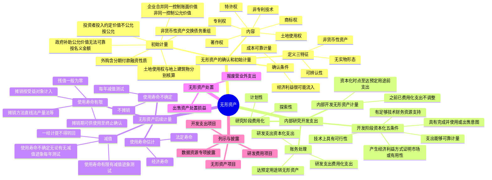

## 1. 章节定位

| 项目 | 信息 |
|------|------|
| 所属科目 | 会计 |
| 难度等级 | 3 |
| 历年分值 | 3-5 分 |
| 建议学时 | 5-7 小时 |
| 知识关联章节 | 第3章 固定资产（折旧与摊销的对比）、第5章 投资性房地产（土地使用权转换）、第6章 长期股权投资（同一控制/非同一控制企业合并取得的无形资产）、第7章 资产减值（使用寿命不确定的无形资产减值）、第11章 借款费用（资本化利息）、第14章 政府补助、第17章 收入（PPP 项目无形资产模式）、第24章 会计估计变更 |

## 2. 考情分析

本章是会计科目的基础章节之一，与固定资产类似但有其特殊性。客观题稳定出题，主观题常以研究开发支出的资本化、土地使用权的处理为核心。

**命题规律**：客观题集中在无形资产的范围与可辨认性、确认条件、研究阶段与开发阶段的区分、使用寿命的确定；主观题集中在内部研发支出的会计处理、土地使用权的核算、使用寿命不确定的无形资产减值。

**高频考点分布**：

1. **无形资产的定义与基本特征**：三个特征（无实物形态、可辨认性、非货币性资产）；商誉不构成无形资产的原因（不具有可辨认性）；客户关系、人力资源、内部产生的品牌等不确认为无形资产。
2. **无形资产的内容**：专利权、非专利技术、商标权、著作权、特许权、土地使用权。
3. **无形资产的确认条件**：经济利益很可能流入；成本能够可靠计量。
4. **无形资产的初始计量**：外购（含分期付款融资性质、不含广告费等间接费用、达预定用途后费用计入损益）；投资者投入（约定价值不公允的按公允价值）；政府补助取得（公允价值计量，无法可靠取得的按名义金额）；土地使用权（与地上建筑物分别核算，三种例外情形）；企业合并中取得（同一控制按账面价值，非同一控制按公允价值）。
5. **内部研究开发支出**：研究阶段全部费用化（计划性、探索性）；开发阶段同时满足五项条件资本化，否则费用化；无法区分的全部费用化。
6. **无形资产后续计量**：使用寿命有限的（摊销方法、残值一般为零、摊销期从可供使用至终止确认）；使用寿命不确定的（不摊销，每年减值测试）。
7. **无形资产减值**：使用寿命有限的在出现减值迹象时减值测试；使用寿命不确定的无论是否有减值迹象每年都进行减值测试；减值一经计提不得转回。
8. **无形资产处置**：出售计入资产处置损益；报废计入营业外支出。

**联动考查方式**：
- 与所得税结合：研发费用加计扣除产生暂时性差异；
- 与会计估计变更结合：使用寿命、摊销方法、残值的变更；
- 与差错更正结合：错将研究阶段支出资本化、错将费用化支出资本化；
- 与合并报表结合：内部交易无形资产的抵销；
- 与持有待售结合：划分为持有待售时停止摊销。

**备考建议**：
- 牢记"可辨认性"是无形资产区别于商誉的关键；
- 区分研究阶段（费用化）与开发阶段（满足五项条件资本化）；
- 牢记土地使用权的处理原则：与地上建筑物分别核算（房地产开发企业建造对外出售房屋、外购房屋建筑物价款无法在土地和地上建筑物之间合理分配等情形除外）；
- 牢记使用寿命不确定的无形资产不摊销但每年减值测试；
- 牢记无形资产减值一经计提不得转回。

## 3. 知识框架

## 4. 核心精讲

### 4.1 无形资产的定义与基本特征

**无形资产**，是指企业拥有或者控制的没有实物形态的可辨认非货币性资产。

通常情况下，企业拥有或控制的无形资产，是指企业拥有该项无形资产的所有权，且该项无形资产能够为企业带来未来经济利益。但在某些情况下并不需要企业拥有其所有权，如果企业有权获得某项无形资产产生的经济利益，同时又能约束其他人获得这些经济利益，则说明企业控制了该无形资产。

无形资产具有以下**三个特征**：

#### 4.1.1 无形资产不具有实物形态

无形资产通常表现为某种权利、某项技术或某种获取超额利润的综合能力（如土地使用权、非专利技术等）。固定资产通过实物价值的磨损和转移带来未来经济利益，而无形资产很大程度上通过自身所具有的技术等优势带来未来经济利益。

**含实物载体的无形资产**：某些无形资产的存在有赖于实物载体（如计算机软件需要存储在介质中），但这并不改变无形资产本身不具有实物形态的特性。在确定一项包含无形和有形要素的资产是属于固定资产还是无形资产时，通常以哪个要素更重要作为判断依据：
- 计算机控制的机械工具没有特定计算机软件就不能运行时，该软件是构成相关硬件不可缺少的组成部分，应作为固定资产处理；
- 计算机软件不是相关硬件不可缺少的组成部分，则该软件应作为无形资产核算。

#### 4.1.2 无形资产具有可辨认性

要作为无形资产进行核算，该资产必须是能够区别于其他资产可单独辨认的。**商誉**与企业整体价值联系在一起，由于不具有可辨认性，虽然商誉也是没有实物形态的非货币性资产，但**不构成无形资产**。

符合以下条件**之一**的，认为其具有可辨认性：
1. 能够从企业中分离或者划分出来，并能单独用于出售或转让等，而不需要同时处置在同一获利活动中的其他资产（某些情况下无形资产可能需要与有关的合同一起用于出售、转让等，这种情况下也视为可辨认无形资产）；
2. 产生于合同性权利或其他法定权利，无论这些权利是否可以从企业或其他权利和义务中转移或者分离。

**不确认为无形资产的项目**：
- 客户关系、人力资源等，由于企业无法控制其带来的未来经济利益，不符合无形资产的定义；
- 内部产生的品牌、报刊名、刊头、客户名单和实质上类似项目的支出，由于不能与整个业务开发成本区分开来，不应确认为无形资产。

#### 4.1.3 无形资产属于非货币性资产

无形资产由于没有发达的交易市场，一般不容易转化成现金，在持有过程中为企业带来未来经济利益的情况不确定，不属于以固定或可确定的金额收取的资产，属于非货币性资产。

应收款项等资产也没有实物形态，其与无形资产的区别在于无形资产属于非货币性资产，而应收款项等资产则不属于非货币性资产。

### 4.2 无形资产的内容

无形资产通常包括**专利权、非专利技术、商标权、著作权、特许权、土地使用权**等。

| 类别 | 说明 | 期限 |
|------|------|------|
| 专利权 | 国家专利主管机关依法授予发明创造专利申请人的专有权利，包括发明专利权、实用新型专利权、外观设计专利权 | 发明专利权20年，实用新型专利权10年，外观设计专利权15年，均自申请日起计算 |
| 非专利技术 | 不为外界所知、在生产经营活动中已采用了的、不享有法律保护的、可以带来经济效益的各种技术和诀窍，包括工业专有技术、商业贸易专有技术、管理专有技术等；用自我保密的方式维持独占性 | 不受法律保护，无固定期限 |
| 商标权 | 专门在某类指定的商品或劳务上使用特定的名称或图案的权利 | 注册商标有效期为10年，自核准注册之日起计算；每次续展注册的有效期为10年 |
| 著作权（版权） | 作者对其创作的文学、科学和艺术作品依法享有的某些特殊权利 | 公民作品的发表权等保护期为作者终生及其死亡后50年 |
| 特许权 | 企业在某一地区经营或销售某种特定商品的权利，或是一家企业接受另一家企业使用其商标、商号、技术秘密等的权利 | 政府机构授权或企业间合同约定 |
| 土地使用权 | 国家准许某企业在一定期间内对国有土地享有开发、利用、经营的权利 | 取得方式有行政划拨、外购（缴纳土地出让金）、投资者投资等 |

**特别说明**：PPP 项目合同符合无形资产模式的应当确认为无形资产（详见第17章收入相关内容）。

### 4.3 无形资产的确认条件

无形资产应当在符合定义的前提下，**同时满足以下两个确认条件**时，才能予以确认：

1. 与该无形资产有关的**经济利益很可能**流入企业；
2. 该无形资产的**成本能够可靠地计量**。

**企业无形项目的支出**，除下列情形外，均应于发生时计入当期损益：
1. 符合无形资产的定义及确认条件的，构成无形资产成本的部分；
2. 非同一控制下企业合并中取得的、不能单独确认为无形资产、构成购买日确认的商誉的部分。

**典型不确认情形**：内部产生的品牌、报刊名等因其成本无法可靠计量；一些高新科技企业的科技人才，其知识难以辨认，形成知识所发生的支出难以计量。

### 4.4 无形资产的初始计量

无形资产通常按**实际成本**计量，即以取得无形资产并使之达到预定用途而发生的相关支出作为无形资产的成本。对于不同来源取得的无形资产，其初始成本构成也不尽相同。

#### 4.4.1 外购的无形资产成本

外购的无形资产，其成本包括**购买价款、相关税费以及直接归属于使该项资产达到预定用途所发生的其他支出**。直接归属于使该项资产达到预定用途所发生的其他支出，包括使无形资产达到预定用途所发生的专业服务费用、测试无形资产是否能够正常发挥作用的费用等。

**下列各项不包括在无形资产的初始成本中**：

| 不计入成本的项目 | 处理 |
|----------------|------|
| 为引入新产品进行宣传发生的广告费、管理费用及其他间接费用 | 发生时计入当期损益 |
| 无形资产已经达到预定用途以后发生的费用（如形成预定经济规模之前发生的初始运作损失，以及达到预定用途前发生的并非必不可少的其他经营活动的支出） | 发生时计入当期损益 |
| 达到预定用途之后定期发生的安全管理等支出 | 实际发生时计入当期损益 |

**数据资源无形资产的外购成本**：包括购买价款、相关税费，直接归属于使该项无形资产达到预定用途所发生的数据脱敏、清洗、标注、整合、分析、可视化等加工过程所发生的有关支出，以及数据权属鉴证、质量评估、登记结算、安全管理等费用。

**具有融资性质的分期付款购买**：如果购入的无形资产超过正常信用条件延期支付价款（如分期付款购买无形资产），实质上具有融资性质的，无形资产的成本为**购买价款的现值**。

**账务处理**：按购买价款的现值，借记"无形资产"科目，按应支付的金额，贷记"长期应付款"科目，按其差额，借记"未确认融资费用"科目。各期实际支付的价款与购买价款的现值之间的差额，符合借款费用资本化条件的应当计入无形资产成本，其余部分在信用期间内确认为财务费用。

#### 4.4.2 投资者投入的无形资产成本

投资者投入的无形资产的成本，应当按照投资合同或协议约定的价值确定。投资合同或协议约定价值不公允的，应按无形资产的**公允价值**作为入账金额，无形资产的公允价值与投资合同或协议约定的价值之间的差额计入**资本公积**。

#### 4.4.3 通过非货币性资产交换、债务重组等方式取得的无形资产成本

企业通过非货币性资产交换、债务重组等方式取得的无形资产，其成本应当分别按照非货币性资产交换准则、债务重组准则等的规定确定。

#### 4.4.4 通过政府补助取得的无形资产成本

通过政府补助取得的无形资产成本，应当按照**公允价值**计量；公允价值不能可靠取得的，按照**名义金额**计量，具体按照政府补助准则的规定进行会计处理。

#### 4.4.5 土地使用权的处理

企业取得的土地使用权，通常应当按照取得时所支付的价款及相关税费确认为无形资产。土地使用权用于自行开发建造厂房等地上建筑物时，土地使用权的账面价值**不与地上建筑物合并计算其成本**，而仍作为无形资产进行核算，土地使用权与地上建筑物分别进行摊销和提取折旧。

**例外情形**：

| 情形 | 处理 |
|------|------|
| 房地产开发企业取得的土地使用权用于建造对外出售的房屋建筑物 | 相关的土地使用权应当**计入所建造的房屋建筑物成本** |
| 企业外购的房屋建筑物，实际支付的价款中包括土地以及建筑物的价值 | 应当对支付的价款按照合理的方法（例如，公允价值）在土地和地上建筑物之间进行分配；如果确实无法合理分配的，应当**全部作为固定资产**处理 |
| 企业改变土地使用权的用途，将其用于出租或增值目的 | 应将其转为**投资性房地产** |

**重要原则**：在厂房建设达到预定可使用状态前，土地使用权的摊销应计入在建工程成本；达到预定可使用状态后，土地使用权摊销与厂房折旧分别计入相关成本费用。

#### 4.4.6 企业合并中取得的无形资产成本

| 合并类型 | 入账价值 |
|---------|---------|
| 同一控制下吸收合并 | 按照合并日被合并方相关无形资产在最终控制方合并财务报表中的账面价值确认为取得时的初始成本 |
| 同一控制下控股合并 | 合并方在合并日编制合并报表时，按照被合并方相关无形资产在最终控制方合并财务报表中的账面价值作为合并基础 |
| 非同一控制下的企业合并 | 购买方取得的无形资产应以其在购买日的**公允价值**计量，包括：①被购买企业原已确认的无形资产；②被购买企业原未确认的无形资产（但公允价值能够可靠计量的） |

**非同一控制下企业合并中应单独确认为无形资产的条件**（满足其一）：①源于合同性权利或其他法定权利；②能够从被购买方中分离或者划分出来，并能单独或与相关合同、资产和负债一起用于出售、转移、授予许可、租赁或交换。

### 4.5 内部研究开发支出的确认和计量

通常情况下，企业自创商誉以及企业内部产生的无形资产（如内部产生的品牌、报刊名等）不确认为无形资产。但是，研究与开发活动发生的费用，除遵循无形资产确认和初始计量的一般要求外，还需要满足其他特定的条件，才能够确认为一项无形资产。

#### 4.5.1 研究阶段和开发阶段的划分

对于企业自行进行的研究开发项目（包括企业内部数据资源的研究开发），应当区分**研究阶段**与**开发阶段**分别进行核算。

| 阶段 | 定义 | 特点 | 会计处理 |
|------|------|------|---------|
| 研究阶段 | 为获取新的技术和知识等进行的**有计划的调研** | ①计划性（建立在有计划的调研基础上，已经董事会或相关管理层批准）；②探索性（基本上是探索性的，为进一步的开发活动进行资料及相关方面的准备，不会形成阶段性成果） | 有关支出在发生时**全部费用化**，计入当期损益（管理费用——研究费用） |
| 开发阶段 | 在进行商业性生产或使用前，将研究成果或其他知识应用于某项计划或设计，以生产出新的或具有实质性改进的材料、装置、产品等 | ①具有针对性（建立在研究阶段基础上）；②形成成果的可能性较大 | 满足资本化五项条件的资本化，否则费用化 |

**研究阶段与开发阶段的不同点**：①目标不同（研究阶段一般目标不具体，不具有针对性；开发阶段多针对具体目标、产品、工艺等）；②对象不同（研究阶段一般很难具体化到特定项目上；开发阶段往往形成对象化的成果）；③风险不同（研究阶段成功率很低，风险比较大；开发阶段成功率较高，风险相对较小）；④结果不同（研究阶段多是研究报告等基础性成果；开发阶段多是具体的新技术、新产品等）。

#### 4.5.2 开发阶段有关支出资本化的条件

在开发阶段，**同时满足下列条件**的，将有关开发支出资本化计入无形资产的成本：

1. **完成该无形资产以使其能够使用或出售在技术上具有可行性**——以目前阶段的成果为基础，并提供相关证据和材料证明不存在技术上的障碍或其他不确定性。
2. **具有完成该无形资产并使用或出售的意图**——以管理层的决定为依据。
3. **无形资产产生经济利益的方式**，包括能够证明运用该无形资产生产的产品存在市场或无形资产自身存在市场，无形资产将在内部使用的，应当证明其有用性。
4. **有足够的技术、财务资源和其他资源支持**，以完成该无形资产的开发，并有能力使用或出售该无形资产。
5. **归属于该无形资产开发阶段的支出能够可靠地计量**——企业对开发活动发生的支出应单独核算；同时从事多项开发活动的，所发生的支出同时用于支持多项开发活动的，应按照一定的标准在各项开发活动之间进行分配，无法明确分配的，应予费用化计入当期损益。

#### 4.5.3 内部开发的无形资产的计量

内部研发活动形成的无形资产，其成本由可直接归属于该资产的创造、生产并使该资产能够以管理层预定的方式运作的所有必要支出组成。

**可直接归属于该资产的成本主要包括**：开发该无形资产时耗费的材料、劳务成本、注册费、在开发该无形资产过程中使用的其他专利权和特许权的摊销，以及按照借款费用的处理原则可资本化的利息支出等。

**不构成无形资产开发成本的支出**：在开发无形资产过程中发生的除上述可直接归属于无形资产开发活动的其他销售费用、管理费用等间接费用、无形资产达到预定用途前发生的可辨认的无效和初始运作损失、为运行该无形资产发生的培训支出等。

**重要原则**：内部开发无形资产的成本**仅包括在满足资本化条件的时点至无形资产达到预定用途前发生的支出总和**，对于同一项无形资产在开发过程中达到资本化条件之前已经费用化计入当期损益的支出**不再进行调整**。

#### 4.5.4 内部研究开发支出的会计处理

**基本原则**：
- 研究阶段的支出全部费用化，计入当期损益（管理费用——研究费用）；
- 开发阶段的支出符合条件的资本化，不符合资本化条件的计入当期损益（管理费用——研究费用）；
- 如果确实无法区分研究阶段的支出和开发阶段的支出，应将其所发生的研发支出全部费用化，计入当期损益；
- 企业购买正在进行中的研究开发项目且符合资本化条件的，应确认为无形资产；取得后发生的研究开发支出，比照内部研究开发项目支出的规定处理。

**具体账务处理**：

| 业务 | 会计分录 |
|------|---------|
| 自行开发无形资产发生研发支出（不满足资本化条件） | 借：研发支出——费用化支出；贷：原材料、银行存款、应付职工薪酬等 |
| 自行开发无形资产发生研发支出（满足资本化条件） | 借：研发支出——资本化支出；贷：原材料、银行存款、应付职工薪酬等 |
| 期末将费用化支出转入当期损益 | 借：管理费用——研究费用；贷：研发支出——费用化支出 |
| 研究开发项目达到预定用途形成无形资产 | 借：无形资产；贷：研发支出——资本化支出 |

**重要原则**：企业已经按照无形资产准则和存货准则的规定，判断当期研发支出不满足无形资产、存货等资产的确认条件，将研发支出（包括研发样机的相关支出）全部费用化处理，并计入了当期利润表的研发费用项目中，**不应在以后期间签订销售合同或者销售研发样机时，将以前期间已费用化的研发样机支出金额从本期研发费用中冲回后再转入存货或营业成本等**。

### 4.6 无形资产的后续计量

无形资产初始确认和计量后，在其后使用期间内应以**成本减去累计摊销额和累计减值损失后的余额**计量。确定无形资产在使用过程中的累计摊销额，基础是估计其使用寿命。

#### 4.6.1 估计无形资产的使用寿命

企业应当在取得无形资产时分析判断其使用寿命：
- 如无形资产的使用寿命为有限的，应当估计该使用寿命的年限或者构成使用寿命的产量等类似计量单位数量；
- 无法预见无形资产为企业带来未来经济利益期限的，应当视为使用寿命不确定的无形资产。

无形资产的使用寿命包括**法定寿命**和**经济寿命**两个方面：
- **法定寿命**：受法律、规章或合同限制的使用寿命（如发明专利权20年，商标权10年）；
- **经济寿命**：无形资产可以为企业带来经济利益的年限，往往短于法定寿命。

**确定经济寿命应考虑的因素**：①该资产通常的产品寿命周期；②技术、工艺等方面的现实情况及对未来发展的估计；③以该资产生产的产品或服务的市场需求情况；④现在或潜在的竞争者预期采取的行动；⑤为维持该资产产生未来经济利益的能力所需要的维护支出；⑥对该资产的控制期限，以及对该资产使用的法律或类似限制；⑦与企业持有的其他资产使用寿命的关联性等。

#### 4.6.2 无形资产使用寿命的确定

| 情形 | 使用寿命的确定 |
|------|--------------|
| 源自合同性权利或其他法定权利 | 使用寿命不应超过合同性权利或其他法定权利的期限；如果企业使用资产的预期期限短于合同性权利或法定权利规定的期限，则按照企业预期使用的期限确定 |
| 合同性权利或法定权利能够在到期时因续约等延续 | 当有证据表明企业续约不需要付出重大成本时，续约期才能够包括在使用寿命的估计中；如果企业为延续无形资产持有期间而付出的成本与预期从重新延续中流入企业的未来经济利益相比具有重要性，本质上是企业获得的一项新的无形资产 |
| 没有明确的合同或法律规定无形资产的使用寿命 | 企业应当综合各方面情况（聘请专家论证、与同行业比较、参考历史经验等）确定；如果经过努力仍无法合理确定，再将其作为使用寿命不确定的无形资产 |

**重要原则**：企业不得在没有确凿证据的情况下，随意判断某项无形资产为使用寿命不确定的无形资产。

#### 4.6.3 无形资产使用寿命的复核

- **使用寿命有限的无形资产**：企业至少应当于每年年度终了，对其使用寿命及摊销方法进行复核。如果有证据表明使用寿命及摊销方法不同于以前的估计，应改变其摊销年限及摊销方法，并按照**会计估计变更**进行会计处理。
- **使用寿命不确定的无形资产**：企业应当在每个会计期间对其使用寿命进行复核。如果有证据表明使用寿命是有限的，应当估计其使用寿命，按照会计估计变更进行会计处理，并根据使用寿命有限的无形资产进行后续计量。

#### 4.6.4 使用寿命有限的无形资产

使用寿命有限的无形资产，应在其预计的使用寿命内采用系统合理的方法对应摊销金额进行摊销。

**应摊销金额** = 无形资产的成本 − 残值 − 已计提的无形资产减值准备累计金额。

**（1）摊销期和摊销方法**

- **摊销期**：自其可供使用（即其达到预定用途）时开始至**终止确认时**止。
- **摊销方法**：包括直线法、产量法等。企业选择无形资产摊销方法时，应根据与无形资产有关的经济利益的预期消耗方式作出决定，并一致地运用于不同会计期间。无法可靠确定无形资产预期消耗方式的，应当采用**直线法**进行摊销。

**重要原则**：企业通常不应以包括使用无形资产在内的经济活动所产生的收入为基础进行摊销。但下列极其有限的情况除外：①企业根据合同约定确定无形资产固有的根本性限制条款（如无形资产的使用时间、使用无形资产生产产品的数量或因使用无形资产而应取得固定的收入总额）的，当该条款为因使用无形资产而应取得的固定的收入总额时，取得的收入可以成为摊销的合理基础；②有确凿的证据表明收入的金额和无形资产经济利益的消耗是高度相关的。

**注意**：企业采用车流量法对高速公路经营权进行摊销的，不属于以包括使用无形资产在内的经济活动产生的收入为基础的摊销方法。

**摊销的会计处理**：无形资产的摊销一般应计入当期损益；但如果某项无形资产是专门用于生产某种产品或其他资产，其所包含的经济利益是通过转入所生产的产品或其他资产中实现的，则无形资产的摊销费用应当**计入相关资产的成本**（如专门用于生产某种产品的专利技术，其摊销费用应构成所生产产品成本的一部分，计入制造费用）。

**划分为持有待售**的无形资产或处置组中的无形资产**不进行摊销**，按照持有待售准则进行会计处理。

**（2）残值的确定**

使用寿命有限的无形资产，其残值一般应当视为零，**除非**：
1. 有第三方承诺在无形资产使用寿命结束时购买该项无形资产；
2. 存在活跃的市场，通过市场可以得到无形资产使用寿命结束时的残值信息，并且从目前情况看，在无形资产使用寿命结束时，该市场还可能存在。

无形资产的残值确定以后，在持有无形资产期间，至少应于每年年末进行复核，预计其残值与原估计金额不同的，应按照会计估计变更进行会计处理。**如果无形资产的残值重新估计以后高于其账面价值的，则无形资产不再摊销，直至残值降至低于账面价值时再恢复摊销**。

#### 4.6.5 使用寿命不确定的无形资产

对于使用寿命不确定的无形资产，在持有期间内**不需要摊销**，但至少应当于每年年度终了进行**减值测试**。

#### 4.6.6 无形资产的减值

| 类型 | 减值测试时点 |
|------|------------|
| 使用寿命有限的无形资产 | 在**出现减值迹象时**进行减值测试 |
| 使用寿命不确定的无形资产 | 在持有期间内如果期末重新复核后仍为使用寿命不确定的，无论是否存在减值迹象，**每年都应当进行减值测试** |

如经减值测试表明无形资产的可收回金额低于账面价值的，按其差额确认资产减值损失，借记"资产减值损失"科目，贷记"无形资产减值准备"科目。

**重要原则**：无形资产减值准备一经计提，**不得转回**。

资产减值损失确认后，使用寿命有限的无形资产，其摊销费用应当在未来期间作相应调整，以使该无形资产在剩余使用寿命内，系统合理地分摊调整后的账面价值。

### 4.7 无形资产的处置

#### 4.7.1 无形资产的出售

企业出售某项无形资产，表明企业放弃无形资产的所有权。

| 情形 | 会计处理 |
|------|---------|
| 划分为持有待售类别 | 按持有待售准则的相关规定进行会计处理 |
| 未划分为持有待售类别 | 按照出售取得的价款扣除相关无形资产的账面价值、相关税费等后的差额确认为**资产处置损益** |

#### 4.7.2 无形资产的报废

如果无形资产预期不能为企业带来未来经济利益（如该无形资产已被其他新技术所替代或超过法律保护期），不再符合无形资产的定义，应将其转销。

转销时，应按已计提的累计摊销，借记"累计摊销"科目；按其账面余额，贷记"无形资产"科目；按其差额，借记"**营业外支出**"科目。已计提减值准备的，还应同时结转减值准备。

### 4.8 无形资产的列示与披露

#### 4.8.1 列示

| 报表项目 | 填列方法 |
|---------|---------|
| **无形资产** | 根据"无形资产"科目的账面余额减去"累计摊销"科目的账面余额和"无形资产减值准备"科目的账面余额计算填列。企业应当根据重要性原则在"无形资产"项目下增设"其中：数据资源"项目，反映确认为无形资产的数据资源的期末账面价值 |
| **开发支出** | 根据"研发支出——资本化支出"科目的账面余额，减去相关减值准备期末余额后的金额分析填列。企业应当根据重要性原则在"开发支出"项目下增设"其中：数据资源"项目，反映正在进行数据资源研究开发项目满足资本化条件的支出金额 |
| **研发费用**（利润表） | 根据"管理费用"科目下的"研究费用"明细科目的发生额，以及"管理费用"科目下的"无形资产摊销"明细科目的相关发生额分析填列 |

#### 4.8.2 披露

企业应当按照无形资产的类别在会计报表附注中披露与无形资产有关的下列信息：
1. 无形资产的期初和期末账面余额、累计摊销额及减值准备累计金额；
2. 使用寿命有限的无形资产，其使用寿命的估计情况；使用寿命不确定的无形资产，其使用寿命不确定的判断依据；
3. 无形资产的摊销方法；
4. 用于担保的无形资产账面价值、当期摊销额等情况；
5. 计入当期损益和确认为无形资产的研究开发支出金额。

对于确认为无形资产的**知识产权**和**数据资源**，企业还应当披露其他相关信息（如按类别披露、单项重要资产的内容和账面价值、所有权或使用权受到限制的情况等）。

## 5. 典型例题

**【例题 1】（内部研发支出的会计处理）**

甲公司2×25年1月1日经董事会批准研发某项新产品专利技术，董事会认为研发该项目具有可靠的技术和财务等资源的支持，并且一旦研发成功将降低该公司产品的生产成本。该公司在研究开发过程中发生材料费5 000万元、人工工资1 000万元，以及其他费用4 000万元，总计10 000万元，其中符合资本化条件的支出为6 000万元。2×25年12月31日，该专利技术已经达到预定用途。

要求：编制甲公司2×25年的有关会计分录。

**答案**：

（1）发生研发支出：

借：研发支出——费用化支出 40 000 000
　　研发支出——资本化支出 60 000 000
　　贷：原材料 50 000 000
　　　　应付职工薪酬 10 000 000
　　　　银行存款 40 000 000

（2）2×25年12月31日，该专利技术达到预定用途：

借：管理费用——研究费用 40 000 000
　　无形资产 60 000 000
　　贷：研发支出——费用化支出 40 000 000
　　　　研发支出——资本化支出 60 000 000

**解析**：研究阶段支出全部费用化；开发阶段同时满足五项资本化条件的支出资本化，不满足资本化条件的费用化；达到预定用途时将"研发支出——资本化支出"科目余额转入"无形资产"科目。

**【例题 2】（土地使用权的处理）**

2×25年1月1日，A股份有限公司购入一块土地的使用权，以银行存款转账支付8 000万元，并在该土地上自行建造厂房等工程，发生材料支出12 000万元、工资费用8 000万元、其他相关费用10 000万元等。该工程已经完工并达到预定可使用状态。假定土地使用权的使用年限为50年，该厂房的使用年限为25年，两者都没有净残值，都采用直线法进行摊销和计提折旧。

要求：编制A公司的有关会计分录（不考虑相关税费）。

**答案**：

（1）支付转让价款：

借：无形资产——土地使用权 80 000 000
　　贷：银行存款 80 000 000

（2）在该土地上自行建造厂房：

借：在建工程 300 000 000
　　贷：工程物资 120 000 000
　　　　应付职工薪酬 80 000 000
　　　　银行存款 100 000 000

（注：厂房建设在达到预定可使用状态前，土地使用权的摊销应计入在建工程成本，本题略）

（3）厂房达到预定可使用状态：

借：固定资产 300 000 000
　　贷：在建工程 300 000 000

（4）厂房建设达到预定可使用状态后，每年摊销土地使用权和对厂房计提折旧：

借：制造费用（土地摊销） 1 600 000
　　制造费用（厂房折旧） 12 000 000
　　贷：累计摊销 1 600 000
　　　　累计折旧 12 000 000

**解析**：企业取得的土地使用权通常应确认为无形资产，与地上建筑物分别核算、分别摊销和计提折旧；土地使用权摊销一般计入当期损益，但专门用于生产产品的应计入相关资产成本（如制造费用）。

**【例题 3】（使用寿命不确定的无形资产）**

2×24年1月1日，A公司购入一项市场领先的畅销产品的商标，成本为6 000万元。该商标按照法律规定还有5年的使用寿命，但是在保护期届满时，A公司可每10年以较低的手续费申请延期，同时A公司有充分的证据表明其有能力申请延期。此外，有关的调查表明，根据产品生命周期、市场竞争等方面情况综合判断，该商标将在不确定的期间内为企业带来现金流量。2×25年末，A公司对该商标按照资产减值的原则进行减值测试，经测试表明该商标已发生减值，2×25年末该商标的公允价值为4 000万元。

要求：编制A公司的有关会计分录。

**答案**：

（1）2×24年购入商标时：

借：无形资产——商标权 60 000 000
　　贷：银行存款 60 000 000

（2）2×24年持有期间：该商标视为使用寿命不确定的无形资产，不需要进行摊销。

（3）2×25年发生减值时：

借：资产减值损失 20 000 000
　　贷：无形资产减值准备——商标权 20 000 000

**解析**：使用寿命不确定的无形资产在持有期间不摊销，但每年进行减值测试；减值一经计提不得转回。

## 6. 记忆口诀

**无形资产三特征**："无实物、可辨认、非货币"——不具有实物形态、具有可辨认性、属于非货币性资产。

**商誉不属于无形资产**："不可辨认、与企业整体相关"——商誉无法与企业自身区分开来，不具有可辨认性。

**不确认无形资产的项目**："客户关系、人力资源、内部品牌报刊名"——无法控制未来经济利益或成本无法可靠计量。

**确认条件两条件**："很可能流入、可靠计量"。

**外购成本构成**："价款、税费、直接归属其他支出"——不含广告费、管理费用等间接费用，不含达预定用途后费用。

**分期付款购买**："现值入成本，差额未确认融资费用，实际利率法摊销"。

**投资者投入**："约定价值不公允按公允，差额入资本公积"。

**土地使用权处理**："通常入无形资产与地上建筑物分别核算；房地产企业建造对外出售房屋入房屋成本；外购房屋无法合理分配全入固定资产；改变用途出租或增值转投资性房地产"。

**研究阶段**："有计划调研，计划性+探索性，全部费用化"。

**开发阶段资本化五条件**："技术可行、有意图、能产生经济利益、有资源支持、支出可靠计量"。

**内部开发无形资产成本**："仅含资本化时点至达预定用途前支出，之前已费用化不调整"。

**研究阶段vs开发阶段**："目标、对象、风险、结果四不同"——研究阶段目标不具体、对象难具体化、风险大、结果是研究报告；开发阶段目标针对、对象化、风险小、结果是新技术新产品。

**使用寿命有限vs不确定**："有限要摊销+有减值迹象才测试；不确定不摊销+每年必测试"。

**摊销期**："可供使用至终止确认"。

**摊销方法**："经济利益预期消耗方式，无法确定用直线法，通常不以收入为基础"。

**残值**："一般为零，除非第三方承诺购买或存在活跃市场"——残值重新估计高于账面价值时不再摊销，直至低于账面价值再恢复摊销。

**减值**："使用寿命有限有迹象测试；使用寿命不确定无论有无迹象每年测试；一经计提不得转回"。

**处置**："出售入资产处置损益，报废入营业外支出"。

**列示三项目**："无形资产、开发支出、研发费用"——研发费用包括费用化支出加计入管理费用的自行开发无形资产摊销。

## 7. 同步练习

**53.（单选题）** 下列各项中，制造企业应确认为无形资产的是（　）。

A. 自创的商誉
B. 企业合并产生的商誉
C. 内部研究开发项目研究阶段发生的支出
D. 以缴纳土地出让金方式取得的自用土地使用权

---

**54.（单选题）** 2月5日，甲公司以1800万元的价格从产权交易中心竞价获得一项专利权，另支付相关税费90万元。为推广由该专利权生产的产品，甲公司发生宣传广告费用25万元、展览费15万元。该专利权预计使用5年，预计净残值为零，采用直线法摊销。不考虑其他因素，甲公司竞价取得专利权的入账价值是（　）。

A. 1800万元
B. 1890万元
C. 1915万元
D. 1930万元

---

**55.（单选题）** 2×20年1月1日，甲公司开始自行研发一项新技术。2×20年共发生研发支出600万元，其中研究阶段发生支出300万元，开发阶段符合资本化条件前发生支出100万元，符合资本化条件后发生支出200万元。2×21年8月30日，该项新技术研发成功，达到预定可使用状态，当年发生测试费2万元，注册费6万元，员工培训费3万元。不考虑其他因素，甲公司该项无形资产的入账价值为（　）。

A. 208万元
B. 211万元
C. 308万元
D. 311万元

---

**56.（单选题）** 甲公司在2×21年7月1日购入一项管理用软件，购买价款为600万元。该软件预计使用年限为10年，受法律保护年限是15年，预计净残值为0，按照直线法摊销。至2×22年12月31日，该无形资产出现减值迹象，甲公司预测其可收回金额为400万元。不考虑其他因素，2×22年甲公司对该软件计提减值金额为（　）。

A. 140万元
B. 110万元
C. 0
D. 20万元

---

**57.（单选题）** 某公司主营房地产开发业务，下列说法中不正确的是（　）。

A. 用于建造自营商业设施的土地使用权确认为无形资产
B. 用于建造住宅小区的土地使用权确认为开发成本
C. 持有并准备增值后转让的房屋确认为投资性房地产
D. 建造住宅小区的土地使用权建造期间不计提摊销

---

**58.（单选题）** 甲公司于2×22年1月5日开始自行研究开发一项无形资产，12月1日达到预定用途并交付管理部门使用。其中，研究阶段支付现金30万元、发生职工薪酬和专用设备折旧20万元；进入开发阶段后，相关支出符合资本化条件前支付现金30万元、发生的职工薪酬和计提专用设备折旧20万元、在开发该无形资产的过程中使用的其他专利权和特许权的摊销额为30万元，符合资本化条件后发生职工薪酬100万元、支付现金100万元、在开发该无形资产过程中使用的其他专利权和特许权的摊销额为100万元。甲公司估计该项无形资产的受益期限为10年，受法律保护年限为15年，采用直线法摊销，预计净残值为0。假定上述职工薪酬尚未实际支付。下列关于甲公司2×22年财务报表列示的表述中，正确的是（　）。

A. 资产负债表中的开发支出项目应按300万元列示
B. 资产负债表中的无形资产项目应按297.5万元列示
C. 利润表中的研发费用项目应按130万元列示
D. 与无形资产研发有关的现金支出在现金流量表中列示为经营活动现金流量160万元

---

**59.（单选题）**（2024年）甲公司以400万元的价格购买了一项商标，该商标注册有效期为10年，自甲公司购买日起有效期尚有3年，甲公司有权在商标权有效期满前申请续展10年，续展手续费为0.1万元，考虑到该商标权在市场上享有声誉，甲公司预计将持续使用该商标经营业务，并在每次商标有效期到期前申请续展注册，不考虑其他因素，商标使用寿命是（　）。

A. 3年
B. 13年
C. 使用寿命不确定
D. 10年

---

**60.（单选题）**（2023年）2×20年1月1日，甲公司以200万元受让一项软件著作权，预计使用四年后对外出售该软件著作权，预计净残值为20万元，采用直线法摊销。2×22年6月30日，市场行情发生变化，该软件著作权预计净残值为40万元，预计剩余使用寿命1.5年。不考虑其他因素，甲公司2×22年对该著作权计提摊销的金额为（　）。（计算结果保留两位小数）

A. 38.33万元
B. 50万元
C. 45万元
D. 42.5万元

---

**61.（单选题）** 甲公司2×23年1月开始研发一项新技术，2×24年1月进入开发阶段，2×24年12月31日完成开发并申请了专利。该项目2×23年发生研究费用600万元，截至2×24年末累计发生研发费用1600万元，其中符合资本化条件的金额为1000万元，假定按照税法规定，研发支出可按实际支出的200%税前抵扣。不考虑其他因素，下列各项关于甲公司上述研发项目会计处理的表述中，正确的是（　）。

A. 将研发项目发生的研究费用确认为长期待摊费用
B. 实际发生的研发费用与其可予税前抵扣金额的差额确认递延所得税资产
C. 自符合资本化条件起至达到预定用途时所发生的研发费用资本化金额计入无形资产
D. 研发项目在达到预定用途后，将所发生全部研究和开发费用可予税前抵扣金额的所得税影响额确认为所得税费用

---

**62.（单选题）** 2×19年12月31日，昌河公司自行研发成功了一项专门用于生产A产品的非专利技术，发生的符合资本化条件的支出共计500万元，且已经申请了专利。昌河公司不能确定该非专利技术的使用年限。2×20年12月31日，对其进行减值测试，预计其未来现金流量现值为450万元，如果当年末对外出售将取得价款500万元，发生清理费用15万元。2×21年7月1日，综合考虑各种原因后，确定该非专利技术的尚可使用寿命为10年，预计净残值为0，采用直线法计提摊销。假定不考虑其他因素，下列说法中正确的是（　）。

A. 2×20年年末，昌河公司应对该非专利技术计提减值金额50万元
B. 2×21年，昌河公司应对该非专利技术的摊销金额进行追溯调整
C. 2×21年12月31日，该项无形资产在资产负债表中的列报金额为413.04万元
D. 2×21年，昌河公司应对该非专利技术计提摊销金额24.25万元

---

**63.（单选题）** 下列关于无形资产后续计量的说法中，正确的是（　）。

A. 无形资产的使用寿命包括法定寿命、经济寿命和非法定寿命三个方面
B. 企业研究无形资产形成一项数据库，确认为无形资产之后，定期发生的安全管理费用支出，应在发生时计入无形资产成本
C. 企业在对确认为无形资产的数据资源的使用寿命进行估计时，不用考虑数据资源相关业务模式、权利限制等因素
D. 存在第三方承诺在无形资产使用寿命结束时购买该无形资产合同的，该无形资产残值不为0

---

**64.（多选题）** 关于无形资产的初始计量，下列说法中错误的有（　）。

A. 外购方式取得确认为无形资产的数据资源，其成本包括购买价款、相关税费、直接归属于使该项资产达到预定用途所发生的数据脱敏等有关支出、数据权属鉴证等费用
B. 购买无形资产价款超过正常信用条件延期支付，实质上具有融资性质的，应该按照购买价款的现值为基础确定无形资产的成本
C. 通过政府补助取得的无形资产，应当按照名义金额计量
D. 某数据标注企业在前期开发相关数据标注工具时，虽然相关数据标注技术尚在探索当中，且数据标注市场需求难以预计，但发生的有关支出也应作为无形资产予以确认

---

**65.（多选题）** 下列各项中，属于无形资产披露信息的有（　）。

A. 使用寿命有限的无形资产，其使用寿命的估计情况
B. 处于申请状态的知识产权的开始资本化时间、申请状态等信息
C. 数据资源相关权利的失效情况及失效事由、对企业的影响及风险分析
D. 计入当期损益和确认为无形资产的研究开发支出金额

---

**66.（多选题）** 20×2年1月1日，甲公司从乙公司购入一项无形资产，由于资金周转紧张，甲公司与乙公司协议以分期付款方式支付款项。协议约定：该无形资产作价2000万元，甲公司每年年末付款400万元，分5年付清。假定银行同期贷款利率为5%，5年期5%利率的年金现值系数为4.3295。不考虑其他因素，下列甲公司与该无形资产相关的会计处理中，正确的有（　）。（计算结果保留两位小数）

A. 20×2年财务费用增加86.59万元
B. 20×3年财务费用增加70.92万元
C. 20×2年1月1日确认无形资产入账成本2000万元
D. 20×2年12月31日长期应付款列报为2000万元

---

**67.（多选题）** 下列各项关于无形资产会计处理的表述中，不正确的有（　）。

A. 自行研究开发的无形资产在尚未达到预定用途前无须考虑减值
B. 非同一控制下企业合并中，购买方应确认被购买方在该项交易前未确认但可单独辨认且公允价值能够可靠计量的无形资产
C. 一项研发活动同时产生数据资源无形资产和其他资产的，所发生的支出应当能够系统合理地在数据资源无形资产和其他资产之间进行分摊，分摊原则以及方法应当保持一致
D. 企业经粗略计算，无法估计出某项无形资产的使用寿命，故将其作为使用寿命不确定的无形资产核算

---

**68.（多选题）**（2022年）下列各项企业内部开发活动在满足资本化条件的时点至开发项目达到预定用途前发生的费用或支出中，构成无形资产成本的有（　）。

A. 使用其他专利权发生的摊销额
B. 为使用该无形资产所发生的培训支出
C. 按照借款费用处理原则计算的资本化利息
D. 同时支持多项开发活动但无法明确分配到各项目的支出

---

**69.（多选题）**（2022年）下列各项关于企业无形资产摊销的表述中，正确的有（　）。

A. 无形资产不能采用类似固定资产加速折旧的方法进行摊销
B. 分类为持有待售类别的无形资产不应摊销
C. 无法可靠确定与无形资产有关的经济利益的预期消耗方式的，应当采用直线法进行摊销
D. 用于生产产品的专利技术摊销应计入管理费用

---

**70.（多选题）** 甲公司为房地产开发企业，2×22年发生的与土地使用权有关的交易或事项如下：①1月1日，以出让方式取得一块土地使用权，支付价款500万元，该土地使用权准备增值后转让。年末，该土地使用权的公允价值为400万元。②2月1日，取得其他企业转让的一块土地使用权，支付价款1500万元，当日开始建造自用办公楼。③5月1日，以出让方式取得一块土地使用权，支付出让金2000万元。甲公司打算在该土地上建造对外出售的商品房。年末，该土地使用权的公允价值为2300万元。甲公司对无形资产采用直线法摊销。假定上述土地使用权的预计使用年限均为50年，预计净残值均为0。假定不考虑其他因素。期末编制资产负债表时，下列说法中正确的有（　）。

A. 1月1日取得的土地使用权应该作为投资性房地产，期末按照500万元列示
B. 2月1日取得的土地使用权应该作为无形资产，期末按照1472.5万元列示
C. 5月1日取得的土地使用权应该作为无形资产核算
D. 2月1日取得的土地使用权在对应的办公楼建造达到预定可使用状态前，相关摊销额计入在建工程成本

---

**71.（综合题）** 2×19年至2×22年，甲公司发生的与无形资产有关的业务如下：

（1）2×19年1月至10月份处于研究阶段，发生材料费120万元，开发人员工资150万元。

（2）2×19年11月进入开发阶段，至年末共发生材料费100万元，开发人员工资100万元，专用设备折旧费用50万元，其中满足资本化条件的材料费80万元，开发人员工资50万元，专用设备折旧费用30万元。

（3）2×20年1月发生开发人员工资50万元，专用设备折旧费用20万元，全部满足资本化条件。2月2日该项非专利技术开发完成，达到预定可使用状态，并投入管理部门使用。由于该项无形资产不是来源于合同性权益或其他法定权利，且无法通过其他市场条件判断其使用寿命，甲公司将其确认为使用寿命不确定的无形资产。2×20年末，该项无形资产的可收回金额是200万元。

（4）2×21年1月，甲公司根据该非专利技术的未来发生趋势，预计其尚可使用寿命是8年，预计净残值为零，甲公司采用直线法摊销。

（5）2×22年7月1日，甲公司将该项非专利技术转让给乙公司，取得价款190万元。

其他资料：假定不考虑相关税费的影响。

要求：
（1）根据资料（1）和（2），计算甲公司2×19年自行研发无形资产影响当期损益的金额，并编制2×19年与自行研发无形资产相关的会计分录（假定费用化支出按年结转损益）。
（2）根据资料（2）和（3），计算企业自行研发无形资产的初始入账价值，并编制2×20年与自行研发无形资产相关的会计分录。
（3）根据资料（2）和（3），判断2×20年末该无形资产是否需要计提减值；如果需要计提减值准备，请编制相关的会计分录。
（4）根据资料（4），判断2×21年该无形资产是否需要计提摊销；如果需要计提，请编制相关的会计分录。
（5）根据上述资料，计算甲公司因该项无形资产确认的处置损益金额，并编制相关的会计分录。

---

**练习答案**：（本章答案缺失，可参考历年真题）
