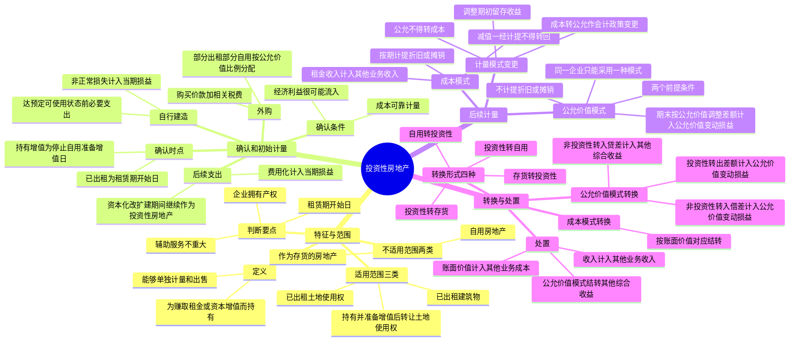

## 1. 章节定位

| 项目 | 信息 |
|------|------|
| 所属科目 | 会计 |
| 难度等级 | 3 |
| 历年分值 | 2-4 分 |
| 建议学时 | 4-6 小时 |
| 知识关联章节 | 第3章 固定资产（成本模式下折旧计提）、第4章 无形资产（土地使用权摊销）、第7章 资产减值（成本模式减值）、第8章 负债（租金收入）、第13章 金融工具（公允价值计量）、第14章 租赁（售后租回）、第17章 收入（租金收入确认） |

## 2. 考情分析

本章是会计科目的中等难度章节，历年分值约 2-4 分，以客观题为主，主观题常与固定资产、无形资产、会计政策变更等章节联动考查。

**命题规律**：客观题集中在投资性房地产的范围界定、成本模式与公允价值模式的差异、转换日的会计处理（特别是公允价值模式下转换差额的归属科目）；主观题常以综合业务形式考查转换、后续计量与处置的全流程处理。

**高频考点分布**：

1. **投资性房地产的定义与范围**：定义（为赚取租金或资本增值而持有）；适用范围的三类资产（已出租土地使用权、持有并准备增值后转让的土地使用权、已出租建筑物）；不适用范围的两类资产（自用房地产、作为存货的房地产）；判断要点（企业拥有产权、租赁期开始日、辅助服务不重大）。
2. **确认与初始计量**：确认条件（经济利益很可能流入、成本可靠计量）；确认时点（已出租的为租赁期开始日、持有增值的为停止自用准备增值后转让日）；外购（购买价款+相关税费+可直接归属于的其他支出，部分出租部分自用按公允价值比例分配）；自行建造（达到预定可使用状态前必要支出）。
3. **后续支出**：资本化（满足确认条件，改扩建期间继续作为投资性房地产且不计提折旧摊销）；费用化（不满足确认条件，计入当期损益）。
4. **后续计量——成本模式**：按期计提折旧或摊销（借其他业务成本，贷投资性房地产累计折旧/摊销）；租金收入计入其他业务收入；减值一经计提不得转回。
5. **后续计量——公允价值模式**：不计提折旧或摊销；期末按公允价值调整账面价值，差额计入公允价值变动损益；两个前提条件（有活跃市场、能取得同类房地产信息）；同一企业只能采用一种模式。
6. **计量模式变更**：成本模式转公允价值模式作为会计政策变更，按公允价值与账面价值的差额调整期初留存收益；公允价值模式不得转为成本模式。
7. **房地产转换**：四种转换形式；成本模式下按账面价值结转；公允价值模式下投资性房地产转非投资性房地产的差额计入公允价值变动损益，非投资性房地产转投资性房地产的借方差额计入公允价值变动损益、贷方差额计入其他综合收益（处置时结转）。
8. **处置**：处置收入计入其他业务收入，账面价值计入其他业务成本；公允价值模式下需结转其他综合收益。

**联动考查方式**：
- 与固定资产、无形资产结合：自用房地产与投资性房地产之间的转换；
- 与会计政策变更结合：成本模式转公允价值模式的追溯调整；
- 与差错更正结合：错用计量模式、错将转换贷方差额计入公允价值变动损益而非其他综合收益；
- 与所得税结合：公允价值变动的暂时性差异。

**备考建议**：
- 牢记"同一企业只能采用一种计量模式"且"公允价值模式不得转回成本模式"；
- 区分两类转换方向：投资性房地产转出（差额计入公允价值变动损益）与非投资性房地产转入（贷方差额计入其他综合收益）；
- 牢记其他综合收益在处置时才结转至当期损益；
- 区分投资性房地产与自用房地产、存货的边界（持有目的）。

## 3. 知识框架



## 4. 核心精讲

### 4.1 投资性房地产的定义与特征

**投资性房地产**是指为赚取租金或资本增值，或者两者兼有而持有的房地产。房地产是土地和房屋及其权属的总称。在我国，土地归国家或集体所有，企业只能取得土地使用权，因此房地产中的土地是指土地使用权，房屋是指土地上的房屋等建筑物及构筑物。

投资性房地产在用途、状态、目的等方面与企业自用的厂房、办公楼等作为生产经营场所的房地产和房地产开发企业用于销售的房地产是不同的：

| 类别 | 持有目的 | 会计处理 |
|------|---------|---------|
| 投资性房地产 | 赚取租金或资本增值 | 投资性房地产准则 |
| 自用房地产 | 生产商品、提供劳务或经营管理 | 固定资产/无形资产准则 |
| 作为存货的房地产 | 房地产开发企业销售或正在开发的商品房 | 存货准则 |

投资性房地产的主要形式是出租建筑物、出租土地使用权，这实质上属于一种让渡资产使用权行为。房地产租金就是让渡资产使用权取得的使用费收入，属于企业日常活动形成的经济利益总流入。投资性房地产的另一种形式是持有并准备增值后转让的土地使用权，目的是增值后转让以赚取增值收益。在我国实务中，持有并准备增值后转让的土地使用权这种情况较少。

**关键特征**：投资性房地产应当能够单独计量和出售。企业可以选择成本模式或公允价值模式对投资性房地产进行后续计量，通常应当采用成本模式；存在确凿证据表明投资性房地产的公允价值能够可靠取得的，可以采用公允价值计量模式。计量模式一经确定，不得随意变更。成本模式转为公允价值模式的，应当作为会计政策变更处理。

### 4.2 投资性房地产的范围

#### 4.2.1 适用范围（三类）

投资性房地产包括已出租的土地使用权、持有并准备增值后转让的土地使用权、已出租的建筑物。

**（1）已出租的土地使用权**

已出租的土地使用权，是指企业通过出让或转让方式取得的、以经营租赁方式出租的土地使用权。企业取得的土地使用权包括在一级市场上以交纳土地出让金的方式取得的，也包括在二级市场上接受其他单位转让的。

> 注意：企业对于租入的土地使用权再转租给其他单位的，不能确认为投资性房地产。

**（2）持有并准备增值后转让的土地使用权**

持有并准备增值后转让的土地使用权，是指企业取得的、准备增值后转让的土地使用权。按照国家有关规定认定的闲置土地，不属于持有并准备增值后转让的土地使用权，也就不属于投资性房地产。

**（3）已出租的建筑物**

已出租的建筑物是指企业拥有产权的、以经营租赁方式出租的建筑物，主要包括自行建造或开发活动完成后用于出租的建筑物，以及正在建造或开发过程中将来用于出租的建筑物。一般应自租赁合同规定的租赁期开始日起，经营租出的建筑物才属于已出租的建筑物。

企业在判断和确认已出租的建筑物时，应当把握下列要点：

1. **用于出租的建筑物是企业拥有产权的建筑物**。企业租入再转租的建筑物不属于投资性房地产。
2. **已签订租赁协议并自租赁期开始日起确认**。通常情况下，对企业持有以备经营出租的空置建筑物或在建建筑物，如董事会或类似机构作出书面决议，明确表明将其用于经营出租且持有意图短期内不再发生变化的，即使尚未签订租赁协议，也应视为投资性房地产。这里的"空置建筑物"是指企业新购入、自行建造或开发完工但尚未使用的建筑物，以及不再用于日常生产经营活动且经整理后达到可经营出租状态的建筑物。
3. **辅助服务不重大的应确认为投资性房地产**。企业将建筑物出租，按租赁协议向承租人提供的相关辅助服务在整个协议中不重大的，应当将该建筑物确认为投资性房地产。例如，企业将其办公楼出租，同时向承租人提供维护、保安等日常辅助服务。

#### 4.2.2 不适用范围（两类）

**（1）自用房地产**

自用房地产是指为生产商品、提供劳务或者经营管理而持有的房地产，如企业生产经营用的厂房和办公楼属于固定资产，企业生产经营用的土地使用权属于无形资产。自用房地产的特征在于服务于企业自身的生产经营，其价值会随着房地产的使用而逐渐转移到企业的产品或服务中去。

例如，企业出租给本企业职工居住的宿舍，虽然也收取租金，但间接为企业自身的生产经营服务，因此具有自用房地产的性质。企业拥有并自行经营的旅馆饭店，其经营目的主要是通过向客户提供服务取得服务收入，应当属于自用房地产。

**（2）作为存货的房地产**

作为存货的房地产通常是指房地产开发企业在日常活动中销售的或为销售而正在开发的商品房。从事房地产经营开发的企业依法取得的、用于开发后出售的土地使用权，属于房地产开发企业的存货，即使房地产开发企业决定待增值后再转让该企业开发的土地，也不得将其确认为投资性房地产。

**部分自用部分出租的特殊处理**：实务中，存在某项房地产部分自用或作为存货出售、部分用于赚取租金或资本增值的情形。如某项房地产不同用途的部分能够单独计量和出售的，应当分别确认为固定资产（或无形资产、存货）和投资性房地产。

### 4.3 投资性房地产的确认和初始计量

#### 4.3.1 确认条件

投资性房地产只有在符合定义的前提下，同时满足下列条件的，才能予以确认：

1. 与该投资性房地产有关的经济利益很可能流入企业；
2. 该投资性房地产的成本能够可靠地计量。

**确认时点**：
- 对已出租的土地使用权、已出租的建筑物，其作为投资性房地产的确认时点一般为**租赁期开始日**，即土地使用权、建筑物进入出租状态、开始赚取租金的日期。
- 对持有并准备增值后转让的土地使用权，其作为投资性房地产的确认时点为企业将自用土地使用权停止自用、准备增值后转让的日期。

投资性房地产应当按照成本进行初始计量。

#### 4.3.2 外购投资性房地产

外购的土地使用权和建筑物，按照取得时的实际成本进行初始计量。取得时的实际成本包括购买价款、相关税费和可直接归属于该资产的其他支出。

企业购入的房地产，部分用于出租（或资本增值）、部分自用，用于出租（或资本增值）的部分应当予以单独确认的，应按照不同部分的公允价值占公允价值总额的比例将成本在不同部分之间进行分配。

如采用公允价值模式计量，需要在"投资性房地产"科目下设置"成本"和"公允价值变动"两个明细科目，其中，"投资性房地产——成本"科目反映外购的土地使用权和建筑物发生的实际成本。

**【例 5-1】** 2×24 年 5 月 25 日，甲公司通过银行转账支付购入一栋办公楼，实际发生成本 1 000 万元，甲公司董事会决议，购入的该栋办公楼的 50%（1～10 层）对外出租，另 50% 作为自用办公用房。2×24 年 5 月 30 日，甲公司与乙公司签订了租赁合同，约定自 2×24 年 6 月 1 日起将该栋办公楼的 1～10 层经营出租给乙公司，为期 8 年。假定该办公楼公允价值与其实际成本相同，不考虑增值税等相关税费及其他因素。

甲公司的账务处理如下：

```
借：投资性房地产——办公楼     5 000 000
    固定资产                     5 000 000
    贷：银行存款                        10 000 000
```

#### 4.3.3 自行建造投资性房地产

自行建造投资性房地产，其成本由建造该项资产达到预定可使用状态前发生的必要支出构成，包括土地开发费、建筑成本、安装成本、应予以资本化的借款费用、支付的其他费用和分摊的间接费用等。建造过程中发生的非正常性损失，直接计入当期损益，不计入建造成本。

#### 4.3.4 非投资性房地产转换为投资性房地产

非投资性房地产转换为投资性房地产，实质上是因房地产用途发生改变而对房地产进行的重新分类。

- 如果投资性房地产采用成本模式计量，则按照该项房地产在转换日的账面价值入账；
- 如果投资性房地产采用公允价值模式计量，则按该项房地产在转换日的公允价值入账。

#### 4.3.5 与投资性房地产有关的后续支出

**（1）资本化的后续支出**

与投资性房地产有关的后续支出，满足投资性房地产确认条件的，应当计入投资性房地产成本。例如，企业为了提高投资性房地产的使用效能，对投资性房地产进行改建、扩建或装修，支出满足确认条件的，应当将其资本化。

> 重要规定：企业对某项投资性房地产进行改扩建等再开发且将来仍作为投资性房地产的，在再开发期间应继续将其作为投资性房地产，再开发期间不计提折旧或摊销。

**【例 5-2】** 2×24 年 3 月，甲企业与乙企业的一项厂房经营租赁合同即将到期。该厂房按照成本模式进行后续计量，原价为 2 000 万元，已计提折旧 600 万元。为了提高厂房的租金收入，甲企业决定在租赁期满后对厂房进行改扩建，并与丙企业签订了经营租赁合同，约定自改扩建完工时将厂房出租给丙企业。3 月 15 日，与乙企业的租赁合同到期，厂房随即进入改扩建工程。12 月 10 日，厂房改扩建工程完工，共发生支出 150 万元，即日按照租赁合同出租给丙企业。假设甲企业采用成本计量模式，不考虑相关税费。

甲企业的账务处理如下：

（1）2×24 年 3 月 15 日，投资性房地产转入改扩建工程：

```
借：投资性房地产——厂房（在建）    14 000 000
    投资性房地产累计折旧              6 000 000
    贷：投资性房地产——厂房                  20 000 000
```

（2）2×24 年 3 月 15 日—12 月 10 日：

```
借：投资性房地产——厂房（在建）    1 500 000
    贷：银行存款等                          1 500 000
```

（3）2×24 年 12 月 10 日，改扩建工程完工：

```
借：投资性房地产——厂房            15 500 000
    贷：投资性房地产——厂房（在建）          15 500 000
```

**（2）费用化的后续支出**

与投资性房地产有关的后续支出，不满足投资性房地产确认条件的，应当在发生时计入当期损益。例如，企业对投资性房地产进行日常维护发生的一些支出，借记"其他业务成本"等科目，贷记"银行存款"等科目。

### 4.4 投资性房地产的后续计量

投资性房地产后续计量可以选择成本模式或公允价值模式，但同一企业只能采用一种模式对其所有投资性房地产进行后续计量，不得同时采用两种计量模式。

#### 4.4.1 成本模式

采用成本模式进行后续计量的投资性房地产，应当按照固定资产准则或无形资产准则的有关规定，按期（月）计提折旧或摊销。

| 业务 | 借方科目 | 贷方科目 |
|------|---------|---------|
| 计提折旧或摊销 | 其他业务成本 | 投资性房地产累计折旧（摊销） |
| 取得租金收入 | 银行存款 | 其他业务收入 |
| 发生减值 | 资产减值损失 | 投资性房地产减值准备 |

> 重要规定：投资性房地产存在减值迹象的，应当进行减值测试。经减值测试后确定发生减值的，应当计提减值准备。如果已经计提减值准备的投资性房地产的价值又得以恢复，**不得转回**。

#### 4.4.2 公允价值模式

企业存在确凿证据表明其投资性房地产的公允价值能够持续可靠取得的，可以对投资性房地产采用公允价值模式进行后续计量。公允价值模式的最大特点是在会计期末按照公允价值调整投资性房地产的账面价值，并将公允价值变动计入当期损益。

**采用公允价值模式进行后续计量的条件**（应当同时满足）：

1. 投资性房地产所在地有活跃的房地产交易市场；
2. 企业能够从活跃的房地产交易市场上取得同类或类似房地产的市场价格及其他相关信息，从而对投资性房地产的公允价值作出科学合理的估计。

**会计处理**：投资性房地产采用公允价值模式进行后续计量的，不计提折旧或摊销，应当以资产负债表日的公允价值计量。

- 资产负债表日，投资性房地产的公允价值高于其账面余额的差额，借记"投资性房地产——公允价值变动"科目，贷记"公允价值变动损益"科目；
- 公允价值低于其账面余额的差额作相反的会计分录。

> 重要规定：企业选择采用公允价值模式进行后续计量的，应当对其**所有投资性房地产**采用公允价值模式进行后续计量，不得对一部分投资性房地产采用成本模式，对另一部分采用公允价值模式。

**公允价值的确定**：投资性房地产的公允价值，是指在有序交易中，市场参与者进行房地产交换的价格。确定时应当参照活跃市场上同类或类似房地产的现行市场价格（市场公开报价）；无法取得的，可以参照活跃市场上同类或类似房地产的最近交易价格，并考虑交易情况、交易日期、所在区域等因素。

**在建投资性房地产的特殊处理**：对于在建投资性房地产，如果其公允价值无法可靠确定但预期该房地产完工后的公允价值能够持续可靠取得的，应当以成本计量该在建投资性房地产，其公允价值能够可靠计量时或其完工后（两者孰早），再以公允价值计量。

#### 4.4.3 后续计量模式的变更

为保证会计信息的可比性，企业对投资性房地产的计量模式一经确定，不得随意变更。只有在房地产市场比较成熟、能够满足采用公允价值模式条件的情况下，才允许企业对投资性房地产的后续计量从成本模式变更为公允价值模式。

| 变更方向 | 会计处理 |
|---------|---------|
| 成本模式转公允价值模式 | 作为会计政策变更，按计量模式变更时公允价值与账面价值的差额调整期初留存收益 |
| 公允价值模式转成本模式 | **不得转换** |

### 4.5 投资性房地产的转换

#### 4.5.1 转换形式和转换日

房地产的转换，是因房地产用途发生改变而对房地产进行的重新分类。这里所说的房地产转换是针对房地产用途发生改变而言，而不是后续计量模式的转变。企业必须有确凿证据表明房地产用途发生改变，才能进行转换。这里的确凿证据包括两个方面：一是企业董事会或类似机构应当就改变房地产用途形成正式的书面决议；二是房地产因用途改变而发生实际状态上的改变。

房地产转换形式主要包括四种：

| 转换形式 | 转换日 |
|---------|--------|
| 投资性房地产转换为自用房地产 | 房地产达到自用状态，企业开始将房地产用于生产商品、提供劳务或者经营管理的日期 |
| 投资性房地产转换为存货 | 租赁期届满、企业董事会或类似机构作出书面决议明确表明将其重新开发用于对外销售的日期 |
| 作为存货的房地产转换为投资性房地产 | 租赁期开始日（或董事会作出书面决议的日期） |
| 自用房地产转换为投资性房地产 | 租赁期开始日（或董事会作出书面决议的日期） |

> 重要原则：房地产开发企业将投资性房地产转换为存货的，以及企业将自用房地产转换为投资性房地产的，应当结合业务实质严格判断，必须有确凿证据表明房地产用途发生了实际状态上的改变，通常该房地产应有诸如功能、性能变化等实质性的变化和重大的结构性调整。

#### 4.5.2 投资性房地产转换为非投资性房地产的会计处理

**（1）成本模式下的转换**

- **投资性房地产转自用房地产**：按该项投资性房地产在转换日的账面余额、累计折旧或摊销、减值准备等，分别转入"固定资产""累计折旧""固定资产减值准备"等科目。

**【例 5-3】** 2×24 年 8 月 1 日，甲企业将出租在外的厂房收回，开始用于本企业生产商品。该项房地产账面价值为 3 765 万元，其中，原价 5 000 万元，累计已提折旧 1 235 万元。假设甲企业采用成本计量模式。

甲企业的账务处理如下：

```
借：固定资产                  50 000 000
    投资性房地产累计折旧         12 350 000
    贷：投资性房地产                  50 000 000
        累计折旧                      12 350 000
```

- **投资性房地产转存货**：按照该项房地产在转换日的账面价值，借记"开发产品"科目，按照已计提的折旧或摊销，借记"投资性房地产累计折旧（摊销）"科目，原已计提减值准备的，借记"投资性房地产减值准备"科目，按其账面余额，贷记"投资性房地产"科目。

**（2）公允价值模式下的转换**

企业将采用公允价值模式计量的投资性房地产转换为非投资性房地产时，应当以其转换当日的**公允价值**作为自用房地产或存货的账面价值，公允价值与原账面价值的差额**计入当期损益（公允价值变动损益）**。

**【例 5-4】** 2×24 年 10 月 15 日，甲企业因租赁期满，将出租的写字楼收回，准备开始作为办公楼用于本企业的行政管理。2×24 年 11 月 1 日，该写字楼正式开始自用，相应地由投资性房地产改为自用房地产，当日的公允价值为 4 800 万元。该项房地产在转换前采用公允价值模式计量，原账面价值为 4 750 万元，其中，成本为 4 500 万元，公允价值变动增值 250 万元。不考虑其他因素。

甲企业的账务处理如下：

```
借：固定资产                          48 000 000
    贷：投资性房地产——成本               45 000 000
        投资性房地产——公允价值变动         2 500 000
        公允价值变动损益                     500 000
```

#### 4.5.3 非投资性房地产转换为投资性房地产的会计处理

**（1）成本模式下的转换**

- **作为存货的房地产转投资性房地产**：按该项存货在转换日的账面价值，借记"投资性房地产"科目，原已计提跌价准备的，借记"存货跌价准备"科目，按其账面余额，贷记"开发产品"等科目。
- **自用房地产转投资性房地产**：按该项建筑物或土地使用权在转换日的原价、累计折旧、减值准备等，分别转入"投资性房地产""投资性房地产累计折旧（摊销）""投资性房地产减值准备"科目。

**（2）公允价值模式下的转换**

企业将非投资性房地产转换为采用公允价值模式计量的投资性房地产，应当按该项房地产在转换日的**公允价值**入账。

> 关键区分：转换日公允价值与账面价值的差额，根据方向不同计入不同科目：
> - **公允价值小于账面价值**（借方差额）：计入"**公允价值变动损益**"（计入当期损益）；
> - **公允价值大于账面价值**（贷方差额）：计入"**其他综合收益**"（不计入当期损益，待处置时结转）。

当该项投资性房地产处置时，因转换计入其他综合收益的部分应转入当期损益。

**【例 5-5】** 2×24 年 3 月 10 日，甲企业（为房地产开发公司）与乙企业签订了租赁协议，将其开发的一栋写字楼出租给乙企业。租赁期开始日为 2×24 年 4 月 15 日。2×24 年 4 月 15 日，该写字楼的账面余额为 45 000 万元，公允价值为 47 000 万元。2×24 年 12 月 31 日，该项投资性房地产的公允价值为 48 000 万元。

甲企业的账务处理如下：

（1）2×24 年 4 月 15 日（存货转投资性房地产，公允价值 47 000 万元 > 账面余额 45 000 万元，贷差额 2 000 万元计入其他综合收益）：

```
借：投资性房地产——成本         470 000 000
    贷：开发产品                       450 000 000
        其他综合收益                     20 000 000
```

（2）2×24 年 12 月 31 日（公允价值变动）：

```
借：投资性房地产——公允价值变动   10 000 000
    贷：公允价值变动损益                  10 000 000
```

**【例 5-6】** 2×24 年 6 月，甲企业打算搬迁至新建办公楼，由于原办公楼处于商业繁华地段，甲企业准备将其出租，以赚取租金收入。2×24 年 10 月 30 日，甲企业完成了搬迁工作，原办公楼停止自用，并与乙企业签订了租赁协议，将其原办公楼租赁给乙企业使用，租赁期开始日为 2×24 年 10 月 30 日，租赁期限为 3 年。2×24 年 10 月 30 日，该办公楼原价为 5 亿元，已提折旧 14 250 万元，公允价值为 35 000 万元。假设甲企业对投资性房地产采用公允价值模式计量。

分析：转换日公允价值 35 000 万元 < 账面价值（50 000 − 14 250 = 35 750 万元），差额 750 万元（借方差额）计入公允价值变动损益。

甲企业的账务处理如下：

```
借：投资性房地产——成本         350 000 000
    公允价值变动损益               7 500 000
    累计折旧                      142 500 000
    贷：固定资产                       500 000 000
```

### 4.6 投资性房地产的处置

当投资性房地产被处置，或者永久退出使用且预计不能从其处置中取得经济利益时，应当终止确认该项投资性房地产。企业出售、转让、报废投资性房地产或者发生投资性房地产毁损，应当将处置收入扣除其账面价值和相关税费后的金额计入当期损益。

**（1）成本模式下的处置**

处置采用成本模式计量的投资性房地产时：
- 按实际收到的金额，借记"银行存款"等科目，贷记"其他业务收入""应交税费——应交增值税（销项税额）"科目；
- 按该项投资性房地产的账面价值，借记"其他业务成本"科目，按其账面余额，贷记"投资性房地产"科目，按照已计提的折旧或摊销，借记"投资性房地产累计折旧（摊销）"科目，原已计提减值准备的，借记"投资性房地产减值准备"科目。

**（2）公允价值模式下的处置**

处置采用公允价值模式计量的投资性房地产时：
- 按实际收到的金额，借记"银行存款"等科目，贷记"其他业务收入""应交税费——应交增值税（销项税额）"科目；
- 按该项投资性房地产的账面余额，借记"其他业务成本"科目，按其成本，贷记"投资性房地产——成本"科目，按其累计公允价值变动，贷记或借记"投资性房地产——公允价值变动"科目；
- 若存在原转换日计入其他综合收益的金额，也一并结转至其他业务成本。

**【例 5-7】** 甲企业为一家房地产开发企业，2×24 年 3 月 10 日，甲企业与乙企业签订了租赁协议，将其开发的一栋写字楼出租给乙企业使用，租赁期开始日为 2×24 年 4 月 15 日。2×24 年 4 月 15 日，该写字楼的账面余额为 45 000 万元，公允价值为 47 000 万元。2×24 年 12 月 31 日，该项投资性房地产的公允价值为 48 000 万元。2×25 年 6 月租赁期届满，甲企业收回该项投资性房地产，并以 55 000 万元出售，出售款项已收讫。甲企业采用公允价值模式计量，不考虑相关税费。

甲企业的账务处理如下：

（1）2×24 年 4 月 15 日，存货转换为投资性房地产：

```
借：投资性房地产——成本         470 000 000
    贷：开发产品                       450 000 000
        其他综合收益                     20 000 000
```

（2）2×24 年 12 月 31 日，公允价值变动：

```
借：投资性房地产——公允价值变动   10 000 000
    贷：公允价值变动损益                  10 000 000
```

（3）2×25 年 6 月，出售投资性房地产（结转成本及其他综合收益）：

```
借：银行存款                       550 000 000
    公允价值变动损益                  10 000 000
    其他综合收益                      20 000 000
    其他业务成本                     450 000 000
    贷：投资性房地产——成本              470 000 000
        投资性房地产——公允价值变动        10 000 000
        其他业务收入                      550 000 000
```

## 5. 典型例题

**【例题 1】（投资性房地产范围的判断）**

甲公司发生以下与房地产相关的业务：

（1）甲公司以经营租赁方式出租一栋办公楼，租赁期为 5 年，同时向承租人提供保安、保洁等日常辅助服务，该辅助服务在整个租赁协议中不重大。

（2）甲公司将租入的一栋仓库转租给丙公司，以赚取租金差价。

（3）甲公司（为房地产开发企业）开发的商品房中，一层出租给某超市并签订经营租赁合同，其余楼层正在公开销售中，一层商铺能够单独计量和出售。

（4）甲公司持有的一块土地使用权，按照国家有关规定被认定为闲置土地，甲公司准备待增值后转让。

要求：逐项判断上述房地产是否属于甲公司的投资性房地产。

**答案**：

（1）属于投资性房地产。企业将建筑物出租，按租赁协议向承租人提供的相关辅助服务在整个协议中不重大的，应当将该建筑物确认为投资性房地产。

（2）不属于投资性房地产。企业对于租入的建筑物再转租给其他单位的，不能确认为投资性房地产。

（3）一层商铺属于投资性房地产，其余楼层属于存货。某项房地产部分用于赚取租金或资本增值、部分作为存货出售，如果不同用途的部分能够单独计量和出售的，应当分别确认为投资性房地产和存货。

（4）不属于投资性房地产。按照国家有关规定认定的闲置土地，不属于持有并准备增值后转让的土地使用权，也就不属于投资性房地产。

**解析**：投资性房地产的范围判断关键在于持有目的（赚取租金或资本增值）、企业是否拥有产权、是否能够单独计量和出售。租入再转租的不拥有产权，闲置土地被排除在范围之外。

**【例题 2】（公允价值模式下非投资性房地产转换为投资性房地产）**

2×24 年 1 月 1 日，甲公司将其一栋自用办公楼出租给乙公司，租赁期为 3 年。该办公楼的原价为 6 000 万元，已计提折旧 2 000 万元，未计提减值准备。转换日该办公楼的公允价值为 5 000 万元。甲公司对投资性房地产采用公允价值模式进行后续计量。2×24 年 12 月 31 日，该投资性房地产的公允价值为 5 200 万元。

要求：编制甲公司 2×24 年 1 月 1 日和 2×24 年 12 月 31 日的会计分录（金额单位：万元）。

**答案**：

（1）2×24 年 1 月 1 日，自用房地产转换为投资性房地产：

分析：转换日公允价值 5 000 万元 > 账面价值（6 000 − 2 000 = 4 000 万元），贷方差额 1 000 万元计入其他综合收益。

```
借：投资性房地产——成本         5 000
    累计折旧                     2 000
    贷：固定资产                       6 000
        其他综合收益                   1 000
```

（2）2×24 年 12 月 31 日，公允价值变动：

```
借：投资性房地产——公允价值变动   200
    贷：公允价值变动损益                 200
```

**解析**：自用房地产转换为采用公允价值模式计量的投资性房地产，转换日公允价值大于账面价值的差额（贷方差额）计入其他综合收益，不计入当期损益；公允价值小于账面价值的差额（借方差额）计入公允价值变动损益。后续公允价值变动均计入公允价值变动损益。

**【例题 3】（成本模式转公允价值模式的会计政策变更）**

甲公司原对投资性房地产采用成本模式进行后续计量。2×24 年 1 月 1 日，由于房地产市场比较成熟，甲公司将投资性房地产的后续计量由成本模式变更为公允价值模式。2×23 年 12 月 31 日，该投资性房地产的原价为 8 000 万元，已计提折旧 2 000 万元，未计提减值准备，账面价值为 6 000 万元。2×24 年 1 月 1 日，该投资性房地产的公允价值为 7 200 万元。甲公司按净利润的 10% 提取法定盈余公积，不计提任意盈余公积。不考虑所得税影响。

要求：编制甲公司变更计量模式的会计分录（金额单位：万元）。

**答案**：

分析：成本模式转为公允价值模式，应当作为会计政策变更，按公允价值 7 200 万元与账面价值 6 000 万元的差额 1 200 万元调整期初留存收益。其中，盈余公积调整 120 万元（1 200 × 10%），未分配利润调整 1 080 万元。

```
借：投资性房地产——成本         7 200
    投资性房地产累计折旧          2 000
    贷：投资性房地产                   8 000
        盈余公积                         120
        利润分配——未分配利润           1 080
```

**解析**：成本模式转公允价值模式属于会计政策变更，差额调整期初留存收益（盈余公积和未分配利润），不通过"以前年度损益调整"科目。公允价值模式一经采用，不得转回成本模式。

## 6. 记忆口诀

**投资性房地产范围三类**："出租土地、增值转让土地、出租建筑物"——已出租土地使用权、持有并准备增值后转让的土地使用权、已出租建筑物。

**不适用范围两类**："自用房地产、存货房地产"——自用房地产作为固定资产/无形资产，作为存货的房地产作为存货。

**已出租建筑物三要点**："拥有产权、租赁期开始日、辅助不重大"——企业拥有产权、自租赁期开始日确认、辅助服务不重大。

**确认时点**："出租看租赁开始日，增值看停止自用日"——已出租的为租赁期开始日，持有增值的为停止自用准备增值后转让日。

**后续支出资本化特例**："改扩建期间仍作为投资性房地产，不计折旧摊销"——再开发期间继续作为投资性房地产且不计提折旧或摊销。

**成本模式三科目**："其他业务成本配折旧摊销，其他业务收入配租金，资产减值损失配减值准备"——折旧摊销借其他业务成本贷累计折旧，租金借银行贷其他业务收入，减值借资产减值损失贷减值准备。

**成本模式减值**："一经计提不得转回"——与固定资产、无形资产减值一致。

**公允价值模式**："不计折旧不摊销，期末调账面，差额进公允价值变动损益"——以资产负债表日公允价值计量，差额计入公允价值变动损益。

**计量模式两条铁律**："同一企业只能一种，公允不得转成本"——同一企业只能采用一种模式，公允价值模式不得转为成本模式。

**成本转公允**："会计政策变更，差额调期初留存收益"——作为会计政策变更，按公允价值与账面价值差额调整期初留存收益。

**转换方向与差额归属**："投资性转出（公允模式）差额全进公允价值变动损益；非投资性转入（公允模式）借差进公允价值变动损益、贷差进其他综合收益"——这是本章最核心的考点。

**其他综合收益结转**："处置时才结转"——非投资性房地产转换为投资性房地产的贷方差额计入其他综合收益，在投资性房地产处置时结转至当期损益。

**处置科目对应**："收入进其他业务收入，账面进其他业务成本，公允价值模式结转其他综合收益"——处置收入计入其他业务收入，账面价值计入其他业务成本。

**两类转换日**："投资性转自用看自用状态日，存货转投资性看租赁期开始日，自用转投资性看租赁期开始日或董事会决议日"——根据转换方向确定转换日。
