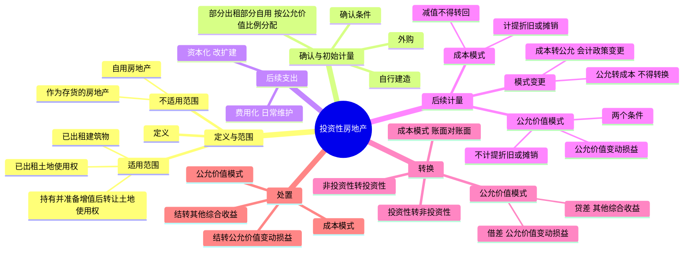

## 📍 章节定位

| 项目 | 信息 |
|------|------|
| **所属科目** | 📒 会计 |
| **难度等级** | ⭐⭐ |
| **历年分值** | 2-3分 |
| **建议学时** | 3-4h |

## 📝 考情分析

本章是会计科目基础章节，历年分值约 2-3 分，以客观题和主观题结合形式考查，主观题常结合会计政策变更、所得税等在综合题中出现。命题热点集中在：投资性房地产范围的界定（已出租的土地使用权、持有并准备增值后转让的土地使用权、已出租的建筑物）、成本模式与公允价值模式后续计量的差异、后续计量模式变更（成本模式转为公允价值模式作为会计政策变更，公允价值模式不得转为成本模式）、房地产转换的会计处理（特别是自用房地产转换为公允价值模式计量的投资性房地产时，公允价值大于账面价值的差额计入"其他综合收益"这一易错点）、投资性房地产的处置（结转其他综合收益和公允价值变动损益）。

考生需重点掌握：成本模式下计提折旧/摊销走"其他业务成本"；公允价值模式下不计提折旧/摊销，公允价值变动走"公允价值变动损益"；非投资性房地产转公允价值模式投资性房地产时，借差（公允价值<账面价值）走"公允价值变动损益"，贷差（公允价值>账面价值）走"其他综合收益"。

## 🧠 知识框架



## 📖 核心精讲

### 一、投资性房地产的特征与范围

#### （一）投资性房地产的定义

**投资性房地产**，是指为赚取租金或资本增值，或者两者兼有而持有的房地产。投资性房地产有别于企业自用的房地产（作为固定资产或无形资产处理）和房地产开发企业作为存货的房地产（作为存货处理）。投资性房地产应当能够单独计量和出售。

投资性房地产的主要形式是出租建筑物、出租土地使用权（让渡资产使用权取得使用费收入），另一种形式是持有并准备增值后转让的土地使用权。

#### （二）投资性房地产的适用范围

| 范围 | 说明 | 确认时点 |
|------|------|---------|
| **已出租的土地使用权** | 通过出让或转让方式取得的、以经营租赁方式出租的土地使用权 | 租赁期开始日 |
| **持有并准备增值后转让的土地使用权** | 企业取得的、准备增值后转让的土地使用权 | 自用土地使用权停止自用、准备增值后转让的日期 |
| **已出租的建筑物** | 企业拥有产权的、以经营租赁方式出租的建筑物 | 租赁期开始日 |

**已出租建筑物判断要点**：
1. 用于出租的建筑物是企业**拥有产权**的建筑物（企业租入再转租的不属于投资性房地产）；
2. 一般自租赁期开始日起确认为投资性房地产。对空置建筑物或在建建筑物，如董事会或类似机构作出书面决议，明确表明将其用于经营出租且持有意图短期内不再发生变化的，即使尚未签订租赁协议，也应视为投资性房地产；
3. 企业将建筑物出租，按租赁协议向承租人提供的相关辅助服务在整个协议中**不重大**的，应当将该建筑物确认为投资性房地产。

**注意**：按照国家有关规定认定的**闲置土地**，不属于持有并准备增值后转让的土地使用权，不属于投资性房地产。

#### （三）投资性房地产的不适用范围

1. **自用房地产**：为生产商品、提供劳务或经营管理而持有的房地产（固定资产或无形资产）。如企业出租给本企业职工居住的宿舍、企业自行经营的旅馆饭店等。
2. **作为存货的房地产**：房地产开发企业在日常活动中销售的或为销售而正在开发的商品房。房地产开发企业待增值后再转让的开发土地也不得确认为投资性房地产。

**部分自用部分出租**：如某项房地产不同用途的部分能够单独计量和出售的，应当分别确认为固定资产（或无形资产、存货）和投资性房地产。

### 二、投资性房地产的确认和初始计量

#### （一）确认条件

投资性房地产只有在符合定义的前提下，同时满足下列条件的，才能予以确认：
1. 与该投资性房地产有关的经济利益很可能流入企业；
2. 该投资性房地产的成本能够可靠地计量。

#### （二）初始计量

投资性房地产应当按照**成本**进行初始计量。

**1. 外购投资性房地产**：取得时的实际成本包括购买价款、相关税费和可直接归属于该资产的其他支出。企业购入的房地产，部分用于出租（或资本增值）、部分自用，用于出租（或资本增值）的部分应单独确认的，应按照不同部分的**公允价值占公允价值总额的比例**将成本在不同部分之间进行分配。

**2. 自行建造投资性房地产**：成本由建造该项资产达到预定可使用状态前发生的必要支出构成，包括土地开发费、建筑成本、安装成本、应予以资本化的借款费用、支付的其他费用和分摊的间接费用等。建造过程中发生的非正常性损失，直接计入当期损益，不计入建造成本。

**3. 非投资性房地产转换为投资性房地产**：成本模式计量时，按该项房地产在转换日的**账面价值**入账；公允价值模式计量时，按该项房地产在转换日的**公允价值**入账。

#### （三）与投资性房地产有关的后续支出

| 类型 | 条件 | 会计处理 |
|------|------|---------|
| **资本化的后续支出** | 满足投资性房地产确认条件（改扩建、装修等） | 计入投资性房地产成本；再开发期间继续作为投资性房地产，**不计提折旧或摊销** |
| **费用化的后续支出** | 不满足投资性房地产确认条件（日常维护等） | 发生时计入当期损益（其他业务成本） |

### 三、投资性房地产的后续计量

同一企业只能采用一种模式对其所有投资性房地产进行后续计量，不得同时采用两种计量模式。

#### （一）成本模式

采用成本模式进行后续计量的投资性房地产，按照固定资产或无形资产的有关规定，按期（月）计提折旧或摊销。

- 计提折旧/摊销：借记"其他业务成本"，贷记"投资性房地产累计折旧（摊销）"。
- 取得租金收入：借记"银行存款"等，贷记"其他业务收入"等。
- 减值：存在减值迹象的，经减值测试后确定发生减值的，计提减值准备（借记"资产减值损失"，贷记"投资性房地产减值准备"）。**减值一经计提，不得转回**。

#### （二）公允价值模式

企业存在确凿证据表明其投资性房地产的公允价值能够持续可靠取得的，可以采用公允价值模式进行后续计量。

**采用公允价值模式的两个条件**：
1. 投资性房地产所在地有活跃的房地产交易市场；
2. 企业能够从活跃的房地产交易市场上取得同类或类似房地产的市场价格及其他相关信息，从而对投资性房地产的公允价值作出科学合理的估计。

**特点**：
- **不计提折旧或摊销**，以资产负债表日的公允价值计量。
- 公允价值高于账面余额的差额：借记"投资性房地产——公允价值变动"，贷记"公允价值变动损益"；低于的作相反分录。

#### （三）后续计量模式的变更

- **成本模式转为公允价值模式**：作为**会计政策变更**处理，按计量模式变更时公允价值与账面价值的差额调整**期初留存收益**。
- **公允价值模式转为成本模式**：**不得转换**。

### 四、投资性房地产的转换

房地产的转换，是因房地产用途发生改变而对房地产进行的重新分类（不是后续计量模式的转变）。企业必须有确凿证据表明房地产用途发生改变：一是董事会或类似机构就改变房地产用途形成正式书面决议；二是房地产因用途改变而发生实际状态上的改变。

#### （一）转换形式

| 转换方向 | 具体形式 | 转换日 |
|---------|---------|--------|
| 投资性房地产 → 自用房地产 | 出租的厂房收回用于生产 | 房地产达到自用状态，企业开始用于生产商品等的日期 |
| 投资性房地产 → 存货 | 房地产开发企业将经营出租的房地产重新开发用于对外销售 | 租赁期届满、董事会作出书面决议明确重新开发用于对外销售的日期 |
| 存货 → 投资性房地产 | 房地产开发企业将开发产品以经营租赁方式出租 | 租赁期开始日 |
| 自用房地产 → 投资性房地产 | 自用办公楼改为出租 | 租赁期开始日 |

#### （二）成本模式下的转换

成本模式下，按照账面价值进行对应结转（账面对账面）：
- 投资性房地产 → 自用房地产：按账面余额、累计折旧/摊销、减值准备分别对应转入"固定资产""累计折旧""固定资产减值准备"等科目。
- 自用房地产 → 投资性房地产：按原价、累计折旧/摊销、减值准备分别对应转入"投资性房地产""投资性房地产累计折旧（摊销）""投资性房地产减值准备"科目。
- 投资性房地产 → 存货：按转换日的账面价值，借记"开发产品"。
- 存货 → 投资性房地产：按转换日的账面价值，借记"投资性房地产"。

#### （三）公允价值模式下的转换

**1. 投资性房地产转换为非投资性房地产（自用/存货）**

以转换当日的**公允价值**作为自用房地产或存货的账面价值，公允价值与原账面价值的差额计入**"公允价值变动损益"**。

借记"固定资产"或"开发产品"（公允价值），贷记"投资性房地产——成本"、"投资性房地产——公允价值变动"（或借记），差额贷记或借记"公允价值变动损益"。

**2. 非投资性房地产转换为投资性房地产（核心考点）**

以转换日的**公允价值**作为投资性房地产的入账价值。原账面价值与公允价值的差额处理：

| 情形 | 差额方向 | 会计处理 |
|------|---------|---------|
| 公允价值 **<** 账面价值 | 借差（损失） | 计入**"公允价值变动损益"** |
| 公允价值 **>** 账面价值 | 贷差（收益） | 计入**"其他综合收益"** |

**关键点**：贷差计入"其他综合收益"是为了防止企业通过转换操纵利润。当该项投资性房地产处置时，因转换计入其他综合收益的部分应转入当期损益（其他业务成本）。

### 五、投资性房地产的处置

当投资性房地产被处置，或者永久退出使用且预计不能从其处置中取得经济利益时，应当终止确认该项投资性房地产。处置收入扣除其账面价值和相关税费后的金额计入当期损益。

#### （一）成本模式计量的处置

- 确认收入：借记"银行存款"等，贷记"其他业务收入""应交税费——应交增值税（销项税额）"。
- 结转成本：借记"其他业务成本"，贷记"投资性房地产"（账面余额）；借记"投资性房地产累计折旧（摊销）""投资性房地产减值准备"。

#### （二）公允价值模式计量的处置

- 确认收入：同成本模式。
- 结转成本：借记"其他业务成本"，贷记"投资性房地产——成本"、"投资性房地产——公允价值变动"（或借记）。
- **结转其他综合收益**：将原转换日计入其他综合收益的金额转入当期损益，借记"其他综合收益"，贷记"其他业务成本"（或相反）。
- **结转公允价值变动损益**：将累计的公允价值变动损益转入其他业务成本，借记或贷记"公允价值变动损益"，贷记或借记"其他业务成本"。

## 💡 典型例题

**【例题 1】（基础题，单选题）**

下列各项中，属于企业投资性房地产的是（　　）。
A. 企业拥有产权并经营出租给本企业职工居住的宿舍
B. 房地产开发企业持有并准备增值后转让的开发土地
C. 企业以经营租赁方式出租的、拥有产权的厂房
D. 企业租入后再转租给其他单位的建筑物

**答案**：C

**解析**：A 不属于投资性房地产，出租给本企业职工居住的宿舍间接为企业生产经营服务，属于自用房地产；B 不属于投资性房地产，房地产开发企业待增值后再转让的开发土地属于存货；C 正确，企业拥有产权并以经营租赁方式出租的厂房属于投资性房地产；D 不属于投资性房地产，企业租入再转租的建筑物不属于其投资性房地产。

**【例题 2】（易错题，单选题）**

企业将自用房地产转换为采用公允价值模式计量的投资性房地产，转换日该房地产的公允价值大于账面价值的差额，应当计入的科目是（　　）。
A. 公允价值变动损益
B. 其他综合收益
C. 资本公积
D. 营业外收入

**答案**：B

**解析**：非投资性房地产转换为公允价值模式计量的投资性房地产时，转换日公允价值大于账面价值的差额（贷差）应当计入"其他综合收益"，防止企业通过转换操纵利润；公允价值小于账面价值的差额（借差）计入"公允价值变动损益"。处置该项投资性房地产时，原计入其他综合收益的部分转入当期损益。

**【例题 3】（计算题，自用房地产转换为公允价值模式投资性房地产）**

2×24 年 6 月，甲企业打算搬迁至新建办公楼，原办公楼处于商业繁华地段，准备将其出租。2×24 年 10 月 30 日，甲企业完成搬迁工作，原办公楼停止自用，并与乙企业签订租赁协议，租赁期开始日为 2×24 年 10 月 30 日。该办公楼原价为 5 亿元，已提折旧 14250 万元，公允价值为 35000 万元。甲企业对投资性房地产采用公允价值模式计量。

要求：编制甲企业的会计分录。

**答案**：

```
借：投资性房地产——成本          350 000 000
　　公允价值变动损益              7 500 000
　　累计折旧                    142 500 000
　　贷：固定资产                  500 000 000
```

**解析**：自用房地产转换为公允价值模式计量的投资性房地产，按转换日公允价值 35000 万元借记"投资性房地产——成本"；按已计提的累计折旧 14250 万元借记"累计折旧"；按账面余额 50000 万元贷记"固定资产"；差额 750 万元（35000 - (50000 - 14250) = -750 万元）为公允价值小于账面价值，借记"公允价值变动损益"。

**【例题 4】（进阶题，多选题）**

关于投资性房地产后续计量模式变更的表述中，正确的有（　　）。
A. 企业对投资性房地产的计量模式一经确定，不得随意变更
B. 只有在房地产市场比较成熟、能够满足采用公允价值模式条件的情况下，才允许从成本模式变更为公允价值模式
C. 成本模式转为公允价值模式的，应当作为会计政策变更处理
D. 已采用公允价值模式计量的投资性房地产，在符合条件时可以转为成本模式

**答案**：ABC

**解析**：A、B、C 正确；D 错误，已采用公允价值模式计量的投资性房地产，**不得**从公允价值模式转为成本模式。

## 🎯 记忆口诀

- **投资性房地产三范围**："出租土地、增值土地、出租建筑"——已出租土地使用权、持有并准备增值后转让的土地使用权、已出租的建筑物。
- **不适用范围**："自用房地产、存货房地产"——自用走固定资产/无形资产，房地产开发企业销售用房走存货。
- **后续计量两模式**："成本折旧减值不转回，公允不折不变动损益"——成本模式计提折旧/摊销、减值不得转回；公允价值模式不计折旧、公允价值变动走"公允价值变动损益"。
- **模式变更**："成本转公允政策变更，公允转成本禁止"——成本转公允作为会计政策变更调整留存收益；公允价值模式不得转为成本模式。
- **转换差额方向**："投资转非投资，差额都进公允变动；非投资转投资，借差进公允变动，贷差进其他综合收益"——核心考点：非投资性房地产转公允价值模式投资性房地产时，贷差（公允价值>账面价值）计入"其他综合收益"。
- **处置结转**："成本模式结折旧减值，公允模式结变动和综合收益"——公允价值模式处置时要结转"公允价值变动损益"和"其他综合收益"到"其他业务成本"。

## ✅ 同步练习

1. （基础题）下列各项中，不属于投资性房地产的是？提示：参见《必刷 550 题》第五章基础题。
2. （进阶题）计算自行建造投资性房地产的入账成本及改扩建支出的资本化处理。提示：参见《必刷 550 题》第五章进阶题。
3. （易错题）自用房地产转换为公允价值模式计量的投资性房地产，公允价值大于账面价值的差额计入科目。提示：参见《必刷 550 题》第五章易错题。
4. （真题改编）投资性房地产后续计量模式变更的会计处理（成本模式转为公允价值模式）。提示：参见《必刷 550 题》第五章真题。
5. 综合复习投资性房地产的转换和处置，重点掌握公允价值模式下的其他综合收益结转和公允价值变动损益结转。
