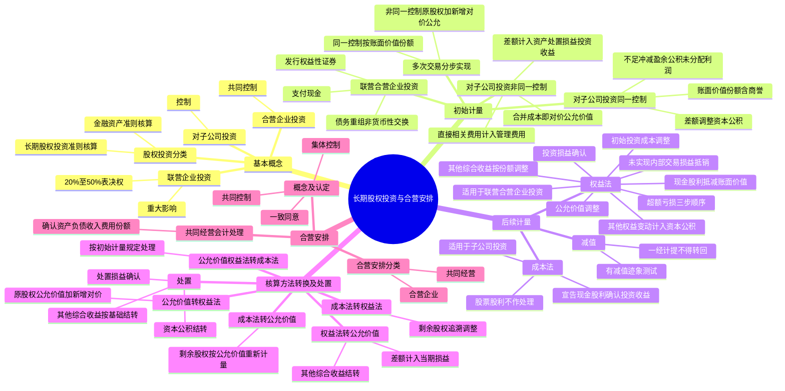

## 1. 章节定位

| 项目 | 信息 |
|------|------|
| 所属科目 | 会计 |
| 难度等级 | 5 |
| 历年分值 | 6-10 分 |
| 建议学时 | 10-12 小时 |
| 知识关联章节 | 第4章 无形资产（土地使用权投资）、第7章 资产减值（长期股权投资减值）、第13章 金融工具（公允价值计量股权投资）、第15章 持有待售（划分为持有待售的长期股权投资）、第24章 企业合并、第27章 合并财务报表（控制判断、内部交易抵销） |

## 2. 考情分析

本章是会计科目的核心重难点章节，历年分值约 6-10 分，几乎每年必考主观题，常以综合题或计算分析题形式出现，并广泛与企业合并、合并财务报表、差错更正等章节联动考查。

**命题规律**：本章内容覆盖面广、综合性强，主观题常以多次股权交易的业务情境为载体，要求考生完成长期股权投资的初始计量、后续计量、核算方法转换及处置的全流程处理。客观题集中在重大影响的判断、同一控制与非同一控制的区分、权益法下投资损益的调整、未实现内部交易损益的抵销。

**高频考点分布**：

1. **基本概念**：股权投资的分类（金融资产 vs 长期股权投资）；联营企业投资（重大影响，20%-50%）；合营企业投资（共同控制）；对子公司投资（控制）。
2. **初始计量——对联营/合营企业投资**：支付现金（购买价款+直接相关费用税金）；发行权益性证券（公允价值，佣金手续费冲减溢价收入）；债务重组、非货币性资产交换。
3. **初始计量——对子公司投资**：同一控制下控股合并（按被合并方在最终控制方合并财务报表中的账面价值份额，含商誉；差额调整资本公积，不足冲减盈余公积和未分配利润）；非同一控制下控股合并（按企业合并成本即付出对价公允价值，差额计入资产处置损益或投资收益）。
4. **后续计量——成本法**：适用于子公司投资；初始投资或追加投资按成本增加账面价值；宣告分派现金股利确认投资收益；股票股利不作账务处理。
5. **后续计量——权益法**：适用于联营、合营企业投资；初始投资成本调整（大于不调整，小于计入营业外收入）；投资损益确认（公允价值调整、未实现内部交易损益抵销）；现金股利抵减账面价值；其他综合收益按份额调整；其他权益变动计入资本公积；超额亏损确认顺序（长期股权投资→长期应收款→预计负债）。
6. **核算方法转换**：成本法转权益法（剩余股权追溯调整）；公允价值/权益法转成本法；公允价值转权益法；权益法转公允价值；成本法转公允价值。
7. **处置**：处置损益确认；其他综合收益结转（与被投资单位直接处置相关资产相同基础）；资本公积结转。
8. **合营安排**：合营安排的认定（共同控制、一致同意）；合营安排的分类（共同经营 vs 合营企业）；共同经营中合营方的会计处理。

**联动考查方式**：
- 与企业合并、合并财务报表结合：多次交易分步实现企业合并、丧失控制权的处理；
- 与差错更正结合：错用成本法/权益法、未抵销未实现内部交易损益；
- 与所得税结合：长期股权投资减值的暂时性差异；
- 与金融工具结合：长期股权投资与金融资产的相互转换。

**备考建议**：
- 牢记"控制用成本法，重大影响/共同控制用权益法"；
- 区分同一控制下（账面价值份额，差额调整资本公积）与非同一控制下（合并成本即公允价值，差额计入损益）；
- 权益法下投资损益确认的两项核心调整：投资时资产公允价值与账面价值差额的摊销调整、未实现内部交易损益的抵销；
- 牢记超额亏损确认的三步顺序；
- 牢记合营安排分类的关键：合营方享有的是净资产权利（合营企业）还是资产权利并承担负债义务（共同经营）。

## 3. 知识框架



## 4. 核心精讲

### 4.1 基本概念

#### 4.1.1 股权投资的分类

股权投资根据投资方在投资后对被投资单位能够施加影响的程度，区分为两类：

| 分类 | 适用准则 | 核算方法 |
|------|---------|---------|
| 对子公司、联营企业、合营企业的投资 | 长期股权投资准则 | 成本法/权益法 |
| 不具有控制、共同控制或重大影响的投资 | 金融工具确认和计量准则 | 公允价值计量 |

#### 4.1.2 联营企业投资（重大影响）

**联营企业投资**是指投资方能够对被投资单位施加**重大影响**的股权投资。重大影响是指投资方对被投资单位的财务和生产经营决策有参与决策的权力，但并不能控制或与其他方一起共同控制这些政策的制定。

从股权比例来看，投资方直接或通过子公司间接持有被投资单位**20% 以上但低于 50%** 的表决权股份时，一般认为对被投资单位具有重大影响，除非有明确的证据表明该种情况下不能参与被投资单位的生产经营决策。

判断重大影响的五种情形：
1. 在被投资单位的董事会或类似权力机构中派有代表；
2. 参与被投资单位财务和经营政策制定过程；
3. 与被投资单位之间发生重要交易；
4. 向被投资单位派出管理人员；
5. 向被投资单位提供关键技术资料。

> 关键原则：重大影响的判断关键是分析投资方是否有**实质性的参与权**而不是决定权。重大影响为"参与决策的权力"而非"正在行使的权力"。

#### 4.1.3 合营企业投资（共同控制）

**合营企业投资**是指投资方与其他合营方一同对被投资单位实施**共同控制**，且对被投资单位净资产享有权利的权益性投资。合营企业是共同控制一项安排的参与方仅对该安排的净资产享有权利的合营安排。

#### 4.1.4 对子公司投资（控制）

**对子公司投资**是指投资方持有的能够对被投资单位施加**控制**的股权投资。对子公司投资的取得，通常是通过企业合并方式。

### 4.2 长期股权投资的初始计量

#### 4.2.1 长期股权投资的确认

对子公司投资的确认时点为**购买日（或合并日）**。合并日（或购买日）是指合并方（或购买方）实际取得对被合并方（或被购买方）控制权的日期。同时满足以下条件的，通常可认为实现了控制权的转移：

1. 企业合并合同或协议已获股东会等内部权力机构通过；
2. 需要经过国家有关主管部门审批的，已获得批准；
3. 参与合并各方已办理了必要的财产权转移手续；
4. 合并方或购买方已支付了合并价款的大部分（一般应超过 50%），并且有能力、有计划支付剩余款项；
5. 合并方或购买方实际上已经控制了被合并方或被购买方的财务和经营政策。

#### 4.2.2 对联营企业、合营企业投资的初始计量

| 取得方式 | 初始投资成本 | 特别说明 |
|---------|------------|---------|
| 支付现金 | 实际支付的购买价款+直接相关费用、税金及其他必要支出 | 价款中包含的已宣告但尚未发放的现金股利或利润作为应收项目 |
| 发行权益性证券 | 所发行权益性证券的公允价值 | 不包括已宣告但尚未发放的现金股利；佣金手续费冲减溢价收入 |
| 债务重组、非货币性资产交换 | 按相关准则规定确定 | 按债务重组、非货币性资产交换准则 |

**【例 6-1】** 2×24 年 3 月 5 日，A 公司通过增发 9 000 万股本公司普通股（每股面值 1 元）取得 B 公司 20% 的股权，该 9 000 万股股份的公允价值为 15 600 万元。为增发该部分股份，A 公司向证券承销机构等支付了 600 万元的佣金和手续费。假定 A 公司取得该部分股权后，能够对 B 公司的财务和生产经营决策施加重大影响。

A 公司的账务处理：

```
借：长期股权投资——投资成本    156 000 000
    贷：股本                        90 000 000
        资本公积——股本溢价           66 000 000

借：资本公积——股本溢价          6 000 000
    贷：银行存款                    6 000 000
```

#### 4.2.3 对子公司投资的初始计量

**（1）同一控制下控股合并**

同一控制下企业合并形成的合并方对被合并方的长期股权投资，应当按照**合并日取得被合并方所有者权益在最终控制方合并财务报表中的账面价值的份额**作为初始投资成本（含最终控制方收购被合并方所形成的商誉）。

初始投资成本与支付的现金、转让的非现金资产及所承担债务账面价值之间的差额，应当调整**资本公积（资本溢价或股本溢价）**；资本公积不足冲减的，依次冲减**盈余公积**和**未分配利润**。

> 重要原则：同一控制下企业合并作为企业集团内资产和权益的整合，合并方支付对价以账面价值结转，**不确认损益**。

**【例 6-2】** 甲公司于 2×25 年 4 月 1 日自其母公司（P 公司）取得 B 公司 100% 股权。B 公司净资产在最终控制方 P 公司的账面价值为 9.2 亿元。甲公司用以支付的对价为一项土地使用权（成本 7 亿元，已摊销 1.5 亿元），同时支付现金 5 亿元。甲公司资本公积（资本溢价）余额为 3.6 亿元。

甲公司的账务处理：

```
借：长期股权投资              920 000 000
    累计摊销                  150 000 000
    资本公积                  130 000 000
    贷：无形资产                   700 000 000
        银行存款                   500 000 000
```

**（2）非同一控制下控股合并**

非同一控制下企业合并中，购买方应当按照确定的**企业合并成本**作为长期股权投资的初始投资成本。企业合并成本包括购买方付出的资产、发生或承担的负债、发行的权益性证券的**公允价值**之和。

付出对价的公允价值与账面价值的差额，计入**资产处置损益**或**投资收益**等科目。企业发生的审计、法律服务、评估咨询等中介费用，于发生时计入**管理费用**。

> 重要区分：非同一控制下企业合并，合并成本为付出对价的**公允价值**，差额计入损益；同一控制下企业合并，初始投资成本为账面价值份额，差额调整资本公积。

**【例 6-3】** A 公司于 2×25 年 3 月 31 日取得 B 公司 70% 的股权。A 公司支付的有关资产在购买日的账面价值与公允价值：土地使用权账面价值 6 000 万元、公允价值 9 600 万元；专利技术账面价值 2 400 万元、公允价值 3 000 万元；银行存款 2 400 万元。合并前 A 公司与 B 公司不存在任何关联方关系。

A 公司的账务处理：

```
借：长期股权投资              150 000 000
    累计摊销                   12 000 000
    贷：无形资产                    96 000 000
        银行存款                    24 000 000
        资产处置损益                 42 000 000

借：管理费用                   3 000 000
    贷：银行存款                    3 000 000
```

**（3）多次交易分步实现企业合并**

通过多次交换交易分步取得股权最终形成控股合并的：

| 类型 | 个别财务报表处理 |
|------|----------------|
| 同一控制下 | 以持股比例计算的合并日应享有被合并方所有者权益在最终控制方合并财务报表中的账面价值份额作为初始投资成本，差额调整资本公积 |
| 非同一控制下（原权益法） | 购买日长期股权投资的初始投资成本 = 原权益法下的账面价值 + 购买日新增投资成本（公允价值），原其他综合收益/资本公积暂不处理 |
| 非同一控制下（原公允价值计量） | 原股权公允价值与账面价值的差额及原计入其他综合收益的累计公允价值变动按处置原股权相同基础处理 |

**（4）投资成本中包含的已宣告但尚未发放的现金股利或利润**

企业无论以何种方式取得长期股权投资，投资成本中包含的被投资单位已经宣告但尚未发放的现金股利或利润，应作为**应收项目**单独核算，不构成初始投资成本。

### 4.3 长期股权投资的后续计量

#### 4.3.1 成本法

成本法适用于企业持有的能够对被投资单位实施**控制**的长期股权投资（子公司投资）。

| 业务 | 会计处理 |
|------|---------|
| 初始投资或追加投资 | 按成本增加长期股权投资账面价值 |
| 被投资单位宣告分派现金股利或利润 | 按享有份额确认投资收益（不管分配的是取得投资前还是后的利润） |
| 股票股利 | 不作账务处理，除权日注明增加的股数 |

> 注意：确认现金股利后，应当考虑长期股权投资是否发生减值。如果分得的现金股利大于取得投资后被投资单位实现的净利润，超过部分可能涉及减值。

#### 4.3.2 权益法

权益法适用于投资企业持有的对**合营企业投资**及**联营企业投资**（划分为持有待售的部分除外）。

**（1）初始投资成本的调整**

| 情形 | 会计处理 |
|------|---------|
| 初始投资成本 > 应享有被投资单位可辨认净资产公允价值份额 | 不调整长期股权投资成本（差额为商誉） |
| 初始投资成本 < 应享有被投资单位可辨认净资产公允价值份额 | 调增长期股权投资成本，差额计入**营业外收入** |

**（2）投资损益的确认**

投资企业应当按照应享有或应分担被投资单位实现净利润或发生净亏损的份额，调整长期股权投资的账面价值，并确认为当期投资损益。在被投资单位账面净利润的基础上，应考虑以下因素进行调整：

**第一项调整：会计政策及会计期间不一致的调整**。被投资单位采用的会计政策或会计期间与投资企业不一致的，应按投资企业的会计政策及会计期间对被投资单位的财务报表进行调整。

**第二项调整：投资时资产公允价值与账面价值差额的摊销调整**。以取得投资时被投资单位固定资产、无形资产的公允价值为基础计提的折旧额或摊销额，以及以投资企业取得投资时的公允价值为基础计算确定的资产减值准备金额等对被投资单位净利润的影响。

> 实务简化：符合下列条件之一的，可以以被投资单位的账面净利润为基础计算确认投资损益：①无法合理确定取得投资时各项可辨认资产的公允价值；②投资时可辨认净资产公允价值与其账面价值的差额不具重要性；③其他原因导致无法对净损益进行调整。

**第三项调整：潜在表决权**。在评估投资方对被投资单位是否具有重大影响时，应当考虑潜在表决权的影响，但在确定应享有的净损益份额时，潜在表决权所对应的权益份额不应予以考虑。

**第四项调整：不属于投资企业的净损益应当剔除**。例如被投资单位发行了分类为权益的可累积优先股，投资方计算应享有的净利润时，应将归属于其他投资方的累积优先股股利予以扣除。

**第五项调整：未实现内部交易损益的抵销**。投资企业与联营企业及合营企业之间发生的未实现内部交易损益，按照持股比例计算归属于投资企业的部分应当予以抵销。

| 交易类型 | 定义 | 抵销处理 |
|---------|------|---------|
| 顺流交易 | 投资方向联营/合营企业投出或出售资产 | 投资方损益中按持股比例归属于本企业的部分不予确认 |
| 逆流交易 | 联营/合营企业向投资方出售资产 | 联营/合营企业损益中投资方应享有的部分不予确认 |

> 重要例外：投资方与联营、合营企业之间发生投出或出售资产的交易，该资产**构成业务**的，应当按企业合并准则处理，相关损益不予抵销。未实现内部交易损失属于资产减值损失的，应当**全额确认**，不予抵销。

**【例 6-4】** 甲公司持有乙公司 20% 有表决权股份。2×24 年，甲企业将其账面价值为 600 万元的商品以 1 000 万元的价格出售给乙公司（顺流交易）。至 2×24 年资产负债表日，该批商品尚未对外部第三方出售。乙公司 2×24 年净利润为 2 000 万元。

甲企业账务处理：

```
借：长期股权投资——损益调整    3 200 000
    贷：投资收益    [(20 000 000 - 4 000 000) × 20%]    3 200 000
```

> 合并财务报表中的调整（如有子公司需编制合并报表）：

```
借：营业收入    (10 000 000 × 20%)    2 000 000
    贷：营业成本    (6 000 000 × 20%)    1 200 000
        投资收益                          800 000
```

**（3）取得现金股利或利润的处理**

投资企业自被投资单位取得的现金股利或利润，应**抵减**长期股权投资的账面价值。被投资单位宣告分派时，借记"应收股利"，贷记"长期股权投资——损益调整"。

**（4）其他综合收益的处理**

被投资单位其他综合收益发生变动时，投资企业应当按照归属于本企业的部分，调整长期股权投资的账面价值，借记"长期股权投资——其他综合收益"，贷记"其他综合收益"（或相反）。

**（5）被投资单位所有者权益其他变动的处理**

投资企业对于被投资单位除净损益、其他综合收益以及利润分配以外所有者权益的其他变动，应按照持股比例计算的归属于本企业的部分，调整长期股权投资账面价值，同时增加或减少**资本公积（其他资本公积）**。主要包括：被投资单位接受其他股东的资本性投入、发行可分离交易可转换公司债券的权益成分、以权益结算的股份支付、其他股东增资导致投资方持股比例变动等。

**（6）超额亏损的确认**

投资企业确认应分担被投资单位的净损失，原则上应以长期股权投资及其他实质上构成对被投资单位净投资的长期权益减记至零为限。确认顺序如下：

| 步骤 | 处理 |
|------|------|
| 第一步 | 减记长期股权投资的账面价值（至零为限） |
| 第二步 | 减记其他实质上构成对被投资单位净投资的长期权益（如长期应收款） |
| 第三步 | 按合同或协议约定承担额外损失义务的，确认预计负债 |
| 未确认部分 | 账外备查登记 |

被投资单位以后期间实现净利润或其他综合收益增加时，投资方应按相反顺序恢复。

**（7）股票股利的处理**

被投资单位分派的股票股利，投资企业不作账务处理，但应于除权日注明所增加的股数。

**（8）因被动稀释导致持股比例下降时"内含商誉"的结转**

因其他投资方增资导致投资方持股比例被稀释，且稀释后仍采用权益法核算的，投资方应当**按比例结转**初始投资时形成的"内含商誉"，并将相关股权稀释影响计入**资本公积（其他资本公积）**。

**（9）长期股权投资的减值**

长期股权投资存在减值迹象的，应当按照资产减值准则计提减值准备。长期股权投资的减值准备一经计提，**不允许转回**。

### 4.4 长期股权投资核算方法的转换及处置

#### 4.4.1 成本法转换为权益法

因处置投资导致对被投资单位由控制转为重大影响或共同控制：

**个别财务报表**：
1. 按处置投资的比例结转应终止确认的长期股权投资成本，与处置对价的差额计入当期损益；
2. 将剩余股权转为权益法核算，进行**追溯调整**：
   - 比较剩余长期股权投资成本与按照剩余持股比例计算原投资时应享有被投资单位可辨认净资产公允价值份额，前者大于后者（商誉）不调整，前者小于后者调整期初留存收益；
   - 原取得投资后至处置当期期初被投资单位实现的净损益中应享有的份额，调整期初留存收益；
   - 处置投资当期期初至处置之日被投资单位实现的净损益中应享有的份额，调整当期损益；
   - 其他原因导致所有者权益变动中应享有的份额，计入其他综合收益或资本公积。

**合并财务报表**：剩余股权按照其在丧失控制权日的**公允价值**进行重新计量，处置股权取得的对价与剩余股权公允价值之和，减去按原持股比例计算应享有原有子公司自购买日开始持续计算的净资产的份额之间的差额，计入丧失控制权当期的投资收益。

#### 4.4.2 公允价值计量或权益法转换为成本法

因追加投资导致原持有的分类为以公允价值计量的金融资产或对联营/合营企业的投资转变为对子公司投资的，按照对子公司投资初始计量的相关规定处理。

#### 4.4.3 公允价值计量转为权益法

因追加投资能够实施共同控制或重大影响的，在转换日按照原股权的**公允价值**加上为取得新增投资而应支付对价的公允价值，作为改按权益法核算的初始投资成本。如原投资属于指定为以公允价值计量且其变动计入其他综合收益的非交易性权益工具投资，原计入其他综合收益的累计公允价值变动转入**留存收益**，不得计入当期损益。

#### 4.4.4 权益法转为公允价值计量

因部分处置导致持股比例下降，不能再实施共同控制或重大影响的，剩余股权改按公允价值计量，公允价值与原账面价值之间的差额计入**当期损益**。原采用权益法核算的相关其他综合收益应当采用与被投资单位直接处置相关资产或负债相同的基础进行会计处理；原计入资本公积的金额全部转入当期损益。

**【例 6-5】** 甲公司持有乙公司 30% 的有表决权股份，采用权益法核算。2×24 年 10 月，甲公司将该项投资中的 50% 对外出售，取得价款 1 800 万元。剩余 15% 股权转为以公允价值计量且其变动计入其他综合收益。出售时长期股权投资的账面价值为 3 200 万元，其中投资成本 2 600 万元，损益调整 300 万元，其他综合收益 200 万元（被投资方非交易性权益工具投资公允价值变动），其他权益变动 100 万元。剩余股权公允价值为 1 800 万元。

甲公司的账务处理：

（1）确认处置损益：

```
借：银行存款                   18 000 000
    贷：长期股权投资——投资成本    13 000 000
        长期股权投资——损益调整     1 500 000
        长期股权投资——其他综合收益   1 000 000
        长期股权投资——其他权益变动   500 000
        投资收益                     2 000 000
```

（2）原其他综合收益为非交易性权益工具投资公允价值变动，转入留存收益：

```
借：其他综合收益               2 000 000
    贷：利润分配——未分配利润        2 000 000
```

（3）原资本公积全部转入当期损益：

```
借：资本公积——其他资本公积     1 000 000
    贷：投资收益                    1 000 000
```

（4）剩余股权转为公允价值计量，公允价值 1 800 万元与账面价值 1 600 万元的差额 200 万元计入投资收益：

```
借：其他权益工具投资——成本     18 000 000
    贷：长期股权投资——投资成本    13 000 000
        长期股权投资——损益调整     1 500 000
        长期股权投资——其他综合收益   1 000 000
        长期股权投资——其他权益变动   500 000
        投资收益                     2 000 000
```

#### 4.4.5 成本法转为公允价值计量

因部分处置导致丧失控制权且不再具有共同控制或重大影响的，剩余股权于丧失控制权日按**公允价值**重新计量，公允价值与账面价值的差额计入当期损益。

#### 4.4.6 长期股权投资的处置

企业处置长期股权投资时，应结转与所售股权相对应的长期股权投资的账面价值，出售所得价款与处置长期股权投资账面价值之间的差额，确认为处置损益。

采用权益法核算的长期股权投资，在处置时，原计入其他综合收益（不能结转损益的除外）或资本公积（其他资本公积）的金额，应按比例结转至当期损益。

> 不能结转损益的其他综合收益主要包括：①被投资方重新计量设定受益计划净负债或净资产变动导致的权益变动份额；②被投资方其他权益工具投资公允价值变动计入其他综合收益的部分（转入留存收益）。

### 4.5 合营安排

#### 4.5.1 合营安排的认定

**合营安排**是指一项由两个或两个以上的参与方共同控制的安排。合营安排的主要特征：

1. **各参与方均受到该安排的约束**。相关约定是据以判断是否存在共同控制的一系列具有执行力的合约。
2. **两个或两个以上的参与方对该安排实施共同控制**。任何一个参与方都不能够单独控制该安排。

**共同控制**是指按照相关约定对某项安排所共有的控制，并且该安排的相关活动必须经过分享控制权的参与方**一致同意**后才能决策。

判断共同控制的步骤：
1. 判断是否所有参与方或参与方组合**集体控制**该安排（不存在任何一方单独控制）；
2. 判断该安排相关活动的决策是否必须经过这些参与方**一致同意**。

> 关键判断：如果存在两个或两个以上的参与方组合能够集体控制某项安排的，**不构成共同控制**（因为不满足"唯一组合"要求）。

**【例 6-6】** A 公司、B 公司、C 公司分别拥有 D 公司 50%、30% 和 20% 的表决权股份。相关约定规定，75% 以上的表决权即可对 D 公司的相关活动作出决策。

分析：A 公司和 B 公司是能够集体控制 D 公司的**唯一组合**（50%+30%=80%≥75%），当且仅当 A 公司、B 公司一致同意时，D 公司的相关活动决策方能表决通过。因此，A 公司、B 公司对 D 公司具有共同控制权。

如果约定 60% 以上即可决策且未指明特定组合，则 A+B（80%）和 A+C（70%）均满足，存在多个集体控制组合，不构成共同控制，三家公司均视为具有重大影响。

**保护性权利**：仅享有保护性权利的参与方不享有共同控制。保护性权利是指仅为了保护权利持有人利益却没有赋予持有人对相关活动进行决策的一项权利。

#### 4.5.2 合营安排的分类

合营安排分为**共同经营**和**合营企业**：

| 类型 | 定义 | 合营方的权利义务 |
|------|------|----------------|
| 共同经营 | 合营方享有该安排相关资产且承担该安排相关负债的合营安排 | 对相关资产享有权利，对相关负债承担义务 |
| 合营企业 | 合营方仅对该安排的净资产享有权利的合营安排 | 仅对净资产享有权利 |

**分类判断步骤**（从是否通过单独主体达成为起点）：

1. **未通过单独主体达成**：通常划分为**共同经营**。
2. **通过单独主体达成**：
   - 第一步：分析单独主体的**法律形式**（如有限责任公司将资产负债与参与方分离，初步判定为合营企业）；
   - 第二步：若法律形式不足，分析**合同安排**的条款；
   - 第三步：若仍不足，考虑**其他事实和情况**（如合营安排的目的和设计、参与方是否实质上享有资产全部经济利益并承担负债清偿义务）。

#### 4.5.3 共同经营中合营方的会计处理

合营方应当确认自身所承担的以及按比例享有或承担的合营安排中按照合同、协议等的规定归属于本企业的资产、负债、收入及费用：

1. 确认单独所持有的资产，以及按其份额确认共同持有的资产；
2. 确认单独所承担的负债，以及按其份额确认共同承担的负债；
3. 确认出售其享有的共同经营产出份额所产生的收入；
4. 按其份额确认共同经营因出售产出所产生的收入；
5. 确认单独所发生的费用，以及按其份额确认共同经营发生的费用。

> 对共同经营不享有共同控制的参与方（非合营方），如果享有该共同经营相关资产且承担相关负债的，比照合营方进行会计处理。

**合营方与共同经营之间的资产交易**（不构成业务）：
- 合营方向共同经营投出或出售资产，在共同经营将相关资产出售给第三方或消耗之前，应当仅确认归属于共同经营其他参与方的利得或损失；
- 合营方自共同经营购买资产，在将该资产出售给第三方之前，不应当确认因该交易产生的损益中该合营方应享有的部分。

## 5. 典型例题

**【例题 1】（权益法下投资损益的确认——公允价值调整与未实现内部交易抵销）**

甲公司于 2×24 年 1 月 10 日购入乙公司 30% 的股份，购买价款为 3 300 万元。取得投资当日，乙公司可辨认净资产公允价值为 9 000 万元，除存货、固定资产、无形资产外，其他资产负债公允价值与账面价值相同。存货账面价值 750 万元、公允价值 1 050 万元；固定资产账面价值 1 800 万元、公允价值 2 400 万元（尚可使用 16 年，直线法）；无形资产账面价值 1 050 万元、公允价值 1 200 万元（尚可使用 8 年，直线法）。

2×24 年乙公司实现净利润 900 万元，其中取得投资时的账面存货有 80% 对外出售。甲公司与乙公司间未发生任何内部交易。不考虑所得税影响。

要求：计算甲公司 2×24 年应确认的投资收益并编制会计分录。

**答案**：

调整后的净利润计算：
- 存货调整：调减利润 = (1 050 − 750) × 80% = 240（万元）
- 固定资产折旧调整：调增折旧 = 2 400 ÷ 16 − 1 800 ÷ 20 = 150 − 90 = 60（万元）
- 无形资产摊销调整：调增摊销 = 1 200 ÷ 8 − 1 050 ÷ 10 = 150 − 105 = 45（万元）

调整后的净利润 = 900 − 240 − 60 − 45 = 555（万元）

甲公司应享有份额 = 555 × 30% = 166.50（万元）

```
借：长期股权投资——损益调整    1 665 000
    贷：投资收益                    1 665 000
```

**解析**：权益法下确认投资损益时，应当以投资时被投资单位各项可辨认资产公允价值为基础对被投资单位账面净利润进行调整。存货按已对外出售比例调整，固定资产和无形资产按公允价值重新计算折旧摊销额调整。

**【例题 2】（同一控制下企业合并的初始计量）**

甲公司为某一集团母公司，分别控制乙公司和丙公司。2×23 年 1 月 1 日，甲公司从本集团外部以现金对价 4 000 万元购入丁公司 80% 股权并能够控制丁公司（属于非同一控制下企业合并）。购买日，丁公司可辨认净资产的公允价值为 5 000 万元，账面价值为 3 500 万元。2×23 年 1 月至 2×24 年 12 月 31 日，丁公司按照购买日净资产的公允价值计算实现的净利润为 1 200 万元，无其他所有者权益变动。2×25 年 1 月 1 日，乙公司购入甲公司所持丁公司的 80% 股权，形成同一控制下的企业合并。

要求：计算乙公司购入丁公司的初始投资成本。

**答案**：

2×25 年 1 月 1 日，丁公司相对于最终控制方甲公司的账面价值 = 自 2×23 年 1 月 1 日丁公司净资产公允价值 5 000 万元持续计算至 2×24 年 12 月 31 日的账面价值 = 5 000 + 1 200 = 6 200（万元）。

乙公司购入丁公司的初始投资成本 = (5 000 + 1 200) × 80% = **4 960（万元）**。

**解析**：同一控制下企业合并，合并方应以合并日取得被合并方所有者权益在最终控制方合并财务报表中的账面价值的份额作为初始投资成本，该账面价值是自最终控制方取得控制时开始持续计算的账面价值（含商誉），不是被合并方个别财务报表中的账面价值。

**【例题 3】（成本法转权益法的追溯调整）**

2×23 年 1 月 1 日，甲公司支付 600 万元取得乙公司 100% 的股权，当日乙公司可辨认净资产的公允价值为 500 万元，商誉 100 万元。2×23 年 1 月 1 日至 2×24 年 12 月 31 日，乙公司的净资产增加了 75 万元，其中按购买日公允价值计算实现的净利润为 50 万元，持有的以公允价值计量且其变动计入其他综合收益的非交易性权益工具投资的公允价值升值 25 万元。2×25 年 1 月 8 日，甲公司转让乙公司 60% 的股权，收取现金 480 万元，转让后甲公司对乙公司的持股比例为 40%，能对其施加重大影响。2×25 年 1 月 8 日，乙公司剩余 40% 股权的公允价值为 320 万元。假定乙公司未分配现金股利，不考虑其他因素。

要求：编制甲公司个别财务报表中的会计分录（金额单位：万元）。

**答案**：

（1）确认部分股权处置收益：

```
借：银行存款                   480
    贷：长期股权投资    (600 × 60%)    360
        投资收益                      120
```

（2）对剩余股权改按权益法核算：

```
借：长期股权投资——损益调整       20
    长期股权投资——其他综合收益   10
    贷：利润分配——未分配利润    (50 × 40%)    20
        其他综合收益            (25 × 40%)    10
```

经上述调整后，剩余股权的账面价值 = 600 × 40% + 30 = 270（万元）。

**解析**：成本法转权益法时，剩余股权应当追溯调整。原取得投资时至处置投资当期期初被投资单位实现的净损益中应享有的份额调整期初留存收益；其他综合收益变动按份额调整。商誉部分（初始投资成本 600 万元 > 应享可辨认净资产公允价值份额 500 万元，差额 100 万元）不调整长期股权投资账面价值。

## 6. 记忆口诀

**股权投资分类**："控制子公司用成本法，重大影响联营、共同控制合营用权益法，其余金融资产公允价值计量"——根据影响程度选择核算方法。

**重大影响比例**："20% 以上 50% 以下"——通常认为具有重大影响。

**初始计量两类**："同一控制账面份额，非同一控制公允价值"——同一控制按被合并方在最终控制方合并报表中的账面价值份额，非同一控制按付出对价公允价值。

**同一控制差额处理**："差额调资本公积，不足冲减盈余公积和未分配利润，不确认损益"——作为集团内权益整合。

**非同一控制差额处理**："差额计入资产处置损益或投资收益，中介费用计入管理费用"——市场化购买。

**权益法初始投资成本调整**："大于不调是商誉，小于调增进营业外收入"——初始投资成本小于应享可辨认净资产公允价值份额的差额计入营业外收入。

**权益法投资损益两项调整**："公允价值差额摊销调，未实现内部交易损益抵销"——投资时资产公允价值与账面价值差额的摊销调整，顺流逆流交易的未实现内部交易损益抵销。

**未实现内部交易抵销**："顺流逆流都抵销，构成业务不抵销，减值损失全额确认"——构成业务的不抵销，资产减值损失全额确认。

**超额亏损三步顺序**："先减长期股权投资至零，再减长期应收款，最后确认预计负债"——超额亏损确认顺序。

**其他综合收益结转**："处置时按与被投资单位直接处置相关资产相同基础结转"——不能结转损益的除外（设定受益计划、其他权益工具投资转留存收益）。

**成本法转权益法**："剩余股权追溯调整，前期净损益调期初留存收益，当期净损益调当期损益"——个别报表追溯调整。

**丧失控制权合并报表**："剩余股权按丧失控制权日公允价值重新计量"——合并报表中剩余股权重新计量。

**合营安排分类关键**："享有净资产权利是合营企业，享有资产权利承担负债义务是共同经营"——根据合营方权利义务判断。

**共同控制判断**："唯一组合加一致同意"——集体控制该安排的参与方组合唯一，且需一致同意。

**共同控制不成立**："多个组合能控制不构成共同控制"——存在两个及以上集体控制组合时不构成共同控制。
