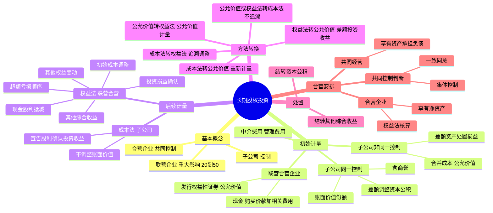

## 📍 章节定位

| 项目 | 信息 |
|------|------|
| **所属科目** | 📒 会计 |
| **难度等级** | ⭐⭐⭐⭐ |
| **历年分值** | 8-12分 |
| **建议学时** | 12-15h |

## 📝 考情分析

本章是会计科目的**核心重点章节**，历年分值约 8-12 分，是主观题的必考章节，常与企业合并、合并财务报表结合出综合题。命题热点集中在：长期股权投资初始投资成本的确定（同一控制下按账面价值份额、非同一控制下按合并成本）、成本法与权益法的核算差异、权益法下投资损益的调整（公允价值调整、未实现内部交易损益抵销）、超额亏损的确认顺序、长期股权投资核算方法的转换（成本法转权益法的追溯调整、公允价值转权益法、权益法转公允价值）、合营安排的分类（共同经营 vs 合营企业）。

考生需重点掌握：同一控制下企业合并以"最终控制方合并财务报表中的账面价值份额"为基础（含商誉）这一核心原则；权益法下初始投资成本小于可辨认净资产公允价值份额的差额计入"营业外收入"；顺流交易和逆流交易的未实现内部交易损益抵销（仅抵销归属于投资方的部分）；被动稀释时"内含商誉"的结转；合营安排中共同控制的判断（集体控制+一致同意）。

## 🧠 知识框架



## 📖 核心精讲

### 一、基本概念

**股权投资**根据投资方在投资后对被投资单位能够施加影响的程度，区分为按《CAS 22——金融工具确认和计量》核算和按《CAS 2——长期股权投资》核算两种情况。属于长期股权投资规范的具体包括：对联营企业、合营企业以及子公司的投资。

| 类型 | 影响程度 | 持股比例参考 | 后续计量方法 |
|------|---------|-------------|-------------|
| **联营企业投资** | 能够施加**重大影响** | 直接或间接持有 20% 以上但低于 50% | 权益法 |
| **合营企业投资** | 与其他方共同**控制** | 通常各方持股合计 100% | 权益法 |
| **对子公司投资** | 能够**控制** | 通常超过 50% | 成本法 |

**重大影响的判断**：关键在于投资方是否有实质性的**参与权**（而非决定权）。判断情形包括：在被投资单位董事会派有代表、参与政策制定、发生重要交易、派出管理人员、提供关键技术资料等。重大影响为"参与决策的权力"而非"正在行使的权力"。

### 二、长期股权投资的初始计量

#### （一）对联营企业、合营企业投资的初始计量

| 取得方式 | 初始投资成本 |
|---------|-------------|
| **支付现金** | 实际支付的购买价款 + 与取得投资直接相关的费用、税金及其他必要支出（不含已宣告但尚未发放的现金股利） |
| **发行权益性证券** | 所发行权益性证券的**公允价值**（不含已宣告但尚未发放的股利）；支付给承销机构的佣金、手续费冲减资本公积（股本溢价） |
| **债务重组、非货币性资产交换** | 按《CAS 12》《CAS 7》规定确定 |

#### （二）对子公司投资的初始计量

**1. 同一控制下控股合并**

**核心原则**：从最终控制方的角度，按合并日取得被合并方所有者权益在**最终控制方合并财务报表中的账面价值的份额**作为初始投资成本（含最终控制方收购被合并方所形成的商誉）。

- 初始投资成本与支付对价账面价值的差额：调整**资本公积（资本溢价或股本溢价）**，不足冲减的依次冲减盈余公积和未分配利润。
- 支付对价以**账面价值**结转，**不确认损益**。
- 中介费用（审计、法律、评估等）：发生时计入**管理费用**。
- 发行权益性证券的交易费用：冲减资本公积（股本溢价）。
- 多次交易分步实现同一控制下合并：按持股比例计算的合并日应享有被合并方所有者权益在最终控制方合并财务报表中的账面价值份额作为初始投资成本。

**2. 非同一控制下控股合并**

**核心原则**：按企业合并成本（付出资产、发生或承担负债、发行权益性证券的**公允价值**之和）作为初始投资成本。

- 支付对价公允价值与账面价值的差额：计入**资产处置损益**或**投资收益**等。
- 以库存商品作为对价：按公允价值确认**主营业务收入**，同时结转成本。
- 以其他权益工具投资作为对价：原其他综合收益转入**留存收益**（非交易性权益工具）或投资收益。
- 中介费用：计入**管理费用**。
- 多次交易分步实现非同一控制下合并：购买日长期股权投资初始投资成本 = 原权益法下账面价值 + 购买日新增投资公允价值；原权益法确认的其他综合收益/资本公积暂不处理，待处置时结转。原公允价值计量的金融资产：公允价值与账面价值差额及原其他综合收益采用与处置原股权相同的基础处理。

**3. 投资成本中包含的已宣告但尚未发放的现金股利**

无论何种方式取得，投资成本中包含的已宣告但尚未发放的现金股利或利润，应作为**应收项目**单独核算，不构成初始投资成本。

### 三、长期股权投资的后续计量

#### （一）成本法（适用于子公司投资）

1. 初始投资或追加投资时，按成本增加长期股权投资账面价值。
2. 投资企业按照享有被投资单位宣告发放的现金股利或利润确认**投资收益**（不管有关利润分配是属于取得投资前还是取得投资后被投资单位实现净利润的分配）。
3. 子公司以未分配利润或盈余公积转增股本（股票股利），投资方**不确认**投资收益，仅作备查登记。

#### （二）权益法（适用于联营企业、合营企业投资）

**1. 初始投资成本的调整**

| 情形 | 处理 |
|------|------|
| 初始投资成本 **>** 应享有被投资单位可辨认净资产公允价值份额 | 差额为商誉，**不调整**长期股权投资账面价值 |
| 初始投资成本 **<** 应享有被投资单位可辨认净资产公允价值份额 | 差额计入**营业外收入**，同时调整增加长期股权投资账面价值 |

**2. 投资损益的确认**

投资企业按应享有或应分担被投资单位实现净利润或净亏损的份额，调整长期股权投资账面价值（"损益调整"明细），确认为投资收益。确认时应考虑以下调整：

- **会计政策/会计期间不一致**：按投资企业的会计政策调整。
- **公允价值调整**：以取得投资时被投资单位固定资产、无形资产的公允价值为基础计提的折旧/摊销额及减值准备对净利润的影响。
- **未实现内部交易损益抵销**：
  - **顺流交易**（投资方→联营/合营企业）：投资方投出或出售资产产生的损益中，按持股比例计算归属于本企业的部分**不予确认**。
  - **逆流交易**（联营/合营企业→投资方）：联营/合营企业出售资产产生的损益中，本企业应享有的部分**不予确认**。
  - 未实现内部交易**损失**属于资产减值损失的，应当**全额确认**。
  - 构成**业务**的内部交易：不予抵销，全额确认。
- **潜在表决权**：判断影响程度时考虑潜在表决权，但确定享有份额时不考虑。
- **优先股股利**：法规或章程规定不属于投资企业的净损益应予剔除。

**3. 取得现金股利或利润的处理**

投资企业自被投资单位取得的现金股利或利润，**抵减**长期股权投资账面价值。宣告分派时：借记"应收股利"，贷记"长期股权投资——损益调整"。

**4. 其他综合收益的处理**

被投资单位其他综合收益发生变动时，投资企业按归属于本企业的部分，调整长期股权投资账面价值（"其他综合收益"明细），同时增加或减少其他综合收益。

**5. 被投资单位所有者权益其他变动的处理**

被投资单位除净损益、其他综合收益及利润分配以外的所有者权益其他变动（如接受资本性投入、发行可分离交易可转换债券的权益成分、以权益结算的股份支付、其他股东增资导致持股比例变动等），投资企业按持股比例计算的部分，调整长期股权投资账面价值（"其他权益变动"明细），同时计入**资本公积（其他资本公积）**。

**6. 超额亏损的确认顺序**

投资企业确认应分担被投资单位的净损失，原则上以长期股权投资及其他实质上构成对被投资单位净投资的长期权益减记至零为限。确认顺序：

| 顺序 | 处理 |
|------|------|
| 第一步 | 减记**长期股权投资**的账面价值至零 |
| 第二步 | 减记其他实质上构成净投资的**长期应收项目**（如无清收计划的长期债权）至零 |
| 第三步 | 按合同/协议约定承担额外损失义务的，确认**预计负债** |
| 第四步 | 仍未确认的损失，**账外备查登记** |

被投资单位以后期间实现净利润或其他综合收益增加时，按相反顺序恢复。

**7. 被动稀释导致持股比例下降时"内含商誉"的结转**

因其他投资方增资导致投资方持股比例被动稀释，但仍采用权益法核算的，相关"内含商誉"（初始投资成本大于投资时享有被投资单位可辨认净资产公允价值份额的差额）应**按比例结转**，相关股权稀释影响计入**资本公积（其他资本公积）**。若产生损失，先进行减值测试确认减值损失，再将股权稀释损失计入资本公积（其他资本公积）借方。

#### （三）长期股权投资的减值

对子公司、联营企业及合营企业的投资，存在减值迹象的，按《CAS 8——资产减值》计提减值准备。减值准备一经计提，**不允许转回**。

### 四、长期股权投资核算方法的转换及处置

#### （一）成本法转换为权益法（处置导致丧失控制）

**个别财务报表**：
1. 按处置比例结转终止确认的长期股权投资成本，差额计入投资收益。
2. 剩余股权**追溯调整**为权益法：
   - 比较剩余投资成本与按剩余持股比例计算原投资时应享有被投资单位可辨认净资产公允价值份额：前者大于后者的（商誉），不调整；前者小于后者的，调整长期股权投资成本并调整**期初留存收益**。
   - 原取得投资后至处置当期期初被投资单位实现净损益中应享有的份额，调整**期初留存收益**；处置当期期初至处置日之间实现的净损益份额，调整**当期损益**。
   - 其他原因导致的所有者权益变动份额，计入**其他综合收益**或**资本公积——其他资本公积**。

**合并财务报表**：剩余股权按丧失控制权日的**公允价值**重新计量；处置对价与剩余股权公允价值之和，减去按原持股比例计算应享有原有子公司自购买日开始持续计算的净资产份额，差额计入丧失控制权当期的**投资收益**；与原有子公司相关的其他综合收益等按相应基础处理。

#### （二）公允价值计量或权益法转换为成本法（追加投资形成控制）

- **个别财务报表**：按对子公司投资初始计量的规定处理，**不追溯调整**。
- 原权益法核算的：购买日初始投资成本 = 原权益法下账面价值 + 购买日新增投资公允价值；原其他综合收益/资本公积暂不处理，待处置时结转。
- 原公允价值计量的：公允价值与账面价值差额及原其他综合收益采用与处置原股权相同的基础处理（非交易性权益工具的转入留存收益）。

#### （三）公允价值计量转为权益法（追加投资）

- 转换日初始投资成本 = 原股权的**公允价值** + 新增投资对价的公允价值。
- 原指定为其他权益工具投资的，原计入其他综合收益的累计公允价值变动转入**留存收益**。
- 再比较初始投资成本与应享有被投资单位可辨认净资产公允价值份额：大于不调整，小于调整并计入营业外收入。

#### （四）权益法转为公允价值计量的金融资产（处置导致丧失重大影响）

- 剩余股权在改按公允价值计量时，公允价值与原账面价值的差额计入**当期损益（投资收益）**。
- 原采用权益法核算的相关**其他综合收益**，采用与被投资单位直接处置相关资产或负债相同的基础处理（非交易性权益工具的转入留存收益）。
- 原计入**资本公积（其他资本公积）**的金额，全部转入**当期损益（投资收益）**。

#### （五）成本法转为公允价值计量的金融资产（处置导致丧失控制且无重大影响）

- 丧失控制权日，剩余股权按**公允价值**重新计量，公允价值与账面价值的差额计入当期损益。

#### （六）长期股权投资的处置

- 出售所得价款与处置长期股权投资账面价值的差额，确认为处置损益。
- 采用权益法核算的，处置时按相应比例将原计入**其他综合收益**（不能结转损益的除外）或**资本公积（其他资本公积）**的金额结转至当期损益。
- 处置后仍采用权益法的，按所出售股权对应比例结转；处置后终止采用权益法的，全部结转。
- **不能结转损益的其他综合收益**：①被投资单位重新计量设定受益计划净负债/净资产变动的份额；②被投资方其他权益工具投资公允价值变动计入其他综合收益的部分。

### 五、合营安排

#### （一）合营安排的认定

**合营安排**是指一项由两个或两个以上的参与方**共同控制**的安排。主要特征：①各参与方均受到该安排的约束；②两个或两个以上的参与方对该安排实施共同控制。

**共同控制的判断**：

1. **集体控制**：如果所有参与方或一组参与方必须一致行动才能决定相关活动，则称集体控制。集体控制下，不存在任何一方单独控制。集体控制的组合指既能联合起来控制安排，又使参与方数量最少的组合。
2. **一致同意**：当且仅当相关活动的决策要求集体控制该安排的参与方**一致同意**时，才存在共同控制。如果存在两个或两个以上参与方组合能够集体控制某项安排的，**不构成共同控制**。
3. **保护性权利**：仅享有保护性权利的参与方不享有共同控制。

#### （二）合营安排的分类

| 类型 | 定义 | 会计处理 |
|------|------|---------|
| **共同经营** | 合营方享有该安排相关资产且承担该安排相关负债的合营安排 | 确认自身承担的及按比例享有/承担的资产、负债、收入、费用 |
| **合营企业** | 合营方仅对该安排的净资产享有权利的合营安排 | 采用**权益法**核算 |

**分类判断步骤**（通过单独主体达成的合营安排）：
1. 首先分析**单独主体的法律形式**（如公司法下有限责任公司将资产/负债与参与方分离，初步判定为合营企业）；
2. 法律形式不足以判断时，分析**合同安排**；
3. 仍不足以判断时，考虑**其他事实和情况**（如安排的主要目的、现金流来源等）。

未通过单独主体达成的合营安排，通常为共同经营。

#### （三）共同经营中合营方的会计处理

合营方应确认：
1. 单独所持有的资产，以及按份额确认共同持有的资产；
2. 单独所承担的负债，以及按份额确认共同承担的负债；
3. 出售其享有的共同经营产出份额所产生的收入；
4. 按份额确认共同经营因出售产出所产生的收入；
5. 单独所发生的费用，以及按份额确认共同经营发生的费用。

**合营方与共同经营之间的资产交易**（不构成业务）：
- 合营方向共同经营投出或出售资产：未实现内部利润仅确认归属于其他参与方的部分。
- 合营方自共同经营购买资产：未实现内部利润中应享有的部分不予确认。
- 资产减值损失：全额确认。

## 💡 典型例题

**【例题 1】（基础题，单选题）**

下列关于长期股权投资初始计量的表述中，正确的是（　　）。
A. 同一控制下控股合并，以支付对价的公允价值作为长期股权投资初始投资成本
B. 非同一控制下控股合并，以被合并方净资产账面价值的份额作为初始投资成本
C. 以发行权益性证券取得联营企业投资，以所发行权益性证券的公允价值作为初始投资成本
D. 同一控制下控股合并发生的中介费用计入长期股权投资成本

**答案**：C

**解析**：A 错误，同一控制下控股合并以合并日取得被合并方所有者权益在最终控制方合并财务报表中的账面价值份额作为初始投资成本；B 错误，非同一控制下控股合并以企业合并成本（付出资产等的公允价值之和）作为初始投资成本；C 正确，以发行权益性证券取得联营企业投资的，以所发行权益性证券的公允价值作为初始投资成本；D 错误，同一控制下控股合并发生的中介费用计入管理费用。

**【例题 2】（进阶题，权益法下投资损益确认）**

甲公司于 2×24 年 1 月 10 日购入乙公司 30% 的股份，购买价款为 3300 万元，并自取得投资之日起派人参与乙公司的生产经营决策。取得投资当日，乙公司可辨认净资产公允价值为 9000 万元。除存货、固定资产、无形资产外，其他资产、负债的公允价值与账面价值相同。存货账面价值 750 万元，公允价值 1050 万元；固定资产账面价值 1800 万元，公允价值 2400 万元（剩余使用年限 16 年，直线法）；无形资产账面价值 1050 万元，公允价值 1200 万元（剩余使用年限 8 年，直线法）。2×24 年乙公司实现净利润 900 万元，其中取得投资时的账面存货有 80% 对外出售。甲公司与乙公司未发生任何内部交易。不考虑所得税影响。

要求：计算甲公司 2×24 年应确认的投资收益。

**答案**：166.50 万元

**解析**：
1. 初始投资成本 3300 万元 < 应享有乙公司可辨认净资产公允价值份额 2700 万元（9000 × 30%），不调整长期股权投资账面价值（3300 > 2700）。
2. 调整后净利润：
   - 存货调减利润 = (1050 - 750) × 80% = 240（万元）
   - 固定资产调增折旧 = 2400 ÷ 16 - 1800 ÷ 20 = 60（万元）
   - 无形资产调增摊销 = 1200 ÷ 8 - 1050 ÷ 10 = 45（万元）
   - 调整后净利润 = 900 - 240 - 60 - 45 = 555（万元）
3. 甲公司应享有份额 = 555 × 30% = 166.50（万元）

**【例题 3】（易错题，未实现内部交易损益）**

甲企业持有乙公司 20% 有表决权股份，能够对乙公司施加重大影响。2×24 年，甲企业将其账面价值为 600 万元的商品以 1000 万元的价格出售给乙公司。至 2×24 年资产负债表日，该批商品尚未对外部第三方出售。乙公司 2×24 年净利润为 2000 万元。不考虑所得税因素。

要求：计算甲企业 2×24 年应确认的投资收益并编制会计分录。

**答案**：应确认投资收益 320 万元。

```
借：长期股权投资——损益调整    3 200 000
　　贷：投资收益               3 200 000
```

**解析**：此为顺流交易，未实现内部交易损益 = 1000 - 600 = 400 万元，按持股比例 20% 计算归属于甲企业的部分 80 万元应予抵销。调整后净利润 = 2000 - 400 = 1600 万元，应确认投资收益 = 1600 × 20% = 320 万元。

**【例题 4】（综合题，成本法转权益法）**

2×23 年 1 月 1 日，甲公司支付 600 万元取得乙公司 100% 的股权，当日乙公司可辨认净资产的公允价值为 500 万元，商誉 100 万元。2×23 年 1 月 1 日至 2×24 年 12 月 31 日，乙公司的净资产增加了 75 万元，其中按购买日公允价值计算实现的净利润为 50 万元，持有的其他权益工具投资公允价值升值 25 万元。2×25 年 1 月 8 日，甲公司转让乙公司 60% 的股权，收取现金 480 万元，转让后甲公司对乙公司的持股比例为 40%，能对其施加重大影响。2×25 年 1 月 8 日，乙公司剩余 40% 股权的公允价值为 320 万元。

要求：编制甲公司个别财务报表的会计分录。

**答案**：

（1）确认部分股权处置收益：
```
借：银行存款              4 800 000
　　贷：长期股权投资          3 600 000  (600 × 60%)
　　　　投资收益              1 200 000
```

（2）对剩余股权改按权益法核算：
```
借：长期股权投资——损益调整        200 000  (50 × 40%)
　　长期股权投资——其他综合收益    100 000  (25 × 40%)
　　贷：利润分配——未分配利润    200 000
　　　　其他综合收益            100 000
```

经上述调整后，剩余股权账面价值 = 600 × 40% + 30 = 270 万元。

**解析**：成本法转权益法时，剩余股权需追溯调整。原取得投资后至处置当期期初被投资单位实现净损益中应享有的份额调整期初留存收益；其他综合收益变动份额调整其他综合收益。

## 🎯 记忆口诀

- **持股比例与影响**："20%重大影响权益法，50%以上控制成本法，中间合营权益法"——20%以下一般无重大影响（金融资产），20%-50%重大影响（权益法），50%以上控制（成本法）。
- **同一控制核心**："账面价值份额，差额资本公积，不确认损益"——按最终控制方合并报表中的账面价值份额确认，差额调资本公积，支付对价不确认损益。
- **非同一控制核心**："公允价值合并成本，差额进损益"——按付出资产等的公允价值作为合并成本，差额计入资产处置损益等。
- **权益法初始调整**："大于不调（商誉），小于调增营业外收入"——初始投资成本大于应享有可辨认净资产公允价值份额不调整；小于则调整并计入营业外收入。
- **权益法投资损益调整**："一政策二公允三内部"——会计政策调整、公允价值调整、未实现内部交易损益抵销。
- **内部交易抵销**："顺流逆流都抵销，只抵自己持股部分；减值损失全额计，业务交易不抵销"。
- **超额亏损顺序**："长期股权投资→长期应收款→预计负债→账外备查"——四步减记顺序。
- **方法转换记忆**："成本转权益要追溯，权益转成本不追溯；权益转公允价值进损益，公允价值转权益按公允"。
- **合营安排分类**："共同经营享资产担负债，合营企业享净资产权益法"。
- **共同控制判断**："集体控制加一致同意，缺一不可；多个组合能控制，不构成共同控制"。

## ✅ 同步练习

1. （基础题）同一控制下企业合并与非同一控制下企业合并初始投资成本的确定差异。提示：参见《必刷 550 题》第六章基础题。
2. （进阶题）权益法下投资损益的确认，考虑公允价值调整和未实现内部交易损益抵销。提示：参见《必刷 550 题》第六章进阶题。
3. （易错题）成本法转为权益法的追溯调整处理。提示：参见《必刷 550 题》第六章易错题。
4. （真题改编）被动稀释导致持股比例下降时"内含商誉"的结转及会计处理。提示：参见《必刷 550 题》第六章真题。
5. 综合复习合营安排的分类（共同经营 vs 合营企业）及共同经营中合营方的会计处理，重点掌握共同控制的判断原则。
