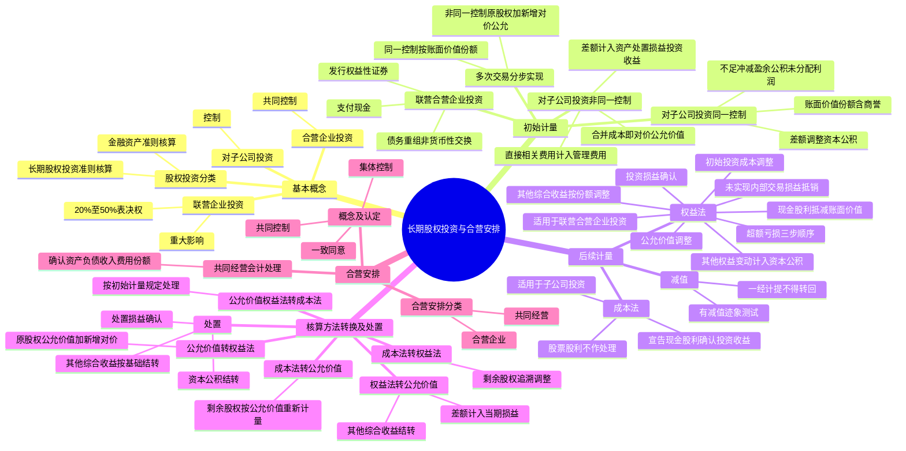

## 1. 章节定位

| 项目 | 信息 |
|------|------|
| 所属科目 | 会计 |
| 难度等级 | 5 |
| 历年分值 | 6-10 分 |
| 建议学时 | 10-12 小时 |
| 知识关联章节 | 第4章 无形资产（土地使用权投资）、第7章 资产减值（长期股权投资减值）、第13章 金融工具（公允价值计量股权投资）、第15章 持有待售（划分为持有待售的长期股权投资）、第24章 企业合并、第27章 合并财务报表（控制判断、内部交易抵销） |

## 2. 考情分析

本章是会计科目的核心重难点章节，历年分值约 6-10 分，几乎每年必考主观题，常以综合题或计算分析题形式出现，并广泛与企业合并、合并财务报表、差错更正等章节联动考查。

**命题规律**：本章内容覆盖面广、综合性强，主观题常以多次股权交易的业务情境为载体，要求考生完成长期股权投资的初始计量、后续计量、核算方法转换及处置的全流程处理。客观题集中在重大影响的判断、同一控制与非同一控制的区分、权益法下投资损益的调整、未实现内部交易损益的抵销。

**高频考点分布**：

1. **基本概念**：股权投资的分类（金融资产 vs 长期股权投资）；联营企业投资（重大影响，20%-50%）；合营企业投资（共同控制）；对子公司投资（控制）。
2. **初始计量——对联营/合营企业投资**：支付现金（购买价款+直接相关费用税金）；发行权益性证券（公允价值，佣金手续费冲减溢价收入）；债务重组、非货币性资产交换。
3. **初始计量——对子公司投资**：同一控制下控股合并（按被合并方在最终控制方合并财务报表中的账面价值份额，含商誉；差额调整资本公积，不足冲减盈余公积和未分配利润）；非同一控制下控股合并（按企业合并成本即付出对价公允价值，差额计入资产处置损益或投资收益）。
4. **后续计量——成本法**：适用于子公司投资；初始投资或追加投资按成本增加账面价值；宣告分派现金股利确认投资收益；股票股利不作账务处理。
5. **后续计量——权益法**：适用于联营、合营企业投资；初始投资成本调整（大于不调整，小于计入营业外收入）；投资损益确认（公允价值调整、未实现内部交易损益抵销）；现金股利抵减账面价值；其他综合收益按份额调整；其他权益变动计入资本公积；超额亏损确认顺序（长期股权投资→长期应收款→预计负债）。
6. **核算方法转换**：成本法转权益法（剩余股权追溯调整）；公允价值/权益法转成本法；公允价值转权益法；权益法转公允价值；成本法转公允价值。
7. **处置**：处置损益确认；其他综合收益结转（与被投资单位直接处置相关资产相同基础）；资本公积结转。
8. **合营安排**：合营安排的认定（共同控制、一致同意）；合营安排的分类（共同经营 vs 合营企业）；共同经营中合营方的会计处理。

**联动考查方式**：
- 与企业合并、合并财务报表结合：多次交易分步实现企业合并、丧失控制权的处理；
- 与差错更正结合：错用成本法/权益法、未抵销未实现内部交易损益；
- 与所得税结合：长期股权投资减值的暂时性差异；
- 与金融工具结合：长期股权投资与金融资产的相互转换。

**备考建议**：
- 牢记"控制用成本法，重大影响/共同控制用权益法"；
- 区分同一控制下（账面价值份额，差额调整资本公积）与非同一控制下（合并成本即公允价值，差额计入损益）；
- 权益法下投资损益确认的两项核心调整：投资时资产公允价值与账面价值差额的摊销调整、未实现内部交易损益的抵销；
- 牢记超额亏损确认的三步顺序；
- 牢记合营安排分类的关键：合营方享有的是净资产权利（合营企业）还是资产权利并承担负债义务（共同经营）。

## 3. 知识框架



## 4. 核心精讲

### 4.1 基本概念

#### 4.1.1 股权投资的分类

股权投资根据投资方在投资后对被投资单位能够施加影响的程度，区分为两类：

| 分类 | 适用准则 | 核算方法 |
|------|---------|---------|
| 对子公司、联营企业、合营企业的投资 | 长期股权投资准则 | 成本法/权益法 |
| 不具有控制、共同控制或重大影响的投资 | 金融工具确认和计量准则 | 公允价值计量 |

#### 4.1.2 联营企业投资（重大影响）

**联营企业投资**是指投资方能够对被投资单位施加**重大影响**的股权投资。重大影响是指投资方对被投资单位的财务和生产经营决策有参与决策的权力，但并不能控制或与其他方一起共同控制这些政策的制定。

从股权比例来看，投资方直接或通过子公司间接持有被投资单位**20% 以上但低于 50%** 的表决权股份时，一般认为对被投资单位具有重大影响，除非有明确的证据表明该种情况下不能参与被投资单位的生产经营决策。

判断重大影响的五种情形：
1. 在被投资单位的董事会或类似权力机构中派有代表；
2. 参与被投资单位财务和经营政策制定过程；
3. 与被投资单位之间发生重要交易；
4. 向被投资单位派出管理人员；
5. 向被投资单位提供关键技术资料。

> 关键原则：重大影响的判断关键是分析投资方是否有**实质性的参与权**而不是决定权。重大影响为"参与决策的权力"而非"正在行使的权力"。

#### 4.1.3 合营企业投资（共同控制）

**合营企业投资**是指投资方与其他合营方一同对被投资单位实施**共同控制**，且对被投资单位净资产享有权利的权益性投资。合营企业是共同控制一项安排的参与方仅对该安排的净资产享有权利的合营安排。

#### 4.1.4 对子公司投资（控制）

**对子公司投资**是指投资方持有的能够对被投资单位施加**控制**的股权投资。对子公司投资的取得，通常是通过企业合并方式。

### 4.2 长期股权投资的初始计量

#### 4.2.1 长期股权投资的确认

对子公司投资的确认时点为**购买日（或合并日）**。合并日（或购买日）是指合并方（或购买方）实际取得对被合并方（或被购买方）控制权的日期。同时满足以下条件的，通常可认为实现了控制权的转移：

1. 企业合并合同或协议已获股东会等内部权力机构通过；
2. 需要经过国家有关主管部门审批的，已获得批准；
3. 参与合并各方已办理了必要的财产权转移手续；
4. 合并方或购买方已支付了合并价款的大部分（一般应超过 50%），并且有能力、有计划支付剩余款项；
5. 合并方或购买方实际上已经控制了被合并方或被购买方的财务和经营政策。

#### 4.2.2 对联营企业、合营企业投资的初始计量

| 取得方式 | 初始投资成本 | 特别说明 |
|---------|------------|---------|
| 支付现金 | 实际支付的购买价款+直接相关费用、税金及其他必要支出 | 价款中包含的已宣告但尚未发放的现金股利或利润作为应收项目 |
| 发行权益性证券 | 所发行权益性证券的公允价值 | 不包括已宣告但尚未发放的现金股利；佣金手续费冲减溢价收入 |
| 债务重组、非货币性资产交换 | 按相关准则规定确定 | 按债务重组、非货币性资产交换准则 |

**【例 6-1】** 2×24 年 3 月 5 日，A 公司通过增发 9 000 万股本公司普通股（每股面值 1 元）取得 B 公司 20% 的股权，该 9 000 万股股份的公允价值为 15 600 万元。为增发该部分股份，A 公司向证券承销机构等支付了 600 万元的佣金和手续费。假定 A 公司取得该部分股权后，能够对 B 公司的财务和生产经营决策施加重大影响。

A 公司的账务处理：

```
借：长期股权投资——投资成本    156 000 000
    贷：股本                        90 000 000
        资本公积——股本溢价           66 000 000

借：资本公积——股本溢价          6 000 000
    贷：银行存款                    6 000 000
```

#### 4.2.3 对子公司投资的初始计量

**（1）同一控制下控股合并**

同一控制下企业合并形成的合并方对被合并方的长期股权投资，应当按照**合并日取得被合并方所有者权益在最终控制方合并财务报表中的账面价值的份额**作为初始投资成本（含最终控制方收购被合并方所形成的商誉）。

初始投资成本与支付的现金、转让的非现金资产及所承担债务账面价值之间的差额，应当调整**资本公积（资本溢价或股本溢价）**；资本公积不足冲减的，依次冲减**盈余公积**和**未分配利润**。

> 重要原则：同一控制下企业合并作为企业集团内资产和权益的整合，合并方支付对价以账面价值结转，**不确认损益**。

**【例 6-2】** 甲公司于 2×25 年 4 月 1 日自其母公司（P 公司）取得 B 公司 100% 股权。B 公司净资产在最终控制方 P 公司的账面价值为 9.2 亿元。甲公司用以支付的对价为一项土地使用权（成本 7 亿元，已摊销 1.5 亿元），同时支付现金 5 亿元。甲公司资本公积（资本溢价）余额为 3.6 亿元。

甲公司的账务处理：

```
借：长期股权投资              920 000 000
    累计摊销                  150 000 000
    资本公积                  130 000 000
    贷：无形资产                   700 000 000
        银行存款                   500 000 000
```

**（2）非同一控制下控股合并**

非同一控制下企业合并中，购买方应当按照确定的**企业合并成本**作为长期股权投资的初始投资成本。企业合并成本包括购买方付出的资产、发生或承担的负债、发行的权益性证券的**公允价值**之和。

付出对价的公允价值与账面价值的差额，计入**资产处置损益**或**投资收益**等科目。企业发生的审计、法律服务、评估咨询等中介费用，于发生时计入**管理费用**。

> 重要区分：非同一控制下企业合并，合并成本为付出对价的**公允价值**，差额计入损益；同一控制下企业合并，初始投资成本为账面价值份额，差额调整资本公积。

**【例 6-3】** A 公司于 2×25 年 3 月 31 日取得 B 公司 70% 的股权。A 公司支付的有关资产在购买日的账面价值与公允价值：土地使用权账面价值 6 000 万元、公允价值 9 600 万元；专利技术账面价值 2 400 万元、公允价值 3 000 万元；银行存款 2 400 万元。合并前 A 公司与 B 公司不存在任何关联方关系。

A 公司的账务处理：

```
借：长期股权投资              150 000 000
    累计摊销                   12 000 000
    贷：无形资产                    96 000 000
        银行存款                    24 000 000
        资产处置损益                 42 000 000

借：管理费用                   3 000 000
    贷：银行存款                    3 000 000
```

**（3）多次交易分步实现企业合并**

通过多次交换交易分步取得股权最终形成控股合并的：

| 类型 | 个别财务报表处理 |
|------|----------------|
| 同一控制下 | 以持股比例计算的合并日应享有被合并方所有者权益在最终控制方合并财务报表中的账面价值份额作为初始投资成本，差额调整资本公积 |
| 非同一控制下（原权益法） | 购买日长期股权投资的初始投资成本 = 原权益法下的账面价值 + 购买日新增投资成本（公允价值），原其他综合收益/资本公积暂不处理 |
| 非同一控制下（原公允价值计量） | 原股权公允价值与账面价值的差额及原计入其他综合收益的累计公允价值变动按处置原股权相同基础处理 |

**（4）投资成本中包含的已宣告但尚未发放的现金股利或利润**

企业无论以何种方式取得长期股权投资，投资成本中包含的被投资单位已经宣告但尚未发放的现金股利或利润，应作为**应收项目**单独核算，不构成初始投资成本。

### 4.3 长期股权投资的后续计量

#### 4.3.1 成本法

成本法适用于企业持有的能够对被投资单位实施**控制**的长期股权投资（子公司投资）。

| 业务 | 会计处理 |
|------|---------|
| 初始投资或追加投资 | 按成本增加长期股权投资账面价值 |
| 被投资单位宣告分派现金股利或利润 | 按享有份额确认投资收益（不管分配的是取得投资前还是后的利润） |
| 股票股利 | 不作账务处理，除权日注明增加的股数 |

> 注意：确认现金股利后，应当考虑长期股权投资是否发生减值。如果分得的现金股利大于取得投资后被投资单位实现的净利润，超过部分可能涉及减值。

#### 4.3.2 权益法

权益法适用于投资企业持有的对**合营企业投资**及**联营企业投资**（划分为持有待售的部分除外）。

**（1）初始投资成本的调整**

| 情形 | 会计处理 |
|------|---------|
| 初始投资成本 > 应享有被投资单位可辨认净资产公允价值份额 | 不调整长期股权投资成本（差额为商誉） |
| 初始投资成本 < 应享有被投资单位可辨认净资产公允价值份额 | 调增长期股权投资成本，差额计入**营业外收入** |

**（2）投资损益的确认**

投资企业应当按照应享有或应分担被投资单位实现净利润或发生净亏损的份额，调整长期股权投资的账面价值，并确认为当期投资损益。在被投资单位账面净利润的基础上，应考虑以下因素进行调整：

**第一项调整：会计政策及会计期间不一致的调整**。被投资单位采用的会计政策或会计期间与投资企业不一致的，应按投资企业的会计政策及会计期间对被投资单位的财务报表进行调整。

**第二项调整：投资时资产公允价值与账面价值差额的摊销调整**。以取得投资时被投资单位固定资产、无形资产的公允价值为基础计提的折旧额或摊销额，以及以投资企业取得投资时的公允价值为基础计算确定的资产减值准备金额等对被投资单位净利润的影响。

> 实务简化：符合下列条件之一的，可以以被投资单位的账面净利润为基础计算确认投资损益：①无法合理确定取得投资时各项可辨认资产的公允价值；②投资时可辨认净资产公允价值与其账面价值的差额不具重要性；③其他原因导致无法对净损益进行调整。

**第三项调整：潜在表决权**。在评估投资方对被投资单位是否具有重大影响时，应当考虑潜在表决权的影响，但在确定应享有的净损益份额时，潜在表决权所对应的权益份额不应予以考虑。

**第四项调整：不属于投资企业的净损益应当剔除**。例如被投资单位发行了分类为权益的可累积优先股，投资方计算应享有的净利润时，应将归属于其他投资方的累积优先股股利予以扣除。

**第五项调整：未实现内部交易损益的抵销**。投资企业与联营企业及合营企业之间发生的未实现内部交易损益，按照持股比例计算归属于投资企业的部分应当予以抵销。

| 交易类型 | 定义 | 抵销处理 |
|---------|------|---------|
| 顺流交易 | 投资方向联营/合营企业投出或出售资产 | 投资方损益中按持股比例归属于本企业的部分不予确认 |
| 逆流交易 | 联营/合营企业向投资方出售资产 | 联营/合营企业损益中投资方应享有的部分不予确认 |

> 重要例外：投资方与联营、合营企业之间发生投出或出售资产的交易，该资产**构成业务**的，应当按企业合并准则处理，相关损益不予抵销。未实现内部交易损失属于资产减值损失的，应当**全额确认**，不予抵销。

**【例 6-4】** 甲公司持有乙公司 20% 有表决权股份。2×24 年，甲企业将其账面价值为 600 万元的商品以 1 000 万元的价格出售给乙公司（顺流交易）。至 2×24 年资产负债表日，该批商品尚未对外部第三方出售。乙公司 2×24 年净利润为 2 000 万元。

甲企业账务处理：

```
借：长期股权投资——损益调整    3 200 000
    贷：投资收益    [(20 000 000 - 4 000 000) × 20%]    3 200 000
```

> 合并财务报表中的调整（如有子公司需编制合并报表）：

```
借：营业收入    (10 000 000 × 20%)    2 000 000
    贷：营业成本    (6 000 000 × 20%)    1 200 000
        投资收益                          800 000
```

**（3）取得现金股利或利润的处理**

投资企业自被投资单位取得的现金股利或利润，应**抵减**长期股权投资的账面价值。被投资单位宣告分派时，借记"应收股利"，贷记"长期股权投资——损益调整"。

**（4）其他综合收益的处理**

被投资单位其他综合收益发生变动时，投资企业应当按照归属于本企业的部分，调整长期股权投资的账面价值，借记"长期股权投资——其他综合收益"，贷记"其他综合收益"（或相反）。

**（5）被投资单位所有者权益其他变动的处理**

投资企业对于被投资单位除净损益、其他综合收益以及利润分配以外所有者权益的其他变动，应按照持股比例计算的归属于本企业的部分，调整长期股权投资账面价值，同时增加或减少**资本公积（其他资本公积）**。主要包括：被投资单位接受其他股东的资本性投入、发行可分离交易可转换公司债券的权益成分、以权益结算的股份支付、其他股东增资导致投资方持股比例变动等。

**（6）超额亏损的确认**

投资企业确认应分担被投资单位的净损失，原则上应以长期股权投资及其他实质上构成对被投资单位净投资的长期权益减记至零为限。确认顺序如下：

| 步骤 | 处理 |
|------|------|
| 第一步 | 减记长期股权投资的账面价值（至零为限） |
| 第二步 | 减记其他实质上构成对被投资单位净投资的长期权益（如长期应收款） |
| 第三步 | 按合同或协议约定承担额外损失义务的，确认预计负债 |
| 未确认部分 | 账外备查登记 |

被投资单位以后期间实现净利润或其他综合收益增加时，投资方应按相反顺序恢复。

**（7）股票股利的处理**

被投资单位分派的股票股利，投资企业不作账务处理，但应于除权日注明所增加的股数。

**（8）因被动稀释导致持股比例下降时"内含商誉"的结转**

因其他投资方增资导致投资方持股比例被稀释，且稀释后仍采用权益法核算的，投资方应当**按比例结转**初始投资时形成的"内含商誉"，并将相关股权稀释影响计入**资本公积（其他资本公积）**。

**（9）长期股权投资的减值**

长期股权投资存在减值迹象的，应当按照资产减值准则计提减值准备。长期股权投资的减值准备一经计提，**不允许转回**。

### 4.4 长期股权投资核算方法的转换及处置

#### 4.4.1 成本法转换为权益法

因处置投资导致对被投资单位由控制转为重大影响或共同控制：

**个别财务报表**：
1. 按处置投资的比例结转应终止确认的长期股权投资成本，与处置对价的差额计入当期损益；
2. 将剩余股权转为权益法核算，进行**追溯调整**：
   - 比较剩余长期股权投资成本与按照剩余持股比例计算原投资时应享有被投资单位可辨认净资产公允价值份额，前者大于后者（商誉）不调整，前者小于后者调整期初留存收益；
   - 原取得投资后至处置当期期初被投资单位实现的净损益中应享有的份额，调整期初留存收益；
   - 处置投资当期期初至处置之日被投资单位实现的净损益中应享有的份额，调整当期损益；
   - 其他原因导致所有者权益变动中应享有的份额，计入其他综合收益或资本公积。

**合并财务报表**：剩余股权按照其在丧失控制权日的**公允价值**进行重新计量，处置股权取得的对价与剩余股权公允价值之和，减去按原持股比例计算应享有原有子公司自购买日开始持续计算的净资产的份额之间的差额，计入丧失控制权当期的投资收益。

#### 4.4.2 公允价值计量或权益法转换为成本法

因追加投资导致原持有的分类为以公允价值计量的金融资产或对联营/合营企业的投资转变为对子公司投资的，按照对子公司投资初始计量的相关规定处理。

#### 4.4.3 公允价值计量转为权益法

因追加投资能够实施共同控制或重大影响的，在转换日按照原股权的**公允价值**加上为取得新增投资而应支付对价的公允价值，作为改按权益法核算的初始投资成本。如原投资属于指定为以公允价值计量且其变动计入其他综合收益的非交易性权益工具投资，原计入其他综合收益的累计公允价值变动转入**留存收益**，不得计入当期损益。

#### 4.4.4 权益法转为公允价值计量

因部分处置导致持股比例下降，不能再实施共同控制或重大影响的，剩余股权改按公允价值计量，公允价值与原账面价值之间的差额计入**当期损益**。原采用权益法核算的相关其他综合收益应当采用与被投资单位直接处置相关资产或负债相同的基础进行会计处理；原计入资本公积的金额全部转入当期损益。

**【例 6-5】** 甲公司持有乙公司 30% 的有表决权股份，采用权益法核算。2×24 年 10 月，甲公司将该项投资中的 50% 对外出售，取得价款 1 800 万元。剩余 15% 股权转为以公允价值计量且其变动计入其他综合收益。出售时长期股权投资的账面价值为 3 200 万元，其中投资成本 2 600 万元，损益调整 300 万元，其他综合收益 200 万元（被投资方非交易性权益工具投资公允价值变动），其他权益变动 100 万元。剩余股权公允价值为 1 800 万元。

甲公司的账务处理：

（1）确认处置损益：

```
借：银行存款                   18 000 000
    贷：长期股权投资——投资成本    13 000 000
        长期股权投资——损益调整     1 500 000
        长期股权投资——其他综合收益   1 000 000
        长期股权投资——其他权益变动   500 000
        投资收益                     2 000 000
```

（2）原其他综合收益为非交易性权益工具投资公允价值变动，转入留存收益：

```
借：其他综合收益               2 000 000
    贷：利润分配——未分配利润        2 000 000
```

（3）原资本公积全部转入当期损益：

```
借：资本公积——其他资本公积     1 000 000
    贷：投资收益                    1 000 000
```

（4）剩余股权转为公允价值计量，公允价值 1 800 万元与账面价值 1 600 万元的差额 200 万元计入投资收益：

```
借：其他权益工具投资——成本     18 000 000
    贷：长期股权投资——投资成本    13 000 000
        长期股权投资——损益调整     1 500 000
        长期股权投资——其他综合收益   1 000 000
        长期股权投资——其他权益变动   500 000
        投资收益                     2 000 000
```

#### 4.4.5 成本法转为公允价值计量

因部分处置导致丧失控制权且不再具有共同控制或重大影响的，剩余股权于丧失控制权日按**公允价值**重新计量，公允价值与账面价值的差额计入当期损益。

#### 4.4.6 长期股权投资的处置

企业处置长期股权投资时，应结转与所售股权相对应的长期股权投资的账面价值，出售所得价款与处置长期股权投资账面价值之间的差额，确认为处置损益。

采用权益法核算的长期股权投资，在处置时，原计入其他综合收益（不能结转损益的除外）或资本公积（其他资本公积）的金额，应按比例结转至当期损益。

> 不能结转损益的其他综合收益主要包括：①被投资方重新计量设定受益计划净负债或净资产变动导致的权益变动份额；②被投资方其他权益工具投资公允价值变动计入其他综合收益的部分（转入留存收益）。

### 4.5 合营安排

#### 4.5.1 合营安排的认定

**合营安排**是指一项由两个或两个以上的参与方共同控制的安排。合营安排的主要特征：

1. **各参与方均受到该安排的约束**。相关约定是据以判断是否存在共同控制的一系列具有执行力的合约。
2. **两个或两个以上的参与方对该安排实施共同控制**。任何一个参与方都不能够单独控制该安排。

**共同控制**是指按照相关约定对某项安排所共有的控制，并且该安排的相关活动必须经过分享控制权的参与方**一致同意**后才能决策。

判断共同控制的步骤：
1. 判断是否所有参与方或参与方组合**集体控制**该安排（不存在任何一方单独控制）；
2. 判断该安排相关活动的决策是否必须经过这些参与方**一致同意**。

> 关键判断：如果存在两个或两个以上的参与方组合能够集体控制某项安排的，**不构成共同控制**（因为不满足"唯一组合"要求）。

**【例 6-6】** A 公司、B 公司、C 公司分别拥有 D 公司 50%、30% 和 20% 的表决权股份。相关约定规定，75% 以上的表决权即可对 D 公司的相关活动作出决策。

分析：A 公司和 B 公司是能够集体控制 D 公司的**唯一组合**（50%+30%=80%≥75%），当且仅当 A 公司、B 公司一致同意时，D 公司的相关活动决策方能表决通过。因此，A 公司、B 公司对 D 公司具有共同控制权。

如果约定 60% 以上即可决策且未指明特定组合，则 A+B（80%）和 A+C（70%）均满足，存在多个集体控制组合，不构成共同控制，三家公司均视为具有重大影响。

**保护性权利**：仅享有保护性权利的参与方不享有共同控制。保护性权利是指仅为了保护权利持有人利益却没有赋予持有人对相关活动进行决策的一项权利。

#### 4.5.2 合营安排的分类

合营安排分为**共同经营**和**合营企业**：

| 类型 | 定义 | 合营方的权利义务 |
|------|------|----------------|
| 共同经营 | 合营方享有该安排相关资产且承担该安排相关负债的合营安排 | 对相关资产享有权利，对相关负债承担义务 |
| 合营企业 | 合营方仅对该安排的净资产享有权利的合营安排 | 仅对净资产享有权利 |

**分类判断步骤**（从是否通过单独主体达成为起点）：

1. **未通过单独主体达成**：通常划分为**共同经营**。
2. **通过单独主体达成**：
   - 第一步：分析单独主体的**法律形式**（如有限责任公司将资产负债与参与方分离，初步判定为合营企业）；
   - 第二步：若法律形式不足，分析**合同安排**的条款；
   - 第三步：若仍不足，考虑**其他事实和情况**（如合营安排的目的和设计、参与方是否实质上享有资产全部经济利益并承担负债清偿义务）。

#### 4.5.3 共同经营中合营方的会计处理

合营方应当确认自身所承担的以及按比例享有或承担的合营安排中按照合同、协议等的规定归属于本企业的资产、负债、收入及费用：

1. 确认单独所持有的资产，以及按其份额确认共同持有的资产；
2. 确认单独所承担的负债，以及按其份额确认共同承担的负债；
3. 确认出售其享有的共同经营产出份额所产生的收入；
4. 按其份额确认共同经营因出售产出所产生的收入；
5. 确认单独所发生的费用，以及按其份额确认共同经营发生的费用。

> 对共同经营不享有共同控制的参与方（非合营方），如果享有该共同经营相关资产且承担相关负债的，比照合营方进行会计处理。

**合营方与共同经营之间的资产交易**（不构成业务）：
- 合营方向共同经营投出或出售资产，在共同经营将相关资产出售给第三方或消耗之前，应当仅确认归属于共同经营其他参与方的利得或损失；
- 合营方自共同经营购买资产，在将该资产出售给第三方之前，不应当确认因该交易产生的损益中该合营方应享有的部分。

## 5. 典型例题

**【例题 1】（权益法下投资损益的确认——公允价值调整与未实现内部交易抵销）**

甲公司于 2×24 年 1 月 10 日购入乙公司 30% 的股份，购买价款为 3 300 万元。取得投资当日，乙公司可辨认净资产公允价值为 9 000 万元，除存货、固定资产、无形资产外，其他资产负债公允价值与账面价值相同。存货账面价值 750 万元、公允价值 1 050 万元；固定资产账面价值 1 800 万元、公允价值 2 400 万元（尚可使用 16 年，直线法）；无形资产账面价值 1 050 万元、公允价值 1 200 万元（尚可使用 8 年，直线法）。

2×24 年乙公司实现净利润 900 万元，其中取得投资时的账面存货有 80% 对外出售。甲公司与乙公司间未发生任何内部交易。不考虑所得税影响。

要求：计算甲公司 2×24 年应确认的投资收益并编制会计分录。

**答案**：

调整后的净利润计算：
- 存货调整：调减利润 = (1 050 − 750) × 80% = 240（万元）
- 固定资产折旧调整：调增折旧 = 2 400 ÷ 16 − 1 800 ÷ 20 = 150 − 90 = 60（万元）
- 无形资产摊销调整：调增摊销 = 1 200 ÷ 8 − 1 050 ÷ 10 = 150 − 105 = 45（万元）

调整后的净利润 = 900 − 240 − 60 − 45 = 555（万元）

甲公司应享有份额 = 555 × 30% = 166.50（万元）

```
借：长期股权投资——损益调整    1 665 000
    贷：投资收益                    1 665 000
```

**解析**：权益法下确认投资损益时，应当以投资时被投资单位各项可辨认资产公允价值为基础对被投资单位账面净利润进行调整。存货按已对外出售比例调整，固定资产和无形资产按公允价值重新计算折旧摊销额调整。

**【例题 2】（同一控制下企业合并的初始计量）**

甲公司为某一集团母公司，分别控制乙公司和丙公司。2×23 年 1 月 1 日，甲公司从本集团外部以现金对价 4 000 万元购入丁公司 80% 股权并能够控制丁公司（属于非同一控制下企业合并）。购买日，丁公司可辨认净资产的公允价值为 5 000 万元，账面价值为 3 500 万元。2×23 年 1 月至 2×24 年 12 月 31 日，丁公司按照购买日净资产的公允价值计算实现的净利润为 1 200 万元，无其他所有者权益变动。2×25 年 1 月 1 日，乙公司购入甲公司所持丁公司的 80% 股权，形成同一控制下的企业合并。

要求：计算乙公司购入丁公司的初始投资成本。

**答案**：

2×25 年 1 月 1 日，丁公司相对于最终控制方甲公司的账面价值 = 自 2×23 年 1 月 1 日丁公司净资产公允价值 5 000 万元持续计算至 2×24 年 12 月 31 日的账面价值 = 5 000 + 1 200 = 6 200（万元）。

乙公司购入丁公司的初始投资成本 = (5 000 + 1 200) × 80% = **4 960（万元）**。

**解析**：同一控制下企业合并，合并方应以合并日取得被合并方所有者权益在最终控制方合并财务报表中的账面价值的份额作为初始投资成本，该账面价值是自最终控制方取得控制时开始持续计算的账面价值（含商誉），不是被合并方个别财务报表中的账面价值。

**【例题 3】（成本法转权益法的追溯调整）**

2×23 年 1 月 1 日，甲公司支付 600 万元取得乙公司 100% 的股权，当日乙公司可辨认净资产的公允价值为 500 万元，商誉 100 万元。2×23 年 1 月 1 日至 2×24 年 12 月 31 日，乙公司的净资产增加了 75 万元，其中按购买日公允价值计算实现的净利润为 50 万元，持有的以公允价值计量且其变动计入其他综合收益的非交易性权益工具投资的公允价值升值 25 万元。2×25 年 1 月 8 日，甲公司转让乙公司 60% 的股权，收取现金 480 万元，转让后甲公司对乙公司的持股比例为 40%，能对其施加重大影响。2×25 年 1 月 8 日，乙公司剩余 40% 股权的公允价值为 320 万元。假定乙公司未分配现金股利，不考虑其他因素。

要求：编制甲公司个别财务报表中的会计分录（金额单位：万元）。

**答案**：

（1）确认部分股权处置收益：

```
借：银行存款                   480
    贷：长期股权投资    (600 × 60%)    360
        投资收益                      120
```

（2）对剩余股权改按权益法核算：

```
借：长期股权投资——损益调整       20
    长期股权投资——其他综合收益   10
    贷：利润分配——未分配利润    (50 × 40%)    20
        其他综合收益            (25 × 40%)    10
```

经上述调整后，剩余股权的账面价值 = 600 × 40% + 30 = 270（万元）。

**解析**：成本法转权益法时，剩余股权应当追溯调整。原取得投资时至处置投资当期期初被投资单位实现的净损益中应享有的份额调整期初留存收益；其他综合收益变动按份额调整。商誉部分（初始投资成本 600 万元 > 应享可辨认净资产公允价值份额 500 万元，差额 100 万元）不调整长期股权投资账面价值。

## 6. 记忆口诀

**股权投资分类**："控制子公司用成本法，重大影响联营、共同控制合营用权益法，其余金融资产公允价值计量"——根据影响程度选择核算方法。

**重大影响比例**："20% 以上 50% 以下"——通常认为具有重大影响。

**初始计量两类**："同一控制账面份额，非同一控制公允价值"——同一控制按被合并方在最终控制方合并报表中的账面价值份额，非同一控制按付出对价公允价值。

**同一控制差额处理**："差额调资本公积，不足冲减盈余公积和未分配利润，不确认损益"——作为集团内权益整合。

**非同一控制差额处理**："差额计入资产处置损益或投资收益，中介费用计入管理费用"——市场化购买。

**权益法初始投资成本调整**："大于不调是商誉，小于调增进营业外收入"——初始投资成本小于应享可辨认净资产公允价值份额的差额计入营业外收入。

**权益法投资损益两项调整**："公允价值差额摊销调，未实现内部交易损益抵销"——投资时资产公允价值与账面价值差额的摊销调整，顺流逆流交易的未实现内部交易损益抵销。

**未实现内部交易抵销**："顺流逆流都抵销，构成业务不抵销，减值损失全额确认"——构成业务的不抵销，资产减值损失全额确认。

**超额亏损三步顺序**："先减长期股权投资至零，再减长期应收款，最后确认预计负债"——超额亏损确认顺序。

**其他综合收益结转**："处置时按与被投资单位直接处置相关资产相同基础结转"——不能结转损益的除外（设定受益计划、其他权益工具投资转留存收益）。

**成本法转权益法**："剩余股权追溯调整，前期净损益调期初留存收益，当期净损益调当期损益"——个别报表追溯调整。

**丧失控制权合并报表**："剩余股权按丧失控制权日公允价值重新计量"——合并报表中剩余股权重新计量。

**合营安排分类关键**："享有净资产权利是合营企业，享有资产权利承担负债义务是共同经营"——根据合营方权利义务判断。

**共同控制判断**："唯一组合加一致同意"——集体控制该安排的参与方组合唯一，且需一致同意。

**共同控制不成立**："多个组合能控制不构成共同控制"——存在两个及以上集体控制组合时不构成共同控制。

## 7. 同步练习

**91.（单选题）** 甲公司2×19年1月1日向丙公司定向增发1000万股普通股（占甲公司总股份的1%），从丙公司手中换取乙公司80%股权，并于当日办理完毕相关的股权转让手续。取得股权后，甲公司能够对乙公司的生产经营决策实施控制。甲公司发行的股票面值为1元/股，发行价格为3元/股，当日乙公司可辨认净资产公允价值为5000万元，账面价值为4000万元，甲公司为发行股票支付给券商的佣金及手续费30万元，另付审计评估费10万元，甲公司、乙公司以及丙公司交易之前不存在关联方关系。不考虑其他因素，甲公司取得该项长期股权投资应确认的资本公积的金额为（　）。

A. 1970万元
B. 1960万元
C. 2970万元
D. 2170万元

---

**92.（单选题）** 甲公司2×22年12月20日以一项无形资产作为对价自丙公司处取得乙公司30%有表决权股份，能够对乙公司施加重大影响。甲公司付出无形资产的账面价值为1500万元（原价为1800万元，累计摊销300万元），公允价值为2500万元。当日，乙公司可辨认净资产公允价值为10000万元，双方办理完成相关的股权转移手续。不考虑其他因素，有关甲公司取得股权投资的会计处理表述不正确的是（　）。

A. 甲公司确认的长期股权投资的入账价值为3000万元
B. 上述业务对甲公司2×22年度损益的影响金额为1500万元
C. 甲公司应确认营业外收入1500万元
D. 甲公司应采用权益法核算该项长期股权投资

---

**93.（单选题）** 关于长期股权投资的会计核算，下列表述中不正确的是（　）。

A. 如果投资方属于投资性主体，那么对于为投资性主体的投资活动提供相关服务的子公司投资，个别报表中应作为长期股权投资并按权益法核算
B. 权益法下，如果投资方持有被投资方股权的市价明显下跌，远低于被投资方净资产账面价值，则投资方应考虑该资产出现了减值迹象
C. 权益法下，其他股东对被投资单位增资导致投资方持股比例变动但仍采用权益法核算的，投资方应当相应调整长期股权投资账面价值以及资本公积
D. 成本法下，对于被投资方发生的亏损，投资方不需要做账务处理

---

**94.（单选题）** 2×23年1月1日，甲公司以支付银行存款的方式取得其母公司持有的乙公司25%股权，支付银行存款110万元，对乙公司具有重大影响。当日乙公司可辨认净资产的公允价值为400万元。假定乙公司2×23年未发生净损益等所有者权益的变动。2×24年甲公司从集团母公司手中进一步取得乙公司30%股权，付出对价为一项固定资产，该固定资产的账面价值为100万元，公允价值为120万元。至此甲公司取得乙公司的控制权。合并日乙公司相对于最终控制方的所有者权益账面价值为800万元。已知该交易不属于一揽子交易。假定不考虑其他因素，甲公司合并日应确认乙公司股权的初始投资成本为（　）。

A. 230万元
B. 210万元
C. 350万元
D. 440万元

---

**95.（单选题）** 2×24年12月15日，甲公司与乙公司分别出资10 000万元，共同购买一栋厂房，各自拥有50%产权，委托第三方对厂房进行出租运营管理，按租金收入的20%支付管理费。合同约定，与该厂房运营活动相关的决策需要甲公司和乙公司达成一致方可做出；甲公司和乙公司各自分享或承担租金收入、运营成本的50%。2×25年该厂房取得租金收入1600万元，由甲公司先行收取；第三方的运营管理费由甲公司先行支付，发生的水电费、维修费40万元由乙公司先行垫付。甲公司、乙公司均对投资性房地产采用成本模式进行后续计量，上述厂房的预计使用寿命为20年，采用年限平均法计提折旧，预计净残值率为10%。不考虑其他因素，下列各项关于甲公司2×25年度会计处理的表述中，不正确的是（　）。

A. 确认折旧费用450万元
B. 确认租赁收入800万元
C. 确认水电维修费20万元
D. 确认投资收益170万元

---

**96.（单选题）** 下列各项交易费用中，不应在发生时直接计入当期损益的是（　）。

A. 与取得交易性金融资产相关的交易费用
B. 同一控制下企业合并中发生的审计费用
C. 非企业合并方式下取得长期股权投资发生的交易费用
D. 非同一控制下企业合并中发生的资产评估费用

---

**97.（单选题）** 20×8年1月1日，甲公司取得乙公司40%股权，入账价值为1200万元，采用权益法核算，当日，乙公司各项资产、负债的公允价值等于账面价值。20×8年，乙公司发生净亏损4000万元。甲公司账上有应收乙公司长期应收款300万元（实质上构成对乙公司的净投资），同时，根据投资合同的约定，甲公司需要承担乙公司额外损失的弥补义务50万元且符合预计负债的确认条件。20×9年，乙公司实现其他综合收益40万元，除此之外，无其他净资产变动。不考虑其他因素，下列表述中，不正确的是（　）。

A. 20×8年，甲公司应确认投资收益-1550万元
B. 20×8年末，甲公司长期股权投资的账面价值为0
C. 20×9年，甲公司应确认的投资收益为0
D. 20×9年，甲公司应确认的其他综合收益为16万元

---

**98.（单选题）** 2×15年1月1日，甲公司以银行存款2320万元取得乙公司20%股权，能够对乙公司施加重大影响。投资当日，乙公司可辨认净资产公允价值为12000万元（等于账面价值）。2×15年，乙公司实现净利润1000万元，实现其他综合收益50万元，未发生其他引起所有者权益变动的事项。2×16年1月1日，甲公司发行100万股普通股股票再次购入乙公司10%股权，股权增加后仍对乙公司具有重大影响，相关手续于当日完成。增资当日，甲公司股票的市场价格为每股16元，乙公司可辨认净资产公允价值为15000万元，甲公司为增发普通股股票支付券商手续费2万元。假设该交易不属于一揽子交易，不考虑其他因素。增资后甲公司对乙公司长期股权投资的账面价值为（　）。

A. 3900万元
B. 4030万元
C. 4090万元
D. 4210万元

---

**99.（单选题）** 甲公司于2×22年初购入A公司30%股权，能够对A公司的生产经营决策产生重大影响。投资时A公司有一项存货的公允价值大于账面价值，差额为200万元，至当年年末此存货已对外出售30%。当年A公司将一批成本为240万元的存货以360万元的价格出售给甲公司，至年末甲公司对外出售该批存货的40%。A公司2×22年实现净利润800万元，假定不考虑其他因素，2×22年甲公司因此长期股权投资应确认的投资收益为（　）。

A. 200.4万元
B. 183.6万元
C. 207.6万元
D. 200.9万元

---

**100.（单选题）** 2×22年1月1日，A公司以2800万元取得B公司70%股权，款项以银行存款支付，B公司2×22年1月1日可辨认净资产公允价值总额为4500万元（假定其公允价值等于账面价值），假设合并前A公司与B公司不存在任何关联方关系。A公司对该项投资采用成本法核算。2×22年B公司实现净利润800万元，以公允价值计量且其变动计入其他综合收益的金融资产由于公允价值变动计入其他综合收益的金额是200万元，B公司当年未分派现金股利。2×23年1月3日，A公司出售B公司40%股权，取得出售价款2000万元，当日B公司可辨认净资产公允价值总额为6000万元。该项交易不属于一揽子交易。不考虑其他因素，处置40%股权之后，A公司对剩余30%股权投资由成本法转为权益法。不考虑其他因素，A公司处置股权后，剩余股权调整之后的账面价值为（　）。

A. 1500万元
B. 1650万元
C. 1800万元
D. 2000万元

---

**101.（单选题）**（2022年）甲公司（非投资性主体）控制乙公司，乙公司是投资性主体。乙公司控制丙公司和丁公司。其中仅有丙公司为乙公司的投资活动提供相关服务。乙公司持有联营企业戊公司30%股权。不考虑其他因素，下列表述中正确的是（　）。

A. 乙公司个别财务报表中对持有的戊公司股权采用权益法核算
B. 甲公司个别财务报表中对持有的乙公司股权采用公允价值计量
C. 乙公司个别财务报表中对持有的丙公司股权采用公允价值计量
D. 乙公司个别财务报表中对持有的丁公司股权采用公允价值计量

---

**102.（单选题）**（2021年）甲公司2×20年发生的投资事项包括：①以银行存款300万元购买乙公司30%股权，发生相关交易费用5万元。投资日乙公司净资产公允价值为800万元。甲公司对乙公司能够施加重大影响。②通过发行甲公司股份的方式购买丙公司20%股权，发生与发行股份相关的交易费用8万元。投资日甲公司发行的股份的公允价值为450万元，丙公司净资产公允价值为1500万元，甲公司对丙公司能够施加重大影响。③通过同一控制下企业合并购买丁公司80%股权，支付购买价款800万元，发生交易费用10万元。合并日丁公司净资产账面价值为600万元（丁公司个别财务报表中的资产、负债数据与其在最终控制方合并财务报表中的数据相同），公允价值为800万元。④通过非同一控制下企业合并购买戊公司60%股权，支付购买价款1000万元，发生交易费用20万元。购买日戊公司可辨认净资产公允价值为1450万元。不考虑其他因素，下列各项关于甲公司上述长期股权投资相关会计处理的表述中，正确的是（　）。

A. 对乙公司长期股权投资的初始投资成本为300万元
B. 对丙公司长期股权投资的初始投资成本为458万元
C. 对丁公司长期股权投资的初始投资成本为800万元
D. 对戊公司长期股权投资的初始投资成本为1000万元

---

**103.（单选题）** 2×22年4月1日，甲公司以一项固定资产和银行存款104万元取得A公司10%股权，作为其他权益工具投资核算，投出固定资产的账面价值为500万元，公允价值为600万元，投资当日，A公司可辨认净资产公允价值为7000万元。2×22年12月31日，甲公司又以银行存款1000万元获得A公司另外10%股权，至此能够对A公司施加重大影响，增资日，原股权的公允价值为1000万元，A公司可辨认净资产的公允价值为8000万元。不考虑其他因素，增资后该项长期股权投资的初始投资成本为（　）。

A. 2000万元
B. 1800万元
C. 1700万元
D. 1600万元

---

**104.（单选题）** 甲公司于2×16年初购入乙公司40%股权，能够对乙公司的生产经营决策产生重大影响。投资时乙公司一批A库存商品的公允价值大于账面价值，差额为200万元，至当年年末，乙公司已将上述A库存商品全部对外售出。2×16年9月10日，甲公司向乙公司出售一批B库存商品，售价为500万元，成本为300万元。2×16年，乙公司实现净利润900万元，至2×16年年末，乙公司仍持有上述B库存商品，未对外出售。2×17年，乙公司实现净利润800万元，至2×17年年末，乙公司已将上述B库存商品全部对外售出。不考虑其他因素，下列表述中不正确的是（　）。

A. 2×16年，甲公司在个别报表中应确认的投资收益为200万元
B. 2×16年，针对甲公司与乙公司的顺流交易，甲公司在合并报表中应调增投资收益80万元
C. 2×17年，甲公司在个别报表中应确认的投资收益为400万元
D. 2×17年，针对甲公司与乙公司的顺流交易，甲公司在合并报表中不应调整有关收入

---

**105.（单选题）** 甲公司持有乙公司40%股权，对乙公司具有重大影响。截至2×22年12月31日，该项长期股权投资的账面价值为1240万元，其中投资成本为800万元，损益调整为240万元，其他权益变动为200万元。2×23年1月1日，甲公司处置了该项长期股权投资的四分之三，处置价款为1200万元，处置这部分股权投资后，甲公司仍持有乙公司10%股权，不再对乙公司具有重大影响，甲公司将剩余股权投资指定为以公允价值计量且其变动计入其他综合收益的金融资产。处置当日，剩余股权的公允价值为400万元。不考虑其他因素，甲公司在处置当日应确认的损益金额为（　）。

A. 62.5万元
B. 212.5万元
C. 560万元
D. 350万元

---

**106.（多选题）** 20×5年1月1日，甲公司以2400万元现金取得乙公司60%股权，能够对乙公司实施控制，交易前双方不存在关联方关系；当日乙公司可辨认净资产公允价值为3500万元（假定各项可辨认资产、负债的公允价值与账面价值相等）。20×7年1月1日，丙公司以一项固定资产为对价对乙公司进行增资，该项资产公允价值为1800万元。甲公司对乙公司的持股比例下降为40%，对乙公司丧失控制权，但仍具有重大影响。20×5年1月1日至20×6年12月31日期间，乙公司实现净利润1000万元。假定乙公司一直未进行利润分配，未发生其他影响所有者权益变动的交易或事项。甲公司按净利润的10%提取盈余公积。不考虑相关税费等其他因素的影响。下列有关甲公司20×7年1月1日会计处理的表述中，正确的有（　）。

A. 应结转持股比例下降部分所对应的长期股权投资原账面价值为800万元
B. 应调增投资收益的金额为80万元
C. 对剩余股权视同自取得投资时即采用权益法核算进行调整而影响期初留存收益的金额为400万元
D. 调整后长期股权投资账面价值为2720万元

---

**107.（多选题）** 2×23年6月28日甲公司以一批存货为对价取得乙公司30%股权，能够参与乙公司的经营决策。甲公司所付出存货的公允价值为300万元，成本为250万元，适用的增值税税率为13%。当天乙公司可辨认净资产的公允价值为1200万元。甲公司为取得该股权投资另支付手续费20万元。不考虑其他因素，下列会计处理中，正确的有（　）。

A. 甲公司应确认主营业务收入300万元
B. 甲公司支付的手续费应该计入管理费用
C. 甲公司应确认营业外收入1万元
D. 甲公司应确认长期股权投资入账价值360万元

---

**108.（多选题）** 2×21年1月1日，A公司以银行存款5 000万元从B公司其他股东处购买了B公司30%股权，采用权益法核算该项长期股权投资。当日B公司可辨认净资产的公允价值为18000万元，公允价值与账面价值相等。2×23年1月5日，A公司再次以银行存款6 000万元从B公司其他股东处购买了B公司30%股权。至此持股比例达到60%并控制B公司，形成非同一控制下企业合并，由权益法转为成本法核算。2×21年1月1日至2×22年12月31日，B公司实现净利润1800万元，其他综合收益1200万元。不考虑内部交易。2×23年1月5日B公司可辨认净资产公允价值为19 000万元。原持有30%股权投资在购买日的公允价值为6000万元。假定该交易不属于一揽子交易。不考虑其他因素，下列有关A公司个别财务报表的会计处理的表述中，正确的有（　）。

A. 2×22年末A公司"长期股权投资——投资成本"科目余额为5400万元
B. 2×22年末A公司"长期股权投资——损益调整"科目余额为540万元
C. 2×22年末A公司"长期股权投资——其他综合收益"科目余额为360万元
D. 2×23年1月5日，该项投资的初始投资成本为12 300万元

---

**109.（多选题）** 下列有关被投资单位发生超额亏损以及以后期间实现净利润或其他综合收益增加净额时，投资方会计处理正确的有（　）。

A. 投资企业确认应分担被投资单位的净亏损时，在依次冲减了长期股权投资、长期应收款和确认预计负债之后，仍存在未确认的应分担被投资单位的损失，应计入营业外支出
B. 被投资单位在以后期间实现净利润或其他综合收益增加时，投资方应按或有事项准则规定对预计负债的账面价值进行复核，并根据复核后的最佳估计数予以调整
C. 被投资单位在以后期间实现净利润或其他综合收益增加净额，且增加净额的分享额大于前期未确认投资净损失的，对于差额部分，应计入营业外收入
D. 被投资单位在以后期间实现净利润或其他综合收益增加净额，且增加净额的分享额小于前期未确认投资净损失的，应根据登记的未确认投资净损失的类型，弥补前期未确认的应分担的被投资单位净亏损或其他综合收益减少净额等投资净损失

---

**110.（多选题）** 下列关于投资方因其他投资方对其子公司增资而导致本投资方持股比例下降，从而丧失控制权但能实施共同控制或重大影响时，投资方个别财务报表相关会计处理的表述中，正确的有（　）。

A. 对该项长期股权投资从成本法转为权益法核算
B. 按照新的持股比例确认本投资方应享有的原子公司因增资扩股而增加净资产的份额，与应结转持股比例下降部分所对应的长期股权投资原账面价值之间的差额计入当期损益
C. 按照新的持股比例视同自取得投资时即采用权益法核算进行调整
D. 比较剩余长期股权投资成本与按照剩余持股比例计算原投资时应享有被投资单位可辨认净资产公允价值的份额，前者小于后者的，应调整长期股权投资账面价值

---

**111.（多选题）** 投资方因处置部分权益性投资等原因丧失了对被投资单位的控制权，下列有关企业个别财务报表进行的会计处理中，正确的有（　）。

A. 处置后的剩余股权能够对被投资单位实施共同控制或施加重大影响的，应当改按权益法核算，并对该剩余股权视同自取得时即采用权益法核算进行调整
B. 处置后的剩余股权能够对被投资单位实施共同控制或施加重大影响的，应当改按权益法核算，并按照剩余股权的账面价值作为长期股权投资权益法的入账价值
C. 处置后的剩余股权能够对被投资单位实施共同控制或施加重大影响的，对于转换时需要调整的留存收益，应在所有者权益变动表中"上年年末余额"到"本年年初余额"之间的"其他"项目中列示
D. 处置后的剩余股权不能对被投资单位实施共同控制或施加重大影响的，应当改按《企业会计准则第22号——金融工具确认和计量》的有关规定进行会计处理，并按其在丧失控制权之日的账面价值作为金融资产的成本

---

**112.（多选题）** 2×21年1月1日，甲公司与A公司共同出资设立乙公司，各自持有乙公司50%股权，成为其合营方。甲公司和A公司各自以银行存款支付出资款800万元。2×21年7月1日，B公司向乙公司增资500万元，增资后甲公司和A公司持股比例均下降为40%，对其丧失共同控制但仍具有重大影响。2×21年1月至6月乙公司实现净利润300万元；2×21年7月至12月乙公司实现净利润420万元。假定不考虑其他因素，甲公司会计处理表述正确的有（　）。

A. 因股权稀释，甲公司应调整资本公积（其他资本公积）的金额为10万元
B. 股权稀释后，经过调整，甲公司所持有长期股权投资账面价值为960万元
C. 股权稀释后，甲公司应进行减值测试，确认长期股权投资减值
D. 甲公司2×21年因该股权投资影响营业利润的金额为478万元

---

**113.（多选题）**（2020年）甲公司持有乙公司3%股权，对乙公司不具有重大影响。甲公司在初始确认时将对乙公司股权投资指定为以公允价值计量且其变动计入其他综合收益的金融资产。2×18年5月，甲公司对乙公司进行增资，增资后甲公司持有乙公司20%股权，能够对乙公司施加重大影响。不考虑其他因素，下列各项关于甲公司对乙公司股权投资会计处理的表述中，正确的有（　）。

A. 增资后原持有3%股权期间公允价值变动金额从其他综合收益转入增资当期损益
B. 增资后20%股权投资的初始投资成本小于应享有乙公司可辨认净资产公允价值份额的差额计入增资当期损益
C. 原持有3%股权的公允价值与新增投资而支付对价的公允价值之和作为20%股权投资的初始投资成本
D. 对乙公司增资后改按权益法核算

---

**114.（多选题）** 下列有关合营安排的表述中，正确的有（　）。

A. 如果合营安排通过单独主体达成，则该合营安排为合营企业
B. 合营安排分为两类，即共同经营和合营企业
C. 在共同经营这种合营安排下，共同控制一项安排的参与方享有与该安排相关资产的权利，并承担与该安排相关负债的义务
D. 合营企业是共同控制一项安排的参与方仅对该安排的净资产享有权利的合营安排

---

**115.（计算分析题）** 甲公司为上市公司，系增值税一般纳税人，销售商品适用的增值税税率为13%。甲公司在2×20年至2×21年对乙公司的投资资料如下：

（1）2×20年1月2日，甲公司以一项固定资产和一批库存商品作为对价取得乙公司6%有表决权股份，将其指定为以公允价值计量且其变动计入其他综合收益的金融资产，当日该6%股权的公允价值为240万元。该项固定资产原值150万元，已计提折旧50万元，未计提减值准备，公允价值为127万元，发生清理费用3万元；库存商品的账面价值为80万元，未计提减值准备，公允价值为100万元；相关资产均已交付乙公司并办妥相关手续。假定不考虑与固定资产相关的税费。

（2）2×20年12月31日，该股权公允价值为300万元。

（3）2×21年7月1日，甲公司又以银行存款840万元从乙公司其他股东处取得乙公司14%股权，至此持股比例达到20%，能够对乙公司施加重大影响。当日原持有的股权投资的公允价值为360万元。2×21年7月1日乙公司可辨认净资产账面价值为6050万元（与公允价值相同）。

（4）2×21年9月12日，甲公司向乙公司出售一批存货，售价为1000万元，成本为500万元，乙公司取得后将其作为存货管理，拟用于对外销售。

2×21下半年，乙公司发生净亏损8500万元。截至2×21年12月31日，自甲公司购入的存货尚未对外销售。

其他资料：①甲公司按照净利润10%提取法定盈余公积，不提取任意盈余公积；②不考虑其他因素。

要求：
（1）根据资料（1）和（2），编制甲公司2×20年与其他权益工具投资相关的会计分录。
（2）根据资料（3），编制甲公司2×21年7月1日对乙公司投资的相关会计分录。
（3）根据资料（4），编制甲公司2×21年年末对乙公司投资的相关会计分录。

---

**116.（计算分析题）**（2023年）甲公司无子公司，无需编制合并财务报表。2×22年至2×23年，甲公司发生的有关交易或事项如下：

（1）2×22年6月30日，甲公司通过银行转账5000万元购买乙公司25%股权，当日办理股权过户登记手续，能够对乙公司施加重大影响并采用权益法核算。当日，乙公司净资产账面价值为13000万元，其中股本2000万元，每股1元。除土地使用权增值5000万元之外，其他各项可辨认资产和负债的公允价值与账面价值相等。该土地使用权作为无形资产核算，预计剩余使用寿命为25年，预计净残值为零，采用直线法摊销。另外，甲公司为取得该项投资通过银行转账支付了相关税费200万元，且甲公司有权取得乙公司2×22年6月30日前已宣告但尚未发放的现金股利400万元。

（2）2×22年12月31日，乙公司引入新的投资者丙公司。丙公司通过银行转账支付2200万元认购乙公司新发行的股份200万股。丙公司增资后，甲公司仍能够对乙公司施加重大影响。乙公司在2×22年7月至12月实现净利润500万元。

（3）2×23年6月20日，乙公司以每台5万元的价格向甲公司销售了5台自产的商务打印机，该打印机在乙公司的账面成本为每台3万元。甲公司将打印机作为办公用固定资产，预计使用寿命为5年，预计净残值为零，采用年限平均法计提折旧。

（4）2×23年6月30日，乙公司将其作为存货的房地产转换为投资性房地产，并以公允价值模式进行后续计量，转换日公允价值大于账面价值500万元。

乙公司在2×23年1月至6月实现净利润600万元。

其他资料：本题不考虑相关税费及其他因素。

要求：
（1）根据资料（1），计算甲公司取得乙公司投资的初始投资成本，以及投资成本与应享有的乙公司可辨认净资产公允价值份额之间的差额；编制甲公司2×22年6月30日的相关会计分录。
（2）根据资料（1）和（2），计算甲公司2×22年度应确认的投资收益，以及因被动稀释影响甲公司对乙公司长期股权投资账面价值的金额，并编制相关会计分录。
（3）根据上述资料，计算甲公司2×23年1月至6月应确认的投资收益，并编制该期间与权益法核算相关的会计分录。

---

**117.（综合题）**（2023年）甲公司和乙公司2021年至2024年发生的交易和事项如下：

（1）2021年1月1日甲公司通过银行转账支付1000万元购入第三方持有的乙公司股票5%，考虑到长期持有乙公司股权且无法参与乙公司财务和经营决策，甲公司将该股权投资指定为以公允价值计量且其变动计入其他综合收益的金融资产。2021年12月31日，该项金融资产的公允价值为1500万元。

（2）2022年1月1日，甲公司通过银行转账6000万元对乙公司进行投资，增资后，甲公司持有乙公司24%股份。增资后，甲公司向乙公司委派一名董事，能够对乙公司施加重大影响，并采用权益法核算。

增资前，乙公司的可辨认净资产公允价值为21 000万元，除存货的公允价值比账面价值高1000万元以外，其他资产和负债的账面价值与公允价值相等。该批存货于2022年全部对外出售。乙公司2022年实现账面净利润为2000万元，因其他债权投资公允价值变动引起的其他综合收益增加500万元。

（3）2023年1月1日，甲公司通过银行转账22400万元的方式购入乙公司56%股权。收购后，甲公司累计持有乙公司80%股权，能够对乙公司施加控制，当日甲公司原持有乙公司股权24%的公允价值为9600万元，购买日乙公司净资产账面价值为22 500万元，其中实收资本1000万元，资本公积16 000万元，其他综合收益500万元，盈余公积800万元，未分配利润为4200万元。

除乙公司账面未确认的2023年新注册的商标权（公允价值为1000万元）以外，其他资产、负债公允价值和账面价值相同，商标权的使用寿命为5年，采用直线法摊销，预计净残值为0。

（4）2023年9月30日，甲、乙公司签订技术许可协议，约定乙公司向甲公司授予一项技术许可权，期限为3年，当日甲公司通过银行转账方式支付总价款600万元，甲公司所取得的该技术许可权专用于研发。相关研发支出不满足资本化条件。乙公司授予的该项技术许可权属于在某一段时间内履行的履约义务。2023年乙公司实现的净利润为2500万元。

（5）2024年乙公司以专利技术对丙公司增资，取得丙公司60%股权，并能实施控制，增资前丙公司可辨认净资产公允价值为1500万元，乙公司专利权账面余额2500万元，累计摊销500万元，公允价值为3000万元。

其他资料：①甲公司、乙公司均按照净利润的10%提取法定盈余公积，不提取任意盈余公积；②甲公司与乙公司、乙公司与丙公司在交易前均不存在关联方关系；③不考虑其他因素的影响。

要求：
（1）根据资料（1），说明甲公司将持有乙公司股票的5%指定为以公允价值计量且其变动计入其他综合收益的金融资产的理由，编制相关的会计分录。
（2）根据资料（2），计算2022年甲公司确认的投资收益的金额，并编制2022年与该股权相关的会计分录。
（3）根据资料（3），计算购买日合并商誉和少数股东权益的金额。
（4）根据资料（3）～（4），编制2023年末合并财务报表的调整抵销分录。
（5）根据资料（5），计算乙公司取得丙公司控制权时所确认商誉的金额，并编制乙公司个别报表与取得股权相关的会计分录。

---

**118.（综合题）**（2021年节选）2×19年和2×20年，甲公司通过多次交易以不同方式购买乙公司股份，实现对乙公司的控制，并整合两家公司的业务实现协同发展，发生的相关交易或事项如下：

（1）2×19年3月20日，甲公司通过二级市场以1810万元为对价购买乙公司100万股股票，占乙公司总股份的5%，不能对其施加重大影响，作为一项长期战略投资，甲公司将其指定为以公允价值计量且其变动计入其他综合收益的金融资产，当日乙公司股票的公允价值为18元/股。2×19年3月5日，乙公司宣告分配现金股利，每10股发放现金股利1元，除权日为2×19年3月25日。2×19年12月31日，乙公司股票的公允价值为25元/股。

（2）2×20年4月30日，甲公司与乙公司大股东签署协议，以协议方式受让乙公司股票1400万股，受让金额42000万元，并办理了股权过户登记手续，当日乙公司股票的公允价值为30元/股。交易完成后，甲公司共持有乙公司股票1500万股，占乙公司总股份的75%，实现对乙公司的控制。乙公司的净资产账面价值为6000万元（其中股本为2000万元，资本公积为2000万元，盈余公积为1000万元，未分配利润为1000万元），可辨认净资产公允价值为6400万元，两者的差异是一项品牌使用权所引起的，该品牌使用权的账面价值为1000万元，公允价值为1400万元，预计尚可使用期限为20个月，采用直线法摊销，预计净残值为零。

（3）收购乙公司后，甲公司董事会于2×20年5月通过决议整合甲公司和乙公司业务，批准甲、乙公司之间实施如下交易：①乙公司将一项已经竣工并计入存货的房地产出售给甲公司作为商业地产出租经营，该房地产账面价值为5000万元，出售价格为8 000万元。②甲公司将其生产的一批设备出售给乙公司作为管理用固定资产，该批设备的账面价值为1400万元，销售价格为2000万元。6月20日，上述交易完成，并办理价款支付和产权过户手续。甲公司将从乙公司取得的商业地产对外出租，将其分类为投资性房地产，采用公允价值模式进行后续计量。2×20年6月20日和2×20年12月31日，该房地产的公允价值分别为8000万元和8500万元。乙公司将从甲公司购入的设备作为管理用固定资产入账并投入使用，预计使用寿命为10年，预计净残值为零，采用年限平均法计提折旧。除上述交易外，甲公司和乙公司之间未发生其他交易或事项。

其他资料：①甲公司按实现净利润的10%提取法定盈余公积，不计提任意盈余公积。②本题不考虑相关税费及其他因素。

要求：
（1）根据资料（1），计算2×19年3月20日取得乙公司股权的初始入账金额并编制与甲公司2×19年取得及持有乙公司股权相关的会计分录。
（2）根据资料（2），甲公司增持乙公司股份是否对甲公司个别财务报表损益产生影响，并说明理由，编制个别财务报表中与增持乙公司股权相关的会计分录。
（3）根据资料（1）～（3），计算甲公司合并乙公司产生的商誉，并编制合并财务报表相关的调整或抵销分录。

---

**练习答案**：（本章答案缺失，可参考历年真题）
