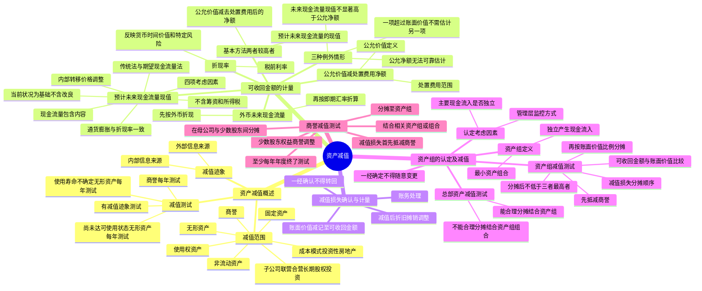

## 1. 章节定位

| 项目 | 信息 |
|------|------|
| 所属科目 | 会计 |
| 难度等级 | 4 |
| 历年分值 | 3-5 分 |
| 建议学时 | 6-8 小时 |
| 知识关联章节 | 第3章 固定资产（减值后折旧调整）、第4章 无形资产（使用寿命不确定每年减值测试）、第5章 投资性房地产（成本模式减值）、第6章 长期股权投资（减值不得转回）、第13章 金融工具（预期信用损失模型）、第24章 企业合并（商誉减值）、第27章 合并财务报表（商誉减值分摊） |

## 2. 考情分析

本章是会计科目的中高难度章节，历年分值约 3-5 分，以客观题和计算分析题为主，主观题常与固定资产、无形资产、商誉、合并财务报表等章节联动考查。

**命题规律**：客观题集中在资产减值范围、减值迹象判断、可收回金额的确定方法、资产组的认定；主观题集中在资产组减值损失的分摊、商誉减值测试（特别是涉及少数股东权益的商誉分摊）。

**高频考点分布**：

1. **资产减值的范围**：本章适用于非流动资产（对子公司、联营企业、合营企业的长期股权投资，成本模式投资性房地产，固定资产，生产性生物资产，无形资产，商誉，使用权资产，探明石油天然气矿区权益等）；存货、金融资产、递延所得税资产等适用其他准则。
2. **资产减值的迹象与测试**：外部信息来源（市价大幅度下跌、环境重大变化、市场利率提高、净资产账面价值远高于市值）；内部信息来源（陈旧过时或损坏、闲置或终止使用、经济绩效低于预期）；有减值迹象才进行测试，但商誉和使用寿命不确定的无形资产及尚未达到可使用状态的无形资产无论是否有减值迹象每年都进行减值测试。
3. **可收回金额的计量**：公允价值减去处置费用后的净额与预计未来现金流量的现值两者之间较高者；三种例外情形。
4. **预计未来现金流量现值**：未来现金流量包含的内容（持续使用产生的现金流入、必需的现金流出、处置时的净现金流量）；四项考虑因素（当前状况为基础不含改良、不含筹资和所得税、通货膨胀与折现率一致、内部转移价格调整）；传统法与期望现金流量法。
5. **折现率**：反映当前市场货币时间价值和资产特定风险的税前利率。
6. **减值损失的确认与计量**：账面价值减记至可收回金额；减值损失一经确认不得转回；减值后折旧摊销以新账面价值为基础。
7. **资产组的认定**：最小资产组合、独立产生现金流入；认定考虑因素；一经确定不得随意变更。
8. **资产组减值测试**：减值损失分摊顺序（先抵减商誉，再按账面价值比例分摊其他资产）；分摊后账面价值不得低于三者最高者（公允价值减处置费用净额、未来现金流量现值、零）。
9. **总部资产减值测试**：能合理分摊的结合资产组分摊；不能合理分摊的结合资产组组合测试。
10. **商誉减值测试**：至少每年年度终了测试；结合相关资产组或资产组组合；少数股东权益商誉的调整；减值损失首先抵减商誉。

**联动考查方式**：
- 与固定资产、无形资产结合：减值后折旧摊销的调整；
- 与企业合并、合并财务报表结合：商誉减值测试、少数股东权益商誉分摊；
- 与所得税结合：减值损失的暂时性差异；
- 与差错更正结合：错将减值损失转回、未进行商誉减值测试。

**备考建议**：
- 牢记"减值损失一经确认不得转回"（本章范围内的资产）；
- 牢记商誉和使用寿命不确定的无形资产每年减值测试，不论是否有减值迹象；
- 牢记可收回金额为两者较高者（公允价值减处置费用净额 vs 未来现金流量现值）；
- 牢记资产组减值损失分摊顺序（先商誉后其他资产，按账面价值比例）；
- 牢记商誉减值测试中需调整少数股东权益商誉。

## 3. 知识框架



## 4. 核心精讲

### 4.1 资产减值概述

#### 4.1.1 资产减值的范围

本章主要涉及企业非流动资产的减值，具体包括：
1. 对子公司、联营企业和合营企业的长期股权投资；
2. 采用成本模式进行后续计量的投资性房地产；
3. 固定资产；
4. 生产性生物资产；
5. 无形资产；
6. 商誉；
7. 使用权资产；
8. 探明石油天然气矿区权益和井及相关设施等。

> 注意：存货、消耗性生物资产、递延所得税资产、采用公允价值后续计量的投资性房地产、金融资产、划分为持有待售的非流动资产等的减值适用其他准则，不在本章范围内。

#### 4.1.2 资产减值的迹象与测试

**减值迹象的判断**：

| 来源 | 迹象 |
|------|------|
| 外部信息 | 资产市价大幅度下跌且跌幅明显高于正常预计；经营所处经济、技术、法律环境或市场发生重大不利变化；市场利率或其他投资报酬率提高导致可收回金额降低；净资产账面价值远高于市值 |
| 内部信息 | 资产陈旧过时或实体损坏；资产闲置、终止使用或计划提前处置；资产经济绩效低于预期 |

**减值测试的规则**：

- 一般资产：有减值迹象的，应当进行减值测试；
- **无论是否有减值迹象，每年都进行减值测试**的资产：
  1. 因企业合并形成的商誉；
  2. 使用寿命不确定的无形资产；
  3. 尚未达到可使用状态的无形资产。

> 原因：这些资产在后续计量中不再进行摊销（或尚未开始摊销），价值和未来经济利益具有较大不确定性，为避免资产价值高估，每年都应进行减值测试。

**可以不重新估计可收回金额的情形**：
1. 以前报告期间的计算结果表明，资产可收回金额远高于其账面价值，之后又没有发生消除这一差异的交易或事项的；
2. 以前报告期间的计算与分析表明，资产可收回金额对减值迹象反应不敏感的。

### 4.2 资产可收回金额的计量

#### 4.2.1 估计可收回金额的基本方法

资产可收回金额的估计，应当根据其**公允价值减去处置费用后的净额**与**资产预计未来现金流量的现值**两者之间**较高者**确定。

**三种例外或特殊考虑**：

1. 资产的公允价值减去处置费用后的净额与预计未来现金流量的现值，只要有一项超过了资产的账面价值，就表明资产没有发生减值，不需再估计另一项金额；
2. 没有确凿证据表明资产预计未来现金流量现值显著高于其公允价值减去处置费用后的净额的，可以将公允价值减去处置费用后的净额视为可收回金额；
3. 资产的公允价值减去处置费用后的净额无法可靠估计的，应当以预计未来现金流量的现值作为可收回金额。

#### 4.2.2 公允价值减去处置费用后的净额

- **公允价值**：市场参与者在计量日发生的有序交易中，出售一项资产所能收到的价格。
- **处置费用**：可以直接归属于资产处置的增量成本，包括与资产处置有关的法律费用、相关税费、搬运费以及为使资产达到可销售状态所发生的直接费用等，**不包括**财务费用和所得税费用。

#### 4.2.3 预计未来现金流量的现值

资产预计未来现金流量的现值，应当按照资产在持续使用过程中和最终处置时所产生的预计未来现金流量，选择恰当的折现率对其进行折现后的金额加以确定。

**（1）资产未来现金流量的预计**

预计基础：企业管理层应当在合理和有依据的基础上对资产剩余使用寿命内整个经济状况进行最佳估计，建立在经企业管理层批准的最近财务预算或预测数据之上，通常最多涵盖 5 年（能证明更长的可以涵盖更长）。

**未来现金流量应当包括的内容**：
1. 资产持续使用过程中预计产生的现金流入；
2. 为实现资产持续使用过程中产生的现金流入所必需的预计现金流出（包括为使资产达到预定可使用状态所发生的现金流出）；
3. 资产使用寿命结束时，处置资产所收到或者支付的净现金流量。

**预计应考虑的四项因素**：

| 因素 | 处理原则 |
|------|---------|
| 以资产的当前状况为基础 | 不包括尚未作出承诺的重组事项和资产改良有关的未来现金流量；已承诺重组的应反映重组节约的费用和利益；维持资产正常运转的支出应考虑在内 |
| 不包括筹资活动和所得税付现 | 筹资活动的货币时间价值已通过折现考虑；折现率为税前基础，现金流量也必须建立在税前基础上 |
| 通货膨胀因素与折现率一致 | 折现率考虑了通货膨胀的，现金流量也应考虑；反之亦然 |
| 内部转移价格应调整 | 不应以内部转移价格为基础，应采用公平交易中管理层能达成的最佳未来价格估计数 |

**预计方法**：
- **传统法**：使用单一的未来每期预计现金流量和单一的折现率计算；
- **期望现金流量法**：当影响未来现金流量的因素较多、不确定性较大时，根据每期现金流量期望值（各种可能情况下的现金流量与其发生概率加权计算）进行预计。

**（2）折现率的预计**

折现率应当是反映当前市场货币时间价值和资产特定风险的**税前利率**，即企业在购置或投资资产时所要求的必要报酬率。

- 如果预计未来现金流量时已对资产特定风险作了调整，折现率不需要再考虑这些特定风险；
- 如果用于估计折现率的基础是税后的，应当调整为税前折现率；
- 通常使用单一折现率，如果未来不同期间风险差异或利率期间结构反应敏感的，应当采用不同折现率。

**（3）外币未来现金流量的预计**

1. 首先以该资产所产生的未来现金流量的结算货币为基础预计其未来现金流量，并按照该货币适用的折现率计算资产的现值；
2. 将该外币现值按照计算资产未来现金流量现值当日的即期汇率进行折算；
3. 在该现值基础上，比较资产公允价值减去处置费用后的净额以及资产的账面价值，以确定是否需要确认减值损失。

### 4.3 资产减值损失的确认与计量

#### 4.3.1 减值损失确认与计量的一般原则

企业在对资产进行减值测试后，如果资产的可收回金额低于其账面价值的，应当将资产的账面价值减记至可收回金额，减记的金额确认为资产减值损失，计入当期损益，同时计提相应的资产减值准备。

减值损失确认后，减值资产的折旧或者摊销费用应当在未来期间作相应调整，以使该资产在剩余使用寿命内系统地分摊调整后的资产账面价值（扣除预计净残值）。

> 重要原则：资产减值损失一经确认，在以后会计期间**不得转回**。以前期间计提的资产减值准备，需要等到资产处置时才可转出。

#### 4.3.2 减值损失的账务处理

企业应当设置"资产减值损失"科目，按照资产类别进行明细核算；同时根据不同资产类别分别设置"固定资产减值准备""无形资产减值准备""商誉减值准备""长期股权投资减值准备"等科目。

```
借：资产减值损失
    贷：固定资产减值准备/无形资产减值准备/商誉减值准备等
```

期末，"资产减值损失"科目余额转入"本年利润"科目，结转后无余额。各资产减值准备科目累积每期计提的减值准备，直至相关资产被处置时才予以转出。

### 4.4 资产组的认定及减值处理

#### 4.4.1 资产组的认定

**资产组**是企业可以认定的最小资产组合，其产生的现金流入应当基本上独立于其他资产或者资产组。资产组应当由创造现金流入相关的资产构成。

**认定资产组应当考虑的因素**：

1. **以资产组产生的主要现金流入是否独立于其他资产或资产组为依据**。能否独立产生现金流入是认定资产组的最关键因素。
2. **考虑企业管理层对生产经营活动的管理或监控方式和对资产的持续使用或处置的决策方式**。

> 特殊情形：企业几项资产的结合生产的产品（或其他产出）存在活跃市场的，无论这些产品是用于对外出售还是仅供企业内部使用，均表明这几项资产的组合能够独立创造现金流入，应当将其认定为资产组。

**资产组一经确定后，在各个会计期间应当保持一致，不得随意变更**。如果由于企业重组、变更资产用途等原因确需变更的，企业管理层应当证明该变更是合理的，并在附注中说明。

#### 4.4.2 资产组减值测试

资产组减值测试的原理与单项资产一致：预计资产组的可收回金额，计算资产组的账面价值，两者比较。

**资产组账面价值的确定**：应当包括可直接归属于资产组与可以合理和一致地分摊至资产组的资产账面价值，通常**不包括**已确认负债的账面价值（除非不考虑该负债金额就无法确定资产组可收回金额的除外）。

**减值损失的分摊顺序**：

1. **首先抵减分摊至资产组中商誉的账面价值**；
2. **然后根据资产组中除商誉之外的其他各项资产的账面价值所占比重，按比例抵减其他各项资产的账面价值**。

> 重要限制：抵减后的各资产的账面价值不得低于以下三者之中最高者：①该资产的公允价值减去处置费用后的净额（如可确定的）；②该资产预计未来现金流量的现值（如可确定的）；③零。因此而导致的未能分摊的减值损失金额，应当按照相关资产组中其他各项资产的账面价值所占比重进行分摊。

**【例 7-1】** XYZ 公司有一条甲生产线，由 A、B、C 三部机器构成，账面价值分别为 200 000 元、300 000 元、500 000 元，构成一个资产组。该生产线可收回金额为 600 000 元，账面价值为 1 000 000 元，应确认减值损失 400 000 元。A 机器的公允价值减去处置费用后的净额为 150 000 元。

分摊过程：

| 项目 | A 机器 | B 机器 | C 机器 | 合计 |
|------|--------|--------|--------|------|
| 账面价值 | 200 000 | 300 000 | 500 000 | 1 000 000 |
| 分摊比例 | 20% | 30% | 50% | 100% |
| 第一次分摊 | 50 000* | 120 000 | 200 000 | 370 000 |
| 分摊后账面价值 | 150 000 | 180 000 | 300 000 | 630 000 |
| 尚未分摊减值损失 | — | — | — | 30 000 |
| 第二次分摊比例 | — | 37.5% | 62.5% | 100% |
| 第二次分摊 | — | 11 250 | 18 750 | 30 000 |
| 确认减值损失总额 | 50 000 | 131 250 | 218 750 | 400 000 |

> 注：*A 机器按比例应分摊 80 000 元（400 000 × 20%），但其公允价值减去处置费用后的净额为 150 000 元，因此最多确认 50 000 元，未能分摊的 30 000 元在 B、C 之间按账面价值比例再分摊。

#### 4.4.3 总部资产的减值测试

**总部资产**包括企业集团或其事业部的办公楼、电子数据处理设备、研发中心等资产。其显著特征是难以脱离其他资产或资产组产生独立的现金流入，账面价值难以完全归属于某一资产组。

总部资产减值测试分两种情况处理：

| 情形 | 处理方法 |
|------|---------|
| 能够按照合理和一致的基础分摊至资产组 | 将该部分总部资产账面价值分摊至资产组，再据以比较资产组账面价值（含分摊的总部资产）和可收回金额 |
| 难以按照合理和一致的基础分摊至资产组 | 先不考虑总部资产估计和比较资产组的账面价值与可收回金额；再认定由若干资产组组成的最小资产组组合（含该部分总部资产），比较其账面价值与可收回金额 |

### 4.5 商誉减值测试与处理

#### 4.5.1 商誉减值测试的基本要求

企业合并所形成的商誉**至少应当在每年年度终了进行减值测试**。由于商誉难以独立产生现金流量，应当结合与其相关的资产组或者资产组组合进行减值测试。

商誉的账面价值应当自购买日起按照合理的方法分摊至相关的资产组；难以分摊至相关资产组的，应当分摊至相关的资产组组合。这些相关的资产组或资产组组合应当是能够从企业合并的协同效应中受益的资产组或组合。

#### 4.5.2 商誉减值测试的方法与会计处理

**测试步骤**（如与商誉相关的资产组或资产组组合存在减值迹象）：

1. **首先对不包含商誉的资产组或资产组组合进行减值测试**，计算可收回金额，与相关账面价值比较，确认相应的减值损失；
2. **再对包含商誉的资产组或资产组组合进行减值测试**，比较其账面价值（含分摊的商誉账面价值）与可收回金额，差额确认减值损失。

**减值损失的分摊顺序**（与资产组减值相同）：
1. 首先抵减分摊至资产组或资产组组合中商誉的账面价值；
2. 然后根据除商誉外其他各项资产的账面价值所占比重，按比例抵减。

> 重要：少数股东权益商誉的调整。由于企业合并所形成的商誉是母公司根据其在子公司所拥有的权益而确认的，子公司中归属于少数股东的商誉并没有在合并财务报表中确认。为使减值测试建立在一致的基础上，企业应当调整资产组的账面价值，**将归属于少数股东权益的商誉包括在内**，然后与可收回金额比较。

**少数股东权益商誉的计算**：归属于少数股东权益的商誉 = (合并成本 ÷ 持股比例 − 可辨认净资产公允价值) × 少数股东持股比例

商誉减值损失应当在归属于母公司和少数股东权益之间按比例进行分摊，合并财务报表只反映归属于母公司的商誉减值损失。

**【例 7-2】** 甲企业于 2×24 年 1 月 1 日以 1 600 万元收购乙企业 80% 股权。购买日乙企业可辨认资产公允价值为 1 500 万元，没有负债和或有负债。甲企业确认商誉 400 万元（1 600 − 1 500 × 80%），可辨认净资产 1 500 万元，少数股东权益 300 万元（1 500 × 20%）。乙企业被认定为一个资产组。2×24 年末，该资产组可收回金额为 1 000 万元，可辨认净资产账面价值为 1 350 万元。

商誉减值测试过程（单位：万元）：

| 项目 | 商誉 | 可辨认资产 | 合计 |
|------|------|----------|------|
| 账面价值 | 400 | 1 350 | 1 750 |
| 未确认归属于少数股东权益的商誉 | 100 | — | 100 |
| 调整后账面价值 | 500 | 1 350 | 1 850 |
| 可收回金额 | — | — | 1 000 |
| 减值损失 | — | — | 850 |

减值损失 850 万元首先冲减商誉 500 万元，剩余 350 万元冲减可辨认资产。由于确认的商誉仅限母公司持有的 80%，因此合并财务报表中确认归属于母公司的商誉减值损失为 400 万元（500 × 80%），剩余 350 万元为可辨认资产减值损失。

## 5. 典型例题

**【例题 1】（资产组减值损失的分摊）**

甲公司有一条生产线由 A、B、C 三台设备构成，账面价值分别为 100 万元、150 万元、250 万元，构成一个资产组。该资产组无商誉。2×24 年末，该资产组出现减值迹象，经测试，该资产组的可收回金额为 300 万元。A 设备的公允价值减去处置费用后的净额为 80 万元，B、C 设备的公允价值减去处置费用后的净额及预计未来现金流量的现值均无法合理估计。

要求：计算 A、B、C 三台设备应确认的减值损失（金额单位：万元）。

**答案**：

资产组账面价值 = 100 + 150 + 250 = 500（万元）
减值损失 = 500 − 300 = 200（万元）

第一次分摊（按账面价值比例）：

| 设备 | 账面价值 | 比例 | 分摊额 | 分摊后账面价值 | 限额 |
|------|---------|------|-------|--------------|------|
| A | 100 | 20% | 40* | 60→80 | 80 |
| B | 150 | 30% | 60 | 90 | — |
| C | 250 | 50% | 100 | 150 | — |

A 设备分摊后账面价值为 60 万元，低于其公允价值减去处置费用后的净额 80 万元，故 A 设备最多分摊 20 万元（100 − 80），未能分摊的 20 万元在 B、C 之间按账面价值比例再分摊。

第二次分摊：B、C 账面价值比例 = 150 : 250 = 37.5% : 62.5%

| 设备 | 第二次分摊 | 确认减值损失总额 |
|------|----------|----------------|
| A | 0 | 20 |
| B | 20 × 37.5% = 7.5 | 60 + 7.5 = 67.5 |
| C | 20 × 62.5% = 12.5 | 100 + 12.5 = 112.5 |
| 合计 | 20 | 200 |

**解析**：资产组减值损失分摊时，先按各项资产账面价值比例分摊，分摊后账面价值不得低于公允价值减去处置费用后的净额、预计未来现金流量的现值和零三者中的最高者。未能分摊的部分在其余资产间按账面价值比例再分摊。

**【例题 2】（商誉减值测试）**

2×24 年 1 月 1 日，甲公司以 2 400 万元收购乙公司 80% 股权，购买日乙公司可辨认净资产的公允价值为 2 000 万元，无负债和或有负债。乙公司被认定为一个资产组。2×24 年末，乙公司可辨认净资产的账面价值为 1 800 万元，该资产组的可收回金额为 2 100 万元。

要求：计算甲公司合并财务报表中应确认的商誉减值损失（金额单位：万元）。

**答案**：

（1）计算商誉：
- 母公司确认的商誉 = 2 400 − 2 000 × 80% = 800（万元）
- 归属于少数股东权益的商誉 = (2 400 ÷ 80% − 2 000) × 20% = 200（万元）

（2）调整资产组账面价值：

| 项目 | 商誉 | 可辨认资产 | 合计 |
|------|------|----------|------|
| 账面价值 | 800 | 1 800 | 2 600 |
| 少数股东权益商誉 | 200 | — | 200 |
| 调整后账面价值 | 1 000 | 1 800 | 2 800 |
| 可收回金额 | — | — | 2 100 |
| 减值损失 | — | — | 700 |

（3）减值损失分摊：
- 减值损失 700 万元首先冲减商誉账面价值 1 000 万元（足够冲减），商誉减值损失 700 万元；
- 合并财务报表只反映归属于母公司的商誉减值损失 = 700 × 80% = **560（万元）**。

**解析**：商誉减值测试时，需将归属于少数股东权益的商誉包括在资产组账面价值中调整，使比较基础一致。减值损失首先抵减商誉，合并财务报表只反映归属于母公司的部分（按持股比例分摊）。

## 6. 记忆口诀

**资产减值范围**："非流动资产为主，子公司联营合营长期股权投资、成本模式投资性房地产、固定资产、无形资产、商誉、使用权资产"——存货、金融资产、递延所得税适用其他准则。

**每年测试三项**："商誉、使用寿命不确定无形资产、尚未达可使用状态无形资产"——无论是否有减值迹象每年减值测试。

**可收回金额**："公允减处置费用净额与未来现金流量现值两者较高者"——取较高者。

**预计现金流量四因素**："当前状况为基础不含改良、不含筹资和所得税、通胀与折现率一致、内部转移价格调整"——四项考虑因素。

**折现率**："税前利率，反映货币时间价值和特定风险"——税前基础，与现金流量一致。

**减值损失铁律**："一经确认不得转回"——本章范围内资产减值损失不得转回。

**资产组减值分摊顺序**："先商誉，后其他资产按账面价值比例"——首先抵减商誉。

**分摊后限额**："三者最高者：公允减处置净额、未来现金流量现值、零"——不得低于三者最高者。

**总部资产减值**："能分摊结合资产组，不能分摊结合资产组组合"——两种处理方式。

**商誉减值测试**："每年测试，结合资产组，少数股东商誉要调整，减值先抵商誉，母公司只认母公司部分"——商誉减值测试核心要点。

## 7. 同步练习

**119.（单选题）** 2×19年12月31日，甲公司对购入的时间相同、型号相同、性能相似的设备进行检查时发现该类设备可能发生减值。该类设备公允价值总额为82万元，直接归属于该类设备的处置费用为2万元；该类设备尚可使用3年，预计其在未来2年内产生的现金流量分别为40万元、30万元，第3年产生的现金流量以及使用寿命结束时处置形成的现金流量合计为20万元。在考虑相关因素的基础上，公司决定采用3%的折现率。2×19年12月31日设备的可收回金额为（　）。[（P/F，3%，1）=0.9709；（P/F，3%，2）=0.9426；（P/F，3%，3）=0.9151]

A. 82万元
B. 20万元
C. 80万元
D. 85.42万元

---

**120.（单选题）** 甲公司以人民币为记账本位币，以交易发生日即期汇率折算外币业务，其有一辆货车，专门从事国际货物运输，该货车的收入、成本等金额均以美元计价。至2×22年末，甲公司按美元所适用的折现率对该货车确定的预计未来现金流量现值为500万美元，当日汇率为1美元=6.15元人民币。该货车对外出售将取得价款520万美元，同时将发生处置费用50万美元。不考虑其他因素，该国际运输货车的可收回金额为（　）。

A. 2767.5万元
B. 3198万元
C. 3075万元
D. 2890.5万元

---

**121.（单选题）** 甲企业有A车间、B车间、C车间和D销售门市部，A车间专门生产零件，B车间专门生产部件，该零部件不存在活跃市场，A车间、B车间生产完成后由C车间负责组装产品，再由独立核算的D门市部负责销售。D门市部除销售该产品外，还负责销售其他产品。甲企业正确的资产组划分为（　）。

A. A车间、B车间、C车间和D门市部构成一个资产组
B. A车间、B车间构成一个资产组，C车间和D门市部构成一个资产组
C. A车间、B车间构成一个资产组，C车间构成一个资产组，D门市部构成一个资产组
D. A车间、B车间、C车间构成一个资产组，D门市部构成一个资产组

---

**122.（单选题）** 甲公司属于矿业生产企业，假定法律要求矿产的业主必须在完成开采后将该地区恢复原貌。恢复费用包括表土覆盖层的复原，因为表土覆盖层在矿山开发前必须搬走。表土覆盖层一旦移走，企业就应为其确认一项负债，其有关费用计入矿山成本，并在矿山使用寿命内计提折旧。假定该公司为恢复费用确认的预计负债的账面金额为1000万元。2×22年12月31日，该公司正在对矿山进行减值测试，矿山的资产组是整座矿山。甲公司已经收到愿意以4000万元的价格购买该矿山的合同，这一价格已经考虑了复原表土覆盖层的成本。矿山预计未来现金流量的现值为5500万元，不包括应负担的恢复费用；矿山的账面价值为5600万元。假定不考虑矿山的处置费用。该资产组2×22年12月31日应计提的减值准备金额为（　）。

A. 600万元
B. 100万元
C. 200万元
D. 500万元

---

**123.（单选题）**（2022年）下列各项资产中，不适用资产减值准则进行减值会计处理的是（　）。

A. 商誉
B. 生产性生物资产
C. 权益法计量的长期股权投资
D. 递延所得税资产

---

**124.（单选题）**（2019年）20×9年1月1日，甲公司以非同一控制下企业合并的方式购买了乙公司60%股权，支付价款1800万元。在购买日，乙公司可辨认净资产的账面价值为2300万元，公允价值为2500万元，没有负债和或有负债。20×9年12月31日，乙公司可辨认净资产的账面价值为2500万元，按照购买日的公允价值持续计算的金额为2600万元，没有负债和或有负债。甲公司认定乙公司的所有资产为一个资产组，经评估，甲公司判断乙公司资产组不存在减值迹象。确定资产组在20×9年12月31日的可收回金额为2700万元，不考虑其他因素，甲公司在20×9年合并利润表中应当列报的资产减值损失金额是（　）。

A. 200万元
B. 240万元
C. 400万元
D. 0

---

**125.（单选题）** 甲公司在2×18年1月1日以1600万元的价格收购了乙企业80%股权。在购买日，乙企业可辨认资产的公允价值和账面价值均为1500万元，假定没有负债和或有负债。在2×20年末，乙企业的可辨认净资产存在减值迹象，未进行过减值测试，甲公司确定该资产组含商誉的可收回金额为1450万元，不含商誉的可收回金额为1000万元，可辨认净资产的账面价值为1350万元。假定不考虑其他因素，甲公司的做法不正确的是（　）。

A. 将乙企业的所有资产认定为一个资产组
B. 甲公司对商誉至少应当于每年年度终了进行减值测试
C. 2×20年末，甲公司合并报表中确认的商誉减值准备为40万元
D. 2×20年末，甲公司合并报表中确认的资产减值损失为350万元

---

**126.（单选题）** 下列各项关于商誉减值测试与处理的表述中，不正确的是（　）。

A. 持有待售的处置组确认的资产减值损失在后续期间得以转回时，已抵减的商誉账面价值所确认的资产减值损失不得转回
B. 企业在分摊商誉的账面价值时，应当依据相关的资产组或者资产组组合能够从企业合并的协同效应中获得的相对受益情况进行分摊，在此基础上进行商誉减值测试
C. 在确定处置损益时，应将与该处置经营相关的商誉包括在该经营的账面价值中
D. 存在少数股东权益时，商誉减值损失中归属于少数股东权益的部分也应该在合并财务报表中予以确认

---

**127.（多选题）** 下列项目构成企业某项资产所产生的预计未来现金流量的有（　）。

A. 资产持续使用过程中预计产生的现金流入
B. 为实现资产持续使用过程中产生的现金流入所必需的预计现金流出
C. 资产使用寿命结束时，处置资产所收到或者支付的净现金流量
D. 所得税费用

---

**128.（多选题）** 下列各项关于资产减值的表述中，正确的有（　）。

A. 以前报告期间的计算结果表明，资产可收回金额远高于其账面价值，之后又没有发生消除这一差异的交易或事项，则企业在资产负债表日不需要重新估计该资产的可收回金额
B. 资产的公允价值减去处置费用后的净额与资产预计未来现金流量的现值，必须都超过资产的账面价值，才表明资产没有发生减值
C. 资产的公允价值减去处置费用后的净额如果无法估计的，应当以该资产预计未来现金流量的现值作为其可收回金额
D. 以前报告期间的计算与分析表明，资产可收回金额对于资产减值准则中所列示的一种或多种减值迹象不敏感，在本报告期间又发生了这些减值迹象的，在资产负债表日企业可以不需因为上述减值迹象的出现而重新估计该资产的可收回金额

---

**129.（多选题）** 甲公司有A、B、C三条生产线作为3个资产组进行核算，账面价值分别为500万元、400万元、600万元，预计剩余使用寿命分别为10年、5年、5年。甲公司另有一项总部资产，账面价值300万元。2×20年末甲公司所处的市场发生重大变化，对甲公司产生不利影响，因此甲公司对各项资产进行了减值测试。假设总部资产能够按照合理和一致的基础分摊至各资产组，不考虑其他因素，下列有关甲公司总部资产减值的说法正确的有（　）。

A. 总部资产的显著特征是难以脱离其他资产或者资产组产生独立的现金流入，而且其账面价值难以完全归属于某一资产组
B. 相关总部资产能按照合理和一致的基础分摊至各资产组的，应将其分摊到资产组，再据以比较资产组的账面价值和可收回金额，并汇总得出总部资产减值金额
C. 计算资产组减值损失的金额时，应以账面价值，即分别以500万元、400万元、600万元直接计算减值金额
D. 计算资产组减值损失的金额，应以分摊总部资产后各资产组账面价值为基础，即分别以650万元、460万元、690万元为基准进行计算

---

**130.（多选题）** 下列各项关于资产组的认定以及减值处理的表述中正确的有（　）。

A. 相关总部资产能按照合理和一致的基础分摊至各资产组的，应将其分摊到资产组，再据以比较资产组的账面价值（包括已分摊的总部资产的账面价值部分）和可收回金额，并汇总得出总部资产减值金额
B. 能够从企业合并的协同效应中受益的资产组或者资产组组合，应当代表企业基于内部管理目的对商誉进行监控的最低水平
C. 为进行减值测试，对于因企业合并形成的商誉的账面价值，企业应该自购买日起按照合理的方法将其分摊至企业所有的资产组或资产组组合
D. 资产组的认定，应当以资产组产生的主要现金流入是否独立于其他资产或者资产组的现金流入为依据

---

**131.（多选题）** 2×16年末，甲公司某项资产组（均为非金融长期资产）存在减值迹象，经减值测试，预计资产组的未来现金流量现值为4000万元，公允价值减去处置费用后的净额为3900万元；该资产组的账面价值5500万元，其中商誉的账面价值为300万元。2×17年末，该资产组的账面价值为3800万元；预计未来现金流量现值为5600万元，公允价值减去处置费用后的净额为5000万元。该资产组2×16年以前未计提减值准备，假定2×16年末资产组内所有可辨认净资产均未发生资产减值迹象，未进行过减值测试。不考虑其他因素，下列各项关于甲公司对该资产组减值会计处理的表述中，正确的有（　）。

A. 2×16年末应计提资产组减值准备1500万元
B. 2×17年末资产组的账面价值为3800万元
C. 2×16年末应对资产组包含的商誉计提300万元的减值准备
D. 2×17年末资产组中商誉的账面价值为300万元

---

**132.（多选题）**（2024年）下列各项中，至少应当于每年年末进行减值测试的有（　）。

A. 使用寿命不确定的无形资产
B. 开发支出
C. 商誉
D. 对联营企业或合营企业的长期股权投资

---

**133.（多选题）**（2024年）2024年末，甲公司一项资产组的账面价值是1700万元，其中商誉200万元，X设备1000万元，Y设备300万元，在建工程200万元。该资产组的资产均未发生资产减值迹象，未进行过减值测试。该资产组的可收回金额是1350万元，X设备的公允价值减去处置费用后的净额是950万元，其他资产的可收回金额不能可靠估计。甲公司将对在建工程继续投入使其形成新的生产线。不考虑其他因素，下列关于甲公司资产减值会计处理的表述中，正确的有（　）。

A. 商誉应计提减值200万元
B. X设备应计提减值50万元
C. Y设备应计提减值30万元
D. 在建工程不计提减值

---

**134.（计算分析题）**（2024年）甲公司是生产和销售杏仁片和杏仁饼干的企业，2×23年相关资料如下：

（1）甲公司有A、B、C三条生产线，A、B生产线生产杏仁片，杏仁片既可以用于第三方销售，也可以用于继续加工杏仁饼干。C生产线用于将杏仁片继续加工为杏仁饼干。A、B生产线提供的杏仁片完全足够甲公司后续加工，并且A、B生产线之间生产不均衡，甲公司协调让其趋于均衡。

（2）三条生产线均由多项机器设备组成。A、B、C三条生产线的账面价值分别为1170万元、1230万元、1700万元，剩余使用年限相同，甲公司总部资产为一栋办公大楼和研发中心，办公大楼的账面价值为1000万元，研发中心的账面价值为500万元。

（3）C生产线中的X机器，账面价值为100万元，由于质量问题，甲公司决定将其报废。X机器公允价值减去处置费用后的净额为10万元。

（4）由于市场更新迭代，出现了杏仁饼干的替代品，导致甲公司生产线出现了减值迹象，办公大楼可以按照生产线账面价值比例分摊到A、B、C生产线，研发中心不可以按照合理和一致的基础分摊至生产线的账面价值。

A、B生产线预计未来现金流量现值为2600万元，公允价值减去处置费用后的净额不能可靠取得。C生产线（不含X机器）预计公允价值减去处置费用后的净额为1800万元，预计未来现金流量不能可靠取得，甲公司总资产的可收回金额为5000万元。

要求：
（1）判断A、B、C生产线资产组的认定，并说明理由。
（2）判断X机器是单独计算减值还是同生产线C一起计算减值，并说明理由。
（3）计算A生产线、B生产线、C生产线、办公大楼和研发中心应确定的资产减值损失的金额。

---

**135.（综合题）**（2024年）甲公司相关年度发生的有关交易或事项如下：

（1）2×22年12月31日，甲公司光学事业部生产的光学器材由于型号、性能过时，销量和价格大幅下滑，产量收缩，甲公司判断相关生产线出现减值迹象。该生产线由厂房、设备P和设备M构成，上述资产属于一个资产组。

（2）2×22年12月31日，厂房、设备P和设备M的账面原值分别为2000万元、600万元和1400万元，已计提累计折旧分别为1000万元、300万元和700万元，历史期间未发生过减值。厂房的公允价值减处置费用后的净额为800万元，设备P和设备M无法合理估计其公允价值减处置费用后的净额或预计未来现金流量的现值。

（3）甲公司管理层2×22年批准的财务预算显示，预计2×25年将对生产设备进行大规模技术改造，预计发生资本性支出520万元，改造后生产的光学器材的预计销量和价格会相应提升。如果不考虑上述技术改造，2×22年12月31日，该生产线的预计未来现金流量的现值为1400万元；如果考虑技术改造因素带来的影响，生产线的预计未来现金流量的现值为1800万元。该生产线整体的公允价值减去处置费用后的净额无法合理估计。

上述厂房、设备P和设备M的预计剩余使用寿命均为10年，按年限平均法计提折旧，预计净残值均为零。

（4）2×24年1月1日，甲公司对经营战略进行了调整，决定与乙公司合资成立丙公司，甲公司以厂房、设备P和设备M按公允价值1500万元出资，取得丙公司40%股权，乙公司以现金、专有技术作价2250万元出资，取得丙公司60%股权。当日，甲公司能够对丙公司施加重大影响，并对该投资采用权益法核算。甲公司可根据丙公司章程要求派董事和副总经理，其余管理人员和生产团队全部由乙公司安排。甲公司投入的各项资产在丙公司延续原有的使用目的和使用方式，预计均尚可使用9年，按年限平均法计提折旧，预计净残值为零。

2×24年1月至6月，丙公司实现净利润300万元，除此之外，丙公司净资产无其他变动。

其他资料：①甲公司与乙公司不存在关联方关系；②甲公司投入丙公司的厂房、设备P和设备M不构成业务；③不考虑相关税费及其他因素。

要求：
（1）根据资料（1）～（3），判断甲公司在计算预计未来现金流量的现值时，是否应考虑财务预算中的技术改造带来的影响，并说明理由。
（2）根据资料（1）～（3），计算并通过分析说明厂房应计提的减值金额。
（3）根据资料（1）～（3），计算设备P和设备M应计提的减值金额。
（4）根据上述资料，编制甲公司通过固定资产出资取得长期股权投资的会计分录。
（5）根据上述资料，计算甲公司个别报表2×24年1月至6月确认投资收益的金额。

---

**练习答案**：（本章答案缺失，可参考历年真题）
