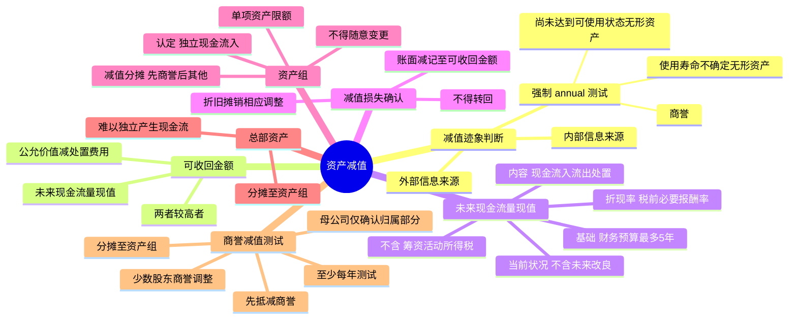

## 📍 章节定位

| 项目 | 信息 |
|------|------|
| **所属科目** | 📒 会计 |
| **难度等级** | ⭐⭐⭐ |
| **历年分值** | 3-5分 |
| **建议学时** | 5-6h |

## 📝 考情分析

本章是会计科目的重点章节，历年分值约 3-5 分，以客观题为主，主观题常结合固定资产、无形资产、商誉、企业合并等在综合题中考查。命题热点集中在：资产减值迹象的判断、可收回金额的确定（公允价值减去处置费用后的净额与预计未来现金流量现值两者较高者）、资产组的认定及减值损失的分摊、商誉减值测试的特殊处理（包含少数股东权益商誉的调整）、资产减值损失一经计提不得转回的原则。

考生需重点掌握：商誉和使用寿命不确定的无形资产无论是否存在减值迹象都应每年进行减值测试；预计未来现金流量时不包括筹资活动和所得税付现的现金流量、以资产当前状况为基础（不含未来改良支出）；资产组减值损失分摊顺序（先抵减商誉，再按其他资产账面价值比例分摊，单项资产减值后账面价值不得低于公允价值减去处置费用后的净额、现值和零三者最高者）；商誉减值测试时需将归属于少数股东权益的商誉包含在资产组账面价值中。

## 🧠 知识框架



## 📖 核心精讲

### 一、资产减值迹象与测试

#### （一）减值迹象的判断

企业在资产负债表日应当判断资产是否存在可能发生减值的迹象，可从外部和内部信息来源两方面判断：

**外部信息来源**：
- 资产的市价在当期大幅度下跌，跌幅明显高于因时间推移或正常使用而预计的下跌；
- 企业经营所处的经济、技术或法律环境以及资产所处的市场在当期或近期发生重大不利变化；
- 市场利率或其他市场投资报酬率提高，导致资产可收回金额大幅度降低；
- 企业所有者权益（净资产）的账面价值远高于其市值。

**内部信息来源**：
- 资产已经陈旧过时或实体损坏；
- 资产已经或将被闲置、终止使用或计划提前处置；
- 企业内部报告的证据表明资产的经济绩效已经低于或将低于预期。

#### （二）减值测试

资产存在减值迹象是进行减值测试的必要前提，但以下资产**无论是否存在减值迹象**，都应当至少每年年度终了进行减值测试：
1. 因企业合并形成的**商誉**；
2. 使用寿命不确定的**无形资产**；
3. 尚未达到可使用状态的**无形资产**。

**可不估计可收回金额的情况**：①以前报告期间可收回金额远高于账面价值，之后没有消除这一差异的交易或事项；②以前分析表明可收回金额对减值迹象反应不敏感。

### 二、资产可收回金额的计量

#### （一）基本方法

资产可收回金额 = **max**（公允价值减去处置费用后的净额，预计未来现金流量的现值）

**例外情况**：
1. 公允价值减去处置费用后的净额或预计未来现金流量现值，**只要有一项超过账面价值**，就表明资产没有减值，不需再估计另一项。
2. 没有确凿证据表明未来现金流量现值显著高于公允价值减去处置费用后的净额的，可以将后者视为可收回金额。
3. 公允价值减去处置费用后的净额**无法可靠估计**的，以预计未来现金流量现值作为可收回金额。

#### （二）公允价值减去处置费用后的净额

- **公允价值**：市场参与者在计量日发生的有序交易中，出售一项资产所能收到的价格。
- **处置费用**：可以直接归属于资产处置的增量成本，包括法律费用、相关税费、搬运费以及为使资产达到可销售状态所发生的直接费用等。**不包括**财务费用和所得税费用。

#### （三）预计未来现金流量的现值

**1. 预计基础**：建立在经企业管理层批准的最近财务预算或预测数据之上，最多涵盖 **5 年**（能证明更长的期间合理的除外）。预算或预测期之后的现金流量以稳定或递减的增长率为基础估计。

**2. 应当包括的内容**：
- 资产持续使用过程中预计产生的现金流入；
- 为实现资产持续使用产生的现金流入所必需的预计现金流出（含为使资产达到预定可使用状态发生的全部现金流出）；
- 资产使用寿命结束时，处置资产所收到或支付的净现金流量。

**3. 应当考虑的因素**：

| 因素 | 处理 |
|------|------|
| 以资产的**当前状况**为基础 | 不包括与将来可能发生的、尚未作出承诺的重组事项或资产改良有关的预计未来现金流量；已承诺重组的应考虑重组影响 |
| **不包括**筹资活动和所得税收付产生的现金流量 | 货币时间价值已通过折现考虑；折现率为税前 |
| **通货膨胀**因素的考虑应与折现率一致 | 折现率考虑了通货膨胀，现金流量也考虑；反之都不考虑 |
| **内部转移价格**应当予以调整 | 采用公平交易中的最佳未来价格估计数 |

**4. 折现率**：反映当前市场货币时间价值和资产特定风险的**税前**利率，即企业在购置或投资资产时所要求的必要报酬率。如果未来现金流量已对特定风险作了调整，折现率不再考虑这些风险。

**5. 外币未来现金流量**：先以外币适用的折现率计算现值，再按计算当日的即期汇率折算为记账本位币。

### 三、资产减值损失的确认与计量

#### （一）一般原则

资产可收回金额低于账面价值的，应当将账面价值减记至可收回金额，减记金额确认为**资产减值损失**，计入当期损益，同时计提相应的资产减值准备。

**关键原则**：资产减值损失一经确认，在以后会计期间**不得转回**（仅指固定资产、无形资产、商誉、长期股权投资等长期资产；存货跌价准备、坏账准备等可转回）。

减值确认后，资产的折旧或摊销费用应当在未来期间作相应调整，以新的账面价值（扣除预计净残值）为基础计提。

#### （二）账务处理

```
借：资产减值损失
　　贷：固定资产减值准备 / 无形资产减值准备 / 商誉减值准备 / 长期股权投资减值准备 / 投资性房地产减值准备 等
```

### 四、资产组的认定及减值处理

#### （一）资产组的认定

**资产组**是企业可以认定的最小资产组合，其产生的现金流入应当基本上独立于其他资产或资产组。

**认定考虑因素**：
1. 以资产组产生的主要现金流入是否**独立于其他资产或资产组**为依据（最关键因素）。
2. 考虑企业管理层对生产经营活动的管理或监控方式和对资产的持续使用或处置的决策方式。

**重要规则**：资产组一经确定，各个会计期间应当保持一致，**不得随意变更**。如因企业重组、变更资产用途等确需变更的，企业管理层应当证明变更是合理的，并在附注中说明。

#### （二）资产组减值测试

**资产组账面价值**：包括可直接归属于资产组与可以合理和一致地分摊至资产组的资产账面价值，**通常不包括已确认负债的账面价值**（不考虑该负债金额就无法确定资产组可收回金额的除外）。

**减值损失分摊顺序**：
1. **首先抵减分摊至资产组中商誉的账面价值**；
2. 然后根据资产组中除商誉之外的其他各项资产的账面价值所占比重，**按比例抵减其他各项资产的账面价值**。

**单项资产抵减限额**：抵减后的各资产账面价值不得低于以下三者之中最高者：
- 该资产的公允价值减去处置费用后的净额（如可确定的）；
- 该资产预计未来现金流量的现值（如可确定的）；
- 零。

未能分摊的减值损失金额，按其他各项资产账面价值所占比重进行二次分摊。

#### （三）总部资产的减值测试

**总部资产**包括企业集团或事业部的办公楼、电子数据处理设备、研发中心等。其特征是难以脱离其他资产或资产组产生独立的现金流入。

**测试方法**：
1. 能够按合理和一致的基础分摊至资产组的：将总部资产账面价值分摊至资产组，再比较账面价值与可收回金额。
2. 难以按合理和一致的基础分摊至资产组的：①先不考虑该部分总部资产，对资产组进行减值测试；②认定包含该资产组的最小资产组组合；③比较资产组组合的账面价值（含分摊的总部资产）与可收回金额。

### 五、商誉减值测试与处理

#### （一）基本要求

企业合并所形成的商誉至少应当在每年年度终了进行减值测试。商誉应当结合与其相关的资产组或资产组组合进行减值测试，自购买日起按照合理的方法分摊至相关资产组。

#### （二）测试方法与会计处理

**测试步骤**：
1. **首先**对不包含商誉的资产组进行减值测试，计算可收回金额并与相关账面价值比较，确认减值损失。
2. **其次**对包含商誉的资产组进行减值测试，比较账面价值（含分摊的商誉）与可收回金额，差额确认减值损失。
3. 减值损失**首先抵减商誉的账面价值**，然后按其他各项资产账面价值所占比重分摊。

**少数股东权益商誉的调整（核心考点）**：

由于合并财务报表中只确认了归属于母公司的商誉，而资产组的可收回金额包含了归属于少数股东的商誉价值，为使比较基础一致，应当调整资产组账面价值，将归属于少数股东权益的商誉包括在内。

- 归属于少数股东权益的商誉 = （合并成本 ÷ 母公司持股比例 - 可辨认净资产公允价值）× 少数股东持股比例
- 调整后资产组账面价值 = 原账面价值 + 归属于少数股东权益的商誉
- 减值损失 = 调整后账面价值 - 可收回金额
- 减值损失首先冲减商誉（全部商誉，含少数股东部分），但合并财务报表中**只确认归属于母公司的商誉减值损失**。

## 💡 典型例题

**【例题 1】（基础题，单选题）**

下列关于资产减值测试的表述中，正确的是（　　）。
A. 所有资产只有在存在减值迹象时才需要进行减值测试
B. 因企业合并形成的商誉无论是否存在减值迹象，都应当至少每年进行减值测试
C. 资产的可收回金额是指公允价值减去处置费用后的净额
D. 资产减值损失确认后，在以后会计期间可以转回

**答案**：B

**解析**：A 错误，商誉和使用寿命不确定的无形资产无论是否存在减值迹象都应每年进行减值测试；B 正确；C 错误，可收回金额是公允价值减去处置费用后的净额与预计未来现金流量现值两者之间的较高者；D 错误，资产减值损失一经确认，在以后会计期间不得转回（长期资产）。

**【例题 2】（进阶题，资产组减值分摊）**

XYZ 公司有一条甲生产线，由 A、B、C 三部机器构成，账面价值分别为 200000 元、300000 元、500000 元，构成一个资产组。经减值测试，该生产线的可收回金额为 600000 元。A 机器的公允价值减去处置费用后的净额为 150000 元，B、C 机器无法合理估计公允价值减去处置费用后的净额及未来现金流量现值。

要求：计算各机器应确认的减值损失。

**答案**：

- 资产组减值损失 = 1000000 - 600000 = 400000 元
- 分摊比例：A 20%、B 30%、C 50%
- A 按比例应分摊 80000 元，但 A 的公允价值减去处置费用后的净额为 150000 元，最多确认减值 50000 元（200000 - 150000），未分摊的 30000 元在 B、C 间二次分摊
- B 二次分摊 = 30000 × 37.5% = 11250 元；B 合计 = 120000 + 11250 = 131250 元
- C 二次分摊 = 30000 × 62.5% = 18750 元；C 合计 = 200000 + 18750 = 218750 元
- **最终各机器减值损失**：A 50000 元，B 131250 元，C 218750 元

**解析**：资产组减值损失分摊时，单项资产分摊后的账面价值不得低于其公允价值减去处置费用后的净额、预计未来现金流量现值和零三者最高者。A 机器有公允价值减去处置费用后的净额 150000 元，故最多减值至 150000 元，未分摊部分在 B、C 之间按账面价值比例（300000:500000 = 37.5%:62.5%）二次分摊。

**【例题 3】（综合题，商誉减值测试）**

甲企业在 2×24 年 1 月 1 日以 1600 万元的价格收购了乙企业 80% 股权。购买日，乙企业可辨认资产的公允价值为 1500 万元，没有负债和或有负债。甲企业确认商誉 400 万元（1600 - 1500 × 80%），少数股东权益 300 万元。假定乙企业的所有资产被认定为一个资产组。2×24 年末，该资产组的可收回金额为 1000 万元，可辨认净资产的账面价值为 1350 万元。

要求：计算商誉减值损失及可辨认资产减值损失。

**答案**：

1. 归属于少数股东权益的商誉 = (1600 ÷ 80% - 1500) × 20% = 100 万元
2. 调整后资产组账面价值 = 400（母公司商誉）+ 100（少数股东商誉）+ 1350（可辨认资产）= 1850 万元
3. 减值损失 = 1850 - 1000 = 850 万元
4. 商誉减值损失 = 500 万元（含少数股东部分 100 万元），合并报表只确认归属于母公司的商誉减值损失 = 500 × 80% = **400 万元**
5. 可辨认资产减值损失 = 850 - 500 = **350 万元**

**解析**：商誉减值测试时，必须将归属于少数股东权益的商誉调整计入资产组账面价值，使其与可收回金额（包含全部商誉价值）的比较基础一致。减值损失首先冲减全部商誉（500 万元），但合并报表仅确认母公司享有的 80% 部分（400 万元）；剩余 350 万元冲减可辨认资产。

## 🎯 记忆口诀

- **强制 annual 测试**："商誉、不确定、未达可用"——商誉、使用寿命不确定的无形资产、尚未达到可使用状态的无形资产，无论有无迹象每年测试。
- **可收回金额**："公允减处置，未来现金流现值，两者取高"——max（公允价值减去处置费用后的净额，预计未来现金流量现值）。
- **未来现金流量不含**："筹资所得税，未来改良支出"——不含筹资活动、所得税付现现金流量；以当前状况为基础，不含未来改良支出。
- **减值不得转回**："长期资产减值不转回，存货坏账可转回"——固定资产、无形资产、商誉、长期股权投资等长期资产减值一经计提不得转回。
- **资产组减值分摊**："先商誉，后其他，按比例；单项不低三者高（公允减处置、现值、零）"。
- **商誉减值测试**："少数股东商誉要加回，减值先冲商誉，母公司只认归属部分"——调整资产组账面价值包含少数股东商誉，减值先抵商誉，合并报表只确认母公司应享有的商誉减值损失。

## ✅ 同步练习

1. （基础题）资产减值迹象的判断及强制 annual 测试的资产范围。提示：参见《必刷 550 题》第七章基础题。
2. （进阶题）预计未来现金流量现值的计算，注意不含筹资活动和所得税现金流量。提示：参见《必刷 550 题》第七章进阶题。
3. （易错题）资产组减值损失的分摊，注意单项资产的抵减限额及二次分摊。提示：参见《必刷 550 题》第七章易错题。
4. （真题改编）商誉减值测试，包括少数股东权益商誉的调整及减值损失在母公司与少数股东之间的分摊。提示：参见《必刷 550 题》第七章真题。
5. 综合复习总部资产的减值测试方法，掌握能够分摊和难以分摊两种情形的处理步骤。
