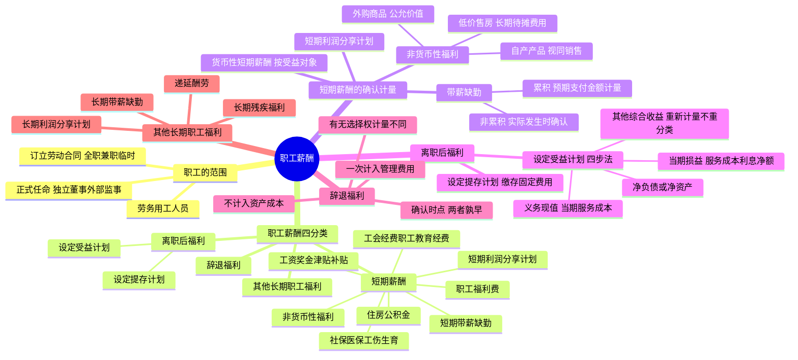

## 📍 章节定位

| 项目 | 信息 |
|------|------|
| **所属科目** | 📒 会计 |
| **难度等级** | ⭐⭐ |
| **历年分值** | 2-3分 |
| **建议学时** | 4-5h |

## 📝 考情分析

本章是会计科目的基础章节，历年分值约 2-3 分，以客观题为主，主观题常结合所得税、会计政策变更、差错更正等在综合题中考查。命题热点集中在：职工薪酬的四分类（短期薪酬、离职后福利、辞退福利、其他长期职工福利）、累积带薪缺勤与非累积带薪缺勤的区分及会计处理、非货币性福利的计量（自产产品按公允价值视同销售、外购商品按公允价值进项税额转出、低价出售住房的长期待摊费用处理）、设定提存计划与设定受益计划的区分、辞退福利的确认时点（两者孰早）和一次计入管理费用的原则。

考生需重点掌握：辞退福利一律计入当期损益（管理费用），不计入资产成本；设定受益计划的四个核算步骤（确定义务现值和当期服务成本→确定净负债或净资产→确定计入当期损益的金额→确定计入其他综合收益的金额），其中重新计量设定受益计划净负债或净资产产生的变动计入其他综合收益，且后续期间不得重分类计入损益；以自产产品发放非货币性福利应当视同销售确认收入并结转成本。

## 🧠 知识框架



## 📖 核心精讲

### 一、职工和职工薪酬的范围及分类

#### （一）职工的概念

**职工**，是指与企业订立劳动合同的所有人员，含全职、兼职和临时职工，也包括虽未与企业订立劳动合同但由企业正式任命的人员。具体包括：

1. 与企业订立劳动合同的所有人员（含固定期限、无固定期限和以完成一定工作为期限的劳动合同）；
2. 未与企业订立劳动合同但由企业正式任命的人员（如独立董事、外部监事等）；
3. 在企业的计划和控制下，虽未订立劳动合同或未正式任命，但向企业提供服务与职工类似的人员（如通过劳务中介公司提供服务的劳务用工人员）。

#### （二）职工薪酬的概念及分类

**职工薪酬**，是指企业为获得职工提供的服务或终止劳动合同关系而给予的各种形式的报酬或补偿。企业提供给职工配偶、子女、受赡养人、已故员工遗属及其他受益人等的福利，也属于职工薪酬。职工薪酬主要包括四类：

| 类别 | 定义 | 关键特征 |
|------|------|---------|
| **短期薪酬** | 企业在职工提供相关服务的年度报告期间结束后 12 个月内需要全部予以支付的职工薪酬（辞退福利除外） | 12 个月内支付 |
| **离职后福利** | 企业为获得职工提供的服务而在职工退休或与企业解除劳动关系后，提供的各种形式的报酬和福利 | 退休或离职后支付 |
| **辞退福利** | 企业在职工劳动合同到期之前解除与职工的劳动合同关系，或者为鼓励职工自愿接受裁减而给予职工的补偿 | 解除劳动关系 |
| **其他长期职工福利** | 除短期薪酬、离职后福利、辞退福利之外所有的职工薪酬 | 12 个月后支付 |

**短期薪酬**主要包括：（1）职工工资、奖金、津贴和补贴；（2）职工福利费；（3）医疗保险费、工伤保险费和生育保险费等社会保险费；（4）住房公积金；（5）工会经费和职工教育经费；（6）短期带薪缺勤；（7）短期利润分享计划；（8）非货币性福利；（9）其他短期薪酬。

**注意**：长期奖金计划、长期利润分享计划属于其他长期职工福利，不属于短期薪酬。

### 二、短期薪酬的确认与计量

企业应当在职工为其提供服务的会计期间，将实际发生的短期薪酬确认为负债，并计入当期损益，其他会计准则要求或允许计入资产成本的除外。

#### （一）货币性短期薪酬

企业应当根据职工提供服务情况和工资标准计算确定计入职工薪酬的金额，**按照受益对象**计入当期损益或相关资产成本，借记"生产成本""制造费用""管理费用"等科目，贷记"应付职工薪酬"科目。

- 职工福利费：应当在实际发生时根据实际发生额计入当期损益或相关资产成本。
- 医疗保险费、工伤保险费、生育保险费和住房公积金：按国务院、所在地政府或企业年金计划规定的标准计量。
- 工会经费和职工教育经费：按国家规定的计提标准计量。

#### （二）带薪缺勤

带薪缺勤根据其性质及职工享有的权利，分为**累积带薪缺勤**和**非累积带薪缺勤**。

| 类型 | 定义 | 会计处理 |
|------|------|---------|
| **累积带薪缺勤** | 带薪权利可以结转下期，本期尚未用完的带薪缺勤权利可以在未来期间使用 | 在职工提供服务从而增加了其未来享有的带薪缺勤权利时，确认相关职工薪酬，以**累积未行使权利而增加的预期支付金额**计量 |
| **非累积带薪缺勤** | 带薪权利不能结转下期，本期尚未用完的权利将予以取消，职工离开企业时也无权获得现金支付 | 在职工**实际发生缺勤**的会计期间确认，视同职工出勤确认相关资产成本或当期费用，通常已包含在每期发放的工资中，不必额外处理 |

**累积带薪缺勤的预期支付金额**：企业应当根据资产负债表日因累积未使用权利而导致的预期支付的追加金额计量。若职工在离开企业时能获得现金支付的，应确认全部累积未使用权利的金额。

#### （三）短期利润分享计划

利润分享计划**同时满足**下列条件的，企业应当确认相关的应付职工薪酬，并计入当期损益或相关资产成本：

1. 企业因过去事项导致现在具有支付职工薪酬的法定义务或推定义务；
2. 因利润分享计划所产生的应付职工薪酬义务能够可靠估计（三种情形：①财务报告批准报出前已确定应支付金额；②正式条款中包括确定薪酬金额的方式；③过去的惯例提供了明显证据）。

职工只有在企业工作一段特定期间才能分享利润的，企业在计量时应反映职工因离职而未得到利润分享支付的可能性。

**注意**：如果在职工提供相关服务的年度报告期间结束后 12 个月内不需要全部支付的，适用其他长期职工福利的有关规定。

#### （四）非货币性福利

企业向职工提供非货币性福利的，应当按照**公允价值**计量；公允价值不能可靠取得的，可以采用成本计量。

**1. 以自产产品或外购商品发放给职工作为福利**

| 情形 | 会计处理 |
|------|---------|
| **自产产品** | 按产品的**公允价值**和相关税费计量应计入成本费用的薪酬金额，相关收入的确认、销售成本的结转和相关税费的处理，与正常商品销售相同（**视同销售**） |
| **外购商品** | 按商品的**公允价值**和相关税费计入当期损益或相关资产成本（增值税进项税额转入成本费用） |

**关键**：账务处理时，应先通过"应付职工薪酬"科目归集当期应计入成本费用的非货币性薪酬金额。

**2. 以低于成本的价格向职工出售住房或提供服务**

企业出售住房等资产时，将公允价值与内部售价之间的差额（即企业补贴金额）分别处理：

- **规定了服务年限且提前离开应退回部分差额**：作为**长期待摊费用**处理，在合同规定的服务年限内平均摊销，按受益对象计入相关资产成本或当期损益。
- **未规定服务年限**：直接计入出售住房当期相关资产成本或当期损益。

### 三、离职后福利的确认与计量

离职后福利，是指企业为获得职工提供的服务而在职工退休或与企业解除劳动关系后，提供的各种形式的报酬和福利（短期薪酬和辞退福利除外）。离职后福利计划分为**设定提存计划**和**设定受益计划**。

#### （一）设定提存计划

**设定提存计划**，是指向独立的基金缴存固定费用后，企业不再承担进一步支付义务的离职后福利计划。

**特征**：企业在每一期间的义务取决于该期间将要提存的金额，计量义务或费用时不需要精算假设，通常也不存在精算利得或损失。**精算风险和投资风险实质上由职工承担。**

**会计处理**：企业在资产负债表日确认为换取职工在会计期间内提供服务而应付给设定提存计划的提存金，确认职工薪酬负债，并作为一项费用计入当期损益或相关资产成本。

**折现**：企业预期不会在职工提供相关服务的年度报告期结束后 12 个月内支付全部应缴存金额的，应当参照资产负债表日与义务期限和币种相匹配的国债或活跃市场上的高质量公司债券的市场收益率确定折现率，将全部应缴存金额以折现后的金额计量。

#### （二）设定受益计划

**设定受益计划**，是指除设定提存计划以外的离职后福利计划。**精算风险和投资风险实质上由企业承担。**

当企业负有下列义务之一时，该计划属于设定受益计划：（1）计划福利公式不仅与提存金金额相关，且要求企业在资产不足以满足福利公式时提供进一步提存金；（2）通过计划间接或直接地对提存金的特定回报作出担保。

**设定受益计划的核算涉及四个步骤**：

**步骤一：确定设定受益义务现值和当期服务成本**

- 根据预期累计福利单位法，采用无偏且相互一致的精算假设对有关人口统计变量（职工离职率和死亡率）和财务变量（未来薪金和医疗费用增加）作出估计，计量义务并确定归属期间；
- 根据资产负债表日与义务期限和币种相匹配的国债或活跃市场上高质量公司债券的市场收益率确定折现率，将义务予以折现。

**步骤二：确定设定受益计划净负债或净资产**

- 设定受益计划义务现值减去计划资产公允价值，形成赤字（净负债）或盈余（净资产）。
- 存在盈余的，以**设定受益计划的盈余和资产上限两者的孰低者**计量净资产。资产上限是指企业可从设定受益计划退款或减少未来缴存资金而获得的经济利益的现值。

**步骤三：确定应当计入当期损益的金额**

报告期末，在损益中确认的设定受益计划产生的职工薪酬成本包括：**服务成本**和**设定受益计划净负债或净资产的利息净额**。服务成本包括当期服务成本、过去服务成本和结算利得或损失。

**步骤四：确定应当计入其他综合收益的金额**

设定受益计划净负债或净资产的**重新计量**应当计入其他综合收益，且在后续期间**不应重分类计入损益**。在原设定受益计划终止时，企业应当在权益范围内将原计入其他综合收益的部分全部结转至未分配利润。

### 四、辞退福利的确认与计量

**辞退福利**，是指企业在职工劳动合同到期之前解除与职工的劳动关系，或者为鼓励职工自愿接受裁减而给予职工的补偿。辞退福利被视为职工福利的单独类别，是因为导致义务产生的事项是终止雇佣而不是职工的服务。

**注意区分**：辞退福利与正常退休养老金应分开。引发辞退福利补偿的事项是辞退；引发养老金补偿的事项是职工在职时提供的服务，企业应在职工提供服务的会计期间进行养老金的确认和计量。职工内退计划在正式退休前比照辞退福利处理，正式退休后按离职后福利处理。

#### （一）确认时点

企业向职工提供辞退福利的，应当在以下**两者孰早**确认辞退福利产生的职工薪酬负债，并计入当期损益：

1. 企业**不能单方面撤回**解除劳动关系计划或裁减建议所提供的辞退福利时；
2. 企业确认涉及支付辞退福利的**重组**相关的成本或费用时（需有详细正式的重组计划且已对外公告）。

#### （二）确认原则

由于被辞退的职工不再为企业带来未来经济利益，因此对于所有辞退福利，均应当于辞退计划满足负债确认条件的当期**一次计入费用（管理费用），不计入资产成本**。

对于分期或分阶段实施的解除劳动关系计划，应将整个计划看作由各单项计划组成，在每期或每阶段计划符合预计负债确认条件时，将该期计划中由辞退福利产生的预计负债予以确认。

#### （三）计量

辞退福利的计量因辞退计划中职工有无选择权而有所不同：

| 情形 | 计量方法 |
|------|---------|
| 职工**没有选择权**的辞退计划 | 根据计划条款规定拟解除劳动关系的职工数量、每一职位的辞退补偿等计提 |
| **自愿接受裁减**的建议 | 根据《CAS 13——或有事项》规定，预计将会接受裁减建议的职工数量，根据预计的职工数量和每一职位的辞退补偿等计提 |
| 12 个月内完全支付 | 适用短期薪酬的有关规定 |
| 12 个月内不能完全支付 | 适用其他长期职工福利的有关规定，选择恰当的折现率以折现后的金额计量 |

### 五、其他长期职工福利的确认与计量

**其他长期职工福利**，是指除短期薪酬、离职后福利和辞退福利以外的其他所有职工福利，包括长期带薪缺勤、长期残疾福利、长期利润分享计划和长期奖金计划，以及递延酬劳等（假设预计在职工提供相关服务的年度报告期末以后 12 个月内不会全部结算）。

**会计处理**：

- 符合设定提存计划条件的，按设定提存计划有关规定处理；
- 符合设定受益计划条件的，按设定受益计划有关规定确认和计量其他长期职工福利净负债或净资产。

报告期末，企业应当将其他长期职工福利产生的职工薪酬成本确认为下列组成部分：（1）服务成本；（2）其他长期职工福利净负债或净资产的利息净额；（3）重新计量其他长期职工福利净负债或净资产所产生的变动。

**简化处理**：上述项目的总净额应计入当期损益或相关资产成本（与设定受益计划不同，其他长期职工福利的重新计量变动也计入当期损益，而非其他综合收益）。

**长期残疾福利**：水平取决于职工提供服务期间长短的，在职工提供服务期间确认义务；与提供服务期间长短无关的，在导致长期残疾的事件发生当期确认义务。

## 💡 典型例题

**【例题 1】（基础题，单选题）**

下列关于职工薪酬的表述中，正确的是（　　）。
A. 企业提供给职工配偶的福利不属于职工薪酬
B. 长期奖金计划属于短期薪酬
C. 企业以自产产品发放给职工作为福利的，应当按照该产品的公允价值和相关税费计量应计入成本费用的职工薪酬金额
D. 辞退福利应当按照受益对象计入相关资产成本或当期损益

**答案**：C

**解析**：A 错误，企业提供给职工配偶、子女、受赡养人、已故员工遗属及其他受益人等的福利也属于职工薪酬；B 错误，长期奖金计划属于其他长期职工福利，不属于短期薪酬；C 正确，以自产产品作为非货币性福利的，按产品的公允价值和相关税费计量，视同销售确认收入并结转成本；D 错误，辞退福利一律计入当期损益（管理费用），不计入资产成本。

**【例题 2】（进阶题，单选题）**

下列关于带薪缺勤的表述中，正确的是（　　）。
A. 企业应当在职工实际发生缺勤时确认累积带薪缺勤相关的职工薪酬
B. 累积带薪缺勤应以累积未行使权利而增加的预期支付金额计量
C. 非累积带薪缺勤应当在职工提供服务从而增加未来享有权利时确认
D. 职工在离开企业时能获得现金支付的累积带薪缺勤，企业只需确认当期预期支付金额

**答案**：B

**解析**：A 错误，累积带薪缺勤应在职工提供服务从而增加了未来享有的带薪缺勤权利时确认，而非实际发生缺勤时；B 正确，累积带薪缺勤以累积未行使权利而增加的预期支付金额计量；C 错误，非累积带薪缺勤应在职工实际发生缺勤的会计期间确认，视同出勤处理；D 错误，职工在离开企业时能获得现金支付的，企业应确认必须支付的、职工全部累积未使用权利的金额。

**【例题 3】（计算题，货币性短期薪酬）**

2×22 年 7 月，甲公司当月应发职工工资 1560 万元，其中，生产部门直接生产人员工资 1000 万元，生产部门管理人员工资 200 万元，管理部门人员工资 360 万元。根据甲公司所在地政府规定，甲公司每月分别按照应发职工工资总额的 10% 和 8% 计提并缴存医疗保险费和住房公积金。同时，甲公司每月分别按照职工工资总额的 2% 和 1.5% 计提工会经费和职工教育经费。假定不考虑所得税影响。

要求：计算各项计入成本费用的职工薪酬金额，并编制相关会计分录。

**答案**：

- 应计入生产成本的职工薪酬金额 = 1000 + 1000 × (10% + 8% + 2% + 1.5%) = 1215（万元）
- 应计入制造费用的职工薪酬金额 = 200 + 200 × (10% + 8% + 2% + 1.5%) = 243（万元）
- 应计入管理费用的职工薪酬金额 = 360 + 360 × (10% + 8% + 2% + 1.5%) = 437.4（万元）

```
借：生产成本                       12 150 000
　　制造费用                        2 430 000
　　管理费用                        4 374 000
　　贷：应付职工薪酬——工资         15 600 000
　　　　应付职工薪酬——医疗保险费    1 560 000
　　　　应付职工薪酬——住房公积金    1 248 000
　　　　应付职工薪酬——工会经费        312 000
　　　　应付职工薪酬——职工教育经费    234 000
```

**解析**：货币性短期薪酬应按照受益对象计入相关资产成本或当期损益，各项社保、住房公积金、工会经费和职工教育经费按工资总额的规定比例计提。

**【例题 4】（计算题，累积带薪缺勤）**

乙公司共有 1000 名职工，从 2×22 年 1 月 1 日起实行累积带薪缺勤制度。每名职工每年可享受 5 个工作日带薪年休假，未使用的年休假只能向后结转一个日历年度，超过 1 年未使用的权利作废，不能在离开公司时获得现金支付。2×22 年 12 月 31 日，每名职工当年平均未使用带薪年休假为 2 天。根据过去经验并预期该经验继续适用，乙公司预计 2×23 年有 950 名职工将享受不超过 5 天的带薪年休假，剩余 50 名职工每人将平均享受 6.5 天年休假（全部为总部各部门经理），平均每名职工每个工作日工资为 300 元。

要求：计算 2×22 年 12 月 31 日应确认的累积带薪缺勤负债，并编制会计分录。

**答案**：

- 预期将使用的额外年休假天数 = 50 × (6.5 - 5) = 75（天）
- 应确认的累积带薪缺勤负债 = 75 × 300 = 22500（元）

```
借：管理费用                           22 500
　　贷：应付职工薪酬——累积带薪缺勤      22 500
```

**解析**：累积带薪缺勤应以累积未行使权利而增加的预期支付金额计量。本题中，50 名职工预计将在 2×23 年使用超过当年 5 天的年休假，超出部分（每人 1.5 天）即为 2×22 年累积结转的未使用权利，据此确认预期支付的追加金额。

**【例题 5】（综合题，辞退福利）**

甲公司 2×22 年 9 月制定一项辞退计划，以职工自愿方式辞退柜式空调生产车间的职工。辞退计划已于 2×22 年 12 月 10 日经董事会正式批准。2×22 年 12 月 31 日，甲公司预计愿意接受辞退职工的最可能数量为 123 名，预计补偿总额为 1400 万元。

要求：编制甲公司 2×22 年确认辞退福利的会计分录。

**答案**：

```
借：管理费用                        14 000 000
　　贷：应付职工薪酬——辞退福利     14 000 000
```

**解析**：辞退福利应当在企业不能单方面撤回辞退计划或确认重组相关成本费用时（两者孰早）确认。由于被辞退职工不再为企业带来未来经济利益，辞退福利应一次计入当期管理费用，不计入资产成本。自愿接受裁减的，根据《CAS 13——或有事项》预计接受裁减的职工数量计提。

## 🎯 记忆口诀

- **职工薪酬四分类**："短期、离职后、辞退、其他长期"——按支付时间和原因分为四类，12 个月内支付的属短期薪酬，退休后支付的属离职后福利，解除劳动关系的属辞退福利，其余 12 个月后的属其他长期职工福利。
- **带薪缺勤两类**："累积预预期，非累积实际发生"——累积带薪缺勤在增加未来权利时按预期支付追加金额确认；非累积带薪缺勤在实际发生缺勤时确认。
- **非货币性福利**："自产视同销售，外购进项转出，低价售房长期待摊"——自产产品按公允价值视同销售确认收入结转成本；外购商品按公允价值将进项税额计入成本费用；低价售房且规定服务年限的差额作长期待摊费用摊销。
- **设定提存 vs 设定受益**："提存缴固定，风险职工担；受益约定福利，风险企业担"——设定提存计划企业缴存固定费用后不再承担义务；设定受益计划精算风险和投资风险由企业承担。
- **设定受益四步法**："一现值二净资产，三损益四其他综合收益"——确定义务现值和当期服务成本→确定净负债或净资产→确定计入当期损益的金额（服务成本+利息净额）→确定计入其他综合收益的金额（重新计量，不重分类）。
- **辞退福利**："两者孰早确认，一次计入管理费用，不计资产成本"——不能单方面撤回或确认重组成本孰早确认；辞退福利一次计入管理费用，不按受益对象分摊。
- **其他长期职工福利**："简化处理总净额计入损益"——与设定受益计划不同，重新计量变动也计入当期损益而非其他综合收益。

## ✅ 同步练习

1. （基础题）职工薪酬的四分类及各自的范围，区分短期薪酬与离职后福利、辞退福利的界限。提示：参见《必刷 550 题》第八章基础题。
2. （进阶题）累积带薪缺勤与非累积带薪缺勤的会计处理差异，注意累积带薪缺勤以预期支付追加金额计量。提示：参见《必刷 550 题》第八章进阶题。
3. （易错题）非货币性福利的会计处理，区分自产产品（视同销售）、外购商品（进项税额转出）、低价售房（长期待摊费用）三种情形。提示：参见《必刷 550 题》第八章易错题。
4. （真题改编）设定提存计划与设定受益计划的区分，掌握设定受益计划四步法及重新计量计入其他综合收益不重分类的原则。提示：参见《必刷 550 题》第八章真题。
5. 综合复习辞退福利的确认时点（两者孰早）和计量原则（一次计入管理费用，不计入资产成本），注意自愿裁减情形下按或有事项预计职工数量。
