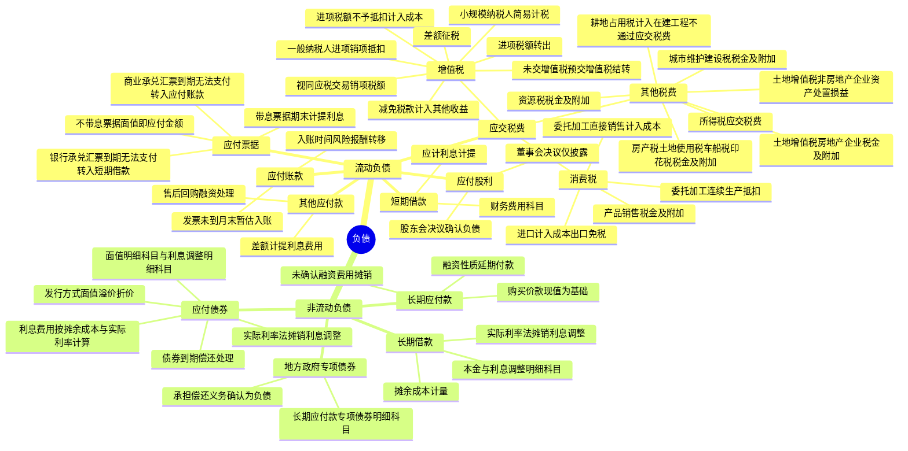

## 1. 章节定位

| 项目 | 信息 |
|------|------|
| 所属科目 | 会计 |
| 难度等级 | 3 |
| 历年分值 | 4-6 分 |
| 建议学时 | 6-8 小时 |
| 知识关联章节 | 第3章 固定资产（进项税额处理）、第5章 投资性房地产（应交税费）、第6章 长期股权投资（应交税费）、第11章 借款费用（借款费用资本化）、第13章 金融工具（金融负债分类）、第17章 收入（合同负债与预收账款、售后回购）、第19章 所得税（应交所得税） |

## 2. 考情分析

本章是会计科目的基础章节，内容覆盖面广但难度适中。历年考试中客观题出题频率较高，主观题常以增值税处理、应付债券的实际利率法摊销为核心，并广泛与固定资产、收入、所得税等章节联动考查。

**命题规律**：客观题集中在各项流动负债的核算内容、应交税费各明细科目的使用、应付债券的发行价格与利息调整；主观题集中在增值税的购销业务处理、进项税额转出、委托加工应税消费品的消费税处理、公司债券的实际利率法摊销。

**高频考点分布**：

1. **短期借款**：利息的处理（计提与支付）。
2. **应付票据**：带息与不带息票据的区分处理；商业承兑汇票与银行承兑汇票到期无法支付的不同处理（转入应付账款 vs 转入短期借款）。
3. **应付账款**：入账时间的确定（风险报酬转移 vs 验收入库）；发票账单未到时的月末暂估入账。
4. **应交增值税**：一般纳税人购销业务处理（进项税额、销项税额）；小规模纳税人简易计税；视同应税交易的销项税额处理；进项税额不予抵扣的情形及进项税额转出；差额征税的处理；未交增值税与预交增值税的结转；减免增值税计入其他收益。
5. **应交消费税**：产品销售（税金及附加）；委托加工应税消费品（连续生产抵扣 vs 直接销售计入成本）；进出口产品的处理。
6. **其他应交税费**：资源税、土地增值税（房地产企业 vs 非房地产企业）、房产税/城镇土地使用税/车船税/印花税（税金及附加）、城市维护建设税、所得税（应交税费）、耕地占用税（计入在建工程，不通过应交税费）。
7. **应付股利**：董事会决议 vs 股东会决议的区别（披露 vs 确认负债）。
8. **其他应付款**：售后回购的融资处理（差额按期计提利息费用）。
9. **长期借款**：利息调整的摊销；实际利率法的运用。
10. **应付债券**：面值/溢价/折价发行；利息调整在实际利率法下的摊销；债券偿还的处理。
11. **长期应付款**：具有融资性质的延期付款购买资产（现值为基础，未确认融资费用摊销）。
12. **地方政府专项债券**：承担偿还义务的专项债券资金处理。

**联动考查方式**：
- 与固定资产结合：购建固定资产涉及的进项税额抵扣、不动产分期抵扣；
- 与收入结合：合同负债（预收账款）的增值税待转销项税额处理；
- 与所得税结合：应交所得税的计算与列报；
- 与借款费用结合：长期借款和应付债券的利息资本化；
- 与金融工具结合：应付债券作为金融负债的分类与计量。

**备考建议**：
- 牢记增值税一般纳税人的科目体系（应交增值税、未交增值税、预交增值税、待抵扣进项税额等明细科目）；
- 区分进项税额不予抵扣（直接计入成本）与进项税额转出（原已抵扣后改变用途）的不同处理；
- 掌握委托加工应税消费品消费税的两种处理（连续生产抵扣、直接销售计入成本）；
- 熟练运用实际利率法对应付债券利息调整进行摊销；
- 牢记耕地占用税不通过"应交税费"科目核算。

## 3. 知识框架



## 4. 核心精讲

### 4.1 流动负债概述

流动负债是指预计在一个正常营业周期中清偿，或者主要为交易目的而持有，或者自资产负债表日起一年内到期应予清偿，或者企业无权自主地将清偿推迟至资产负债表日后一年以上的负债。本章涉及的流动负债主要包括短期借款、应付票据、应付账款、应交税费、应付股利、其他应付款等。

### 4.2 短期借款与应付票据

#### 4.2.1 短期借款

**短期借款**是指企业向银行或其他金融机构等借入的期限在一年以下（含一年）的各种借款。

每个资产负债表日，企业应计算确定短期借款的应计利息，按照应计的金额，借记"财务费用""利息支出（金融企业）"等科目，贷记"银行存款""应付利息"等科目。

#### 4.2.2 应付票据

**应付票据**是由出票人出票，付款人在指定日期无条件支付特定的金额给收款人或者持票人的票据。应付票据按是否带息分为带息应付票据和不带息应付票据两种。

| 类型 | 处理方式 |
|------|---------|
| 带息应付票据 | 期末对尚未支付的应付票据计提利息，计入当期财务费用；票据到期支付票款时，尚未计提的利息部分直接计入当期财务费用 |
| 不带息应付票据 | 其面值就是票据到期时的应付金额 |

**到期无法支付的处理**：

| 票据类型 | 到期无法支付的处理 |
|---------|-------------------|
| 商业承兑汇票 | 将"应付票据"账面价值转入"应付账款"科目；如重新签发新票据清偿，再从"应付账款"转回"应付票据" |
| 银行承兑汇票 | 承兑银行凭票无条件付款，对出票人尚未支付的汇票金额转作逾期贷款；企业借记"应付票据"，贷记"短期借款" |

### 4.3 应付账款

**应付账款**指因购买材料、商品或接受服务供应等而发生的债务，是买卖双方由于取得物资或服务与支付货款在时间上不一致而产生的负债。

**入账时间的确定**：一般应以与所购买物资所有权有关的风险和报酬已经转移或劳务已经接受为标志。实际工作中区分两种情况处理：

1. **物资和发票账单同时到达**：应付账款一般待物资验收入库后，才按发票账单登记入账。会计期末仍未完成验收的，应先按合理估计金额将物资和应付债务入账，事后发现问题再行更正。
2. **物资和发票账单未同时到达**：货物已到但发票账单要间隔较长时间才能到达时，此项负债已经成立，应作为一项负债反映。在月份终了将所购物资和应付债务估计入账，待下月初再用红字予以冲回。

### 4.4 应交税费

企业在一定时期内取得的营业收入和实现的利润或发生特定经营行为，要按照规定向国家交纳各种税金。这些应交的税金按照权责发生制原则确认，在尚未交纳之前形成企业的一项负债。

#### 4.4.1 应交增值税

增值税是以销售商品、服务、无形资产、不动产（简称应税交易）在流转过程中产生的增值额作为计税依据而征收的一种流转税。一般纳税人购入商品支付的增值税（进项税额），可以从销售商品按规定收取的增值税（销项税额）中抵扣。

**科目设置**：一般纳税人应当在"应交税费"科目下设置"应交增值税""未交增值税""预交增值税""待抵扣进项税额"等明细科目。"应交税费——应交增值税"明细科目下设置"进项税额""销项税额抵减""已交税金""转出未交增值税""减免税款""销项税额""出口退税""进项税额转出""转出多交增值税"等专栏。

**（1）一般纳税人购销业务的会计处理**

在购进阶段，实行价与税的分离：属于价款部分计入购入商品的成本；属于增值税税额部分按规定计入进项税额。在销售阶段，销售价格中不再含税，如定价时含税应还原为不含税价格作为销售收入，向购买方收取的增值税作为销项税额。

**（2）小规模纳税人的会计处理**

小规模纳税人支付的增值税税额均不计入进项税额，不得由销项税额抵扣，应计入相关成本费用。销售商品时按照销售额和增值税征收率计算增值税税额，不得抵扣进项税额。

销售额 = 含税销售额 ÷ (1 + 征收率)

**（3）视同应税交易的会计处理**

单位和个体工商户将自产或委托加工的货物用于集体福利或个人消费、无偿转让货物、无形资产、不动产或金融商品，视同应税交易，按规定缴纳增值税。无论会计上如何处理，只要税法规定需要缴纳增值税的，应当计算缴纳增值税销项税额。

**（4）进项税额不予抵扣的情况及抵扣情况发生变化的会计处理**

| 情形 | 处理 |
|------|------|
| 购进时即不予抵扣（简易计税项目、免征增值税项目、非正常损失、集体福利/个人消费、餐饮服务/居民日常服务/娱乐服务等） | 计入相关成本费用，不通过"应交税费——应交增值税（进项税额）"科目核算 |
| 原已计入进项税额后改变用途或发生非正常损失 | 进项税额转出，借记"待处理财产损溢""应付职工薪酬"等科目，贷记"应交税费——应交增值税（进项税额转出）"科目 |

**（5）差额征税的会计处理**

采用差额征税方式的企业，以取得的全部价款和价外费用扣除支付给其他方款项后的余额为销售额。典型如客运场站、旅游企业等。

**（6）转出未交增值税和转出多交增值税**

月份终了，企业计算出当月应交未交的增值税，借记"应交税费——应交增值税（转出未交增值税）"科目，贷记"应交税费——未交增值税"科目；当月多交的增值税，借记"应交税费——未交增值税"科目，贷记"应交税费——应交增值税（转出多交增值税）"科目。

**（7）交纳增值税的会计处理**

| 交纳对象 | 科目处理 |
|---------|---------|
| 当月交纳当月的增值税 | 借记"应交税费——应交增值税（已交税金）"，贷记"银行存款" |
| 当月交纳以前各期未交的增值税 | 借记"应交税费——未交增值税"，贷记"银行存款" |
| 预缴增值税 | 借记"应交税费——预交增值税"，贷记"银行存款"；月末将"预交增值税"余额转入"未交增值税" |

**（8）减免增值税的账务处理**

对于当期直接减免的增值税，借记"应交税费——应交增值税（减免税款）"科目，贷记"其他收益"科目。当期按规定即征即退的增值税，也记入"其他收益"科目。

#### 4.4.2 应交消费税

消费税采取从价定率和从量定额两种征收方法。实行从价定率办法的应纳税额税基为销售额（不含增值税）；实行从量定额办法的应纳税额销售数量为应税消费品的数量。

企业按规定应交的消费税，在"应交税费"科目下设置"应交消费税"明细科目核算。

**（1）产品销售的会计处理**

| 销售方式 | 消费税处理 |
|---------|-----------|
| 直接对外销售 | 借记"税金及附加"，贷记"应交税费——应交消费税" |
| 用于在建工程、非生产机构等 | 应交消费税计入有关成本（如在建工程成本） |

**（2）委托加工应税消费品的会计处理**

委托加工的应税消费品，由受托方在向委托方交货时代收代缴税款（受托加工或翻新改制金银首饰除外）。委托方收回后：

| 用途 | 消费税处理 |
|------|-----------|
| 用于连续生产应税消费品 | 所纳税款准予抵扣，借记"应交税费——应交消费税"，贷记"应付账款"等；待生产的产品销售时再交纳消费税 |
| 直接用于销售 | 代收代缴的消费税计入委托加工应税消费品成本，借记"委托加工物资"等，贷记"应付账款"等；销售时不再交纳消费税 |

**（3）进出口产品的会计处理**

需要交纳消费税的进口消费品，其交纳的消费税应计入该进口消费品的成本。免征消费税的出口应税消费品，按规定直接予以免税的可以不计算应交消费税。

#### 4.4.3 其他应交税费

| 税种 | 科目处理 |
|------|---------|
| 资源税 | 销售应税产品：借记"税金及附加"，贷记"应交税费——应交资源税" |
| 土地增值税 | 房地产企业销售存货/投资性房地产：借记"税金及附加"；非房地产企业转让自用房地产：借记"资产处置损益" |
| 房产税、城镇土地使用税、车船税 | 借记"税金及附加"，贷记"应交税费" |
| 印花税 | 借记"税金及附加"，贷记"应交税费"；购买的印花税票余额列报于"其他流动资产" |
| 城市维护建设税 | 借记"税金及附加"等，贷记"应交税费——应交城市维护建设税" |
| 所得税 | 借记"所得税费用"等，贷记"应交税费——应交所得税" |
| 耕地占用税 | **不通过"应交税费"科目核算**，借记"在建工程"，贷记"银行存款" |

### 4.5 应付股利与其他应付款

#### 4.5.1 应付股利

**应付股利**是指企业经股东会或类似机构审议批准分配的现金股利或利润。

| 决议层级 | 会计处理 |
|---------|---------|
| 股东会或类似机构审议批准 | 确认负债，借记"利润分配"，贷记"应付股利" |
| 董事会或类似机构通过（拟分配） | **不确认负债**，但应在附注中披露 |

#### 4.5.2 其他应付款

**其他应付款**是指企业除应付票据、应付账款、预收账款、应付职工薪酬、应付利息、应付股利、应交税费、长期应付款等以外的其他各项应付、暂收的款项。

**售后回购的处理**：企业采用售后回购方式融入资金的，应按实际收到的金额，借记"银行存款"，贷记"其他应付款""应交税费"等。约定的回购价格与原销售价格之间的差额，应在售后回购期间内按期计提利息费用，借记"财务费用"，贷记"其他应付款"。按照合同约定购回该项商品时，借记"其他应付款""应交税费"，贷记"银行存款"。

### 4.6 非流动负债——长期借款

**长期借款**是指企业从银行或其他金融机构借入的期限在一年以上（不含一年）的借款。

**科目设置**：在"长期借款"科目下设置"本金""利息调整"等明细科目。

**账务处理**：

1. **借入时**：按实际收到的款项，借记"银行存款"，贷记"长期借款——本金"；按借贷双方之间的差额，借记"长期借款——利息调整"。
2. **资产负债表日**：按摊余成本和实际利率计算确定的利息费用，借记"在建工程""财务费用""制造费用"等；按借款本金和合同利率计算确定的应付未付利息，贷记"长期借款——应计利息"或"应付利息"；按其差额，贷记或借记"长期借款——利息调整"。
3. **到期支付本息**：借记"长期借款——本金""长期借款——应计利息""应付利息"等，贷记"银行存款"。存在利息调整余额的，借记或贷记"在建工程""制造费用""财务费用"等，贷记或借记"长期借款——利息调整"。

### 4.7 非流动负债——应付债券

#### 4.7.1 公司债券的发行

企业发行的超过一年期以上的债券构成了企业的长期负债。公司债券的发行方式有三种：

| 发行方式 | 条件 | 实质 |
|---------|------|------|
| 面值发行 | 票面利率 = 同期银行存款利率 | — |
| 溢价发行 | 票面利率 > 同期银行存款利率 | 企业以后各期多付利息而事先得到的补偿 |
| 折价发行 | 票面利率 < 同期银行存款利率 | 企业以后各期少付利息而预先给投资者的补偿 |

**科目处理**：无论面值、溢价还是折价发行，均按债券面值记入"应付债券"科目的"面值"明细科目，实际收到的款项与面值的差额记入"利息调整"明细科目。

发行时：借记"银行存款"等，贷记"应付债券——面值"；差额贷记或借记"应付债券——利息调整"。

#### 4.7.2 利息调整的摊销

利息调整应在债券存续期间内采用**实际利率法**进行摊销。实际利率法是指按照应付债券的实际利率计算其摊余成本及各期利息费用的方法。

**资产负债表日的处理**：

- 按应付债券的摊余成本和实际利率计算确定的债券利息费用，借记"在建工程""制造费用""财务费用"等
- 按票面利率计算确定的应付未付利息，贷记"应付债券——应计利息"或"应付利息"
- 按其差额，借记或贷记"应付债券——利息调整"

**摊余成本的递推公式**：

期末摊余成本 = 期初摊余成本 + 实际利息费用 - 票面利息支付

其中：实际利息费用 = 期初摊余成本 × 实际利率；票面利息支付 = 债券面值 × 票面利率。

#### 4.7.3 债券的偿还

企业发行的长期债券到期，支付债券本息时，借记"应付债券——面值""应付债券——应计利息""应付利息"等，贷记"银行存款"等。同时存在利息调整余额的，借记或贷记"应付债券——利息调整"，贷记或借记"在建工程""制造费用""财务费用"等。

### 4.8 非流动负债——长期应付款

**长期应付款**是指企业除长期借款和应付债券以外的其他各种长期应付款项，如以分期付款方式购入固定资产发生的应付款项等。

**具有融资性质的延期付款购买资产**：如果延期支付的购买价款超过正常信用条件，实质上具有融资性质的，所购资产的成本应当以延期支付购买价款的**现值**为基础确定。实际支付的价款与购买价款的现值之间的差额，应当在信用期间内采用实际利率法进行摊销，计入相关资产成本或当期损益。

**账务处理**：
- 按购买价款的现值，借记"固定资产""在建工程"等
- 按应支付的价款总额，贷记"长期应付款"
- 按其差额，借记"未确认融资费用"

各期摊销未确认融资费用时，借记"财务费用""在建工程"等，贷记"未确认融资费用"。

### 4.9 地方政府专项债券

企业类项目单位取得的地方政府专项债券资金，根据项目实施方案等约定需由本单位承担专项债券资金本息偿还义务的，应当按照金融工具确认和计量准则等规定将其确认为负债。

**科目设置**：在"长期应付款"科目下设置"专项债券"明细科目，核算该类专项债券资金的本金和利息，下设"本金""应计利息"等明细科目。

| 业务环节 | 账务处理 |
|---------|---------|
| 收到专项债券资金 | 借记"银行存款"等，贷记"长期应付款——专项债券——本金" |
| 计提专项债券资金利息 | 借记"在建工程""财务费用"等，贷记"长期应付款——专项债券——应计利息" |
| 偿还专项债券资金本息 | 借记"长期应付款——专项债券——本金/应计利息"等，贷记"银行存款"等 |

## 5. 典型例题

### 例题 1：增值税一般纳税人购销业务及进项税额转出

某工业企业为增值税一般纳税人，本期购入一批材料，增值税专用发票上注明的增值税税额为 15.6 万元，材料价款为 120 万元。材料已入库，货款已经支付（材料按实际成本核算）。材料入库后，该企业将该批材料全部用于发放职工福利。

**要求**：编制相关账务处理。

**解答**：

材料入库时：
```
借：原材料                            1 200 000
    应交税费——应交增值税（进项税额）   156 000
    贷：银行存款                        1 356 000
```

用于发放职工福利时（进项税额转出）：
```
借：应付职工薪酬                       1 356 000
    贷：应交税费——应交增值税（进项税额转出） 156 000
        原材料                           1 200 000
```

**解析**：购进的材料原用于生产，进项税额已抵扣。后改变用途用于职工福利，属于进项税额不予抵扣的情形，应将原已抵扣的进项税额转出，计入应付职工薪酬的成本。

### 例题 2：应付债券溢价发行及实际利率法摊销

2×21 年 12 月 31 日，甲公司经批准发行 5 年期一次还本、分期付息的公司债券 10 000 000 元，债券利息在每年 12 月 31 日支付，票面利率为年利率 6%。假定债券发行时的市场利率为 5%。

**要求**：计算债券发行价格并编制相关账务处理。

**解答**：

债券实际发行价格 = 10 000 000 × (P/F, 5%, 5) + 10 000 000 × 6% × (P/A, 5%, 5) = 10 432 700（元）

2×21 年 12 月 31 日发行债券时：
```
借：银行存款                     10 432 700
    贷：应付债券——面值            10 000 000
        应付债券——利息调整           432 700
```

2×22 年 12 月 31 日计算利息费用时：
- 实际利息费用 = 10 432 700 × 5% = 521 635（元）
- 票面利息 = 10 000 000 × 6% = 600 000（元）
- 利息调整摊销 = 600 000 - 521 635 = 78 365（元）
```
借：财务费用等                      521 635
    应付债券——利息调整                78 365
    贷：应付债券——应计利息            600 000
```

2×26 年 12 月 31 日归还债券本金及最后一期利息时（最后一期利息调整摊销额为 94 937.06 元，实际利息费用为 505 062.94 元）：
```
借：财务费用等                      505 062.94
    应付债券——面值               10 000 000
    应付债券——利息调整               94 937.06
    贷：银行存款                    10 600 000
```

**解析**：溢价发行时，实际利率（5%）低于票面利率（6%），每期实际利息费用小于票面利息，差额为利息调整的摊销额（贷方摊销，减少应付债券账面价值）。各期摊余成本逐期递减，直至到期时等于面值。

### 例题 3：委托加工应税消费品的消费税处理

某企业委托外单位加工材料（非金银首饰），原材料价款为 20 万元，加工费用为 5 万元，由受托方代收代缴的消费税为 0.5 万元（不考虑增值税），材料已经加工完毕验收入库，加工费用尚未支付。

**要求**：分别编制收回后用于连续生产应税消费品和直接用于销售的账务处理。

**解答**：

**情形一：收回后用于连续生产应税消费品**（消费税可抵扣）
```
借：委托加工物资    200 000
    贷：原材料        200 000

借：委托加工物资     50 000
    应交税费——应交消费税  5 000
    贷：应付账款         55 000

借：原材料         250 000
    贷：委托加工物资    250 000
```

**情形二：收回后直接用于销售**（消费税计入成本）
```
借：委托加工物资    200 000
    贷：原材料        200 000

借：委托加工物资     55 000
    贷：应付账款         55 000

借：原材料         255 000
    贷：委托加工物资    255 000
```

**解析**：委托加工应税消费品收回后用于连续生产应税消费品的，代收代缴的消费税准予抵扣，记入"应交税费——应交消费税"借方；直接用于销售的，消费税计入委托加工物资成本，销售时不再交纳消费税。

## 6. 记忆口诀

**负债章节记忆要点**：

一、增值税核心：进项销项互抵扣，视同销售要交税；改变用途要转出，简易征收不抵扣；未交预交分开算，减免退税入收益。

二、消费税两路径：产品销售税金附加，委托加工分两路；连续生产可抵扣，直接销售计成本。

三、其他税费归集：资源土地房产税，车船印花城建税；一律计入税金附加，唯有耕地入工程（不通过应交税费）。

四、应付债券三方式：面值溢价和折价，实际利率法摊销；摊余成本乘实率，票面利息减差额。

五、融资性质付款：买价现值作基础，差额记入未确认融资费用，信用期间内摊销。

六、应付股利区分：股东会批确认负债，董事会批仅披露。

七、售后回购融资：差额按期提利息，财务费用其他应付。
