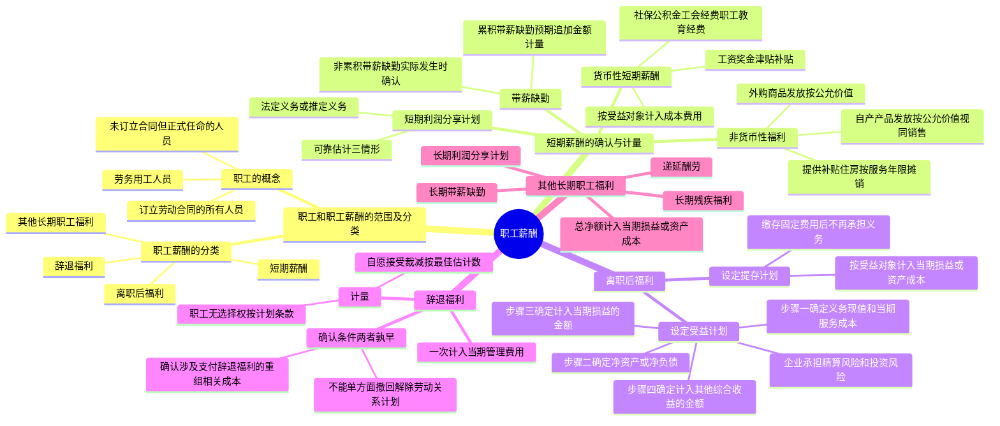

## 1. 章节定位

| 项目 | 信息 |
|------|------|
| 所属科目 | 会计 |
| 难度等级 | 3 |
| 历年分值 | 3-5 分 |
| 建议学时 | 5-7 小时 |
| 知识关联章节 | 第8章 负债（应付职工薪酬科目）、第10章 股份支付（以权益工具结算的职工薪酬）、第12章 或有事项（辞退福利的预计负债）、第13章 金融工具（设定受益计划精算假设）、第17章 收入（非货币性福利视同销售）、第19章 所得税（职工薪酬的税前扣除） |

## 2. 考情分析

本章是会计科目的基础章节之一，内容自成体系。客观题出题频率较高，主观题常以短期薪酬的计量、非货币性福利的处理、设定受益计划的核算为核心，并广泛与或有事项、所得税等章节联动考查。

**命题规律**：客观题集中在职工薪酬的分类（四类）、累积与非累积带薪缺勤的区分、设定提存计划与设定受益计划的区分、辞退福利的确认条件；主观题集中在货币性短期薪酬的计算与分配、非货币性福利（以自产产品/外购商品发放）的账务处理、辞退福利的计量。

**高频考点分布**：

1. **职工的范围**：三类人员（订立劳动合同的、正式任命的、劳务用工的）。
2. **职工薪酬的分类**：短期薪酬、离职后福利、辞退福利、其他长期职工福利四大类。
3. **短期薪酬**：货币性短期薪酬（按受益对象分配）、累积带薪缺勤（预期追加支付金额计量）、非累积带薪缺勤（实际发生时确认）、短期利润分享计划（法定义务或推定义务）、非货币性福利（以自产产品发放按公允价值计量并视同销售、以外购商品发放按公允价值计量、提供补贴住房按服务年限摊销）。
4. **离职后福利**：设定提存计划（缴存固定费用后不再承担义务，按受益对象计入当期损益或资产成本）；设定受益计划（企业承担精算风险和投资风险，四步核算：确定义务现值和当期服务成本、确定净资产/净负债、确定计入当期损益的金额、确定计入其他综合收益的金额）。
5. **辞退福利**：确认条件（不能单方面撤回解除劳动关系计划或裁减建议时、确认涉及支付辞退福利的重组相关成本或费用时，两者孰早）；计量（职工无选择权按计划条款规定、自愿接受裁减按预计数量最佳估计数）；一次计入当期管理费用，不计入资产成本。
6. **其他长期职工福利**：长期带薪缺勤、长期残疾福利、长期利润分享计划、递延酬劳等；总净额计入当期损益或相关资产成本。

**联动考查方式**：
- 与或有事项结合：辞退福利中自愿接受裁减的职工数量按最佳估计数预计；
- 与收入结合：以自产产品发放非货币性福利视同销售确认收入和销项税额；
- 与所得税结合：职工薪酬的税前扣除与暂时性差异；
- 与差错更正结合：错将辞退福利计入资产成本、错将非货币性福利按成本计量。

**备考建议**：
- 牢记职工薪酬四大分类及其各自的确认时点；
- 区分累积带薪缺勤（预期追加金额计量）与非累积带薪缺勤（实际发生时确认）；
- 区分设定提存计划（企业不承担进一步义务）与设定受益计划（企业承担精算风险和投资风险）；
- 牢记辞退福利一律计入当期管理费用，不计入资产成本；
- 掌握非货币性福利以自产产品发放时，应按公允价值确认收入并结转成本，同时计算销项税额。

## 3. 知识框架



## 4. 核心精讲

### 4.1 职工的概念

**职工**，是指与企业订立劳动合同的所有人员，含全职、兼职和临时职工，也包括虽未与企业订立劳动合同但由企业正式任命的人员。具体包括以下三类人员：

1. **与企业订立劳动合同的所有人员**，含全职、兼职和临时职工。即与企业订立了固定期限、无固定期限和以完成一定的工作作为期限的劳动合同的所有人员。
2. **未与企业订立劳动合同但由企业正式任命的人员**，如企业聘请的独立董事、外部监事等。
3. **在企业的计划和控制下，虽未与企业订立劳动合同或未由其正式任命，但向企业所提供服务与职工所提供服务类似的人员**，如通过企业与劳务中介公司签订用工合同而由企业提供服务的人员。如果企业不使用这些劳务用工人员，也需要雇佣职工订立劳动合同提供类似服务，因此这些劳务用工人员属于本章所称的职工。

### 4.2 职工薪酬的概念及分类

**职工薪酬**，是指企业为获得职工提供的服务或终止劳动合同关系而给予的各种形式的报酬或补偿。企业提供给职工配偶、子女、受赡养人、已故员工遗属及其他受益人等的福利，也属于职工薪酬。

职工薪酬主要包括四大类：

#### 4.2.1 短期薪酬

短期薪酬，是指企业在职工提供相关服务的年度报告期间结束后 12 个月内需要全部予以支付的职工薪酬（因解除劳动关系给予的补偿除外）。主要包括：

- 职工工资、奖金、津贴和补贴
- 职工福利费
- 医疗保险费、工伤保险费和生育保险费等社会保险费
- 住房公积金
- 工会经费和职工教育经费
- 短期带薪缺勤（年休假、病假、短期伤残、婚假、产假、丧假、探亲假等）
- 短期利润分享计划
- 非货币性福利（以自产产品或外购商品发放给职工、将自有资产或租赁资产供职工无偿使用等）
- 其他短期薪酬

#### 4.2.2 离职后福利

离职后福利，是指企业为获得职工提供的服务而在职工退休或与企业解除劳动关系后，提供的各种形式的报酬和福利（短期薪酬和辞退福利除外）。离职后福利计划分为**设定提存计划**和**设定受益计划**。

#### 4.2.3 辞退福利

辞退福利，是指企业在职工劳动合同到期之前解除与职工的劳动合同关系，或者为鼓励职工自愿接受裁减而给予职工的补偿。

#### 4.2.4 其他长期职工福利

其他长期职工福利，是指除短期薪酬、离职后福利、辞退福利之外所有的职工薪酬，包括长期带薪缺勤、长期残疾福利、长期利润分享计划等。

### 4.3 短期薪酬的确认与计量

企业应当在职工为其提供服务的会计期间，将实际发生的短期薪酬确认为负债，并计入当期损益（其他会计准则要求或允许计入资产成本的除外）。

#### 4.3.1 货币性短期薪酬

职工的工资、奖金、津贴和补贴，大部分的职工福利费、医疗保险费、工伤保险费和生育保险费等社会保险费，住房公积金、工会经费和职工教育经费一般属于货币性短期薪酬。

企业应当根据职工提供服务情况和工资标准计算确定计入职工薪酬的金额，**按照受益对象计入当期损益或相关资产成本**，借记"生产成本""制造费用""管理费用"等科目，贷记"应付职工薪酬"科目。

**计提比例总结**：

| 项目 | 计提基础 | 典型比例（因地区而异） |
|------|---------|----------------------|
| 医疗保险费 | 应发工资总额 | 10% |
| 住房公积金 | 应发工资总额 | 8% |
| 工会经费 | 应发工资总额 | 2% |
| 职工教育经费 | 应发工资总额 | 1.5% |

#### 4.3.2 带薪缺勤

带薪缺勤根据其性质及职工享有的权利，分为累积带薪缺勤和非累积带薪缺勤。

| 类型 | 定义 | 确认处理 |
|------|------|---------|
| **累积带薪缺勤** | 带薪权利可以结转下期，本期尚未用完的带薪缺勤权利可以在未来期间使用 | 在职工提供了服务从而增加了其未来享有的带薪缺勤权利时确认，以累积未行使权利而增加的预期支付金额计量 |
| **非累积带薪缺勤** | 带薪权利不能结转下期，本期尚未用完的带薪缺勤权利将予以取消，职工离开企业时也无权获得现金支付 | 在职工实际发生缺勤的会计期间确认（视同职工出勤确认相关资产成本或当期费用），通常已包含在每期发放的工资中，不必额外处理 |

**累积带薪缺勤的计量要点**：企业应当根据资产负债表日因累积未使用权利而导致的预期支付的追加金额，作为累积带薪缺勤费用进行预计。职工在离开企业时能够获得现金支付的，企业应当确认必须支付的、职工全部累积未使用权利的金额。

#### 4.3.3 短期利润分享计划

利润分享计划同时满足下列条件的，企业应当确认相关的应付职工薪酬，并计入当期损益或相关资产成本：

1. 企业因过去事项导致现在具有支付职工薪酬的**法定义务或推定义务**；
2. 因利润分享计划所产生的应付职工薪酬义务**能够可靠估计**。

**视为能够可靠估计的三种情形**：①在财务报告批准报出之前企业已确定应支付的薪酬金额；②该利润分享计划的正式条款中包括确定薪酬金额的方式；③过去的惯例为企业确定推定义务金额提供了明显证据。

如果企业在职工提供相关服务的年度报告期间结束后 12 个月内不需要全部支付的，应当适用其他长期职工福利的有关规定。

#### 4.3.4 非货币性福利

企业向职工提供非货币性福利的，应当按照**公允价值**计量。公允价值不能可靠取得的，可以采用成本计量。

**（1）以自产产品或外购商品发放给职工作为福利**

| 福利形式 | 计量与处理 |
|---------|-----------|
| 以自产产品发放 | 按该产品的**公允价值**和相关税费计量应计入成本费用的职工薪酬金额；确认主营业务收入、结转主营业务成本；按税收规定视同销售计算增值税销项税额 |
| 以外购商品发放 | 按该商品的**公允价值**和相关税费计入当期损益或相关资产成本；原已抵扣的增值税进项税额转出 |

**重要处理原则**：在以自产产品或外购商品发放给职工作为福利的情况下，企业在进行账务处理时，应当**先通过"应付职工薪酬"科目归集**当期应计入成本费用的非货币性薪酬金额。

**（2）向职工提供企业支付了补贴的商品或服务**

企业以低于取得资产或服务成本的价格向职工提供资产或服务（如以优惠价格向职工出售住房），应当将公允价值与内部售价之间的差额（即企业补贴的金额）分别情况处理：

| 情形 | 处理 |
|------|------|
| 合同规定职工购得住房后至少应当提供服务的年限，且提前离开应退还部分差额 | 差额作为**长期待摊费用**处理，在合同规定的服务年限内平均摊销，根据受益对象计入相关资产成本或当期损益 |
| 合同未规定职工购得住房后必须服务的年限 | 差额直接计入出售住房当期相关资产成本或当期损益 |

### 4.4 离职后福利的确认与计量

离职后福利，是指企业为获得职工提供的服务而在职工退休或与企业解除劳动关系后，提供的各种形式的报酬和福利。企业应当按照其承担的风险和义务情况，将离职后福利计划分类为设定提存计划和设定受益计划。

#### 4.4.1 设定提存计划

**设定提存计划**，是指向独立的基金缴存固定费用后，企业不再承担进一步支付义务的离职后福利计划。

**特征**：企业在每一期间的义务取决于该期间将要提存的金额，计量义务或费用时不需要精算假设，通常也不存在精算利得或损失。**精算风险和投资风险实质上由职工承担**。

**会计处理**：企业应在资产负债表日确认为换取职工在会计期间内为企业提供服务而应付给设定提存计划的提存金，确认职工薪酬负债，并作为一项费用计入当期损益或相关资产成本。

如果企业预期不会在职工提供相关服务的年度报告期结束后 12 个月内支付全部应缴存金额的，应当参照资产负债表日与设定受益计划义务期限和币种相匹配的国债或活跃市场上的高质量公司债券的市场收益率确定的折现率，将全部应缴存金额以折现后的金额计量。

#### 4.4.2 设定受益计划

**设定受益计划**，是指除设定提存计划以外的离职后福利计划。

**特征**：企业的义务是为现在及以前的职工提供约定的福利，计划相关的**精算风险和投资风险实质上由企业承担**。如果精算或投资的实际结果比预期差，企业的义务可能会增加。

**企业负有下列义务时，该计划属于设定受益计划**：
1. 计划福利公式不仅与提存金金额相关，而且要求企业在资产不足以满足该公式的福利时提供进一步的提存金；
2. 通过计划间接地或直接地对提存金的特定回报作出担保。

**设定受益计划的核算涉及四个步骤**：

| 步骤 | 内容 |
|------|------|
| 步骤一 | 确定设定受益义务现值和当期服务成本。根据预期累计福利单位法，采用无偏且相互一致的精算假设对人口统计变量和财务变量作出估计，计量设定受益计划所产生的义务；根据资产负债表日与义务期限和币种相匹配的国债或高质量公司债券的市场收益率确定折现率，将义务予以折现 |
| 步骤二 | 确定设定受益计划净负债或净资产。将设定受益计划义务现值减去设定受益计划资产公允价值所形成的赤字或盈余确认为一项净负债或净资产。存在盈余的，以设定受益计划的盈余和资产上限两项的孰低者计量净资产（资产上限是指企业可从设定受益计划退款或减少未来缴存资金而获得的经济利益的现值） |
| 步骤三 | 确定应当计入当期损益的金额。包括服务成本（当期服务成本、过去服务成本和结算利得或损失）和设定受益计划净负债或净资产的利息净额 |
| 步骤四 | 确定应当计入其他综合收益的金额。设定受益计划净负债或净资产的重新计量（包括精算利得和损失、计划资产回报扣除利息净额后的差额、资产上限影响的变动）应当计入其他综合收益，且在后续期间**不应重分类计入损益**。在原设定受益计划终止时，企业应当在权益范围内将原计入其他综合收益的部分全部结转至未分配利润 |

### 4.5 辞退福利的确认与计量

**辞退福利**，是指企业在职工劳动合同到期之前解除与职工的劳动关系，或者为鼓励职工自愿接受裁减而给予职工的补偿。辞退福利被视为职工福利的单独类别，是因为导致义务产生的事项是终止雇佣而不是职工的服务。

#### 4.5.1 辞退福利的确认

企业向职工提供辞退福利的，应当在以下**两者孰早**确认辞退福利产生的职工薪酬负债，并计入当期损益：

1. **企业不能单方面撤回解除劳动关系计划或裁减建议所提供的辞退福利时**。如果企业能够单方面撤回，则表明未来经济利益不是很可能流出，不符合负债的确认条件。
2. **企业确认涉及支付辞退福利的重组相关的成本或费用时**。存在下列情况时表明企业承担了重组义务：①有详细、正式的重组计划；②该重组计划已对外公告。

**关键原则**：由于被辞退的职工不再为企业带来未来经济利益，因此对于所有辞退福利，均应当于辞退计划满足负债确认条件的当期**一次计入费用（管理费用），不计入资产成本**。

#### 4.5.2 辞退福利的计量

辞退福利的计量因辞退计划中职工有无选择权而有所不同：

| 辞退计划类型 | 计量方法 |
|------------|---------|
| 职工没有选择权的辞退计划 | 根据计划条款规定拟解除劳动关系的职工数量、每一职位的辞退补偿等计提应付职工薪酬 |
| 自愿接受裁减的建议 | 因接受裁减的职工数量不确定，企业应当根据或有事项准则规定，预计将会接受裁减建议的职工数量，根据预计的职工数量和每一职位的辞退补偿等计提应付职工薪酬 |

**辞退福利预期支付时间的分类处理**：

| 预期支付时间 | 适用规定 |
|------------|---------|
| 在确认的年度报告期间期末后 12 个月内完全支付 | 适用短期薪酬的有关规定 |
| 在确认的年度报告期间结束后 12 个月内不能完全支付 | 适用其他长期职工福利的有关规定，企业应当选择恰当的折现率，以折现后的金额计量 |

#### 4.5.3 内部退休计划的处理

企业实施的职工内部退休计划，由于这部分职工不再为企业带来经济利益，企业应当比照辞退福利处理：

- 在内退计划符合确认条件时，按照内退计划规定，将自职工停止提供服务日至正常退休日期间、企业应支付的内退人员工资和缴纳的社会保险费等，确认为应付职工薪酬，**一次计入当期管理费用**
- 不能在职工内退后各期分期确认

### 4.6 其他长期职工福利

**其他长期职工福利**，是指除短期薪酬、离职后福利和辞退福利以外的其他所有职工福利。包括（假设预计在职工提供相关服务的年度报告期末以后 12 个月内不会全部结算）：

- 长期带薪缺勤（如其他长期服务福利、长期残疾福利、长期利润分享计划和长期奖金计划）
- 递延酬劳等

**会计处理**：企业向职工提供的其他长期职工福利，符合设定提存计划条件的，按设定提存计划有关规定处理；符合设定受益计划条件的，按设定受益计划有关规定确认和计量其他长期职工福利净负债或净资产。

在报告期末，企业应当将其他长期职工福利产生的职工薪酬成本确认为三个组成部分：
1. 服务成本；
2. 其他长期职工福利净负债或净资产的利息净额；
3. 重新计量其他长期职工福利净负债或净资产所产生的变动。

**简化处理**：为了简化相关会计处理，上述项目的**总净额应计入当期损益或相关资产成本**（与设定受益计划不同，重新计量的变动不计入其他综合收益，而是直接计入当期损益）。

**长期残疾福利的特殊处理**：
- 长期残疾福利水平取决于职工提供服务期间长短的：企业应在职工提供服务的期间确认应付长期残疾福利义务，计量时应当考虑长期残疾福利支付的可能性和预期支付的期限；
- 与职工提供服务期间长短无关的：企业应当在导致职工长期残疾的事件发生的当期确认应付长期残疾福利义务。

**递延酬劳**包括按比例分期支付或者经常性定额支付的递延奖金等。这类福利应当按照奖金计划的福利公式来对费用进行确认，或者按照直线法在相应的服务期间分摊确认。

## 5. 典型例题

### 例题 1：货币性短期薪酬的计算与分配

2×22 年 7 月，甲公司当月应发职工工资 1 560 万元，其中：生产部门直接生产人员工资 1 000 万元，生产部门管理人员工资 200 万元，管理部门人员工资 360 万元。根据甲公司所在地政府规定，甲公司每月分别按照应发职工工资总额的 10% 和 8% 计提并缴存医疗保险费和住房公积金。同时，甲公司每月分别按照职工工资总额的 2% 和 1.5% 计提工会经费和职工教育经费。假定不考虑所得税影响。

**要求**：计算各项薪酬金额并编制账务处理。

**解答**：

应计入生产成本的职工薪酬金额 = 1 000 + 1 000 × (10% + 8% + 2% + 1.5%) = 1 215（万元）

应计入制造费用的职工薪酬金额 = 200 + 200 × (10% + 8% + 2% + 1.5%) = 243（万元）

应计入管理费用的职工薪酬金额 = 360 + 360 × (10% + 8% + 2% + 1.5%) = 437.4（万元）

```
借：生产成本                            12 150 000
    制造费用                             2 430 000
    管理费用                             4 374 000
    贷：应付职工薪酬——工资               15 600 000
        应付职工薪酬——医疗保险费          1 560 000
        应付职工薪酬——住房公积金          1 248 000
        应付职工薪酬——工会经费              312 000
        应付职工薪酬——职工教育经费           234 000
```

**解析**：货币性短期薪酬应按照受益对象计入相关资产成本或当期损益。各项社会保险费、住房公积金、工会经费和职工教育经费应按照规定标准和比例计提，分别计入各受益对象的成本费用。

### 例题 2：非货币性福利（以自产产品发放）

甲公司共有职工 200 名，2×22 年 2 月，甲公司以其生产的成本为 10 000 元/台的高级笔记本电脑作为春节福利发放给公司每名职工。该型号笔记本电脑的售价为每台 14 000 元，甲公司适用的增值税税率为 13%。假定 200 名职工中 170 名为直接参加生产的职工，30 名为总部管理人员。

**要求**：编制相关账务处理。

**解答**：

笔记本电脑的售价总额 = 14 000 × 170 + 14 000 × 30 = 2 380 000 + 420 000 = 2 800 000（元）

笔记本电脑的增值税销项税额 = 2 800 000 × 13% = 364 000（元）

应计入生产成本 = 14 000 × 170 × (1 + 13%) = 2 689 400（元）

应计入管理费用 = 14 000 × 30 × (1 + 13%) = 474 600（元）

决定发放非货币性福利时：
```
借：生产成本                            2 689 400
    管理费用                              474 600
    贷：应付职工薪酬——非货币性福利         3 164 000
```

实际发放笔记本电脑时：
```
借：应付职工薪酬——非货币性福利          3 164 000
    贷：主营业务收入                      2 800 000
        应交税费——应交增值税（销项税额）     364 000

借：主营业务成本                        2 000 000
    贷：库存商品                          2 000 000
```

**解析**：以自产产品作为非货币性福利发放给职工时，应按产品的公允价值和相关税费计量应计入成本费用的职工薪酬金额。先通过"应付职工薪酬"科目归集，实际发放时确认收入并结转成本，同时计算增值税销项税额（视同销售）。

### 例题 3：累积带薪缺勤

乙公司共有 1 000 名职工，从 2×22 年 1 月 1 日起实行累积带薪缺勤制度。每名职工每年可享受 5 个工作日带薪年休假，未使用的年休假只能向后结转一个日历年度，超过 1 年未使用的权利作废，不能在职工离开公司时获得现金支付。2×22 年 12 月 31 日，每名职工当年平均未使用带薪年休假为 2 天。根据过去的经验，乙公司预计 2×23 年有 950 名职工将享受不超过 5 天的带薪年休假，剩余 50 名职工每人将平均享受 6.5 天年休假。该公司平均每名职工每个工作日工资为 300 元。

**要求**：编制 2×22 年 12 月 31 日的账务处理。

**解答**：

预期将支付的追加年休假工资 = 50 × (6.5 - 5) × 300 = 22 500（元）

```
借：管理费用                              22 500
    贷：应付职工薪酬——累积带薪缺勤           22 500
```

**解析**：对于累积带薪缺勤，企业应当在职工提供了服务从而增加了其未来享有的带薪缺勤权利时确认相关的职工薪酬，以累积未行使权利而增加的预期支付金额计量。本题中，只有 50 名职工预计将在下一年度使用超过当年 5 天的年休假，因此只需就这 50 名职工超过 5 天的部分（每人 1.5 天）确认追加的预期支付金额。

### 例题 4：辞退福利

甲公司为一家空调制造企业，2×22 年 9 月，为了能够在下一年度顺利实施转产，甲公司管理层订立了一项辞退计划。计划规定：从 2×23 年 1 月 1 日起，企业将以职工自愿方式，辞退其柜式空调生产车间的职工。辞退计划的详细内容均已与职工沟通并达成一致意见，辞退计划已于 2×22 年 12 月 10 日经董事会正式批准，并将于下一个年度内实施完毕。根据最佳估计数，愿意接受辞退职工的最可能数量为 123 名，预计补偿总额为 1 400 万元。

**要求**：编制甲公司 2×22 年的账务处理。

**解答**：

```
借：管理费用                            14 000 000
    贷：应付职工薪酬——辞退福利            14 000 000
```

**解析**：辞退计划经董事会正式批准且不能单方面撤回时，企业应确认辞退福利负债。由于职工自愿接受裁减，应根据或有事项准则预计接受裁减的职工数量，按最佳估计数计量。辞退福利一次计入当期管理费用，不计入资产成本。

## 6. 记忆口诀

**职工薪酬记忆要点**：

一、职工三类人：合同签订正式任，劳务用工也归入。

二、薪酬四分类：短期薪酬十二内，离职后福利两类分，辞退福利一次性，其他长期职工福利。

三、短期薪酬按受益：生产成本制造费用管理费用，按比例计提社保公积金。

四、带薪缺勤两路径：累积缺勤预期追加金额计量，非累积缺勤实际发生时确认。

五、非货币性福利：自产产品按公允价值视同销售，先归集薪酬再发放；补贴住房有年限摊销，无年限一次计入。

六、离职后福利：提存计划缴完就完，受益计划四步走（义务现值、净资产、损益、其他综合收益）。

七、辞退福利要点：两者孰早确认（撤回不能、重组确认），一次计入管理费用，不分期不进资产成本。

八、其他长期职工福利：总净额计入当期损益，重新计量不进其他综合收益（与设定受益计划不同）。
