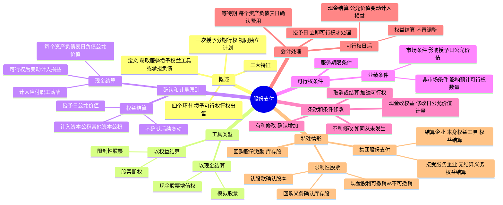

## 📍 章节定位

| 项目 | 信息 |
|------|------|
| **所属科目** | 📒 会计 |
| **难度等级** | ⭐⭐⭐ |
| **历年分值** | 3-5分 |
| **建议学时** | 4-5h |

## 📝 考情分析

本章是会计科目的重点章节，历年分值约 3-5 分，以客观题和主观题形式考查，主观题常结合所得税、合并财务报表、差错更正等在综合题中考查。命题热点集中在：以权益结算与以现金结算的股份支付的区分及会计处理差异、可行权条件（服务期限条件、市场条件、非市场条件）的判断与处理、等待期内每个资产负债表日按授予日公允价值计量（权益结算）vs 按承担负债公允价值计量（现金结算）、可行权日后的处理差异（权益结算不再调整 vs 现金结算公允价值变动计入公允价值变动损益）、条款和条件的有利修改与不利修改的处理、取消或结算的加速可行权处理、集团股份支付的会计处理（结算企业与接受服务企业分别处理）。

考生需重点掌握：权益结算的股份支付以**授予日**权益工具的公允价值计量，不确认后续公允价值变动，计入资本公积（其他资本公积）；现金结算的股份支付以**每个资产负债表日**承担负债的公允价值计量，可行权日后公允价值变动计入当期损益；市场条件是否满足不影响预计可行权数量的估计（公允价值已考虑），非市场条件是否满足影响预计可行权数量的估计；只要职工满足了所有非市场条件（如服务期限），即使市场条件未满足，企业也应确认已取得的服务；集团股份支付中结算企业以其本身权益工具结算的作为权益结算处理，接受服务企业没有结算义务的作为权益结算处理。

## 🧠 知识框架



## 📖 核心精讲

### 一、股份支付概述

#### （一）股份支付的定义

**股份支付**，是"以股份为基础的支付"的简称，是指企业为获取职工和其他方提供服务而授予权益工具或者承担以权益工具为基础确定的负债的交易。

#### （二）股份支付的特征

股份支付具有以下三大特征：

1. **企业与职工或其他方之间发生的交易**：只有发生在企业与其职工或向企业提供服务的其他方之间的交易，才可能符合股份支付的定义。
2. **以获取职工或其他方服务为目的的交易**：企业旨在获取职工或其他方提供的服务（费用）或取得这些服务的权利（资产），用于正常生产经营，不是转手获利。
3. **交易对价或其定价与企业自身权益工具未来价值密切相关**：企业要么向职工支付其自身权益工具，要么支付一笔现金，其金额高低取决于结算时企业自身权益工具的公允价值。

#### （三）股份支付的四个环节

以薪酬性股票期权为例，典型的股份支付通常涉及四个主要环节：

| 环节 | 定义 | 关键点 |
|------|------|--------|
| **授予日** | 股份支付协议获得批准的日期 | 企业与职工就协议条款和条件达成一致，并获得股东会或类似机构批准 |
| **可行权日** | 可行权条件得到满足、职工或其他方具有取得权益工具或现金权利的日期 | 授予日至可行权日的时段称为**等待期**（行权限制期） |
| **行权日** | 职工和其他方行使权利、获取现金或权益工具的日期 | 一般在可行权日之后至期权到期日之前的可选择时段内行权 |
| **出售日** | 股票持有人将行使期权所取得的股票出售的日期 | 行权日与出售日之间设有禁售期（国有控股上市公司不低于 2 年） |

**一次授予、分期行权**：每个批次是否可行权的结果通常相对独立，在会计处理时应将其作为同时授予的几个**独立的股份支付计划**，分别确定每个计划的等待期，按各计划在会计期间内等待期长度占整个等待期长度的比例进行分摊。

#### （四）股份支付工具的主要类型

| 类别 | 工具 | 定义 |
|------|------|------|
| **以权益结算** | 限制性股票 | 职工或其他方按协议规定条款和条件，从企业获得一定数量的本企业股票，在等待期内或满足特定业绩指标前出售股票受持续服务期限或业绩条件限制 |
| **以权益结算** | 股票期权 | 企业授予职工或其他方在未来一定期限内以预先确定的价格和条件购买本企业一定数量股票的权利 |
| **以现金结算** | 模拟股票 | 用现金支付的模拟股权激励机制，与股票价值挂钩但用现金支付，运作原理与限制性股票相同 |
| **以现金结算** | 现金股票增值权 | 用现金支付的模拟股权激励机制，运作原理与股票期权相同，不需实际认购和持有股票 |

**注意**：名为"第二类限制性股票"的股权激励，激励对象在授予日无须出资购买，待满足可行权条件后可选择按授予价格购买股票或放弃，实质是股票期权，属于以权益结算的股份支付。

### 二、股份支付的确认和计量原则

#### （一）以权益结算的股份支付

**1. 换取职工服务的股份支付**：企业应当以股份支付所授予的权益工具的**公允价值**计量。在等待期内的每个资产负债表日，以对可行权权益工具数量的最佳估计为基础，按照权益工具在**授予日**的公允价值，将当期取得的服务计入相关资产成本或当期费用，同时计入**资本公积（其他资本公积）**。

**授予后立即可行权**的：应在授予日按照权益工具的公允价值，将取得的服务计入相关资产成本或当期费用，同时计入资本公积（其他资本公积）。

**2. 换取其他方服务的股份支付**：以所换取的服务的公允价值计量；服务公允价值不能可靠计量但权益工具公允价值能够可靠计量的，按照权益工具在服务取得日的公允价值计量。

**3. 权益工具公允价值无法可靠确定**：以**内在价值**计量（公允价值与应支付价格间的差额），内在价值变动计入当期损益。

#### （二）以现金结算的股份支付

企业应当在等待期内的每个资产负债表日，以对可行权情况的最佳估计为基础，按照企业**承担负债的公允价值**，将当期取得的服务计入相关资产成本或当期费用，同时计入**负债（应付职工薪酬）**，并在结算前的每个资产负债表日和结算日对负债的公允价值重新计量，将其变动计入**当期损益**。

**核心差异对比**：

| 项目 | 以权益结算 | 以现金结算 |
|------|----------|----------|
| 计量基础 | 授予日权益工具公允价值 | 每个资产负债表日负债公允价值 |
| 后续公允价值变动 | 不确认 | 确认，计入损益 |
| 会计科目 | 资本公积（其他资本公积） | 应付职工薪酬 |
| 可行权日后 | 不再调整成本费用和所有者权益 | 不再确认成本费用，负债公允价值变动计入公允价值变动损益 |

### 三、可行权条件的种类、处理和修改

#### （一）可行权条件的种类

**可行权条件**是指能够确定企业是否得到职工或其他方提供的服务，且该服务使职工具有获取权益工具或现金等权利的条件。可行权条件包括：

1. **服务期限条件**：职工或其他方完成规定服务期限才可行权。
2. **业绩条件**：完成规定服务期限且企业已达到特定业绩目标才可行权，分为：
   - **市场条件**：行权价格、可行权条件以及行权可能性与权益工具的市场价格相关的业绩条件（如股价上升至何种水平）。
   - **非市场条件**：除市场条件之外的其他业绩条件（如最低盈利目标或销售目标）。

**关键处理原则**：

| 条件类型 | 对授予日公允价值的影响 | 对预计可行权数量的影响 |
|---------|-------------------|---------------------|
| 市场条件 | 确定公允价值时**应考虑** | 是否满足**不影响**预计可行权数量估计 |
| 非市场条件 | 确定公允价值时**不考虑** | 是否满足**影响**预计可行权数量估计 |
| 非可行权条件 | 确定公允价值时**应考虑** | 不影响可行权判断 |

**重要原则**：只要职工满足了其他所有非市场条件（如利润增长率、服务期限等），即使市场条件未得到满足，企业也应当确认已取得的服务。

#### （二）条款和条件的修改

**1. 有利修改**（导致股份支付公允价值总额升高或对职工有利）：

| 修改情形 | 会计处理 |
|---------|---------|
| 增加权益工具公允价值 | 按公允价值增加（修改前后公允价值差额）确认取得服务的增加，在修改日至修改后可行权日之间确认 |
| 增加权益工具数量 | 按增加的权益工具的公允价值确认取得服务的增加 |
| 有利修改可行权条件（缩短等待期、取消非市场业绩条件） | 处理时考虑修改后的可行权条件 |

**2. 不利修改**（减少股份支付公允价值总额或对职工不利）：

| 修改情形 | 会计处理 |
|---------|---------|
| 减少权益工具公允价值 | 继续以授予日公允价值为基础确认，不考虑减少 |
| 减少权益工具数量 | 减少部分作为已授予权益工具的**取消**处理 |
| 不利修改可行权条件（延长等待期、增加非市场业绩条件） | 处理时**不应考虑**修改后的可行权条件，如同变更从未发生 |

**3. 取消或结算**：企业在等待期内取消所授予的权益工具或结算（未满足可行权条件而被取消的除外），应当：

- 将取消或结算作为**加速可行权**处理，将原本应在剩余等待期内确认的金额立即计入当期损益，同时确认资本公积（其他资本公积）；
- 取消或结算时支付给职工的所有款项作为权益的回购处理，回购金额高于权益工具在回购日公允价值的部分计入当期费用；
- 授予新权益工具替代被取消权益工具的，按修改处理；未认定为替代的，作为新授予的股份支付处理。

**4. 现金结算修改为权益结算**：在修改日，按照所授予权益工具当日的公允价值计量以权益结算的股份支付，将已取得的服务计入资本公积，同时终止确认以现金结算的股份支付在修改日已确认的负债，两者之间的差额计入当期损益。

### 四、股份支付的会计处理

#### （一）授予日

- **立即可行权**的股份支付：在授予日按照公允价值确认相关成本费用，同时确认资本公积（权益结算）或应付职工薪酬（现金结算）。
- **非立即可行权**的股份支付：授予日**不做会计处理**。

#### （二）等待期内每个资产负债表日

企业应当将取得职工或其他方提供的服务计入成本费用，同时确认所有者权益或负债。

- **以权益结算**：以对可行权权益工具数量的最佳估计为基础，按照**授予日**权益工具的公允价值，将当期取得的服务计入相关成本费用和**资本公积（其他资本公积）**，不确认后续公允价值变动。
- **以现金结算**：以对可行权情况的最佳估计为基础，按照企业**承担负债的公允价值**确定相关成本费用和**应付职工薪酬**。

**计算方法**：根据权益工具公允价值（或负债公允价值）和预计可行权数量，计算截至当期累计应确认的成本费用金额，再减去前期累计已确认金额，作为当期应确认的成本费用金额。在可行权日，最终预计可行权权益工具的数量应当与实际可行权工具的数量一致。

#### （三）可行权日之后

| 类型 | 可行权日后处理 |
|------|-------------|
| **以权益结算** | 不再对已确认的成本费用和所有者权益总额进行调整。行权日根据行权情况确认股本和股本溢价，同时结转等待期内确认的资本公积（其他资本公积） |
| **以现金结算** | 不再确认成本费用，负债（应付职工薪酬）公允价值的变动计入当期损益（**公允价值变动损益**） |

#### （四）企业集团内涉及不同企业的股份支付交易

| 情形 | 会计处理 |
|------|---------|
| 结算企业以其**本身权益工具**结算 | 作为**权益结算**的股份支付处理 |
| 结算企业以**其他方式**（非本身权益工具）结算 | 作为**现金结算**的股份支付处理 |
| 结算企业是接受服务企业的**投资者** | 按授予日权益工具公允价值或应承担负债的公允价值确认为对接受服务企业的**长期股权投资**，同时确认资本公积或负债 |
| 接受服务企业**没有结算义务**或授予的是其本身权益工具 | 作为**权益结算**的股份支付处理 |
| 接受服务企业**有结算义务**且授予的是集团内其他企业权益工具 | 作为**现金结算**的股份支付处理 |

#### （五）授予限制性股票进行股权激励

上市公司以非公开发行方式向激励对象授予限制性股票，规定锁定期和解锁期：

1. **收到认股款**：确认股本和资本公积（股本溢价），借记"银行存款"，贷记"股本"，差额贷记"资本公积——股本溢价"。
2. **回购义务**：就回购义务确认负债（作收购库存股处理），借记"库存股"，贷记"其他应付款——限制性股票回购义务"。
3. **等待期内**：按权益结算股份支付规定，按照权益工具在授予日的公允价值，将取得的职工服务计入成本费用，同时增加资本公积（其他资本公积）。
4. **未达到解锁条件回购**：借记"其他应付款——限制性股票回购义务"，贷记"银行存款"；同时注销股本，借记"股本"，贷记"库存股"，差额借记"资本公积——股本溢价"。
5. **达到解锁条件无须回购**：借记"其他应付款——限制性股票回购义务"，贷记"库存股"，差额借记或贷记"资本公积——股本溢价"。

**等待期内现金股利的处理**：

| 类型 | 预计可解锁 | 预计不可解锁 |
|------|----------|------------|
| **现金股利可撤销** | 作为利润分配，同时冲减回购义务（借其他应付款，贷库存股） | 冲减相关负债（借其他应付款，贷应付股利） |
| **现金股利不可撤销** | 作为利润分配 | 计入当期成本费用（借管理费用等，贷应付股利） |

## 💡 典型例题

**【例题 1】（基础题，单选题）**

下列关于股份支付的表述中，正确的是（　　）。
A. 以权益结算的股份支付，应当在每个资产负债表日按照权益工具的公允价值重新计量
B. 以现金结算的股份支付，可行权日后负债公允价值变动计入资本公积
C. 企业在授予日对非立即可行权的股份支付不做会计处理
D. 市场条件是否满足影响企业对预计可行权数量的估计

**答案**：C

**解析**：A 错误，以权益结算的股份支付按照**授予日**权益工具的公允价值计量，不确认后续公允价值变动；B 错误，以现金结算的股份支付，可行权日后负债公允价值变动计入**公允价值变动损益**，不计入资本公积；C 正确，非立即可行权的股份支付在授予日不做会计处理；D 错误，市场条件是否满足**不影响**企业对预计可行权数量的估计（公允价值已考虑市场条件），非市场条件才影响。

**【例题 2】（进阶题，单选题）**

下列关于可行权条件的表述中，正确的是（　　）。
A. 股份支付协议中关于股价上升至何种水平才可行权的规定属于非市场条件
B. 企业在确定权益工具在授予日的公允价值时，应考虑非市场条件的影响
C. 只要职工满足了所有非市场条件，即使市场条件未满足，企业也应确认已取得的服务
D. 服务期限条件属于业绩条件

**答案**：C

**解析**：A 错误，股价上升至何种水平的规定属于**市场条件**；B 错误，确定授予日公允价值时**不考虑**非市场条件的影响，但应考虑市场条件和非可行权条件；C 正确，只要职工满足了所有非市场条件（如服务期限、利润增长率等），即使市场条件未满足，企业也应确认已取得的服务；D 错误，服务期限条件与业绩条件并列，均属于可行权条件，但服务期限条件不属于业绩条件。

**【例题 3】（计算题，以权益结算的股份支付）**

A 公司为上市公司。2×17 年 1 月 1 日，公司向其 200 名管理人员每人授予 100 份股票期权，这些职员从 2×17 年 1 月 1 日起在该公司连续服务三年，即可以 5 元每股购买 100 股 A 公司股票。公司估计该期权在授予日的公允价值为 18 元。

第一年有 20 名职员离开，A 公司估计三年中离开的职员比例将达到 20%；第二年又有 10 名职员离开，公司将估计的职员离开比例修正为 15%；第三年又有 15 名职员离开。假设全部 155 名职员都在 2×20 年 12 月 31 日行权，A 公司股份面值为 1 元。

要求：计算各年应确认的费用，并编制相关会计分录。

**答案**：

各年费用计算：

| 年份 | 计算 | 当期费用（元） | 累计费用（元） |
|------|------|-------------|-------------|
| 2×17 | 200 × 100 × (1-20%) × 18 × 1/3 | 96000 | 96000 |
| 2×18 | 200 × 100 × (1-15%) × 18 × 2/3 - 96000 | 108000 | 204000 |
| 2×19 | 155 × 100 × 18 - 204000 | 75000 | 279000 |

会计分录：

2×17 年 12 月 31 日（授予日不作处理，年末确认费用）：
```
借：管理费用                          96 000
　　贷：资本公积——其他资本公积        96 000
```

2×18 年 12 月 31 日：
```
借：管理费用                         108 000
　　贷：资本公积——其他资本公积       108 000
```

2×19 年 12 月 31 日：
```
借：管理费用                          75 000
　　贷：资本公积——其他资本公积        75 000
```

2×20 年 12 月 31 日行权：
```
借：银行存款                          77 500  （155 × 100 × 5）
　　资本公积——其他资本公积          279 000
　　贷：股本                           15 500  （155 × 100 × 1）
　　　　资本公积——股本溢价          341 000
```

**解析**：以权益结算的股份支付，在等待期内每个资产负债表日按照授予日权益工具的公允价值和预计可行权数量确认费用，计入资本公积（其他资本公积）。行权日结转资本公积，确认股本和股本溢价。

**【例题 4】（计算题，以现金结算的股份支付）**

2×20 年初，A 公司为其 200 名中层以上职员每人授予 100 份现金股票增值权，这些职员从 2×20 年 1 月 1 日起连续服务 3 年，即可按照当时股价的增长幅度获得现金，该增值权应在 2×24 年 12 月 31 日之前行使。A 公司估计该增值权在各资产负债表日和结算日的公允价值及支付现金额如下：2×20 年公允价值 14 元；2×21 年公允价值 15 元；2×22 年公允价值 18 元，支付现金 16 元；2×23 年公允价值 21 元，支付现金 20 元；2×24 年公允价值 25 元，支付现金 25 元。

第一年有 20 名职员离开，估计还将有 15 名离开；第二年又有 10 名离开，估计还将有 10 名离开；第三年又有 15 名离开。第三年年末有 70 人行权，第四年年末有 50 人行权，第五年年末剩余 35 人行权。

要求：计算各年应确认的费用，并编制 2×22 年和 2×23 年的会计分录。

**答案**：

各年费用计算：

| 年份 | 负债计算 | 支付现金 | 当期费用 |
|------|---------|---------|---------|
| 2×20 | (200-35) × 100 × 14 × 1/3 = 77000 | - | 77000 |
| 2×21 | (200-40) × 100 × 15 × 2/3 = 160000 | - | 83000 |
| 2×22 | (200-45-70) × 100 × 18 = 153000 | 70 × 100 × 16 = 112000 | 105000 |
| 2×23 | (200-45-70-50) × 100 × 21 = 73500 | 50 × 100 × 20 = 100000 | 20500（计入公允价值变动损益） |
| 2×24 | 0 | 35 × 100 × 25 = 87500 | 14000（计入公允价值变动损益） |

2×22 年 12 月 31 日：
```
借：管理费用                         105 000
　　贷：应付职工薪酬——股份支付       105 000
借：应付职工薪酬——股份支付          112 000
　　贷：银行存款                     112 000
```

2×23 年 12 月 31 日（可行权日后，公允价值变动计入公允价值变动损益）：
```
借：公允价值变动损益                  20 500
　　贷：应付职工薪酬——股份支付        20 500
借：应付职工薪酬——股份支付          100 000
　　贷：银行存款                     100 000
```

**解析**：以现金结算的股份支付，等待期内按负债公允价值确认费用和应付职工薪酬；可行权日后不再确认成本费用，负债公允价值变动计入公允价值变动损益。注意支付现金时冲减负债，不影响费用。

**【例题 5】（综合题，集团股份支付）**

2×22 年 1 月 20 日，甲公司股东会批准一项股权激励方案，向集团内 60 名管理人员每人授予 10 万份股票期权，这些人员 2×22 年 1 月 1 日起为集团连续服务 3 年，每人即可以每股 2 元购买甲公司普通股 10 万股。甲公司估计该期权在授予日的公允价值为每份 6 元。2×22 年，授予期权的 60 名员工中，40 名在甲公司任职，20 名在甲公司的子公司乙公司任职。假定 3 年内授予期权的员工没有离职。

要求：编制甲公司和乙公司 2×22 年个别财务报表的会计分录，以及合并报表的抵销分录。

**答案**：

- 甲公司 2×22 年应确认的股份支付费用 = 40 × 10 × 6/3 = 800（万元）
- 乙公司 2×22 年应确认的股份支付费用 = 20 × 10 × 6/3 = 400（万元）

甲公司个别财务报表：
```
借：管理费用                        8 000 000
　　长期股权投资——乙公司           4 000 000
　　贷：资本公积——其他资本公积    12 000 000
```

乙公司个别财务报表：
```
借：管理费用                        4 000 000
　　贷：资本公积——其他资本公积    4 000 000
```

合并报表抵销分录：
```
借：资本公积——其他资本公积        4 000 000
　　贷：长期股权投资——乙公司      4 000 000
```

**解析**：结算企业（甲公司）以其本身权益工具结算，作为权益结算的股份支付处理；接受服务企业（乙公司）没有结算义务，也作为权益结算的股份支付处理。甲公司作为乙公司投资者，按授予日公允价值确认对乙公司的长期股权投资。合并报表中，由于甲公司权益工具也属于自身权益工具，应作为权益结算处理，抵销乙公司确认的资本公积和甲公司的长期股权投资。

## 🎯 记忆口诀

- **股份支付两类**："权益给股票，现金给钱"——以权益结算授予权益工具（限制性股票、股票期权）；以现金结算承担交付现金义务（模拟股票、现金股票增值权）。
- **计量基础差异**："权益授予日，现金每期日"——以权益结算按**授予日**公允价值计量，不确认后续变动；以现金结算按**每个资产负债表日**负债公允价值计量，确认变动。
- **可行权日后差异**："权益不再调，现金进损益"——以权益结算可行权日后不再调整成本费用和所有者权益；以现金结算可行权日后负债公允价值变动计入公允价值变动损益。
- **市场 vs 非市场条件**："市场定价值不估量，非市场估量不定值"——市场条件影响授予日公允价值，不影响预计可行权数量；非市场条件影响预计可行权数量，不影响授予日公允价值。
- **核心原则**："满足非市场就确认，市场未满也认账"——只要职工满足所有非市场条件，即使市场条件未满足，企业也应确认已取得的服务。
- **修改处理**："有利确认增，不利如未发生，取消加速行"——有利修改确认公允价值增加；不利修改如同变更从未发生；取消或结算作为加速可行权处理。
- **集团股份支付**："本身权益工具权益结算，无结算义务权益结算"——结算企业以本身权益工具结算的按权益结算处理；接受服务企业无结算义务的按权益结算处理。
- **限制性股票**："认股款进股本溢价，回购义务记库存股"——收到认股款确认股本和股本溢价；就回购义务确认库存股和其他应付款。

## ✅ 同步练习

1. （基础题）股份支付的定义、特征及四个环节（授予日、可行权日、行权日、出售日）的含义。提示：参见《必刷 550 题》第九章基础题。
2. （进阶题）以权益结算与以现金结算的股份支付在计量基础、会计科目和可行权日后处理上的差异。提示：参见《必刷 550 题》第九章进阶题。
3. （易错题）可行权条件中市场条件与非市场条件的区分及其对公允价值计量和预计可行权数量估计的不同影响。提示：参见《必刷 550 题》第九章易错题。
4. （真题改编）集团股份支付的会计处理，掌握结算企业与接受服务企业的不同处理方式及合并报表抵销。提示：参见《必刷 550 题》第九章真题。
5. 综合复习条款和条件的有利修改、不利修改、取消或结算的处理，以及现金结算修改为权益结算的特殊规定。
