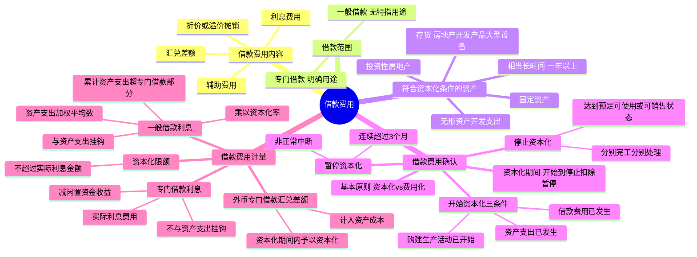

## 📍 章节定位

| 项目 | 信息 |
|------|------|
| **所属科目** | 📒 会计 |
| **难度等级** | ⭐⭐⭐ |
| **历年分值** | 3-4分 |
| **建议学时** | 4-5h |

## 📝 考情分析

本章是会计科目的重点章节，历年分值约 3-4 分，以客观题和计算分析题形式考查，主观题常结合固定资产、存货、所得税等在综合题中考查。命题热点集中在：借款费用的内容（利息、折价或溢价摊销、汇兑差额、辅助费用）、符合资本化条件的资产的范围（需经过相当长时间购建或生产才能达到预定可使用或可销售状态）、开始资本化的三个条件（资产支出已发生、借款费用已发生、购建或生产活动已开始）、暂停资本化的条件（非正常中断且连续超过 3 个月）、停止资本化的时点（达到预定可使用或可销售状态）、专门借款利息资本化金额的计算（实际利息费用减去闲置资金利息收入或投资收益）、一般借款利息资本化金额的计算（累计资产支出超过专门借款部分的资产支出加权平均数 × 资本化率）、外币专门借款汇兑差额的资本化处理。

考生需重点掌握：专门借款资本化金额**不与资产支出挂钩**（以实际利息费用减去闲置资金收益确定），一般借款资本化金额**与资产支出挂钩**（以资产支出加权平均数乘以资本化率确定）；非正常中断与正常中断的区分（正常中断如质量检查、可预见的不可抗力因素如冰冻季节，不暂停资本化）；分别建造、分别完工的处理（每部分独立可供使用则分别停止资本化，必须整体完工才可使用则整体完工时停止）；资本化金额不得超过当期实际发生的利息金额。

## 🧠 知识框架

## 📖 核心精讲

### 一、借款费用概述

#### （一）借款费用的内容

**借款费用**是企业因借入资金所付出的代价，包括：

| 内容 | 说明 |
|------|------|
| **利息费用** | 按实际利率法计算确定的利息费用，包括向银行或其他金融机构借入资金发生的利息、发行公司债券发生的利息、为购建或生产符合资本化条件的资产而发生的带息债务所承担的利息等 |
| **折价或溢价的摊销** | 发行债券等所发生的折价或溢价的摊销，实质是对债券票面利息的调整（将票面利率调整为实际利率） |
| **汇兑差额** | 由于汇率变动对外币借款本金及其利息的记账本位币金额所产生的影响金额 |
| **辅助费用** | 企业在借款过程中发生的手续费、佣金、印刷费等费用 |

**注意**：企业发生的**权益性融资费用**不包括在借款费用中。承租人根据租赁准则确认的融资费用属于借款费用。

#### （二）借款的范围

| 类型 | 定义 |
|------|------|
| **专门借款** | 为购建或者生产符合资本化条件的资产而专门借入的款项，通常有明确的用途，并具有标明该用途的借款合同 |
| **一般借款** | 除专门借款之外的借款，借入时用途通常没有特指用于符合资本化条件的资产的购建或生产 |

#### （三）符合资本化条件的资产

**符合资本化条件的资产**是指需要经过相当长时间的购建或者生产活动才能达到预定可使用或者可销售状态的资产，主要包括：

- **固定资产**（如自行建造的厂房、设备等）
- **投资性房地产**（如自行建造的出租用建筑物）
- **存货**（如房地产开发企业开发的用于对外出售的房地产开发产品、企业制造的用于对外出售的大型机械设备等）
- **无形资产开发支出**（在符合条件的情况下）

**"相当长时间"**是指为资产的购建或者生产所必需的时间，通常为**一年以上（含一年）**。

**土地使用权的特殊处理**：

| 情形 | 处理 |
|------|------|
| 自行开发建造厂房等建筑物 | 土地使用权与建筑物分别核算，土地使用权作为无形资产，通常已达到预定可使用状态，**不属于**符合资本化条件的资产；以建造支出（含土地使用权在房屋建造期间计入在建工程的摊销金额）为基础确定资本化金额 |
| 房地产开发企业建造对外出售的房屋建筑物 | 土地使用权计入所建造的房屋建筑物成本，建造的房屋建筑物满足符合资本化条件的资产定义，以包括土地使用权支出的建造成本为基础确定资本化金额 |

**不属于符合资本化条件的资产**：购入即可使用的资产；购入后需要安装但所需安装时间较短的资产；需要建造或生产但所需时间较短的资产；由于人为或故意等非正常因素导致购建或生产时间相当长的资产。

### 二、借款费用的确认

#### （一）确认基本原则

| 情形 | 处理 |
|------|------|
| 可直接归属于符合资本化条件的资产的购建或生产 | **资本化**，计入相关资产成本 |
| 其他借款费用 | **费用化**，在发生时根据发生额计入当期损益 |

**资本化期间**：从借款费用开始资本化时点到停止资本化时点的期间，**不包括**借款费用暂停资本化的期间。企业只有发生在资本化期间内的有关借款费用，才允许资本化。

#### （二）开始资本化的时点

借款费用允许开始资本化必须**同时满足三个条件**：

**1. 资产支出已经发生**

资产支出是指企业已经发生了支付现金、转移非现金资产或者承担带息债务形式的支出：

| 形式 | 说明 |
|------|------|
| 支付现金 | 用货币资金支付符合资本化条件的资产的购建或生产支出 |
| 转移非现金资产 | 将非现金资产直接用于符合资本化条件的资产的购建或生产 |
| 承担带息债务 | 为购建或生产符合资本化条件的资产所需物资而承担的带息应付款项（如带息应付票据）。**不带息债务**在偿付前不作为资产支出，只有实际偿付发生资源流出时才作为资产支出 |

**2. 借款费用已经发生**

企业已经发生了因购建或生产符合资本化条件的资产而专门借入款项的借款费用或者所占用的一般借款的借款费用。

**3. 为使资产达到预定可使用或者可销售状态所必要的购建或生产活动已经开始**

符合资本化条件的资产的实体建造或者生产工作已经开始（如主体设备安装、厂房实际开工建造等）。**不包括**仅仅持有资产但没有发生为改变资产形态而进行的实质性建造或生产活动。

**三个条件必须同时满足**，只要其中一个没有满足，借款费用就不能开始资本化。

#### （三）暂停资本化的时间

符合资本化条件的资产在购建或生产过程中发生**非正常中断**，且中断时间**连续超过 3 个月**的，应当暂停借款费用的资本化。

| 中断类型 | 定义 | 处理 |
|---------|------|------|
| **非正常中断** | 由于企业管理决策上的原因或其他不可预见的原因导致的中断（如质量纠纷、材料供应不及时、资金周转困难、安全事故、劳动纠纷等） | 暂停资本化，相关借款费用计入当期损益 |
| **正常中断** | 购建或生产达到预定可使用或可销售状态所必要的程序，或事先可预见的不可抗力因素导致的中断（如质量或安全检查、雨季或冰冻季节等） | **不暂停**资本化，借款费用继续资本化 |

#### （四）停止资本化的时点

购建或生产符合资本化条件的资产达到**预定可使用或者可销售状态**时，借款费用应当停止资本化。判断标准：

1. 实体建造（包括安装）或生产工作已经全部完成或实质上已经完成；
2. 所购建或生产的资产与设计要求、合同规定或生产要求相符或基本相符（即使有极个别不相符也不影响正常使用或销售）；
3. 继续发生在所购建或生产的资产上的支出金额很少或几乎不再发生。

**分别建造、分别完工的处理**：

| 情形 | 停止资本化时点 |
|------|-------------|
| 各部分分别完工，且每部分在其他部分继续建造过程中**可供使用或可对外销售**，且为使该部分达到预定可使用或可销售状态所必要的购建或生产活动**实质上已完成** | 各部分资产**分别停止**资本化 |
| 各部分分别完工，但必须等到**整体完工**后才可使用或对外销售 | **整体完工时**停止资本化 |

### 三、借款费用的计量

#### （一）利息资本化金额的确定

在借款费用资本化期间内，每一会计期间的利息资本化金额按以下规定确定：

**1. 专门借款**

> 专门借款利息资本化金额 = 专门借款当期实际发生的利息费用 - 闲置借款资金存入银行取得的利息收入或进行暂时性投资取得的投资收益

**特点**：专门借款资本化金额**不与资产支出挂钩**，以实际利息费用减去闲置资金收益确定。

**2. 一般借款**

> 一般借款利息资本化金额 = 累计资产支出超过专门借款部分的资产支出加权平均数 × 所占用一般借款的资本化率

其中：

- **累计资产支出加权平均数** = Σ（每笔资产支出金额 × 该笔资产支出在当期所占用的天数 ÷ 当期天数）
- **资本化率**（一般借款加权平均利率）= 一般借款当期实际发生的利息之和 ÷ 一般借款本金加权平均数

**特点**：一般借款资本化金额**与资产支出挂钩**，需要计算资产支出加权平均数。

**3. 资本化限额**

每一会计期间的利息资本化金额，**不应当超过**当期相关借款实际发生的利息金额。

**专门借款与一般借款的核心差异**：

| 项目 | 专门借款 | 一般借款 |
|------|---------|---------|
| 是否与资产支出挂钩 | 不挂钩 | 挂钩 |
| 资本化金额计算 | 实际利息费用 - 闲置资金收益 | 资产支出加权平均数 × 资本化率 |
| 闲置资金收益处理 | 从资本化金额中扣除 | 不涉及（一般借款无特定闲置资金概念） |

#### （二）外币专门借款汇兑差额资本化金额的确定

在借款费用资本化期间内，为购建符合资本化条件的资产而专门借入的**外币专门借款**本金及其利息的汇兑差额，应当予以**资本化**，计入符合资本化条件的资产的成本。

**注意**：外币**一般借款**（非专门借款）本金及其利息所产生的汇兑差额，应当作为**财务费用**，计入当期损益，不予资本化。

## 💡 典型例题

**【例题 1】（基础题，单选题）**

下列关于借款费用资本化的表述中，正确的是（　　）。
A. 企业发生的所有借款费用都应当予以资本化
B. 符合资本化条件的资产是指需要经过相当长时间购建或生产才能达到预定可使用或可销售状态的资产
C. 专门借款的利息资本化金额应当与资产支出相挂钩
D. 购建或生产过程中发生中断的，应当暂停借款费用资本化

**答案**：B

**解析**：A 错误，只有可直接归属于符合资本化条件的资产购建或生产的借款费用才资本化，其他借款费用费用化；B 正确，符合资本化条件的资产需经过相当长时间（通常一年以上）购建或生产；C 错误，专门借款利息资本化金额不与资产支出挂钩，以实际利息费用减去闲置资金收益确定；D 错误，只有**非正常中断**且连续超过 3 个月才暂停资本化，正常中断不暂停。

**【例题 2】（进阶题，单选题）**

下列各项中，属于非正常中断的是（　　）。
A. 工程建造到一定阶段必须暂停进行质量或安全检查
B. 某地区工程施工期间遇上可预见的冰冻季节导致施工停顿
C. 企业因与施工方发生质量纠纷导致工程中断
D. 工程因可预见的雨季导致施工停顿

**答案**：C

**解析**：A、B、D 均属于正常中断（达到预定可使用状态所必要的程序或可预见的不可抗力因素），相关借款费用可继续资本化；C 属于非正常中断（企业管理决策或其他不可预见原因），若连续超过 3 个月应暂停资本化。

**【例题 3】（计算题，专门借款利息资本化）**

ABC 公司于 2×24 年 1 月 1 日正式动工兴建一幢办公楼，工期预计 1 年 6 个月。公司为建造办公楼于 2×24 年 1 月 1 日专门借款 2000 万元，借款期限 3 年，年利率 6%；2×24 年 7 月 1 日又专门借款 4000 万元，借款期限 5 年，年利率 7%。借款利息按年支付。闲置借款资金均用于固定收益债券短期投资，月收益率 0.5%。

工程支出情况：2×24 年 1 月 1 日支出 1500 万元；2×24 年 7 月 1 日支出 2500 万元；2×25 年 1 月 1 日支出 1500 万元。办公楼于 2×25 年 6 月 30 日完工达到预定可使用状态。

要求：计算 2×24 年和 2×25 年（至 6 月 30 日）的利息资本化金额。

**答案**：

（1）资本化期间：2×24 年 1 月 1 日至 2×25 年 6 月 30 日。

（2）专门借款实际利息费用：
- 2×24 年 = 2000 × 6% + 4000 × 7% × 6/12 = 120 + 140 = 260（万元）
- 2×25 年 1-6 月 = 2000 × 6% × 6/12 + 4000 × 7% × 6/12 = 60 + 140 = 200（万元）

（3）闲置资金投资收益：
- 2×24 年：1 月 1 日支出 1500 万元，闲置 500 万元（6 个月）；7 月 1 日支出 2500 万元，闲置 2000 万元（6 个月）。收益 = 500 × 0.5% × 6 + 2000 × 0.5% × 6 = 15 + 60 = 75（万元）
- 2×25 年 1-6 月：闲置 500 万元（6 个月）。收益 = 500 × 0.5% × 6 = 15（万元）

（4）利息资本化金额：
- 2×24 年 = 260 - 75 = **185（万元）**
- 2×25 年 1-6 月 = 200 - 15 = **185（万元）**

**解析**：专门借款利息资本化金额不与资产支出挂钩，以实际利息费用减去闲置资金投资收益确定。

**【例题 4】（计算题，一般借款利息资本化）**

承例 3，假定 ABC 公司建造办公楼没有专门借款，占用的一般借款为：（1）向 A 银行长期贷款 2000 万元，年利率 6%；（2）发行公司债券 1 亿元，年利率 8%。全年按 360 天计算。

要求：计算 2×24 年的一般借款利息资本化金额。

**答案**：

（1）一般借款资本化率 = (2000 × 6% + 10000 × 8%) ÷ (2000 + 10000) = 920 ÷ 12000 = **7.67%**

（2）2×24 年累计资产支出加权平均数 = 1500 × 360/360 + 2500 × 180/360 = 1500 + 1250 = **2750（万元）**

（3）2×24 年利息资本化金额 = 2750 × 7.67% = **210.93（万元）**

（4）2×24 年实际利息费用 = 2000 × 6% + 10000 × 8% = 920（万元），资本化金额 210.93 万元不超过实际利息，可资本化。

**解析**：一般借款利息资本化金额与资产支出挂钩，以累计资产支出加权平均数乘以资本化率确定。资本化率为一般借款的加权平均利率。

**【例题 5】（综合题，专门借款与一般借款混合）**

承例 3、例 4，假定 ABC 公司为建造办公楼于 2×24 年 1 月 1 日专门借款 2000 万元，年利率 6%，除此无其他专门借款；建造过程中还占用了上述两笔一般借款。

要求：计算 2×24 年的利息资本化总额。

**答案**：

（1）专门借款利息资本化金额 = 2000 × 6% - 500 × 0.5% × 6 = 120 - 15 = **105（万元）**
（专门借款 2000 万元，1 月 1 日支出 1500 万元，闲置 500 万元 6 个月；7 月 1 日支出 2500 万元，其中占用专门借款 500 万元，占用一般借款 2000 万元）

（2）一般借款利息资本化金额：
- 2×24 年占用一般借款的资产支出加权平均数 = 2000 × 180/360 = 1000（万元）
- 一般借款利息资本化金额 = 1000 × 7.67% = **76.70（万元）**

（3）2×24 年利息资本化总额 = 105 + 76.70 = **181.70（万元）**

**解析**：当同时存在专门借款和一般借款时，先计算专门借款利息资本化金额（不与资产支出挂钩），再计算一般借款利息资本化金额（与资产支出挂钩，仅对超过专门借款部分计算）。

## 🎯 记忆口诀

- **借款费用四内容**："利息、折溢摊、汇兑、辅助"——利息费用、折价或溢价摊销、汇兑差额、辅助费用。
- **资本化条件资产**："相当长时间一年上，固定投资存货无形"——需经过相当长时间（一年以上）购建或生产的固定资产、投资性房地产、存货（如房地产开发产品）、无形资产开发支出。
- **开始资本化三条件**："支出发生、费用发生、活动开始"——资产支出已发生、借款费用已发生、购建或生产活动已开始，三者同时满足。
- **暂停资本化**："非正常中断超三月"——非正常中断且连续超过 3 个月暂停资本化；正常中断（质量检查、可预见冰冻雨季）不暂停。
- **停止资本化**："达到预定可使用或可销售"——资产达到预定可使用或可销售状态时停止；分别完工分别可用则分别停止，需整体完工则整体停止。
- **专门 vs 一般借款**："专门不挂钩减收益，一般挂钩乘率"——专门借款资本化金额不与资产支出挂钩，等于实际利息减闲置收益；一般借款资本化金额与资产支出挂钩，等于资产支出加权平均数乘以资本化率。
- **资本化限额**："不超实际利息"——每期资本化金额不超过当期实际发生的利息金额。
- **外币汇兑差额**："专门借款资本化，一般借款进费用"——外币专门借款汇兑差额资本化计入资产成本；外币一般借款汇兑差额计入财务费用。

## ✅ 同步练习

1. （基础题）借款费用的内容范围及符合资本化条件的资产的判断。提示：参见《必刷 550 题》第十章基础题。
2. （进阶题）开始资本化三个条件的判断，特别是资产支出已发生（含带息债务）的界定。提示：参见《必刷 550 题》第十章进阶题。
3. （易错题）非正常中断与正常中断的区分，暂停资本化的条件判断。提示：参见《必刷 550 题》第十章易错题。
4. （真题改编）专门借款与一般借款混合使用时利息资本化金额的计算，掌握先专门后一般的计算顺序。提示：参见《必刷 550 题》第十章真题。
5. 综合复习分别建造分别完工的停止资本化时点判断，以及外币专门借款汇兑差额的资本化处理。
