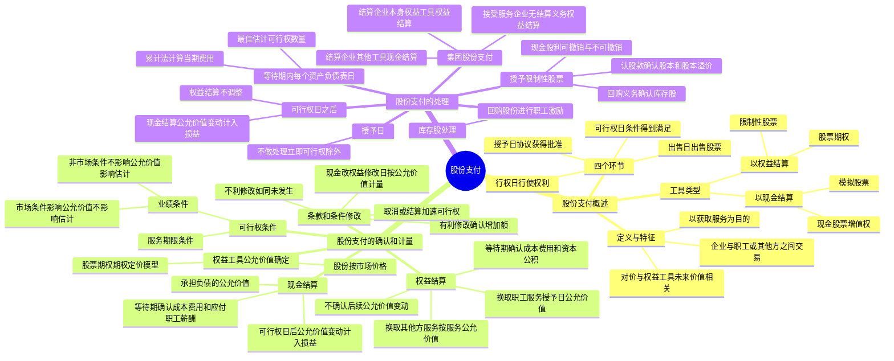

## 1. 章节定位

| 项目 | 信息 |
|------|------|
| 所属科目 | 会计 |
| 难度等级 | 4 |
| 历年分值 | 2-4 分 |
| 建议学时 | 4-6 小时 |
| 知识关联章节 | 第6章 长期股权投资（集团股份支付的长期股权投资确认）、第9章 职工薪酬（以现金结算的股份支付通过应付职工薪酬核算）、第13章 金融工具（权益工具公允价值计量）、第22章 金融工具列报（股份支付的列报）、第23章 合并财务报表（集团股份支付的合并抵销） |

## 2. 考情分析

本章是会计科目的中难度章节，内容相对独立但实务性较强。客观题出题频率较高，主观题常以等待期内各期费用的计算、权益结算与现金结算的区分处理为核心，并可与合并财务报表联动考查。

**命题规律**：客观题集中在股份支付的定义与特征、四个环节（授予日、可行权日、行权日、出售日）、可行权条件的分类（市场条件 vs 非市场条件）、条款修改的处理原则；主观题集中在等待期内各期成本费用的计算与账务处理、权益结算与现金结算的不同处理、集团股份支付的个别报表与合并报表处理。

**高频考点分布**：

1. **股份支付的定义与特征**：三个特征（企业与职工或其他方之间的交易、以获取服务为目的、对价与企业自身权益工具未来价值密切相关）。
2. **四个环节**：授予日（协议获得批准）、可行权日（可行权条件得到满足）、行权日（行使权利获取现金或权益工具）、出售日（股票持有人出售期权股票）。
3. **股份支付工具类型**：以权益结算（限制性股票、股票期权）；以现金结算（模拟股票、现金股票增值权）。
4. **权益结算的股份支付**：以授予日权益工具的公允价值计量，等待期内确认成本费用和资本公积（其他资本公积），不确认后续公允价值变动。
5. **现金结算的股份支付**：以企业承担负债的公允价值计量，等待期内确认成本费用和应付职工薪酬，可行权日后公允价值变动计入当期损益（公允价值变动损益）。
6. **可行权条件**：服务期限条件、业绩条件（市场条件、非市场条件）。市场条件和非可行权条件是否满足不影响企业对预计可行权情况的估计；非市场条件是否满足影响预计可行权情况的估计。
7. **条款和条件的修改**：有利修改（确认增加的公允价值）、不利修改（如同变更从未发生）、取消或结算（加速可行权处理）、现金改权益（修改日按权益工具公允价值计量）。
8. **集团股份支付**：结算企业以本身权益工具结算作为权益结算、否则作为现金结算；接受服务企业没有结算义务或授予本身权益工具作为权益结算、有结算义务且授予集团内其他企业权益工具作为现金结算。
9. **授予限制性股票**：收到认股款确认股本和股本溢价，同时就回购义务确认负债（库存股）；等待期内现金股利可撤销与不可撤销的不同处理。

**联动考查方式**：
- 与合并财务报表结合：集团股份支付的合并抵销分录；
- 与长期股权投资结合：结算企业确认对接受服务企业的长期股权投资；
- 与差错更正结合：错将权益结算按现金结算处理、错将市场条件作为非市场条件处理。

**备考建议**：
- 牢记权益结算（授予日公允价值、资本公积、不调整后续公允价值变动）与现金结算（负债公允价值、应付职工薪酬、后续重新计量计入损益）的核心区别；
- 区分市场条件（影响授予日公允价值计量、不影响可行权估计）与非市场条件（不影响授予日公允价值计量、影响可行权估计）；
- 掌握等待期内各期费用计算公式：当期费用 = 累计应确认费用 - 前期累计已确认费用；
- 牢记条款修改的处理原则：有利修改确认增加额、不利修改如同未发生、取消作为加速可行权。

## 3. 知识框架



## 4. 核心精讲

### 4.1 股份支付的定义与特征

**股份支付**，是"以股份为基础的支付"的简称，是指企业为获取职工和其他方提供服务而授予权益工具或者承担以权益工具为基础确定的负债的交易。

股份支付具有以下三个特征：

1. **股份支付是企业与职工或其他方之间发生的交易**。只有发生在企业与其职工或向企业提供服务的其他方之间的交易，才可能符合股份支付的定义。
2. **股份支付是以获取职工或其他方服务为目的的交易**。企业获取这些服务或权利的目的是用于其正常生产经营，不是转手获利等。
3. **股份支付交易的对价或其定价与企业自身权益工具未来的价值密切相关**。企业要么向职工支付其自身权益工具，要么向职工支付一笔现金，但其金额高低取决于结算时企业自身权益工具的公允价值。

### 4.2 股份支付的四个环节

| 环节 | 定义 | 要点 |
|------|------|------|
| **授予日** | 股份支付协议获得批准的日期 | "获得批准"指企业与职工或其他方就协议条款和条件已达成一致，该协议获得股东会或类似机构的批准 |
| **可行权日** | 可行权条件得到满足、职工或其他方具有从企业取得权益工具或现金权利的日期 | 从授予日至可行权日的时段称为"等待期"（又称"行权限制期"） |
| **行权日** | 职工和其他方行使权利、获取现金或权益工具的日期 | 一般在可行权日之后至期权到期日之前的可选择时段内行权 |
| **出售日** | 股票的持有人将行使期权所取得的期权股票出售的日期 | 行权日与出售日之间设立禁售期（国有控股上市公司不低于 2 年） |

**一次授予、分期行权**：每个批次是否可行权的结果通常相对独立，在会计处理时应将其作为同时授予的几个独立的股份支付计划，分别确定每个计划的等待期。

### 4.3 股份支付工具的主要类型

#### 4.3.1 以权益结算的股份支付

以权益结算的股份支付，是指企业为获取服务而以股份或其他权益工具作为对价进行结算的交易。最常用的工具有两类：

- **限制性股票**：职工或其他方按照股份支付协议规定的条款和条件，从企业获得一定数量的本企业股票。在一个确定的等待期内或满足特定业绩指标之前，职工出售股票要受到持续服务期限条款或业绩条件的限制。
- **股票期权**：企业授予职工或其他方在未来一定期限内以预先确定的价格和条件购买本企业一定数量股票的权利。

**第二类限制性股票**：激励对象在授予日无须出资购买；待满足可行权条件后，可以选择按原授予价格购买股票，也可以选择不缴纳认股款放弃取得相应股票。其实质是一项股票期权，属于以权益结算的股份支付交易。

#### 4.3.2 以现金结算的股份支付

以现金结算的股份支付，是指企业为获取服务而承担的以股份或其他权益工具为基础计算的交付现金或其他资产的义务的交易。最常用的工具有两类：

- **模拟股票**：与限制性股票运作原理相同，但用现金支付且不需实际授予和持有股票。
- **现金股票增值权**：与股票期权运作原理相同，但用现金支付且不需实际认购和持有股票。

### 4.4 股份支付的确认和计量原则

#### 4.4.1 权益结算的股份支付

| 情形 | 计量基础 | 确认处理 |
|------|---------|---------|
| 换取职工服务（等待期后可行权） | 授予日权益工具的公允价值 | 等待期内每个资产负债表日以最佳估计为基础，将当期取得的服务计入相关资产成本或当期费用，同时计入资本公积（其他资本公积），**不确认后续公允价值变动** |
| 换取职工服务（立即可行权） | 授予日权益工具的公允价值 | 授予日将取得的服务计入相关资产成本或当期费用，同时计入资本公积（其他资本公积） |
| 换取其他方服务 | 服务在取得日的公允价值（或权益工具在服务取得日的公允价值） | 计入相关资产成本或费用，同时计入资本公积 |

**权益工具公允价值无法可靠确定时的处理**：以内在价值计量，内在价值的变动计入当期损益。内在价值 = 交易对方有权认购或取得的股份的公允价值 - 按股份支付协议应支付的价格。

#### 4.4.2 现金结算的股份支付

企业应当在等待期内的每个资产负债表日，以对可行权情况的最佳估计为基础，按照企业承担负债的公允价值，将当期取得的服务计入相关资产成本或当期费用，同时计入负债（应付职工薪酬），并在结算前的每个资产负债表日和结算日对负债的公允价值重新计量，将其变动计入当期损益。

**权益结算与现金结算的核心区别**：

| 项目 | 权益结算 | 现金结算 |
|------|---------|---------|
| 计量基础 | 授予日权益工具公允价值 | 各资产负债表日负债公允价值 |
| 确认科目 | 资本公积（其他资本公积） | 应付职工薪酬 |
| 后续公允价值变动 | 不确认 | 可行权日后重新计量，计入公允价值变动损益 |
| 可行权日后 | 不调整已确认的成本费用和所有者权益 | 不再确认成本费用，仅确认公允价值变动 |

### 4.5 可行权条件的种类与处理

可行权条件是指能够确定企业是否得到职工或其他方提供的服务，且该服务使职工或其他方具有获取股份支付协议规定的权益工具或现金等权利的条件。可行权条件包括**服务期限条件**和**业绩条件**。

#### 4.5.1 市场条件与非市场条件

业绩条件具体包括市场条件和非市场条件：

| 类型 | 定义 | 对授予日公允价值的影响 | 对可行权估计的影响 |
|------|------|---------------------|-------------------|
| **市场条件** | 行权价格、可行权条件以及行权可能性与权益工具的市场价格相关的业绩条件（如股价上升至何种水平） | 应考虑市场条件的影响 | 市场条件是否得到满足**不影响**企业对预计可行权情况的估计 |
| **非市场条件** | 除市场条件之外的其他业绩条件（如达到最低盈利目标或销售目标） | 不考虑非市场条件的影响 | 非市场条件是否得到满足**影响**企业对预计可行权情况的估计 |

**关键原则**：对于可行权条件为业绩条件的股份支付，只要职工满足了其他所有非市场条件（如利润增长率、服务期限等），企业就应当确认已取得的服务。即使市场条件未得到满足，企业仍应确认已取得的服务。

#### 4.5.2 非可行权条件

非可行权条件是指不影响可行权条件的条款，如将部分年薪存入专门账户等。职工能够选择满足非可行权条件但在等待期未满足的，企业应将其作为授予权益工具的取消处理。

### 4.6 股份支付条件和条款的修改

#### 4.6.1 有利修改

| 修改类型 | 处理 |
|---------|------|
| 增加权益工具公允价值 | 按公允价值增加相应确认取得服务的增加（修改前后公允价值差额） |
| 增加权益工具数量 | 将增加的权益工具的公允价值确认为取得服务的增加 |
| 有利修改可行权条件（缩短等待期、取消非市场业绩条件） | 考虑修改后的可行权条件 |

#### 4.6.2 不利修改

| 修改类型 | 处理 |
|---------|------|
| 减少权益工具公允价值 | 继续以授予日公允价值为基础，不考虑公允价值的减少 |
| 减少权益工具数量 | 将减少部分作为已授予权益工具的取消处理 |
| 不利修改可行权条件（延长等待期、增加非市场业绩条件） | 不考虑修改后的可行权条件（如同变更从未发生） |

#### 4.6.3 取消或结算

企业在等待期内取消了所授予的权益工具或结算了所授予的权益工具（因未满足可行权条件而被取消的除外）：

1. 将取消或结算作为**加速可行权**处理，将原本应在剩余等待期内确认的金额立即计入当期损益，同时确认资本公积。
2. 取消或结算时支付给职工的所有款项均作为权益的回购处理，回购支付的金额高于该权益工具在回购日公允价值的部分，计入当期费用。
3. 如果授予新的权益工具替代被取消的权益工具，按修改处理；未认定为替代的，作为新授予的股份支付处理。

#### 4.6.4 现金结算修改为权益结算

在修改日，企业应当按照所授予权益工具当日的公允价值计量以权益结算的股份支付，将已取得的服务计入资本公积，同时终止确认以现金结算的股份支付在修改日已确认的负债，两者之间的差额计入当期损益。

### 4.7 股份支付的会计处理

#### 4.7.1 各环节的处理

| 时点 | 权益结算 | 现金结算 |
|------|---------|---------|
| **授予日** | 不做处理（立即可行权的按公允价值计入成本费用和资本公积） | 不做处理（立即可行权的按负债公允价值计入成本费用和应付职工薪酬） |
| **等待期内每个资产负债表日** | 按授予日公允价值和最佳估计可行权数量计算，计入成本费用和资本公积（其他资本公积） | 按负债公允价值和最佳估计可行权数量计算，计入成本费用和应付职工薪酬 |
| **可行权日后** | 不再调整已确认的成本费用和所有者权益 | 不再确认成本费用，负债公允价值变动计入公允价值变动损益 |
| **行权日** | 确认股本和股本溢价，同时结转等待期内确认的资本公积 | 支付现金，冲减应付职工薪酬 |

**等待期内费用计算公式（累计法）**：

当期应确认的费用 = 截至当期累计应确认的费用 - 前期累计已确认费用

截至当期累计应确认费用 = 预计可行权权益工具数量 × 授予日权益工具公允价值 × (截至当期累计的服务月数 / 等待期总月数)

#### 4.7.2 回购股份进行职工期权激励

企业以回购股份形式奖励本企业职工的，属于权益结算的股份支付：

1. 回购股份时：按回购股份的全部支出作为库存股处理，同时进行备查登记。
2. 等待期内：按照权益工具在授予日的公允价值，将取得的职工服务计入成本费用，同时增加资本公积（其他资本公积）。
3. 职工行权时：转销交付职工的库存股成本和等待期内资本公积累计金额，差额调整资本公积（股本溢价）。

#### 4.7.3 集团股份支付

企业集团内发生的股份支付交易，按照以下规定处理：

| 角色 | 条件 | 处理方式 |
|------|------|---------|
| 结算企业 | 以本身权益工具结算 | 权益结算的股份支付 |
| 结算企业 | 以其他工具结算 | 现金结算的股份支付 |
| 结算企业（是接受服务企业的投资者） | — | 按授予日权益工具或负债的公允价值确认对接受服务企业的长期股权投资，同时确认资本公积或负债 |
| 接受服务企业 | 没有结算义务或授予本企业权益工具 | 权益结算的股份支付 |
| 接受服务企业 | 有结算义务且授予集团内其他企业权益工具 | 现金结算的股份支付 |

**合并报表抵销**：结算企业确认的对接受服务企业的长期股权投资与接受服务企业确认的资本公积（其他资本公积）在合并报表中予以抵销。

#### 4.7.4 授予限制性股票的股权激励

**初始处理**：上市公司向职工发行限制性股票并履行了增资手续的：
- 按收到职工缴纳的认股款确认股本和资本公积（股本溢价）
- 同时就回购义务确认负债（作回购库存股处理）：借记"库存股"，贷记"其他应付款——限制性股票回购义务"

**等待期内现金股利的处理**：

| 现金股利性质 | 预计可解锁部分 | 预计不可解锁部分 |
|------------|--------------|----------------|
| **可撤销**（未达标回购则无法获得股利） | 作为利润分配处理，同时冲减回购义务（借记"其他应付款"，贷记"库存股"） | 冲减相关负债（借记"其他应付款"，贷记"应付股利"） |
| **不可撤销**（不论是否达标均可获得股利） | 作为利润分配处理（借记"利润分配"，贷记"应付股利"） | 计入当期成本费用（借记"管理费用"等，贷记"应付股利"） |

**解锁/回购处理**：
- 达到解锁条件无须回购：按解锁股票对应的负债账面价值借记"其他应付款"，按库存股账面价值贷记"库存股"，差额调整资本公积（股本溢价）。
- 未达到解锁条件需回购：按应支付金额借记"其他应付款"，贷记"银行存款"；同时注销股本和库存股，差额借记"资本公积——股本溢价"。

### 4.8 权益工具公允价值的确定

股份支付中权益工具的公允价值的确定，应当以市场价格为基础。一些股份和股票期权并没有一个活跃的交易市场，在这种情况下，应当考虑估值技术。

| 工具 | 公允价值确定方法 |
|------|---------------|
| **股份** | 按照其股份的市场价格计量；未公开交易的考虑条款和条件估计市场价格 |
| **股票期权** | 存在相同或类似可观察市场报价的按市场报价确定；不存在市场报价的采用期权定价模型确定 |

**期权定价模型应考虑的因素**：①期权的行权价格；②期权期限；③基础股份的现行价格；④股价的预计波动率；⑤股份的预计股利；⑥期权期限内的无风险利率。

## 5. 典型例题

### 例题 1：附服务年限条件的权益结算股份支付

A 公司为上市公司。2×17 年 1 月 1 日，公司向其 200 名管理人员每人授予 100 份股票期权，这些职员从 2×17 年 1 月 1 日起在该公司连续服务三年，即可以 5 元/股购买 100 股 A 公司股票。公司估计该期权在授予日的公允价值为 18 元。

第一年有 20 名职员离开，A 公司估计三年中离开的职员比例将达到 20%；第二年又有 10 名职员离开，公司将估计的离开比例修正为 15%；第三年又有 15 名职员离开。

**要求**：计算各年应确认的费用并编制账务处理。

**解答**：

| 年份 | 计算公式 | 当期费用（元） | 累计费用（元） |
|------|---------|--------------|--------------|
| 2×17 | 200 × 100 × (1-20%) × 18 × 1/3 | 96 000 | 96 000 |
| 2×18 | 200 × 100 × (1-15%) × 18 × 2/3 - 96 000 | 108 000 | 204 000 |
| 2×19 | 155 × 100 × 18 - 204 000 | 75 000 | 279 000 |

各年账务处理：
```
2×17 年 12 月 31 日：
借：管理费用                    96 000
    贷：资本公积——其他资本公积    96 000

2×18 年 12 月 31 日：
借：管理费用                    108 000
    贷：资本公积——其他资本公积    108 000

2×19 年 12 月 31 日：
借：管理费用                    75 000
    贷：资本公积——其他资本公积    75 000
```

全部 155 名职员在 2×20 年行权（面值 1 元）：
```
借：银行存款                    77 500        (155×100×5)
    资本公积——其他资本公积       279 000
    贷：股本                      15 500        (155×100×1)
        资本公积——股本溢价       341 000
```

**解析**：权益结算的股份支付，以授予日权益工具的公允价值（18 元）为基础计量，不确认后续公允价值变动。各年按累计法计算当期费用，每年根据最新信息调整预计可行权数量。行权时确认股本和股本溢价，同时结转等待期内确认的资本公积。

### 例题 2：现金结算的股份支付

2×20 年初，A 公司为其 200 名中层以上职员每人授予 100 份现金股票增值权，这些职员连续服务 3 年即可按照当时股价的增长幅度获得现金，该增值权应在 2×24 年 12 月 31 日之前行使。各年公允价值和支付现金如下：

| 年份 | 公允价值（元） | 支付现金（元） |
|------|-------------|-------------|
| 2×20 | 14 | — |
| 2×21 | 15 | — |
| 2×22 | 18 | 16 |
| 2×23 | 21 | 20 |
| 2×24 | 25 | — |

第一年有 20 名离开，估计还将有 15 名离开；第二年又有 10 名离开，估计还将有 10 名离开；第三年又有 15 名离开。第三年年末有 70 人行权，第四年年末有 50 人行权，第五年年末剩余 35 人行权。

**解答**：

| 年份 | 负债计算（1） | 支付现金（2） | 当期费用（3）=（1）+（2）-前期（1） |
|------|------------|------------|--------------------------------|
| 2×20 | (200-35)×100×14×1/3 = 77 000 | — | 77 000 |
| 2×21 | (200-40)×100×15×2/3 = 160 000 | — | 83 000 |
| 2×22 | (200-45-70)×100×18 = 153 000 | 70×100×16 = 112 000 | 105 000 |
| 2×23 | (200-45-70-50)×100×21 = 73 500 | 50×100×20 = 100 000 | 20 500 |
| 2×24 | 0 | 35×100×25 = 87 500 | 14 000 |

2×22 年账务处理（等待期最后一年，有行权）：
```
借：管理费用                    105 000
    贷：应付职工薪酬——股份支付      105 000

借：应付职工薪酬——股份支付      112 000
    贷：银行存款                  112 000
```

2×23 年账务处理（可行权日后，公允价值变动计入损益）：
```
借：公允价值变动损益              20 500
    贷：应付职工薪酬——股份支付       20 500

借：应付职工薪酬——股份支付      100 000
    贷：银行存款                  100 000
```

**解析**：现金结算的股份支付，各资产负债表日按负债的公允价值重新计量。等待期内（2×20-2×22）确认的成本费用计入管理费用；可行权日后（2×23-2×24）负债公允价值变动计入公允价值变动损益，不再确认成本费用。行权时支付现金，冲减应付职工薪酬。

### 例题 3：集团股份支付

2×22 年 1 月 20 日，甲公司股东会批准了一项股权激励方案，向集团内的 60 名管理人员每人授予 10 万份股票期权，这些人员连续服务 3 年可以 2 元/股购买甲公司普通股 10 万股。甲公司估计该期权在授予日的公允价值为每份 6 元。60 名员工中，40 名在甲公司任职，20 名在子公司乙公司任职。假定 3 年内没有员工离职。

**要求**：编制甲公司和乙公司 2×22 年个别财务报表的账务处理及合并报表抵销分录。

**解答**：

甲公司个别财务报表（确认自身员工费用 + 对乙公司长期股权投资）：
- 确认费用 = 40 × 10 × 6 / 3 = 800（万元）
- 确认长期股权投资 = 20 × 10 × 6 / 3 = 400（万元）

```
借：管理费用                    8 000 000
    长期股权投资——乙公司          4 000 000
    贷：资本公积——其他资本公积    12 000 000
```

乙公司个别财务报表（接受服务企业无结算义务，作为权益结算）：
- 确认费用 = 20 × 10 × 6 / 3 = 400（万元）

```
借：管理费用                    4 000 000
    贷：资本公积——其他资本公积    4 000 000
```

甲公司合并报表抵销分录：
```
借：资本公积——其他资本公积      4 000 000
    贷：长期股权投资——乙公司      4 000 000
```

**解析**：结算企业（甲公司）以本身权益工具结算，作为权益结算的股份支付处理。甲公司确认对乙公司的长期股权投资（按授予日公允价值和乙公司员工比例），同时确认资本公积。乙公司没有结算义务，也作为权益结算处理。合并报表中抵销甲公司的长期股权投资与乙公司的资本公积。

## 6. 记忆口诀

**股份支付记忆要点**：

一、定义三特征：企业职工之间交易、获取服务为目的、对价与权益工具价值相关。

二、四环节：授予（批准）、可行权（条件满足）、行权（行使权利）、出售（卖股票），中间有禁售期。

三、两类工具：权益结算（限制性股票+股票期权，确认资本公积）；现金结算（模拟股票+现金股票增值权，确认应付职工薪酬）。

四、计量核心：权益结算按授予日公允价值，不调整后续变动；现金结算按各期负债公允价值，可行权后变动计入损益。

五、可行权条件：服务期限+业绩条件（市场条件影响公允价值不影响估计，非市场条件不影响公允价值影响估计）。

六、条款修改：有利确认增加额，不利如同未发生，取消加速可行权，现金改权益按修改日公允价值。

七、等待期费用计算：累计法（累计应确认 - 前期已确认），每年调整最佳估计。

八、集团股份支付：结算企业本身权益工具按权益结算，否则按现金结算；接受服务企业无结算义务按权益结算。

九、限制性股票：认股款确认股本和股本溢价，回购义务确认库存股；现金股利可撤销冲减回购义务，不可撤销不可解锁部分计入费用。

## 7. 同步练习

**167.（单选题）** 下列各项附等待期的股份支付中，属于权益结算的股份支付的是（　）。

A. 授予研发人员模拟股票的计划
B. 以低于市价向员工出售限制性股票的计划
C. 授予高管人员以股票的市场价格支付价款的计划
D. 公司承诺达到销售目标时，按照股票市价涨幅无条件向销售人员支付奖励款的计划

---

**168.（单选题）** 2×08年1月1日，甲公司为其50名中层以上管理人员每人授予100份现金股票增值权，这些人员从2×08年1月1日起在甲公司连续服务满4年即可行权，可行权日为2×11年12月31日，根据股价的增长幅度获得现金，该股票增值权应在2×13年12月31日之前行使完毕。截至2×09年累积确认负债42 500元，2×09年末以前没有离职人员。在2×10年有4人离职，预计2×11年有2人离职，2×10年末该现金股票增值权的公允价值为15元，不考虑其他因素，该项股份支付对2×10年当期管理费用的影响金额和2×10年末该项负债的累计金额分别是（　）。

A. 13 750元，56 250元
B. 7 000元，49 500元
C. 75 000元，125 000元
D. 22 050元，225 000元

---

**169.（单选题）** 下列关于上市公司授予限制性股票的股权激励计划，在等待期内发放现金股利的会计处理的表述中，不正确的是（　）。

A. 在等待期内发放可撤销现金股利时，对于预计未来不可解锁限制性股票持有者，应分配给限制性股票持有者的现金股利应当冲减相关的负债
B. 在等待期内发放不可撤销现金股利时，对于预计未来不可解锁限制性股票持有者，应分配给限制性股票持有者的现金股利应当冲减相关的负债
C. 对于预计未来可解锁限制性股票持有者，上市公司应分配给限制性股票持有者的现金股利应当作为利润分配进行会计处理
D. 后续信息表明不可解锁限制性股票的数量与以前估计不同的，应当作为会计估计变更处理，直到解锁日预计不可解锁限制性股票的数量与实际未解锁限制性股票的数量一致

---

**170.（单选题）** 甲公司于2×22年初实施了一项权益结算的股份支付计划，向100名管理人员每人授予1万份的股票期权，约定自2×22年1月1日起，这些管理人员连续服务3年，即可以每股3元的价格购买1万份甲公司股票。授予日该股票期权的公允价值为每股5元。2×22年没有人离职，但是至2×23年12月31日，已有10名管理人员离职，预计未来期间无人离职，当日股票期权的公允价值为每股6元。2×24年4月20日，甲公司经股东会批准，将该项股份支付计划取消，同时以现金向未离职的员工进行补偿共计460万元。自2×24年初至取消股权激励计划时止，无人离职。不考虑其他因素，2×24年甲公司因上述股份支付影响损益的金额是（　）。

A. -80万元
B. -10万元
C. -160万元
D. -150万元

---

**171.（单选题）** 2×23年初，甲公司向200名管理人员每人授予1万份现金股票增值权，约定这些职工从2×23年1月1日起在该公司连续服务3年即可按照股价的增长幅度获得现金。甲公司估计，该增值权在2×23年末的公允价值为21元/份。2×24年12月31日，甲公司将向职工授予1万份现金股票增值权修改为授予1万份股票期权，同时约定这些职工从2×25年1月1日起在该公司连续服务2年，即可以每股10元购买1万股甲公司股票。该期权在2×24年12月31日的公允价值为30元/份。至2×24年末上述管理人员无人离职，且甲公司预计上述管理人员都将在服务期限内提供服务。假定不考虑其他因素。甲公司在2×24年12月31日应确认的费用为（　）。

A. 1 400万元
B. 1 600万元
C. 3 000万元
D. 2 600万元

---

**172.（单选题）** （2023年）甲公司通过二级市场回购股份以授予限制性股票的方式对员工进行股权激励。2×22年9月15日，甲公司股东会通过股权激励方案，确定授予价格，并授权董事会确定具体人员和股份数量，11月28日，董事会确定具体人员和股份数量，并与员工签订认股协议，12月10日，员工向甲公司支付认购款，2×23年1月25日，甲公司办理股权登记手续。甲公司该项股权激励授予日为（　）。

A. 2×22年9月15日
B. 2×22年11月28日
C. 2×22年12月10日
D. 2×23年1月25日

---

**173.（单选题）** 关于集团股份支付的处理，下列表述中不正确的是（　）。

A. 结算企业以其自身权益工具结算的，应当将该股份支付交易作为权益结算的股份支付进行会计处理
B. 接受服务企业没有结算义务的，应当将该股份支付交易作为权益结算的股份支付进行会计处理
C. 接受服务企业授予本企业职工的是其本身权益工具的，应当将该股份支付交易作为权益结算的股份支付进行会计处理
D. 接受服务企业具有结算义务并且授予本企业职工的是企业集团内其他企业权益工具的，应该将该股份支付作为权益结算的股份支付

---

**174.（单选题）** 2×22年3月16日，甲公司以1 000万元自市场回购本公司普通股股票，拟用于对高管人员进行股权激励。因甲公司的母公司乙公司于2×22年7月1日与甲公司签订了股权激励协议，甲公司暂未实施本公司的股权激励计划。根据乙公司与甲公司高管人员签订的股权激励协议，乙公司对甲公司的20名高管每人授予100万份乙公司的股票期权。授予日每份股票期权的公允价值为3元。行权条件为自授予日起高管人员在甲公司服务满3年，即可免费获得乙公司100万股普通股股票。至2×22年12月31日，甲公司没有高管人员离开，预计未来三年也不会有高管人员离开。不考虑其他因素，下列关于甲公司的会计处理中，正确的是（　）。

A. 回购本公司股票时应按实际支付的金额冲减资本公积1 000万元
B. 乙公司授予甲公司高管的股票期权，甲公司没有结算义务，作为权益结算的股份支付处理
C. 2×22年年末应确认管理费用2 000万元
D. 2×22年年末应确认资本公积2 000万元

---

**175.（多选题）** 下列关于市场条件和非市场条件对权益工具公允价值的确定影响，表述正确的有（　）。

A. 企业在确定权益工具在授予日的公允价值时，应考虑市场条件的影响，而不考虑非市场条件的影响
B. 市场条件是否得到满足，不影响企业对预计可行权情况的估计
C. 企业在确定权益工具在授予日的公允价值时，应考虑非市场条件的影响，而不考虑市场条件的影响
D. 非市场条件是否得到满足，不影响企业对预计可行权情况的估计

---

**176.（多选题）** 甲公司2×22年初向100名管理人员每人授予5 000份的股票期权，约定自2×22年1月1日起，这些管理人员连续服务3年，即可以每股5元的价格购买5 000股甲公司股票。2×22年，有4名管理人员离职，预计未来2年将有6名管理人员离职。2×23年，又有5名管理人员离职，预计未来1年将有1名管理人员离职。该项股票期权授予日的公允价值为每股6元，2×22年末公允价值为每股7元。2×23年初，甲公司该项股票期权的行权价格修改为每股3元，每份期权修改前的公允价值为7元，修改后为9元。不考虑其他因素，甲公司的下列处理中正确的有（　）。

A. 甲公司该项股权激励计划属于权益结算的股份支付，应按照授予日公允价值将当期取得的服务计入相关资产成本或当期费用
B. 2×22年末应确认的费用金额为90万元
C. 甲公司2×23年初对股票期权公允价值的修改属于有利修改，应当继续以2×22年确定的该权益工具在授予日的公允价值为基础，确认取得服务的金额
D. 2×23年末应确认的费用金额为135万元

---

**177.（多选题）** 20×5年1月1日，甲公司向其100名中层以上管理人员每人授予800份现金股票增值权，可行权日为20×8年12月31日，该增值权应在20×9年年末之前行使完毕。甲公司授予日权益工具市价为7元/份，截至20×6年末累积确认负债270 000元，截至20×7年末共有10人离职，20×7年末该现金股票增值权的公允价值为12元/份。20×7年12月31日，甲公司经董事会批准取消原授予管理人员的股权激励计划，同时以现金补偿原授予现金股票增值权且尚未离职的管理人员共计900 000元。不考虑其他因素，下列有关甲公司的处理中正确的有（　）。

A. 取消时应作为加速可行权处理
B. 取消时应当冲减原确认的成本费用
C. 取消时应当先计算20×7年应确认的管理费用234 000元
D. 取消时支付的金额高于该权益工具在回购日的公允价值的部分应计入管理费用，金额为36 000元

---

**178.（多选题）** 下列有关股份支付的表述中，错误的有（　）。

A. 对于授予后立即可行权的换取职工提供服务的权益结算的股份支付，应在授予日按照权益工具的公允价值，将取得的服务计入相关资产成本或当期费用，同时计入资本公积——股本溢价
B. 职工或其他方能够选择满足非可行权条件但在等待期未满足非可行权条件的，企业应当将其作为授予权益工具的取消处理
C. 以权益结算的股份支付换取其他方服务的，企业应优先选择权益工具在服务取得日的公允价值，将取得的服务计入相关成本费用
D. 对于现金结算的股份支付，企业在可行权日之后不再确认成本费用，负债公允价值的变动应当计入当期损益

---

**179.（多选题）** 上市公司甲公司设立员工持股平台（有限合伙企业）用于实施股权激励计划。甲公司实际控制人为持股平台的普通合伙人，同时为甲公司核心高管。除实际控制人以外的其他激励对象为有限合伙人。2×25年3月，持股平台合伙人以8元/股的价格认购甲公司向该平台增发的股份，股份设有4年限售期。协议约定，自授予日起，持股平台合伙人为公司服务满4年后可一次性解锁股份；有限合伙人于限售期内离职的，应当以10元/股的价格将其持有股份转让给普通合伙人。普通合伙人受让有限合伙人股份后，不享有受让股份对应的投票权和股利分配等受益权，且必须在4年限售期内以10元/股的价格再次将受让股份分配给员工持股平台的其他有限合伙人。不考虑其他因素，下列有关甲公司的处理中不正确的有（　）。

A. 普通合伙人受让股份构成股份支付，应确认相关费用
B. 普通合伙人受让股份属于代持行为，不构成新的股份支付，无需确认相关费用
C. 普通合伙人受让股份应确认为长期股权投资
D. 普通合伙人受让股份应确认为金融资产，并按公允价值计量

---

**180.（多选题）** （2024年）甲公司是乙公司的母公司，2×23年甲公司把乙公司的股权低价授予给乙公司的员工，乙公司没有结算义务。不考虑其他因素，对于上述股份支付，下列各公司2×23年资产负债表日会计处理的表述中，正确的有（　）。

A. 乙公司的个别报表按照授予日权益工具的公允价值计算应确认的资本公积
B. 甲公司的合并报表按照授予日权益工具的公允价值计算应确认的成本费用
C. 乙公司的个别报表按照授予日权益工具的公允价值计算应确认的成本费用
D. 甲公司的合并报表按照授予日权益工具的公允价值计算应确认的负债

---

**181.（多选题）** 2×23年1月1日，甲上市公司以非公开发行的方式向50名管理人员每人授予1万股自身股票，授予价格为10元/股。锁定期为3年，相关管理人员如果自授予日起为公司服务满3年，且公司年度净利润增长率不低于12%，可申请一次性解锁限制性股票。甲公司提供了两种方案，管理人员可以自由选择其中一种：方案一，激励对象在授予日按照授予价格出资购买限制性股票；待满足可行权条件后，解锁限制性股票；若未满足可行权条件，甲公司按照授予价格10元/股回购限制性股票。方案二，激励对象在授予日无须出资购买限制性股票；待满足可行权条件后，激励对象可以选择按授予价格10元/股购买公司增发的限制性股票，也可以选择不缴纳认股款，放弃取得相应股票。当日，有30名管理人员选择方案一，并支付了认购款项300万元，有20名管理人员选择方案二。不考虑其他因素，下列说法中不正确的有（　）。

A. 方案一的股份支付不属于权益结算的股份支付，方案二下股份支付属于权益结算的股份支付
B. 甲公司应在授予日针对方案一的股份支付确认回购义务，针对方案二的股份支付不需要确认回购义务
C. 方案一的股份支付属于限制性股票，方案二的股份支付实质上属于股票期权
D. 上述股份支付在授予日的公允价值一定是相等的

---

**182.（计算分析题）** 2×22年1月1日，乙公司为其100名中层以上管理人员每人授予100份现金股票增值权，这些人员从2×22年1月1日起必须在该公司连续服务3年，即可自2×24年12月31日起根据股价的增长幅度获得现金，该增值权应在2×26年12月31日之前行使完毕。乙公司估计，该增值权在负债结算之前的每一资产负债表日以及结算日的公允价值和可行权后的每份增值权现金支出额如下（单位：元）：

| 年份 | 公允价值 | 支付现金 |
|------|---------|---------|
| 2×22年 | 12 |  |
| 2×23年 | 14 |  |
| 2×24年 | 15 | 16 |
| 2×25年 | 20 | 18 |
| 2×26年 | 22 |  |

2×22年有10名管理人员离开乙公司，乙公司估计三年中还将有8名管理人员离开；2×23年又有6名管理人员离开公司，公司估计还将有6名管理人员离开；2×24年又有4名管理人员离开，有40人行使股票增值权取得了现金，2×25年有30人行使股票增值权取得了现金，2×26年有10人行使股票增值权取得了现金。

要求：计算2×22年至2×26年每年应确认的费用（或损益）、应付职工薪酬余额和支付的现金，并编制有关会计分录。

---

**183.（计算分析题）** （2024年）甲公司发生的有关交易或事项如下：

（1）2×21年6月30日，甲公司实施股权激励计划。甲公司通过增发新股授予100名上年考评结果为"优秀"或"良好"的员工每人1万股限制性股票，认购价格为每股3元，锁定期为3年，如果未来3年营业收入达到20亿元，即可解锁，若锁定期结束时无法达到约定的业绩指标，将由甲公司按原认购价格回购。甲公司普通股股票在2×21年6月30日的公允价值为每股6元。当日，该批员工全部认购，甲公司履行了相关增资手续。

（2）2×21年12月31日，甲公司预计未来3年营业收入很可能达到20亿元，预计相关员工在等待期内的累计离职率为5%；2×22年12月31日，甲公司预计未来很可能达到业绩指标，预计相关人员在等待期内的累计离职率为3%。

（3）2×23年由于市场变化，甲公司的产品质量出现下滑且预期至2×25年无法好转。2×23年12月31日，甲公司预计未来无法达到业绩指标。当日，上述股权计划内员工尚有97名在职，为了补偿这部分员工过去几年的贡献，甲公司于2×23年12月公布每人给予2万元的奖金，奖金于2×24年3月31日发放。

（4）2×23年11月30日，为了应对市场变化带来的经营压力，甲公司公布了两套人员精简的详细计划。一是对于上年考评结果为"不合格"的10名员工强制辞退。甲公司将根据劳动法给予每人8万元的补偿，预计于2×24年6月30日前支付完毕。截至2×23年12月31日有4名员工与甲公司签署了离职协议并办理了离职手续，其余6名尚未签署协议。二是对于上年考评结果为"待改进"的员工允许在3个月内选择自愿接受裁减。选择接受裁减的，每人可于2×24年6月30日前领取10万元的补偿，截至2×23年12月31日没有员工选择接受自愿裁减，甲公司预计3个月选择期到期时将有7名员工自愿接受裁减。

其他资料：不考虑相关税费及其他因素。

要求：（1）根据资料（1），编制甲公司2×21年6月30日与限制性股票相关的会计分录。（2）根据资料（1）和（2），分别计算甲公司2×21年度和2×22年度应确认的股份支付费用金额。（3）根据资料（1）至（3），分析说明甲公司2×23年12月31日限制性股票预计可行权的数量；分别计算甲公司2×23年度应确认与股权激励和奖金相关的费用金额。（4）根据资料（4），通过分析说明强制辞退计划和自愿接受裁减计划中，甲公司2×23年度分别应对多少名员工确认辞退福利费用，并分别计算应确认的辞退福利费用金额。

---

**184.（计算分析题）** （2024年）甲公司是一家上市公司，相关股权激励交易或事项如下：

（1）2×22年1月1日，甲公司经过股东会批准，与10名管理人员签订股权激励合同，授予每人30万份股票期权，股票的价格为32元/股。行权条件如下：第一批股票期权（10万份）：2×22年营业收入增长率达到10%仍在职的管理人员，可以以20元/股的价格购买甲公司10万股股票；第二批股票期权（20万份）：2×23年营业收入增长率达到15%仍在职的管理人员，可以以20元/股的价格购买甲公司20万股股票。行权有效期均为一年。授予日，第一批股票期权的公允价值为8元/份，第二批股票期权的公允价值为10元/份。2×22年营业收入增长率为15%，预计2×23年的营业收入增长率为20%。2×22年没有管理人员离职，预计未来期间也没有人离职。2×22年12月31日，股票的价格为30元/股。

（2）2×23年6月1日，10名管理人员每人行权了5万股，甲公司向每人增发5万股面值为1元的股份。

（3）2×23年9月1日，受市场条件的影响，甲公司营业收入的增长率预计为18%，但是股价出现大幅下跌且短期内不会停止。对第一批期权未行使的部分和第二批期权进行了取消处理，等到未来股价上涨再制定其他股权激励计划。

其他资料：①根据企业所得税的规定，等待期确认的股权激励费用不得税前扣除，股权激励计划行使后，可以根据实际行权时股票的公允价值与行权价格之间的差额进行税前扣除；②甲公司适用的企业所得税税率为25%，假定甲公司未来期间很可能获得足够的应纳税所得额用来抵扣可抵扣暂时性差异，仅要求（1）需要考虑企业所得税的处理；③不考虑其他因素。

要求：（1）根据资料（1），计算2×22年12月31日上述股权激励计划甲公司需要确认的费用金额和应确认的递延所得税资产金额，并编制2×22年年末相关的会计分录。（2）根据资料（2），编制2×23年6月1日管理人员行权时的会计分录。（3）说明2×23年9月1日股权激励计划取消的会计处理，并编制2×23年相关的会计分录。

---

**185.（计算分析题）** （2023年）2×20年至2×22年，甲公司发生与股权激励相关的交易和事项如下：

（1）2×20年7月1日，甲公司向100名管理人员每人授予1万份甲公司的股票期权，其中60人在甲公司任职，40人在乙公司任职。乙公司是甲公司的子公司，被授予期权的管理人员从2×20年7月1日起工作满2年后，可以按每股8元的价格购买甲公司1万股股票。当日，每份期权的公允价值为16元。2×20年7月至12月，甲公司有5名管理人员离职，预计剩余等待期内还有5名管理人员离职，乙公司无人离职，预计剩余等待期内离职率为0。

（2）2×21年7月1日，甲公司员工王某认为约定的行权价较高，向甲公司声明不再参与该计划，并与甲公司签订退出股权激励协议，但王某仍在甲公司任职。2×21年度，甲公司有3名管理人员离职，预计剩余等待期内还有2名管理人员离职，乙公司无人离职，预计剩余等待期内离职率为0。

（3）2×22年1月至6月，甲公司与乙公司均无人离职。2×22年6月30日，等待期满，86名管理人员行权，甲公司收到认股款并存入银行，其他管理人员主动放弃行权。

要求：（1）根据资料（1），分别判断在甲公司与乙公司个别财务报表、甲公司编制的合并财务报表中该股权激励属于权益结算的股份支付还是现金结算的股份支付，并说明理由。（2）根据资料（1），分别计算2×20年度甲公司和乙公司个别财务报表中应确认的成本费用；分别编制甲公司与乙公司2×20年度相关的会计分录。（3）根据资料（1）和（2），说明甲公司对王某退出股权激励计划的会计处理方法及其理由；计算2×21年度甲公司个别财务报表应确认的成本费用。（4）根据上述资料，判断甲公司合并财务报表中，对放弃行权的管理人员是否调整已确认的费用并说明理由，计算2×22年度甲公司编制的合并财务报表应确认的费用，并编制甲公司个别财务报表与管理人员行权相关的会计分录。

---

**186.（综合题）** 2×22年度，甲公司发生了如下交易或事项：

（1）甲公司对其20名管理人员和50名销售人员进行股权激励计划，主要内容如下：第一，管理人员自2×22年4月1日开始在甲公司工作满3年，每人方可无偿获得甲公司自身的10万股股票。4月1日，甲公司为进行该股权激励计划回购2 000万股股票，共支付价款18 000万元。截至2×22年年末，没有管理人员离职，甲公司预计三年内的职工离职率为5%，股票在授予日的市场价格为每股9元。第二，甲公司2×22年1月1日授予其销售人员每人5万份现金股票增值权，达到可行权条件后可以行权获得相应的现金。第一年年末的可行权条件为销售业绩增长率达到10%；第二年年末的可行权条件为销售业绩两年平均增长8%；第三年年末的可行权条件为销售业绩三年平均增长6%。该期权在2×22年1月1日的公允价值为每份20元。2×22年12月31日，销售业绩增长了8%，同时有2名销售人员离开，企业预计2×23年将以同样速度增长，因此预计将于2×23年12月31日可行权。甲公司预计将来还会有5人离职。该期权在2×22年年末的公允价值为每份12元。

（2）甲公司向其200名生产工人每人授予2万份股票期权，约定这些人员从2×22年4月1日起在甲公司连续服务满4年即可以每份5元的价格购买甲公司新发行的2万股股票。当年，没有职工离职，且甲公司预计将来也不会有生产工人离职。该股票期权在授予日的公允价值为每份8元。假定生产工人所生产的产品至年末全部未对外出售。

（3）甲公司当年实现的净利润为12 000万元（假定全部是归属于普通股股东的净利润）。甲公司2×22年期初发行在外普通股股数为5 000万股。2×22年4月到12月甲公司股票的平均市场价格为每股10元。本期未发生其他股票变动。假定不考虑其他因素。

要求：（1）根据资料（1），编制甲公司回购股票的分录。（2）根据资料（1），判断甲公司对管理人员和销售人员进行股份支付的类型，并说明理由；计算2×22年末应确认的成本费用，并编制相关的会计分录。（3）根据资料（2），计算甲公司2×22年年末应确认的成本费用金额，并编制相关的会计分录。（4）根据上述资料计算甲公司2×22年的基本每股收益和稀释每股收益。

**练习答案**：

167. B【解析】以权益结算的股份支付最常用的工具是限制性股票和股票期权；以现金结算的股份支付最常用的工具是模拟股票和现金股票增值权，选项A错误；选项C、D最终支付的是现金，不属于权益结算的股份支付。
168. B【解析】2×10年末确认负债（或成本费用）累计数=15×（50-4-2）×100×3/4=49 500（元），对2×10年当期管理费用的影响金额=49 500-42 500=7 000（元）。
169. B【解析】等待期内发放不可撤销现金股利时，对于预计未来不可解锁限制性股票持有者，应分配给限制性股票持有者的现金股利应当计入当期成本费用（管理费用等），而非冲减负债，选项B不正确。
170. C【解析】至2×23年末累计应确认的费用=5×1×（100-10）×2/3=300（万元）；2×24年4月20日取消时按加速可行权处理，应确认费用=5×1×（100-10）×3/3-300=150（万元）；现金补偿460万元高于回购日公允价值450万元的部分10万元计入管理费用。影响损益=-150-10=-160（万元）。
171. B【解析】2×23年12月31日应确认的费用和负债=200×1×21×1/3=1 400（万元）；2×24年12月31日现金结算改为权益结算，按修改日公允价值确认当期服务=200×1×30×2/4=3 000（万元），同时终止确认负债1 400万元，差额计入当期损益，应确认费用=3 000-1 400=1 600（万元）。
172. B【解析】授予日是指股份支付协议获得股东会批准的日期；但股东会批准并授权董事会后，董事会确定具体激励对象及股份数量并与员工沟通达成一致的日期（2×22年11月28日）为授予日。
173. D【解析】接受服务企业具有结算义务并且授予本企业职工的是企业集团内其他企业权益工具的，应当将该股份支付作为现金结算的股份支付处理，选项D不正确。
174. B【解析】回购股票按实际支付的金额计入库存股，选项A错误；甲公司没有结算义务，作为权益结算的股份支付处理，选项B正确；2×22年年末应确认管理费用=20×100×3×1/3×6/12=1 000（万元），贷记"资本公积——其他资本公积"，选项C、D错误。
175. AB【解析】确定权益工具授予日公允价值时应考虑市场条件和非可行权条件的影响，不考虑非市场条件的影响；市场条件是否满足不影响预计可行权情况的估计，非市场条件是否满足影响预计可行权情况的估计。选项A、B正确。
176. ABD【解析】2×22年末应确认费用=（100-4-6）×0.5×6×1/3=90（万元），选项B正确；2×23年初修改属于有利修改，应按权益工具公允价值的增加额确认取得服务的增加，选项C错误；2×23年末应确认费用=（100-4-5-1）×0.5×6×2/3+（100-4-5-1）×0.5×（9-7）×1/2-90=135（万元），选项D正确。
177. AD【解析】20×7年应确认费用=（100-10）×800×12×4/4-270 000=594 000（元），选项C错误；取消时作为加速可行权处理，不冲减原确认的成本费用，选项B错误；回购支付的金额高于回购日公允价值的部分36 000元计入管理费用，选项D正确。
178. AC【解析】选项A，授予后立即可行权的权益结算股份支付，应计入"资本公积——其他资本公积"，而非股本溢价；选项C，以权益结算的股份支付换取其他方服务的，应优先选择其他方服务在取得日的公允价值。
179. ACD【解析】普通合伙人受让股份后不享有投票权和股利分配权，且必须在限售期内以受让价格再次分配股份，表明其仅为代持人，该交易不符合股份支付的定义，不构成新的股份支付，无需确认相关费用，选项B正确，选项A、C、D不正确。
180. ABC【解析】甲公司授予乙公司员工的是乙公司的权益工具，甲公司在个别报表中作为现金结算的股份支付处理；乙公司没有结算义务，在个别报表中作为权益结算的股份支付处理；合并报表层面因授予的是集团自身的权益工具，作为权益结算处理，确认成本费用和资本公积，选项A、B、C正确。
181. AD【解析】两种方案均属于以权益结算的股份支付（以其自身股票结算），选项A不正确；方案二实质上属于股票期权，甲公司不需要在授予日确认回购义务，选项B、C正确；两种方案在授予日股份的公允价值不一定相等，选项D不正确。
182. 【解析】（1）2×22年：费用=3.28万元（(100-10-8)×100×12×1/3/10 000），借"管理费用"，贷"应付职工薪酬——股份支付"。（2）2×23年：余额=(100-10-6-6)×100×14×2/3/10 000=7.28（万元），当期费用=7.28-3.28=4（万元）。（3）2×24年：支付现金=40×100×16/10 000=6.4（万元），余额=(100-10-6-4-40)×100×15/10 000=6（万元），当期费用=6+6.4-7.28=5.12（万元）。（4）2×25年：支付现金=30×100×18/10 000=5.4（万元），余额=(100-10-6-4-40-30)×100×20/10 000=2（万元），发生额=2+5.4-6=1.4（万元），确认公允价值变动损益-1.4万元。（5）2×26年：支付现金=10×100×22/10 000=2.2（万元），余额为0，发生额=0+2.2-2=0.2（万元），确认公允价值变动损益-0.2万元。
183. 【解析】（1）2×21年6月30日：借"银行存款300"，贷"股本100、资本公积——股本溢价200"；借"库存股300"，贷"其他应付款300"。（2）2×21年费用=100×（1-5%）×1×（6-3）×6/36=47.5（万元）；2×22年费用=100×（1-3%）×1×（6-3）×18/36-47.5=98（万元）。（3）因预计无法达到业绩指标（非市场条件），2×23年12月31日限制性股票预计可行权数量为0；2×23年费用=97×2-47.5-98=48.5（万元）。（4）强制辞退计划10名×8=80（万元）；自愿裁减计划预计7名×10=70（万元）。
184. 【解析】（1）2×22年应确认费用=10×10×8+10×20×10×1/2=1 800（万元）；未来期间可税前扣除金额中归属于本期部分=10×10×（30-20）+10×20×（30-20）×1/2=2 000（万元），递延所得税资产=2 000×25%=500（万元）。（2）行权时分录：借"银行存款400、资本公积——其他资本公积1 000"，贷"股本50、资本公积——股本溢价1 350"。（3）取消的部分作为加速可行权处理，立即确认尚未确认的期权费用=10×10×8+10×20×10-1 800=1 000（万元）。
185. 【解析】（1）甲公司和乙公司个别报表、甲公司合并报表中均属于权益结算的股份支付（授予的是集团内权益工具，乙公司无结算义务）。（2）甲公司个别报表费用=(60-5-5)×1×16×6/24=200（万元），乙公司个别报表费用=40×1×16×6/24=160（万元）。（3）王某退出属于股权激励计划的取消，应作为加速可行权处理，将剩余等待期内应确认的金额立即计入当期损益并确认资本公积；2×21年度甲公司应确认费用=1×1×16+（60-5-3-2-1）×1×16×18/24-200=404（万元）。（4）放弃行权不属于未满足可行权条件，不调整已确认的费用；2×22年合并报表应确认费用=（100-5-3）×1×16-200-404-40×1×16×18/24=388（万元）；行权分录：借"银行存款688、资本公积——其他资本公积1 472"，贷"股本86、资本公积——股本溢价2 074"。
186. 【解析】（1）借"库存股18 000"，贷"银行存款18 000"。（2）对管理人员属于权益结算：费用=20×（1-5%）×10×9×1/3×9/12=427.5（万元），借"管理费用"，贷"资本公积——其他资本公积"；对销售人员属于现金结算：费用=（50-2-5）×5×12×1/2=1 290（万元），借"销售费用"，贷"应付职工薪酬——股份支付"。（3）生产工人费用=200×2×8×1/4×9/12=600（万元），计入生产成本。（4）发行在外普通股加权平均数=5 000-2 000×9/12=3 500（万股），基本每股收益=12 000/3 500≈3.43（元/股）；20名管理人员期权行权价格=0+9×27/36=6.75（元），调整增加的股数=20×10-20×10×6.75/10=65（万股），稀释每股收益=12 000/（3 500+65×9/12）≈3.38（元/股）。
