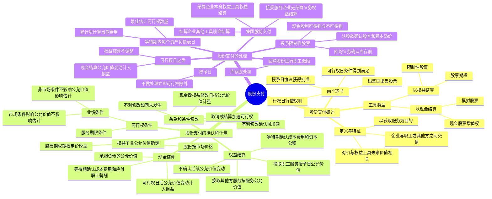

## 1. 章节定位

| 项目 | 信息 |
|------|------|
| 所属科目 | 会计 |
| 难度等级 | 4 |
| 历年分值 | 2-4 分 |
| 建议学时 | 4-6 小时 |
| 知识关联章节 | 第6章 长期股权投资（集团股份支付的长期股权投资确认）、第9章 职工薪酬（以现金结算的股份支付通过应付职工薪酬核算）、第13章 金融工具（权益工具公允价值计量）、第22章 金融工具列报（股份支付的列报）、第23章 合并财务报表（集团股份支付的合并抵销） |

## 2. 考情分析

本章是会计科目的中难度章节，内容相对独立但实务性较强。客观题出题频率较高，主观题常以等待期内各期费用的计算、权益结算与现金结算的区分处理为核心，并可与合并财务报表联动考查。

**命题规律**：客观题集中在股份支付的定义与特征、四个环节（授予日、可行权日、行权日、出售日）、可行权条件的分类（市场条件 vs 非市场条件）、条款修改的处理原则；主观题集中在等待期内各期成本费用的计算与账务处理、权益结算与现金结算的不同处理、集团股份支付的个别报表与合并报表处理。

**高频考点分布**：

1. **股份支付的定义与特征**：三个特征（企业与职工或其他方之间的交易、以获取服务为目的、对价与企业自身权益工具未来价值密切相关）。
2. **四个环节**：授予日（协议获得批准）、可行权日（可行权条件得到满足）、行权日（行使权利获取现金或权益工具）、出售日（股票持有人出售期权股票）。
3. **股份支付工具类型**：以权益结算（限制性股票、股票期权）；以现金结算（模拟股票、现金股票增值权）。
4. **权益结算的股份支付**：以授予日权益工具的公允价值计量，等待期内确认成本费用和资本公积（其他资本公积），不确认后续公允价值变动。
5. **现金结算的股份支付**：以企业承担负债的公允价值计量，等待期内确认成本费用和应付职工薪酬，可行权日后公允价值变动计入当期损益（公允价值变动损益）。
6. **可行权条件**：服务期限条件、业绩条件（市场条件、非市场条件）。市场条件和非可行权条件是否满足不影响企业对预计可行权情况的估计；非市场条件是否满足影响预计可行权情况的估计。
7. **条款和条件的修改**：有利修改（确认增加的公允价值）、不利修改（如同变更从未发生）、取消或结算（加速可行权处理）、现金改权益（修改日按权益工具公允价值计量）。
8. **集团股份支付**：结算企业以本身权益工具结算作为权益结算、否则作为现金结算；接受服务企业没有结算义务或授予本身权益工具作为权益结算、有结算义务且授予集团内其他企业权益工具作为现金结算。
9. **授予限制性股票**：收到认股款确认股本和股本溢价，同时就回购义务确认负债（库存股）；等待期内现金股利可撤销与不可撤销的不同处理。

**联动考查方式**：
- 与合并财务报表结合：集团股份支付的合并抵销分录；
- 与长期股权投资结合：结算企业确认对接受服务企业的长期股权投资；
- 与差错更正结合：错将权益结算按现金结算处理、错将市场条件作为非市场条件处理。

**备考建议**：
- 牢记权益结算（授予日公允价值、资本公积、不调整后续公允价值变动）与现金结算（负债公允价值、应付职工薪酬、后续重新计量计入损益）的核心区别；
- 区分市场条件（影响授予日公允价值计量、不影响可行权估计）与非市场条件（不影响授予日公允价值计量、影响可行权估计）；
- 掌握等待期内各期费用计算公式：当期费用 = 累计应确认费用 - 前期累计已确认费用；
- 牢记条款修改的处理原则：有利修改确认增加额、不利修改如同未发生、取消作为加速可行权。

## 3. 知识框架



## 4. 核心精讲

### 4.1 股份支付的定义与特征

**股份支付**，是"以股份为基础的支付"的简称，是指企业为获取职工和其他方提供服务而授予权益工具或者承担以权益工具为基础确定的负债的交易。

股份支付具有以下三个特征：

1. **股份支付是企业与职工或其他方之间发生的交易**。只有发生在企业与其职工或向企业提供服务的其他方之间的交易，才可能符合股份支付的定义。
2. **股份支付是以获取职工或其他方服务为目的的交易**。企业获取这些服务或权利的目的是用于其正常生产经营，不是转手获利等。
3. **股份支付交易的对价或其定价与企业自身权益工具未来的价值密切相关**。企业要么向职工支付其自身权益工具，要么向职工支付一笔现金，但其金额高低取决于结算时企业自身权益工具的公允价值。

### 4.2 股份支付的四个环节

| 环节 | 定义 | 要点 |
|------|------|------|
| **授予日** | 股份支付协议获得批准的日期 | "获得批准"指企业与职工或其他方就协议条款和条件已达成一致，该协议获得股东会或类似机构的批准 |
| **可行权日** | 可行权条件得到满足、职工或其他方具有从企业取得权益工具或现金权利的日期 | 从授予日至可行权日的时段称为"等待期"（又称"行权限制期"） |
| **行权日** | 职工和其他方行使权利、获取现金或权益工具的日期 | 一般在可行权日之后至期权到期日之前的可选择时段内行权 |
| **出售日** | 股票的持有人将行使期权所取得的期权股票出售的日期 | 行权日与出售日之间设立禁售期（国有控股上市公司不低于 2 年） |

**一次授予、分期行权**：每个批次是否可行权的结果通常相对独立，在会计处理时应将其作为同时授予的几个独立的股份支付计划，分别确定每个计划的等待期。

### 4.3 股份支付工具的主要类型

#### 4.3.1 以权益结算的股份支付

以权益结算的股份支付，是指企业为获取服务而以股份或其他权益工具作为对价进行结算的交易。最常用的工具有两类：

- **限制性股票**：职工或其他方按照股份支付协议规定的条款和条件，从企业获得一定数量的本企业股票。在一个确定的等待期内或满足特定业绩指标之前，职工出售股票要受到持续服务期限条款或业绩条件的限制。
- **股票期权**：企业授予职工或其他方在未来一定期限内以预先确定的价格和条件购买本企业一定数量股票的权利。

**第二类限制性股票**：激励对象在授予日无须出资购买；待满足可行权条件后，可以选择按原授予价格购买股票，也可以选择不缴纳认股款放弃取得相应股票。其实质是一项股票期权，属于以权益结算的股份支付交易。

#### 4.3.2 以现金结算的股份支付

以现金结算的股份支付，是指企业为获取服务而承担的以股份或其他权益工具为基础计算的交付现金或其他资产的义务的交易。最常用的工具有两类：

- **模拟股票**：与限制性股票运作原理相同，但用现金支付且不需实际授予和持有股票。
- **现金股票增值权**：与股票期权运作原理相同，但用现金支付且不需实际认购和持有股票。

### 4.4 股份支付的确认和计量原则

#### 4.4.1 权益结算的股份支付

| 情形 | 计量基础 | 确认处理 |
|------|---------|---------|
| 换取职工服务（等待期后可行权） | 授予日权益工具的公允价值 | 等待期内每个资产负债表日以最佳估计为基础，将当期取得的服务计入相关资产成本或当期费用，同时计入资本公积（其他资本公积），**不确认后续公允价值变动** |
| 换取职工服务（立即可行权） | 授予日权益工具的公允价值 | 授予日将取得的服务计入相关资产成本或当期费用，同时计入资本公积（其他资本公积） |
| 换取其他方服务 | 服务在取得日的公允价值（或权益工具在服务取得日的公允价值） | 计入相关资产成本或费用，同时计入资本公积 |

**权益工具公允价值无法可靠确定时的处理**：以内在价值计量，内在价值的变动计入当期损益。内在价值 = 交易对方有权认购或取得的股份的公允价值 - 按股份支付协议应支付的价格。

#### 4.4.2 现金结算的股份支付

企业应当在等待期内的每个资产负债表日，以对可行权情况的最佳估计为基础，按照企业承担负债的公允价值，将当期取得的服务计入相关资产成本或当期费用，同时计入负债（应付职工薪酬），并在结算前的每个资产负债表日和结算日对负债的公允价值重新计量，将其变动计入当期损益。

**权益结算与现金结算的核心区别**：

| 项目 | 权益结算 | 现金结算 |
|------|---------|---------|
| 计量基础 | 授予日权益工具公允价值 | 各资产负债表日负债公允价值 |
| 确认科目 | 资本公积（其他资本公积） | 应付职工薪酬 |
| 后续公允价值变动 | 不确认 | 可行权日后重新计量，计入公允价值变动损益 |
| 可行权日后 | 不调整已确认的成本费用和所有者权益 | 不再确认成本费用，仅确认公允价值变动 |

### 4.5 可行权条件的种类与处理

可行权条件是指能够确定企业是否得到职工或其他方提供的服务，且该服务使职工或其他方具有获取股份支付协议规定的权益工具或现金等权利的条件。可行权条件包括**服务期限条件**和**业绩条件**。

#### 4.5.1 市场条件与非市场条件

业绩条件具体包括市场条件和非市场条件：

| 类型 | 定义 | 对授予日公允价值的影响 | 对可行权估计的影响 |
|------|------|---------------------|-------------------|
| **市场条件** | 行权价格、可行权条件以及行权可能性与权益工具的市场价格相关的业绩条件（如股价上升至何种水平） | 应考虑市场条件的影响 | 市场条件是否得到满足**不影响**企业对预计可行权情况的估计 |
| **非市场条件** | 除市场条件之外的其他业绩条件（如达到最低盈利目标或销售目标） | 不考虑非市场条件的影响 | 非市场条件是否得到满足**影响**企业对预计可行权情况的估计 |

**关键原则**：对于可行权条件为业绩条件的股份支付，只要职工满足了其他所有非市场条件（如利润增长率、服务期限等），企业就应当确认已取得的服务。即使市场条件未得到满足，企业仍应确认已取得的服务。

#### 4.5.2 非可行权条件

非可行权条件是指不影响可行权条件的条款，如将部分年薪存入专门账户等。职工能够选择满足非可行权条件但在等待期未满足的，企业应将其作为授予权益工具的取消处理。

### 4.6 股份支付条件和条款的修改

#### 4.6.1 有利修改

| 修改类型 | 处理 |
|---------|------|
| 增加权益工具公允价值 | 按公允价值增加相应确认取得服务的增加（修改前后公允价值差额） |
| 增加权益工具数量 | 将增加的权益工具的公允价值确认为取得服务的增加 |
| 有利修改可行权条件（缩短等待期、取消非市场业绩条件） | 考虑修改后的可行权条件 |

#### 4.6.2 不利修改

| 修改类型 | 处理 |
|---------|------|
| 减少权益工具公允价值 | 继续以授予日公允价值为基础，不考虑公允价值的减少 |
| 减少权益工具数量 | 将减少部分作为已授予权益工具的取消处理 |
| 不利修改可行权条件（延长等待期、增加非市场业绩条件） | 不考虑修改后的可行权条件（如同变更从未发生） |

#### 4.6.3 取消或结算

企业在等待期内取消了所授予的权益工具或结算了所授予的权益工具（因未满足可行权条件而被取消的除外）：

1. 将取消或结算作为**加速可行权**处理，将原本应在剩余等待期内确认的金额立即计入当期损益，同时确认资本公积。
2. 取消或结算时支付给职工的所有款项均作为权益的回购处理，回购支付的金额高于该权益工具在回购日公允价值的部分，计入当期费用。
3. 如果授予新的权益工具替代被取消的权益工具，按修改处理；未认定为替代的，作为新授予的股份支付处理。

#### 4.6.4 现金结算修改为权益结算

在修改日，企业应当按照所授予权益工具当日的公允价值计量以权益结算的股份支付，将已取得的服务计入资本公积，同时终止确认以现金结算的股份支付在修改日已确认的负债，两者之间的差额计入当期损益。

### 4.7 股份支付的会计处理

#### 4.7.1 各环节的处理

| 时点 | 权益结算 | 现金结算 |
|------|---------|---------|
| **授予日** | 不做处理（立即可行权的按公允价值计入成本费用和资本公积） | 不做处理（立即可行权的按负债公允价值计入成本费用和应付职工薪酬） |
| **等待期内每个资产负债表日** | 按授予日公允价值和最佳估计可行权数量计算，计入成本费用和资本公积（其他资本公积） | 按负债公允价值和最佳估计可行权数量计算，计入成本费用和应付职工薪酬 |
| **可行权日后** | 不再调整已确认的成本费用和所有者权益 | 不再确认成本费用，负债公允价值变动计入公允价值变动损益 |
| **行权日** | 确认股本和股本溢价，同时结转等待期内确认的资本公积 | 支付现金，冲减应付职工薪酬 |

**等待期内费用计算公式（累计法）**：

当期应确认的费用 = 截至当期累计应确认的费用 - 前期累计已确认费用

截至当期累计应确认费用 = 预计可行权权益工具数量 × 授予日权益工具公允价值 × (截至当期累计的服务月数 / 等待期总月数)

#### 4.7.2 回购股份进行职工期权激励

企业以回购股份形式奖励本企业职工的，属于权益结算的股份支付：

1. 回购股份时：按回购股份的全部支出作为库存股处理，同时进行备查登记。
2. 等待期内：按照权益工具在授予日的公允价值，将取得的职工服务计入成本费用，同时增加资本公积（其他资本公积）。
3. 职工行权时：转销交付职工的库存股成本和等待期内资本公积累计金额，差额调整资本公积（股本溢价）。

#### 4.7.3 集团股份支付

企业集团内发生的股份支付交易，按照以下规定处理：

| 角色 | 条件 | 处理方式 |
|------|------|---------|
| 结算企业 | 以本身权益工具结算 | 权益结算的股份支付 |
| 结算企业 | 以其他工具结算 | 现金结算的股份支付 |
| 结算企业（是接受服务企业的投资者） | — | 按授予日权益工具或负债的公允价值确认对接受服务企业的长期股权投资，同时确认资本公积或负债 |
| 接受服务企业 | 没有结算义务或授予本企业权益工具 | 权益结算的股份支付 |
| 接受服务企业 | 有结算义务且授予集团内其他企业权益工具 | 现金结算的股份支付 |

**合并报表抵销**：结算企业确认的对接受服务企业的长期股权投资与接受服务企业确认的资本公积（其他资本公积）在合并报表中予以抵销。

#### 4.7.4 授予限制性股票的股权激励

**初始处理**：上市公司向职工发行限制性股票并履行了增资手续的：
- 按收到职工缴纳的认股款确认股本和资本公积（股本溢价）
- 同时就回购义务确认负债（作回购库存股处理）：借记"库存股"，贷记"其他应付款——限制性股票回购义务"

**等待期内现金股利的处理**：

| 现金股利性质 | 预计可解锁部分 | 预计不可解锁部分 |
|------------|--------------|----------------|
| **可撤销**（未达标回购则无法获得股利） | 作为利润分配处理，同时冲减回购义务（借记"其他应付款"，贷记"库存股"） | 冲减相关负债（借记"其他应付款"，贷记"应付股利"） |
| **不可撤销**（不论是否达标均可获得股利） | 作为利润分配处理（借记"利润分配"，贷记"应付股利"） | 计入当期成本费用（借记"管理费用"等，贷记"应付股利"） |

**解锁/回购处理**：
- 达到解锁条件无须回购：按解锁股票对应的负债账面价值借记"其他应付款"，按库存股账面价值贷记"库存股"，差额调整资本公积（股本溢价）。
- 未达到解锁条件需回购：按应支付金额借记"其他应付款"，贷记"银行存款"；同时注销股本和库存股，差额借记"资本公积——股本溢价"。

### 4.8 权益工具公允价值的确定

股份支付中权益工具的公允价值的确定，应当以市场价格为基础。一些股份和股票期权并没有一个活跃的交易市场，在这种情况下，应当考虑估值技术。

| 工具 | 公允价值确定方法 |
|------|---------------|
| **股份** | 按照其股份的市场价格计量；未公开交易的考虑条款和条件估计市场价格 |
| **股票期权** | 存在相同或类似可观察市场报价的按市场报价确定；不存在市场报价的采用期权定价模型确定 |

**期权定价模型应考虑的因素**：①期权的行权价格；②期权期限；③基础股份的现行价格；④股价的预计波动率；⑤股份的预计股利；⑥期权期限内的无风险利率。

## 5. 典型例题

### 例题 1：附服务年限条件的权益结算股份支付

A 公司为上市公司。2×17 年 1 月 1 日，公司向其 200 名管理人员每人授予 100 份股票期权，这些职员从 2×17 年 1 月 1 日起在该公司连续服务三年，即可以 5 元/股购买 100 股 A 公司股票。公司估计该期权在授予日的公允价值为 18 元。

第一年有 20 名职员离开，A 公司估计三年中离开的职员比例将达到 20%；第二年又有 10 名职员离开，公司将估计的离开比例修正为 15%；第三年又有 15 名职员离开。

**要求**：计算各年应确认的费用并编制账务处理。

**解答**：

| 年份 | 计算公式 | 当期费用（元） | 累计费用（元） |
|------|---------|--------------|--------------|
| 2×17 | 200 × 100 × (1-20%) × 18 × 1/3 | 96 000 | 96 000 |
| 2×18 | 200 × 100 × (1-15%) × 18 × 2/3 - 96 000 | 108 000 | 204 000 |
| 2×19 | 155 × 100 × 18 - 204 000 | 75 000 | 279 000 |

各年账务处理：
```
2×17 年 12 月 31 日：
借：管理费用                    96 000
    贷：资本公积——其他资本公积    96 000

2×18 年 12 月 31 日：
借：管理费用                    108 000
    贷：资本公积——其他资本公积    108 000

2×19 年 12 月 31 日：
借：管理费用                    75 000
    贷：资本公积——其他资本公积    75 000
```

全部 155 名职员在 2×20 年行权（面值 1 元）：
```
借：银行存款                    77 500        (155×100×5)
    资本公积——其他资本公积       279 000
    贷：股本                      15 500        (155×100×1)
        资本公积——股本溢价       341 000
```

**解析**：权益结算的股份支付，以授予日权益工具的公允价值（18 元）为基础计量，不确认后续公允价值变动。各年按累计法计算当期费用，每年根据最新信息调整预计可行权数量。行权时确认股本和股本溢价，同时结转等待期内确认的资本公积。

### 例题 2：现金结算的股份支付

2×20 年初，A 公司为其 200 名中层以上职员每人授予 100 份现金股票增值权，这些职员连续服务 3 年即可按照当时股价的增长幅度获得现金，该增值权应在 2×24 年 12 月 31 日之前行使。各年公允价值和支付现金如下：

| 年份 | 公允价值（元） | 支付现金（元） |
|------|-------------|-------------|
| 2×20 | 14 | — |
| 2×21 | 15 | — |
| 2×22 | 18 | 16 |
| 2×23 | 21 | 20 |
| 2×24 | 25 | — |

第一年有 20 名离开，估计还将有 15 名离开；第二年又有 10 名离开，估计还将有 10 名离开；第三年又有 15 名离开。第三年年末有 70 人行权，第四年年末有 50 人行权，第五年年末剩余 35 人行权。

**解答**：

| 年份 | 负债计算（1） | 支付现金（2） | 当期费用（3）=（1）+（2）-前期（1） |
|------|------------|------------|--------------------------------|
| 2×20 | (200-35)×100×14×1/3 = 77 000 | — | 77 000 |
| 2×21 | (200-40)×100×15×2/3 = 160 000 | — | 83 000 |
| 2×22 | (200-45-70)×100×18 = 153 000 | 70×100×16 = 112 000 | 105 000 |
| 2×23 | (200-45-70-50)×100×21 = 73 500 | 50×100×20 = 100 000 | 20 500 |
| 2×24 | 0 | 35×100×25 = 87 500 | 14 000 |

2×22 年账务处理（等待期最后一年，有行权）：
```
借：管理费用                    105 000
    贷：应付职工薪酬——股份支付      105 000

借：应付职工薪酬——股份支付      112 000
    贷：银行存款                  112 000
```

2×23 年账务处理（可行权日后，公允价值变动计入损益）：
```
借：公允价值变动损益              20 500
    贷：应付职工薪酬——股份支付       20 500

借：应付职工薪酬——股份支付      100 000
    贷：银行存款                  100 000
```

**解析**：现金结算的股份支付，各资产负债表日按负债的公允价值重新计量。等待期内（2×20-2×22）确认的成本费用计入管理费用；可行权日后（2×23-2×24）负债公允价值变动计入公允价值变动损益，不再确认成本费用。行权时支付现金，冲减应付职工薪酬。

### 例题 3：集团股份支付

2×22 年 1 月 20 日，甲公司股东会批准了一项股权激励方案，向集团内的 60 名管理人员每人授予 10 万份股票期权，这些人员连续服务 3 年可以 2 元/股购买甲公司普通股 10 万股。甲公司估计该期权在授予日的公允价值为每份 6 元。60 名员工中，40 名在甲公司任职，20 名在子公司乙公司任职。假定 3 年内没有员工离职。

**要求**：编制甲公司和乙公司 2×22 年个别财务报表的账务处理及合并报表抵销分录。

**解答**：

甲公司个别财务报表（确认自身员工费用 + 对乙公司长期股权投资）：
- 确认费用 = 40 × 10 × 6 / 3 = 800（万元）
- 确认长期股权投资 = 20 × 10 × 6 / 3 = 400（万元）

```
借：管理费用                    8 000 000
    长期股权投资——乙公司          4 000 000
    贷：资本公积——其他资本公积    12 000 000
```

乙公司个别财务报表（接受服务企业无结算义务，作为权益结算）：
- 确认费用 = 20 × 10 × 6 / 3 = 400（万元）

```
借：管理费用                    4 000 000
    贷：资本公积——其他资本公积    4 000 000
```

甲公司合并报表抵销分录：
```
借：资本公积——其他资本公积      4 000 000
    贷：长期股权投资——乙公司      4 000 000
```

**解析**：结算企业（甲公司）以本身权益工具结算，作为权益结算的股份支付处理。甲公司确认对乙公司的长期股权投资（按授予日公允价值和乙公司员工比例），同时确认资本公积。乙公司没有结算义务，也作为权益结算处理。合并报表中抵销甲公司的长期股权投资与乙公司的资本公积。

## 6. 记忆口诀

**股份支付记忆要点**：

一、定义三特征：企业职工之间交易、获取服务为目的、对价与权益工具价值相关。

二、四环节：授予（批准）、可行权（条件满足）、行权（行使权利）、出售（卖股票），中间有禁售期。

三、两类工具：权益结算（限制性股票+股票期权，确认资本公积）；现金结算（模拟股票+现金股票增值权，确认应付职工薪酬）。

四、计量核心：权益结算按授予日公允价值，不调整后续变动；现金结算按各期负债公允价值，可行权后变动计入损益。

五、可行权条件：服务期限+业绩条件（市场条件影响公允价值不影响估计，非市场条件不影响公允价值影响估计）。

六、条款修改：有利确认增加额，不利如同未发生，取消加速可行权，现金改权益按修改日公允价值。

七、等待期费用计算：累计法（累计应确认 - 前期已确认），每年调整最佳估计。

八、集团股份支付：结算企业本身权益工具按权益结算，否则按现金结算；接受服务企业无结算义务按权益结算。

九、限制性股票：认股款确认股本和股本溢价，回购义务确认库存股；现金股利可撤销冲减回购义务，不可撤销不可解锁部分计入费用。
