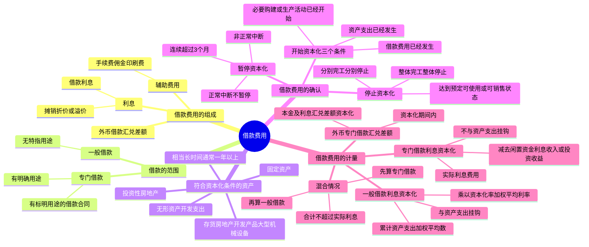

## 1. 章节定位

| 项目 | 信息 |
|------|------|
| 所属科目 | 会计 |
| 难度等级 | 4 |
| 历年分值 | 3-5 分 |
| 建议学时 | 5-7 小时 |
| 知识关联章节 | 第3章 固定资产（资本化利息计入在建工程）、第4章 无形资产（开发支出资本化）、第5章 投资性房地产（资本化利息）、第8章 负债（长期借款和应付债券的利息处理）、第13章 金融工具（实际利率法）、第16章 外币折算（外币借款汇兑差额） |

## 2. 考情分析

本章是会计科目的中难度章节，计算性强。历年考试中主观题出题频率较高，常以专门借款和一般借款混合情况下的利息资本化金额计算为核心，并广泛与固定资产、存货（房地产开发企业）等章节联动考查。

**命题规律**：客观题集中在借款费用的范围、资本化期间的确定（开始/暂停/停止的三个条件）、符合资本化条件的资产的定义；主观题集中在专门借款利息资本化金额的计算（减去闲置资金投资收益）、一般借款利息资本化金额的计算（累计资产支出加权平均数 × 资本化率）、两者混合情况下的处理。

**高频考点分布**：

1. **借款费用的组成**：利息（借款利息、摊销折价或溢价）、辅助费用、外币借款汇兑差额。
2. **借款的范围**：专门借款（有明确用途）vs 一般借款（无特指用途）。
3. **符合资本化条件的资产**：需要经过相当长时间（通常一年以上）购建或生产才能达到预定可使用或可销售状态的固定资产、投资性房地产和存货等。
4. **开始资本化的三个条件**：资产支出已发生、借款费用已发生、必要购建或生产活动已开始（三者同时满足）。
5. **暂停资本化**：非正常中断且连续超过 3 个月（正常中断不暂停）。
6. **停止资本化**：资产达到预定可使用或可销售状态；分别完工分别停止 vs 整体完工整体停止。
7. **专门借款利息资本化金额**：实际利息费用 - 闲置资金利息收入或投资收益。
8. **一般借款利息资本化金额**：累计资产支出超过专门借款部分的资产支出加权平均数 × 资本化率（一般借款加权平均利率）。
9. **混合情况**：先算专门借款资本化金额，再算一般借款资本化金额。
10. **外币专门借款汇兑差额**：资本化期间内本金及利息的汇兑差额予以资本化。
11. **每期利息资本化金额上限**：不超过当期相关借款实际发生的利息金额。

**联动考查方式**：
- 与固定资产结合：资本化利息计入在建工程，影响固定资产入账价值；
- 与存货结合：房地产开发企业开发的用于对外出售的房地产开发产品属于符合资本化条件的资产；
- 与外币折算结合：外币专门借款的汇兑差额资本化处理；
- 与差错更正结合：错将不应资本化的借款费用资本化、错将暂停期间的利息资本化。

**备考建议**：
- 牢记开始资本化的三个条件必须同时满足；
- 区分正常中断（可预见、必要程序）与非正常中断（管理决策、不可预见），仅非正常中断连续超过 3 个月才暂停资本化；
- 掌握专门借款（不与资产支出挂钩，减去闲置收益）与一般借款（与资产支出挂钩，用加权平均数）的不同计算方法；
- 牢记每期利息资本化金额不超过当期实际发生的利息金额。

## 3. 知识框架



## 4. 核心精讲

### 4.1 借款费用的组成

**借款费用**是指企业因借款而发生的代价，主要包括以下四项：

| 组成项目 | 内容 |
|---------|------|
| **利息** | 企业向银行或其他金融机构等借入资金发生的利息费用，包括借款利息、摊销的折价或溢价等 |
| **辅助费用** | 企业在借款过程中发生的诸如手续费、佣金、印刷费等费用，因安排借款而发生，属于借入资金所付出的代价 |
| **外币借款汇兑差额** | 由于汇率变动导致的外币借款本金及其利息的汇兑差额，属于借款费用的组成部分 |

### 4.2 借款的范围

借款包括**专门借款**和**一般借款**：

| 类型 | 定义 | 特点 |
|------|------|------|
| **专门借款** | 为购建或者生产符合资本化条件的资产而专门借入的款项 | 有明确用途，通常具有标明该用途的借款合同，使用受合同限制 |
| **一般借款** | 除专门借款之外的借款 | 在借入时用途通常没有特指用于符合资本化条件的资产的购建或生产 |

### 4.3 符合资本化条件的资产

**符合资本化条件的资产**是指需要经过相当长时间的购建或者生产活动才能达到预定可使用或者可销售状态的固定资产、投资性房地产和存货等资产。确认为无形资产的开发支出等在符合条件的情况下，也可以认定为符合资本化条件的资产。

**"相当长时间"**：通常为一年以上（含一年）。

**符合资本化条件的存货**：主要包括房地产开发企业开发的用于对外出售的房地产开发产品、企业制造的用于对外出售的大型机械设备等。

**土地使用权的特殊处理**：

| 情形 | 土地使用权是否属于符合资本化条件的资产 | 资本化基础 |
|------|--------------------------------------|-----------|
| 自行开发建造厂房等建筑物（土地使用权作为无形资产单独核算） | 否（取得时通常已达预定可使用状态） | 以建造支出（含土地使用权在房屋建造期间计入在建工程的摊销金额）为基础 |
| 房地产开发企业取得的土地使用权用于建造对外出售的房屋建筑物 | 是（计入房屋建筑物成本） | 以包括土地使用权支出的建造成本为基础 |

**不属于符合资本化条件的资产**：购入即可使用的资产、购入后需要安装但所需安装时间较短的资产、需要建造或生产但所需时间较短的资产、由于人为或故意等非正常因素导致购建或生产时间相当长的资产。

### 4.4 借款费用开始资本化的时点

借款费用允许开始资本化必须**同时满足三个条件**：

#### 4.4.1 资产支出已经发生

资产支出已经发生，是指企业已经发生了支付现金、转移非现金资产或者承担带息债务形式所发生的支出。

| 形式 | 说明 |
|------|------|
| 支付现金 | 用货币资金支付符合资本化条件的资产的购建或生产支出 |
| 转移非现金资产 | 将非现金资产直接用于符合资本化条件的资产的购建或生产 |
| 承担带息债务 | 为购建或生产符合资本化条件的资产所需物资等而承担的带息应付款项（如带息应付票据）。**不带息债务不作为资产支出**（只有在实际偿付发生资源流出时才作为资产支出） |

#### 4.4.2 借款费用已经发生

借款费用已经发生，是指企业已经发生了因购建或生产符合资本化条件的资产而专门借入款项的借款费用或者所占用的一般借款的借款费用。

#### 4.4.3 必要购建或生产活动已经开始

为使资产达到预定可使用或可销售状态所必要的购建或生产活动已经开始，指符合资本化条件的资产的实体建造或生产工作已经开始（如主体设备的安装、厂房的实际开工建造等）。不包括仅仅持有资产但没有发生为改变资产形态而进行的实质上的建造或生产活动。

**三个条件必须同时满足**，只要其中有一个没有满足，借款费用就不能开始资本化。

### 4.5 借款费用暂停资本化的时间

符合资本化条件的资产在购建或生产过程中发生**非正常中断**，且中断时间**连续超过 3 个月**的，应当暂停借款费用的资本化。

| 中断类型 | 定义 | 处理 |
|---------|------|------|
| **非正常中断** | 由于企业管理决策上的原因或其他不可预见的原因导致的中断（如质量纠纷、材料供应不及时、资金周转困难、安全事故、劳动纠纷等） | 连续超过 3 个月的暂停资本化 |
| **正常中断** | 购建或生产达到预定可使用或可销售状态所必要的程序，或事先可预见的不可抗力因素导致的中断（如质量/安全检查、雨季或冰冻季节等） | **不暂停**，借款费用仍可资本化 |

### 4.6 借款费用停止资本化的时点

购建或生产符合资本化条件的资产达到**预定可使用或者可销售状态**时，借款费用应当停止资本化。

**判断达到预定可使用或可销售状态的标准**（满足其一即可）：
1. 实体建造（包括安装）或生产工作已经全部完成或实质上已经完成；
2. 与设计要求、合同规定或生产要求相符或基本相符（极个别不符不影响正常使用或销售）；
3. 继续发生在所购建或生产资产上的支出金额很少或几乎不再发生。

**分别建造、分别完工的处理**：

| 情形 | 停止资本化时点 |
|------|--------------|
| 各部分分别完工，且每部分在其他部分继续建造过程中可供使用或对外销售，该部分必要的购建或生产活动实质上已完成 | 该部分资产完工时即停止该部分相关的借款费用资本化 |
| 各部分分别完工，但必须等到整体完工后才可使用或对外销售 | **整体完工时**才停止借款费用资本化（即使各部分已完工，也不能认为达到预定可使用或可销售状态） |

### 4.7 借款利息资本化金额的确定

在借款费用资本化期间内，每一会计期间的利息资本化金额，应当按照下列规定确定：

#### 4.7.1 专门借款利息资本化金额

**专门借款**的利息资本化金额 = 资本化期间内专门借款实际发生的利息费用 - 闲置借款资金存入银行取得的利息收入或进行暂时性投资取得的投资收益

**特点**：专门借款利息资本化金额**不与资产支出挂钩**，而是以资本化期间内实际发生的利息费用为基础，扣除闲置资金收益后确定。

#### 4.7.2 一般借款利息资本化金额

**一般借款**的利息资本化金额 = 累计资产支出超过专门借款部分的资产支出加权平均数 × 一般借款资本化率

其中：
- **累计资产支出加权平均数** = Σ（每笔资产支出金额 × 该笔支出占用天数 / 会计期间涵盖天数）
- **资本化率**（一般借款加权平均利率）= 一般借款当期实际发生的利息之和 / 一般借款本金加权平均数

**特点**：一般借款利息资本化金额**与资产支出挂钩**，需要计算资产支出的加权平均数。

#### 4.7.3 混合情况（专门借款 + 一般借款）

当专门借款资金不足，占用了一般借款资金时：
1. **先计算专门借款利息资本化金额**：实际利息费用 - 闲置资金收益
2. **再计算一般借款利息资本化金额**：累计资产支出超过专门借款部分的资产支出加权平均数 × 资本化率
3. **合计**：两者之和为当期利息资本化总额

#### 4.7.4 利息资本化金额的上限

**每一会计期间的利息资本化金额，不应当超过当期相关借款实际发生的利息金额。**

### 4.8 外币专门借款汇兑差额资本化金额的确定

当企业为购建或生产符合资本化条件的资产所借入的专门借款为外币借款时：

| 项目 | 处理 |
|------|------|
| 外币专门借款本金及其利息的汇兑差额 | 在资本化期间内**予以资本化**，计入符合资本化条件的资产的成本 |
| 外币一般借款（非专门借款）本金及其利息的汇兑差额 | 作为**财务费用**，计入当期损益 |

**特点**：外币专门借款的汇兑差额资本化**不需要与资产支出挂钩**，只要在资本化期间内发生的汇兑差额均予以资本化。

### 4.9 借款辅助费用的处理

辅助费用是企业为了安排借款而发生的必要费用，包括手续费、佣金、印刷费等。

辅助费用应当在发生时根据其发生额进行确认，并根据借款费用资本化原则进行处理：
- 在所购建或生产的符合资本化条件的资产达到预定可使用或可销售状态之前发生的，予以资本化；
- 在之后发生的，计入当期损益。

**辅助费用资本化的特殊处理**：

根据借款费用准则的规定，企业发生专门借款辅助费用的，在所购建或生产的符合资本化条件的资产达到预定可使用或可销售状态之前发生的，应当在发生时予以资本化；在所购建或生产的符合资本化条件的资产达到预定可使用或可销售状态之后发生的，应当在发生时确认为费用，计入当期损益。一般借款发生的辅助费用，应当在发生时根据其发生额确认为费用，计入当期损益。

上述资本化或计入当期损益的辅助费用的发生额，是指根据实际利率法所确定的金融负债初始确认金额的调整额。也就是说，辅助费用应当作为借款的初始计量金额的组成部分，通过实际利率法的摊销影响各期利息费用，而非在发生时一次性资本化或费用化。

### 4.10 资本化期间的确定总结

资本化期间是指从借款费用开始资本化时点到停止资本化时点的期间，**不包括借款费用暂停资本化的期间**。

**资本化期间的完整判断流程**：

1. **判断开始资本化时点**：三个条件同时满足之日（资产支出已发生、借款费用已发生、必要购建或生产活动已开始）。
2. **判断是否暂停**：在资本化期间内，如果发生非正常中断且连续超过 3 个月，则该中断期间不属于资本化期间，借款费用应费用化。
3. **判断停止资本化时点**：资产达到预定可使用或可销售状态之日。

**各期间借款费用的处理汇总**：

| 期间 | 处理 |
|------|------|
| 资本化开始前 | 费用化，计入当期损益（财务费用） |
| 资本化期间内（无中断） | 资本化，计入相关资产成本（在建工程等） |
| 非正常中断连续超过 3 个月 | 费用化，计入当期损益（财务费用） |
| 正常中断期间 | 资本化，计入相关资产成本 |
| 资本化停止后 | 费用化，计入当期损益（财务费用） |

### 4.11 借款费用资本化的特殊情形

**（1）购建或生产的资产各部分分别完工**

- 各部分在其他部分继续建造过程中可供使用或对外销售，且该部分必要的购建或生产活动实质上已完成：该部分资产相关的借款费用停止资本化。
- 必须等到整体完工后才可使用或对外销售：在整体完工时停止借款费用资本化。

**（2）房地产开发企业的存货**

房地产开发企业开发的用于对外出售的房地产开发产品属于符合资本化条件的资产。借款费用资本化金额的确定原则与固定资产相同，资本化的利息计入开发产品成本。

**（3）土地使用权与建筑物**

自行开发建造厂房等建筑物时，土地使用权作为无形资产单独核算，不与地上建筑物合并计算成本。但土地使用权在房屋建造期间的摊销金额可计入在建工程成本，作为资本化基础的一部分。房地产开发企业取得的土地使用权用于建造对外出售的房屋建筑物的，土地使用权计入房屋建筑物成本，属于符合资本化条件的资产。

## 5. 典型例题

### 例题 1：专门借款利息资本化金额的计算

ABC 公司于 2×24 年 1 月 1 日正式动工兴建一幢办公楼，工期预计 1 年 6 个月，工程采用出包方式，分别于 2×24 年 1 月 1 日、7 月 1 日和 2×25 年 1 月 1 日支付工程进度款。

- 2×24 年 1 月 1 日专门借款 2 000 万元，借款期限 3 年，年利率 6%
- 2×24 年 7 月 1 日专门借款 4 000 万元，借款期限 5 年，年利率 7%
- 闲置借款资金用于固定收益债券短期投资，月收益率 0.5%
- 办公楼于 2×25 年 6 月 30 日完工

资产支出：2×24 年 1 月 1 日 1 500 万元（闲置 500 万元）；2×24 年 7 月 1 日 2 500 万元（闲置 2 000 万元）；2×25 年 1 月 1 日 1 500 万元（闲置 500 万元）。

**要求**：计算各年利息资本化金额并编制账务处理。

**解答**：

资本化期间：2×24 年 1 月 1 日至 2×25 年 6 月 30 日

**2×24 年**：
- 专门借款实际利息 = 2 000 × 6% + 4 000 × 7% × 6/12 = 260（万元）
- 闲置资金投资收益 = 500 × 0.5% × 6 + 2 000 × 0.5% × 6 = 75（万元）
- 利息资本化金额 = 260 - 75 = 185（万元）

```
借：在建工程                    1 850 000
    银行存款                      750 000
    贷：长期借款——应计利息        2 600 000
```

**2×25 年 1-6 月**：
- 专门借款实际利息 = 2 000 × 6% × 6/12 + 4 000 × 7% × 6/12 = 200（万元）
- 闲置资金投资收益 = 500 × 0.5% × 6 = 15（万元）
- 利息资本化金额 = 200 - 15 = 185（万元）

```
借：在建工程                    1 850 000
    银行存款                      150 000
    贷：长期借款——应计利息        2 000 000
```

**解析**：专门借款利息资本化金额以实际发生的利息费用减去闲置资金投资收益后确定，不与资产支出挂钩。

### 例题 2：一般借款利息资本化金额的计算

承例 1，假定 ABC 公司建造办公楼没有专门借款，占用的一般借款为：
- 向 A 银行长期贷款 2 000 万元，年利率 6%
- 发行公司债券 1 亿元，年利率 8%

资产支出同例 1。全年按 360 天计算。

**要求**：计算 2×24 年一般借款利息资本化金额。

**解答**：

（1）计算一般借款资本化率：
- 资本化率 = (2 000 × 6% + 10 000 × 8%) / (2 000 + 10 000) = 920 / 12 000 = 7.67%

（2）计算累计资产支出加权平均数：
- 2×24 年 = 1 500 × 360/360 + 2 500 × 180/360 = 1 500 + 1 250 = 2 750（万元）

（3）计算利息资本化金额：
- 2×24 年 = 2 750 × 7.67% = 210.93（万元）
- 实际利息费用 = 2 000 × 6% + 10 000 × 8% = 920（万元），资本化金额未超过

```
借：在建工程                    2 109 300
    财务费用                    7 090 700
    贷：长期借款——应计利息        1 200 000
        应付债券——应计利息        8 000 000
```

**解析**：一般借款利息资本化金额与资产支出挂钩，需要计算累计资产支出加权平均数并乘以资本化率（一般借款加权平均利率）。

### 例题 3：专门借款与一般借款混合情况

承例 1 和例 2，ABC 公司有专门借款 2 000 万元（年利率 6%），同时占用一般借款（2 000 万元年利率 6% + 1 亿元年利率 8%）。

**要求**：计算 2×24 年利息资本化金额。

**解答**：

（1）专门借款利息资本化金额：
- 实际利息 = 2 000 × 6% = 120（万元）
- 闲置收益：2×24 年 1 月 1 日支出 1 500 万元，专门借款 2 000 万元，闲置 500 万元，闲置 6 个月（到 7 月 1 日支出 2 500 万元时，专门借款已用完并开始占用一般借款）
- 闲置收益 = 500 × 0.5% × 6 = 15（万元）
- 专门借款资本化金额 = 120 - 15 = 105（万元）

（2）一般借款利息资本化金额：
- 从 2×24 年 7 月 1 日起占用一般借款 2 000 万元（2 500 万支出 - 500 万剩余专门借款）
- 占用一般借款的资产支出加权平均数 = 2 000 × 180/360 = 1 000（万元）
- 资本化率 = 7.67%（同例 2）
- 一般借款资本化金额 = 1 000 × 7.67% = 76.70（万元）

（3）合计资本化金额 = 105 + 76.70 = 181.70（万元）

**2×25 年 1-6 月**：
- 专门借款利息资本化金额 = 2 000 × 6% × 6/12 = 60（万元）（无闲置资金）
- 占用一般借款的资产支出加权平均数 = (2 000 + 1 500) × 180/360 = 1 750（万元）（2×24 年 7 月 1 日占用的 2 000 万元 + 2×25 年 1 月 1 日支出的 1 500 万元）
- 一般借款利息资本化金额 = 1 750 × 7.67% = 134.23（万元）
- 合计资本化金额 = 60 + 134.23 = 194.23（万元）

```
借：在建工程                    1 942 300
    财务费用                    3 257 700
    贷：长期借款——应计利息        1 200 000
        应付债券——应计利息        4 000 000
```

注：2×25 年 1-6 月实际借款利息 = (2 000 × 6% + 2 000 × 6% + 10 000 × 8%) / 2 = 520（万元），其中长期借款利息 120 万元，债券利息 400 万元。资本化金额 194.23 万元未超过实际利息 520 万元。

**解析**：混合情况下，先计算专门借款利息资本化金额（不与资产支出挂钩，减闲置收益），再计算一般借款利息资本化金额（与资产支出挂钩，用累计资产支出超过专门借款部分的加权平均数乘以资本化率）。注意：专门借款闲置资金的计算仅在专门借款金额大于资产支出时才有闲置收益；当资产支出超过专门借款金额时，超出部分占用一般借款，不再有专门借款闲置资金。

### 例题 4：外币专门借款汇兑差额资本化

甲公司于 2×24 年 1 月 1 日为建造某工程项目专门以面值发行美元公司债券 1 000 万美元，年利率 8%，期限 3 年。工程于 2×24 年 1 月 1 日开始实体建造，2×25 年 6 月 30 日完工。相关汇率：2×24 年 1 月 1 日 1 美元 = 7.70 元人民币；2×24 年 12 月 31 日 1 美元 = 7.75 元人民币。

**要求**：计算 2×24 年外币借款汇兑差额资本化金额。

**解答**：

（1）债券应付利息 = 1 000 × 8% × 7.75 = 80 × 7.75 = 620（万元人民币）
```
借：在建工程                    6 200 000
    贷：应付债券——应计利息        6 200 000
```

（2）外币债券本金汇兑差额 = 1 000 × (7.75 - 7.70) = 50（万元人民币）
```
借：在建工程                      500 000
    贷：应付债券                    500 000
```

**解析**：在资本化期间内，外币专门借款本金及其利息的汇兑差额应当予以资本化，计入符合资本化条件的资产的成本。外币专门借款的汇兑差额资本化不需要与资产支出挂钩，只要在资本化期间内发生的汇兑差额均予以资本化。

### 例题 5：暂停资本化的判断

某企业在北方某地建造某工程期间，遇上冰冻季节（通常为 6 个月），工程施工因此中断，待冰冻季节过后方能继续施工。

**要求**：判断是否应暂停借款费用资本化。

**解答**：由于该地区在施工期间出现较长时间的冰冻为正常情况，由此导致的施工中断是可预见的不可抗力因素导致的中断，属于**正常中断**。在正常中断期间所发生的借款费用**可以继续资本化**，计入相关资产的成本。

**解析**：区分正常中断与非正常中断的关键在于中断原因是否可预见、是否为必要程序。冰冻季节属于可预见的不可抗力因素，为正常中断。

## 6. 记忆口诀

**借款费用记忆要点**：

一、费用四组成：利息摊销折溢价、辅助费用、外币汇兑差额。

二、借款两类型：专门借款有用途、一般借款无特指。

三、资产条件：相当长时间（一年以上）购建生产，达到预定可使用或可销售。

四、开始三条件：资产支出已发生、借款费用已发生、必要活动已开始，三者同时满足。

五、暂停看两条件：非正常中断 + 连续超过 3 个月，正常中断不暂停。

六、停止看状态：达到预定可使用或可销售，分别完工分别停、整体完工整体停。

七、专门借款算资本化：实际利息减闲置收益，不与支出挂钩。

八、一般借款算资本化：累计支出超专门部分加权平均 × 资本化率，与支出挂钩。

九、混合先专门后一般：合计不超过实际利息。

十、外币专门借款汇兑差额：资本化期间内本金利息汇兑差额资本化，一般借款汇兑差额费用化。

## 7. 同步练习

**187.（单选题）** 下列各项中，不属于借款费用的是（　）。

A. 外币借款发生的汇兑收益
B. 承租人所确认租赁负债发生的利息费用
C. 发行股票支付的承销商佣金及手续费
D. 以咨询费的名义向银行支付的借款利息

---

**188.（单选题）** 下列关于专门借款会计处理的表述中，不正确的是（　）。

A. 企业应当以专门借款在资本化期间实际发生的利息费用，减去该专门借款在相应资本化期间的闲置资金收益后的金额确定专门借款利息资本化金额
B. 专门借款为外币借款的，其本金和利息在资本化期间的汇兑差额应该资本化
C. 计算专门借款利息费用化金额时，不需要考虑专门借款闲置资金因素
D. 外币专门借款本金和利息在非资本化期间的汇兑差额应该费用化

---

**189.（单选题）** 甲公司为生产轮胎的加工企业，为了扩大企业的经营规模决定再兴建一条新的生产线。为了建造该生产线，甲公司已经于2×21年1月1日通过发行债券的方式为该生产线的建造成功募集到2000万元资金。2×21年3月1日，甲公司购买建造该生产线所用的材料，发生支出500万元；2×21年5月1日开始建造该生产线，该生产线的工期预计为1年零3个月。不考虑其他因素，则该项工程借款费用开始资本化的日期为（　）。

A. 2×21年1月1日
B. 2×21年3月1日
C. 2×21年5月1日
D. 2×22年8月1日

---

**190.（单选题）** 甲公司于2×19年12月25日开始动工兴建一栋办公楼，当日借入一笔专门借款并支付工程物资款226万元，工程采用出包方式建造。2×20年10月1日至10月31日，该工程因接受监理公司进度检查而停工，11月1日继续开工。2×21年3月1日至2×21年6月30日因工程款纠纷问题停工，2×21年7月1日继续开工。2×21年12月31日完工，达到预定可使用状态。不考虑其他因素，下列各项表述中不正确的是（　）。

A. 甲公司借款费用开始资本化时点是2×19年12月25日
B. 接受监理公司进度检查期间需要暂停借款费用的资本化
C. 因工程款纠纷问题而停工期间需要暂停借款费用的资本化
D. 甲公司借款费用停止资本化时点是2×21年12月31日

---

**191.（单选题）** 甲公司建造一条生产线，该工程预计工期为两年，建造活动自2×23年5月1日开始，2×23年7月1日支付承包商建设工程进度款3000万元。2×23年9月30日，追加支付工程进度款2000万元。甲公司该生产线建造工程占用借款包括：①2×23年7月1日借入的三年期专门借款4000万元，年利率6%；②2×23年1月1日借入的两年期一般借款3000万元，年利率7%。甲公司将闲置部分专门借款投资于货币市场基金，月收益率为0.6%。不考虑其他因素，甲公司该工程在2×23年应予以资本化的利息费用是（　）。

A. 119.5万元
B. 122.5万元
C. 137.5万元
D. 139.5万元

---

**192.（单选题）** （2024年）甲公司为建造一栋厂房，于2×24年1月1日向银行借入专门借款2000万元，2月1日工程建设正式开工，分别于4月1日和10月1日支付工程价款1000万元。2×24年4月1日至4月30日因质量纠纷停工一个月；2×24年9月1日至2×25年2月1日因北方冻雨时节停工。不考虑其他因素，2×24年甲公司借款费用资本化期间时长为（　）。

A. 11个月
B. 9个月
C. 8个月
D. 5个月

---

**193.（单选题）** （2023年）2×22年1月1日，甲公司有三笔借款，分别是：①专门用于建造厂房的银行借款1000万元，借款到期日为2×23年6月30日，年利率为4%；②用于补充流动资金的公司债券3000万元，债券到期日为2×24年9月30日，年利率为5%；③取得一般银行借款2000万元，借款到期日为2×25年3月31日，年利率6%。甲公司2×22年9月1日开始建造一栋办公楼，并于当日通过银行转账支付了工程款1000万元。上述借款年利率与实际利率相同。不考虑其他因素，2×22年度甲公司的一般借款资本化率为（　）。

A. 5%
B. 5.17%
C. 5.4%
D. 6%

---

**194.（单选题）** （2019年）20×8年1月1日，甲公司为购建生产线借入3年期专门借款3000万元，年利率为6%。当年度发生与购建生产线相关的支出包括：1月1日支付材料款1800万元，3月1日支付工程进度款1600万元，9月1日支付工程进度款2000万元。甲公司将暂时未使用的专门借款用于货币市场投资，月利率为0.5%。除专门借款外，甲公司尚有两笔流动资金借款：一笔是20×7年10月借入的2年期借款2000万元，年利率为5.5%；一笔为20×8年1月1日借入的1年期借款3000万元，年利率为4.5%。假定上述借款的实际利率与名义利率相同，不考虑其他因素，甲公司20×8年度应予资本化的一般借款利息金额为（　）。

A. 49万元
B. 45万元
C. 60万元
D. 55万元

---

**195.（单选题）** 甲公司2×22年1月1日发行面值总额为10000万元的债券，取得的款项专门用于建造厂房。该债券系分期付息、到期还本债券，期限为4年，票面年利率为10%，每年12月31日支付当年利息。该债券年实际利率为8%。债券发行价格总额为10662.10万元，款项已存入银行。厂房于2×22年1月1日开工建造，当日发生建造支出100万元。2×22年度累计发生建造工程支出4600万元。经批准，当年甲公司将尚未使用的债券资金投资于国债，取得投资收益760万元存入银行。不考虑其他因素，2×22年12月31日，工程尚未完工，该在建工程在当日的账面余额为（　）。

A. 4692.97万元
B. 4906.21万元
C. 5452.97万元
D. 5600.00万元

---

**196.（多选题）** 根据企业会计准则的规定，符合资本化条件的资产在购建或生产的过程中发生非正常中断且中断时间连续超过3个月的，应当暂停借款费用的资本化。下列各项中，属于资产购建或生产非正常中断的有（　）。

A. 因劳资纠纷导致工程停工
B. 因发生安全事故被相关部门责令停工
C. 因资金周转困难导致工程停工
D. 因工程用料未能及时供应导致工程停工

---

**197.（多选题）** 下列各项中，不能表明"为使资产达到预定可使用或者可销售状态所必要的购建或者生产活动已经开始"的有（　）。

A. 厂房的实际开工建造
B. 建造厂房所需建筑材料的购入
C. 建造生产线的主体设备的购入
D. 建造生产线的主体设备的安装

---

**198.（多选题）** 关于借款费用停止资本化时点的判断，下列表述中正确的有（　）。

A. 符合资本化条件的资产的实体建造（包括安装）或者生产工作已经全部完成或者实质上已经完成
B. 所购建或者生产的符合资本化条件的资产与设计要求、合同规定或者生产要求相符或者基本相符，即使有极个别与设计、合同或者生产要求不相符的地方，也不影响其正常使用或者是销售
C. 继续发生在所购建或生产的符合资本化条件的资产上的支出金额很少或者几乎不再发生
D. 所购建或者生产的符合资本化条件的资产的各部分中，有一部分已经完工，其他部分尚未完工，已完工部分在其他部分继续建造过程中不能单独投入使用或者对外销售

---

**199.（多选题）** 关于外币借款费用，下列表述正确的有（　）。

A. 外币专门借款费用需要减掉短期投资收益的金额来确定资本化金额
B. 外币一般借款本金的汇兑差额可以资本化
C. 外币一般借款利息的汇兑差额不可以资本化
D. 外币专门借款、外币一般借款的本金的汇兑差额都可以资本化

---

**200.（多选题）** （2022年）甲公司为房地产开发企业。2×21年度发生的有关交易或事项如下：①1月1日，向国行借款5亿元，专门用于房地产开发项目，项目建设期1年半。②2月1日，用银行贷款2亿元购入土地使用权，并开始开发建设。③4月1日，因安全事故停工，10月1日恢复建设。④每月按实际利率计算的利息支出为200万元，资本化期间利用暂时闲置的银行贷款资金获得理财收益400万元。不考虑其他因素，下列关于甲公司2×21年度会计处理的表述中，正确的有（　）。

A. 闲置的国行借款资本化期间获得的理财收益计入当期损益
B. 因安全事故导致的停工期间的借款费用应当资本化
C. 借款费用开始资本化的时间为2×21年2月1日
D. 专门借款利息支出1000万元计入建设项目成本

---

**201.（多选题）** 甲公司2×22年1月1日起开始建造一项厂房，预计工期两年。为购建该厂房，甲公司2×22年1月1日借入一笔专门借款，本金为800万元，年利率6%，期限为3年，每年年末确认并支付利息。该建造工程当年发生资产支出情况如下：1月1日支出100万元，3月1日支出300万元，9月1日支出200万元。该专门借款的闲置资金存入银行，月收益率为0.2%。2×22年4月1日至7月31日工程因质量问题停工四个月。假定年末收取闲置资金收益。不考虑其他因素，则下列表述正确的有（　）。

A. 2×22年4月1日至7月31日因质量问题停工应暂停借款费用资本化
B. 甲公司2×22年应确认的借款费用资本化的金额为22.8万元
C. 甲公司2×22年应确认的借款费用费用化的金额为16万元
D. 甲公司2×22年应确认的借款费用闲置资金的收益为9.2万元

---

**202.（计算分析题）** A外商投资企业以人民币为记账本位币，其外币交易采用交易发生日的即期汇率折算。A企业按月计算应予资本化的借款费用金额（每年按照360天计算，每月按照30天计算）。

（1）2×21年1月1日为建造一座厂房，向银行借入5年期美元借款2700万美元，年利率为8%，按月计提利息，每年年末支付利息。

（2）2×21年2月1日取得人民币一般借款2000万元，3年期，年利率为6%，每年年末支付利息。此外2×20年12月1日取得人民币一般借款6000万元，5年期，年利率为5%，每年年末支付利息。

（3）该厂房于2×21年1月1日开始动工，计划到2×22年1月31日完工。该项工程在2×21年1月至2月发生支出情况如下：①1月1日支付工程进度款1700万美元，交易发生日的即期汇率为1美元=8.20元人民币；②2月1日支付工程进度款1000万美元，交易发生日的即期汇率为1美元=8.25元人民币；此外2月1日以人民币支付工程进度款4000万元。

（4）闲置专门美元借款资金均存入银行，假定存款年利率为3%，各月末均可收到存款利息收入。

（5）各月末汇率：1月31日即期汇率为1美元=8.22元人民币；2月28日即期汇率为1美元=8.27元人民币。

要求：根据上述资料，计算2×21年1月份和2月份的借款利息资本化金额并编制有关会计分录。（假定不考虑专门借款尚未动用的借款金额存入银行取得的利息收入的汇兑差额）

---

**203.（综合题）** 甲股份有限公司（以下简称"甲公司"）拟自建一条生产线，与该生产线建造相关的情况如下：

（1）2×22年1月2日，甲公司发行公司债券，专门筹集生产线建设资金。该公司债券为3年期分期付息、到期还本债券，每年年初支付上年利息，面值为3000万元，票面年利率为5%，发行价格为3069.75万元，另在发行过程中支付中介机构佣金150万元，实际募集资金净额为2919.75万元，实际利率为6%。

（2）甲公司除上述所发行公司债券外，还存在两笔流动资金借款：一笔于2×21年10月1日借入，本金为2000万元，年利率为6%，期限2年；另一笔于2×21年12月1日借入，本金为3000万元，年利率为7%，期限18个月，两笔借款利息均于下年年初支付。

（3）生产线建造工程于2×22年1月2日开工，采用外包方式进行，预计工期1年。有关建造支出情况如下：
2×22年1月2日，支付建造商工程款1000万元；
2×22年5月1日，支付建造商工程款1600万元；
2×22年8月1日，支付建造商工程款1400万元。

（4）2×22年9月1日，生产线建造工程出现人员伤亡事故，被当地安监部门责令停工整改，至2×22年12月底整改完毕。工程于2×23年1月1日恢复建造，当日向建造商支付工程款1200万元。建造工程于2×23年4月30日完成，并经有关部门验收，试生产出合格产品。为帮助职工正确操作使用新建生产线，甲公司自2×23年4月30日起对一线员工进行培训，至5月31日结束，共发生培训费用120万元。该生产线自2×23年6月1日起实际投入使用。

（5）甲公司将闲置专门借款资金投资于固定收益理财产品，月收益率为0.5%，每年年底收到相关款项存入银行。

其他资料：本题中不考虑所得税等相关税费以及其他因素。

要求：
（1）编制甲公司发行债券的相关会计分录。
（2）确定甲公司生产线建造工程借款费用的资本化期间，并说明理由。
（3）分别计算甲公司2×22年专门借款、一般借款利息应予资本化的金额，并作出与生产线建造工程相关的会计分录。
（4）分别计算甲公司2×23年专门借款、一般借款利息应予资本化的金额，并作出生产线建造工程相关的会计分录；计算固定资产完工入账成本，并编制结转固定资产的相关会计分录。

**练习答案**：

187. C【解析】借款费用包括借款利息费用、外币借款汇兑差额及借款辅助费用，不包括权益性融资费用。发行股票支付的承销商佣金和手续费应冲减资本公积，不属于借款费用。
188. C【解析】专门借款利息费用化金额应以费用化期间实际发生的利息费用减去该期间闲置资金收益确定，选项C"不需要考虑专门借款闲置资金因素"不正确。
189. C【解析】开始资本化须同时满足三个条件（取孰晚时点）：资产支出已发生（3月1日）、借款费用已发生（1月1日）、必要购建活动已开始（5月1日），故开始资本化日期为2×21年5月1日。
190. B【解析】接受监理公司进度检查而停工属于正常中断，不需要暂停资本化，选项B不正确；因工程款纠纷停工连续超过3个月属于非正常中断，应暂停资本化。
191. A【解析】开始资本化时点为2×23年7月1日。专门借款利息资本化金额=4000×6%×6/12-1000×0.6%×3=102（万元）；一般借款利息资本化金额=1000×7%×3/12=17.5（万元）；合计119.5万元。
192. B【解析】开始资本化时点为2×24年4月1日（三条件孰晚）；质量纠纷停工1个月未连续超过3个月不暂停；北方冻雨属可预见的正常中断不暂停。资本化期间为4月1日至12月31日，共9个月。
193. C【解析】一般借款资本化率=（3000×5%×4/12+2000×6%×4/12）/（3000×4/12+2000×4/12）=（50+40）/1666.67=5.4%。
194. A【解析】一般借款资本化率=（2000×5.5%+3000×4.5%）/（2000+3000）=4.9%；累计资产支出超过专门借款部分的资产支出加权平均数=（1800+1600-3000）×10/12+2000×4/12=1000（万元）；资本化金额=1000×4.9%=49（万元）。
195. A【解析】专门借款利息资本化金额=10662.10×8%-760=92.97（万元）；期末在建工程账面余额=4600+92.97=4692.97（万元）。
196. ABCD【解析】因与施工方发生质量纠纷、工程或生产用料未及时供应、资金周转困难、发生安全事故、发生劳动纠纷等原因导致购建或生产活动中断的，均属于非正常中断。
197. BC【解析】"购建活动已经开始"是指符合资本化条件的资产实体建造或生产工作已经开始，不包括仅持有资产但未发生实质建造或生产活动的情形，故购入建筑材料、购入主体设备不能表明购建活动已经开始。
198. ABC【解析】选项D：企业购建或生产的资产各部分分别完工，但必须等到整体完工后才可使用或对外销售的，应当在该资产整体完工时停止借款费用资本化，该表述不正确。
199. AC【解析】外币专门借款本金和利息的汇兑差额均可予以资本化；外币一般借款本金和利息的汇兑差额均不可以资本化，应费用化计入财务费用，选项B、D错误。
200. CD【解析】资本化期间闲置专门借款的理财收益应冲减建设项目成本，选项A错误；因安全事故停工连续超过3个月，符合暂停资本化条件，停工期间借款费用应费用化，选项B错误；2×21年2月1日购入土地使用权并开始开发建设，同时满足开始资本化三个条件，选项C正确。
201. AD【解析】资本化期间（8个月）闲置资金收益=（800-100）×2×0.2%+（800-100-300）×2×0.2%+（800-100-300-200）×4×0.2%=6（万元），资本化金额=800×6%×8/12-6=26（万元），选项B错误；费用化期间（4个月）闲置收益=（800-100-300）×4×0.2%=3.2（万元），费用化金额=800×6%×4/12-3.2=12.8（万元），选项C错误；闲置资金收益合计=6+3.2=9.2（万元），选项D正确。
202. 【解析】（1）1月份：专门借款利息资本化金额=2700×8%×1/12-1000×3%×1/12=15.5（万美元），折合人民币=15.5×8.22=127.41（万元）；汇兑差额=2700×（8.22-8.20）+18×（8.22-8.22）=54（万元），全部资本化。分录：借"在建工程181.41、银行存款20.55"；贷"长期借款——本金——美元户54、长期借款——应计利息——美元户147.96"。（2）2月份：专门借款利息资本化金额=2700×8%×1/12=18（万美元），折合人民币=18×8.27=148.86（万元）；一般借款资本化率=（2000×6%×1/12+6000×5%×1/12）/（2000+6000）×100%=0.44%，一般借款利息资本化金额=4000×0.44%=17.6（万元），一般借款利息费用化金额=（2000×6%×1/12+6000×5%×1/12）-17.6=17.4（万元）；汇兑差额=2700×（8.27-8.22）+18×（8.27-8.22）+18×（8.27-8.27）=135.9（万元），全部资本化。分录：借"在建工程302.36、财务费用17.4"；贷"长期借款——本金——美元户135、长期借款——应计利息——美元户149.76、银行存款35"。
203. 【解析】（1）发行债券分录：借"银行存款2919.75、应付债券——利息调整80.25"；贷"应付债券——面值3000"。（2）资本化期间为2×22年1月2日至2×22年8月31日、2×23年1月1日至2×23年4月30日。理由：2×22年1月2日资产支出已发生、借款费用已发生、建造活动已开始，符合开始资本化条件；9月1日至12月31日因事故停工且连续超过3个月，应暂停资本化；2×23年4月30日试生产出合格产品，达到预定可使用状态，停止资本化；职工培训费不构成资产成本。（3）2×22年专门借款利息资本化金额=2919.75×6%×8/12-（2919.75-1000）×0.5%×4-（2919.75-1000-1600）×0.5%×3≈73.60（万元），费用化金额=2919.75×6%×4/12≈58.40（万元）；一般借款资本化率=（2000×6%+3000×7%）/（2000+3000）=6.6%，累计资产支出加权平均数=（1000+1600+1400-2919.75）×1/12≈90.02（万元），一般借款利息资本化金额=90.02×6.6%≈5.94（万元），费用化金额=330-5.94=324.06（万元）。（4）2×23年专门借款利息资本化金额=2944.94×6%×4/12≈58.90（万元），费用化金额=2944.94×6%×8/12≈117.80（万元）；一般借款利息资本化金额=2280.25×6.6%×4/12≈50.17（万元），费用化金额=2000×6%×9/12+3000×7%×5/12-50.17=127.33（万元）；2×23年资本化合计=58.90+50.17=109.07（万元）。固定资产完工入账成本=建造支出5200+资本化利息（73.60+5.94+58.90+50.17）=5388.61（万元），完工时借"固定资产5388.61"，贷"在建工程5388.61"。
