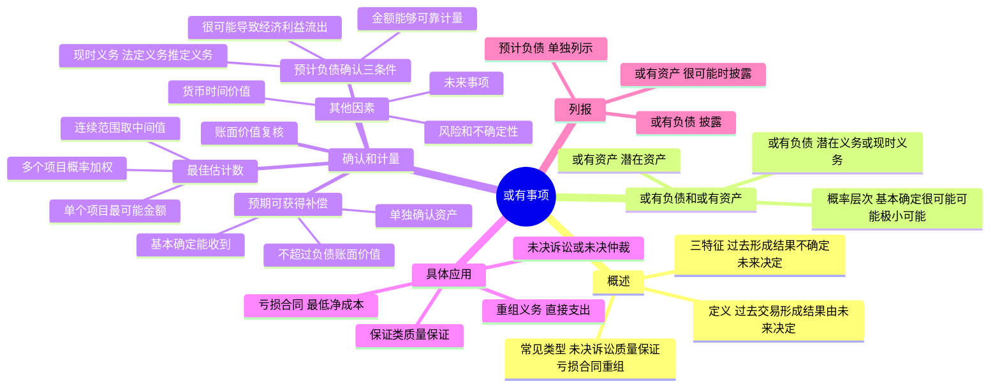

## 📍 章节定位

| 项目 | 信息 |
|------|------|
| **所属科目** | 📒 会计 |
| **难度等级** | ⭐⭐ |
| **历年分值** | 2-3分 |
| **建议学时** | 3-4h |

## 📝 考情分析

本章是会计科目的基础章节，历年分值约 2-3 分，以客观题为主，主观题常结合资产负债表日后事项、所得税、差错更正等在综合题中考查。命题热点集中在：或有事项的特征判断、或有负债与或有资产的区分、预计负债确认的三个条件（现时义务、很可能导致经济利益流出、金额可靠计量）、最佳估计数的确定（连续范围取中间值、单个项目取最可能金额、多个项目按概率加权计算）、预期可获得补偿的处理（基本确定能收到时单独确认资产，不超过负债账面价值）、亏损合同的会计处理（反映退出合同的最低净成本）、重组义务的确认（有详细正式重组计划且已对外公告）和计量（仅含直接支出）。

考生需重点掌握：概率层次的划分（基本确定 >95%、很可能 >50%-95%、可能 >5%-50%、极小可能 ≤5%）；预计负债确认三条件必须同时满足；预期补偿不能直接冲减预计负债，而应单独确认为资产；亏损合同存在标的资产的应先减值，超过减值部分确认预计负债；重组直接支出不包括留用职工岗前培训、市场推广等与未来经营活动相关的支出。

## 🧠 知识框架



## 📖 核心精讲

### 一、或有事项概述

#### （一）或有事项的定义与特征

**或有事项**，是指过去的交易或者事项形成的，其结果须由某些未来事项的发生或不发生才能决定的不确定事项。常见的或有事项包括：未决诉讼或未决仲裁、保证类质量保证（含产品安全保证）、亏损合同、重组义务、弃置义务、环境污染整治、承诺等。

或有事项具有以下三大特征：

1. **因过去的交易或者事项形成**：或有事项的现存状况是过去交易或事项引起的客观存在。未来可能发生的自然灾害、交通事故、经营亏损等不属于或有事项。
2. **结果具有不确定性**：结果是否发生具有不确定性，或虽预计会发生但发生的具体时间或金额具有不确定性。
3. **结果须由未来事项决定**：结果只能由未来不确定事项的发生或不发生才能证实。

**注意**：固定资产计提折旧虽涉及预计净残值和使用寿命的判断，但其结果确定，不属于或有事项。

#### （二）或有负债和或有资产

**或有负债**，是指过去的交易或事项形成的潜在义务（其存在须通过未来不确定事项证实）；或现时义务（履行该义务不是很可能导致经济利益流出企业，或该义务的金额不能可靠计量）。

**或有资产**，是指过去的交易或者事项形成的潜在资产，其存在须通过未来不确定事项的发生或不发生予以证实。

**概率层次**：

| 概率层次 | 发生可能性 |
|---------|----------|
| 基本确定 | 大于 95% 但小于 100% |
| 很可能 | 大于 50% 但小于或等于 95% |
| 可能 | 大于 5% 但小于或等于 50% |
| 极小可能 | 大于 0 但小于或等于 5% |

**转化规则**：或有负债对应的潜在义务转化为现时义务，且履行该义务很可能导致经济利益流出企业并且金额能够可靠计量时，应当确认为预计负债。或有资产基本确定能够收到且金额能够可靠计量时，应当确认为企业的资产。

### 二、或有事项的确认和计量

#### （一）预计负债的确认条件

与或有事项有关的义务应当在**同时符合以下三个条件**时确认为负债（预计负债）：

1. **该义务是企业承担的现时义务**：包括法定义务（因合同、法规或其他司法解释产生）和推定义务（因以往的习惯做法、已公开的承诺或声明、已公开宣布的政策等承担的义务）。
2. **履行该义务很可能导致经济利益流出企业**：导致经济利益流出的可能性大于 50% 但尚未达到基本确定的程度。
3. **该义务的金额能够可靠地计量**：相关现时义务的金额能够合理地估计。

#### （二）最佳估计数的确定

预计负债应当按照履行相关现时义务所需支出的**最佳估计数**进行初始计量：

| 情形 | 最佳估计数确定方法 |
|------|----------------|
| 所需支出存在一个连续范围，且该范围内各种结果发生的可能性相同 | 按该范围内的**中间值**（上下限金额的平均数）确定 |
| 所需支出不存在连续范围，或虽存在但各种结果可能性不同——涉及**单个项目** | 按照最可能发生金额确定 |
| 所需支出不存在连续范围，或虽存在但各种结果可能性不同——涉及**多个项目** | 按照各种可能结果及相关概率**加权计算**确定 |

#### （三）预期可获得补偿的处理

如果企业清偿因或有事项确认的负债所需支出全部或部分预期由第三方补偿：

- 补偿金额只有在**基本确定**能收到时，才能作为资产**单独确认**；
- 确认的补偿金额**不能超过**所确认负债的账面价值；
- **不能**作为预计负债金额的扣减（资产和负债不能随意抵销）。

#### （四）预计负债计量需考虑的其他因素

1. **风险和不确定性**：充分考虑但不能重复调整。
2. **货币时间价值**：如果确认时点距离实际清偿有较长时间跨度，货币时间价值影响重大的，应采用**现值**计量。折现率为反映货币时间价值的当前市场估计和相关负债特有风险的**税前利率**。
3. **未来事项**：有足够客观证据表明将发生的未来事项（如技术进步、法规出台等）应在计量中考虑，但不考虑预期处置相关资产形成的利得。

#### （五）预计负债账面价值的复核

企业应当在资产负债表日对预计负债的账面价值进行复核。有确凿证据表明该账面价值不能真实反映当前最佳估计数的，应当按照当前最佳估计数进行调整。

**弃置费用形成的预计负债**：确认后按实际利率法计算的利息费用确认为财务费用。因技术进步、法律要求或市场环境变化等引起的预计负债变动：减少额以固定资产账面价值为限扣减固定资产成本，超出部分确认为当期损益；增加额增加固定资产成本。

### 三、或有事项会计处理的具体应用

#### （一）未决诉讼或未决仲裁

- 对于被告：可能形成或有负债或预计负债。
- 对于原告：可能形成或有资产。

当期实际发生的诉讼损失金额与已计提预计负债之间的差额处理：前期合理预计的，差额直接计入或冲减当期营业外支出；前期估计与事实严重不符的，按重大会计差错更正处理；前期确实无法合理估计未确认的，实际发生时直接计入当期营业外支出。

#### （二）保证类质量保证

保证类质量保证（不构成单项履约义务）是企业对已售出商品或已提供劳务的质量符合既定标准的承诺。企业应当在符合确认条件时，于销售成立时确认预计负债。

```
确认时：借：主营业务成本——产品质量保证
　　　　　贷：预计负债——产品质量保证
发生时：借：预计负债——产品质量保证
　　　　　贷：银行存款/原材料等
```

**注意**：特定批次产品保修期结束时冲销预计负债余额；不再生产的产品在质量保证期满后冲销预计负债余额。

#### （三）亏损合同

**亏损合同**是指履行合同义务不可避免会发生的成本超过预期经济利益的合同。**"履行合同义务不可避免会发生的成本"**应当反映退出该合同的最低净成本，即履行该合同的成本与未能履行该合同而发生的补偿或处罚两者之间的**较低者**。

**会计处理原则**：

1. 与亏损合同相关的义务不需补偿即可撤销的，不确认预计负债；不可撤销且满足确认条件的，确认预计负债。
2. 合同存在用于履行合同的标的资产的：先对标的资产进行减值测试并确认减值损失，预计亏损超过减值损失的部分确认为预计负债。
3. 合同不存在标的资产的：满足确认条件时直接确认预计负债。

确认日常经营活动相关的亏损合同预计负债时，借记"主营业务成本"，贷记"预计负债"。

#### （四）重组义务

**重组**是指企业制定和控制的，将显著改变企业组织形式、经营范围或经营方式的计划实施行为，主要包括：出售或终止企业部分业务、对组织结构进行较大调整、关闭部分营业场所或迁移营业活动。

**重组义务的确认**：同时存在以下情况表明承担了重组义务：（1）有详细、正式的重组计划；（2）该重组计划已对外公告。且同时满足预计负债三个确认条件的，才能确认预计负债。

**重组义务的计量**：按照与重组有关的**直接支出**确定预计负债金额。直接支出是企业重组必须承担的、与主体继续进行的活动无关的支出。

| 支出项目 | 是否属于直接支出 |
|---------|---------------|
| 自愿遣散、强制造散 | **是** |
| 不再使用厂房的租赁撤销费 | **是** |
| 将职工和设备转移到继续使用的工厂 | 否（与继续进行的活动相关） |
| 剩余职工的岗前培训 | 否（与继续进行的活动相关） |
| 新经理招募成本 | 否（与继续进行的活动相关） |
| 推广公司新形象的营销成本 | 否（与继续进行的活动相关） |
| 对新分销网络的投资 | 否（与继续进行的活动相关） |

**注意**：计量重组义务预计负债时，**不考虑**预期处置相关资产的利得或损失。

### 四、或有事项的列报

#### （一）预计负债的列报

- 资产负债表中单独列示预计负债。期限在一年或一个营业周期以内的在"其他流动负债"项目列报，其他的在非流动负债中的"预计负债"项目列报；将一年内到期的重分类至"一年内到期的非流动负债"。
- 利润表中不单列项目，与其他费用或支出项目（如"管理费用""营业外支出""营业成本"等）合并反映。
- 附注中披露：预计负债的种类、形成原因及不确定性；期初期末余额和本期变动；预期补偿金额。

#### （二）或有负债的披露

或有负债不予确认，除非极小可能导致经济利益流出企业，否则应当在附注中披露：种类及形成原因；经济利益流出的不确定性；预计产生的财务影响及获得补偿的可能性。

**例外**：涉及未决诉讼、未决仲裁的，如披露全部或部分信息预期会对企业造成重大不利影响，企业无须披露这些信息，但应披露该未决诉讼、未决仲裁的性质以及未披露的事实和原因。

#### （三）或有资产的披露

或有资产不予确认。企业通常不应当披露或有资产，但或有资产**很可能**会给企业带来经济利益的，应当披露其形成的原因、预计产生的财务影响等。

## 💡 典型例题

**【例题 1】（基础题，单选题）**

下列关于或有事项的表述中，正确的是（　　）。
A. 或有事项是指未来可能发生的自然灾害等不确定事项
B. 或有负债无论何种情况都应当在附注中披露
C. 与或有事项相关的义务应当在同时满足三个条件时确认为预计负债
D. 预期可获得补偿应当在很可能收到时作为预计负债的扣减

**答案**：C

**解析**：A 错误，或有事项是因过去的交易或事项形成的，未来可能发生的自然灾害不属于或有事项；B 错误，极小可能导致经济利益流出的或有负债不予披露；C 正确，预计负债确认需同时满足现时义务、很可能导致经济利益流出、金额可靠计量三个条件；D 错误，预期补偿只有在基本确定能收到时才能单独确认为资产，不能作为预计负债的扣减。

**【例题 2】（计算题，最佳估计数）**

甲公司是生产并销售 A 产品的企业，2×24 年第一季度共销售 A 产品 60000 件，销售收入为 360000000 元。按照当地法律规定，甲公司对其销售的机床作出不属于单项履约义务的产品质量保证承诺。根据以前年度的维修记录，如果发生较小的质量问题，维修费用为销售收入的 1%；如果发生较大的质量问题，维修费用为销售收入的 2%。根据公司技术部门预测，本季度销售的产品中，80% 不会发生质量问题，15% 可能发生较小质量问题，5% 可能发生较大质量问题。

要求：计算 2×24 年第一季度末应确认的预计负债金额。

**答案**：

预计负债金额 = 360000000 × (0 × 80% + 1% × 15% + 2% × 5%) = 360000000 × 0.25% = **900000（元）**

**解析**：涉及多个项目的或有事项，最佳估计数按照各种可能结果及相关概率加权计算确定。

**【例题 3】（计算题，未决诉讼）**

2×24 年 11 月 1 日，乙公司因合同违约被丁公司起诉。2×24 年 12 月 31 日，公司尚未接到法院判决。丁公司预计很可能在诉讼中获胜，估计将来很可能获得赔偿 1900000 元。乙公司咨询法律顾问后认为最终判决很可能对公司不利，预计将要支付的赔偿金额、诉讼费等费用为 1600000 元至 2000000 元之间的某一金额，且该区间内每个金额的可能性大致相同，其中诉讼费为 30000 元。

要求：分别说明丁公司和乙公司的会计处理。

**答案**：

- 丁公司：不应当确认或有资产，在附注中披露或有资产 1900000 元。
- 乙公司：确认预计负债 = (1600000 + 2000000) ÷ 2 = 1800000（元）

```
借：管理费用——诉讼费            30 000
　　营业外支出                 1 770 000
　　贷：预计负债——未决诉讼     1 800 000
```

**解析**：所需支出存在连续范围且各结果可能性相同，取中间值（上下限平均数）。诉讼费计入管理费用，赔偿款计入营业外支出。

**【例题 4】（综合题，亏损合同）**

甲公司是一家发电企业，2×22 年 8 月与某煤炭供应商签订《煤炭采购合同》，约定以每吨 1500 元的价格采购 2 万吨煤炭，若撤销合同需按总价款的 10% 支付违约金。2×22 年 12 月，甲公司所在地颁布新环保法规，此批煤炭质量标准不再符合当地要求。甲公司若将煤炭出售给其他可使用的第三方，售价为每吨 1400 元（即每吨亏 100 元），预计损失 200 万元；若撤销合同，需支付 300 万元违约金。

要求：计算甲公司应确认的预计负债金额。

**答案**：

- 履行合同的成本 = 200 万元（每吨亏 100 元 × 2 万吨）
- 撤销合同的违约金 = 300 万元
- 退出合同的最低净成本 = min(200, 300) = **200（万元）**

甲公司应确认预计负债 200 万元。

**解析**：亏损合同的预计负债计量应当反映退出该合同的最低净成本，即履行合同的成本与未能履行合同的补偿或处罚两者之间的较低者。

**【例题 5】（进阶题，预期可获得补偿）**

2×24 年 12 月 31 日，乙公司因或有事项确认了一笔金额为 1000000 元的预计负债；同时，公司因该或有事项基本确定可从甲公司获得 400000 元的赔偿。

要求：说明乙公司的会计处理。

**答案**：

乙公司应分别确认一项金额为 1000000 元的负债和一项金额为 400000 元的资产，不能只确认 600000 元的负债。确认的补偿金额 400000 元不超过所确认负债的账面价值 1000000 元。

**解析**：预期可获得补偿只有在基本确定能收到时才能作为资产单独确认，不能作为预计负债金额的扣减。确认的补偿金额不能超过所确认负债的账面价值。

## 🎯 记忆口诀

- **或有事项三特征**："过去形成、结果不确定、未来决定"——因过去交易形成、结果具有不确定性、结果由未来事项决定。
- **概率四层次**："基本确定九十五，很可能超五十，可能超五分，极小可能五以下"——基本确定 >95%、很可能 >50%、可能 >5%、极小可能 ≤5%。
- **预计负债三条件**："现时义务、很可能流出、金额可靠计量"——三者同时满足才能确认预计负债。
- **最佳估计数**："连续范围取中间，单个项目最可能，多个项目加权算"——连续范围取上下限平均；单个项目取最可能金额；多个项目按概率加权。
- **预期补偿**："基本确定才确认，单独资产不扣减，不超负债账面值"——基本确定能收到时单独确认为资产，不冲减预计负债，不超过负债账面价值。
- **亏损合同**："最低净成本，履行与处罚取低"——预计负债反映退出合同的最低净成本，即履行成本与违约处罚的较低者；有标的资产先减值，超过部分确认预计负债。
- **重组义务**："详细计划加公告，直接支出不含培训推广"——需有详细正式重组计划且已对外公告；直接支出仅含遣散费、租赁撤销费等，不含留用职工培训、市场推广等与未来经营活动相关的支出。
- **或有负债披露**："极小可能不披露，未决诉讼重大不利可不披露"——极小可能导致经济利益流出的不披露；未决诉讼披露预期重大不利影响的可不披露信息但说明性质。

## ✅ 同步练习

1. （基础题）或有事项的定义、特征判断及与固定资产折旧等非或有事项的区分。提示：参见《必刷 550 题》第十一章基础题。
2. （进阶题）预计负债确认的三个条件，法定义务与推定义务的区分。提示：参见《必刷 550 题》第十一章进阶题。
3. （易错题）最佳估计数的确定方法，区分连续范围、单个项目、多个项目三种情形。提示：参见《必刷 550 题》第十一章易错题。
4. （真题改编）亏损合同的会计处理，掌握最低净成本的确定及标的资产先减值后预计负债的原则。提示：参见《必刷 550 题》第十一章真题。
5. 综合复习预期可获得补偿的处理、重组义务直接支出的判断，以及或有负债与或有资产的披露要求。
