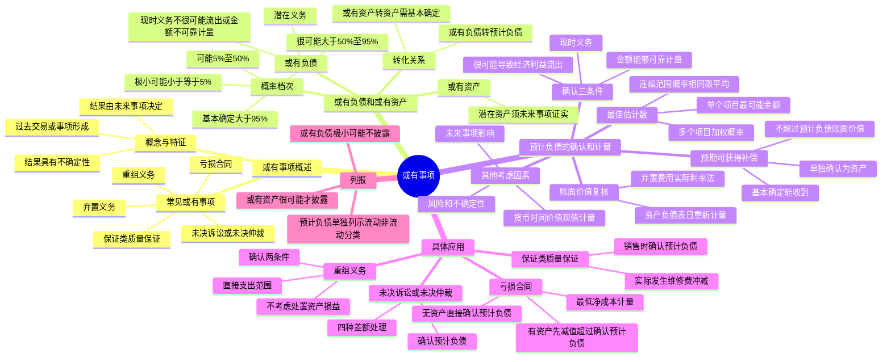

## 1. 章节定位

| 项目 | 信息 |
|------|------|
| 所属科目 | 会计 |
| 难度等级 | 3 |
| 历年分值 | 4-6 分 |
| 建议学时 | 4-6 小时 |
| 知识关联章节 | 第8章 负债（弃置费用）、第9章 职工薪酬（离职后福利）、第11章 借款费用（资本化暂停判断）、第13章 金融工具（财务担保合同）、第14章 租赁（亏损租赁合同）、第17章 收入（保证类质量保证）、第27章 资产负债表日后事项（期后调整事项） |

## 2. 考情分析

本章是会计科目的中频考点章节，历年分值约 4-6 分，常以客观题和主观题中的独立小问形式出现，主观题多与资产负债表日后事项、差错更正、所得税等章节联动考查。

**命题规律**：本章考点相对集中，主观题主要围绕预计负债的确认和计量展开，重点考查最佳估计数的确定、预期可获得补偿的处理，以及未决诉讼、亏损合同、重组义务等具体应用；客观题则集中在或有事项的特征判断、或有负债与或有资产的区分、概率档次的辨析。

**高频考点分布**：

1. **或有事项的定义和特征**：三个特征的判断，常见或有事项的识别，与固定资产折旧等非或有事项的区分。
2. **或有负债和或有资产**：或有负债的两类义务、或有资产的转化条件、概率档次的划分（基本确定、很可能、可能、极小可能）。
3. **预计负债的确认三条件**：现时义务、很可能导致经济利益流出、金额能够可靠计量。
4. **最佳估计数的确定**：连续范围且概率相同取平均值；非连续范围按单个项目最可能金额、多个项目按加权概率。
5. **预期可获得补偿**：基本确定能收到时单独确认为资产，不能抵减预计负债，金额不超过预计负债账面价值。
6. **预计负债计量的其他因素**：风险和不确定性、货币时间价值（现值计量）、未来事项的影响。
7. **预计负债账面价值的复核**：资产负债表日重新计量，弃置费用形成的预计负债按实际利率法确认财务费用。
8. **具体应用**：未决诉讼（四种差额处理）、保证类质量保证（销售时确认预计负债）、亏损合同（最低净成本、有资产先减值）、重组义务（直接支出范围）。
9. **列报**：预计负债的单独列报、或有负债和或有资产的披露要求。

**联动考查方式**：与资产负债表日后事项结合（期后判决结果调整预计负债）；与差错更正结合（前期应确认而未确认的更正）；与所得税结合（预计负债的计税基础与递延所得税资产）；与固定资产结合（弃置费用形成的预计负债及后续计量）。

**备考建议**：
- 牢记预计负债确认的"三条件"和计量的"两问题"（最佳估计数、预期补偿）；
- 区分"基本确定"（>95%）、"很可能"（>50%）、"可能"（5%-50%）、"极小可能"（≤5%）四档概率；
- 理解或有负债与预计负债的转化关系，以及或有资产转化为资产的"基本确定"门槛；
- 亏损合同处理区分"有用于履行合同的资产"和"无资产"两种情形；
- 重组义务的"直接支出"范围是高频考点，注意排除与未来经营活动相关的支出。

## 3. 知识框架

## 4. 核心精讲

### 4.1 或有事项概述

#### 4.1.1 或有事项的概念和特征

**或有事项**，是指过去的交易或者事项形成的，其结果须由某些未来事项的发生或不发生才能决定的不确定事项。常见的或有事项主要包括：未决诉讼或未决仲裁、保证类质量保证（含产品安全保证）、亏损合同、重组义务、弃置义务、环境污染整治、承诺等。

**适用范围**：本章适用于所有或有事项，但由职工薪酬、租赁、收入、所得税以及企业合并等章节规范的或有事项，分别适用相应的章。社会资本方与政府方就 PPP 项目合作订立合同，为使 PPP 项目资产保持一定的服务能力或在移交给政府方之前保持一定的使用状态，社会资本方根据 PPP 项目合同而提供的服务不构成单项履约义务的，应当将预计发生的支出，按照本章的规定进行会计处理。待执行合同、适用《企业会计准则第 22 号——金融工具确认和计量》的财务担保合同不适用本章，但待执行合同变成亏损合同的，应当适用本章有关亏损合同的规定。

**或有事项具有以下三个特征**：

**第一，或有事项是因过去的交易或者事项形成的**。是指或有事项的现存状况是过去交易或事项引起的客观存在。例如，未决诉讼是企业因过去的经济行为导致起诉或被起诉，是现存的一种状况；保证类质量保证是对已售出商品或已提供劳务质量的保证。基于这一特征，未来可能发生的自然灾害、交通事故、经营亏损等事项，都不属于或有事项。

**第二，或有事项的结果具有不确定性**。首先，结果是否发生具有不确定性（如未决诉讼中被告是否会败诉难以确定）；其次，结果预计将会发生，但发生的具体时间或金额具有不确定性（如企业因污染被起诉很可能败诉，但赔偿金额和发生时间难以确定）。

**第三，或有事项的结果须由未来事项决定**。或有事项的结果只能由未来不确定事项的发生或不发生才能决定。这种不确定性的消失，只能由未来不确定事项的发生或不发生才能证实。

**特殊说明**：在会计处理过程中存在不确定性的事项并不都是或有事项。例如，对固定资产计提折旧虽然也涉及对预计净残值和使用寿命的判断，但固定资产折旧是已经发生的损耗，原值确定，价值最终会转移到成本或费用中也是确定的，该事项的结果是确定的，不属于或有事项。

#### 4.1.2 或有负债和或有资产

**（1）或有负债**

**或有负债**，是指过去的交易或事项形成的潜在义务，其存在须通过未来不确定事项的发生或不发生予以证实；或过去的交易或事项形成的现时义务，履行该义务不是很可能导致经济利益流出企业或该义务的金额不能可靠计量。

或有负债涉及两类义务：
- **潜在义务**：是指结果取决于不确定未来事项的可能义务。潜在义务最终是否转变为现时义务，由某些未来不确定事项的发生或不发生才能决定。
- **现时义务**：是指企业在现行条件下已承担的义务，该现时义务的履行不是很可能导致经济利益流出企业，或者该现时义务的金额不能可靠地计量。例如，甲公司涉及一桩诉讼案，根据以往审判案例推断很可能要败诉，但法院尚未判决，甲公司无法判断未来将要承担多少赔偿金额，因此该现时义务的金额不能可靠地计量，该诉讼案件即形成一项甲公司的或有负债。

**（2）或有资产**

**或有资产**，是指过去的交易或者事项形成的潜在资产，其存在须通过未来不确定事项的发生或不发生予以证实。或有资产作为一种潜在资产，其结果具有较大的不确定性，只有随着经济情况的变化，通过某些未来不确定事项的发生或不发生才能证实其是否会形成企业真正的资产。例如，甲企业向法院起诉乙企业侵犯了其专利权，法院尚未审理，甲企业是否胜诉尚难判断。对于甲企业而言，将来可能胜诉而获得的赔偿属于一项或有资产，该或有资产是否会转化为真正的资产，要由法院的判决结果确定。

**（3）概率档次**

履行或有事项相关义务导致经济利益流出的可能性，通常按照一定的概率区间加以判断。一般情况下，发生的概率分为以下几个层次：

| 概率档次 | 发生概率 |
|---------|---------|
| 基本确定 | 大于 95% 但小于 100% |
| 很可能 | 大于 50% 但小于或等于 95% |
| 可能 | 大于 5% 但小于或等于 50% |
| 极小可能 | 大于 0 但小于或等于 5% |

**（4）或有负债、或有资产与预计负债、资产的转化关系**

虽然或有负债和或有资产不符合负债或资产的定义和确认条件，企业不应当将其确认为负债和资产，而应当进行相应的披露。但影响或有负债和或有资产的多种因素处于不断变化之中，企业应当持续关注。

随着时间的推移和事态的进展：或有负债对应的潜在义务可能转化为现时义务，原本不是很可能导致经济利益流出的现时义务也可能被证实将很可能导致经济利益流出企业，并且现时义务的金额也能够可靠计量，这时或有负债就转化为企业的负债（预计负债），应当予以确认。或有资产对应的潜在资产最终是否能够流入企业会逐渐变得明确，如果某一时点企业基本确定能够收到这项潜在资产并且其金额能够可靠计量，则应当将其确认为企业的资产。

例如，未决诉讼对于预期会胜诉的一方形成一项或有资产，最终判决胜诉的，该或有资产转化为企业的资产。对于预期会败诉的一方形成或有负债或预计负债，企业根据法律规定、律师建议等因素判断自身很可能败诉且赔偿金额能够合理估计的，该或有负债就转化为预计负债。

### 4.2 或有事项的确认和计量

#### 4.2.1 或有事项的确认

或有事项形成的或有资产只有在企业基本确定能够收到的情况下，才转化为真正的资产，从而予以确认。与或有事项有关的义务应当在同时符合以下三个条件时确认为负债，作为预计负债进行确认和计量：

1. 该义务是企业承担的现时义务；
2. 履行该义务很可能导致经济利益流出企业；
3. 该义务的金额能够可靠地计量。

**第一，该义务是企业承担的现时义务**。即与或有事项相关的义务是在企业当前条件下已承担的义务，企业没有其他现实的选择，只能履行该现时义务。

通常情况下，过去的交易或事项是否导致现时义务比较明确，但也存在极少情况（如法律诉讼），企业应当考虑包括资产负债表日后所有可获得的证据、专家意见等，以此确定资产负债表日是否存在现时义务。如果据此判断资产负债表日很可能存在现时义务，且符合预计负债确认条件的，应当确认一项负债；如果资产负债表日现时义务很可能不存在，企业应披露一项或有负债，除非含有经济利益的资源流出企业的可能性极小。

此处的义务包括**法定义务**和**推定义务**：
- **法定义务**，是指因合同、法规或其他司法解释等产生的义务，通常是企业依据法律、法规的规定必须履行的责任。比如，企业与其他企业签订购货合同产生的义务就属于法定义务。
- **推定义务**，是因企业以往的习惯做法、已公开的承诺或声明、已公开宣布的政策等而承担的义务。企业向外界表明了它将承担特定的责任，从而使受影响的各方形成了其将履行那些责任的合理预期。

例如，甲公司是一家化工企业，到 A 国创办分公司。假定 A 国尚未针对此类企业的环境污染制定相关法律，甲公司的分公司不承担法定义务。但是，甲公司为树立良好形象，自行向社会公告宣称将对环境污染进行治理。该分公司为此承担的义务就属于推定义务。

管理层或董事会的决定在资产负债表日并不一定形成推定义务，除非该决定在资产负债表日之前已经以一种相当具体的方式传达给受影响的各方，使各方形成了企业将履行其责任的合理预期。

**第二，履行该义务很可能导致经济利益流出企业**。即履行与或有事项相关的现时义务时，导致经济利益流出企业的可能性超过 50%，但尚未达到基本确定的程度。企业存在很多类似义务（如保证类产品质量保证或类似合同），履行时要求经济利益流出的可能性应通过总体考虑才能确定。对于某个项目而言，虽然经济利益流出的可能性较小，但包括该项目的该类义务很可能导致经济利益流出的，应当视同该项目义务很可能导致经济利益流出企业。

**第三，该义务的金额能够可靠地计量**。即与或有事项相关的现时义务的金额能够合理地估计。要对或有事项确认一项负债，相关现时义务的金额应当能够可靠估计，并同时满足其他两个条件。例如，乙股份有限公司涉及一起诉讼案，根据以往的审判结果判断公司很可能败诉，相关的赔偿金额也可以估算出一个区间，此时就可以认为该公司因未决诉讼承担的现时义务的金额能够可靠地计量，如果同时满足其他两个条件，就可以确认为一项负债。又如，乙企业因合同纠纷被起诉，法院一审已判决其败诉并确定其赔偿金额，乙企业应确认相应的预计负债，不能仅因不服一审判决将上诉或二审仍在进行等原因而不确认预计负债。

#### 4.2.2 预计负债的计量

当与或有事项有关的义务符合确认为负债的条件时应当将其确认为预计负债，预计负债应当按照履行相关现时义务所需支出的最佳估计数进行初始计量。此外，企业清偿预计负债所需支出还可能从第三方或其他方获得补偿。因此，或有事项的计量主要涉及两个问题：一是最佳估计数的确定；二是预期可获得补偿的处理。

**（一）最佳估计数的确定**

预计负债应当按照履行相关现时义务所需支出的最佳估计数进行初始计量。最佳估计数的确定应当分别两种情况处理：

**第一种情况**：所需支出存在一个连续范围（或区间），且该范围内各种结果发生的可能性相同，则最佳估计数应当按照该范围内的中间值，即上下限金额的平均数确定。

**第二种情况**：所需支出不存在一个连续范围，或者虽然存在一个连续范围但该范围内各种结果发生的可能性不相同：
- 如果或有事项涉及**单个项目**（如一项未决诉讼、一项未决仲裁等），最佳估计数按照最可能发生金额确定。
- 如果或有事项涉及**多个项目**（如保证类产品质量保证中，提出产品保修要求的可能有许多客户），最佳估计数按照各种可能结果及相关概率计算确定。

**（二）预期可获得补偿的处理**

如果企业清偿因或有事项而确认的负债所需支出全部或部分预期由第三方或其他方补偿，则此补偿金额只有在**基本确定能收到**时，才能作为资产单独确认，确认的补偿金额不能超过所确认负债的账面价值。

预期可能获得补偿的情况通常有：发生交通事故等情况时，企业通常可从保险公司获得合理的赔偿；在某些索赔诉讼中，企业可对索赔人或第三方另行提出赔偿要求。

企业预期从第三方获得的补偿，是一种潜在资产，具有较大的不确定性，企业只能在基本确定能够收到补偿时才能对其进行确认。根据**资产和负债不能随意抵销**的原则，预期可获得的补偿在基本确定能够收到时应当确认为一项资产，而不能作为预计负债金额的扣减。

**（三）预计负债的计量需要考虑的其他因素**

企业在确定最佳估计数时，应当综合考虑与或有事项有关的风险和不确定性、货币时间价值和未来事项等因素。

**1. 风险和不确定性**：风险是对交易或事项结果的变化可能性的一种描述。企业在不确定的情况下进行判断需要谨慎，使得收益或资产不会被高估，费用或负债不会被低估。企业应当充分考虑风险和不确定性，既不能忽略其影响，也需要避免重复调整，在低估和高估预计负债金额之间寻找平衡点。

**2. 货币时间价值**：预计负债的金额通常应当等于未来应支付的金额。但如果预计负债的确认时点距离实际清偿有较长的时间跨度，货币时间价值的影响重大，那么应考虑采用现值计量，即通过对相关未来现金流出进行折现后确定最佳估计数。将未来现金流出折算为现值时注意：①折现率应当是反映货币时间价值的当前市场估计和相关负债特有风险的税前利率；②风险和不确定性既可以在计量未来现金流出时作为调整因素，也可以在确定折现率时予以考虑，但不能重复反映；③随着时间的推移，即使未来现金流出和折现率均不改变，预计负债的现值将逐渐增长，企业应当在资产负债表日对预计负债的现值进行重新计量。

**3. 未来事项**：企业应当考虑可能影响履行现时义务所需金额的相关未来事项。如果有足够的客观证据表明它们将发生（如未来技术进步、相关法规出台等），则应当在预计负债计量中考虑相关未来事项的影响，但不应考虑预期处置相关资产形成的利得。例如，某核电企业预计清理核废料的费用将因未来技术变化而显著降低，该企业确认的预计负债金额应当反映有关专家对技术发展及清理费用减少作出的合理预测，但需取得客观证据予以支持。

#### 4.2.3 对预计负债账面价值的复核

企业应当在资产负债表日对预计负债的账面价值进行复核。有确凿证据表明该账面价值不能真实反映当前最佳估计数的，应当按照当前最佳估计数对该账面价值进行调整。例如，某化工企业对环境造成了污染，按照当时的法律规定只需要清理污染，随着环保要求趋严，该企业不但需要清理污染，还很可能要对居民进行赔偿。企业应当在资产负债表日对预计负债金额进行复核，相关因素发生变化时按当前最佳估计数调整账面价值。

**弃置费用形成的预计负债**在确认后，按照实际利率法计算的利息费用应当确认为财务费用。由于技术进步、法律要求或市场环境变化等原因，特定固定资产的弃置义务发生支出金额、预计弃置时点、折现率等变动引起的预计负债变动，应按照下列原则调整该固定资产的成本：
1. 对于预计负债的减少，以该固定资产账面价值为限扣减固定资产成本。如果预计负债的减少额超过该固定资产账面价值，超出部分确认为当期损益。
2. 对于预计负债的增加，增加该固定资产的成本。

按照上述原则调整的固定资产，在资产剩余使用年限内计提折旧。一旦该固定资产的使用寿命结束，预计负债的所有后续变动应在发生时确认为损益。

### 4.3 或有事项会计处理的具体应用

#### 4.3.1 未决诉讼或未决仲裁

**诉讼**，是指当事人不能通过协商解决争议，因而在人民法院起诉、应诉，请求人民法院通过审判程序解决纠纷的活动。诉讼尚未裁决之前，对于被告来说，可能形成一项或有负债或者预计负债；对于原告来说，则可能形成一项或有资产。

**仲裁**，是指经济法的各方当事人依照事先约定或事后达成的书面仲裁协议，共同选定仲裁机构并由其对争议依法作出具有约束力裁决的一种活动。作为当事人一方，仲裁结果在仲裁决定公布以前是不确定的，会构成一项潜在义务或现时义务，或者潜在资产。

对于未决诉讼，企业当期实际发生的诉讼损失金额与已计提的相关预计负债之间的差额，应分别情况处理：

| 情形 | 处理方式 |
|------|---------|
| 前期已合理预计预计负债 | 将实际发生诉讼损失与已计提预计负债的差额，直接计入或冲减当期营业外支出 |
| 前期所作估计与当时事实严重不符 | 按照重大会计差错更正的方法进行处理 |
| 前期确实无法合理估计，未确认预计负债 | 在损失实际发生的当期，直接计入当期营业外支出 |
| 资产负债表日后至财务报告批准报出日之间发生的未决诉讼 | 按资产负债表日后事项准则有关规定处理 |

#### 4.3.2 保证类质量保证

**保证类质量保证**，通常指销售商或制造商在销售产品或提供劳务后，对客户提供商品或服务的质量符合既定标准的一种承诺。在约定期内（或终身保修），若产品或劳务在正常使用过程中出现质量问题，企业负有更换产品、免费或只收成本价进行修理等责任（不构成单项履约义务）。企业应当在符合确认条件的情况下，于销售成立时确认预计负债。

在对产品质量保证确认预计负债时，需要注意的是：
1. 如果发现产品质量保证费用的实际发生额与预计数相差较大，应及时对预计比例进行调整。
2. 如果企业针对特定批次产品确认预计负债，则在保修期结束时，应将"预计负债——产品质量保证"科目余额冲销，不留余额，同时冲减"主营业务成本"等科目。
3. 已对其确认预计负债的产品，如企业不再生产了，那么应在相应的产品质量保证期满后，将"预计负债——产品质量保证"科目余额冲销，不留余额。

#### 4.3.3 亏损合同

**（一）待执行合同与亏损合同**

**待执行合同**，是指合同各方未履行任何合同义务，或部分履行了同等义务的合同（如商品买卖合同、劳务合同、租赁合同等）。待执行合同不属于或有事项，但待执行合同变为亏损合同的，应当作为或有事项。

**亏损合同**，是指履行合同义务不可避免会发生的成本超过预期经济利益的合同。其中，"履行合同义务不可避免会发生的成本"应当反映退出该合同的最低净成本，即履行该合同的成本与未能履行该合同而发生的补偿或处罚两者之间的较低者。履行该合同的成本包括履行合同的增量成本（直接人工、直接材料等）和与履行合同直接相关的其他成本的分摊金额（如用于履行合同的固定资产折旧费用分摊金额等）。

**（二）亏损合同的会计处理**

待执行合同变为亏损合同，同时该亏损合同产生的义务满足预计负债的确认条件的，应当确认为预计负债。预计负债的计量应当反映退出该合同的最低净成本。

企业对亏损合同进行会计处理，需要遵循以下两点原则：

**原则一**：如果与亏损合同相关的义务不需支付任何补偿即可撤销，企业通常就不存在现时义务，不应确认预计负债；如果与亏损合同相关的义务不可撤销，企业就存在了现时义务，同时满足该义务很可能导致经济利益流出企业且金额能够可靠地计量的，应当确认预计负债。

**原则二**：待执行合同变为亏损合同时，应当区分是否存在用于履行合同的资产：
- **合同存在用于履行合同的资产的**，应当对用于履行合同的资产进行减值测试并按规定确认减值损失，企业通常不需确认预计负债，如果预计亏损超过该减值损失，将超过部分确认为预计负债。
- **合同不存在用于履行合同的资产的**，亏损合同相关义务满足预计负债确认条件时，应当确认预计负债。

确认日常经营活动相关的亏损合同涉及的预计负债，在确认并记入"预计负债"科目贷方的同时，确认并记入"主营业务成本"科目的借方。

#### 4.3.4 重组义务

**（一）重组义务的确认**

**重组**是指企业制定和控制的，将显著改变企业组织形式、经营范围或经营方式的计划实施行为。属于重组的事项主要包括：①出售或终止企业的部分业务；②对企业的组织结构进行较大调整；③关闭企业的部分营业场所，或将营业活动从一个国家或地区迁移到其他国家或地区。

企业应当区分重组与企业合并、债务重组。重组通常是企业内部资源的调整和组合，谋求现有资产效能的最大化；企业合并是将两个或两个以上单独的企业合并形成一个报告主体的交易或事项；债务重组是指在不改变交易对方的情况下，经债权人和债务人协定或法院裁定，就清偿债务的时间、金额或方式等重新达成协议的交易。

企业因重组而承担了重组义务，并且同时满足预计负债的三项确认条件时，才能确认预计负债。

**同时存在下列情况的，表明企业承担了重组义务**：
1. 有详细、正式的重组计划，包括重组涉及的业务、主要地点、需要补偿的职工人数、预计重组支出、计划实施时间等；
2. 该重组计划已对外公告。

其次，需要判断重组义务是否同时满足预计负债的三个确认条件（现时义务、很可能导致经济利益流出、金额能够可靠计量）。只有同时满足这三个确认条件，才能将重组义务确认为预计负债。例如，某公司董事会决定关闭一个事业部，如果有关决定尚未传达到受影响的各方，也未采取任何措施实施，该公司就没有开始承担重组义务，不应确认预计负债；如果有关决定已经传达到受影响的各方，并使各方对企业将关闭事业部形成合理预期，通常表明企业开始承担重组义务，同时满足其他条件的，应当确认预计负债。

**（二）重组义务的计量**

企业应当按照与重组有关的**直接支出**确定预计负债金额，计入当期损益。其中，直接支出是企业重组必须承担的、与主体继续进行的活动无关的支出（如自愿遣散、强制遣散、不再使用厂房的租赁撤销费等），**不包括**留用职工岗前培训、市场推广、新系统和营销网络投入等支出，因为这些支出与未来经营活动有关，在资产负债表日不是重组义务。

企业在计量预计负债时不应当考虑预期处置相关资产的利得或损失。即，在计量与重组义务相关的预计负债时，即使资产的出售构成重组的一部分，企业也不考虑处置相关资产（如厂房、店面、事业部等）可能形成的利得或损失。处置重组涉及资产的利得或损失应当在企业丧失相关资产的控制权时单独确认。

**与重组有关支出的判断**：

| 支出项目 | 是否直接支出 | 原因 |
|---------|------------|------|
| 自愿遣散、强制遣散（自愿遣散目标未满足时） | 是 | 与主体继续活动无关 |
| 不再使用的厂房租赁撤销费 | 是 | 与主体继续活动无关 |
| 职工和设备转移至继续使用的工厂 | 否 | 与继续进行的活动相关 |
| 剩余职工岗前培训 | 否 | 与继续进行的活动相关 |
| 新经理招募成本 | 否 | 与继续进行的活动相关 |
| 推广公司新形象营销成本 | 否 | 与继续进行的活动相关 |
| 对新分销网络的投资 | 否 | 与继续进行的活动相关 |
| 重组的未来可辨认经营损失 | 否 | 与继续进行的活动相关 |
| 特定不动产、厂场和设备的减值损失 | 否 | 按资产减值准则评估，作为资产抵减项 |

### 4.4 或有事项的列报

#### 4.4.1 预计负债的列报

在资产负债表中，因或有事项而确认的负债（预计负债）应与其他负债项目区别开来，单独反映。企业应当按照预计负债的种类、形成原因以及经济利益预期流出时间的长短，根据总账余额和明细账余额分析填列资产负债表。

**列报分类**：
- 期限在一年或一个营业周期以内的预计负债，在"其他流动负债"项目列报；
- 其他预计负债在非流动负债中的"预计负债"项目列报；
- 将一年内到期的"预计负债"应当重分类至"一年内到期的非流动负债"；
- 对于期限在一年或一个营业周期以上的保证类质量保证形成的预计负债，企业应将预计在未来一年或一个营业周期以内清偿的部分计入"其他流动负债"项目列报。

在利润表中，因或有事项确认的支出或费用，应当通过"管理费用"、"营业外支出"等科目反映。在附注中，企业应当披露预计负债的种类、形成原因、经济利益流出不确定性的说明、各类预计负债的期初、期末余额和本期变动情况等。

#### 4.4.2 或有负债的披露

或有负债无论作为潜在义务还是现时义务，均不符合负债的确认条件，因而不予确认。除非或有负债极小可能导致经济利益流出企业，否则企业应当在附注中披露：或有负债的种类及其形成原因、经济利益流出企业的可能性、预计产生的财务影响以及获得补偿的可能性（无法预计的应当说明原因）。

在涉及未决诉讼、未决仲裁的情况下，如果披露全部或部分信息预期对企业造成重大不利影响，企业无须披露这些信息，但应当披露该未决诉讼、未决仲裁的性质，以及没有披露这些信息的事实和原因。

#### 4.4.3 或有资产的披露

或有资产作为一种潜在资产，不符合资产确认条件，因而不予确认。企业通常不应当披露或有资产，但或有资产很可能会给企业带来经济利益的，应当披露其形成的原因、预期产生的财务影响等。只有在或有资产基本确定能够收到时，才能将其确认为企业的资产。

## 5. 典型例题

**【例题 1】（最佳估计数的确定——连续范围）**

2×24 年 11 月 1 日，乙公司因合同违约被丁公司起诉。2×24 年 12 月 31 日，法院尚未判决。丁公司预计很可能在诉讼中获胜，估计将来很可能获得赔偿金额 1 900 000 元。乙公司认为最终法律判决很可能对公司不利，预计将要支付的赔偿金额、诉讼费等费用为 1 600 000 元至 2 000 000 元之间的某一金额，且该区间内每个金额的可能性都大致相同，其中诉讼费为 30 000 元。

要求：分别说明丁公司和乙公司的会计处理。

**答案**：

（1）丁公司不应当确认或有资产，而应当在 2×24 年 12 月 31 日的报表附注中披露或有资产 1 900 000 元。

（2）乙公司应在资产负债表中确认一项预计负债：

预计负债金额 =（1 600 000 + 2 000 000）÷ 2 = **1 800 000（元）**

同时在 2×24 年 12 月 31 日的附注中进行披露。乙公司的有关账务处理如下：

借：管理费用——诉讼费 30 000
　　营业外支出 1 770 000
　贷：预计负债——未决诉讼 1 800 000

**解析**：丁公司作为原告，或有资产未达到"基本确定"的标准，不能确认资产，仅在附注披露。乙公司作为被告，赔偿金额存在连续范围（160 万元至 200 万元）且各金额概率相同，取上下限平均值 180 万元作为最佳估计数。诉讼费计入管理费用，赔偿金额扣除诉讼费后的部分计入营业外支出。

**【例题 2】（最佳估计数的确定——多个项目）**

甲公司是生产并销售 A 产品的企业。2×24 年第一季度，共销售 A 产品 60 000 件，销售收入为 360 000 000 元。甲公司对其销售的机床作出不属于单项履约义务的产品质量保证承诺（保证类质量保证），产品售出后一年内如出现非意外事件造成的故障和质量问题，公司将负责免费维修（含零部件更换）。

根据以前年度的维修记录：如果发生较小的质量问题，发生的维修费用为销售收入的 1%；如果发生较大的质量问题，发生的维修费用为销售收入的 2%。根据公司技术部门的预测，本季度销售的产品中：80% 不会发生质量问题；15% 可能发生较小质量问题；5% 可能发生较大质量问题。

2×24 年第一季度，甲公司实际发生的维修费为 850 000 元，"预计负债——产品质量保证"科目 2×23 年末余额为 30 000 元。

要求：计算甲公司 2×24 年第一季度应确认的预计负债金额，并编制相关会计分录。

**答案**：

（1）确认与产品质量保证有关的预计负债：

预计负债金额 = 360 000 000 ×（0 × 80% + 1% × 15% + 2% × 5%）= **900 000（元）**

借：主营业务成本——产品质量保证 900 000
　贷：预计负债——产品质量保证 900 000

（2）发生产品质量保证费用（维修费）：

借：预计负债——产品质量保证 850 000
　贷：银行存款或原材料等 850 000

"预计负债——产品质量保证"科目 2×24 年第一季度末的余额 = 900 000 − 850 000 + 30 000 = **80 000（元）**。

**解析**：涉及多个项目（多个客户的保修要求），按各种可能结果及相关概率计算确定最佳估计数。不发生质量问题概率 80%，较小质量问题概率 15%（费率 1%），较大质量问题概率 5%（费率 2%），加权计算得出预计负债 90 万元。实际发生维修费冲减预计负债，期末余额 8 万元。

**【例题 3】（预期可获得补偿的处理）**

2×24 年 12 月 31 日，乙股份有限公司因或有事项确认了一笔金额为 1 000 000 元的预计负债；同时，公司因该或有事项，基本确定可从甲股份有限公司获得 400 000 元的赔偿。

要求：说明乙公司的会计处理。

**答案**：

乙股份有限公司应分别确认一项金额为 1 000 000 元的预计负债（负债）和一项金额为 400 000 元的资产（其他应收款），而不能只确认一项金额为 600 000 元（1 000 000 − 400 000）的负债。同时，公司所确认的补偿金额 400 000 元不能超过所确认的负债的账面价值 1 000 000 元。

**解析**：预期可获得的补偿只有在基本确定能够收到时才能作为资产单独确认，根据"资产和负债不能随意抵销"原则，不能直接冲减预计负债金额。补偿金额确认上限为预计负债账面价值 1 000 000 元，本题 400 000 元未超过上限，全额确认。

**【例题 4】（亏损合同的会计处理）**

甲公司是一家发电企业。2×22 年 8 月，甲公司与某煤炭供应商签订《煤炭采购合同》，约定以每吨 1 500 元的价格采购 2 万吨煤炭，若撤销合同需按总价款 10% 赔偿违约金。2×22 年 12 月，甲公司发电厂所在地颁布新环保法规，此批煤炭质量标准不再符合当地发电企业能源清洁度要求。

假定无须发生其他销售费用，甲公司若将该批煤炭出售给其他可以使用的第三方，售价为每吨 1 400 元，即每吨亏 100 元，预计损失 200 万元；若撤销合同，需支付违约金 300 万元。

要求：说明甲公司对该合同的会计处理。

**答案**：

（1）判断是否为亏损合同：甲公司若履行合同，以每吨 1 500 元采购后只能以每吨 1 400 元出售，损失 200 万元；若撤销合同，需支付违约金 300 万元。

履行合同不可避免会发生的成本（最低净成本）= min（履行合同的成本 200 万元，撤销合同的违约金 300 万元）= **200 万元**

该合同履行成本（200 万元）超过预期经济利益（煤炭无法使用且无其他经济利益），属于亏损合同。

（2）会计处理：由于该合同不存在用于履行合同的资产（煤炭尚未入库，属于采购合同），亏损合同相关义务满足预计负债确认条件时，应当确认预计负债。

预计负债金额 = 200 万元

借：主营业务成本 2 000 000
　贷：预计负债——亏损合同 2 000 000

**解析**：亏损合同的预计负债计量应当反映退出该合同的最低净成本，即履行合同的成本与撤销合同的违约金两者之间的较低者。本题履行成本 200 万元 < 违约金 300 万元，故按 200 万元确认预计负债。由于合同不存在用于履行合同的资产，直接确认预计负债并计入主营业务成本。

**【例题 5】（重组义务的确认与计量）**

2×24 年 10 月，甲公司董事会决定关闭其下属的一个事业部，并制定了详细的重组计划（包括业务范围、主要地点、需要补偿的职工人数、预计重组支出和计划实施时间等）。2×24 年 11 月 15 日，该重组计划经董事会批准后正式对外公告。重组涉及的相关支出如下：自愿遣散支出 500 万元；不再使用的厂房租赁撤销费 300 万元；留用职工岗前培训费 100 万元；推广公司新形象的营销费用 200 万元；拟关闭事业部相关设备的减值损失 150 万元。

要求：计算甲公司应确认的重组义务预计负债金额。

**答案**：

属于重组直接支出的项目：自愿遣散支出 500 万元、不再使用的厂房租赁撤销费 300 万元。

不属于直接支出的项目：留用职工岗前培训费 100 万元（与未来经营活动相关）、推广公司新形象营销费用 200 万元（与未来经营活动相关）、设备减值损失 150 万元（按资产减值准则处理，作为资产抵减项）。

重组义务预计负债金额 = 500 + 300 = **800（万元）**

借：营业外支出 8 000 000
　贷：预计负债——重组义务 8 000 000

**解析**：重组义务的预计负债应当按照与重组有关的直接支出确定。直接支出是企业重组必须承担的、与主体继续进行的活动无关的支出，包括自愿遣散、强制遣散、租赁撤销费等。留用职工岗前培训、市场推广、新系统投入等与未来经营活动相关的支出不属于直接支出；资产减值损失按资产减值准则单独处理。

## 6. 记忆口诀

**或有事项三特征**："过去形成、结果不确定、未来事项定"——因过去交易或事项形成、结果具有不确定性、结果由未来事项决定。

**概率四档次**："基本确定九十五，很可能过半，可能五到半，极小不过五"——基本确定 >95%、很可能 >50%、可能 5%-50%、极小可能 ≤5%。

**预计负债确认三条件**："现时义务、很可能流出、金额可靠计量"——三个条件同时满足。

**最佳估计数两情况**："连续范围取平均，非连续单个取最可能多个加权算概率"——存在连续范围且概率相同取上下限平均值；单个项目取最可能金额，多个项目按加权概率。

**预期补偿三要点**："基本确定才确认、单独确认为资产、不超负债账面值"——补偿只有在基本确定能收到时才能确认，单独确认为资产，不能抵减预计负债，金额不超过预计负债账面价值。

**计量考虑三因素**："风险不确定、货币时间价值、未来事项影响"——确定最佳估计数时应综合考虑风险和不确定性、货币时间价值（现值计量）、未来事项。

**或有负债与或有资产转化**："或有负债满足条件转预计负债，或有资产基本确定才转资产"——或有负债转化为预计负债需满足三条件；或有资产只有在基本确定能收到时才确认为资产。

**未决诉讼四差额**："已计提差计入当期、估计严重不符走差错、未估计直接计入、期后事项走日后"——四种差额处理方式。

**亏损合同两原则**："可撤销不确认、不可撤销看资产；最低净成本履行与违约取低"——可撤销合同不存在现时义务不确认；不可撤销合同区分有无用于履行合同的资产，有资产先减值超过部分确认预计负债，无资产直接确认预计负债。

**重组义务两条件**："详细正式计划加对外公告"——同时存在详细正式重组计划且已对外公告，才表明承担了重组义务。

**重组直接支出范围**："遣散租赁撤销费，培训营销不包含；处置资产损益单独算，不影响重组预计负债"——直接支出包括自愿遣散、强制遣散、租赁撤销费；不包括留用职工岗前培训、市场推广、新系统投入、招募成本等与未来经营活动相关的支出；计量重组预计负债时不考虑预期处置相关资产的利得或损失。

**预计负债列报分类**："一年以内其他流动，其他预计非流动，一年内到期重分类"——按清偿时间分类列报。

**或有负债与或有资产披露**："或有负债极小可能不披露，重大不利可不披露但说明原因；或有资产很可能才披露，基本确定才转资产"——披露与确认的门槛不同。

## 7. 同步练习

**204.（单选题）** 甲公司因违反合约被乙公司起诉，要求其赔偿损失。经咨询，甲公司认为赔偿损失500万元的可能性为80%，赔偿金额为350万元的可能性为20%。甲公司预计能够从第三方得到补偿的可能性为85%，金额为400万元。假定不考虑其他因素，甲公司应确认的预计负债金额为（　）。

A. 470万元
B. 500万元
C. 100万元
D. 70万元

---

**205.（单选题）** 20×2年12月1日，甲公司与乙公司签订一项不可撤销的产品销售合同，合同规定：甲公司于3个月后向乙公司交付一批产品，合同价格（不含增值税额）为500万元，如甲公司违约，将支付违约金100万元。至20×2年年末，甲公司为生产该产品已发生成本20万元，因原材料价格上涨，甲公司预计生产该产品的总成本为580万元。不考虑其他因素，20×2年12月31日，甲公司因该合同确认的预计负债为（　）。

A. 20万元
B. 60万元
C. 80万元
D. 100万元

---

**206.（单选题）** 甲公司是一家化工厂，其产生的化工废料严重影响了当地环境。由于其治污不力，被当地居民起诉，要求其赔偿损失共计500万元。甲公司经咨询，预计很可能赔偿金额为300万元。至2×22年年末，该未决诉讼尚未判决。2×23年2月1日，法院开庭审理，判决甲公司应向当地居民支付赔偿款400万元，甲公司与当地居民均服从判决，并于2月底结算赔偿款。税法规定，该赔偿金额在实际发生时允许税前扣除。甲公司2×22年的财务报告于2×23年4月30日批准对外报出。甲公司适用的所得税税率为25%，假定甲公司在未来期间能够产生足够的应纳税所得额用以抵扣可抵扣暂时性差异。不考虑其他因素，下列关于该事项的会计处理的表述中，正确的是（　）。

A. 2×22年，甲公司确认预计负债500万元
B. 2×23年2月1日，甲公司确认其他应付款400万元
C. 2×23年2月1日，甲公司确认递延所得税资产75万元
D. 甲公司不应进行账务处理，应对上述事项在财务报表附注中进行披露

---

**207.（单选题）** 2×22年12月，经董事会批准，甲公司自2×23年1月1日起撤销某营销网点，该业务重组计划已对外公告。为实施该业务重组计划，甲公司预计发生以下支出或损失：因辞退职工将支付补偿款500万元；预计门店内特定设备将发生减值65万元；因将门店内库存存货运回公司本部将发生运输费5万元。不考虑其他因素，该业务重组计划对甲公司2×22年度利润总额的影响金额为（　）。

A. -715万元
B. -500万元
C. -565万元
D. -150万元

---

**208.（单选题）** （2024年）2×23年甲公司向乙公司销售一批自产设备，因质量问题导致乙公司使用该设备生产时出现大量残次品。因双方协商无果，乙公司向法院提起诉讼，要求甲公司赔偿损失。甲公司预计很可能赔偿1500万元，预计很可能支付诉讼费20万元。该设备的质量问题是由于甲公司的供应商丙公司提供的关键零部件有问题，根据合同约定，甲公司有权向丙公司追偿1400万元。甲公司已对丙公司提起诉讼，预计很可能收到赔偿1400万元。上述诉讼至2×23年年末均未做出实际判决。不考虑其他因素，对于上述未决诉讼，2×23年甲公司下列会计处理正确的是（　）。

A. 确认资产1400万元
B. 确认管理费用20万元
C. 确认其他业务成本1520万元
D. 确认预计负债1500万元

---

**209.（单选题）** （2022年）甲公司发生的有关交易或事项如下：①2×20年3月1日向乙公司销售商品。因乙公司未按合同约定付款，甲公司向法院提起诉讼，要求乙公司支付货款500万元以及违约金30万元。截至2×20年12月31日法院尚未做出判决。②以前年度承接的一项建设和运营高速公路的PPP项目，自2×20年1月1日进入运营收费期，政府不对甲公司收取的车辆通行费提供保证，甲公司预计5年后需要对路面进行翻新发生费用600万元，路面翻新不构成单项履约义务。③2×20年2月1日丙公司的银行借款到期，由于丙公司未按期还款。银行提起诉讼要求甲公司履行其担保责任。甲公司预计需要向银行赔偿1000万元，2×21年2月18日法院做出终审判决，判定甲公司向银行赔偿1200万元，相关款项尚未支付。甲公司2×20年度财务报告于2×21年3月15日经批准报出。不考虑货币时间价值及其他因素，甲公司2×20年12月31日的资产负债表中，确认的负债金额是（　）。

A. 1070万元
B. 1320万元
C. 1600万元
D. 1800万元

---

**210.（单选题）** 甲公司2×22年12月份发生的下列或有事项中，对当期损益的影响金额及核算的会计科目，处理正确的是（　）。

A. 对一项未决诉讼很可能赔偿的损失200万元计入营业外支出，同时将基本确定从第三方获得的补偿30万元确认营业外收入
B. 对一项重组义务中发生的员工遣散费支出230万元计入管理费用，同时将因撤销厂房租赁合同应支付的款项20万元也计入管理费用
C. 对一项销售收入为2000万元的业务计提保证类质量保证支出，按照以往经验，发生的保修费一般为销售额的2.5%，因此计提了50万元的预计负债并计入主营业务成本
D. 对一项亏损合同，已发生成本为38万元，已知执行合同损失38万元，产品如果按照市价销售将会获利5万元，由于如果不执行合同甲公司将支付40万元的违约金，因此选择执行合同并确认38万元资产减值损失

---

**211.（单选题）** 下列关于重组义务的计量，表述不正确的是（　）。

A. 在计量重组义务的预计负债时，要考虑处置相关资产的预计利得或损失
B. 重组义务中特定资产、设备的减值损失，应遵循资产减值准则予以确认
C. 对于重组义务中租赁合同撤销费确认的预计负债，应记入"营业外支出"科目
D. 处置重组涉及资产的利得或损失应当在企业丧失相关资产的控制权时单独确认

---

**212.（多选题）** 下列关于或有事项基本特征的表述中，正确的有（　）。

A. 由过去的交易或事项形成
B. 结果具有不确定性
C. 结果须由未来事项决定
D. 可以确认为资产或负债

---

**213.（多选题）** 2×22年12月1日某物流公司接受甲公司委托由A城运送一批产品到B城，司机按照公司要求日夜兼程赶往B城，由于疲劳驾驶导致车祸，给行人李某造成人身伤害。李某向该物流公司提起诉讼，要求赔偿150万元。至2×22年12月31日，法院尚未做出判决。物流公司预计该诉讼很可能败诉，赔偿金额在100~150万元之间，且在此范围内支付各种赔偿金额的可能性相同，另外还需要支付诉讼费用3万元，基本确定可以从保险公司收到150万元赔偿款。不考虑其他因素，下列关于该物流公司会计处理的表述中，正确的有（　）。

A. 该事项应确认预计负债128万元
B. 该事项应确认资产128万元
C. 该事项应确认预计负债125万元
D. 该事项应确认资产150万元

---

**214.（多选题）** 2×22年1月1日，甲公司销售一批产品，并同时约定该批产品质量保证条款，该条款规定：产品售出后1年内，如发生正常质量问题，甲公司将免费负责修理。根据以往的经验，若出现较小的质量问题，则须发生的修理支出为销售收入的2%；若出现较大的质量问题，则须发生的修理支出为销售收入的3%。据预测，本年度已售产品中，估计有70%不会发生质量问题，有20%发生较小质量问题，有10%发生较大质量问题。甲公司2×22年销售收入为3000万元，当年未发生修理支出。该公司提供的上述质量保证服务属于保证类质量保证，不构成单项履约义务。甲公司适用的所得税税率为25%，税法规定产品保修支出于实际发生时允许税前扣除。已知2×22年1月1日"预计负债——产品质量保证"期初余额为0，"递延所得税资产"期初余额为0。假定不考虑其他因素，甲公司在未来期间能够产生足够的应纳税所得额用以抵扣可抵扣暂时性差异。不考虑其他因素，下列有关会计处理的表述中，正确的有（　）。

A. 甲公司2×22年应确认的"预计负债——产品质量保证"金额为21万元
B. 甲公司2×22年应确认的"递延所得税资产"金额为5.25万元
C. 甲公司在2×22年针对保证类质量保证所做的处理对"应交税费——应交所得税"的影响金额为0
D. 甲公司在2×22年针对保证类质量保证所做的处理对当期损益的影响金额为26.25万元

---

**215.（多选题）** （2024年）下列各项交易和事项中，不应按照或有事项准则进行初始计量的有（　）。

A. 向客户提供现金返利
B. 同一控制下企业合并承担的或有对价
C. 向客户提供额外服务的质量保证
D. 因产品质量纠纷引起的未决诉讼或未决仲裁

---

**216.（多选题）** （2023年）甲公司是一家化工企业，2×22年度发生的下列或有事项中，产生现时义务的有（　）。

A. 对已售出的商品承担保证类质量保证义务
B. 董事会作出决议拟向当地慈善机构捐款，但尚未签订协议或对外公告
C. 员工投诉工厂的有毒有害气体危害其身体健康，甲公司发表声明承诺会进行整改和补偿
D. 租入办公楼并进行了内部装修，合同约定租赁到期需拆除相关装修并将办公楼恢复原状

---

**217.（多选题）** （2023年）下列各项交易或事项中，公司应当确认为资产或负债的有（　）。

A. 甲公司因涉嫌侵犯乙公司的专利权而被起诉，甲公司判断其很可能败诉，如果败诉，赔偿金额预计为100万元，截至年末该诉讼尚未判决
B. 甲公司因供货商交付产品质量问题向法院起诉供应商，法院未判决，预计供应商很可能向甲公司赔偿200万元
C. 甲公司因发生火灾损失50万元，向保险公司提出索赔请求，保险公司根据保险合同条款计算并确认赔偿金额为40万元
D. 甲公司因产品质量问题被客户起诉，法院尚未判决，预计很可能赔偿客户100万元

---

**218.（多选题）** 下列关于保证类质量保证的表述中，正确的有（　）。

A. 预提的保证类质量保证金要在保证期满时予以冲销
B. 预计保证类质量保证时要考虑其各种可能的情况对应发生概率的大小
C. 与保证类质量保证有关的预计负债应记入"主营业务成本"科目
D. 保证类质量保证，通常指销售商或制造商在销售产品或提供劳务后，对客户提供商品或服务的质量符合既定标准的一种承诺

---

**219.（多选题）** 企业应当在附注中披露与或有负债有关的信息有（　）。

A. 或有负债的种类及其形成原因，包括未决诉讼、未决仲裁等形成的或有负债
B. 经济利益流出不确定性的说明
C. 或有负债预计产生的财务影响
D. 或有负债预计获得补偿的可能性；无法预计的，应当说明原因

---

**220.（计算分析题）** 丽童公司为工业生产企业，其财务经理在2×22年末复核2×22年财务报表时，对以下交易或事项的会计处理提出疑问。

（1）丽童公司因合同违约而涉及一桩诉讼案，2×22年10月31日，该案件尚未做出判决，根据公司的法律顾问判断，丽童公司败诉的可能性为40%，但无法合理估计赔偿金额。丽童公司在2×22年10月31日认为该事项不满足预计负债确认条件，没有对其确认预计负债。2×22年12月20日，法院一审已判决丽童公司败诉并确定其赔偿金额为200万元，丽童公司不服一审判决，准备提起上诉。丽童公司在2×22年12月31日已进行上诉，但未针对一审判决结果进行会计处理。

（2）2×22年10月，丽童公司与A公司签订一份Y产品销售合同，约定在2×23年3月底以每件0.7万元的价格向A公司销售100件Y产品，违约金为合同总价款的30%。2×22年12月31日，丽童公司库存Y产品100件，每件成本0.8万元，当时每件市场价格为1.2万元。假定丽童公司在销售Y产品时不发生任何的销售税费。丽童公司对该事项的会计处理如下：
借：资产减值损失 10
　贷：存货跌价准备 10

（3）2×22年11月，丽童公司与B公司签订一份Z产品销售合同，约定在2×23年6月末以每件2万元的价格向B公司销售120件Z产品，未按期交货的部分，其违约金为该部分合同价款的25%。至2×22年12月31日，丽童公司只生产了Z产品30件，每件成本2.3万元，市场单位售价为2.3万元。其余90件产品因原材料短缺暂时停产。由于生产Z产品所用原材料需要从某国进口，而该国出现金融危机，所需原材料预计2×23年8月以后才能进口，恢复生产的日期很可能在2×23年8月以后。假定不考虑相关销售税费。丽童公司对该事项的会计处理如下：
借：资产减值损失 36
　贷：存货跌价准备 36

假定不考虑其他因素。
要求：根据资料（1）~（3），判断丽童公司2×22年12月31日对每个事项的会计处理是否正确，并说明理由；如果丽童公司的会计处理不正确，请编制更正的会计分录。

---

**221.（综合题）** 甲公司适用的所得税税率为25%。甲公司2×22年发生的与或有事项相关的交易如下：

（1）3月1日，向其特定客户销售A产品50万件，总价款为1500万元，产品成本为1150万元。商品已经发出，款项尚未收到。甲公司对该产品实行三包政策，18个月内如发现质量问题，客户可以向甲公司提出书面申请要求公司免费维修、调换，并可享受12个月无条件退货。甲公司预计将有90%产品不会出现质量问题，2%产品将发生较大的质量问题，8%产品将发生较小的质量问题，发生较大质量问题的维修支出为销售额的15%，发生较小质量问题的维修支出为销售额的5%。该公司提供的上述质量保证服务属于保证类质量保证，不构成单项履约义务。甲公司同时预计该批商品的退货率为5%。按照税法规定，与保证类质量保证相关的支出实际发生时允许税前扣除，并且销售退回实际发生时可以做减少当期应纳税所得额的处理。

（2）8月20日，与D公司签订了一项销售合同，合同约定，甲公司于2×23年1月5日向D公司销售一批M产品，销售价款为800万元，D公司需向甲公司预付货款200万元，如甲公司违约，将双倍返还预付定金。8月20日，甲公司收到该预付款项。由于原料价格上涨，导致该存货成本上升。至年末，M产品尚未完工，已发生成本700万元，预计还将发生成本180万元。假定该在产品按市场销售价格计算的利润为6万元。税法规定，与亏损合同有关的损失在实际发生时允许税前扣除。

（3）12月1日，董事会作出决议，将于2×23年1月1日开始撤销一个销售网点。该业务重组计划已经对外公告。对网点50名销售经理以上级别的职工采取两种方式：一是回总部进行转岗培训，二是办理离职。据统计，有40人选择转岗培训，公司预计将发生培训费150万元；另外10名选择离职，将支付其补偿金额共计100万元。对100名普通销售人员全部选择进行辞退，每人支付补偿金额2万元。因门店租赁合同撤销将支付违约金50万元。税法规定，与重组义务有关的支出在实际发生时允许税前扣除。

其他资料：假定不考虑其他因素。甲公司在未来期间能够产生足够的应纳税所得额用以抵扣可抵扣暂时性差异。
要求：根据上述资料，逐笔计算应确认的预计负债和递延所得税，并做出相应会计分录。

**练习答案**：

204. B【解析】涉及单个项目的或有事项，按最可能发生金额500万元确认预计负债。预期补偿只有在基本确定（大于95%）能收到时才确认为资产，本题补偿可能性为85%，未达到基本确定，不确认资产。
205. B【解析】执行合同损失=580-500=80（万元），不执行合同违约金损失=100（万元），应选择执行合同。已发生成本20万元计入存货跌价准备，超过部分确认预计负债=80-20=60（万元）。
206. B【解析】2×22年末确认预计负债300万元及递延所得税资产75万元（300×25%）；2×23年2月1日判决（报告日与批准报出日之间）属于资产负债表日后调整事项，借"以前年度损益调整100、预计负债300"，贷"其他应付款400"，同时转回递延所得税资产75万元、确认应交所得税100万元。
207. C【解析】影响利润总额=辞退补偿500万元（管理费用）+设备减值65万元（资产减值损失）=-565（万元）；运输费5万元与存货继续进行的活动相关，不属于与重组义务有关的直接支出，实际发生时计入当期损益。
208. B【解析】预计负债=1500+20=1520（万元），其中赔偿损失计入营业外支出1500万元，诉讼费20万元计入管理费用；向丙公司追偿1400万元仅"很可能"收到，未达到基本确定，不能确认为资产，选项A、C、D不正确。
209. B【解析】事项①属或有资产，不确认负债；事项②路面翻新不构成单项履约义务，确认预计负债=600/5=120（万元）；事项③终审判决在报告日后、批准报出前，属于日后调整事项，确认其他应付款1200万元。负债合计=120+1200=1320（万元）。
210. C【解析】选项A，基本确定从第三方获得的补偿应冲减营业外支出，不应确认为营业外收入；选项B，因撤销厂房租赁合同应支付的款项应计入营业外支出；选项D，不执行合同损失=40-5=35（万元）小于执行合同损失38万元，应选择不执行合同并确认预计负债40万元。
211. A【解析】计量与重组义务相关的预计负债时，不应当考虑预期处置相关资产的利得或损失，即使资产的出售构成重组的一部分，选项A表述不正确。
212. ABC【解析】或有事项的三个基本特征：由过去交易或事项形成、结果具有不确定性、结果须由未来事项决定。或有事项本身不能确认为资产或负债，只有满足条件转化为预计负债或资产后才能确认，选项D错误。
213. AB【解析】赔偿金额存在连续范围且各种结果可能性相同，取中间值（100+150）/2=125（万元），另加诉讼费3万元，确认预计负债128万元；基本确定可从保险公司收到150万元赔偿，但确认资产的金额不能超过预计负债账面价值，确认其他应收款128万元。
214. ABC【解析】预计负债=3000×（70%×0+20%×2%+10%×3%）=21（万元），选项A正确；递延所得税资产=21×25%=5.25（万元），选项B正确；保修支出实际发生时允许税前扣除，本期对应交所得税的影响为0，选项C正确；对当期损益的影响=5.25-21=-15.75（万元），选项D错误。
215. AC【解析】向客户提供现金返利应作为可变对价按收入准则处理；向客户提供额外服务的质量保证应作为单项履约义务按收入准则处理，均不应按照或有事项准则初始计量。
216. ACD【解析】选项B，董事会作出决议拟捐款但尚未签订协议或对外公告，未向外界表明其将承担特定责任，尚未形成现时义务。
217. ACD【解析】选项A、D，很可能败诉且金额能可靠计量，确认预计负债；选项C，保险公司已确认赔偿金额40万元，基本确定能收到，确认为资产；选项B，仅"很可能"获得赔偿未达到基本确定，不能确认为资产。
218. ABCD【解析】四项表述均正确。保证类质量保证的预计负债应记入"主营业务成本"科目，保证期满时予以冲销，预计时应考虑各种可能情况对应的概率。
219. ABCD【解析】或有负债的披露内容包括：种类及形成原因（含未决诉讼、未决仲裁）、经济利益流出不确定性说明、预计产生的财务影响、获得补偿的可能性；无法预计的应当说明原因。
220. 【解析】资料（1）不正确：一审已判决败诉并确定赔偿金额200万元，该义务已满足预计负债确认条件，不能仅因不服一审判决提起上诉而不确认。更正分录：借"营业外支出200"，贷"预计负债200"。资料（2）不正确：执行合同损失=100×0.8-100×0.7=10（万元）；不执行合同违约金损失=100×0.7×30%=21（万元），按市价销售获利=100×（1.2-0.8）=40（万元），不执行合同净收益=40-21=19（万元）＞0，应选择不执行合同。Y产品市价高于成本，不需计提存货跌价准备，应确认预计负债21万元。更正：借"存货跌价准备10"，贷"资产减值损失10"；借"主营业务成本21"，贷"预计负债21"。资料（3）不正确：应区分有无用于履行合同的资产分别核算。a.有存货的30件：执行合同损失=30×2.3-30×2=9（万元），不执行合同违约金损失=30×2×25%=15（万元），市价销售无收益，应选择执行合同，计提存货跌价准备9万元；b.无存货的90件：违约金损失=90×2×25%=45（万元），确认预计负债45万元。更正：借"存货跌价准备27（36-9）"，贷"资产减值损失27"；借"主营业务成本45"，贷"预计负债45"。
221. 【解析】资料（1）：保证类质量保证成本=1500×（90%×0+2%×15%+8%×5%）=10.5（万元），借"主营业务成本10.5"，贷"预计负债10.5"；预计退货的预计负债=1500×5%=75（万元），应收退货成本=1150×5%=57.5（万元），确认主营业务收入1425万元（1500×95%）、结转主营业务成本1092.5万元（1150×95%）；递延所得税资产=（10.5+75）×25%=21.38（万元），递延所得税负债=57.5×25%=14.38（万元）。资料（2）：执行合同损失=（700+180）-800=80（万元）；不执行合同损失=违约金200-在产品按市场销售价格计算的可变现净值6=194（万元），应选择执行合同。在产品成本700万元，可变现净值=800-180=620（万元），计提存货跌价准备80万元，借"资产减值损失80"，贷"存货跌价准备80"；确认递延所得税资产=80×25%=20（万元）。资料（3）：重组义务直接支出=10名经理离职补偿100万元+100名普通销售人员辞退补偿200万元+门店租赁合同撤销违约金50万元=350（万元），其中计入管理费用300万元、营业外支出50万元，分录：借"管理费用300、营业外支出50"，贷"应付职工薪酬300、预计负债50"；培训费150万元与未来经营活动相关，不属于与重组义务有关的直接支出，实际发生时计入当期损益。确认递延所得税资产=350×25%=87.5（万元），借"递延所得税资产87.5"，贷"所得税费用87.5"。
