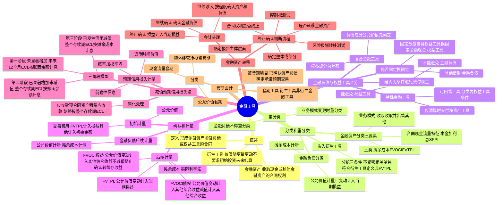

## 📍 章节定位

| 项目 | 信息 |
|------|------|
| **所属科目** | 📒 会计 |
| **难度等级** | ⭐⭐⭐⭐ |
| **历年分值** | 8-10分 |
| **建议学时** | 10-12h |

## 📝 考情分析

本章是会计科目的核心重难点章节，历年分值约 8-10 分，是考试中必考的主观题章节，常以综合题形式考查，并广泛结合长期股权投资、合并财务报表、所得税、差错更正等章节出题。命题热点集中在：

1. **金融资产的分类与重分类**：业务模式评估（收取合同现金流量、收取并出售、其他）、合同现金流量特征（本金加利息的 SPPI 测试）、三类金融资产（摊余成本、FVOCI、FVTPL）的区分及重分类会计处理。
2. **金融负债与权益工具的区分**：是否能无条件避免交付现金或其他金融资产的合同义务、"固定换固定"原则、可回售工具等特殊金融工具、复合金融工具的分拆（如可转换债券）。
3. **金融工具的确认和计量**：实际利率法下摊余成本的计算、以公允价值计量且其变动计入其他综合收益的金融资产（债权投资和权益工具投资）的会计处理差异、交易性金融资产的处理。
4. **金融工具减值（预期信用损失法）**：三阶段模型（信用风险未显著增加、已显著增加未减值、已发生信用减值）、简化处理（应收款项始终按整个存续期 ECL）、预期信用损失的计量。
5. **金融资产转移**：是否终止确认的判断流程（风险和报酬转移测试、控制权测试）、继续涉入的会计处理。
6. **套期会计**：公允价值套期、现金流量套期、境外经营净投资套期的区分及会计处理。

考生需重点掌握：业务模式是客观事实而非自愿指定；以摊余成本计量的金融资产以"账面余额×实际利率"计算利息收入，已发生信用减值的以"摊余成本（账面余额减减值准备）×实际利率"计算；指定为以公允价值计量且其变动计入其他综合收益的非交易性权益工具投资，除股利收入外其他利得损失均计入其他综合收益且后续不得转入损益，终止确认时转入留存收益；预期信用损失三阶段中，第一阶段按未来 12 个月 ECL 计量且按账面余额计算利息，第二、三阶段按整个存续期 ECL 计量，第三阶段按摊余成本计算利息；金融资产转移中"几乎所有风险和报酬"的判断是核心。

## 🧠 知识框架



## 📖 核心精讲

### 一、金融工具概述

#### （一）金融工具的定义

**金融工具**是指形成一方的金融资产并形成其他方的金融负债或权益工具的合同。金融工具包括**金融资产、金融负债和权益工具**三类。合同包括书面形式和非书面形式，非合同的资产和负债不属于金融工具（如应交所得税是基于税收法规承担的义务，不是以合同为基础，不属于金融工具）。

#### （二）金融资产

**金融资产**是指企业持有的现金、其他方的权益工具以及符合下列条件之一的资产：

1. **从其他方收取现金或其他金融资产的合同权利**（如银行存款、应收账款、应收票据和贷款等）。注意：预付账款不是金融资产，因其产生的未来经济利益是商品或服务，不是收取现金或其他金融资产的权利。
2. **在潜在有利条件下，与其他方交换金融资产或金融负债的合同权利**（如持有的看涨期权或看跌期权）。
3. **将来须用或可用企业自身权益工具进行结算的非衍生工具合同**，且企业根据该合同将收到可变数量的自身权益工具。
4. **将来须用或可用企业自身权益工具进行结算的衍生工具合同**，但以固定数量的自身权益工具交换固定金额的现金或其他金融资产的衍生工具合同除外。

本章不涉及：长期股权投资（能够形成控制、共同控制或重大影响的股权投资）和货币资金（库存现金、银行存款、其他货币资金）。

#### （三）衍生工具

**衍生工具**是同时具备下列特征的金融工具：①其价值随特定利率、金融工具价格、商品价格、汇率、价格指数、费率指数、信用等级、信用指数或其他变量的变动而变动；②不要求初始净投资，或与对市场因素变化预期有类似反应的其他合同相比，要求较少的初始净投资；③在未来某一日期结算。

### 二、金融资产和金融负债的分类和重分类

#### （一）金融资产的分类

企业应当根据其管理金融资产的**业务模式**和金融资产的**合同现金流量特征**，将金融资产分为以下三类：

| 类别 | 业务模式 | 合同现金流量特征 | 会计科目 |
|------|---------|----------------|---------|
| **以摊余成本计量的金融资产** | 以收取合同现金流量为目标 | 本金加利息 | 贷款、应收账款、债权投资 |
| **以公允价值计量且其变动计入其他综合收益的金融资产（债权）** | 既以收取合同现金流量为目标又以出售为目标 | 本金加利息 | 其他债权投资 |
| **以公允价值计量且其变动计入当期损益的金融资产** | 其他业务模式 或 合同现金流量不符合本金加利息 | 不要求 | 交易性金融资产 |

#### （二）业务模式评估

**业务模式**是指企业如何管理其金融资产以产生现金流量。业务模式决定企业所管理金融资产现金流量的来源是收取合同现金流量、出售金融资产，还是两者兼有。

业务模式评估的要点：
1. 在**金融资产组合层次**上确定，不必按单个金融资产逐项确定。
2. 以企业**关键管理人员**决定的对金融资产进行管理的特定业务目标为基础。
3. 业务模式是**客观事实**，并非企业自愿指定。
4. 不得以按照合理预期不会发生的情形为基础确定业务模式。

三种业务模式对比：

| 业务模式 | 特征 | 出售频率 |
|---------|------|---------|
| 以收取合同现金流量为目标 | 通过存续期内收取合同付款实现现金流量 | 出售只是偶然发生或价值很小 |
| 以收取合同现金流量和出售为目标 | 收取和出售都是不可或缺的 | 频率更高、价值更大 |
| 其他业务模式 | 交易性或基于公允价值管理 | 通过出售实现现金流量 |

#### （三）合同现金流量特征（SPPI 测试）

分类为以摊余成本和 FVOCI 的金融资产，其合同现金流量特征应当与基本借贷安排相一致，即相关金融资产在特定日期产生的合同现金流量**仅为对本金和以未偿付本金金额为基础的利息的支付**（简称 SPPI 测试）。

- **本金**：金融资产初始确认时的公允价值。
- **利息**：包括对货币时间价值、信用风险、其他基本借贷风险、成本和利润的对价。

**不符合 SPPI 的常见例子**：股票（股利及剩余权益不符合本金和利息定义）、基金（投资于动态管理的资产组合）、可转换债券（嵌入转股权）、结构性存款（嵌入金融衍生产品）。

#### （四）金融资产分类的特殊规定

**1. 非交易性权益工具投资的指定**

权益工具投资一般不符合本金加利息的合同现金流量特征，应当分类为 FVTPL。但在初始确认时，企业可以将**非交易性**权益工具投资**指定**为以公允价值计量且其变动计入其他综合收益的金融资产。该指定**一经作出，不得撤销**。

指定后的会计处理要点：
- 公允价值后续变动计入其他综合收益，**不需计提减值准备**。
- 除股利收入（明确作为投资成本部分收回的除外）计入当期损益外，其他相关利得和损失（包括汇兑损益）均应当计入其他综合收益，且**后续不得转入损益**。
- 终止确认时，之前计入其他综合收益的累计利得或损失应当从其他综合收益中转出，计入**留存收益**。

**2. 交易性的判断**

金融资产满足下列条件之一的，表明持有目的是交易性的：①取得主要是为了近期出售或回购；②属于集中管理的可辨认金融工具组合的一部分，且有客观证据表明近期实际存在短期获利模式；③属于衍生工具（符合财务担保合同定义的衍生工具以及被指定为有效套期工具的衍生工具除外）。

#### （五）金融负债的分类

除下列各项外，企业应当将金融负债分类为以摊余成本计量的金融负债：

1. 以公允价值计量且其变动计入当期损益的金融负债（包括交易性金融负债和指定为 FVTPL 的金融负债）。
2. 不符合终止确认条件的金融资产转移或继续涉入被转移金融资产所形成的金融负债。
3. 不属于上述情形的财务担保合同，以及以低于市场利率贷款的贷款承诺。

**公允价值选择权**：在初始确认时，为了提供更相关的会计信息，企业可以将一项金融资产、金融负债或一组金融工具指定为 FVTPL，但应满足下列条件之一：①该指定能够消除或显著减少**会计错配**；②根据正式书面文件载明的企业风险管理或投资策略，以公允价值为基础对金融负债组合进行管理和业绩评价。该指定一经作出，不得撤销。

#### （六）嵌入式衍生工具

**嵌入式衍生工具**是指嵌入非衍生金融工具或其他合同（主合同）中的衍生工具。嵌入衍生工具与主合同构成**混合合同**（如可转换公司债券）。

**分拆条件**（同时满足）：①嵌入衍生工具的经济特征和风险与主合同的经济特征和风险**不紧密相关**；②与嵌入衍生工具具有相同条款的单独工具符合衍生工具的定义；③该混合合同不是以 FVTPL 进行会计处理。

**特殊规定**：混合合同包含的主合同属于金融工具准则规范的**资产**的，企业**不应**从该混合合同中分拆嵌入衍生工具，而应当将该混合合同作为一个整体适用金融资产分类的相关规定。

#### （七）金融工具的重分类

**重分类原则**：
- 企业改变其管理金融资产的业务模式时，应当对所有受影响的相关金融资产进行重分类。
- 对**所有金融负债不得进行重分类**。
- 自重分类日起采用**未来适用法**，不得追溯调整。
- 业务模式变更是一种**极其少见**的情形，须由高级管理层决策并能向外部各方证实。

**不属于业务模式变更的情形**：①持有特定金融资产的意图改变；②金融资产特定市场暂时性消失；③金融资产在不同业务模式的各部门之间转移。

**重分类的会计处理**：

| 重分类方向 | 会计处理 |
|-----------|---------|
| 摊余成本 → FVTPL | 按重分类日公允价值计量，原账面价值与公允价值差额计入当期损益 |
| 摊余成本 → FVOCI | 按重分类日公允价值计量，差额计入其他综合收益，不影响实际利率和预期信用损失 |
| FVOCI → 摊余成本 | 将之前计入其他综合收益的累计利得或损失转出调整公允价值，视同一直以摊余成本计量 |
| FVOCI → FVTPL | 继续以公允价值计量，将之前计入其他综合收益的累计利得或损失转入当期损益 |
| FVTPL → 摊余成本 | 以重分类日公允价值作为新的账面余额，据此确定实际利率 |
| FVTPL → FVOCI | 继续以公允价值计量 |

### 三、金融负债和权益工具的区分

#### （一）区分的总体要求

企业发行金融工具，应当按照该金融工具的**合同条款及其所反映的经济实质**而非法律形式，以及金融资产、金融负债和权益工具的定义，在初始确认时分类为金融资产、金融负债或权益工具。

#### （二）金融负债和权益工具的定义

**金融负债**的条件之一：①向其他方交付现金或其他金融资产的合同义务；②在潜在不利条件下交换金融资产或金融负债的合同义务；③将来须用或可用企业自身权益工具结算的非衍生工具合同，且交付**可变数量**的自身权益工具；④将来须用或可用企业自身权益工具结算的衍生工具合同（"固定换固定"除外）。

**权益工具**：能证明拥有某个企业在扣除所有负债后的资产中的剩余权益的合同。同时满足：①不包括交付现金或其他金融资产的合同义务；②将来须用或可用自身权益工具结算的，非衍生工具不包括交付可变数量自身权益工具的合同义务，衍生工具只能通过"固定换固定"结算。

#### （三）区分的基本原则

**1. 是否存在无条件地避免交付现金或其他金融资产的合同义务**

- **不能无条件避免**交付现金或其他金融资产 → **金融负债**
  - 不能无条件避免的赎回（如发行方承担回购义务）
  - 强制付息（如优先股强制支付股息、永续债强制付息）
- **能够无条件避免**交付现金或其他金融资产 → 不构成金融负债
  - 能自主决定是否支付股息（无支付股息义务）
  - 无到期日且合同对方无回售权，或有固定期限但发行方有权无限期递延

**注意**：对企业履行交付现金义务能力的限制（如无法获得外币、需监管部门批准），不能解除合同义务。

**股利制动机制和股利推动机制**：如果发行方根据议事机制能自主决定普通股股利支付，则这两种机制本身不会导致金融工具被分类为金融负债。

**2. 是否通过交付固定数量的自身权益工具结算（"固定换固定"原则）**

| 工具类型 | 权益工具条件 | 金融负债情形 |
|---------|------------|------------|
| 非衍生工具 | 交付**固定数量**的自身权益工具 | 交付**可变数量**的自身权益工具 |
| 衍生工具 | **固定数量**自身权益工具交换**固定金额**现金或其他金融资产 | 其他情形（固定换可变、可变换固定、可变换可变） |

**重要例外**：企业对全部现有同类别非衍生自身权益工具的持有方同比例发行配股权、期权或认股权证，使之有权按比例以**固定金额的任何货币**交换固定数量的自身权益工具的，应当分类为权益工具。

#### （四）或有结算条款

附有或有结算条款的金融工具，发行方不能无条件避免交付现金等结算方式的，应当分类为**金融负债**。但满足下列条件之一的，分类为**权益工具**：①要求结算的或有结算条款**几乎不具有可能性**（极端罕见、显著异常或几乎不可能发生）；②只有在发行方**清算时**才需结算；③特殊金融工具中分类为权益工具的可回售工具。

#### （五）复合金融工具

企业发行的非衍生工具可能同时包含金融负债成分和权益工具成分（如可转换债券）。初始计量时：①先确定**金融负债成分**的公允价值；②从复合金融工具公允价值中扣除负债成分公允价值，**差额作为权益工具成分**的价值。

**可转换债券的会计处理要点**：
- 转股权满足"固定换固定"的，归类为权益工具（其他权益工具）。
- 转换时终止确认负债成分并确认为权益，原权益成分仍保留为权益（从"其他权益工具"转入"资本公积——股本溢价"），**转换时不产生损益**。
- 发行费用应在负债成分和权益成分之间按各自占总发行价款比例分摊。

#### （六）特殊金融工具

**1. 可回售工具**：符合金融负债定义，但同时具有下列特征的，应当分类为权益工具：①清算时按比例份额获得企业净资产；②该工具所属类别次于其他所有工具类别；③该类别所有工具具有相同特征；④除回购义务外不满足金融负债其他特征；⑤预计现金流量总额实质上基于企业损益、净资产变动等。

**2. 仅清算时交付净资产的金融工具**：如封闭式基金、理财产品份额、信托计划等有限寿命工具，符合条件可分类为权益工具。

**3. 特殊金融工具在母公司合并报表中的处理**：子公司个别财务报表中作为权益工具列报的特殊金融工具，在母公司**合并财务报表**中对应的少数股东权益部分，应当分类为**金融负债**（不允许将例外扩大到合并报表中的少数股东权益）。

#### （七）收益和库存股

| 分类 | 利息/股利/利得/损失处理 |
|------|----------------------|
| 金融负债 | 计入**当期损益** |
| 权益工具 | 作为**权益变动**处理，不确认公允价值变动，分配作利润分配 |

**交易费用**：与权益性交易相关的交易费用从权益（资本公积）中扣减，资本公积不够的依次冲减盈余公积和未分配利润。

**库存股**：回购自身权益工具支付的对价和交易费用减少所有者权益，不得确认金融资产；重新出售时直接在权益中确认，不产生损益。

### 四、金融工具的确认和计量

#### （一）初始计量

企业初始确认金融资产或金融负债，应当按照**公允价值**计量。

| 类别 | 交易费用处理 |
|------|-----------|
| FVTPL 的金融资产和金融负债 | 直接计入**当期损益** |
| 其他类别的金融资产或金融负债 | 计入**初始确认金额** |

**交易费用**是指可直接归属于购买、发行或处置金融工具的**增量费用**（没有发生该交易就不会发生的费用），包括手续费、佣金、相关税费等，不包括债券溢价、折价、融资费用、内部管理成本和持有成本等。

#### （二）实际利率法

**实际利率**是将金融资产或金融负债在预计存续期的估计未来现金流量折现为该金融资产账面余额（不考虑减值）或该金融负债摊余成本所使用的利率。确定实际利率时，应考虑所有合同条款（如提前还款、展期、看涨期权等），但**不考虑预期信用损失**。

**经信用调整的实际利率**：针对购入或源生的已发生信用减值的金融资产，将估计未来现金流量折现为当前摊余成本的利率。

#### （三）摊余成本的确定

金融资产或金融负债的摊余成本 = 初始确认金额 ①扣除已偿还的本金 ②±实际利率法摊销的累计摊销额 ③扣除计提的累计信用减值准备（仅适用于金融资产）

#### （四）以摊余成本计量的金融资产的会计处理

以摊余成本计量且不属于任何套期关系的金融资产所产生的利得或损失，应当在终止确认、重分类、按照实际利率法摊销或确认减值时，计入**当期损益**（投资收益等）。

**会计分录示例**（以债券投资为例）：

```
购入时：
借：债权投资——成本（面值）
    贷：银行存款（实际支付金额）
        债权投资——利息调整（差额，或借方）

期末确认利息收入：
借：债权投资——应计利息（面值×票面利率）
    债权投资——利息调整（差额，或贷方）
    贷：投资收益（期初摊余成本×实际利率）

收到利息：
借：银行存款
    贷：债权投资——应计利息

收回本金：
借：银行存款
    贷：债权投资——成本
```

#### （五）以公允价值进行后续计量的金融资产

**1. FVTPL 的金融资产**：公允价值变动计入**当期损益**（公允价值变动损益），利息单独确认计入投资收益。

**2. FVOCI 的债权投资**：
- 公允价值变动计入**其他综合收益**（除减值损失或利得和汇兑损益外）。
- 按实际利率法计算的利息计入**当期损益**（投资收益）。
- 减值损失计入**其他综合收益**（信用减值损失科目借方，其他综合收益——信用减值准备贷方）。
- 终止确认时，之前计入其他综合收益的累计利得或损失转入**当期损益**。

**3. 指定为 FVOCI 的非交易性权益工具投资**：
- 公允价值变动计入**其他综合收益**。
- **不计提减值准备**。
- 除股利收入计入当期损益外，其他利得和损失（包括汇兑损益）均计入其他综合收益，**后续不得转入损益**。
- 终止确认时，之前计入其他综合收益的累计利得或损失转入**留存收益**（不计入当期损益）。

#### （六）金融负债的后续计量

| 类别 | 后续计量 |
|------|---------|
| FVTPL 的金融负债 | 公允价值，变动计入当期损益 |
| 以摊余成本计量的金融负债 | 摊余成本，实际利率法 |
| 财务担保合同 | 按损失准备金额与初始确认金额扣除累计摊销额后余额孰高 |
| 继续涉入形成的金融负债 | 按金融资产转移准则规定 |

**自身信用风险变动**：指定为 FVTPL 的金融负债，由自身信用风险变动引起的公允价值变动计入**其他综合收益**（除非该影响会造成或扩大损失），其他公允价值变动计入当期损益。

### 五、金融工具的减值

#### （一）预期信用损失法概述

本章对金融工具减值的规定称为**预期信用损失法**，与过去"已发生损失法"根本不同。减值准备的计提**不以减值的实际发生为前提**，而是以未来可能的违约事件造成的损失的期望值来计量当前应当确认的损失准备。

**适用范围**：①以摊余成本计量的金融资产和 FVOCI 的金融资产；②租赁应收款；③合同资产；④部分贷款承诺和财务担保合同。

**预期信用损失（ECL）**：以发生违约的风险为权重的金融工具信用损失的加权平均值。

**信用损失**：企业按照原实际利率折现的、根据合同应收的所有合同现金流量与预期收取的所有现金流量之间的差额（全部现金短缺的现值）。

#### （二）金融工具减值的三阶段

| 阶段 | 信用风险状况 | 损失准备计量 | 利息收入计算 |
|------|------------|------------|------------|
| **第一阶段** | 初始确认后未显著增加 | 未来 **12 个月** ECL | 按账面余额 × 实际利率 |
| **第二阶段** | 已显著增加但未发生信用减值 | **整个存续期** ECL | 按账面余额 × 实际利率 |
| **第三阶段** | 已发生信用减值 | **整个存续期** ECL | 按摊余成本（账面余额减减值准备）× 实际利率 |

**购入或源生已发生信用减值的金融资产**：应当仅将初始确认后整个存续期内 ECL 的变动确认为损失准备，按摊余成本和经信用调整的实际利率计算利息收入。

#### （三）特殊情形（简化处理）

**1. 较低信用风险的金融工具**：企业可以不用与初始确认时的信用风险比较，直接假定信用风险未显著增加（企业有选择权）。

**2. 应收款项、租赁应收款和合同资产**：
- 不含重大融资成分的应收款项和合同资产，应当**始终按照整个存续期 ECL** 计量损失准备（企业**无选择权**）。
- 含重大融资成分的，企业可以选择始终按整个存续期 ECL 计量（有选择权）。

**注意**：除与收入和租赁相关的应收款项和合同资产外，其他金融资产（如其他应收款）不得采用简化处理，必须按三阶段模型处理。

#### （四）预期信用损失的计量要素

企业计量 ECL 的方法应反映：①通过评价一系列可能结果确定的无偏概率加权平均金额；②货币时间价值；③资产负债表日无须付出不必要额外成本即可获得的有关过去事项、当前状况及未来经济状况预测的合理且有依据的信息。

#### （五）减值的账务处理

```
计提减值准备：
借：信用减值损失
    贷：债权投资减值准备 / 坏账准备 / 贷款损失准备 / 合同资产减值准备 / 
        其他综合收益——信用减值准备（FVOCI债权）/ 预计负债（贷款承诺及财务担保）

减值利得（预期信用损失小于当前减值准备账面金额）：
借：债权投资减值准备等
    贷：信用减值损失
```

### 六、金融资产转移

#### （一）终止确认的一般原则

金融资产满足下列条件之一的，应当终止确认：①收取该金融资产现金流量的**合同权利终止**；②该金融资产已转移，且该转移满足终止确认的规定。

#### （二）终止确认的判断流程

1. **确定报告主体层面**：合并财务报表层面或个别财务报表层面。
2. **确定金融资产是部分还是整体适用**：仅当满足三个条件之一时适用于部分（特定可辨认现金流量、全部现金流量完全成比例部分、特定可辨认现金流量完全成比例部分）。
3. **确定收取现金流量的合同权利是否终止**。
4. **判断是否已转移金融资产**：
   - 将收取现金流量的合同权利转移给其他方（如票据背书转让、贴现）。
   - 保留了收取现金流量的合同权利但承担了将收取的现金流量支付给最终收款方的合同义务（"过于安排"，需同时满足三个条件）。
5. **分析风险和报酬转移情况**。
6. **分析是否保留控制**。

#### （三）风险和报酬转移分析

| 情形 | 会计处理 |
|------|---------|
| 转移了所有权上**几乎所有**风险和报酬 | **终止确认**该金融资产 |
| 保留了所有权上**几乎所有**风险和报酬 | **继续确认**该金融资产，收到的对价确认为金融负债 |
| 既没有转移也没有保留几乎所有风险和报酬 | 判断是否保留**控制**：未保留控制则终止确认；保留控制则按继续涉入程度确认 |

**转移几乎所有风险和报酬的情形**：①无条件出售；②出售同时约定按回购日公允价值回购；③出售同时签订深度价外看跌或看涨期权。

**保留几乎所有风险和报酬的情形**：①附固定价格回购协议的出售；②融出证券；③附总回报互换的出售；④全额补偿信用损失的出售；⑤附价内期权的出售；⑥附追索权方式的出售。

#### （四）继续涉入的会计处理

企业既没有转移也没有保留几乎所有风险和报酬，且保留控制的，应当按照其**继续涉入被转移金融资产的程度**确认有关金融资产，并相应确认有关负债。

**通过担保方式继续涉入**：按照金融资产账面价值和担保金额两者之中的**较低者**继续确认被转移资产，按照担保金额和担保合同公允价值之和确认相关负债。

```
继续涉入会计处理示例：
借：银行存款（收到的对价）
    继续涉入资产（账面价值与担保金额较低者）
    投资收益（差额）
    贷：原金融资产（账面价值）
        继续涉入负债（担保金额+担保合同公允价值）
```

### 七、套期会计

#### （一）套期的分类

| 类型 | 定义 | 示例 |
|------|------|------|
| **公允价值套期** | 对已确认资产或负债、尚未确认的确定承诺的公允价值变动风险敞口进行的套期 | 以固定利率换浮动利率的利率互换对固定利率负债套期 |
| **现金流量套期** | 对现金流量变动风险敞口进行的套期（源于已确认资产或负债、极可能发生的预期交易） | 以浮动利率换固定利率的利率互换对浮动利率债务套期 |
| **境外经营净投资套期** | 对境外经营净投资外汇风险敞口进行的套期 | 外汇远期合同对境外经营净投资套期 |

**注意**：企业对确定承诺的**外汇风险**进行套期的，可以将其作为现金流量套期或公允价值套期处理。

#### （二）套期工具和被套期项目

**套期工具**：①以公允价值计量且其变动计入当期损益的衍生工具（签出期权除外）；②以公允价值计量且其变动计入当期损益的非衍生金融资产或非衍生金融负债；③对于外汇风险套期，非衍生金融资产或非衍生金融负债的外汇风险成分。

**被套期项目**：已确认资产或负债、尚未确认的确定承诺、极可能发生的预期交易、境外经营净投资等。

#### （三）套期会计方法

**公允价值套期**：套期工具产生的利得或损失计入当期损益，被套期项目因被套期风险形成的利得或损失计入当期损益，并调整被套期项目的账面价值。

**现金流量套期**：套期工具利得或损失中属于**有效套期**部分计入**其他综合收益**，属于**无效套期**部分计入当期损益。被套期项目后续影响损益时，其他综合收益中的金额转出计入当期损益。

**境外经营净投资套期**：参照现金流量套期处理。

## 💡 典型例题

**【例题 1】（基础题，单选题）**

下列关于金融资产分类的表述中，正确的是（　　）。
A. 企业管理金融资产的业务模式是企业自愿指定的
B. 股票投资一定分类为以公允价值计量且其变动计入当期损益的金融资产
C. 企业可以将非交易性权益工具投资指定为以公允价值计量且其变动计入其他综合收益的金融资产
D. 金融资产的分类一经确定，可以随意变更

**答案**：C

**解析**：A 错误，业务模式是客观事实，并非企业自愿指定；B 错误，非交易性权益工具投资可以指定为 FVOCI；C 正确，企业可在初始确认时将非交易性权益工具投资指定为 FVOCI，一经作出不得撤销；D 错误，金融资产分类一经确定不得随意变更，只有在业务模式发生变更时才能重分类。

**【例题 2】（进阶题，单选题）**

下列关于金融工具减值的表述中，不正确的是（　　）。
A. 预期信用损失法下，减值准备的计提不以减值的实际发生为前提
B. 第一阶段按未来 12 个月预期信用损失计量损失准备，按账面余额和实际利率计算利息收入
C. 第三阶段按整个存续期预期信用损失计量损失准备，按账面余额和实际利率计算利息收入
D. 不含重大融资成分的应收款项应当始终按照整个存续期内预期信用损失计量损失准备

**答案**：C

**解析**：A 正确，预期信用损失法以未来可能违约事件的损失期望值计量；B 正确，第一阶段按未来 12 个月 ECL 计量且按账面余额计算利息；C 错误，第三阶段（已发生信用减值）按**摊余成本**（账面余额减减值准备）和实际利率计算利息收入，而非按账面余额；D 正确，不含重大融资成分的应收款项采用简化处理，始终按整个存续期 ECL 计量。

**【例题 3】（计算题，摊余成本计量的金融资产）**

2×18 年 1 月 1 日，甲公司支付价款 1000 万元（含交易费用）从公开市场购入乙公司同日发行的 5 年期公司债券，债券票面总额为 1250 万元，票面年利率为 4.72%，于年末支付本年度债券利息（即每年利息为 59 万元），本金在债券到期时一次性偿还。甲公司将该债券分类为以摊余成本计量的金融资产。经计算，该债券的实际利率为 10%。

要求：计算各年的摊余成本及实际利息收入，并编制 2×18 年的相关会计分录。

**答案**：

各年摊余成本及利息收入计算表（单位：万元）：

| 年度 | 期初摊余成本 | 实际利息收入（×10%） | 现金流入 | 期末摊余成本 |
|------|------------|-------------------|---------|------------|
| 2×18 | 1000 | 100 | 59 | 1041 |
| 2×19 | 1041 | 104 | 59 | 1086 |
| 2×20 | 1086 | 109 | 59 | 1136 |
| 2×21 | 1136 | 114 | 59 | 1191 |
| 2×22 | 1191 | 118* | 1309（59+1250） | 0 |

注：*尾数调整 1250+59-1191=118 万元。

2×18 年会计分录：

（1）1 月 1 日购入债券：
```
借：债权投资——成本            12 500 000
    贷：银行存款                10 000 000
        债权投资——利息调整      2 500 000
```

（2）12 月 31 日确认利息收入、收到利息：
```
借：债权投资——应计利息          590 000
    债权投资——利息调整          410 000
    贷：投资收益                1 000 000
借：银行存款                    590 000
    贷：债权投资——应计利息      590 000
```

**解析**：以摊余成本计量的金融资产，按实际利率法确认利息收入（期初摊余成本×实际利率），票面利息与实际利息的差额调整"利息调整"科目。

**【例题 4】（计算题，FVOCI 债权投资）**

承例 3，假定甲公司将该债券分类为以公允价值计量且其变动计入其他综合收益的金融资产。2×18 年 12 月 31 日，该债券的公允价值为 1200 万元（不含利息）。

要求：编制 2×18 年相关会计分录。

**答案**：

（1）1 月 1 日购入债券：
```
借：其他债权投资——成本          12 500 000
    贷：银行存款                10 000 000
        其他债权投资——利息调整    2 500 000
```

（2）12 月 31 日确认利息收入、收到利息：
```
借：其他债权投资——应计利息        590 000
    其他债权投资——利息调整        410 000
    贷：投资收益                  1 000 000
借：银行存款                      590 000
    贷：其他债权投资——应计利息    590 000
```

（3）12 月 31 日确认公允价值变动：
期末账面余额 = 1041 万元，公允价值 = 1200 万元，公允价值变动 = 1200 - 1041 = 159 万元
```
借：其他债权投资——公允价值变动    1 590 000
    贷：其他综合收益——其他债权投资公允价值变动  1 590 000
```

**解析**：FVOCI 债权投资按实际利率法确认利息收入（与摊余成本计量相同），同时按公允价值进行后续计量，公允价值变动计入其他综合收益。

**【例题 5】（综合题，指定为 FVOCI 的非交易性权益工具投资）**

2×21 年 5 月 6 日，甲公司支付价款 1016 万元（含交易费用 1 万元和已宣告发放现金股利 15 万元），购入乙公司发行的股票 200 万股，占乙公司有表决权股份的 0.5%。甲公司将其指定为以公允价值计量且其变动计入其他综合收益的非交易性权益工具投资。其他资料：2×21 年 6 月 30 日该股票市价为每股 5.2 元；2×21 年 12 月 31 日该股票市价为每股 5 元；2×22 年 5 月 9 日乙公司宣告发放股利 4000 万元；2×22 年 5 月 20 日甲公司以每股 4.9 元的价格将股票全部转让。

要求：编制甲公司相关会计分录。

**答案**：

（1）2×21 年 5 月 6 日购入股票：
```
借：应收股利                    150 000
    其他权益工具投资——成本      10 010 000
    贷：银行存款                10 160 000
```

（2）2×21 年 5 月 10 日收到现金股利：
```
借：银行存款                    150 000
    贷：应收股利                150 000
```

（3）2×21 年 6 月 30 日确认公允价值变动：
公允价值变动 = 200 × (5.2 - 5.0) = 40 万元（注：5.0 为初始成本每股，1001/200=5.005，此处按整数计算）
```
借：其他权益工具投资——公允价值变动  3 900 000
    贷：其他综合收益              3 900 000
```
（公允价值 = 200 × 5.2 = 1040 万元，账面余额 = 1001 万元，差额 39 万元）

（4）2×21 年 12 月 31 日确认公允价值变动：
公允价值 = 200 × 5 = 1000 万元，账面余额 = 1040 万元，差额 -40 万元
```
借：其他综合收益                  4 000 000
    贷：其他权益工具投资——公允价值变动  4 000 000
```

（5）2×22 年 5 月 9 日确认应收现金股利：
```
借：应收股利                    200 000
    贷：投资收益                200 000
```
（4000 × 0.5% = 20 万元）

（6）2×22 年 5 月 20 日出售股票：
出售价款 = 200 × 4.9 = 980 万元
```
借：银行存款                    9 800 000
    其他权益工具投资——公允价值变动  10 000
    利润分配——未分配利润          200 000
    贷：其他权益工具投资——成本    10 010 000
```
同时，将原计入其他综合收益的累计损失转出至留存收益：
```
借：利润分配——未分配利润          10 000
    贷：其他综合收益              10 000
```

**解析**：指定为 FVOCI 的非交易性权益工具投资，公允价值变动计入其他综合收益，终止确认时累计其他综合收益转入**留存收益**（不是当期损益）。股利收入计入当期损益（投资收益）。

## 🎯 记忆口诀

- **金融资产三分类**："业务模式加 SPPI，摊余、FVOCI、FVTPL"——根据业务模式（收取、收取并出售、其他）和合同现金流量特征（本金加利息）将金融资产分为以摊余成本计量、以公允价值计量且其变动计入其他综合收益、以公允价值计量且其变动计入当期损益三类。
- **业务模式是事实**："业务模式非指定，关键管理定目标"——业务模式是客观事实，不是企业自愿指定，以关键管理人员决定的业务目标为基础。
- **FVOCI 权益 vs 债权**："权益不减值转留存，债权要减值转损益"——指定为 FVOCI 的非交易性权益工具不计提减值，终止确认时其他综合收益转入留存收益；FVOCI 债权投资计提减值（计入其他综合收益），终止确认时其他综合收益转入当期损益。
- **金融负债 vs 权益工具**："不能避免是负债，能避免是权益；固定换固定是权益，其他都是负债"——不能无条件避免交付现金的为金融负债；衍生工具只有"固定换固定"才为权益工具。
- **复合金融工具分拆**："负债先定公允价，权益差额来补足"——先确定负债成分公允价值，剩余差额为权益成分价值。
- **减值三阶段**："一阶段十二月，二阶段全存续，三阶段按摊余"——第一阶段按未来 12 个月 ECL 计量按账面余额计息；第二阶段按整个存续期 ECL 计量按账面余额计息；第三阶段按整个存续期 ECL 计量按摊余成本（账面余额减减值准备）计息。
- **简化处理**："应收款项合同资产，始终整个存续期"——不含重大融资成分的应收款项和合同资产始终按整个存续期 ECL 计量（无选择权）。
- **金融资产转移**："风险报酬几乎全转就终止，几乎全留就继续，中间看控制"——转移几乎所有风险和报酬则终止确认；保留几乎所有则继续确认并确认金融负债；既未转移也未保留则判断控制权，保留控制则按继续涉入程度确认。
- **套期三类**："公允价值套已确认，现金流量套预期，境外净投套外汇"——公允价值套期对已确认资产负债或确定承诺；现金流量套期对现金流量变动（含预期交易）；境外经营净投资套期对境外经营净投资外汇风险。
- **交易费用**："FVTPL 进损益，其他进初始"——FVTPL 的金融资产和金融负债的交易费用计入当期损益，其他类别计入初始确认金额。

## ✅ 同步练习

1. （基础题）金融资产三分类的判断，业务模式评估与 SPPI 测试的应用。提示：参见《必刷 550 题》第十二章基础题。
2. （进阶题）以摊余成本计量的金融资产的实际利率法核算，包括分次付息和到期一次还本付息两种情形。提示：参见《必刷 550 题》第十二章进阶题。
3. （易错题）指定为 FVOCI 的非交易性权益工具投资与 FVOCI 债权投资在会计处理上的差异（减值、终止确认时其他综合收益结转方向）。提示：参见《必刷 550 题》第十二章易错题。
4. （真题改编）金融负债与权益工具的区分，重点掌握"固定换固定"原则在可转换债券、永续债等工具中的应用。提示：参见《必刷 550 题》第十二章真题。
5. （综合题）预期信用损失三阶段模型的运用，包括信用风险显著增加的判断、不同阶段损失准备计量及利息收入计算方法的差异。提示：参见《必刷 550 题》第十二章综合题。
6. 综合复习金融资产转移的终止确认判断流程（风险报酬测试、控制权测试）及继续涉入的会计处理，套期会计三类套期的区分及会计处理原则。
