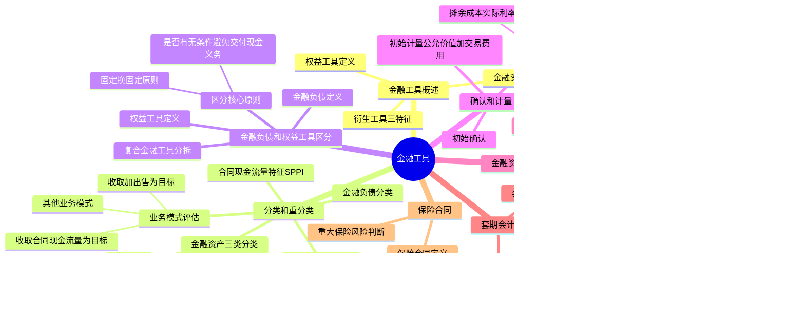

## 1. 章节定位

| 项目 | 信息 |
|------|------|
| 所属科目 | 会计 |
| 难度等级 | 5 |
| 历年分值 | 10-14 分 |
| 建议学时 | 12-16 小时 |
| 知识关联章节 | 第6章 长期股权投资（权益法vs金融资产）、第8章 负债（应付债券）、第12章 或有事项（财务担保合同）、第14章 租赁（嵌入衍生工具）、第17章 收入（合同资产/负债）、第22章 财务报表（金融工具列报）、第29章 公允价值计量 |

## 2. 考情分析

本章是会计科目的核心重难点章节，历年分值约 10-14 分，几乎每年必考主观题，常以计算分析题或综合题形式出现，并广泛与长期股权投资、所得税、差错更正、合并财务报表等章节联动考查。

**命题规律**：本章内容覆盖面极广、政策性强、专业判断多，主观题常以业务情境为载体，要求考生完成金融资产分类、初始及后续计量、减值处理、终止确认等全链条会计处理。客观题集中在分类判断、金融负债与权益工具区分、业务模式评估、SPPI 测试等概念辨析。

**高频考点分布**：

1. **金融资产三类分类**：以摊余成本计量、以公允价值计量且其变动计入其他综合收益（FVOCI）、以公允价值计量且其变动计入当期损益（FVTPL）的分类条件（业务模式+合同现金流量特征）。
2. **业务模式评估**：收取合同现金流量为目标、收取合同现金流量和出售为目标、其他业务模式三种模式的判断。
3. **合同现金流量特征（SPPI测试）**：本金加利息的判断，含可变利率、杠杆因素、提前还款特征等的特殊处理。
4. **金融负债与权益工具区分**：是否有无条件避免交付现金的义务、固定换固定原则、优先股/永续债的分类、复合金融工具的分拆。
5. **初始计量和后续计量**：公允价值+交易费用的处理、实际利率法、摊余成本的计量。
6. **预期信用损失减值模型**：三阶段减值模型、信用风险显著增加的判断、已发生信用减值的处理。
7. **金融资产转移**：终止确认的判断流程、继续涉入的会计处理。
8. **套期会计**：公允价值套期、现金流量套期、境外经营净投资套期的区分和会计处理。
9. **嵌入式衍生工具**：分拆条件、与主合同经济特征是否紧密相关。

**联动考查方式**：与长期股权投资结合（权益法转金融资产、金融资产转权益法）；与所得税结合（公允价值变动的递延所得税）；与差错更正结合（分类错误更正）；与合并报表结合（内部金融工具抵销）。

**备考建议**：牢记金融资产分类的"业务模式+SPPI"双测试；区分三类金融资产的计量差异；掌握实际利率法的计算；理解预期信用损失三阶段模型；掌握金融负债与权益工具区分的"是否有无条件避免交付现金的义务"核心原则。

## 3. 知识框架

## 4. 核心精讲

### 4.1 金融工具概述

**金融工具**是指形成一方的金融资产并形成其他方的金融负债或权益工具的合同。金融工具包括金融资产、金融负债和权益工具。合同包括书面形式和非书面形式。非合同的资产和负债不属于金融工具（如应交所得税是基于税收法规的义务，不是合同义务）。

**金融资产**，是指企业持有的现金、其他方的权益工具以及符合下列条件之一的资产：
1. 从其他方收取现金或其他金融资产的合同权利（如银行存款、应收账款、应收票据、贷款等）。预付账款不是金融资产，因为其产生的未来经济利益是商品或服务。
2. 在潜在有利条件下，与其他方交换金融资产或金融负债的合同权利（如看涨期权、看跌期权）。
3. 将来须用或可用企业自身权益工具进行结算的非衍生工具合同，且企业将收到可变数量的自身权益工具。
4. 将来须用或可用企业自身权益工具进行结算的衍生工具合同（以固定数量的自身权益工具交换固定金额的现金或其他金融资产的衍生工具合同除外）。

**衍生工具**，是指属于金融工具准则范围并同时具备下列特征的金融工具：
1. 其价值随特定利率、金融工具价格、商品价格、汇率、价格指数、费率指数、信用等级、信用指数或其他变量的变动而变动；
2. 不要求初始净投资，或者与对市场因素变化预期有类似反应的其他合同相比，要求较少的初始净投资；
3. 在未来某一日期结算。

本章不涉及长期股权投资（即企业对外能够形成控制、共同控制和重大影响的股权投资）和货币资金（库存现金、银行存款、其他货币资金）的会计处理。

### 4.2 金融资产和金融负债的分类和重分类

#### 4.2.1 金融资产的分类

企业应当根据其管理金融资产的**业务模式**和金融资产的**合同现金流量特征**，将金融资产分为下列三类：
1. 以摊余成本计量的金融资产；
2. 以公允价值计量且其变动计入其他综合收益的金融资产（FVOCI）；
3. 以公允价值计量且其变动计入当期损益的金融资产（FVTPL）。

金融资产的分类一经确定，不得随意变更。

**（一）业务模式评估**

业务模式是指企业如何管理其金融资产以产生现金流量。企业确定业务模式时应注意：①在金融资产组合层次上确定；②以关键管理人员决定的特定业务目标为基础；③业务模式是客观事实而非自愿指定；④不得以合理预期不会发生的情形为基础确定。

三种业务模式：

| 业务模式 | 特征 | 对应分类 |
|---------|------|---------|
| 以收取合同现金流量为目标 | 旨在通过存续期内收取合同付款实现现金流量，而非通过出售产生整体回报 | 摊余成本（需同时满足SPPI） |
| 以收取合同现金流量和出售金融资产为目标 | 收取合同现金流量和出售对于实现管理目标都是不可或缺的 | FVOCI（需同时满足SPPI） |
| 其他业务模式 | 不以收取合同现金流量为目标，也不以收取加出售为目标（如交易性目的） | FVTPL |

**（二）合同现金流量特征（SPPI测试）**

分类为以摊余成本计量和FVOCI的金融资产，其合同现金流量特征应当与基本借贷安排相一致，即相关金融资产在特定日期产生的合同现金流量**仅为对本金和以未偿付本金金额为基础的利息的支付**（简称"本金加利息"或SPPI）。

- **本金**是指金融资产在初始确认时的公允价值；
- **利息**包括对货币时间价值、信用风险、其他基本借贷风险（如流动性风险）、成本和利润的对价。

**不符合SPPI的情形**：包含杠杆因素（如利率向上浮动20%）、与权益工具挂钩的本金或利息支付、可转换债券的转股权等。

**（三）三类金融资产的具体分类条件**

| 类别 | 分类条件 | 科目设置 | 典型例子 |
|------|---------|---------|---------|
| 摊余成本计量 | ①业务模式以收取合同现金流量为目标；②SPPI测试通过 | 贷款、应收账款、债权投资 | 银行贷款、普通债券、应收账款 |
| FVOCI | ①业务模式以收取加出售为目标；②SPPI测试通过 | 其他债权投资 | 持有并可能出售的普通债券 |
| FVTPL | 不属于上述两类的金融资产 | 交易性金融资产 | 股票、基金、可转换债券、结构性存款 |

**（四）非交易性权益工具投资的特殊指定**

权益工具投资一般不符合SPPI，应分类为FVTPL。但在初始确认时，企业可以将非交易性权益工具投资**指定为以公允价值计量且其变动计入其他综合收益的金融资产**，该指定一经作出不得撤销。

指定后的处理：公允价值后续变动计入其他综合收益，不需计提减值准备；除了获得的股利收入计入当期损益外，其他相关的利得和损失均应计入其他综合收益，且后续不得转入损益；终止确认时，之前计入其他综合收益的累计利得或损失应转入留存收益。

#### 4.2.2 金融负债的分类

除下列各项外，企业应当将金融负债分类为以摊余成本计量的金融负债：
1. 以公允价值计量且其变动计入当期损益的金融负债（包括交易性金融负债和指定为FVTPL的金融负债）；
2. 不符合终止确认条件的金融资产转移或继续涉入被转移金融资产所形成的金融负债；
3. 财务担保合同以及以低于市场利率贷款的贷款承诺。

**公允价值选择权**：在初始确认时，满足下列条件之一的，企业可以将金融资产或金融负债指定为FVTPL：①该指定能够消除或显著减少会计错配；②根据正式书面文件载明的风险管理或投资策略，以公允价值为基础对金融负债组合进行管理和业绩评价。该指定一经作出不得撤销。

#### 4.2.3 嵌入式衍生工具

**嵌入衍生工具**是指嵌入非衍生金融工具或其他合同（主合同）中的衍生工具。嵌入衍生工具与主合同构成混合合同（如可转换公司债券）。

**分拆条件**：混合合同包含的主合同不属于金融工具准则规范的资产，且同时符合下列条件的，企业应当从混合合同中分拆嵌入衍生工具：①嵌入衍生工具的经济特征和风险与主合同的经济特征和风险不紧密相关；②与嵌入衍生工具条件相同的单独工具符合衍生工具的定义；③该混合合同不以公允价值计量且其变动计入当期损益。

如果主合同属于金融工具准则规范的资产，企业不应分拆嵌入衍生工具，而应将混合合同作为一个整体适用金融资产分类的规定。

#### 4.2.4 金融工具的重分类

企业改变其管理金融资产的业务模式时，应当对所有受影响的相关金融资产进行重分类。企业对所有金融负债均不得进行重分类。重分类应当自重分类日起采用**未来适用法**进行相关会计处理，不得对以前已经确认的利得、损失或利息进行追溯调整。重分类日，是指导致企业对金融资产进行重分类的业务模式发生变更后的首个报告期间的第一天。

**下列情形不属于业务模式变更**：①企业持有特定金融资产的意图改变；②金融资产特定市场暂时性消失从而暂时影响金融资产出售；③金融资产在企业具有不同业务模式的各部门之间转移。

**（一）以摊余成本计量的金融资产的重分类**

| 重分类方向 | 计量处理 |
|-----------|---------|
| 摊余成本 → FVTPL | 按重分类日公允价值计量，原账面价值与公允价值的差额计入当期损益 |
| 摊余成本 → FVOCI | 按重分类日公允价值计量，原账面价值与公允价值的差额计入其他综合收益；不影响实际利率和预期信用损失的计量 |

【例】2×21年10月15日，甲银行以公允价值500 000元购入一项债券投资，分类为以摊余成本计量的金融资产。2×22年12月15日变更业务模式，2×23年1月1日将该债券从摊余成本重分类为FVTPL。2×23年1月1日该债券公允价值为490 000元，已确认减值准备6 000元。账务处理：

借：交易性金融资产 490 000
　　债权投资减值准备 6 000
　　公允价值变动损益 4 000
　贷：债权投资 500 000

**（二）以公允价值计量且其变动计入其他综合收益的金融资产的重分类**

| 重分类方向 | 计量处理 |
|-----------|---------|
| FVOCI → 摊余成本 | 将之前计入其他综合收益的累计利得或损失转出，调整该金融资产在重分类日的公允价值，以调整后的金额作为新的账面价值（视同一直按摊余成本计量） |
| FVOCI → FVTPL | 继续以公允价值计量，将之前计入其他综合收益的累计利得或损失从其他综合收益转入当期损益 |

**（三）以公允价值计量且其变动计入当期损益的金融资产的重分类**

- FVTPL → 摊余成本：以重分类日的公允价值作为新的账面余额。
- FVTPL → FVOCI：继续以公允价值计量该金融资产。

对以FVTPL重分类的，企业应当根据该金融资产在重分类日的公允价值确定其实际利率，并自重分类日起对该金融资产适用减值规定，将重分类日视为初始确认日。

### 4.3 金融负债和权益工具的区分

#### 4.3.1 金融负债和权益工具的定义

**金融负债**，是指企业符合下列条件之一的负债：
1. 向其他方交付现金或其他金融资产的合同义务（如发行的公司债券）；
2. 在潜在不利条件下，与其他方交换金融资产或金融负债的合同义务（如签出的期权）；
3. 将来须用或可用企业自身权益工具结算的非衍生工具合同，且企业将交付可变数量的自身权益工具；
4. 将来须用或可用企业自身权益工具结算的衍生工具合同（固定换固定的衍生工具除外）。

**权益工具**，是指能证明拥有某个企业在扣除所有负债后的资产中的剩余权益的合同。在同时满足下列条件的情况下，企业应当将发行的金融工具分类为权益工具：
1. 该金融工具不包括交付现金或其他金融资产的合同义务；
2. 将来须用或可用企业自身权益工具结算的，非衍生工具不包括交付可变数量的自身权益工具的合同义务；衍生工具只能通过固定换固定方式结算。

#### 4.3.2 区分的基本原则

**核心原则**：是否存在无条件地避免交付现金或其他金融资产的合同义务。

- 如果企业**不能无条件地避免**以交付现金或其他金融资产来履行一项合同义务，则该合同义务符合金融负债的定义。常见情形包括：不能无条件避免的赎回（发行方不能无条件避免回购）、强制付息（被要求强制支付利息）。
- 如果企业**能够无条件地避免**交付现金或其他金融资产（如能够自主决定是否支付股息，且没有回购义务），则该金融工具分类为权益工具。

**固定换固定原则**：对于将来须用企业自身权益工具结算的衍生工具，如果是以固定数量的自身权益工具交换固定金额的现金或其他金融资产（"固定换固定"），则分类为权益工具；否则分类为金融负债。

#### 4.3.3 复合金融工具

企业发行的非衍生金融工具既含有金融负债成分又含有权益工具成分的，应当将各成分分别分类。**先负债后权益**：先确定金融负债成分的公允价值（通常为未来现金流量的现值），再从整体对价中扣除金融负债成分，剩余部分作为权益工具成分。

例如，可转换公司债券整体对价中，负债成分公允价值为未来本金和利息按市场利率折现的现值，权益成分为整体对价扣除负债成分后的差额。

#### 4.3.4 看涨期权发行方三种结算方式的会计处理

【例】甲公司于2×21年2月1日向乙公司发行以自身普通股为标的的看涨期权。合同约定：行权日2×22年1月31日（欧式期权）；行权价102元/股；普通股数量1 000股；2×21年2月1日每股市价100元；2×22年1月31日每股市价104元；2×21年2月1日期权公允价值5 000元；2×21年12月31日期权公允价值3 000元；2×22年1月31日期权公允价值2 000元。

**情形1：期权以现金净额结算**——甲公司不能完全避免支付现金义务，划分为**金融负债**。

① 2×21年2月1日，确认发行的看涨期权：
借：银行存款 5 000
　贷：衍生工具——看涨期权 5 000

② 2×21年12月31日，确认期权公允价值减少：
借：衍生工具——看涨期权 2 000
　贷：公允价值变动损益 2 000

③ 2×22年1月31日，确认期权公允价值减少：
借：衍生工具——看涨期权 1 000
　贷：公允价值变动损益 1 000

同日乙公司行权，现金净额结算。甲公司应支付104 000元（104×1 000），收取102 000元（102×1 000），实际支付净额2 000元：
借：衍生工具——看涨期权 2 000
　贷：银行存款 2 000

**情形2：期权以普通股净额结算**——支付普通股数量不确定，划分为**金融负债**。甲公司实际交付普通股19股（2 000/104≈19.23，取整19股），余下24元以现金支付：
借：衍生工具——看涨期权 2 000
　贷：股本 19
　　资本公积——股本溢价 1 957
　　银行存款 24

**情形3：期权以普通股总额结算**——固定数量普通股交换固定金额现金，划分为**权益工具**。

① 2×21年2月1日，确认发行的看涨期权：
借：银行存款 5 000
　贷：其他权益工具 5 000

② 2×21年12月31日，由于确认为权益工具，无需就公允价值变动作出会计处理。

③ 2×22年1月31日，乙公司行权，向甲公司支付102 000元获取1 000股甲公司股票：
借：银行存款 102 000
　　其他权益工具 5 000
　贷：股本 1 000
　　资本公积——股本溢价 106 000

**核心结论**：现金净额结算和普通股净额结算（交付可变数量权益工具）分类为金融负债；普通股总额结算（固定换固定）分类为权益工具。

#### 4.3.5 复合金融工具分拆的会计处理示例

【例】甲公司2×21年1月1日按每份面值1 000元发行了2 000份可转换债券，取得总收入2 000 000元。债券期限3年，票面年利率6%，利息按年支付；每份债券可在发行1年后任何时间转换为250股普通股。发行时二级市场上类似但没有转股权的债券市场利率为9%。转股权以固定数量债券换固定数量普通股，归类为权益工具。

**（1）负债成分和权益成分的计量**（按9%折现率）：
- 本金的现值：2 000 000 × 0.7721835 = 1 544 367（元）
- 利息的现值：120 000 × 2.5312917 = 303 755（元）
- 负债成分总额 = 1 544 367 + 303 755 = 1 848 122（元）
- 权益成分金额 = 2 000 000 − 1 848 122 = 151 878（元）

**（2）2×21年1月1日发行可转换债券**：
借：银行存款 2 000 000
　　应付债券——利息调整 151 878
　贷：应付债券——面值 2 000 000
　　　其他权益工具 151 878

**（3）2×21年12月31日计提并支付利息**（实际利息166 331元，票面利息120 000元，利息调整摊销46 331元）：
借：财务费用 166 331
　贷：应付债券——应计利息 120 000
　　　应付债券——利息调整 46 331
借：应付债券——应计利息 120 000
　贷：银行存款 120 000

**（4）2×22年12月31日计提并支付利息**（实际利息170 501元）：
借：财务费用 170 501
　贷：应付债券——应计利息 120 000
　　　应付债券——利息调整 50 501
借：应付债券——应计利息 120 000
　贷：银行存款 120 000

至此转换前应付债券摊余成本为1 944 954元（1 848 122 + 46 331 + 50 501）。

**（5）2×22年12月31日转换为甲公司股份**（发行股票500 000股）：
借：应付债券——面值 2 000 000
　贷：应付债券——利息调整 55 046
　　　股本 500 000
　　　资本公积——股本溢价 1 444 954
借：其他权益工具 151 878
　贷：资本公积——股本溢价 151 878

**注意**：可转换工具转换时不产生损益；原权益成分从"其他权益工具"转入"资本公积——股本溢价"。

### 4.4 金融工具的确认和计量

#### 4.4.1 金融资产和金融负债的确认

企业成为金融工具合同的一方时，应当确认一项金融资产或金融负债。

**金融负债的终止确认**：金融负债（或其一部分）的现时义务已经解除的，应当终止确认该金融负债。以承担新金融负债方式替换原金融负债，且新金融负债与原金融负债的合同条款实质上不同的（未来现金流量现值差异至少相差10%），应当终止确认原金融负债，同时确认新金融负债。

#### 4.4.2 初始计量

企业初始确认金融资产或金融负债，应当按照**公允价值**计量。

| 类别 | 交易费用处理 |
|------|------------|
| FVTPL金融资产和金融负债 | 直接计入当期损益（投资收益） |
| 其他类别的金融资产和金融负债 | 计入初始确认金额 |

**交易费用**是指可直接归属于购买、发行或处置金融工具的增量费用，包括手续费、佣金、相关税费等，不包括债券溢价、折价、融资费用、内部管理成本等。

#### 4.4.3 后续计量

**（一）以摊余成本计量的金融资产**

采用**实际利率法**进行后续计量。

**实际利率法**是指计算金融资产或金融负债的摊余成本以及将利息收入或利息费用分摊计入各会计期间的方法。**实际利率**是指将金融资产或金融负债在预计存续期的估计未来现金流量折现为该金融资产账面余额所使用的利率。

**摊余成本** = 初始确认金额 − 已偿还的本金 − 累计摊销额 − 已发生的减值损失（或+已恢复的减值损失）

利息收入 = 期初账面余额（或摊余成本）× 实际利率

【例】2×18年1月1日，甲公司支付价款1 000万元（含交易费用）从公开市场购入乙公司同日发行的5年期公司债券12 500份，债券票面总额1 250万元，票面年利率4.72%，于年末支付本年度债券利息（即每年利息59万元），本金在债券到期时一次性偿还。甲公司将其分类为以摊余成本计量的金融资产。经计算，实际利率r = 10%。

**摊余成本计算表**（单位：万元）：

| 年度 | 期初摊余成本 | 实际利息收入(×10%) | 现金流入 | 期末摊余成本 |
|------|------------|------------------|---------|------------|
| 2×18 | 1 000 | 100 | 59 | 1 041 |
| 2×19 | 1 041 | 104 | 59 | 1 086 |
| 2×20 | 1 086 | 109 | 59 | 1 136 |
| 2×21 | 1 136 | 114 | 59 | 1 191 |
| 2×22 | 1 191 | 118* | 1 309 | 0 |

注：*尾数调整 1 250 + 59 − 1 191 = 118（万元）。

**（1）2×18年1月1日购入乙公司债券**：
借：债权投资——成本 12 500 000
　贷：银行存款 10 000 000
　　　债权投资——利息调整 2 500 000

**（2）2×18年12月31日确认实际利息收入、收到债券利息**：
借：应收利息 590 000
　　债权投资——利息调整 410 000
　贷：投资收益 1 000 000
借：银行存款 590 000
　贷：应收利息 590 000

**（3）2×19年12月31日确认实际利息收入、收到债券利息**：
借：应收利息 590 000
　　债权投资——利息调整 450 000
　贷：投资收益 1 040 000
借：银行存款 590 000
　贷：应收利息 590 000

**（4）2×20年12月31日确认实际利息收入、收到债券利息**：
借：应收利息 590 000
　　债权投资——利息调整 500 000
　贷：投资收益 1 090 000
借：银行存款 590 000
　贷：应收利息 590 000

**（5）2×21年12月31日确认实际利息收入、收到债券利息**：
借：应收利息 590 000
　　债权投资——利息调整 550 000
　贷：投资收益 1 140 000
借：银行存款 590 000
　贷：应收利息 590 000

**（6）2×22年12月31日确认实际利息收入、收到债券利息和本金**：
借：应收利息 590 000
　　债权投资——利息调整 590 000
　贷：投资收益 1 180 000
借：银行存款 590 000
　贷：应收利息 590 000
借：银行存款 12 500 000
　贷：债权投资——成本 12 500 000

**（二）以公允价值计量且其变动计入其他综合收益的金融资产（FVOCI）**

资产负债表日按公允价值计量，公允价值变动计入其他综合收益。采用实际利率法确认利息收入（计入当期损益），减值损失计入当期损益。

终止确认时，之前计入其他综合收益的累计利得或损失应从其他综合收益中转出，计入当期损益（投资收益）。

【例】沿用上例资料，假设甲公司将该债券分类为以公允价值计量且其变动计入其他综合收益的金融资产（其他债权投资），实际利率10%。债券各年末公允价值（不含利息）如下：2×18年末1 200万元；2×19年末1 300万元；2×20年末1 250万元；2×21年末1 200万元。2×22年1月20日出售取得价款1 260万元。

**（1）2×18年1月1日购入债券**：
借：其他债权投资——成本 12 500 000
　贷：银行存款 10 000 000
　　　其他债权投资——利息调整 2 500 000

**（2）2×18年12月31日确认利息收入、公允价值变动、收到利息**（实际利息100万元，公允价值变动=1 200−1 041=159万元）：
借：其他债权投资——应计利息 590 000
　　其他债权投资——利息调整 410 000
　贷：投资收益 1 000 000
借：银行存款 590 000
　贷：其他债权投资——应计利息 590 000
借：其他债权投资——公允价值变动 1 590 000
　贷：其他综合收益——其他债权投资公允价值变动 1 590 000

**（3）2×19年12月31日**（实际利息104万元，公允价值变动=1 300−1 200=100万元，但考虑利息影响后为55万元）：
借：其他债权投资——应计利息 590 000
　　其他债权投资——利息调整 450 000
　贷：投资收益 1 040 000
借：银行存款 590 000
　贷：其他债权投资——应计利息 590 000
借：其他债权投资——公允价值变动 550 000
　贷：其他综合收益——其他债权投资公允价值变动 550 000

**（4）2×20年12月31日**（公允价值下降，公允价值变动=1 250−1 300=−50万元，考虑利息调整后计入其他综合收益−100万元）：
借：其他债权投资——应计利息 590 000
　　其他债权投资——利息调整 500 000
　贷：投资收益 1 090 000
借：银行存款 590 000
　贷：其他债权投资——应计利息 590 000
借：其他综合收益——其他债权投资公允价值变动 1 000 000
　贷：其他债权投资——公允价值变动 1 000 000

**（5）2×22年1月20日出售**（售价1 260万元，账面价值1 200万元，累计其他综合收益=159+55−100−54=60万元，加利息调整影响后为100万元）：
借：银行存款 12 600 000
　　其他综合收益——其他债权投资公允价值变动 100 000
　　其他债权投资——利息调整 600 000
　贷：其他债权投资——成本 12 500 000
　　　其他债权投资——公允价值变动 100 000
　　　投资收益 700 000

**核心要点**：分类为FVOCI的债权投资，利息收入按实际利率法计算计入投资收益；公允价值变动计入其他综合收益；处置时累计其他综合收益转入投资收益。

**（三）以公允价值计量且其变动计入当期损益的金融资产（FVTPL）**

资产负债表日按公允价值计量，公允价值变动计入当期损益（公允价值变动损益）。不计提减值准备。

#### 4.4.4 预期信用损失减值模型

企业应当以预期信用损失为基础，对以摊余成本计量和FVOCI的金融资产进行减值会计处理。

**三阶段减值模型**：

| 阶段 | 信用风险状况 | 减值损失 | 利息计算基础 |
|------|------------|---------|------------|
| 第一阶段 | 信用风险未显著增加 | 未来12个月预期信用损失 | 账面余额（不扣减减值） |
| 第二阶段 | 信用风险显著增加但未发生信用减值 | 整个存续期预期信用损失 | 账面余额（不扣减减值） |
| 第三阶段 | 已发生信用减值 | 整个存续期预期信用损失 | 摊余成本（账面余额扣减减值） |

**信用风险显著增加的判断**：企业应当在资产负债表日评估信用风险自初始确认后是否显著增加。通常逾期超过30日表明信用风险显著增加。可以单项或组合评估。

**已发生信用减值的金融资产**：在初始确认后发生信用减值的，应将其账面余额减记至预计未来现金流量的现值，减记的金额确认为信用减值损失，计入当期损益。

**信用损失的计量**：信用损失是企业应收取的合同现金流量与预期收取的现金流量之间差额的现值，按原实际利率折现。预期信用损失 = 违约概率（PD）× 违约损失率（LGD）× 违约风险敞口（EAD）。

【例】2×22年1月1日，甲银行发放一笔1 000 000元的10年期一次还本、分期付息贷款，年利率4%。初始确认时估计后续12个月内违约概率0.5%，违约损失率25%。

- **第一阶段（信用风险未显著增加）**：2×22年12月31日，未来12个月预期信用损失 = 1 000 000 × 0.5% × 25% = **1 250元**

借：信用减值损失 1 250
　贷：贷款损失准备 1 250

- **第二阶段（信用风险显著增加但未减值）**：2×24年12月31日，借款人信用状况恶化，整个存续期违约概率30%，违约损失率60%。整个存续期预期信用损失 = 1 000 000 × 30% × 60% = **180 000元**

借：信用减值损失 178 750
　贷：贷款损失准备 178 750

**特殊情形的简化处理**：
- **较低信用风险的金融工具**：企业可以选择不与初始确认时比较，直接假定信用风险未显著增加。
- **应收款项、合同资产、租赁应收款（不含重大融资成分）**：企业**应当始终**按整个存续期预期信用损失计量损失准备（无选择权）。
- **包含重大融资成分的应收款项、合同资产和租赁应收款**：企业**可以作出会计政策选择**，始终按整个存续期预期信用损失计量。

**减值准备的账务处理**：资产负债表日计算的预期信用损失大于当前减值准备账面金额的，差额确认为减值损失，借记"信用减值损失"（或"资产减值损失"用于合同资产），贷记"贷款损失准备""债权投资减值准备""坏账准备""合同资产减值准备"等科目；反之作相反分录。分类为FVOCI的债权投资，减值计入当期损益的同时贷记"其他综合收益——信用减值准备"。

**已发生信用损失金融资产的核销和收回**：核销时借记"贷款损失准备""坏账准备"等，贷记"贷款""应收账款"等；已核销后又收回的，按实际收到金额借记"贷款""应收账款"，贷记"贷款损失准备""坏账准备"，同时借记"银行存款"，贷记"贷款""应收账款"等。

### 4.5 金融资产转移

#### 4.5.1 终止确认的一般原则

金融资产满足下列条件之一的，应当终止确认：
1. 收取该金融资产现金流量的合同权利终止；
2. 该金融资产已转移，且该转移满足终止确认的规定。

**金融资产转移**包括两种情形：
1. 将收取金融资产现金流量的合同权利转移给另一方；
2. 保留收取金融资产现金流量的合同权利，但承担了将收取的现金流量支付给一个或多个最终收款方的合同义务（"过手安排"）。

#### 4.5.2 终止确认的判断流程

企业在判断金融资产是否应当终止确认时，应当遵循下列步骤：

**第一步**：确定报告主体层面（个别财务报表或合并财务报表）。

**第二步**：确定金融资产是整体还是部分适用终止确认原则。

**第三步**：判断是否转移了收取金融资产现金流量的权利。如果转移了收取权利，应当终止确认该金融资产。

**第四步**：如果保留了收取权利但承担了支付义务（过手安排），判断是否满足"过手"的三条件：
1. 企业从转出方收到现金流量的义务独立于原金融资产；
2. 转出合同条款禁止企业出售或质押原金融资产；
3. 企业有义务将收取的现金流量及时支付给最终收款方。

**第五步**：判断企业是否转移了金融资产几乎所有的风险和报酬。

| 风险报酬转移情况 | 终止确认 | 会计处理 |
|--------------|---------|---------|
| 转移了几乎所有风险和报酬 | 是 | 终止确认，确认相关利得或损失 |
| 保留了几乎所有风险和报酬 | 否 | 不得终止确认，收到的对价确认为金融负债 |
| 既未转移也未保留几乎所有风险和报酬 | 视控制判断 | 见下表 |

**第六步**：如果既未转移也未保留几乎所有风险和报酬，判断是否保留了对金融资产的控制：

| 控制情况 | 终止确认 | 会计处理 |
|---------|---------|---------|
| 未保留控制 | 是 | 终止确认 |
| 保留控制 | 部分 | 按继续涉入程度确认相关资产和负债 |

#### 4.5.3 继续涉入

企业保留了金融资产所有权的部分风险和报酬但保留控制的，应当按照其**继续涉入的程度**确认有关金融资产和金融负债。继续涉入所确认的资产和负债不应当相互抵销。

企业通过对被转移金融资产提供担保方式继续涉入的，应当在转移日按照金融资产的账面价值和担保金额两者之中的较低者，按继续涉入的程度继续确认被转移资产，同时按照担保金额和担保合同的公允价值之和确认相关负债。

【例】甲银行与乙银行签订贷款转让协议，将其本金1 000万元、年利率10%、贷款期限9年的组合贷款出售给乙银行，售价990万元。双方约定甲银行为该笔贷款提供担保，担保金额300万元，实际贷款损失超过担保金额的部分由乙银行承担。转移后该笔贷款（含担保）的公允价值为1 000万元，其中担保的公允价值为100万元。甲银行没有保留对该笔贷款的管理服务权。该贷款没有市场，乙银行不具备出售该笔贷款的实际能力。

**分析**：甲银行既没有转移也没有保留该笔组合贷款所有权上几乎所有的风险和报酬，且该贷款没有市场、乙银行不具备出售能力，甲银行保留了对该笔贷款的控制，应按继续涉入程度确认有关金融资产和相关负债。

**计算**：
- 继续确认被转移资产 = min(账面价值1 000万元, 担保金额300万元) = 300（万元）
- 相关负债 = 担保金额300 + 担保合同公允价值100 = 400（万元）

**转移日账务处理**：
借：存放中央银行款项 9 900 000
　　继续涉入资产 3 000 000
　　投资收益 1 100 000
　贷：贷款 10 000 000
　　　继续涉入负债 4 000 000

**继续涉入资产和负债的后续计量**：
- 被转移金融资产以摊余成本计量的，被转移资产和相关负债的账面价值等于企业保留的权利和义务的摊余成本。
- 被转移金融资产以公允价值计量的，被转移资产和相关负债的账面价值等于企业保留的权利和义务按独立基础计量的公允价值。

#### 4.5.4 满足终止确认条件的金融资产转移会计处理

**（一）金融资产整体转移形成损益的计算**：

金融资产整体转移形成的损益 = 因转移收到的对价 − 所转移金融资产账面价值 ± 原直接计入其他综合收益的公允价值变动累计利得（或损失）

因转移收到的对价 = 因转移交易实际收到的价款 + 新获得金融资产的公允价值 + 因转移获得的服务资产的价值 − 新承担金融负债的公允价值 − 因转移承担的服务负债的公允价值

【例】2×22年1月1日，甲公司将持有的乙公司发行的10年期公司债券出售给丙公司，售价311万元。2×21年12月31日该债券公允价值310万元。甲公司将该债券分类为以公允价值计量且其变动计入其他综合收益的金融资产，面值（取得成本）300万元。协议约定出售后所有损失由丙公司承担。

**分析**：甲公司已转移该债券所有权上几乎所有风险和报酬，应当终止确认。

- 出售日账面价值 = 310万元（资产负债表日公允价值）
- 已计入其他综合收益的累计利得 = 310 − 300 = 10（万元）
- 出售形成的收益 = 311 − 310 + 10 = **11万元**

**账务处理**：
借：银行存款 3 110 000
　贷：其他债权投资 3 100 000
　　　投资收益 10 000
同时，将原计入其他综合收益的公允价值变动转出：
借：其他综合收益——公允价值变动 100 000
　贷：投资收益 100 000

**（二）继续确认被转移金融资产**（保留了几乎所有风险和报酬的情形）：

企业收到的对价确认为一项金融负债，该金融负债与被转移金融资产应当分别确认和计量，不得相互抵销。

【例】2×23年4月1日，甲公司将一笔国债出售给丙公司，售价20万元，同时签订回购协议，3个月后按20.175万元回购。2×23年7月1日回购该国债。

**分析**：附固定价格回购协议，甲公司保留了国债几乎所有的风险和报酬，不应终止确认。

**（1）2×23年4月1日出售国债**：
借：银行存款 200 000
　贷：卖出回购金融资产款 200 000

**（2）2×23年6月30日确认利息费用**（实际利率3.5%，利息费用=200 000×3.5%×3/12=1 750元）：
借：利息支出 1 750
　贷：卖出回购金融资产款 1 750

**（3）2×23年7月1日回购国债**：
借：卖出回购金融资产款 201 750
　贷：银行存款 201 750

**注意**：国债与卖出回购金融资产款在资产负债表上不应抵销；国债确认的收益与卖出回购金融资产款产生的利息支出在利润表中也不应抵销。

### 4.6 套期会计

#### 4.6.1 套期的分类

套期分为三类：

| 类型 | 定义 | 典型例子 |
|------|------|---------|
| 公允价值套期 | 对已确认资产或负债、尚未确认的确定承诺的公允价值变动风险敞口进行的套期 | 以固定利率换浮动利率的利率互换对固定利率负债的利率风险套期 |
| 现金流量套期 | 对现金流量变动风险敞口进行的套期（源于已确认资产或负债、极可能发生的预期交易） | 以浮动利率换固定利率的利率互换对浮动利率债务的利率风险套期 |
| 境外经营净投资套期 | 对境外经营净投资外汇风险敞口进行的套期 | 外汇远期合同对境外经营净投资的外汇风险套期 |

**确定承诺的外汇风险套期**：企业对确定承诺的外汇风险进行套期的，可以选择作为现金流量套期或公允价值套期处理。

#### 4.6.2 套期工具和被套期项目

**套期工具**：可以是衍生工具（如远期合同、期权、互换）或以公允价值计量且其变动计入当期损益的非衍生金融工具。

**被套期项目**：可以是已确认的资产或负债、尚未确认的确定承诺、极可能发生的预期交易、境外经营净投资等。

#### 4.6.3 套期有效性

套期同时满足下列条件的，企业应当认定套期关系符合有效性要求：
1. 套期工具与被套期项目之间存在**经济关系**；
2. 套期关系产生的价值变动中，信用风险的影响**不主导**价值变动；
3. 套期比例关系应当反映被套期项目的实际数量与套期工具的实际数量之间的关系（**套期比率不平衡**不被允许）。

#### 4.6.4 套期会计处理

**（一）公允价值套期**

套期工具产生的利得或损失应当计入当期损益。被套期项目因被套期风险敞口形成的利得或损失应当计入当期损益，同时调整被套期项目的账面价值。

**（二）现金流量套期**

套期工具产生的利得或损失中属于套期有效的部分，作为现金流量套期储备计入其他综合收益；属于套期无效的部分，计入当期损益。

现金流量套期储备的后续处理：
- 如果被套期项目后续确认一项非金融资产或负债，将累计金额转出，调整资产或负债的初始确认金额；
- 对于其他情形，在被套项目影响损益时将累计金额转出，计入当期损益。

**（三）境外经营净投资套期**

参照现金流量套期的会计处理方法处理。

### 4.7 保险合同

**保险合同**，是指企业（合同签发人）与保单持有人约定，在特定保险事项对保单持有人产生不利影响时给予其赔偿，并因此承担源于保单持有人**重大保险风险**的合同。

**重大保险风险的判断**：保险合同应当具有重大保险风险，即保险风险发生时保险人需支付附加利益的重大性。判断是否具有重大保险风险，应当进行重大性测试和概率评估。

**再保险合同**，是指再保险分入人与再保险分出人约定，对再保险分出人承担的保险风险进行再次转移的合同。

## 5. 典型例题

**【例题 1】（金融资产分类判断）**

甲公司发生以下金融资产投资业务：（1）购入乙公司发行的普通债券，甲公司管理该债券的业务模式是以收取合同现金流量为目标；（2）购入丙公司股票，持有目的是近期出售赚取差价；（3）购入丁公司发行的可转换公司债券；（4）购入戊公司非上市股权，持有目的是长期战略投资，不以交易为目的，甲公司将其指定为FVOCI。

要求：判断各项投资应分类为哪类金融资产。

**答案**：

（1）乙公司普通债券：业务模式以收取合同现金流量为目标，普通债券符合SPPI，分类为**以摊余成本计量的金融资产**。

（2）丙公司股票：股票不符合SPPI，且持有目的是近期出售，分类为**以公允价值计量且其变动计入当期损益的金融资产**。

（3）丁公司可转换债券：可转换债券包含转股权，不符合SPPI，分类为**以公允价值计量且其变动计入当期损益的金融资产**。

（4）戊公司非上市股权：非交易性权益工具投资，甲公司在初始确认时指定为FVOCI，分类为**以公允价值计量且其变动计入其他综合收益的金融资产**。

**解析**：金融资产分类需要进行"业务模式+SPPI"双测试。股票不符合SPPI，默认FVTPL；非交易性权益工具可特殊指定为FVOCI；可转换债券包含转股权不符合SPPI。

**【例题 2】（实际利率法计算）**

2×24年1月1日，甲公司以5 200万元购入乙公司当日发行的5年期债券，面值5 000万元，票面年利率6%，每年末支付利息，到期还本。甲公司管理该债券的业务模式是以收取合同现金流量为目标，分类为以摊余成本计量的金融资产。经计算，该债券的实际利率为5.15%（不考虑减值）。

要求：计算甲公司2×24年和2×25年该债券的利息收入及年末摊余成本。

**答案**：

2×24年：
- 年初摊余成本 = 5 200（万元）
- 利息收入 = 5 200 × 5.15% = **267.8（万元）**
- 现金流入 = 5 000 × 6% = 300（万元）
- 年末摊余成本 = 5 200 + 267.8 − 300 = **5 167.8（万元）**

2×25年：
- 年初摊余成本 = 5 167.8（万元）
- 利息收入 = 5 167.8 × 5.15% = **266.14（万元）**
- 现金流入 = 5 000 × 6% = 300（万元）
- 年末摊余成本 = 5 167.8 + 266.14 − 300 = **5 133.94（万元）**

**解析**：以摊余成本计量的金融资产采用实际利率法计量。利息收入 = 期初摊余成本 × 实际利率；年末摊余成本 = 年初摊余成本 + 利息收入 − 现金流入。折价或溢价在存续期内通过实际利率法逐步摊销。

**【例题 3】（金融负债与权益工具区分）**

甲公司发行以下金融工具：（1）发行面值1亿元的优先股，每年强制按6%的股息率支付优先股股息；（2）发行无固定还款期限的永续债，每年按8%的利率强制付息，不可赎回；（3）发行普通股，公司自主决定是否分配股利。

要求：判断各项应分类为金融负债还是权益工具。

**答案**：

（1）优先股：每年强制按6%支付股息，甲公司不能无条件避免交付现金，分类为**金融负债**。

（2）永续债：虽然无固定还款期限且不可赎回，但每年按8%强制付息，甲公司承担了以利息形式永续支付现金的合同义务，分类为**金融负债**。

（3）普通股：甲公司能够自主决定是否分配股利，可以无条件避免交付现金，分类为**权益工具**。

**解析**：金融负债与权益工具区分的核心是"是否存在无条件避免交付现金或其他金融资产的合同义务"。强制付息的优先股和永续债，即使期限永续或不可赎回，由于承担了强制支付现金的义务，应分类为金融负债。

**【例题 4】（FVTPL公允价值变动）**

2×24年1月1日，甲公司以每股10元的价格从二级市场购入乙公司股票10万股，分类为以公允价值计量且其变动计入当期损益的金融资产，另支付交易费用2万元。2×24年12月31日，乙公司股票市价为每股12元。2×25年3月1日，甲公司将该股票全部出售，售价每股13元。

要求：编制甲公司相关会计分录。

**答案**：

（1）2×24年1月1日购入：
借：交易性金融资产——成本 1 000 000
　　投资收益 20 000
　贷：银行存款 1 020 000

（2）2×24年12月31日公允价值变动：
借：交易性金融资产——公允价值变动 200 000
　贷：公允价值变动损益 200 000

（3）2×25年3月1日出售：
借：银行存款 1 300 000
　贷：交易性金融资产——成本 1 000 000
　　　交易性金融资产——公允价值变动 200 000
　　　投资收益 100 000

**解析**：FVTPL初始计量按公允价值，交易费用直接计入当期损益（投资收益）。后续按公允价值计量，变动计入公允价值变动损益。处置时将账面价值与售价差额计入投资收益。

**【例题 5】（现金流量套期）**

甲公司为规避未来购买原材料的价格风险，于2×24年1月1日签订一项6个月后以固定价格购买原材料的远期合同（确定承诺），同时签订一项未来卖出原材料的期货合约进行套期，指定为现金流量套期。套期期间，期货合约产生利得50万元，其中有效套期部分45万元，无效套期部分5万元。

要求：说明甲公司的会计处理。

**答案**：

套期工具利得50万元中：
- 有效套期部分45万元计入其他综合收益（现金流量套期储备）：
  借：套期工具 450 000
　　贷：其他综合收益——套期储备 450 000
- 无效套期部分5万元计入当期损益：
  借：套期工具 50 000
　　贷：公允价值变动损益 50 000

后续处理：当预期交易（购买原材料）实际发生并确认为存货时，将现金流量套期储备累计金额转出，调整存货的初始确认金额：
借：其他综合收益——套期储备 450 000
　贷：存货 450 000

**解析**：现金流量套期中，套期工具利得或损失的有效部分计入其他综合收益（现金流量套期储备），无效部分计入当期损益。当被套期的预期交易后续确认为非金融资产或负债时，将累计套期储备转出调整资产或负债的初始确认金额。

**【例题 6】（金融资产重分类综合处理）**

2×21年9月15日，甲银行以公允价值500 000元购入一项债券投资，分类为以公允价值计量且其变动计入其他综合收益的金融资产，账面余额500 000元。2×22年10月15日变更业务模式，2×23年1月1日将该债券从FVOCI重分类为以摊余成本计量的金融资产。2×23年1月1日该债券公允价值490 000元，已确认减值准备6 000元（假设不考虑利息收入）。

要求：编制甲银行重分类日的会计分录。

**答案**：

企业将FVOCI重分类为摊余成本的，应将之前计入其他综合收益的累计利得或损失转出，调整该金融资产在重分类日的公允价值，以调整后的金额作为新的账面价值，视同该金融资产一直以摊余成本计量。

借：债权投资 500 000
　　其他债权投资——公允价值变动 10 000
　　其他综合收益——信用减值准备 6 000
　贷：其他债权投资——成本 500 000
　　　其他综合收益——其他债权投资公允价值变动 10 000
　　　债权投资减值准备 6 000

**解析**：FVOCI重分类为摊余成本时，视同该金融资产一直按摊余成本计量。原计入其他综合收益的公允价值变动累计额（10 000元）和信用减值准备累计额（6 000元）均转出，分别调整债权投资的账面价值和减值准备。重分类后债权投资账面余额为500 000元（视同一直按摊余成本计量），减值准备6 000元，摊余成本494 000元。

**【例题 7】（继续涉入金融资产转移综合处理）**

甲银行将一笔本金1 000万元、年利率10%、期限9年的组合贷款出售给乙银行，售价990万元。约定甲银行提供担保，担保金额300万元，实际贷款损失超过担保金额的部分由乙银行承担。转移后该笔贷款（含担保）的公允价值1 000万元，其中担保的公允价值100万元。该贷款没有市场，乙银行不具备出售该笔贷款的实际能力。甲银行没有保留对该笔贷款的管理服务权。

要求：判断是否终止确认并编制甲银行转移日的会计分录。

**答案**：

**判断**：甲银行既没有转移也没有保留该笔贷款所有权上几乎所有的风险和报酬（提供300万元担保但超过部分由乙银行承担），且该贷款没有市场、乙银行不具备出售能力，甲银行保留了对该笔贷款的控制，应按继续涉入程度确认有关金融资产和负债。

**计算**：
- 继续确认的被转移资产 = min(账面价值1 000万元, 担保金额300万元) = 300（万元）
- 相关负债 = 担保金额300 + 担保合同公允价值100 = 400（万元）
- 担保部分对价 = 990 − (1 000 − 300) = 290（万元）（即转让对价中归属于已终止确认部分的对价）

**转移日会计分录**：
借：存放中央银行款项 9 900 000
　　继续涉入资产 3 000 000
　　投资收益 1 100 000
　贷：贷款 10 000 000
　　　继续涉入负债 4 000 000

**解析**：继续涉入方式下，企业按账面价值和担保金额较低者确认继续涉入资产（300万元），按担保金额与担保合同公允价值之和确认继续涉入负债（400万元）。两者的差额（400−300=100万元）反映担保合同的公允价值，加上原贷款账面价值与售价之差（1 000−990=10万元）的影响，最终投资收益借记110万元。

## 6. 记忆口诀

**金融资产三类分类**："摊余成本收现金流，FVOCI收加卖，FVTPL其他全兜底"——业务模式+SPPI双测试，以收取为目标→摊余成本，收取加出售→FVOCI，其他→FVTPL。

**SPPI测试**："本金加利息，借贷安排一致"——合同现金流量仅为对本金和以未偿付本金为基础的利息支付。

**业务模式三类型**："收取目标、收取加出售、其他交易"——三种业务模式对应不同分类。

**非交易性权益工具指定**："非交易可指定FVOCI，一经指定不撤销，股利计损益其他进OCI，终止转留存"——指定后公允价值变动进其他综合收益，股利计损益，终止时转留存收益。

**金融负债vs权益工具**："能否无条件避免交付现金是关键，强制付息赎回是负债，自主决定股利是权益"——核心判断是否有无条件避免交付现金的义务。

**固定换固定**："固定数量换固定金额是权益，否则是负债"——衍生工具以固定换固定方式结算分类为权益工具。

**复合金融工具**："先负债后权益，负债公允价先定，剩余作权益"——先确定负债成分公允价值，整体对价扣除后作为权益成分。

**初始计量**："公允价值为基础，FVTPL交易费用计损益，其他类别入成本"——初始计量按公允价值，FVTPL的交易费用计入投资收益，其他类别的交易费用计入初始确认金额。

**摊余成本三公式**："利息等于摊余乘实率，摊余等于初值减偿还减摊销减减值"——利息收入=期初摊余成本×实际利率。

**预期信用损失三阶段**："风险未增十二月，风险显著增全存续，已减值按摊余算利息"——第一阶段未来12个月，第二三阶段整个存续期；第三阶段利息按摊余成本（扣减减值后）计算。

**金融资产转移判断**："权利终止直接终确，过手安排三条件，风险报酬看转移，保留控制看继续涉入"——终止确认判断流程。

**套期三类**："公允价值套已确认，现金流量套预期，境外净投套外币"——公允价值套期对已确认项目，现金流量套期对预期交易，境外经营净投资套期对外汇风险。

**现金流量套期处理**："有效进OCI无效进损益，预期交易实现转出调成本"——有效部分计入其他综合收益，无效部分计入损益，预期交易实现时转出调整资产初始确认金额。

**公允价值套期处理**："套期工具和被套期项目都进损益"——套期工具利得损失计入当期损益，被套期项目因被套期风险形成的利得损失也计入当期损益并调整账面价值。
