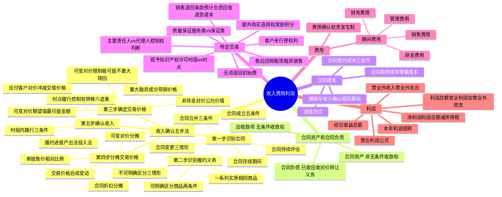

## 📍 章节定位

| 项目 | 信息 |
|------|------|
| **所属科目** | 📒 会计 |
| **难度等级** | ⭐⭐⭐⭐ |
| **历年分值** | 8-10分 |
| **建议学时** | 10-12h |

## 📝 考情分析

本章是会计科目的核心重难点章节，历年分值约 8-10 分，是考试中必考的主观题章节，常以综合题和计算分析题形式考查，并广泛结合所得税、差错更正、资产负债表日后事项等章节出题。命题热点集中在：

1. **收入确认的五步法模型**：识别与客户订立的合同（合同成立的五个条件、合同变更的三种情形）、识别合同中的单项履约义务（可明确区分商品的判断）、确定交易价格（可变对价的最佳估计数及限制条件、重大融资成分、非现金对价、应付客户对价）、将交易价格分摊至各单项履约义务（单独售价的相对比例分摊、合同折扣的分摊、可变对价的分摊）、在履行履约义务时确认收入（某一时段内履行 vs 某一时点履行）。
2. **某一时段内履行的履约义务**：三个条件（客户取得并消耗经济利益、客户控制在建商品、商品具有不可替代用途且有权收款）、履约进度的确定（产出法、投入法/成本法）、合同预计损失的处理。
3. **某一时点履行的履约义务**：控制权转移的六个迹象（现时收款权利、法定所有权转移、实物转移、风险报酬转移、客户接受、其他迹象）、售后代管商品安排。
4. **合同资产与合同负债**：合同资产（非无条件收款权，承担履约风险和信用风险）与应收款项（无条件收款权，仅承担信用风险）的区分、合同负债（已收或应收对价而承担的转让商品义务）。
5. **合同成本**：合同履约成本（三个确认条件）、合同取得成本（增量成本，如销售佣金）、摊销和减值。
6. **特定交易**：附有销售退回条款的销售、附有质量保证条款的销售（服务类 vs 保证类）、主要责任人和代理人（控制权判断为核心）、附有客户额外购买选择权的销售（奖励积分）、授予知识产权许可、售后回购、客户未行使的权利、无须退回的初始费。
7. **期间费用和利润**：管理费用、销售费用、研发费用、财务费用的内容；营业利润、利润总额、净利润的计算；营业外收支的核算。

考生需重点掌握：收入确认的核心原则是**客户取得商品控制权**；合同变更的三种情形（作为单独合同、作为原合同终止及新合同订立、作为原合同组成部分）；可变对价计入交易价格的限制条件（极可能不会发生重大转回）；某一时段内履行的三个条件中，"有权就累计至今已完成的履约部分收取款项"是指能够补偿已发生成本和合理利润；主要责任人按总额确认收入，代理人按净额确认收入，判断核心是**转让商品前是否拥有控制权**；附有销售退回条款的销售应确认预计负债（应付退货款）和应收退货成本。

## 🧠 知识框架

## 📖 核心精讲

### 一、收入的定义及其分类

**收入**是指企业在日常活动中形成的、会导致所有者权益增加的、与所有者投入资本无关的经济利益的总流入。其中，**日常活动**是指企业为完成其经营目标所从事的经常性活动以及与之相关的其他活动。

**本节不涉及**：企业对外出租资产收取的租金、进行债权投资收取的利息、进行股权投资取得的现金股利、保险合同取得的保费收入等。企业以存货换取客户的存货、固定资产、无形资产以及长期股权投资等，按照本节规定进行会计处理；其他非货币性资产交换，按照非货币性资产交换准则处理。

### 二、收入的确认和计量（五步法模型）

企业应当在履行了合同中的履约义务，即**客户取得相关商品控制权**时确认收入。取得商品控制权包括三个要素：①能力（拥有现时权利）；②主导该商品的使用；③能够获得几乎全部的经济利益。

收入确认和计量大致分为五步：**第一步，识别与客户订立的合同；第二步，识别合同中的单项履约义务；第三步，确定交易价格；第四步，将交易价格分摊至各单项履约义务；第五步，履行各单项履约义务时确认收入**。其中，第一步、第二步和第五步主要与收入的确认有关，第三步和第四步主要与收入的计量有关。

#### （一）识别与客户订立的合同

**合同**是指双方或多方之间订立有法律约束力的权利义务的协议，包括书面形式、口头形式以及其他可验证的形式。

**1. 合同成立的条件**

企业与客户之间的合同**同时满足下列条件**的，企业应当在客户取得相关商品控制权时确认收入：

1. 合同各方已批准该合同并承诺将履行各自义务；
2. 该合同明确了合同各方与所转让的商品相关的权利和义务；
3. 该合同有明确的与所转让的商品相关的支付条款；
4. 该合同具有商业实质，即履行该合同将改变企业未来现金流量的风险、时间分布或金额；
5. 企业因向客户转让商品而有权取得的对价**很可能收回**。

**注意**：对于合同各方均有权单方面终止完全未执行的合同，且无须对合同其他方作出补偿的，企业应当视为该合同不存在。

**不满足条件时的处理**：企业只有在不再负有向客户转让商品的剩余义务，且已向客户收取的对价无须退回时，才能将已收取的对价确认为收入；否则，应当将已收取的对价作为负债进行会计处理。没有商业实质的非货币性资产交换，无论何时，均不应确认收入。

**2. 合同的持续评估**

对于在合同开始日即满足上述条件的合同，企业在后续期间无须重新评估，除非有迹象表明相关事实和情况发生重大变化。对于不满足上述条件的合同，企业应当在后续期间对其进行持续评估。

**3. 合同存续期间**

合同存续期间是合同各方拥有现时可执行的具有法律约束力的权利和义务的期间。当合同约定任何一方均可以随时无代价地终止合同时，合同存续期间不会超过已经提供的商品所涵盖的期间；当合同约定任何一方均可以提前终止合同，但要求终止合同的一方需要向另一方支付重大的违约金时，合同存续期间很可能与合同约定的期间一致。

**4. 合同合并**

企业与同一客户（或该客户的关联方）同时订立或在相近时间内先后订立的两份或多份合同，在满足下列条件**之一**时，应当合并为一份合同进行会计处理：①基于同一商业目的而订立并构成一揽子交易；②一份合同的对价金额取决于其他合同的定价或履行情况；③所承诺的商品构成单项履约义务。

**5. 合同变更**

合同变更的三种情形及会计处理：

| 情形 | 条件 | 会计处理 |
|------|------|---------|
| **作为单独合同** | 合同变更增加了可明确区分的商品及合同价款，且新增合同价款反映新增商品单独售价 | 作为一份单独的合同进行会计处理 |
| **作为原合同终止及新合同订立** | 不属于上述第 1 种情形，且在合同变更日已转让商品与未转让商品之间可明确区分 | 视为原合同终止，将原合同未履约部分与合同变更部分合并为新合同。新合同交易价格 = 原合同尚未确认收入的对价 + 合同变更中客户已承诺的对价 |
| **作为原合同组成部分** | 不属于上述第 1 种情形，且在合同变更日已转让商品与未转让商品之间不可明确区分 | 作为原合同的组成部分，在合同变更日重新计算履约进度，调整当期收入和相应成本 |

**区分合同变更与可变对价**：合同变更是指经合同各方同意对原合同范围或价格作出的变更，是对原合同的后续变更；可变对价是指合同中约定的对价金额是可变的，不涉及对原合同的后续变更。

#### （二）识别合同中的单项履约义务

**履约义务**是指合同中企业向客户转让可明确区分商品的承诺。企业应当将下列承诺作为单项履约义务：

**1. 转让可明确区分商品的承诺**

可明确区分商品应**同时满足**两个条件：
- **商品本身可明确区分**：客户能够从该商品本身或者从该商品与其他易于获得的资源一起使用中受益。
- **合同层面可单独区分**：企业向客户转让该商品的承诺与合同中其他承诺可单独区分。

**表明不可明确区分的三种情形**：
1. 企业需提供重大的服务将商品与其他商品整合成组合产出转让给客户；
2. 该商品将对合同中承诺的其他商品予以重大修改或定制；
3. 该商品与合同中承诺的其他商品具有高度关联性。

**运输服务的特殊处理**：商品控制权转移给客户之后发生的运输活动可能构成单项履约义务；商品控制权转移之前发生的运输活动不构成单项履约义务，是履行合同的必要活动。

**2. 转让一系列实质相同且转让模式相同的可明确区分商品的承诺**

企业应当将实质相同且转让模式相同的一系列商品作为单项履约义务，即使这些商品可明确区分。其中，转让模式相同是指每一项可明确区分商品均满足在某一时段内履行履约义务的条件，且采用相同方法确定其履约进度。

#### （三）确定交易价格

**交易价格**是指企业因向客户转让商品而预期有权收取的对价金额。企业代第三方收取的款项（如增值税）以及预期将退还给客户的款项，应当作为负债，不计入交易价格。

**1. 可变对价**

合同中约定的对价金额可能因折扣、价格折让、返利、退款、奖励积分、激励措施、业绩奖金、索赔等因素而变化。

- **最佳估计数的确定**：按照**期望值**（按各种可能发生的对价金额及相关概率计算确定的金额）或**最可能发生金额**（一系列可能发生的对价金额中最可能发生的单一金额）确定。对于类似合同，应当采用相同的方法。
- **计入交易价格的限制条件**：包含可变对价的交易价格，应当不超过在相关不确定性消除时，累计已确认的收入**极可能不会发生重大转回**的金额。"极可能"发生的概率应远高于"很可能"（>50%），但不要求达到"基本确定"（>95%）。
- **每一资产负债表日**，企业应当重新估计应计入交易价格的可变对价金额。

**例外规定**：将可变对价计入交易价格的限制条件不适用于企业向客户授予知识产权许可并约定按客户实际销售或使用情况收取特许权使用费的情况。

**2. 合同中存在的重大融资成分**

当合同各方以约定的付款时间为客户或企业提供了重大融资利益时，合同中即包含了重大融资成分。合同中存在重大融资成分的，企业应当按照**现销价格**确定交易价格。

**表明未包含重大融资成分的情形**：①客户就商品支付了预付款，且可以自行决定转让时间（如储值卡、奖励积分）；②客户承诺支付的对价中有相当大的部分是可变的，取决于某一未来事项（如按实际销量收取的特许权使用费）；③合同对价与现销价格的差额是由于其他原因导致且相称（如保护性条款）。

**简化处理**：如果合同开始日预计客户取得商品控制权与客户支付价款间隔不超过一年的，可以不考虑重大融资成分。

**折现率**：企业确定的交易价格与合同承诺的对价金额之间的差额应当在合同期间内采用**实际利率法**摊销。折现率一经确定，不得因后续市场利率或客户信用风险等情况的变化而变更。

**3. 非现金对价**

- 通常按照非现金对价在**合同开始日的公允价值**确定交易价格。
- 非现金对价公允价值不能合理估计的，参照承诺向客户转让商品的单独售价间接确定。
- 合同开始日后，非现金对价的公允价值因对价形式以外的原因发生变动的，作为可变对价处理；因对价形式发生变动的，不计入交易价格。

**4. 应付客户对价**

- 企业存在应付客户对价的，应当将该应付对价**冲减交易价格**，但为了自客户取得其他可明确区分商品的除外。
- 应付客户对价超过向客户取得可明确区分商品公允价值的，超过金额冲减交易价格。
- 在确认相关收入与支付（或承诺支付）客户对价二者**孰晚**的时点冲减当期收入。

#### （四）将交易价格分摊至各单项履约义务

当合同中包含两项或多项履约义务时，企业应当在**合同开始日**，按照各单项履约义务所承诺商品的**单独售价的相对比例**，将交易价格分摊至各单项履约义务。

**单独售价**的估计方法：

| 方法 | 说明 |
|------|------|
| 市场调整法 | 根据某商品或类似商品的市场售价，考虑本企业的成本和毛利等进行适当调整 |
| 成本加成法 | 根据某商品的预计成本加上其合理毛利后的价格 |
| 余值法 | 根据合同交易价格减去合同中其他商品可观察的单独售价后的余值 |

**1. 分摊合同折扣**：合同折扣（各单项履约义务所承诺商品的单独售价之和高于合同交易价格的金额）应当在各单项履约义务之间按比例分摊。有确凿证据表明合同折扣仅与一项或多项（而非全部）履约义务相关的，应当分摊至相关履约义务。

**2. 分摊可变对价**：同时满足下列条件的，可变对价及后续变动额全部分摊至相关履约义务：①可变对价的条款专门针对该项履约义务所作的努力；②将可变金额全部分摊至该项履约义务符合分摊目标。

**3. 交易价格的后续变动**：按照合同开始日所采用的基础分摊。不得因合同开始日之后单独售价的变动而重新分摊。对于已履行的履约义务，其分摊的可变对价后续变动额应当调整变动当期的收入。

#### （五）履行每一单项履约义务时确认收入

企业应当首先判断履约义务是否满足在某一时段内履行的条件，如不满足，则属于在某一时点履行的履约义务。

**1. 在某一时段内履行的履约义务的收入确认条件**

满足下列条件**之一**的，属于在某一时段内履行的履约义务：

| 条件 | 说明 |
|------|------|
| **客户在企业履约的同时即取得并消耗企业履约所带来的经济利益** | 判断方法：假设更换其他企业继续履行，若实质上无须重新执行已完成的工作，则满足此条件 |
| **客户能够控制企业履约过程中在建的商品** | 如在客户拥有的土地上建造厂房，客户终止合同时已建造部分归客户所有 |
| **企业履约过程中所产出的商品具有不可替代用途，且该企业在整个合同期间内有权就累计至今已完成的履约部分收取款项** | 两个条件须同时满足：商品具有不可替代用途 + 有权就累计已完成部分收取能补偿已发生成本和合理利润的款项 |

**"有权就累计至今已完成的履约部分收取款项"**是指在由于客户或其他方原因终止合同的情况下，企业有权就累计至今已完成的履约部分收取能够补偿其已发生成本和合理利润的款项，且该权利具有法律约束力。合同终止必须是由于客户或其他方而非企业自身的原因所致。

**2. 在某一时段内履行的履约义务的收入确认方法**

企业应当在该段时间内按照履约进度确认收入，采用**产出法**或**投入法**确定恰当的履约进度：

| 方法 | 说明 | 适用情形 |
|------|------|---------|
| **产出法** | 根据已转移给客户的商品对于客户的价值确定履约进度（如实际测量的完工进度、已达到的里程碑、时间进度、已完工或交付的产品） | 能够客观反映履约进度，信息可直接观察获得时 |
| **投入法** | 根据企业履行履约义务的投入确定履约进度（如投入的材料数量、人工工时、发生的成本） | 产出法所需信息无法直接观察获得或成本过高时 |

**成本法的特殊调整**：
- 已发生的成本并未反映履约进度的（如非正常消耗），需要调整。
- 已发生的成本与履约进度不成比例的（如施工中尚未安装的商品或材料成本占比较大），在满足特定条件时将该商品成本排除在已发生成本和预计总成本之外，同时按照该商品成本金额确认相应收入。

**当履约进度不能合理确定时**，企业已经发生的成本预计能够得到补偿的，应当按照已经发生的成本金额确认收入，直到履约进度能够合理确定为止。

**每一资产负债表日**，企业应当对履约进度进行重新估计，作为会计估计变更处理。

**3. 在某一时点履行的履约义务**

对于在某一时点履行的履约义务，企业应当在客户取得相关商品控制权时点确认收入。判断客户是否已取得商品控制权时，应当考虑下列迹象：

1. 企业就该商品享有**现时收款权利**；
2. 企业已将该商品的**法定所有权**转移给客户；
3. 企业已将该商品**实物转移**给客户；
4. 企业已将该商品所有权上的**主要风险和报酬**转移给客户；
5. **客户已接受**该商品；
6. 其他表明客户已取得商品控制权的迹象。

**售后代管商品安排**：企业继续持有商品实物但已收款的情况，应当**同时满足下列条件**才表明客户取得了商品控制权：①该安排具有商业实质（如应客户要求订立）；②属于客户的商品能够单独识别；③该商品可以随时交付给客户；④企业不能自行使用该商品或将其提供给其他客户。

### 三、关于合同资产和合同负债

| 项目 | 定义 | 风险 |
|------|------|------|
| **合同资产** | 企业已向客户转让商品而有权收取对价的权利，且该权利取决于时间流逝之外的其他因素 | 承担信用风险 + 履约风险等其他风险 |
| **应收款项** | 企业无条件收取合同对价的权利，仅随着时间的流逝即可收款 | 仅承担信用风险 |
| **合同负债** | 企业已收或应收客户对价而应向客户转让商品的义务 | — |

**注意**：尚未向客户履行转让商品的义务而已收或应收客户对价中的**增值税部分**，因不符合合同负债的定义，不应确认为合同负债。同一合同下的合同资产和合同负债应当以净额列示，不同合同下的不能相互抵销。合同资产发生减值的，记入"资产减值损失"科目。

### 四、关于合同成本

#### （一）合同履约成本

企业为履行合同发生的成本，不属于其他准则规范范围且**同时满足下列条件**的，应当作为合同履约成本确认为一项资产：

1. 该成本与一份当前或预期取得的合同**直接相关**（包括直接人工、直接材料、制造费用或类似费用、明确由客户承担的成本以及仅因该合同而发生的其他成本）；
2. 该成本增加了企业未来用于履行（或持续履行）履约义务的**资源**；
3. 该成本预期能够**收回**。

**应当计入当期损益的支出**：①管理费用（除非明确由客户承担）；②非正常消耗的直接材料、直接人工和制造费用；③与履约义务中已履行部分相关的支出；④无法在尚未履行与已履行的履约义务之间区分的相关支出。

#### （二）合同取得成本

企业为取得合同发生的**增量成本**（不取得合同就不会发生的成本，如销售佣金）预期能够收回的，应当作为合同取得成本确认为一项资产。

**简化处理**：该资产摊销期限不超过一年的，可以在发生时计入当期损益。企业为取得合同发生的、除预期能够收回的增量成本之外的其他支出（如差旅费、投标费等），应当在发生时计入当期损益，除非明确由客户承担。

#### （三）摊销和减值

**摊销**：采用与该资产相关的商品收入确认相同的基础（即在履约义务履行的时点或按照履约进度）进行摊销，计入当期损益。

**减值**：合同履约成本和合同取得成本的账面价值高于下列两项差额的，超出部分应当计提减值准备：①企业因转让与该资产相关的商品预期能够取得的剩余对价；②为转让该相关商品估计将要发生的成本。以前期间减值的因素之后发生变化的，应当转回原已计提的资产减值准备。

### 五、关于特定交易的会计处理

#### （一）附有销售退回条款的销售

- 按照预期有权收取的对价金额（**不包含**预期因销售退回将退还的金额）确认收入；
- 按照预期因销售退回将退还的金额确认**预计负债（应付退货款）**；
- 按照预期将退回商品转让时的账面价值，扣除收回该商品预计发生的成本后的余额，确认为**应收退货成本**；
- 每一资产负债表日重新估计，作为会计估计变更处理。

#### （二）附有质量保证条款的销售

| 类型 | 特征 | 会计处理 |
|------|------|---------|
| **服务类质量保证** | 在向客户保证所销售商品符合既定标准之外提供了一项单独的服务 | 作为单项履约义务，按收入准则处理 |
| **保证类质量保证** | 仅向客户保证所销售商品符合既定标准 | 按或有事项准则处理 |

判断考虑因素：是否为法定要求、质量保证期限、企业承诺履行任务的性质。客户能够选择单独购买的质量保证，构成单项履约义务。

#### （三）主要责任人和代理人

企业应当根据其在**向客户转让商品前是否拥有对该商品的控制权**来判断其身份：

| 身份 | 判断标准 | 收入确认 |
|------|---------|---------|
| **主要责任人** | 在向客户转让商品前能够控制该商品 | 按已收或应收对价**总额**确认收入 |
| **代理人** | 在向客户转让商品前不能控制该商品 | 按预期有权收取的佣金或手续费**净额**确认收入 |

**主要责任人能够控制商品的三种情形**：①企业自第三方取得商品控制权后再转让给客户；②企业能够主导该第三方代表本企业向客户提供服务；③企业自第三方取得商品控制权后，通过提供重大服务将商品与其他商品整合成组合产出转让给客户。

**三个支持性迹象**（不能凌驾于控制权判断之上）：①企业承担向客户转让商品的主要责任；②企业在转让商品之前或之后承担了该商品的存货风险；③企业有权自主决定所交易商品的价格。

#### （四）附有客户额外购买选择权的销售

企业应当评估该选择权是否向客户提供了一项**重大权利**。提供重大权利的，应当作为单项履约义务，将交易价格分摊至该履约义务，在客户未来行使选择权取得相关商品控制权时，或选择权失效时，确认相应收入。

**奖励积分的处理**：企业授予客户的奖励积分构成重大权利时，应当作为一项单独的履约义务，将销售商品收取的价款在销售商品和奖励积分之间按照单独售价的相对比例进行分摊。

#### （五）授予知识产权许可

首先评估是否构成单项履约义务。构成单项履约义务的，进一步确定是在某一时段内履行还是在某一时点履行。

**作为在某一时段内履行**的条件（同时满足）：
1. 合同要求或客户能够合理预期企业将从事对该项知识产权有**重大影响**的活动；
2. 该活动对客户将产生**有利或不利影响**；
3. 该活动**不会导致向客户转让商品**。

**特许权使用费的例外规定**：约定按客户实际销售或使用情况收取特许权使用费的，在下列两项**孰晚**的时点确认收入：①客户后续销售或使用行为实际发生；②企业履行相关履约义务。

#### （六）售后回购

| 情形 | 条件 | 会计处理 |
|------|------|---------|
| **回购价格 < 原售价** | 企业负有回购义务或享有回购权利 | 视为**租赁交易**，按租赁准则处理 |
| **回购价格 ≥ 原售价** | 企业负有回购义务或享有回购权利 | 视为**融资交易**，确认金融负债，差额确认为利息费用 |
| **应客户要求回购** | 客户有重大经济动因行权 | 按上述租赁或融资交易处理 |
| **应客户要求回购** | 客户无重大经济动因行权 | 作为附有销售退回条款的销售处理 |

#### （七）客户未行使的权利

企业预收销售商品款项应当确认为合同负债。当预收款项无须退回，且客户可能会放弃其全部或部分合同权利时，企业预期将有权获得与客户所放弃的合同权利相关金额的，应当按照客户行使合同权利的模式**按比例确认收入**；否则，只有在客户要求其履行剩余履约义务的可能性极低时，才能将负债余额转为收入。

#### （八）无须退回的初始费

企业在合同开始（或接近合同开始）日向客户收取的无须退回的初始费应当计入交易价格。根据初始费是否与向客户转让已承诺的商品相关，分别处理。

### 六、社会资本方对政府和社会资本合作（PPP）项目合同的会计处理

**PPP 项目合同的"双特征"**：①社会资本方在运营期间内代表政府方使用 PPP 项目资产提供公共产品和服务；②社会资本方在合同期间内就其提供的公共产品和服务获得补偿。

**"双控制"条件**：①政府方控制或管制社会资本方使用 PPP 项目资产必须提供的公共产品和服务的类型、对象和价格；②PPP 项目合同终止时，政府方控制 PPP 项目资产的重大剩余权益。

**会计处理模式**：

| 模式 | 适用情形 | 会计处理 |
|------|---------|---------|
| **无形资产模式** | 收费金额不确定，不构成无条件收取现金的权利 | 建造收入确认为无形资产，运营期间按无形资产摊销 |
| **金融资产模式** | 有权收取可确定金额的现金 | 确认为应收款项，按金融工具准则处理 |
| **混合模式** | 建造收入超过有权收取可确定金额现金的部分 | 超过部分确认为无形资产 |

### 七、费用

#### （一）费用的确认

**费用**是指企业在日常活动中发生的、会导致所有者权益减少的、与向所有者分配利润无关的经济利益的总流出。费用应按照**权责发生制**确认。

确认费用时：①划分生产费用与非生产费用；②分清生产费用与期间费用；③对于期间费用，进一步划分为管理费用、销售费用和财务费用。

#### （二）期间费用

| 期间费用 | 内容 |
|---------|------|
| **管理费用** | 企业为组织和管理生产经营所发生的费用，包括开办费、公司经费、工会经费、董事会费、聘请中介机构费、咨询费、诉讼费、业务招待费、技术转让费等 |
| **销售费用** | 企业在销售商品和材料、提供劳务过程中发生的费用，包括保险费、包装费、展览费、广告费、商品维修费、装卸费，以及专设销售机构的职工薪酬、业务费、折旧费等 |
| **研发费用** | 企业进行研究与开发过程中发生的费用化支出，以及计入管理费用的自行开发无形资产的摊销金额 |
| **财务费用** | 企业为筹集生产经营所需资金等而发生的应予费用化的筹资费用，包括利息支出（减利息收入）、汇兑损益等 |

### 八、利润

#### （一）利润的构成

**利润**是指企业在一定会计期间的经营成果，包括收入减去费用后的净额、直接计入当期利润的利得和损失等。

| 层次 | 计算公式 |
|------|---------|
| **营业利润** | 营业收入 − 营业成本 − 税金及附加 − 销售费用 − 管理费用（不含研发费用）− 研发费用 − 财务费用 + 其他收益 + 投资收益（−投资损失）+ 净敞口套期收益（−净敞口套期损失）+ 公允价值变动收益（−公允价值变动损失）− 信用减值损失 − 资产减值损失 + 资产处置收益（−资产处置损失） |
| **利润总额** | 营业利润 + 营业外收入 − 营业外支出 |
| **净利润** | 利润总额 − 所得税费用 |
| **综合收益总额** | 净利润 + 其他综合收益的税后净额 |

#### （二）营业外收支

| 项目 | 内容 |
|------|------|
| **营业外收入** | 非流动资产毁损报废利得、与日常活动无关的政府补助、盘盈利得、捐赠利得等 |
| **营业外支出** | 非流动资产毁损报废损失、公益性捐赠支出、非常损失、盘亏损失等 |

**注意**：营业外收入和营业外支出应当分别核算，不得以营业外支出直接冲减营业外收入，也不得以营业外收入冲减营业外支出。

#### （三）本年利润的会计处理

企业应设置"本年利润"科目。期末结转利润时，将各损益类科目的金额转入本科目。结转后贷方余额为当期实现的净利润，借方余额为当期发生的净亏损。年度终了，将本年实现的净利润转入"利润分配——未分配利润"科目；如为净亏损作相反分录。结转后本科目无余额。

## 💡 典型例题

**【例题 1】（基础题，单选题）**

下列关于收入确认的五步法模型的表述中，正确的是（　　）。
A. 第一步和第四步主要与收入的确认有关
B. 识别合同中的单项履约义务是第三步
C. 确定交易价格是第三步，主要与收入的计量有关
D. 履行各单项履约义务时确认收入是第四步

**答案**：C

**解析**：A 错误，第一步、第二步和第五步主要与收入的确认有关，第三步和第四步主要与收入的计量有关；B 错误，识别合同中的单项履约义务是第二步；C 正确，确定交易价格是第三步，主要与收入的计量有关；D 错误，履行各单项履约义务时确认收入是第五步。

**【例题 2】（进阶题，单选题）**

下列各项中，表明企业向客户转让商品的承诺与合同中其他承诺不可明确区分的是（　　）。
A. 客户能够从该商品本身受益
B. 企业需提供重大的服务将该商品与合同中承诺的其他商品进行整合，形成组合产出转让给客户
C. 企业通常会单独销售该商品
D. 该商品与合同中承诺的其他商品之间没有重大影响

**答案**：B

**解析**：A 表明商品本身可明确区分，不符合题意；B 正确，企业需提供重大的服务将商品与其他商品整合成组合产出转让给客户，表明承诺在合同层面不可明确区分；C 表明商品可明确区分；D 表明商品之间不具有高度关联性，可明确区分。

**【例题 3】（计算题，合同变更）**

A 公司与客户签订合同，每周为客户的办公楼提供保洁服务，合同期限为三年，客户每年向 A 公司支付服务费 10 万元（假定该价格反映了合同开始日该项服务的单独售价）。在第二年末，合同双方对合同进行了变更，将第三年的服务费调整为 8 万元（假定该价格反映了合同变更日该项服务的单独售价），同时以 20 万元的价格将合同期限延长三年（假定该价格不反映合同变更日该三年服务的单独售价），即每年的服务费为 6.67 万元，于每年年初支付。

要求：说明 A 公司对该合同变更的会计处理。

**答案**：

在合同开始的前两年，A 公司每年确认收入 10 万元。

在合同变更日，由于新增的三年保洁服务的价格不能反映该项服务在合同变更时的单独售价，因此该合同变更不能作为单独的合同进行会计处理。由于在剩余合同期间需提供的服务与已提供的服务是可明确区分的，A 公司应当将该合同变更作为原合同终止，同时将原合同中未履约的部分与合同变更合并为一份新合同进行会计处理。

该新合同的合同期限为四年，对价为 28 万元，即原合同下尚未确认收入的对价 8 万元与新增的三年服务相应的对价 20 万元之和，新合同中 A 公司每年确认的收入为 7 万元（28÷4）。

**解析**：合同变更既未增加可明确区分的商品且新增价款不反映单独售价，且已转让与未转让商品可明确区分，属于第二种情形（作为原合同终止及新合同订立）。

**【例题 4】（计算题，可变对价）**

2×24 年 10 月 1 日，甲公司签订合同，为一只股票型基金提供资产管理服务，合同期限为 3 年。甲公司所能获得的报酬包括两部分：一是每季度按照季度末该基金净值的 1% 收取管理费，该管理费不会因基金净值的后续变化而调整或被要求退回；二是该基金在三年内的累计回报如果超过 10%，则甲公司可以获得超额回报部分的 20% 作为业绩奖励。在 2×24 年 12 月 31 日，该基金的净值为 5 亿元。假定不考虑相关税费影响。

要求：说明甲公司 2×24 年 12 月 31 日的会计处理。

**答案**：

甲公司收取的管理费和业绩奖励均为可变对价，其金额极易受到股票价格波动的影响。在合同开始日，甲公司无法对其能够收取的管理费和业绩奖励进行估计，不满足累计已确认的收入金额极可能不会发生重大转回的条件。

2×24 年 12 月 31 日，甲公司重新估计该合同的交易价格时，影响该季度管理费收入金额的不确定性已经消除，甲公司确认管理费收入 500 万元（5 亿元×1%）。甲公司未确认业绩奖励收入，因为该业绩奖励仍然会受到基金未来累计回报的影响，有关将可变对价计入交易价格的限制条件仍然没有得到满足。

**解析**：可变对价计入交易价格需满足"极可能不会发生重大转回"的限制条件。管理费部分的不确定性已消除可确认收入，业绩奖励部分仍受未来因素影响不满足限制条件。

**【例题 5】（计算题，奖励积分）**

2×24 年 1 月 1 日，甲公司开始推行一项奖励积分计划。根据该计划，客户在甲公司每消费 10 元可获得 1 个积分，每个积分从次月开始在购物时可以抵减 1 元。截至 2×24 年 1 月 31 日，客户共消费 100000 元，可获得 10000 个积分，根据历史经验，甲公司估计该积分的兑换率为 95%。假定上述金额均不包含增值税等的影响。

要求：计算甲公司 2×24 年 1 月 31 日应确认的商品销售收入和合同负债金额。

**答案**：

积分的单独售价 = 1 元 × 10000 个积分 × 95% = 9500（元）

分摊至商品的交易价格 = [100000 ÷ (100000 + 9500)] × 100000 = **91324（元）**

分摊至积分的交易价格 = [9500 ÷ (100000 + 9500)] × 100000 = **8676（元）**

甲公司应当在商品的控制权转移时确认收入 91324 元，同时确认合同负债 8676 元。

**解析**：奖励积分构成重大权利，应作为单项履约义务，按照商品和积分单独售价的相对比例分摊交易价格。

**【例题 6】（综合题，主要责任人 vs 代理人）**

甲公司是一家经营高端品牌的百货公司，采用与品牌服装供应商合作的经营模式。某高端品牌供应商乙公司在甲公司指定区域设立专柜提供约定品牌商品，并委派营业员销售商品。乙公司负责专柜内的商品保管、出售、调配或下架，承担丢失和毁损风险，拥有未售商品的所有权。乙公司负责实际定价销售，甲公司负责对百货公司内销售的商品统一收款，开具发票。甲公司将收到客户款项扣除 10% 后支付给乙公司。假定客户丙购买商品，向甲公司支付价款 1000 元，甲公司扣除 100 元后支付给乙公司 900 元。

要求：分别说明甲公司和乙公司的会计处理。

**答案**：

- **乙公司**：在客户付款购买商品之前，乙公司能够主导商品的使用（如出售、调配或下架），并从中获得其几乎全部的经济利益，因此拥有对该商品的控制权，是**主要责任人**，在客户丙取得商品控制权时按总额确认收入 **1000 元**。
- **甲公司**：在商品转移给客户之前，甲公司不能自行或要求乙公司把这些商品用于其他用途，也不能禁止乙公司把商品用于其他用途，因此甲公司没有获得对该商品的控制权，只是负责协助乙公司进行商品销售，是**代理人**，在客户丙取得商品控制权时按净额确认收入 **100 元**。

**解析**：主要责任人和代理人的判断核心是企业在向客户转让商品前是否拥有对该商品的控制权。三个支持性迹象（主要责任、存货风险、定价权）仅为支持控制权评估，不能取代控制权评估。

## 🎯 记忆口诀

- **收入五步法**："一合同二义务三价格四分摊五确认"——识别合同、识别履约义务、确定交易价格、分摊交易价格、履行义务时确认收入。
- **合同成立五条件**："批准承诺、明确权利义务、明确支付条款、商业实质、对价很可能收回"——五条件同时满足。
- **合同变更三情形**："新增商品反映售价作单独，可区分作终止新订立，不可区分作原合同组成部分"——分别对应单独合同、原合同终止及新合同订立、原合同组成部分。
- **可明确区分两条件**："本身能受益、合同可单独区分"——商品本身可明确区分 + 合同层面可单独区分。
- **不可明确区分三情形**："重大整合、重大修改定制、高度关联"——需提供重大服务整合成组合产出、重大修改或定制、高度关联性。
- **可变对价限制**："极可能不重大转回"——计入交易价格的可变对价不超过不确定性消除时累计已确认收入极可能不会发生重大转回的金额。
- **重大融资成分**："现销价格定交易价格，实际利率法摊差额，一年以内可简化"——按现销价格确定交易价格，差额按实际利率法摊销，间隔不超过一年可简化。
- **时段内履行三条件**："同时取得消耗、控制在建、不可替代加收款"——客户取得并消耗经济利益、客户控制在建商品、商品不可替代用途且有权收款。
- **时点履行六迹象**："收款权利、法定所有权、实物转移、风险报酬、客户接受、其他"——综合判断控制权转移时点。
- **合同资产 vs 应收款项**："合同资产非无条件，承担履约加信用；应收款项无条件，只承担信用风险"——合同资产取决于时间流逝之外的其他因素。
- **主要责任人 vs 代理人**："转让前能控制是主要，总额确认；不能控制是代理，净额确认"——核心是转让商品前是否拥有控制权。
- **售后回购**："低于原售价是租赁，不低于原售价是融资"——回购价格低于原售价视为租赁交易，不低于原售价视为融资交易。
- **利润三层次**："营业利润加营业外是利润总额，利润总额减所得税是净利润，净利润加其他综合收益是综合收益总额"。

## ✅ 同步练习

1. （基础题）收入确认五步法的顺序及各步骤的主要目标，区分与确认相关和与计量相关的步骤。提示：参见《必刷 550 题》第十七章基础题。
2. （进阶题）合同成立的五个条件及不满足条件时的会计处理，合同变更三种情形的判断及处理。提示：参见《必刷 550 题》第十七章进阶题。
3. （易错题）可明确区分商品的判断，不可明确区分的三种情形（重大整合、重大修改定制、高度关联）的理解。提示：参见《必刷 550 题》第十七章易错题。
4. （计算题）可变对价最佳估计数的确定（期望值法和最可能发生金额法）及计入交易价格的限制条件（极可能不会发生重大转回）。提示：参见《必刷 550 题》第十七章计算题。
5. （真题改编）某一时段内履行的履约义务的三个条件判断，履约进度的确定（产出法和投入法/成本法），合同预计损失的处理。提示：参见《必刷 550 题》第十七章真题。
6. （综合题）主要责任人和代理人的判断（控制权为核心），附有销售退回条款的销售（预计负债和应收退货成本），奖励积分的会计处理（分摊交易价格）。提示：参见历年真题综合题。
7. 综合复习合同资产与合同负债的区分、合同履约成本和合同取得成本的确认条件及摊销减值、期间费用的内容、营业利润和利润总额的计算公式。
