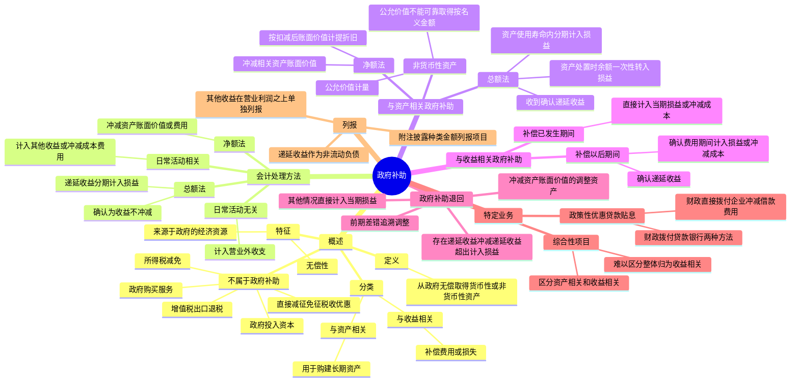

## 📍 章节定位

| 项目 | 信息 |
|------|------|
| **所属科目** | 📒 会计 |
| **难度等级** | ⭐ |
| **历年分值** | 1-2分 |
| **建议学时** | 2-3h |

## 📝 考情分析

本章是会计科目的基础章节，历年分值约 1-2 分，常以客观题和计算分析题形式考查，命题热点集中在：

1. **政府补助的定义和特征**：政府补助是指企业从政府无偿取得货币性资产或非货币性资产，来源于政府的经济资源、无偿性，与政府作为企业所有者投入的资本、政府购买服务的区分，新能源汽车补贴等按收入准则处理而非政府补助的情形。
2. **政府补助的分类**：与资产相关的政府补助（用于购建或以其他方式形成长期资产的政府补助）和与收益相关的政府补助（除与资产相关的政府补助之外的政府补助）。
3. **会计处理方法**：总额法（确认政府补助金额为收益，不作为相关资产账面价值或费用的扣减）和净额法（将政府补助作为相关资产账面价值或所补偿费用的扣减），与日常活动相关的政府补助计入其他收益或冲减相关成本费用，与日常活动无关的计入营业外收支。
4. **与资产相关的政府补助的会计处理**：总额法下确认递延收益，在相关资产使用寿命内按合理、系统的方法分期计入损益；净额法下冲减相关资产账面价值。
5. **与收益相关的政府补助的会计处理**：用于补偿以后期间成本费用或损失的，确认为递延收益，在确认相关费用或损失的期间计入当期损益或冲减相关成本；用于补偿已发生成本费用或损失的，直接计入当期损益或冲减相关成本。
6. **政府补助的退回**：初始确认时冲减资产账面价值的，调整资产账面价值；存在相关递延收益的，冲减递延收益账面余额，超出部分计入当期损益；其他情况的直接计入当期损益。
7. **政策性优惠贷款贴息**：财政将贴息资金拨付给贷款银行（两种方法）和财政将贴息资金直接拨付给受益企业（冲减相关借款费用）。

考生需重点掌握：政府补助的核心是**无偿取得**货币性资产或非货币性资产，与政府购买服务（如新能源汽车补贴）和政府作为投资者投入资本相区分；总额法与净额法一经选择不得随意变更；与资产相关的政府补助通过"**递延收益**"科目分期计入损益；与收益相关的政府补助区分补偿以后期间和已发生期间；增值税出口退税**不属于**政府补助；综合性项目政府补助难以区分的整体归类为与收益相关的政府补助。

## 🧠 知识框架



## 📖 核心精讲

### 一、政府补助概述

#### （一）政府补助的定义

根据《企业会计准则第 16 号——政府补助》的规定，**政府补助**是指企业从政府**无偿取得**货币性资产或非货币性资产。例如，政府对企业的无偿拨款，先征后返（退）、即征即退等方式的税收返还，直接向企业拨付财政贴息，以及无偿给予非货币性资产等。

**不属于政府补助的情形**：

| 情形 | 适用准则 |
|------|---------|
| 直接减征、免征、增加计税抵扣额、抵免部分税额等税收优惠 | 不适用政府补助准则 |
| 所得税减免 | 适用《企业会计准则第 18 号——所得税》 |
| 政府以低于公允价值的价格出租资产给企业 | 不纳入政府补助范围（不涉及资产直接转移） |
| 政府作为企业所有者投入资本 | 属于互惠交易，不属于政府补助 |
| 政府购买服务（如新能源汽车补贴） | 适用收入准则 |
| 增值税出口退税 | 不属于政府补助（退回企业事先垫付的进项税） |

> **注意**：部分减免税款需要按照政府补助准则进行会计处理。例如，属于一般纳税人的加工型企业根据税法规定招用自主就业退役士兵，并按定额扣减增值税的，应当将减征的税额计入当期损益，借记"应交税费——应交增值税（减免税款）"，贷记"其他收益"。

#### （二）政府补助的特征

1. **来源于政府的经济资源**：政府主要是指行政事业单位及类似机构。对企业收到的来源于其他方的补助，如有确凿证据表明政府是补助的实际拨付者，其他方只是起到代收代付的作用，则该项补助也属于来源于政府的经济资源。
2. **无偿性**：企业取得来源于政府的经济资源，不需要向政府交付商品或服务等对价。这一特征将政府补助与政府作为企业所有者投入的资本、政府购买服务等互惠性交易区别开来。

> **关键判断**：企业从政府取得的经济资源，如果与企业销售商品或提供劳务等活动密切相关，且来源于政府的经济资源是企业商品或服务的对价或者是对价的组成部分，应当按照**收入准则**的规定进行会计处理，不适用政府补助准则。例如，新能源汽车厂商取得的中央和地方财政补贴实质上是为消费者购买新能源汽车承担和支付了部分销售价款，属于新能源汽车销售对价的组成部分，应确认为收入。

#### （三）政府补助的分类

| 类型 | 定义 |
|------|------|
| **与资产相关的政府补助** | 企业取得的、用于购建或以其他方式形成长期资产的政府补助 |
| **与收益相关的政府补助** | 除与资产相关的政府补助之外的政府补助，主要是用于补偿企业已发生或即将发生的费用或损失 |

### 二、政府补助的会计处理方法

政府补助有两种会计处理方法：

| 方法 | 含义 | 处理 |
|------|------|------|
| **总额法** | 确认政府补助时将政府补助金额确认为收益，而不是作为相关资产账面价值或费用的扣减 | 确认递延收益，分期计入"其他收益"或"营业外收入" |
| **净额法** | 将政府补助作为相关资产账面价值或所补偿费用的扣减 | 冲减相关资产账面价值或相关成本费用 |

> 同一企业不同时期发生的相同或者相似的交易或者事项，应当采用一致的会计政策，不得随意变更。对同类或类似政府补助业务只能选用一种方法，且应当一贯地运用。

**与日常活动的关系**：

| 类型 | 处理 |
|------|------|
| 与日常活动相关的政府补助 | 计入"其他收益"（总额法）或冲减相关成本费用（净额法） |
| 与日常活动无关的政府补助 | 计入"营业外收入"（总额法）或冲减"营业外支出"（净额法） |

> 通常情况下，若政府补助补偿的成本费用是营业利润之中的项目，或该补助与日常销售等经营行为密切相关（如增值税即征即退等），则认为该政府补助与日常活动相关。

**确认条件**：政府补助同时满足下列条件的，才能予以确认：
1. 企业能够满足政府补助所附条件；
2. 企业能够收到政府补助。

**计量**：政府补助为货币性资产的，按照收到或应收的金额计量；为非货币性资产的，按照公允价值计量，公允价值不能可靠取得的，按照名义金额（1 元）计量。

### 三、与资产相关的政府补助的会计处理

#### （一）总额法

1. 收到补助资金时：
```
借：银行存款
    贷：递延收益
```

2. 在相关资产使用寿命内按合理、系统的方法分期计入损益：
```
借：递延收益
    贷：其他收益（与日常活动相关）
        营业外收入（与日常活动无关）
```

3. 相关资产处置时，尚未分摊的递延收益余额一次性转入资产处置当期的损益。

> 如果对应的长期资产在持有期间发生减值损失，递延收益的摊销仍保持不变，不受减值因素的影响。

#### （二）净额法

1. 收到补助资金时先确认为递延收益。
2. 在相关资产达到预定可使用状态或预定用途时，将递延收益冲减相关资产的账面价值。
3. 按扣减了政府补助后的账面价值和相关资产的剩余使用寿命计提折旧或进行摊销。

**净额法会计分录**：
```
借：银行存款
    贷：递延收益
借：递延收益
    贷：固定资产（冲减资产账面价值）
```

#### （三）非货币性资产政府补助

- 按照公允价值计量：借记有关资产科目，贷记"递延收益"科目，在相关资产使用寿命内分期计入损益。
- 公允价值不能可靠取得的，按照名义金额（1 元）计量，在取得时计入当期损益。

### 四、与收益相关的政府补助的会计处理

#### （一）用于补偿企业以后期间的相关成本费用或损失

在收到时先判断企业能否满足政府补助所附条件：
- 能满足条件的，确认为**递延收益**，并在确认相关费用或损失的期间，计入当期损益或冲减相关成本。
- 暂时无法确定能否满足条件的，先记入"其他应付款"科目，待客观情况表明能满足条件后再转入"递延收益"科目。

**总额法**：
```
借：银行存款
    贷：递延收益
借：递延收益
    贷：其他收益（与日常活动相关）
        营业外收入（与日常活动无关）
```

**净额法**：
```
借：银行存款
    贷：递延收益
借：递延收益
    贷：管理费用等（冲减相关成本费用）
        营业外支出（冲减营业外支出）
```

#### （二）用于补偿企业已发生的相关成本费用或损失

直接计入当期损益或冲减相关成本，不通过递延收益。

**总额法**：
```
借：银行存款（或其他应收款）
    贷：其他收益（与日常活动相关）
        营业外收入（与日常活动无关）
```

**净额法**：
```
借：银行存款（或其他应收款）
    贷：管理费用等（冲减相关成本费用）
        营业外支出（冲减营业外支出）
```

### 五、政府补助的退回

已计入损益的政府补助需要退回的，应当在需要退回的当期分情况处理：

| 情形 | 会计处理 |
|------|---------|
| 初始确认时冲减相关资产账面价值的（净额法） | 调整资产账面价值 |
| 存在相关递延收益的（总额法） | 冲减相关递延收益账面余额，超出部分计入当期损益 |
| 其他情况 | 直接计入当期损益 |

> 对于属于前期差错的政府补助退回，应当按照前期差错更正进行追溯调整。

### 六、特定业务的会计处理

#### （一）综合性项目政府补助

综合性项目政府补助同时包含与资产相关的政府补助和与收益相关的政府补助，企业应当采用合理的方法将其进行分解并分别进行会计处理；**确实难以区分的，企业应当将其整体归类为与收益相关的政府补助**进行处理。

#### （二）政策性优惠贷款贴息

| 情形 | 会计处理 |
|------|---------|
| **财政将贴息资金拨付给贷款银行** | 企业可选择：①以实际收到的金额作为借款入账价值，按政策性优惠利率计算借款费用；②以借款的公允价值作为入账价值并按实际利率法计算借款费用，实际收到金额与公允价值差额确认为递延收益，在借款存续期内采用实际利率法摊销冲减相关借款费用 |
| **财政将贴息资金直接拨付给受益企业** | 企业先按同类贷款市场利率向银行支付利息，对应的贴息冲减相关借款费用 |

### 七、政府补助的列报

1. **资产负债表**：计入递延收益的政府补助作为非流动负债，在"递延收益"项目中单独列示。
2. **利润表**：在"营业利润"项目之上单独列报"其他收益"项目；冲减相关成本费用的政府补助在相关成本费用项目中反映；与日常活动无关的政府补助在营业外收支项目中列报。
3. **附注披露**：政府补助的种类、金额和列报项目；计入当期损益的政府补助金额；本期退回的政府补助金额及原因。

## 💡 典型例题

**【例题 1】（基础题，单选题）**

下列各项中，不属于政府补助的是（　　）。
A. 政府无偿拨付给企业的财政拨款
B. 政府先征后返的增值税
C. 政府直接免征的企业所得税
D. 政府无偿给予企业的土地使用权

**答案**：C

**解析**：A、B、D 均属于政府补助（企业从政府无偿取得货币性资产或非货币性资产）；C 不属于政府补助，直接减征、免征、增加计税抵扣额、抵免部分税额等方式的税收优惠不适用政府补助准则，与所得税减免相关的适用所得税准则。

**【例题 2】（进阶题，单选题）**

下列关于政府补助会计处理的表述中，正确的是（　　）。
A. 企业取得与日常活动相关的政府补助，采用总额法核算的应计入营业外收入
B. 企业取得与资产相关的政府补助，采用总额法核算时应确认递延收益并在资产使用寿命内分期计入损益
C. 企业取得与收益相关的政府补助用于补偿已发生的费用，应确认为递延收益
D. 企业对同类政府补助业务可以同时采用总额法和净额法

**答案**：B

**解析**：A 错误，与日常活动相关的政府补助采用总额法核算的应计入"其他收益"，与日常活动无关的才计入营业外收入；B 正确，与资产相关的政府补助采用总额法核算时确认递延收益，在资产使用寿命内分期计入损益；C 错误，用于补偿已发生费用的政府补助直接计入当期损益，不确认为递延收益；D 错误，对同类或类似政府补助业务只能选用一种方法，不得随意变更。

**【例题 3】（计算题，与资产相关政府补助总额法）**

按照国家有关政策，企业购置环保设备可以申请补贴。丁企业于 2×18 年 1 月向政府提交了 210 万元的补助申请。2×18 年 3 月 15 日，丁企业收到政府补贴款 210 万元。2×18 年 4 月 20 日，丁企业购入不需安装环保设备，实际成本 480 万元，使用寿命 10 年，采用直线法计提折旧（不考虑净残值）。丁企业选择总额法进行会计处理。

要求：编制丁企业 2×18 年的相关会计分录。

**答案**：

（1）2×18 年 3 月 15 日收到财政拨款：
```
借：银行存款                2 100 000
    贷：递延收益             2 100 000
```

（2）2×18 年 4 月 20 日购入设备：
```
借：固定资产                4 800 000
    贷：银行存款             4 800 000
```

（3）自 2×18 年 5 月起每月月末计提折旧（假设折旧费用计入制造费用）：
- 月折旧额 = 4 800 000 ÷ 10 ÷ 12 = 40 000（元）
```
借：制造费用                 40 000
    贷：累计折旧              40 000
```

（4）自 2×18 年 5 月起每月月末分摊递延收益：
- 月摊销额 = 2 100 000 ÷ 10 ÷ 12 = 17 500（元）
```
借：递延收益                 17 500
    贷：其他收益              17 500
```

**解析**：总额法下，与资产相关的政府补助先确认为递延收益，在相关资产使用寿命内按合理、系统的方法分期计入损益。自资产开始计提折旧时开始分摊递延收益。

**【例题 4】（计算题，与资产相关政府补助净额法）**

承例题 3，假设丁企业选择净额法进行会计处理。

要求：编制丁企业 2×18 年的相关会计分录。

**答案**：

（1）2×18 年 3 月 15 日收到财政拨款：
```
借：银行存款                2 100 000
    贷：递延收益             2 100 000
```

（2）2×18 年 4 月 20 日购入设备并冲减资产账面价值：
```
借：固定资产                4 800 000
    贷：银行存款             4 800 000
借：递延收益                2 100 000
    贷：固定资产             2 100 000
```

（3）自 2×18 年 5 月起每月月末计提折旧：
- 调整后固定资产账面价值 = 4 800 000 − 2 100 000 = 2 700 000（元）
- 月折旧额 = 2 700 000 ÷ 10 ÷ 12 = 22 500（元）
```
借：制造费用                 22 500
    贷：累计折旧              22 500
```

**解析**：净额法下，将政府补助冲减相关资产账面价值，按扣减后的账面价值和剩余使用寿命计提折旧。

**【例题 5】（计算题，与收益相关政府补助）**

甲企业于 2×24 年 4 月 10 日收到地方政府 1 000 万元奖励资金，用于人才激励和引进。协议约定甲企业自获得奖励起 10 年内注册地址不迁离本区，否则政府有权追回奖励资金。甲企业分别在 2×24 年 12 月、2×25 年 12 月、2×26 年 12 月使用了 400 万元、300 万元和 300 万元用于发放高管年度奖金。甲企业选择净额法进行会计处理。

要求：编制甲企业的相关会计分录。

**答案**：

（1）2×24 年 4 月 10 日实际收到补助资金（客观情况表明 10 年内搬离可能性很小）：
```
借：银行存款             10 000 000
    贷：递延收益          10 000 000
```

（2）2×24 年 12 月使用 400 万元：
```
借：递延收益              4 000 000
    贷：管理费用           4 000 000
```

（3）2×25 年 12 月使用 300 万元：
```
借：递延收益              3 000 000
    贷：管理费用           3 000 000
```

（4）2×26 年 12 月使用 300 万元：
```
借：递延收益              3 000 000
    贷：管理费用           3 000 000
```

**解析**：与收益相关的政府补助用于补偿以后期间成本费用的，确认为递延收益，在确认相关费用的期间计入当期损益或冲减相关成本。净额法下冲减管理费用。如果收到补助时暂时无法确定能否满足条件，先记入"其他应付款"科目。

**【例题 6】（综合题，政府补助退回）**

承例题 3，假设 2×19 年 5 月，有关部门在对丁企业的检查中发现，丁企业不符合申请补助的条件，要求丁企业退回补助款 210 万元。丁企业于当月退回了补助款。

要求：分别按总额法和净额法编制丁企业退回补助款的会计分录。

**答案**：

**总额法**（冲减递延收益账面余额，超出部分计入当期损益）：

假设至 2×19 年 5 月已摊销递延收益 = 17 500 × 12 = 210 000（元）（2×18 年 5 月至 2×19 年 4 月共 12 个月），递延收益余额 = 2 100 000 − 210 000 = 1 890 000（元）。

```
借：递延收益              1 890 000
    其他收益                210 000
    贷：银行存款           2 100 000
```

**净额法**（调整资产账面价值，差额计入当期损益）：

```
借：固定资产              2 100 000
    其他收益                210 000
    贷：银行存款           2 100 000
        累计折旧             210 000
```

**解析**：政府补助退回时，总额法下冲减递延收益账面余额，超出部分计入当期损益；净额法下调整资产账面价值，实际退回金额与账面价值调整数之间的差额计入当期损益。

## 🎯 记忆口诀

- **政府补助定义**："从政府无偿取得货币性或非货币性资产"——核心是无偿取得资产。
- **不属于政府补助**："税收优惠、出口退税、投入资本、购买服务"——直接减免税收优惠、增值税出口退税、政府投入资本、政府购买服务（如新能源汽车补贴）不属于政府补助。
- **两类补助**："资产相关购长期资产，收益相关补费用损失"——与资产相关的用于购建长期资产，与收益相关的补偿费用或损失。
- **两种方法**："总额法确认收益，净额法冲减资产费用"——总额法确认为收益（递延收益分期计入），净额法冲减资产账面价值或费用。
- **总额法处理**："收到确认递延收益，分期计入其他收益或营业外收入"——与资产相关的先确认递延收益，在资产使用寿命内分期计入。
- **净额法处理**："冲减资产账面价值，按扣减后价值折旧"——将政府补助冲减相关资产账面价值。
- **与收益相关区分**："补偿以后期间确认递延收益，补偿已发生直接计入损益"——补偿以后期间的先确认递延收益，补偿已发生的直接计入当期损益。
- **日常活动相关**："计入其他收益或冲减成本费用"——与日常活动相关的政府补助计入其他收益（总额法）或冲减成本费用（净额法）。
- **日常活动无关**："计入营业外收支"——与日常活动无关的政府补助计入营业外收入或冲减营业外支出。
- **退回处理**："净额调资产，总额冲递延，超出入损益"——退回时净额法调整资产账面价值，总额法冲减递延收益，超出部分计入当期损益。
- **综合性项目**："难以区分整体归为收益相关"——综合性项目难以区分的，整体归类为与收益相关的政府补助。
- **政策性贷款贴息**："银行拨付两方法选一，企业拨付冲减借款费用"——财政拨付给银行的可选两种方法，财政直接拨付企业的冲减借款费用。

## ✅ 同步练习

1. （基础题）政府补助的定义和特征，不属于政府补助的情形（税收优惠、出口退税、政府投入资本、政府购买服务），政府补助的分类（与资产相关、与收益相关）。提示：参见《必刷 550 题》政府补助基础题。
2. （进阶题）总额法与净额法的区分和应用条件，与日常活动相关和无关的政府补助的区分（增值税即征即退与日常活动相关）。提示：参见《必刷 550 题》政府补助进阶题。
3. （易错题）与资产相关的政府补助的会计处理（总额法确认递延收益分期摊销，净额法冲减资产账面价值），资产处置时递延收益余额的处理。提示：参见《必刷 550 题》与资产相关政府补助易错题。
4. （计算题）与收益相关的政府补助的会计处理（补偿以后期间确认递延收益，补偿已发生直接计入损益），总额法与净额法的会计分录。提示：参见《必刷 550 题》与收益相关政府补助计算题。
5. （真题改编）政府补助退回的会计处理（总额法冲减递延收益超出计入损益，净额法调整资产账面价值），综合性项目政府补助的处理（难以区分的整体归为与收益相关）。提示：参见历年真题计算分析题。
6. （综合题）政策性优惠贷款贴息的会计处理（财政拨付银行两种方法，财政直接拨付企业冲减借款费用），政府补助的列报（递延收益作为非流动负债，其他收益单独列报）。提示：参见历年真题综合题。
7. 综合复习政府补助与收入准则的区分（新能源汽车补贴），政府补助与政府购买服务的区分，政府补助退回与前期差错更正的关系，非货币性资产政府补助的计量（公允价值和名义金额）。
