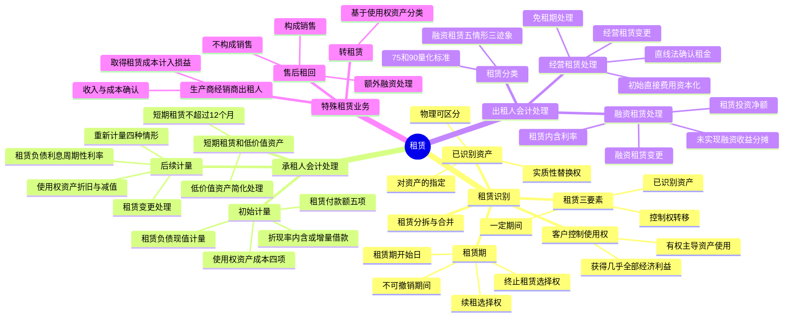

## 1. 章节定位

| 项目 | 信息 |
|------|------|
| 所属科目 | 会计 |
| 难度等级 | 5 |
| 历年分值 | 6-10 分 |
| 建议学时 | 8-10 小时 |
| 知识关联章节 | 第4章 固定资产（使用权资产折旧）、第8章 负债（租赁负债）、第11章 借款费用（资本化判断）、第13章 金融工具（嵌入衍生工具分拆）、第17章 收入（售后租回是否构成销售）、第19章 所得税（暂时性差异） |

## 2. 考情分析

本章是会计科目的高频重难点章节，历年分值约 6-10 分，几乎每年必考主观题，常以计算分析题或综合题形式出现，并广泛与固定资产、收入、所得税、差错更正等章节联动考查。新租赁准则取消了承租人经营租赁与融资租赁的区分，引入"使用权资产"和"租赁负债"双重确认模型，是近年考查重点。

**命题规律**：本章主观题常以业务情境为载体，要求考生完成租赁识别、初始计量、后续计量及变更的完整会计处理；客观题则集中在租赁定义判断、已识别资产识别、租赁期确定、融资租赁分类标准等概念辨析。

**高频考点分布**：

1. **租赁的识别**：租赁三要素、已识别资产的判定（指定、物理可区分、实质性替换权）、客户是否控制使用权的三项判断。
2. **租赁期的确定**：租赁期开始日、不可撤销期间、续租选择权与终止租赁选择权的评估因素、租赁期重新评估。
3. **承租人初始计量**：租赁付款额五项内容、折现率选择（租赁内含利率 vs 增量借款利率）、使用权资产成本四项构成。
4. **承租人后续计量**：租赁负债利息计算（周期性利率）、租赁负债重新计量四种情形、使用权资产折旧与减值、租赁变更处理。
5. **短期租赁和低价值资产租赁**：简化处理的条件与限制。
6. **出租人租赁分类**：融资租赁五项情形与三项迹象、75%与90%的量化标准。
7. **出租人融资租赁会计处理**：租赁投资净额、租赁内含利率计算、未实现融资收益分摊。
8. **出租人经营租赁会计处理**：租金收入确认、免租期处理、初始直接费用资本化。
9. **特殊租赁业务**：转租赁的分类基础（使用权资产）、生产商或经销商出租人处理、售后租回交易（构成销售 vs 不构成销售）。

**联动考查方式**：与固定资产结合（使用权资产折旧）、与收入结合（售后租回判断）、与所得税结合（暂时性差异）、与差错更正结合（分类与折现率错误）。

**备考建议**：
- 牢记承租人"双重确认"模型：使用权资产 + 租赁负债，不再区分经营租赁和融资租赁；
- 区分租赁内含利率（出租人角度）与增量借款利率（承租人角度）的适用条件；
- 掌握租赁付款额五项内容与使用权资产成本四项构成的对应关系；
- 融资租赁分类标准中"75%"和"90%"是量化指标，其余为定性判断；
- 售后租回交易必须先判断是否构成销售，再分别处理。

## 3. 知识框架

## 4. 核心精讲

### 4.1 租赁概述

#### 4.1.1 租赁的定义

**租赁**，是指在一定期间内，出租人将资产的使用权让与承租人以获取对价的合同。

一项租赁应当包含下列**三项要素**：①存在**一定期间**（也可表述为已识别资产的使用量，如某设备的产出量）；②存在**已识别资产**；③资产供应方向客户转移对已识别资产使用权的**控制**。

企业应当在**合同开始日**评估合同是否为租赁或者包含租赁。除非合同条款或条件发生变化，否则无需在合同开始日后重新评估。

**单独租赁的判断条件**（同时满足）：①承租人可从单独使用该资产或将其与易于获得的其他资源一起使用中获利；②该资产与合同中的其他资产不存在高度依赖或高度关联关系。

#### 4.1.2 已识别资产

**已识别资产**通常由合同明确指定，也可以在资产可供客户使用时**隐性指定**。

**（1）对资产的指定**：即使合同未通过序列号等明确指定，若资产供应方仅拥有一节适合承租人使用的资产（如专用火车车厢），必须使用其履行合同，则该资产属于被隐性指定的已识别资产。

**（2）物理可区分**：如果资产的部分产能在物理上可区分（如建筑物的一层），则该部分产能属于已识别资产。如果资产的某部分产能在物理上不可区分（如光缆的部分容量），则该部分不属于已识别资产，除非实质上代表该资产的全部产能。

**（3）实质性替换权**：如果资产供应方在整个使用期间拥有对该资产的实质性替换权，即使合同已对资产进行指定，该资产也不属于已识别资产。须**同时满足**：资产供应方拥有在整个使用期间替换资产的**实际能力**（客户无法阻止，且供应方易于获得替换资产）；通过行使替换权将获得**经济利益**（预期经济利益超过替换成本）。应基于合同开始日的事实和情况判断；仅在特定日期或事件发生日拥有替换权的，不具有实质性；难以确定的，视为没有实质性替换权。

#### 4.1.3 客户是否控制已识别资产使用权的判断

企业应当评估客户是否有权获得在使用期间因使用已识别资产所产生的**几乎全部经济利益**，并有权在该使用期间**主导**已识别资产的使用。

**（1）获得几乎全部经济利益**：客户应当有权获得整个使用期间使用该资产所产生的几乎全部经济利益。客户可以通过使用、持有或转租等方式直接或间接获得经济利益。即使合同规定客户应向供应方支付因使用资产所产生的部分现金流量作为对价，该现金流量仍视为客户获得的经济利益的一部分。

**（2）有权主导资产的使用**：存在下列情形之一的，可视为客户有权主导对已识别资产在整个使用期间的使用：①客户有权在整个使用期间主导已识别资产的**使用目的和使用方式**；②已识别资产的使用目的和使用方式在使用期间前已**预先确定**，且客户有权自行运营或主导他人按其确定方式运营，或者客户**设计**了已识别资产并预先确定其使用目的和方式。

**相关决策权**示例：变更产出类型、产出时间、产出地点、是否产出及产出数量。仅拥有运行或维护资产的权利（目的和方式未预先确定时）不构成主导资产使用的权利。

#### 4.1.4 租赁的分拆与合并

**（一）租赁的分拆**

合同中同时包含多项单独租赁的，承租人和出租人应当将合同予以分拆，分别各项单独租赁进行会计处理。合同中同时包含租赁和非租赁部分的，承租人和出租人应当分拆，除非承租人适用**简化处理**（可按租赁资产类别选择不分拆，将各租赁部分及相关的非租赁部分合并为租赁处理）。但对于应分拆的嵌入衍生工具，承租人不应将其与租赁部分合并。

- **承租人**：按各项租赁部分单独价格及非租赁部分单独价格的**相对比例**分摊合同对价。单独价格根据出租人或类似资产供应方对外单独收取的价格确定；不易获得的，利用可观察信息估计。
- **出租人**：根据收入准则关于交易价格分摊的规定分摊合同对价。

**（二）租赁的合并**

企业与同一交易方或其关联方在相同或相近时间订立的两份或多份包含租赁的合同，在满足下列条件**之一**时，应当合并为一份合同进行会计处理：①基于总体商业目的而订立并构成"一揽子交易"；②某份合同的对价金额取决于其他合同的定价或履行情况；③让渡的资产使用权合起来构成一项单独租赁。合并后仍需区分该合同中的租赁部分和非租赁部分。

#### 4.1.5 租赁期

**租赁期**是指承租人有权使用租赁资产且**不可撤销**的期间。

**（1）租赁期开始日**：是指出租人提供租赁资产使其可供承租人使用的起始日期。如果承租人在起租日或租金起付日之前已获得对租赁资产使用权的控制，则租赁期已经开始。免租期包含在租赁期内。

**（2）不可撤销期间**：根据租赁条款确定可强制执行合同的期间。当承租人和出租人双方均有权在未经另一方许可的情况下终止租赁，且所受惩罚不重大时，该租赁不再可强制执行；只有承租人有权终止租赁的，视为承租人可行使的终止租赁选择权；只有出租人有权终止租赁的，不可撤销期间包括终止租赁选择权所涵盖的期间。

**（3）续租选择权与终止租赁选择权**：承租人有续租选择权，且**合理确定**将行使的，租赁期应包含续租选择权涵盖的期间；承租人有终止租赁选择权，且合理确定将**不会**行使的，租赁期应包含终止租赁选择权涵盖的期间。评估时需考虑：与市价相比的选择权条款、租赁资产改良的重大经济利益、与终止租赁相关的成本、租赁资产对承租人运营的重要程度、行使选择权的条件及满足可能性。

**（4）购买选择权**：评估方式与续租选择权相同，在经济上与将租赁期延长至租赁资产全部剩余经济寿命的续租选择权类似。

**（5）租赁期的重新评估**：发生承租人可控范围内的重大事件或变化，且影响承租人是否合理确定将行使相应选择权的，应当重新评估并修改租赁期。此类事件包括：未预计到的重大租赁资产改良、重大改动或定制化调整、与行使选择权直接相关的经营决策。

### 4.2 承租人会计处理

在租赁期开始日，承租人应当对租赁确认**使用权资产**和**租赁负债**（应用简化处理的短期租赁和低价值资产租赁除外）。承租人不再区分经营租赁和融资租赁。

#### 4.2.1 初始计量

**（一）租赁负债的初始计量**

租赁负债应当按照租赁期开始日尚未支付的租赁付款额的**现值**进行初始计量。

**1. 租赁付款额**

租赁付款额包括下列**五项**内容：

| 项目 | 说明 |
|------|------|
| 固定付款额及实质固定付款额 | 存在租赁激励的扣除。实质固定付款额是形式可能含变量但实质无法避免的付款额 |
| 取决于指数或比率的可变租赁付款额 | 根据租赁期开始日的指数或比率确定。其他可变付款额不纳入初始计量，实际发生时计入损益 |
| 购买选择权的行权价格 | 前提是承租人合理确定将行使 |
| 行使终止租赁选择权需支付的款项 | 前提是租赁期反映出承租人将行使 |
| 担保余值预计应支付的款项 | 反映承租人预计将支付的金额，而非最大敞口 |

**实质固定付款额**的三种常见情形：付款额设定为可变但该可变条款几乎不可能发生；承租人有多套付款额方案但仅有一套可行；有多套可行方案但必须选择其中一套，采用总折现金额最低的一套。

**注意**：款项中包含的增值税不属于租赁付款额；租赁保证金不属于租赁付款额，应作为单独的资产处理。

**2. 折现率**

承租人应当采用**租赁内含利率**作为折现率；无法确定租赁内含利率的，应当采用**承租人增量借款利率**作为折现率。

- **租赁内含利率**：是指使出租人的租赁收款额的现值与未担保余值的现值之和等于租赁资产公允价值与出租人的初始直接费用之和的利率。
- **承租人增量借款利率**：是指承租人在类似经济环境下为获得与使用权资产类似的资产，在类似抵押条件下借入资金须支付的利率。与承租人偿债能力、信用状况、租赁期、租赁负债金额、租赁资产性质和质量、经济环境（司法管辖区、计价货币、合同签订时间）等相关。

**（二）使用权资产的初始计量**

**使用权资产**是指承租人可在租赁期内使用租赁资产的权利。在租赁期开始日，承租人应当按照**成本**对使用权资产进行初始计量。该成本包括下列**四项**：

| 项目 | 说明 |
|------|------|
| 租赁负债的初始计量金额 | 即尚未支付的租赁付款额的现值 |
| 在租赁期开始日或之前支付的租赁付款额 | 存在租赁激励的，应扣除已享受的租赁激励相关金额 |
| 承租人发生的初始直接费用 | 为达成租赁所发生的增量成本（佣金、印花税等） |
| 拆卸及移除租赁资产、复原场地预计将发生的成本 | 按或有事项准则确认和计量。用于生产存货的，按存货准则处理 |

**注意事项**：租赁资产改良支出不属于使用权资产，应记入"长期待摊费用"；与租赁资产建造或设计相关的成本适用其他准则（如固定资产准则），但为获取使用权而支付的款项属于租赁付款额；用于生产存货的拆卸复原成本按存货准则处理。

#### 4.2.2 后续计量

**（一）租赁负债的后续计量**

1. **计量基础**：
   - 确认租赁负债的利息时，增加租赁负债的账面金额（计入财务费用或相关资产成本）；
   - 支付租赁付款额时，减少租赁负债的账面金额；
   - 因重估或租赁变更等原因导致租赁付款额发生变动时，重新计量租赁负债的账面价值。

承租人应当按照**固定的周期性利率**（初始计量时的折现率，或重新计量时修订后的折现率）计算租赁期内各期间的利息费用。

未纳入租赁负债计量的可变租赁付款额（非取决于指数或比率），应当在实际发生时计入当期损益。

2. **租赁负债的重新计量**：发生下列**四种情形**时，承租人应当按照变动后的租赁付款额的现值重新计量租赁负债，并相应调整使用权资产的账面价值。使用权资产的账面价值已调减至零，但租赁负债仍需进一步调减的，将剩余金额计入当期损益。

| 情形 | 折现率 |
|------|--------|
| 实质固定付款额发生变动（可变性消除转为固定） | 折现率不变 |
| 担保余值预计的应付金额发生变动 | 折现率不变 |
| 指数或比率发生变动（浮动利率） | 采用修订后的折现率 |
| 指数或比率发生变动（非浮动利率） | 折现率不变 |
| 购买选择权、续租选择权或终止租赁选择权的评估结果或实际行使情况变化 | 采用修订后的折现率 |

**（二）使用权资产的后续计量**

1. **计量基础**：承租人应当采用**成本模式**对使用权资产进行后续计量，即以成本减累计折旧及累计减值损失计量。重新计量租赁负债的，应当相应调整使用权资产的账面价值。

2. **使用权资产的折旧**：承租人应当参照固定资产准则有关折旧规定，自租赁期开始日起对使用权资产计提折旧（通常自当月计提）。折旧年限：能合理确定取得所有权的，在**租赁资产剩余使用寿命**内计提；无法合理确定的，在**租赁期与剩余使用寿命孰短**的期间内计提；使用权资产剩余使用寿命更短的，按其剩余使用寿命计提。

3. **使用权资产的减值**：按照资产减值准则确定是否发生减值。发生减值的，借记"资产减值损失"，贷记"使用权资产减值准备"。减值准备一旦计提，**不得转回**。

**（三）租赁变更的会计处理**

**租赁变更**是指原合同条款之外的租赁范围、租赁对价、租赁期限的变更。

1. **作为一项单独租赁处理**（同时满足）：
   - 该租赁变更通过增加一项或多项租赁资产的使用权而扩大了租赁范围；
   - 增加的对价与租赁范围扩大部分的单独价格按合同情况调整后的金额相当。

2. **未作为单独租赁处理**：在租赁变更生效日，承租人应当分摊变更后合同的对价，确定变更后的租赁期，并采用**变更后的折现率**（剩余租赁期间的租赁内含利率或变更生效日的增量借款利率）重新计量租赁负债。租赁范围缩小或租赁期缩短的，调减使用权资产账面价值，相关利得或损失计入当期损益；其他租赁变更相应调整使用权资产账面价值。租赁期缩短至1年以内的，不得改按短期租赁简化处理，相关利得或损失计入"资产处置损益"。

#### 4.2.3 短期租赁和低价值资产租赁

对于短期租赁和低价值资产租赁，承租人可以选择不确认使用权资产和租赁负债，将租赁付款额在租赁期内按直线法计入相关资产成本或当期损益。

**（一）短期租赁**

**短期租赁**是指在租赁期开始日，租赁期不超过12个月（1年）的租赁。**包含购买选择权的租赁，即使租赁期不超过12个月，也不属于短期租赁。**

承租人可以按照租赁资产的类别作出简化处理的选择。实务中，签订租赁期为1年的合同不能简单认为租赁期为1年，应基于所有相关事实和情况判断可强制执行合同的期间及是否存在实质续租、终止等选择权。按简化处理的短期租赁发生租赁变更或租赁期变化的，视为一项新租赁，重新判断是否可以选择简化处理。

**（二）低价值资产租赁**

**低价值资产租赁**是指单项租赁资产为全新资产时价值较低的租赁。判断时基于租赁资产全新状态下的绝对价值，不受承租人规模、性质等影响，也不考虑资产已使用年限及对承租人的重要性。常见低价值资产包括平板电脑、普通办公家具、电话等。如果承租人已经或预期要转租该租赁资产的，不能按低价值资产租赁简化处理。

### 4.3 出租人会计处理

#### 4.3.1 出租人的租赁分类

出租人应当在**租赁开始日**（租赁合同签署日与租赁各方就主要租赁条款作出承诺日中的较早者）将租赁分为**融资租赁**和**经营租赁**。一项租赁属于融资租赁还是经营租赁取决于交易的**实质**，而非合同形式。如果一项租赁实质上转移了与租赁资产所有权有关的几乎全部风险和报酬，出租人应当将该租赁分类为融资租赁。

除非发生租赁变更，出租人无须在租赁开始日后对租赁的分类进行重新评估。

**融资租赁的分类标准**：

一项租赁存在下列一种或多种**情形**的，通常分类为融资租赁：

| 序号 | 情形 | 量化标准 |
|------|------|---------|
| 1 | 租赁期届满时，租赁资产的所有权转移给承租人 | - |
| 2 | 承租人有购买选择权，购买价款远低于行使选择权时租赁资产公允价值 | 可合理确定承租人将行使 |
| 3 | 资产所有权不转移，但租赁期占租赁资产使用寿命的大部分 | 75%以上 |
| 4 | 租赁开始日，租赁收款额现值几乎相当于租赁资产公允价值 | 90%以上 |
| 5 | 租赁资产性质特殊，不作较大改造只有承租人才能使用 | 专购专用性质 |

一项租赁存在下列一项或多项**迹象**的，也可能分类为融资租赁：①若承租人撤销租赁，撤销租赁对出租人造成的损失由承租人承担；②租赁资产余值公允价值波动产生的利得或损失归属于承租人；③承租人有能力以远低于市场水平的租金继续租赁至下一期间。

**注意**：上述情形和迹象并非总是决定性的，企业应综合考虑以风险和报酬的转移程度为依据进行判断。

#### 4.3.2 出租人对融资租赁的会计处理

**（一）初始计量**

在租赁期开始日，出租人应当对融资租赁确认**应收融资租赁款**，并终止确认融资租赁资产。出租人应当以**租赁投资净额**作为应收融资租赁款的入账价值。

- **租赁投资净额** = 未担保余值的现值 + 尚未收到的租赁收款额的现值（按租赁内含利率折现）。
- **租赁投资总额** = 租赁收款额 + 未担保余值。
- **未实现融资收益** = 租赁投资总额 − 租赁投资净额。

**租赁收款额**包括五项：①承租人需支付的固定付款额及实质固定付款额（存在租赁激励的扣除）；②取决于指数或比率的可变租赁付款额（初始计量时根据租赁期开始日的指数或比率确定）；③购买选择权的行权价格（合理确定承租人将行使）；④承租人行使终止租赁选择权需支付的款项（租赁期反映出承租人将行使）；⑤由承租人、与承租人有关的一方以及有经济能力履行担保义务的独立第三方向出租人提供的担保余值。

**租赁内含利率**是使租赁投资总额的现值（即租赁投资净额）等于租赁资产公允价值与出租人的初始直接费用之和的利率。出租人发生的初始直接费用包括在租赁投资净额中。

**（二）融资租赁的后续计量**

出租人应当按照**固定的周期性利率**（租赁内含利率）计算并确认租赁期内各个期间的利息收入，并分摊未实现融资收益。纳入租赁投资净额的可变租赁付款额仅限取决于指数或比率的。未纳入租赁投资净额计量的可变租赁付款额（如与资产未来绩效或使用情况挂钩的），应当在实际发生时计入当期损益。出租人应定期复核未担保余值，若预计降低，应修改租赁期内的收益分配，并立即确认预计的减少额。

**租赁保证金处理**：收到时贷记"其他应付款——租赁保证金"；抵作租金时冲减"应收融资租赁款"；违约没收时贷记"营业外收入"等；未违约到期归还时贷记"银行存款"。

**（三）融资租赁变更的会计处理**

1. **作为一项单独租赁处理**（同时满足）：扩大租赁范围且增加对价相当。

2. **未作为单独租赁处理**：假如变更在租赁开始日生效会被分类为**经营租赁**的，自变更生效日起作为一项新租赁处理，以变更生效日前的租赁投资净额作为租赁资产账面价值；假如变更在租赁开始日生效会被分类为**融资租赁**的，按金融工具准则关于修改或重新议定合同的规定处理，重新计算应收融资租赁款账面余额，相关利得或损失计入当期损益。

#### 4.3.3 出租人对经营租赁的会计处理

1. **租金的处理**：在租赁期内各个期间，出租人应当采用**直线法**将经营租赁的租赁收款额确认为租金收入。其他系统合理的方法能更好反映经济利益消耗模式的，可采用该方法。

2. **激励措施**：出租人提供**免租期**的，应将租金总额在不扣除免租期的整个租赁期内按直线法分配，免租期内应当确认租金收入；出租人承担了承租人某些费用的，应将该费用自租金收入总额中扣除，按扣除后的余额在租赁期内分配。

3. **初始直接费用**：资本化至租赁资产的成本，在租赁期内按照与租金收入相同的确认基础分期计入当期损益。

4. **折旧和减值**：经营租赁资产中的固定资产采用类似资产的折旧政策计提折旧，折旧费计入其他业务成本等；按照资产减值准则确定是否发生减值。

5. **可变租赁付款额**：与指数或比率挂钩的，在租赁期开始日计入租赁收款额；其他可变租赁付款额在实际发生时计入当期损益。

6. **经营租赁的变更**：自变更生效日起作为一项新租赁处理，与变更前租赁有关的预收或应收租赁收款额视为新租赁的收款额。

### 4.4 特殊租赁业务的会计处理

#### 4.4.1 转租赁

转租情况下，原租赁合同和转租赁合同通常都是单独协商的，交易对手也是不同的企业，转租出租人对原租赁合同和转租赁合同应当分别根据承租人和出租人的会计处理要求进行会计处理。

**转租赁分类的基础**：转租出租人应基于原租赁中产生的**使用权资产**（而不是原租赁资产）进行分类。原租赁资产不归转租出租人所有，也未计入其资产负债表。原租赁为短期租赁，且转租出租人作为承租人已采用简化会计处理的，应将转租赁分类为经营租赁。

**融资租赁转租的会计处理**：①终止确认与原租赁相关且转给转租承租人的使用权资产，并确认转租赁投资净额；②将使用权资产与转租赁投资净额之间的差额确认为损益；③在资产负债表中保留原租赁的租赁负债。转租期间，转租出租人既要确认转租赁的融资收益，也要确认原租赁的利息费用。

#### 4.4.2 生产商或经销商出租人的融资租赁会计处理

如果生产商或经销商出租其产品或商品构成融资租赁，交易产生的损益应相当于按正常售价直接销售租赁资产所产生的损益。

**初始计量**：
- **收入确认**：按照租赁资产公允价值与租赁收款额按市场利率折现的现值**两者孰低**确认收入；
- **销售成本**：按照租赁资产账面价值扣除未担保余值的现值后的余额结转销售成本；
- **销售损益**：收入与销售成本的差额。

**特殊规定**：生产商或经销商出租人取得融资租赁所发生的成本（如佣金）属于销售费用，计入当期损益（销售费用），**不计入租赁投资净额**（与其他融资租赁出租人不同）。若以较低利率报价，应将销售利得限制为采用市场利率所能取得的销售利得。

#### 4.4.3 售后租回交易的会计处理

**售后租回交易**是指企业（卖方兼承租人）将资产转让给其他企业（买方兼出租人），并从买方兼出租人租回该项资产的交易。企业应当按照收入准则评估确定售后租回交易中的资产转让是否属于销售。是否具有资产的法定所有权本身并非决定性因素。

**（一）售后租回交易中的资产转让属于销售**

- **卖方兼承租人**：按照资产账面价值中与租回获得的使用权有关的部分，计量售后租回所形成的使用权资产，并仅就转让至买方兼出租人的权利确认相关利得或损失。
- **买方兼出租人**：根据其他适用的企业会计准则对资产购买进行会计处理，并根据租赁准则对资产出租进行会计处理。

**销售对价与公允价值差异的处理**：销售对价低于市场价格的款项作为**预付租金**处理；销售对价高于市场价格的款项作为买方兼出租人向卖方兼承租人提供的**额外融资**处理；承租人按公允价值调整销售利得或损失，出租人按市场价格调整租金收入。

**后续计量限制**：卖方兼承租人在对售后租回所形成的租赁负债进行后续计量时，确定租赁付款额的方式不得导致其确认与租回所获得的使用权有关的利得或损失。但租赁变更导致租赁范围缩小或租赁期缩短的，仍应将相关利得或损失计入当期损益。

**（二）售后租回交易中的资产转让不属于销售**

- **卖方兼承租人**：不终止确认所转让的资产，将收到的现金作为**金融负债**（长期应付款），按金融工具准则处理；
- **买方兼出租人**：不确认被转让资产，将支付的现金作为**金融资产**（长期应收款），按金融工具准则处理。

## 5. 典型例题

**【例题 1】（租赁付款额与使用权资产的初始计量）**

承租人甲公司就某写字楼的某一层楼与出租人乙公司签订了为期10年的租赁协议，并拥有5年的续租选择权。有关资料：（1）初始租赁期内每年租金50 000元，续租期间每年55 000元，款项于每年年初支付；（2）甲公司发生初始直接费用20 000元；（3）乙公司补偿甲公司5 000元佣金作为激励；（4）不能合理确定将行使续租选择权，租赁期10年；（5）增量借款利率5%。

要求：计算甲公司使用权资产的初始成本并编制相关会计分录。

**答案**：

（1）计算租赁负债现值并确认使用权资产和租赁负债：剩余9期付款额 = 50 000 × 9 = 450 000（元）；租赁负债 = 50 000 × (P/A, 5%, 9) = **355 391（元）**；未确认融资费用 = 94 609（元）。

借：使用权资产 355 391、租赁负债——未确认融资费用 94 609；贷：租赁负债——租赁付款额 450 000、银行存款（第1年租金） 50 000

（2）初始直接费用：借：使用权资产 20 000；贷：银行存款 20 000

（3）扣除租赁激励：借：银行存款 5 000；贷：使用权资产 5 000

使用权资产的初始成本 = 355 391 + 50 000 + 20 000 − 5 000 = **420 391（元）**

**解析**：使用权资产成本包括租赁负债现值、期初已付付款额、初始直接费用三项，扣除已享受的租赁激励。第1年租金于期初支付直接计入使用权资产，剩余9期按现值确认租赁负债。

**【例题 2】（租赁负债的后续计量）**

承租人甲公司与出租人乙公司签订了为期7年的商铺租赁合同。每年租赁付款额450 000元，年末支付。甲公司无法确定租赁内含利率，增量借款利率5.04%。租赁期开始日租赁负债为2 600 000元。

要求：计算第1年的利息费用和本金偿还额，并编制会计分录。

**答案**：

第1年利息 = 2 600 000 × 5.04% = **131 040（元）**；本金偿还额 = 450 000 − 131 040 = **318 960（元）**

（1）支付租赁付款额：借：租赁负债——租赁付款额 450 000；贷：银行存款 450 000

（2）确认利息费用：借：财务费用——利息费用 131 040；贷：租赁负债——未确认融资费用 131 040

**解析**：租赁负债后续计量采用固定的周期性利率计算各期利息费用。支付租金时减少租赁付款额，确认利息时增加未确认融资费用（冲减），租赁负债账面价值逐期减少。

**【例题 3】（租赁负债的重新计量——可变付款额转为固定）**

承租人甲公司签订了一份为期10年的机器租赁合同。第1年租金根据机器在第1年下半年的实际产能确定；第2年至第10年每年的租金根据该机器在第1年下半年的实际产能确定（即租金将在第1年末转为固定付款额）。甲公司增量借款利率5%。第1年末，根据实际产能确定的租赁付款额为每年20 000元。

要求：编制甲公司第1年末的相关会计分录。

**答案**：

（1）支付第1年的可变租金并计入当期损益：借：制造费用等 20 000；贷：银行存款 20 000

（2）确认使用权资产和租赁负债（可变性消除后重新计量）：后续年度租赁付款额 = 20 000 × 9 = 180 000（元）；现值 = 20 000 × (P/A, 5%, 9) = **142 156（元）**；未确认融资费用 = 37 844（元）

借：使用权资产 142 156、租赁负债——未确认融资费用 37 844；贷：租赁负债——租赁付款额 180 000

**解析**：第1年租金取决于未来绩效而非指数或比率，不纳入租赁负债初始计量，实际发生时计入当期损益。第1年末可变性消除转为实质固定付款额，采用不变的折现率（5%）重新计量租赁负债。

**【例题 4】（出租人融资租赁的会计处理）**

2×20年12月1日，甲公司（承租人）与乙公司（出租人）签订租赁合同，租入塑钢机一台。主要条款：（1）租赁期6年（2×21年1月1日至2×26年12月31日）；（2）固定租金每年年末160 000元，若及时付款给予减少租金10 000元奖励；（3）租赁开始日公允价值700 000元，账面价值600 000元；（4）乙公司发生初始直接费用10 000元；（5）租赁期届满甲公司可以20 000元购买该机器，估计该日公允价值80 000元；（6）担保余值和未担保余值均为0。

要求：判断租赁类型，计算租赁收款额、租赁投资净额、未实现融资收益和租赁内含利率，并编制乙公司在租赁期开始日的会计分录。

**答案**：

**第一步，判断租赁类型**：存在优惠购买选择权（20 000元远低于80 000元），可合理确定甲公司将行使。租赁期6年占使用寿命（7年）的86%（75%以上）。综合判断为融资租赁。

**第二步，确定租赁收款额**：固定付款额（扣除租赁激励）= (160 000 − 10 000) × 6 = 900 000（元）；购买选择权行权价格 = 20 000（元）；租赁收款额 = **920 000（元）**

**第三步，确定租赁投资总额和净额**：租赁投资总额 = 920 000 + 0 = 920 000（元）；租赁投资净额 = 700 000 + 10 000 = **710 000（元）**；未实现融资收益 = 920 000 − 710 000 = **210 000（元）**

**第四步，计算租赁内含利率**：由 150 000 × (P/A, r, 6) + 20 000 × (P/F, r, 6) = 710 000，得租赁内含利率约 **7.82%**。

**第五步，账务处理**（2×21年1月1日）：

借：应收融资租赁款——租赁收款额 920 000；贷：银行存款 10 000、融资租赁资产 600 000、资产处置损益 100 000、应收融资租赁款——未实现融资收益 210 000

**解析**：出租人终止确认融资租赁资产，按公允价值与账面价值差额确认资产处置损益。初始直接费用计入租赁投资净额（通过减少未实现融资收益实现）。

**【例题 5】（售后租回——构成销售）**

甲公司（卖方兼承租人）以40 000 000元的价格向乙公司（买方兼出租人）转让一栋建筑物。转让前账面原值24 000 000元，累计折旧4 000 000元。甲公司取得该建筑物18年使用权（全部剩余使用年限40年），年租金2 400 000元，年末支付。销售当日公允价值36 000 000元。甲、乙公司均确定租赁内含年利率为4.5%。该资产转让符合收入准则关于销售成立的条件。

要求：计算甲公司使用权资产的初始成本和应确认的资产处置损益，并编制会计分录。

**答案**：

**分析**：销售对价40 000 000元高于公允价值36 000 000元，超额4 000 000元作为乙公司向甲公司提供的**额外融资**处理。

**第一步，计算额外融资与租赁相关的年付款额**：

18年付款额现值 = 2 400 000 × (P/A, 4.5%, 18) = 29 183 980（元）

额外融资年付款额 = 4 000 000 ÷ 29 183 980 × 2 400 000 = **328 948（元）**

租赁相关年付款额 = 2 400 000 − 328 948 = **2 071 052（元）**

租赁相关付款额现值 = 29 183 980 − 4 000 000 = 25 183 980（元）

**第二步，计算使用权资产和利得**：

使用权资产 = (24 000 000 − 4 000 000) × (25 183 980 ÷ 36 000 000) = **13 991 100（元）**

出售全部利得 = 36 000 000 − 20 000 000 = 16 000 000（元）

与转让权利相关的利得 = 16 000 000 × (1 − 25 183 980 ÷ 36 000 000) = **4 807 120（元）**

**第三步，账务处理**：

（1）额外融资：借：银行存款 4 000 000；贷：长期应付款 4 000 000

（2）租赁相关：租赁付款额 = 2 071 052 × 18 = 37 278 936（元）；未确认融资费用 = 37 278 936 − 25 183 980 = 12 094 956（元）

借：固定资产清理 20 000 000、累计折旧 4 000 000；贷：固定资产 24 000 000

借：银行存款 36 000 000、使用权资产 13 991 100、租赁负债——未确认融资费用 12 094 956；贷：固定资产清理 20 000 000、租赁负债——租赁付款额 37 278 936、资产处置损益 4 807 120

**解析**：售后租回构成销售的，卖方兼承租人仅就转让至买方兼出租人的权利确认利得，与租回使用权相关的部分不确认利得。超额售价作为额外融资单独处理。使用权资产按原账面价值中与租回获得使用权相关的部分计量。

## 6. 记忆口诀

**租赁识别三要素**：一定期间、已识别资产、控制权转移。

**已识别资产三判断**：资产指定（显性或隐性）、物理可分、替换无实质。

**客户控制两条件**：获得几乎全部经济利益、有权主导资产使用。

**租赁付款额五项**：固定及实质固定、指数比率可变、购买行权价、终止罚款、担保余值。

**使用权资产四成本**：租赁负债现值、已付付款额、初始直接费、拆卸复原费。

**折现率选择**：内含利率优先，增量借款兜底。

**承租人后续四重新**：实质固定变动、担保余值变动、指数比率变动、选择权评估变动（后两种改折现率）。

**融资租赁五情形**：所有权转移、优惠购买权、75%寿命、90%现值、资产专用。

**融资租赁三迹象**：撤销损失承租担、余值波动归承租、低价续租有能力。

**出租人融资租赁三要素**：投资净额（现值）、投资总额（收款额+未担保余值）、未实现融资收益（差额）。

**短期租赁两条件**：不超过12个月、不含购买选择权。

**低价值资产两限制**：全新绝对价值低、预期不转租。

**售后租回两分支**：构成销售按比例确认利得、不构成销售全额金融负债。

**生产商出租人特点**：收入取公允与现值孰低、佣金计入销售费用（不入投资净额）。

## 7. 同步练习

**245.（单选题）** 下列关于低价值资产租赁的说法中，不正确的是（　）。

A. 承租人在判断租赁资产是否满足低价值租赁时，应基于租赁资产全新状态下的绝对价值进行评估，不考虑其已被使用的年限
B. 对于低价值租赁资产的界定，需要考虑这些资产对于承租方而言是否重大
C. 如果承租人预期将该租赁资产转租，则不能将原租赁按照低价值资产租赁进行简化会计处理
D. 判断为低价值租赁交易的，承租人可以选择不确认使用权资产和租赁负债

---

**246.（单选题）** 2×20年1月1日甲公司与乙公司签订租赁合同，甲公司从乙公司租入一栋写字楼，租赁期为三年，年租金为300万元，于每年年末支付。甲公司无法确定租赁内含利率，其增量借款利率为10%。假定不考虑其他因素，2×20年租赁负债的期末报表列示金额为（　）。［（P/A,10%,3）=2.4869；（P/F,10%,3）=0.7513］

A. 272.75万元
B. 247.93万元
C. 520.68万元
D. 446.07万元

---

**247.（单选题）** 2×20年1月22日，A公司与B公司签订一份租赁协议，协议约定：A公司从B公司租入一项固定资产，起租日为2×20年2月1日，期限为3年，每年年末支付租金20万元。如果该固定资产在租赁期结束时的公允价值低于10万元，A公司需向B公司支付10万元与固定资产公允价值之间的差额。租赁期开始日，A公司预计该固定资产在租赁期结束时的公允价值为8万元，该项固定资产全新时可使用10年，交付使用时已使用6.5年。不考虑其他因素，对于A公司上述租赁业务，下列说法中正确的是（　）。

A. A公司确认的租赁付款额为70万元
B. 租赁期开始日为2×20年1月22日
C. 对于使用权资产计提折旧所采用的折旧年限应为3年
D. 使用权资产计提折旧总额应为使用权资产扣除担保余值后的余额

---

**248.（单选题）** 甲公司是一家设备生产商，与乙公司（生产型企业）签订了一份租赁合同，向乙公司出租所生产的设备，合同主要条款如下：①租赁资产：设备A；②租赁期：2×21年1月1日至2×40年12月31日，共20年，与A设备的使用寿命相同；③租赁期开始日租赁资产的公允价值为1000万元，账面价值为800万元；④租赁期开始日，租赁收款额按照市场利率折现后的金额为990万元；⑤甲公司取得该租赁发生的相关成本费用为1万元；⑥租赁到期日甲公司收回该租赁设备，预计到期日该设备的市场公允价值折现后的金额为30万元，承租方乙公司及第三方担保公司均未对该金额进行担保。假设不考虑其他因素和各项税费影响。下列关于甲公司的处理，不正确的是（　）。

A. 2×21年1月1日，甲公司确认200万元的资产处置损益
B. 2×21年1月1日，甲公司确认990万元的营业收入
C. 2×21年1月1日，甲公司结转770万元的营业成本
D. 甲公司为取得该租赁发生的相关成本费用1万元，计入销售费用

---

**249.（单选题）** （2024年）甲公司在2×23年度发生如下业务：①11月1日，从乙公司租入一层商铺并开始装修，12月31日，商铺尚未达到预定可使用状态。②1月1日，与丙公司签订租赁变更协议，将原租赁到期日为2×23年1月31日的办公用房延期至2×24年1月31日，月租金不变。③12月15日，与丁公司签订租赁变更协议，将原租赁到期日为2×25年1月31日的设备租赁期缩短至2×24年6月30日。不考虑其他因素，甲公司2×23年度与租赁业务相关的会计处理中，正确的是（　）。

A. 设备的租赁期变更后，剩余租赁期不足1年，可按短期租赁处理
B. 将办公用房的租赁期变更作为一项单独租赁处理
C. 将租入商铺装修费计入使用权资产成本
D. 装修期间，对租入商铺确认的使用权资产计提折旧

---

**250.（单选题）** （2024年）企业从事经营租赁时，下列各项会计处理的表述正确的是（　）。

A. 经营租赁发生变更的，出租人应按照变更后的条款对变更之前确认的累计收入进行调整
B. 经营租赁发生的初始直接费用，应资本化计入租赁资产的成本
C. 出租人提供免租期的，应于免租期结束之后计算租金收入
D. 出租人不需要对经营租赁资产计提减值

---

**251.（单选题）** （2023年）2021年1月1日承租人甲公司与出租人乙公司订立5年期的仓库租赁合同，租赁期开始日为2021年1月1日，甲公司有5年的续租选择权，但是租赁期开始日不能合理确定将会行使该选择权。2025年1月1日，乙公司在通知甲公司的情况下，可以于2025年3月31日后解除与甲公司的合同，且无需向甲公司支付违约金。甲公司没有提前终止租赁的选择权。租赁开始时，合同的租赁期为（　）。

A. 4年3个月
B. 4年
C. 5年
D. 10年

---

**252.（单选题）** 甲公司2×24年年初自乙公司租入一项设备，租期为3年，每年末支付租金50万元，预计租赁期满的资产余值为20万元，甲公司因对该设备在租赁期满时的余值提供担保而预计将支付的金额为10万元，担保公司担保余值为5万元。假定该项租赁的租赁内含利率为7%。为将该设备运回甲公司，甲公司另支付运杂费等3万元。不考虑其他因素，甲公司取得的该项使用权资产的入账价值为（　）。［（P/A,7%,3）=2.6243；（P/F,7%,3）=0.8163；计算结果保留两位小数］

A. 130万元
B. 133万元
C. 139.38万元
D. 142.38万元

---

**253.（单选题）** 2×22年1月2日，甲公司采用融资租赁方式出租一条生产线。租赁合同规定：①租赁期为10年，每年收取固定租金20万元。②在租赁期内，承租人每年需根据该生产线所产产品销售额的1%向甲公司支付额外的租金。甲公司在租赁期开始日可合理确定承租人在租赁期内基于相关产品销售额需支付的额外租金为30万元。③承租人提供的租赁资产担保余值为10万元。④与承租人和甲公司均无关联方关系的第三方提供的租赁资产担保余值为5万元。⑤甲公司为确保承租人履行合同相关义务收取租赁保证金2万元。假定不考虑其他因素，甲公司租赁期开始日的租赁收款额为（　）。

A. 200万元
B. 245万元
C. 230万元
D. 215万元

---

**254.（多选题）** 下列关于租赁业务会计处理的表述中，正确的有（　）。

A. 融资租赁期间，如果承租人欠付租金，但租赁合同未发生变更的，出租人应按照规定对应收融资租赁款计提减值准备
B. 出租人采用经营租赁方式租出的固定资产，租赁期的折旧费计入其他业务成本
C. 出租人要求承租人承担管理费等相关款项，并将其计入承租人的应付金额，但并未向承租人转移商品或服务，该应付金额应当作为合同中单独的组成部分
D. 售后租回交易中的固定资产转让属于销售的，应通过"固定资产清理"科目核算

---

**255.（多选题）** 下列关于售后租回业务会计处理的表述中，正确的有（　）。

A. 售后租回交易中的资产转让不属于销售的，卖方兼承租人不应终止确认所转让的资产，应将收到的现金确认为金融负债
B. 售后租回交易中的资产转让属于销售的，卖方兼承租人应针对因租回而获得的使用权确认售后租回所形成的使用权资产
C. 售后租回交易中的资产转让属于销售的，卖方兼承租人在对相关租赁负债进行后续计量时，确定租赁付款额或变更后租赁付款额的方式不得导致其确认与租回所获得的使用权有关的利得或损失
D. 售后租回交易中的资产转让属于销售的，卖方兼承租人据以确认租赁负债的租赁付款额，应包含非取决于指数或比率的可变租赁付款额

---

**256.（多选题）** 下列关于短期租赁的说法中，正确的有（　）。

A. 通常情况下，短期租赁是指租赁期不超过12个月的租赁
B. 包含购买选择权的租赁一定不属于短期租赁
C. 短期租赁应按照合理方法将租赁付款额在租赁期内分摊计入相关资产成本或当期损益
D. 短期租赁存在租赁变更导致租赁期发生变化的，应将该租赁视为原租赁合同的组成部分

---

**257.（多选题）** 甲公司与乙公司签订一项租赁合同，合同约定：甲公司将一栋房屋和一项设备一并出租给乙公司，租赁期为2年，合同总价格为18万元，每年年末支付租金9万元。市场上租入类似房屋和设备存在可观察的单独价格，年租金分别为15万元、5万元。房屋和设备均可单独使用，两者之间不存在高度依赖或高度关联关系。不考虑其他因素，下列有关该租赁合同的表述中，正确的有（　）。

A. 该合同包含两项租赁，甲、乙公司应当将合同中的房屋与设备分别确认为单独租赁
B. 合同价格与市场上租入类似房屋和设备的单独价格合计数不一致，因此房屋与设备不能确认为单独租赁
C. 乙公司会计处理时，房屋分摊的租赁付款额为13.5万元
D. 甲公司应将房屋和设备分拆为两项单独租赁处理，乙公司可以选择分拆或者不分拆

---

**258.（多选题）** 下列有关被划分为融资租赁的转租赁的说法中，正确的有（　）。

A. 中间出租人应终止确认与原租赁相关且转给转租赁承租人的使用权资产，并确认转租赁投资净额
B. 假设中间出租人未发生初始直接费用，中间出租人应将使用权资产的账面价值与转租赁投资净额之间的差额确认为损益
C. 中间出租人保留原租赁的租赁负债，该负债代表应付原租赁出租人的租赁付款额现值
D. 转租期内，中间出租人既要确认转租赁的融资收益，也要确认原租赁的利息费用

---

**259.（计算分析题）** 甲公司2×20年发生租赁业务如下：

（1）2×20年1月1日，甲公司将一条生产线出租给乙公司，租赁期为5年（2×20年1月1日至2×24年12月31日），年租金为20万元（每年12月31日支付当年租金）；租赁期满，乙公司可以以5万元的优惠价格购买该生产线；乙公司享有终止租赁选择权，在租赁期间，如果乙公司终止租赁，需支付的款项为剩余租赁期间的固定租金支付金额。当日，该生产线公允价值为86.98万元，账面价值为76.98万元，预计尚可使用寿命为6年；估计租赁期满时，生产线公允价值为21万元。为签订租赁合同，甲公司发生可归属于租赁合同的手续费1万元。假定甲公司确定的租赁内含利率为6%。

（2）2×20年1月1日，甲公司将一项生产设备出租给丙公司，租赁期为4年，年租金为90万元。出于丙公司与甲公司的长期合作关系，为鼓励丙公司租赁行为，双方协定，甲公司免除丙公司2×20年1月至4月租金。假定该租赁属于经营租赁。甲公司会计人员年末确认当年租金收入时，认为存在免租期，当年应按照扣除免租租金之后的金额确认租金收入，即2×20年应确认租金收入60万元（90/12×8）。

其他资料：不考虑其他因素，已知（P/A,6%,5）=4.2124；（P/F,6%,5）=0.7473。
要求：
（1）根据资料（1），判断甲公司该项租赁的性质，并说明理由；如果属于融资租赁，计算甲公司租赁期开始日的租赁收款额和租赁投资净额。
（2）根据资料（1），编制甲公司2×20年与该租赁相关的会计分录。
（3）根据资料（2），判断甲公司确认的租金收入是否正确，并说明理由；如果不正确，计算出正确的金额。

---

**260.（计算分析题）** （2024年）甲公司相关年度发生的有关交易或事项如下：

（1）2×21年1月1日，承租人甲公司签订了一份为期5年的商铺租赁协议，并以该日为租赁期开始日，该商铺地处人流密集的市中心商业区。甲公司预计运营该商铺可以带来稳定的现金流。当日，甲公司的增量借款年利率为6%。协议约定，各年租金按以下方式确定：
第1年按商铺当年营业额的10%确定，第2至5年各年租金在上一年支付的租金基础上按照过去12个月消费者价格指数的上涨进行调整，第5年末，甲公司有权行使续租选择权，续租期为3年，如选择续租，后续每年的租金继续基于过去12个月消费者价格指数的上涨进行调整，除第1年于当年年末支付外，后续各年均为年初支付。

（2）2×21年1月1日，甲公司投入大量资金在短时间内完成了商铺的精装修，假定装修期忽略不计，该装修成果预计使用8年，且经济利益通过续租商铺实现，在2×27年12月31日仍有重大价值。

（3）2×21年度，商铺营业额为500万元，2×21年12月31日，甲公司通过银行转账的方式支付第1年租金50万元，当日甲公司的增量借款年利率为5%。2×21年1月1日至2×21年12月31日，消费者价格指数为100。

（4）2×22年1月1日，甲公司通过银行转账支付第2年租金50万元，2×22年12月31日消费者价格指数为106。2×23年1月1日，甲公司通过银行转账支付第3年租金53万元。

其他资料：
（1）租赁负债按年计提利息费用；
（2）使用权资产初始确认的次月开始计提折旧并计入销售费用；
（3）已知：（P/A,6%,6）=4.9173；（P/A,6%,5）=4.2124；（P/A,5%,7）=5.7864；（P/A,5%,6）=5.0757；
（4）不考虑其他因素。
要求：
（1）判断甲公司租入该商铺的租赁期，并说明理由。
（2）计算甲公司租赁该商铺租赁期开始日的租赁付款额，并说明理由。
（3）编制甲公司2×21年与租赁该商铺有关的会计分录。
（4）编制甲公司2×22年与租赁该商铺有关的会计分录。

---

**261.（计算分析题）** （2024年）甲公司2×23年至2×24年发生的相关交易或事项如下：

（1）2×23年1月1日，甲公司与乙公司就2000平方米的办公楼签订了一份租赁协议，自乙公司租入上述办公楼，年租金为180万元，每年年末支付，租赁期为6年。合同约定：甲公司拥有一项终止租赁选择权，可以在2×26年12月31日终止租赁。租赁期开始日，甲公司可以合理确定不会行使该权利。甲公司不能确定租赁内含利率，其增量借款利率为5%。当日甲公司支付了因租赁合同发生的房屋中介费30万元。2×23年12月31日，甲公司支付了180万元租金。

（2）2×23年10月31日，甲公司和丙公司签订租赁协议，甲公司将从乙公司租赁的办公楼中的500平方米租赁给丙公司，免租期为2个月，后续每年租金为50万元，租赁到期日为2×26年12月31日。租赁期开始日，甲公司支付房屋中介费8万元；年末，丙公司支付50万元租金。

（3）2×24年12月31日，甲公司和丙公司签订补充协议，租金由50万元变成48万元，丙公司当日支付48万元租金。

其他资料：①租赁负债按年计息，使用权资产租赁期开始日当月开始计提折旧。②已知：（P/A,5%,6）=5.0757；（P/F,5%,6）=0.7462。
要求：
（1）根据资料（1），判断该项租赁的租赁期，并说明理由；计算租赁期开始日租赁负债和使用权资产的初始确认金额，并编制使用权资产和租赁负债初始确认相关的会计分录。
（2）根据资料（2），判断甲公司转租赁丙公司办公楼的租赁类型，并说明理由；说明甲公司支付的房屋中介费的会计处理方法；编制2×23年与转租赁办公楼有关的会计分录。
（3）计算甲公司与丙公司租赁2×24年和2×25年计入损益的租金金额。

---

**262.（计算分析题）** （2022年）甲公司与乙公司签订一份租赁合同，向乙公司租入某写字楼用于管理人员办公，该写字楼剩余使用寿命为8年，租赁期间为2×20年1月1日至2×23年12月31日，第一年租金为50万元，第二年租金为52.5万元，第三年租金为55万元，第四年租金为57.5万元，自2×20年起，于每年年末支付。租赁到期后甲公司有权按照40万元的价格购买该写字楼，甲公司预计租赁到期后该写字楼的公允价值为80万元。按照国家有关政策，企业租入该写字楼可以申请补贴以补偿其租金支出。
甲公司于2×21年3月31日向政府有关部门提交了补贴申请，作为对其租入写字楼的租金补贴，并于2×22年1月1日收到27.48万元的补贴。
租赁到期后甲公司行使了优先购买选择权。

其他资料：
（1）甲公司无法确定租赁内含利率，其增量借款利率为6%。
（2）甲公司对于政府补助采用总额法核算，不考虑其他因素。
（3）已知：（P/F,6%,1）=0.9434；（P/F,6%,2）=0.8900；（P/F,6%,3）=0.8396；（P/F,6%,4）=0.7921；（P/A,6%,4）=3.4651。
要求：
（1）计算甲公司2×20年1月1日确认的租赁付款额、租赁负债以及使用权资产，并编制2×20年相关的会计分录。
（2）判断甲公司收到的政府补助属于与资产相关还是与收益相关，并编制2×22年与政府补助相关的会计分录。
（3）编制租赁到期时甲公司行使优先购买选择权的分录。

**练习答案**：

245. B【解析】低价值资产租赁的判断基于租赁资产全新状态下的绝对价值，不受承租人规模、性质等影响，也不需要考虑该资产对于承租方而言是否重大，选项B不正确；承租人已经或预期转租该资产的，不能按低价值资产租赁简化处理；判断为低价值租赁的，可以选择不确认使用权资产和租赁负债。
246. A【解析】2×20年1月1日租赁负债=300×（P/A,10%,3）=746.07（万元）；2×20年12月31日支付首期租金后，租赁负债账面余额=300×（P/A,10%,2）=520.68（万元），其中将于1年内支付的300万元按10%折现的现值=300/（1+10%）=272.75（万元），应在期末报表中作为"一年内到期的非流动负债"列示。
247. C【解析】租赁付款额=20×3+（10-8）=62（万元），选项A错误；租赁期开始日为2×20年2月1日（出租人提供资产可供承租人使用的日期），选项B错误；无法合理确定取得所有权的，折旧年限应为租赁期3年与剩余使用寿命3.5年孰短，即3年，选项C正确；使用权资产按成本计提折旧，不扣除担保余值后的余额，选项D错误。
248. A【解析】生产商或经销商出租人融资租赁：收入按租赁资产公允价值1000万元与租赁收款额按市场利率折现的现值990万元孰低确认，即990万元（选项B正确）；销售成本=账面价值800-未担保余值的现值30=770（万元）（选项C正确）；销售损益=990-770=220（万元），而非200万元，选项A不正确；取得租赁发生的成本1万元计入销售费用（选项D正确）。
249. D【解析】选项A，因租赁变更导致剩余租赁期不足1年的，不应按短期租赁处理；选项B，将租赁变更作为单独租赁处理须同时满足扩大租赁范围且增加对价相当，仅延长办公用房租赁期不应作为单独租赁处理；选项C，租入商铺装修费不应计入使用权资产成本，通常计入长期待摊费用；选项D，使用权资产于租赁期开始日即达到预定可使用状态，装修期间应计提折旧。
250. B【解析】选项A，经营租赁发生变更的，应自变更生效日起作为一项新租赁处理，与变更前租赁有关的预收或应收租赁收款额视为新租赁的收款额；选项B正确，经营租赁的初始直接费用资本化计入租赁资产成本；选项C，免租期内应当确认租金收入；选项D，出租人需要对经营租赁资产计提减值。
251. C【解析】在确定不可撤销租赁期间时，只有出租人有权终止租赁的，不可撤销期间包括终止租赁选择权所涵盖的期间。乙公司可于2025年3月31日后解除合同，甲公司不能合理确定行使5年续租选择权（不考虑续租选择权），故租赁期为5年。
252. C【解析】使用权资产入账价值=50×（P/A,7%,3）+10×（P/F,7%,3）=50×2.6243+10×0.8163≈139.38（万元）。为将设备运回甲公司支付的运杂费3万元与达成租赁无关，不属于初始直接费用，不计入使用权资产成本。
253. D【解析】租赁收款额=20×10+10+5=215（万元）。取决于资产未来绩效的可变租赁付款额（销售额1%的额外租金30万元）不纳入租赁收款额；出租人收取的租赁保证金不属于租赁收款额。
254. ABD【解析】选项C，出租人要求承租人承担管理费等款项但未向承租人转移商品或服务，该应付金额不构成合同中单独的组成部分，应视为总对价的一部分分摊至单独识别的合同组成部分。
255. ABCD【解析】售后租回中资产转让属于销售的，卖方兼承租人应在租赁期开始日合理估计各期预期租赁付款额，该租赁付款额包含非取决于指数或比率的可变租赁付款额，并据此确认租赁负债；确定租赁付款额的方式不得导致确认与租回使用权有关的利得或损失。资产转让不属于销售的，不终止确认资产，收到的现金确认为金融负债。
256. ABC【解析】选项D，短期租赁存在租赁变更或其他原因导致租赁期发生变化的，承租人应将该租赁视为一项新的租赁，而非原租赁合同的组成部分。
257. AC【解析】房屋和设备均可单独使用且不存在高度依赖或关联，构成两项单独租赁，应分别确认（选项A正确，B错误）；合同价格与单独价格合计数不一致不影响单独租赁的划分，房屋分摊的租赁付款额=15/（15+5）×18=13.5（万元）（选项C正确）；合同中同时包含多项单独租赁的，承租人和出租人均应当分拆（选项D错误）。
258. ABCD【解析】被分类为融资租赁的转租赁：中间出租人终止确认转给转租赁承租人的使用权资产并确认转租赁投资净额，使用权资产账面价值与转租赁投资净额的差额计入损益；保留原租赁的租赁负债；转租期内既确认转租赁的融资收益，也确认原租赁的利息费用。
259. 【解析】（1）属于融资租赁。理由：①租赁期5年占租赁资产使用寿命的大部分（5/6×100%=83.33%＞75%）；②优惠购买价5万元远低于租赁资产到期日预计公允价值21万元，预计承租人将会行使优惠购买权。租赁收款额=20×5+5=105（万元）；租赁投资净额=20×（P/A,6%,5）+5×（P/F,6%,5）=20×4.2124+5×0.7473≈87.98（万元），或=公允价值86.98+初始直接费用1=87.98（万元）。（2）2×20年1月1日：借"应收融资租赁款——租赁收款额105"，贷"银行存款1、融资租赁资产76.98、资产处置损益10、应收融资租赁款——未实现融资收益17.02"；2×20年12月31日：借"银行存款20"，贷"应收融资租赁款——租赁收款额20"；确认融资收益=87.98×6%=5.28（万元），借"应收融资租赁款——未实现融资收益5.28"，贷"租赁收入5.28"。（3）不正确。理由：出租人提供免租期的，应将租金总额在不扣除免租期的整个租赁期内按直线法分配，免租期内应当确认租金收入。2×20年应确认租金收入=（90×4-90/12×4）/4=82.5（万元）。
260. 【解析】（1）租赁期为8年（5年+3年续租期）。理由：装修成果预计使用8年且经济利益通过续租商铺实现，甲公司在第5年末可合理确定会行使续租选择权，租赁期应包含续租选择权涵盖的期间。（2）租赁期开始日租赁付款额为0。理由：第1年租金取决于商铺当年营业额（未来绩效），后续各年租金取决于消费者价格指数变动，租赁期开始日各项租金尚不确定，均不属于取决于指数或比率的可变租赁付款额的初始确定情形，故初始租赁付款额为0。（3）2×21年年初租赁负债为0，无需编制分录。支付第1年租金50万元：借"销售费用50"，贷"银行存款50"；第1年末租金可变性消除，成为取决于指数或比率的可变租赁付款额，按不变的折现率6%重新计量：后续租赁付款额=50×7=350（万元），现值=50+50×（P/A,6%,6）=50+50×4.9173≈295.87（万元），未确认融资费用=350-295.87=54.13（万元），借"使用权资产295.87、租赁负债——未确认融资费用54.13"，贷"租赁负债——租赁付款额350"。（4）2×22年1月1日支付第2年租金：借"租赁负债——租赁付款额50"，贷"银行存款50"；年末计提折旧=295.87/7≈42.27（万元），借"销售费用42.27"，贷"使用权资产累计折旧42.27"；确认利息费用=（295.87-50）×6%≈14.75（万元），借"财务费用14.75"，贷"租赁负债——未确认融资费用14.75"；重新计量前租赁负债账面价值=295.87-50+14.75=260.62（万元）；重新计量后年租金=50/100×106=53（万元），重新计量后租赁负债=53+53×（P/A,6%,5）=53+53×4.2124≈276.26（万元），借"使用权资产15.64、租赁负债——未确认融资费用2.36"，贷"租赁负债——租赁付款额18（6×（53-50））"。
261. 【解析】（1）租赁期为6年。理由：租赁期开始日甲公司可以合理确定不会行使终止租赁选择权，租赁期应包含终止租赁选择权涵盖的期间。租赁负债=180×（P/A,5%,6）=180×5.0757≈913.63（万元）；使用权资产=913.63+30=943.63（万元）。分录：借"使用权资产913.63、租赁负债——未确认融资费用166.37"，贷"租赁负债——租赁付款额1080（180×6）"；借"使用权资产30"，贷"银行存款30"。（2）转租赁属于经营租赁。理由：转租赁应基于原租赁产生的使用权资产分类，转租赁期=38个月（3×12+2），原租赁剩余期限=62个月（6×12-10），38/62×100%=61.29%＜75%，不满足融资租赁分类标准。房屋中介费8万元属于初始直接费用，计入使用权资产，在租赁期内按与租金收入相同的基础摊销计入其他业务成本。2×23年确认租金收入=50×3/38×2≈7.89（万元）。分录：借"使用权资产8"，贷"银行存款8"；借"银行存款50"，贷"预收账款42.11、其他业务收入7.89"；借"其他业务成本0.42（8/38×2）"，贷"使用权资产累计折旧0.42"；借"其他业务成本6.55（943.63/6/12×2×500/2000）"，贷"使用权资产累计折旧6.55"。（3）2×24年计入损益的租金金额=50×3/38×12≈47.37（万元）；2×24年末变更前与租赁有关的应收租赁收款额=47.37+7.89-50=5.26（万元）；变更后的新租赁租期为2年，租金总额=48×2-5.26=90.74（万元）；2×25年计入损益的租金金额=90.74/2=45.37（万元）。
262. 【解析】（1）租赁付款额=50+52.5+55+57.5+40=255（万元）（含合理确定将行使的购买选择权行权价40万元）；租赁负债=50×（P/F,6%,1）+52.5×（P/F,6%,2）+55×（P/F,6%,3）+（57.5+40）×（P/F,6%,4）=50×0.9434+52.5×0.8900+55×0.8396+97.5×0.7921≈217.30（万元）；使用权资产=217.30万元。分录：借"使用权资产217.30、租赁负债——未确认融资费用37.70"，贷"租赁负债——租赁付款额255"。2×20年12月31日：支付租金，借"租赁负债——租赁付款额50"，贷"银行存款50"；确认利息费用=217.30×6%≈13.04（万元），借"财务费用13.04"，贷"租赁负债——未确认融资费用13.04"；计提折旧=217.30/8≈27.16（万元）（因合理确定将行使购买权，按写字楼剩余使用寿命8年计提），借"管理费用27.16"，贷"使用权资产累计折旧27.16"。（2）属于与收益相关的政府补助（补偿租金支出）。2×22年1月1日收到27.48万元：借"银行存款27.48"，贷"递延收益13.74（27.48/4×2）、其他收益13.74"；2×22年12月31日：借"递延收益6.87"，贷"其他收益6.87"。（3）2×23年12月31日行使优先购买权：支付价款，借"租赁负债——租赁付款额40"，贷"银行存款40"；借"固定资产108.65、使用权资产累计折旧108.65（217.30/8×4）"，贷"使用权资产217.30"。
