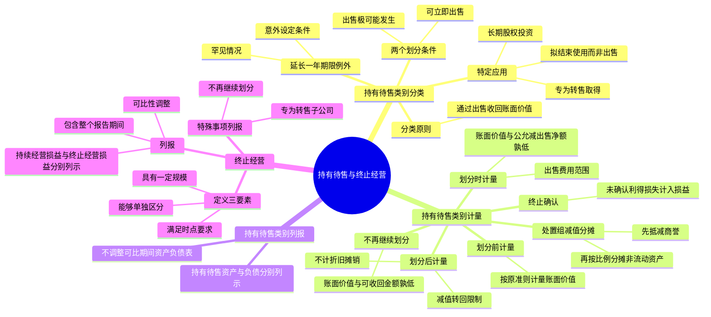

## 1. 章节定位

| 项目 | 信息 |
|------|------|
| 所属科目 | 会计 |
| 难度等级 | 3 |
| 历年分值 | 2-4 分 |
| 建议学时 | 3-5 小时 |
| 知识关联章节 | 第4章 固定资产（停止折旧）、第8章 资产减值（减值测试）、第13章 金融工具（处置组中金融资产）、第19章 所得税（递延所得税）、第27章 资产负债表日后事项 |

## 2. 考情分析

本章是会计科目的中低频考点章节，历年分值约 2-4 分，常以客观题或主观题中的独立小问形式出现，主观题多与资产减值、合并财务报表、长期股权投资等章节联动考查。

**命题规律**：本章考点相对集中，客观题主要考查持有待售类别的划分条件、终止经营的定义判断；主观题常以业务情境为载体，要求考生完成持有待售资产或处置组的初始计量、后续计量及减值处理。

**高频考点分布**：

1. **持有待售类别的分类**：分类原则（通过出售而非持续使用收回账面价值）、两个划分条件（可立即出售、出售极可能发生）、延长一年期限的例外条款、不再继续符合划分条件的处理。
2. **特定情况的分类应用**：专为转售取得的非流动资产、持有待售的长期股权投资（丧失控制权整体划分）、拟结束使用而非出售的非流动资产。
3. **持有待售类别的计量**：划分前计量（按原准则计量）、划分时计量（账面价值与公允价值减出售费用净额孰低）、划分后计量（减值转回限制）、终止确认。
4. **处置组的减值处理**：减值损失先抵减商誉，再按比例分摊至非流动资产；转回时已抵减的商誉不得转回。
5. **终止经营的定义**：能够单独区分的组成部分、具有一定规模、满足时点要求（已处置或划分为持有待售）。
6. **终止经营的列报**：持续经营损益与终止经营损益分别列示、可比性调整、终止经营损益包含整个报告期间。

**联动考查方式**：与长期股权投资结合（丧失控制权时整体划分为持有待售）、与合并财务报表结合（子公司全部资产负债划分为持有待售）、与资产减值结合（处置组减值分摊）。

**备考建议**：
- 牢记持有待售类别划分的"两个条件"：可立即出售 + 出售极可能发生；
- 区分"持有待售"与"终止经营"：前者是计量类别，后者是列报概念；
- 掌握处置组减值损失的分摊顺序：先商誉，再按比例分摊至非流动资产；
- 注意减值转回的限制：划分为持有待售类别前确认的减值损失不得转回，已抵减的商誉不得转回。

## 3. 知识框架

## 4. 核心精讲

### 4.1 持有待售类别的分类

#### 4.1.1 分类原则

企业主要通过**出售而非持续使用**一项非流动资产或处置组收回其账面价值的，应当将其划分为持有待售类别。

**处置组**，是指在一项交易中作为整体通过出售或其他方式一并处置的一组资产，以及在该交易中转让的与这些资产直接相关的负债。处置组中可能包含企业的任何资产和负债，如流动资产、流动负债、非流动资产和非流动负债。处置组也可能包含分摊的商誉。

**特殊说明**：对于符合持有待售类别划分条件但仍在使用的非流动资产或处置组，由于通过使用收回的价值相对于通过出售收回的价值微不足道，企业不应当因其仍在产生零星收入而不将其划分为持有待售类别。

#### 4.1.2 持有待售类别的划分条件

非流动资产或处置组划分为持有待售类别，应当**同时满足**两个条件：

**（1）可立即出售**：根据类似交易中出售此类资产或处置组的惯例，在当前状况下即可立即出售。企业应当具有在当前状态下出售该非流动资产或处置组的意图和能力，并在出售前做好相关准备（如允许买方进行尽职调查等）。

此处"出售"包括具有商业实质的非货币性资产交换，以及以非流动资产或处置组作为换出资产进行债务重组的情形。

**（2）出售极可能发生**：企业已经就一项出售计划作出决议且获得确定的购买承诺，预计出售将在**一年内**完成。有关规定要求企业相关权力机构或者监管部门批准后方可出售的，应当已经获得批准。

"出售极可能发生"包含三层含义：①企业出售决议一般需要由相应级别的管理层作出（如需批准应已获得批准）；②企业已经获得**确定的购买承诺**（具有法律约束力的购买协议，包含交易价格、时间和足够严厉的违约惩罚等条款）；③预计自划分为持有待售类别起一年内，出售交易能够完成。

#### 4.1.3 延长一年期限的例外条款

如果涉及的出售是**关联方交易**，不允许放松一年期限条件。如果涉及的出售**不是关联方交易**，且有充分证据表明企业仍然承诺出售非流动资产或处置组，允许放松一年期限条件。企业无法控制的原因包括：

**（1）意外设定条件**：买方或其他方意外设定导致出售延期的条件，企业针对这些条件已经及时采取行动，且预计能够自设定导致出售延期的条件起一年内顺利化解延期因素。

**（2）发生罕见情况**：因发生罕见情况（如不可抗力、宏观经济形势急剧变化等不可控情况），导致持有待售的非流动资产或处置组未能在一年内完成出售，企业在最初一年内已经针对这些新情况采取必要措施且重新满足了持有待售类别的划分条件。

#### 4.1.4 不再继续符合划分条件的处理

持有待售的非流动资产或处置组不再继续满足持有待售类别划分条件的，企业不应当继续将其划分为持有待售类别。部分资产或负债从持有待售的处置组中移除后，如果处置组中剩余资产或负债新组成的处置组仍然满足持有待售类别划分条件，企业应当将新组成的处置组划分为持有待售类别，否则应当将满足划分条件的非流动资产单独划分为持有待售类别。

#### 4.1.5 特定持有待售类别分类的具体应用

**（1）专为转售而取得的非流动资产或处置组**

对于企业专为转售而新取得的非流动资产或处置组，如果在取得日满足"预计出售将在一年内完成"的条件，且短期（通常为3个月）内很可能满足划分为持有待售类别的其他条件，企业应当在取得日将其划分为持有待售类别。

**（2）持有待售的长期股权投资**

- **不丧失控制权的出售**：企业出售对子公司投资但并不丧失控制权的，不应当将拟出售的部分投资或投资整体划分为持有待售类别。
- **丧失控制权的出售**：企业因出售对子公司的投资等原因导致丧失控制权的，应当在拟出售的部分投资满足划分条件时，在母公司个别财务报表中将对子公司投资**整体**划分为持有待售类别（而非仅将拟处置部分划分）；在合并财务报表中将子公司所有资产和负债划分为持有待售类别。
- **对联营企业或合营企业的投资**：全部或部分分类为持有待售资产的，应当停止权益法核算；对于未划分为持有待售资产的剩余权益性投资，在划分为持有待售的部分出售前继续采用权益法核算。原权益法核算的相关其他综合收益等应当在持有待售资产终止确认时按处置规定处理。

**（3）拟结束使用而非出售的非流动资产或处置组**

企业不应当将拟结束使用而非出售的非流动资产或处置组划分为持有待售类别。原因在于企业对该资产或处置组的使用实质上几乎贯穿了其整个经济使用寿命期，账面价值并非主要通过出售收回。对于暂时停止使用的非流动资产，不应当认为其拟结束使用，也不应当划分为持有待售类别。

对于拟结束使用而非出售的处置组，在停止使用前不应当划分为持有待售类别，也不应当作为终止经营列报；在停止使用后，不应当划分为持有待售类别，如果满足终止经营中有关单独区分的组成部分的条件，应当作为终止经营列报。

### 4.2 持有待售类别的计量

#### 4.2.1 计量的适用范围

对于持有待售的非流动资产的计量，应当区分不同情况：

| 资产类型 | 适用准则 |
|---------|---------|
| 采用公允价值模式后续计量的投资性房地产 | 投资性房地产准则 |
| 采用公允价值减出售费用净额计量的生物资产 | 生物资产准则 |
| 职工薪酬形成的资产 | 职工薪酬准则 |
| 递延所得税资产 | 所得税准则 |
| 金融工具准则规范的金融资产 | 金融工具准则 |
| 保险合同产生的权利 | 保险合同准则 |
| 其他持有待售的非流动资产 | 本章规定 |

对于持有待售的处置组，只要处置组中包含了适用本章计量规定的非流动资产，就应当采用本章方法计量整个处置组。处置组中的流动资产、适用其他准则的非流动资产和所有负债的计量适用相关会计准则。

#### 4.2.2 划分为持有待售类别前的计量

企业将非流动资产或处置组首次划分为持有待售类别前，应当按照相关会计准则规定计量各项资产和负债的账面价值。例如，按照固定资产准则计提折旧，按照无形资产准则进行摊销。对于拟出售的非流动资产或处置组，企业应当在划分为持有待售类别前考虑进行减值测试。

#### 4.2.3 划分为持有待售类别时的计量

**初始计量原则**：比较账面价值与公允价值减去出售费用后的净额，以两者孰低计量。

- 如果账面价值**低于**公允价值减去出售费用后的净额，不需要调整账面价值；
- 如果账面价值**高于**公允价值减去出售费用后的净额，应当将账面价值减记至公允价值减去出售费用后的净额，减记的金额确认为**资产减值损失**，计入当期损益，同时计提持有待售资产减值准备。

**公允价值的确定**：如果企业已经获得确定的购买承诺，应当参考交易价格确定公允价值（考虑可变对价、重大融资成分、非现金对价、应付客户对价等因素）；如果尚未获得确定的购买承诺，应当对公允价值作出估计，优先使用市场报价等可观察输入值。

**出售费用**是企业发生的可以直接归属于出售资产或处置组的**增量费用**，直接由出售引起且是出售所必需的。出售费用包括为出售发生的特定法律服务、评估咨询等中介费用，以及相关的消费税、城市维护建设税、土地增值税和印花税等，但**不包括财务费用和所得税费用**。

**特殊情况**：公允价值减去出售费用后的净额可能为负值，持有待售的非流动资产或处置组中资产的账面价值应当以减记至零为限。是否需要确认相关预计负债，应当按照或有事项准则处理。

**专为转售取得的非流动资产或处置组的初始计量**：比较假定不划分为持有待售类别情况下的初始计量金额和公允价值减去出售费用后的净额，以两者孰低计量。在合并报表中，非同一控制下企业合并中新取得的划分为持有待售的非流动资产或处置组，应当按照公允价值减去出售费用后的净额进行初始计量；同一控制下企业合并中的，应当按照合并日账面价值与公允价值减去出售费用后的净额孰低计量。

#### 4.2.4 划分为持有待售类别后的计量

**（一）持有待售的非流动资产的后续计量**

企业在资产负债表日重新计量时，如果账面价值高于公允价值减去出售费用后的净额，应当将账面价值减记至该净额，减记的金额确认为资产减值损失，计提持有待售资产减值准备。

如果后续资产负债表日公允价值减去出售费用后的净额**增加**，以前减记的金额应当予以恢复，并在划分为持有待售类别后非流动资产确认的资产减值损失金额内转回，转回金额计入当期损益。**划分为持有待售类别前确认的资产减值损失不得转回**。

持有待售的非流动资产**不计提折旧或摊销**。

**（二）持有待售的处置组的后续计量**

企业在资产负债表日重新计量持有待售的处置组时，应当首先按照相关会计准则规定计量处置组中不适用本章计量规定的资产和负债的账面价值（如金融工具、投资性房地产等）。然后比较处置组整体账面价值与公允价值减去出售费用后的净额，账面价值高于该净额的，将账面价值减记至该净额，确认资产减值损失。

**减值损失的分摊**：如果处置组包含商誉，应当**先抵减商誉的账面价值**，再根据处置组中适用本章计量规定的各项非流动资产账面价值所占比重，按比例抵减其账面价值。确认的资产减值损失金额应当以适用本章计量规定的各项资产的账面价值为限，不应分摊至处置组中不适用本章计量规定的其他资产。

**减值损失转回的限制**：已抵减的商誉账面价值，以及划分为持有待售类别前适用本章计量规定的非流动资产已计提的资产减值准备**不得转回**。减值损失后续转回金额应当根据处置组中除商誉外适用本章计量规定的各项非流动资产账面价值所占比重，按比例增加其账面价值。

持有待售的处置组中的非流动资产不计提折旧或摊销；处置组中的负债和不适用本章计量规定的金融资产、以公允价值计量的投资性房地产等的利息或租金收入、支出以及其他费用应当继续予以确认。

#### 4.2.5 不再继续划分为持有待售类别的计量

非流动资产或处置组因不再满足划分条件而不再继续划分为持有待售类别，或非流动资产从持有待售的处置组中移除时，应当按照以下两者**孰低**计量：
1. 划分为持有待售类别前的账面价值，按照假定不划分为持有待售类别情况下本应确认的折旧、摊销或减值等进行调整后的金额；
2. 可收回金额。

由此产生的差额计入当期损益（通过"资产减值损失"科目处理）。

#### 4.2.6 终止确认

企业终止确认持有待售的非流动资产或处置组，应当将尚未确认的利得或损失计入当期损益。处置持有待售的境外经营时，应当将与该境外经营相关的外币财务报表折算差额自其他综合收益转入处置当期损益。

### 4.3 持有待售类别的列报

持有待售资产和负债**不应当相互抵销**。"持有待售资产"和"持有待售负债"应当分别作为流动资产和流动负债列示。

对于当期首次满足持有待售类别划分条件的非流动资产或处置组，**不应当调整可比会计期间资产负债表**。企业还应当在附注中披露有关持有待售的非流动资产或处置组的相关信息。

非流动资产或处置组在资产负债表日至财务报告批准报出日之间满足持有待售类别划分条件的，应当作为资产负债表日后**非调整事项**进行会计处理。

### 4.4 终止经营

#### 4.4.1 终止经营的定义

**终止经营**，是指企业满足下列条件之一的、能够单独区分的组成部分，且该组成部分已经处置或划分为持有待售类别：

1. 该组成部分代表一项**独立的主要业务**或一个**单独的主要经营地区**；
2. 该组成部分是拟对一项独立的主要业务或一个单独的主要经营地区进行处置的一项**相关联计划**的一部分；
3. 该组成部分是**专为转售而取得的子公司**。

终止经营的定义包含以下三方面含义：

**（1）能够单独区分的组成部分**：该组成部分的经营和现金流量在企业经营和编制财务报表时能够与企业的其他部分清楚区分。可能是企业的子公司、事业部或事业群。

**（2）具有一定的规模**：终止经营应当代表一项独立的主要业务或一个单独的主要经营地区，或者是对其进行处置的相关联计划的一部分。并非所有处置组都符合规模条件。专为转售而取得的子公司不要求具有一定规模。

**（3）满足一定的时点要求**：符合终止经营定义的组成部分应当属于以下情况之一：①在资产负债表日之前已经**处置**（包括已经出售和结束使用）；②在资产负债表日之前已经**划分为持有待售类别**。

#### 4.4.2 终止经营的列报

企业应当在利润表中分别列示**持续经营损益**和**终止经营损益**。

**作为持续经营损益列报的情形**（不符合终止经营定义的持有待售资产或处置组的相关损益）：
1. 初始计量或重新计量时，因账面价值高于公允价值减去出售费用后的净额而确认的资产减值损失；
2. 后续公允价值减去出售费用后的净额增加，因恢复以前减记金额而转回的资产减值损失；
3. 持有待售的非流动资产或处置组的处置损益。

**作为终止经营损益列报的内容**：
1. 终止经营的经营活动损益（收入、成本和费用等）；
2. 初始计量或重新计量符合终止经营定义的持有待售处置组时，因账面价值高于公允价值减去出售费用后的净额而确认的资产减值损失；
3. 后续公允价值减去出售费用后的净额增加，因恢复以前减记金额而转回的资产减值损失；
4. 终止经营的处置损益；
5. 终止经营处置损益的调整金额（最终确定处置条款、消除不确定性、履行职工薪酬支付义务等）。

**列报要求**：
- 列报的终止经营损益应当包含**整个报告期间**，而不仅包含认定为终止经营后的报告期间；
- 企业在处置终止经营过程中产生的增量费用应当作为终止经营损益列报；
- 对于当期列报的终止经营，应当在当期财务报表中，将原来作为持续经营损益列报的信息重新作为可比会计期间的终止经营损益列报（保证可比性）；
- 终止经营不再满足持有待售类别划分条件的，应当在当期财务报表中，将原来作为终止经营损益列报的信息重新作为可比会计期间的持续经营损益列报。

### 4.5 特殊事项的列报

**（一）企业专为转售而取得的持有待售子公司的列报**

如果企业专为转售而取得的子公司符合持有待售类别的划分条件，应当按照持有待售的处置组和终止经营的有关规定进行列报，资产负债表列示和附注披露都得到适当简化。除非企业是投资性主体并按公允价值计量，否则应当按照合并财务报表准则将该子公司纳入合并范围。在合并资产负债表中，全部资产和负债应当分别作为持有待售资产和持有待售负债项目列示。在合并利润表中，将该子公司净利润与其他终止经营净利润合并列示在"终止经营净利润"项目中。

**（二）不再继续划分为持有待售类别的列报**

对于非流动资产或处置组不再继续划分为持有待售类别或从处置组中移除的，在资产负债表中应当重新作为固定资产、无形资产等列报，并调整其账面价值。在当期利润表中，账面价值调整金额作为持续经营损益列报。

持有待售的对联营企业或合营企业的权益性投资不再符合划分条件的，应当自划分为持有待售类别日起采用权益法进行追溯调整。持有待售的对子公司、共同经营的权益性投资不再符合划分条件的，同样应当自划分为持有待售类别日起追溯调整。

## 5. 典型例题

**【例题 1】（持有待售类别的划分条件判断）**

企业G在X市区繁华地段拥有一栋办公大楼，因发展战略改变，计划整体搬迁至Y市。企业G与企业H签订了办公大楼转让合同。

情形一：企业G将在腾空办公大楼后将其交付给企业H，且腾空所需时间是正常且符合交易惯例的。
情形二：企业G将在Y市兴建的新办公大楼竣工并装修完成前继续使用现有办公大楼，竣工并装修完成后将X市办公大楼交付企业H。

要求：分别判断两种情形下办公大楼是否符合持有待售类别的划分条件。

**答案**：

情形一：符合。在出售建筑物前将其腾空属于出售此类资产的惯例，且腾空只占用常规所需时间，因此即使办公大楼当前尚未腾空，也不影响其满足"在当前状况下即可立即出售"的条件。

情形二：不符合。"在新办公大楼竣工并装修完成前继续使用现有办公大楼"的条件不属于类似交易中出售此类资产的惯例，使得办公大楼在当前状况下不能立即出售，不符合持有待售类别的划分条件。

**解析**：可立即出售要求根据类似交易中出售此类资产的惯例，在当前状况下即可立即出售。如果出售前的准备工作属于交易惯例且时间合理，不影响划分；如果附加了非惯例的条件导致当前不能立即出售，则不符合划分条件。

**【例题 2】（持有待售非流动资产的初始计量）**

2×25年1月31日，企业A与企业B签署不动产转让协议，拟在6个月内将仓库转让。仓库原价120万元，年折旧额12万元，至2×24年12月31日已计提折旧60万元。假定该不动产满足划分为持有待售类别的其他条件，且不动产价值未发生减值。

要求：计算划分为持有待售类别前仓库的账面价值，并说明是否需要计提1月份折旧。

**答案**：

2×25年1月31日，企业A应当将仓库资产划分为持有待售类别，并按照固定资产准则对该固定资产计提1月份折旧1万元。

划分为持有待售类别前的账面价值 = 120 − 60 − 1 = **59（万元）**

此后不再计提折旧。

**解析**：企业在划分为持有待售类别前，应当按照原准则计量账面价值，即继续计提折旧至划分日。划分为持有待售类别后，持有待售的非流动资产不计提折旧或摊销。

**【例题 3】（持有待售处置组的减值分摊）**

企业A拥有一个销售门店，2×25年6月15日与企业B签订转让协议，将门店资产和相关负债整体转让。假设该处置组不构成一项业务，满足划分为持有待售类别的条件。2×25年6月15日，处置组各项资产和负债的账面价值如下（单位：元）：库存现金310 000、应收账款260 000、库存商品200 000、其他债权投资360 000、固定资产1 020 000、无形资产930 000、商誉200 000；应付账款310 000、应付职工薪酬560 000、预计负债250 000。处置组整体公允价值为1 900 000元，预计出售费用70 000元。

要求：计算处置组应确认的持有待售资产减值损失，并说明减值损失的分摊方法。

**答案**：

处置组账面价值 = 3 280 000 − 1 120 000 = 2 160 000（元）

公允价值减去出售费用后的净额 = 1 900 000 − 70 000 = 1 830 000（元）

应确认的持有待售资产减值损失 = 2 160 000 − 1 830 000 = **330 000（元）**

**减值损失的分摊**：
1. 先抵减商誉账面价值：200 000（元）；
2. 剩余金额 = 330 000 − 200 000 = 130 000（元），根据固定资产和无形资产账面价值所占比重按比例分摊：
   - 固定资产分摊 = 130 000 × 1 020 000 ÷ (1 020 000 + 930 000) = **68 000（元）**
   - 无形资产分摊 = 130 000 × 930 000 ÷ (1 020 000 + 930 000) = **62 000（元）**

**解析**：处置组减值损失应先抵减商誉账面价值，再根据适用本章计量规定的各项非流动资产账面价值所占比重按比例分摊。分摊金额以各项资产的账面价值为限，不应分摊至不适用本章计量规定的其他资产（如其他债权投资、存货等）。

**【例题 4】（持有待售资产减值损失的转回）**

承例题3，2×25年6月30日，该门店尚未完成转让。其他债权投资市场报价上升至370 000元（增加10 000元）。企业B在检查时发现资产轻微破损，企业A同意修理，预计修理费用5 000元。律师和注册会计师咨询费预计金额调整至40 000元。当日，门店处置组整体公允价值为1 910 000元。

要求：计算可转回的持有待售资产减值损失金额，并说明转回的限制。

**答案**：

首先计量其他债权投资（按其他准则计量）：借：持有待售资产——其他债权投资 10 000；贷：其他综合收益 10 000。

处置组账面价值 = 1 830 000 + 10 000 = 1 840 000（元）

预计出售费用 = 5 000 + 40 000 = 45 000（元）

公允价值减去出售费用后的净额 = 1 910 000 − 45 000 = 1 865 000（元）

可转回金额 = 1 865 000 − 1 840 000 = **25 000（元）**

**转回的限制**：已抵减的商誉账面价值（200 000元）和划分为持有待售类别前确认的资产减值损失**不得转回**。因此转回金额以原确认的持有待售资产减值损失中抵减固定资产和无形资产的部分（68 000 + 62 000 = 130 000元）为限。

根据固定资产和无形资产账面价值所占比重按比例转回：
- 固定资产转回 = 25 000 × 952 000 ÷ (952 000 + 868 000) = **13 077（元）**
- 无形资产转回 = 25 000 × 868 000 ÷ (952 000 + 868 000) = **11 923（元）**

借：持有待售资产减值准备——固定资产 13 077、无形资产 11 923；贷：资产减值损失 25 000

**解析**：处置组公允价值减去出售费用后的净额后续增加时，可在原确认的持有待售资产减值损失范围内转回，但已抵减的商誉和划分为持有待售类别前的减值损失不得转回。

**【例题 5】（终止经营的判断）**

某快餐企业A在全国拥有500家零售门店，决定将其位于Z市的8家零售门店中的一家门店C出售，并于2×25年8月13日与企业B正式签订了转让协议，假设门店C符合持有待售类别的划分条件。

要求：判断门店C是否构成企业A的终止经营。

**答案**：

门店C**不构成**企业A的终止经营。

尽管门店C是一个处置组，也符合持有待售类别的划分条件，但由于它只是一个零售点，不能代表一项独立的主要业务或一个单独的主要经营地区，也不构成拟对一项独立的主要业务或一个单独的主要经营地区进行处置的一项相关联计划的一部分，因此该处置组并不构成企业的终止经营。

**解析**：终止经营应当具有一定的规模，代表一项独立的主要业务或一个单独的主要经营地区。单个零售门店通常不满足规模条件，即使符合持有待售类别划分条件，也不构成终止经营。

## 6. 记忆口诀

**持有待售两条件**：可立即出售、出售极可能发生（一年内完成）。

**延长一年两例外**：意外设定条件、发生罕见情况（关联方交易不允许延长）。

**计量原则**：账面价值与公允减出售费用净额孰低。

**出售费用范围**：增量费用（律师费、评估费、税费），不含财务费用和所得税费用。

**处置组减值分摊顺序**：先商誉，再按比例分摊至非流动资产（以账面价值为限）。

**减值转回限制**：划分前的减值损失不得转回，已抵减的商誉不得转回。

**持有待售不计折旧摊销**：非流动资产划分后停止折旧和摊销。

**终止经营三要素**：单独区分、具有规模、满足时点（已处置或划分为持有待售）。

**终止经营损益列报**：包含整个报告期间，可比性追溯调整。

**持续经营 vs 终止经营**：不符合终止经营的持有待售损益列入持续经营损益。
