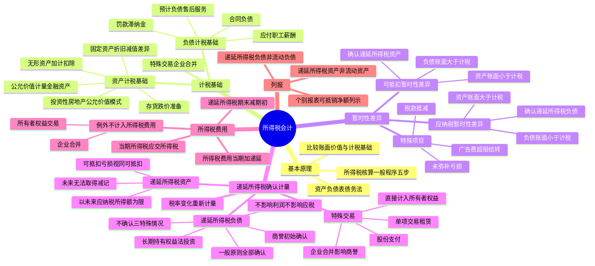

## 📍 章节定位

| 项目 | 信息 |
|------|------|
| **所属科目** | 📒 会计 |
| **难度等级** | ⭐⭐⭐⭐ |
| **历年分值** | 6-8分 |
| **建议学时** | 8-10h |

## 📝 考情分析

本章是会计科目的核心重难点章节，历年分值约 6-8 分，以计算分析题和综合题形式考查，常结合固定资产、无形资产、金融资产、收入、企业合并、合并财务报表等章节出题。命题热点集中在：

1. **资产、负债的计税基础**：固定资产（折旧方法、折旧年限、减值准备差异）、无形资产（内部研发加计扣除、使用寿命不确定的无形资产）、以公允价值计量的金融资产、投资性房地产（公允价值模式）、存货跌价准备、预计负债（售后服务）、合同负债、应付职工薪酬、罚款和滞纳金等计税基础的确定。
2. **暂时性差异**：应纳税暂时性差异（资产账面价值 > 计税基础，或负债账面价值 < 计税基础）与可抵扣暂时性差异（资产账面价值 < 计税基础，或负债账面价值 > 计税基础）的区分；未弥补亏损和税款抵减视同可抵扣暂时性差异；广告费和业务宣传费超过当年销售收入 15% 的部分。
3. **递延所得税负债的确认**：一般原则（所有应纳税暂时性差异均应确认，体现谨慎性）；不确认的三种特殊情况（商誉初始确认、既不影响会计利润也不影响应纳税所得额的其他交易、长期持有的权益法投资）。
4. **递延所得税资产的确认**：以未来期间可能取得的应纳税所得额为限；未来期间很可能无法取得足够应纳税所得额时应减记；可抵扣亏损和税款抵减的处理。
5. **所得税费用的计算**：当期所得税（应交所得税 = 应纳税所得额 × 适用税率）、递延所得税（递延所得税负债/资产的期末余额减期初余额）、所得税费用 = 当期所得税 + 递延所得税。
6. **特殊交易或事项**：与直接计入所有者权益的交易或事项相关的所得税（计入所有者权益，不影响所得税费用）、与企业合并相关的递延所得税（影响商誉或当期损益）、与股份支付相关的递延所得税、单项交易的递延所得税（租赁负债和使用权资产同时确认等额递延所得税）。

考生需重点掌握：所得税会计采用**资产负债表债务法**，核心是比较资产、负债的账面价值与计税基础；资产账面价值 > 计税基础产生**应纳税暂时性差异**，确认**递延所得税负债**；资产账面价值 < 计税基础产生**可抵扣暂时性差异**，确认**递延所得税资产**；负债的暂时性差异方向与资产相反；不确认递延所得税负债的三种特殊情况（商誉初始确认、不影响会计利润和应纳税所得额的其他交易、长期持有的权益法投资满足两个条件）；递延所得税资产以未来期间可能取得的应纳税所得额为限确认；所得税费用 = 当期所得税 + 递延所得税，但计入所有者权益的交易或事项和企业合并产生的递延所得税不计入所得税费用。

## 🧠 知识框架



## 📖 核心精讲

### 一、所得税会计的基本原理

我国所得税会计采用了**资产负债表债务法**，要求企业从资产负债表出发，通过比较资产负债表上列示的资产、负债按照会计准则规定确定的**账面价值**与按照税法规定确定的**计税基础**，对于两者之间的差异分别应纳税暂时性差异与可抵扣暂时性差异，确认相关的递延所得税负债与递延所得税资产，在综合考虑当期应交所得税的基础上，确定每一会计期间利润表中的所得税费用。

**所得税会计核算的一般程序**：

1. 按照相关会计准则规定确定资产负债表中除递延所得税资产和递延所得税负债以外的其他资产和负债项目的**账面价值**；
2. 按照适用的税收法规，确定资产负债表中有关资产、负债项目的**计税基础**；
3. 比较资产、负债的账面价值与其计税基础，对于两者之间存在差异的，分析其性质，分别应纳税暂时性差异与可抵扣暂时性差异，确定递延所得税负债和递延所得税资产的应有金额（**递延所得税**）；
4. 按照适用的税法规定计算确定当期应纳税所得额，计算当期应交所得税（**当期所得税**）；
5. 确定利润表中的所得税费用 = 当期所得税 + 递延所得税。

### 二、资产、负债的计税基础

#### （一）资产的计税基础

**资产的计税基础**是指企业收回资产账面价值过程中，计算应纳税所得额时按照税法规定可以自应税经济利益中抵扣的金额。资产在初始确认时，其计税基础一般为取得成本。

| 资产类型 | 差异产生原因 | 举例 |
|---------|------------|------|
| **固定资产** | 折旧方法、折旧年限、减值准备 | 会计用双倍余额递减法，税法用直线法；会计折旧年限 5 年，税法 10 年；计提减值准备税法不认可 |
| **无形资产（内部研发）** | 加计扣除 | 形成无形资产的，按成本的 200% 摊销，产生暂时性差异但初始确认时不确认所得税影响 |
| **无形资产（使用寿命不确定）** | 会计不摊销，税法摊销 | 会计账面价值为成本，计税基础为成本减去已摊销额 |
| **以公允价值计量的金融资产** | 公允价值变动 | 会计按公允价值计量，税法维持原取得成本 |
| **投资性房地产（公允价值模式）** | 公允价值变动 | 会计按公允价值，税法按成本减折旧 |
| **计提减值准备的资产** | 减值准备税法不认可 | 存货跌价准备、坏账准备等 |

**内部研发无形资产的特殊规定**：对于研究开发费用的加计扣除，未形成无形资产计入当期损益的，按照研究开发费用的 100% 加计扣除；形成无形资产的，按照无形资产成本的 200% 摊销。由此产生的暂时性差异，如果该无形资产并非产生于企业合并，且初始确认时既不影响会计利润也不影响应纳税所得额，则**不确认**该暂时性差异的所得税影响。

#### （二）负债的计税基础

**负债的计税基础** = 账面价值 − 未来期间计算应纳税所得额时按照税法规定可予税前扣除的金额。

| 负债类型 | 计税基础 | 暂时性差异 |
|---------|---------|----------|
| **预计负债（售后服务）** | 0（税法规定实际发生时扣除） | 账面价值 > 计税基础，产生可抵扣暂时性差异 |
| **合同负债** | 一般等于账面价值（税法与会计同时确认收入）；若税法规定预收款计入当期应纳税所得额，则计税基础为 0 | 视税法规定而定 |
| **应付职工薪酬** | 等于账面价值（超过税前扣除标准的部分未来也不允许扣除，为永久性差异） | 不形成暂时性差异 |
| **罚款和滞纳金** | 等于账面价值（税法不允许税前扣除） | 不形成暂时性差异 |

### 三、暂时性差异

**暂时性差异**是指资产、负债的账面价值与其计税基础不同产生的差额。

#### （一）应纳税暂时性差异

**应纳税暂时性差异**是指在确定未来收回资产或清偿负债期间的应纳税所得额时，将导致产生应税金额的暂时性差异，在其产生当期应当确认相关的**递延所得税负债**。

产生情况：
1. **资产的账面价值 > 其计税基础**：未来期间产生的经济利益不能全部税前抵扣，差额需要交税。
2. **负债的账面价值 < 其计税基础**：意味着未来期间可以税前抵扣的金额为负数，应调增未来期间应纳税所得额。

#### （二）可抵扣暂时性差异

**可抵扣暂时性差异**是指在确定未来收回资产或清偿负债期间的应纳税所得额时，将导致产生可抵扣金额的暂时性差异，符合确认条件时应当确认相关的**递延所得税资产**。

产生情况：
1. **资产的账面价值 < 其计税基础**：未来期间允许税前扣除的金额多，减少未来期间应纳税所得额。
2. **负债的账面价值 > 其计税基础**：未来期间可以税前扣除的金额为正数，减少未来期间应纳税所得额。

#### （三）特殊项目产生的暂时性差异

1. **未作为资产、负债确认的项目**：某些交易或事项发生后，未体现为资产负债表中的资产或负债，但按照税法规定能够确定其计税基础的，其账面价值零与计税基础之间的差异也构成暂时性差异。如广告费和业务宣传费超过当年销售收入 15% 的部分准予在以后纳税年度结转扣除。

2. **可抵扣亏损及税款抵减**：按照税法规定可以结转以后年度的未弥补亏损及税款抵减，视同可抵扣暂时性差异处理。在预计未来期间能够产生足够的应纳税所得额弥补该亏损时，应确认相关的递延所得税资产。

### 四、递延所得税资产及负债的确认和计量

#### （一）递延所得税负债的确认和计量

**1. 确认的一般原则**

除准则中明确规定可不确认递延所得税负债的情况以外，企业对于所有的应纳税暂时性差异均应确认相关的递延所得税负债。除与直接计入所有者权益的交易或事项以及企业合并相关的以外，在确认递延所得税负债的同时，增加利润表中的所得税费用。

**2. 不确认递延所得税负债的特殊情况**

| 情况 | 说明 |
|------|------|
| **商誉的初始确认** | 非同一控制下企业合并中，免税合并时商誉的计税基础为 0，账面价值与计税基础形成应纳税暂时性差异，但不确认递延所得税负债 |
| **既不影响会计利润也不影响应纳税所得额的其他交易** | 交易发生时既不影响会计利润也不影响应纳税所得额，所产生的资产、负债初始确认金额与计税基础不同形成应纳税暂时性差异的，不确认递延所得税负债（避免违背历史成本原则） |
| **长期持有的权益法投资** | 同时满足两个条件不确认：①投资企业能够控制暂时性差异转回的时间；②该暂时性差异在可预见的未来很可能不会转回。准备长期持有的权益法投资，因初始投资成本调整、确认投资损益（居民企业间股息免税）、确认其他权益变动产生的暂时性差异，一般不确认所得税影响 |

**3. 计量**

按照预期收回该资产或清偿该负债期间的**适用税率**计量。无论应纳税暂时性差异何时转回，相关的递延所得税负债**不要求折现**。

#### （二）递延所得税资产的确认和计量

**1. 确认的一般原则**

递延所得税资产产生于可抵扣暂时性差异，应以**未来期间可能取得的应纳税所得额为限**确认。在可抵扣暂时性差异预期转回的未来期间内，企业无法产生足够的应纳税所得额用以利用可抵扣暂时性差异的影响时，不应确认递延所得税资产。

判断未来期间是否能够产生足够的应纳税所得额时，应考虑：①企业在未来期间通过正常的生产经营活动能够实现的应纳税所得额；②以前期间产生的应纳税暂时性差异在未来期间转回时将增加的应纳税所得额。

**不确认递延所得税资产的情况**：企业发生的某项交易或事项不属于企业合并，并且交易发生时既不影响会计利润也不影响应纳税所得额，且该项交易中产生的资产、负债的初始确认金额与其计税基础不同，产生可抵扣暂时性差异的，不确认相应的递延所得税资产。

**2. 计量与复核**

按照预期收回该资产期间的适用所得税税率计算确定，**不要求折现**。资产负债表日应当对递延所得税资产的账面价值进行复核，如果未来期间很可能无法取得足够的应纳税所得额，应当减记递延所得税资产的账面价值（计入当期所得税费用，原确认时计入所有者权益的除外）。以后期间能够产生足够应纳税所得额时，相应恢复。

#### （三）特殊交易或事项中涉及递延所得税的确认

| 交易类型 | 所得税影响计入 |
|---------|-------------|
| **直接计入所有者权益的交易或事项**（其他综合收益、资本公积等） | 计入**所有者权益**，不影响所得税费用 |
| **企业合并**（购买日取得的可抵扣暂时性差异） | 购买日后 12 个月内确认的（购买日已存在的情况），冲减**商誉**；其他情况计入**当期损益** |
| **股份支付** | 等待期内确认成本费用产生的递延所得税资产，对应计入**所得税费用**；超过成本费用部分的递延所得税资产计入**所有者权益（资本公积）** |
| **单项交易**（租赁负债和使用权资产初始确认、弃置义务确认预计负债并计入资产成本） | 不适用豁免规定，应分别确认递延所得税负债和递延所得税资产 |

#### （四）适用税率变化的影响

税率变化时，应对原已确认的递延所得税资产及递延所得税负债按照**新的税率**进行重新计量。除直接计入所有者权益的交易或事项产生的调整金额计入所有者权益外，其他因税率变化产生的调整金额确认为税率变化当期的所得税费用（或收益）。

### 五、所得税费用的确认和计量

利润表中的所得税费用包括**当期所得税**和**递延所得税**两个部分。

#### （一）当期所得税

**当期所得税** = 应纳税所得额 × 适用所得税税率

> 应纳税所得额 = 会计利润 + 计入利润表但计税时不允许税前扣除的费用 ± 计入利润表的费用与按照税法规定可予税前抵扣的金额之间的差额 ± 计入利润表的收入与按照税法规定应计入应纳税所得额的收入之间的差额 − 税法规定的不征税收入 ± 其他需要调整的因素

#### （二）递延所得税

**递延所得税** = （递延所得税负债的期末余额 − 递延所得税负债的期初余额）−（递延所得税资产的期末余额 − 递延所得税资产的期初余额）

**注意**：递延所得税公式中不包括计入所有者权益的交易或事项的所得税影响和企业合并产生的所得税影响。

#### （三）所得税费用

> **所得税费用 = 当期所得税 + 递延所得税**

**不计入所得税费用的两种情况**：
1. 某项交易或事项按照会计准则规定应计入所有者权益的，其产生的递延所得税资产或负债及其变化应计入所有者权益（如其他债权投资公允价值变动产生的递延所得税计入其他综合收益）。
2. 企业合并中取得的资产、负债，其账面价值与计税基础不同确认相关递延所得税的，该递延所得税的确认影响商誉或计入当期损益。

### 六、所得税的列报

- 递延所得税资产和递延所得税负债一般应当分别作为**非流动资产**和**非流动负债**在资产负债表中列示。
- 所得税费用应当在利润表中单独列示。
- 在个别财务报表中，当期所得税资产与当期所得税负债、递延所得税资产及递延所得税负债可以以抵销后的净额列示。
- 在合并财务报表中，一方的所得税资产与另一方的所得税负债一般不能抵销，除非具有以净额结算的法定权利并且意图以净额结算。

## 💡 典型例题

**【例题 1】（基础题，单选题）**

下列关于所得税会计的表述中，正确的是（　　）。
A. 企业应采用应付税款法核算所得税
B. 资产的账面价值大于其计税基础产生可抵扣暂时性差异
C. 负债的账面价值大于其计税基础产生可抵扣暂时性差异
D. 所有的应纳税暂时性差异均应确认递延所得税负债

**答案**：C

**解析**：A 错误，我国所得税会计采用资产负债表债务法；B 错误，资产的账面价值大于其计税基础产生应纳税暂时性差异，确认递延所得税负债；C 正确，负债的账面价值大于其计税基础，意味着未来期间可以税前抵扣的金额为正数，产生可抵扣暂时性差异，确认递延所得税资产；D 错误，商誉初始确认等三种特殊情况不确认递延所得税负债。

**【例题 2】（进阶题，单选题）**

下列各项中，不确认递延所得税负债的是（　　）。
A. 固定资产会计折旧大于税法折旧产生的应纳税暂时性差异
B. 交易性金融资产公允价值上升产生的应纳税暂时性差异
C. 非同一控制下企业合并（免税合并）中确认的商誉
D. 可供出售金融资产公允价值上升产生的应纳税暂时性差异

**答案**：C

**解析**：A、B 均产生应纳税暂时性差异，应确认递延所得税负债；C 正确，非同一控制下免税合并中确认的商誉，其计税基础为 0，账面价值与计税基础的差额形成应纳税暂时性差异，但准则规定不确认相关的递延所得税负债；D 产生应纳税暂时性差异，应确认递延所得税负债，但计入其他综合收益而非所得税费用。

**【例题 3】（计算题，固定资产暂时性差异）**

A 企业于 2×22 年 12 月 20 日取得的某项固定资产，原价为 750 万元，使用年限为 10 年，会计上采用年限平均法计提折旧，净残值为 0。税法规定该类固定资产采用双倍余额递减法计提的折旧可予税前扣除，使用年限及净残值与会计相同。2×24 年 12 月 31 日，企业估计该项固定资产的可收回金额为 550 万元，该固定资产以前期间未计提减值准备。A 企业适用的所得税税率为 25%。

要求：计算 2×24 年 12 月 31 日该项固定资产的账面价值、计税基础及应确认的递延所得税。

**答案**：

（1）2×24 年 12 月 31 日固定资产的账面价值：
- 会计累计折旧 = 750 ÷ 10 × 2 = 150（万元）
- 计提减值前账面价值 = 750 − 150 = 600（万元）
- 可收回金额为 550 万元，应计提减值准备 50 万元
- **账面价值 = 750 − 150 − 50 = 550（万元）**

（2）2×24 年 12 月 31 日固定资产的计税基础：
- 第 1 年税法折旧 = 750 × 20% = 150（万元）
- 第 2 年税法折旧 = (750 − 150) × 20% = 120（万元）
- 累计税法折旧 = 150 + 120 = 270（万元）
- **计税基础 = 750 − 270 = 480（万元）**

（3）暂时性差异及递延所得税：
- 账面价值 550 万元 > 计税基础 480 万元，差额 70 万元为**应纳税暂时性差异**
- 应确认**递延所得税负债 = 70 × 25% = 17.5（万元）**

**解析**：资产账面价值大于计税基础产生应纳税暂时性差异，确认递延所得税负债。注意税法采用双倍余额递减法，折旧基数逐年递减。

**【例题 4】（计算题，预计负债暂时性差异）**

甲企业 2×24 年因销售产品承诺提供 3 年的保修服务，在当年度利润表中确认了 500 万元的营业成本，同时确认为预计负债，当年度未发生任何保修支出。假定按照税法规定，与产品售后服务相关的支出在实际发生时允许税前扣除。甲企业适用的所得税税率为 25%。

要求：计算该项预计负债的计税基础及应确认的递延所得税。

**答案**：

- 预计负债账面价值 = 500（万元）
- 预计负债计税基础 = 账面价值 500 − 未来期间可予税前扣除的金额 500 = **0**
- 账面价值 500 万元 > 计税基础 0，差额 500 万元为**可抵扣暂时性差异**
- 应确认**递延所得税资产 = 500 × 25% = 125（万元）**

**解析**：负债的账面价值大于计税基础产生可抵扣暂时性差异，确认递延所得税资产。预计负债的计税基础为 0，因为税法规定相关支出在实际发生时才允许税前扣除。

**【例题 5】（综合题，所得税费用计算）**

A 公司 2×24 年度利润表中利润总额为 3000 万元，适用的所得税税率为 25%。递延所得税资产及递延所得税负债不存在期初余额。与所得税核算有关的情况如下：
（1）2×24 年 1 月开始计提折旧的一项固定资产，成本为 1500 万元，使用年限为 10 年，净残值为 0，会计处理按双倍余额递减法计提折旧，税收处理按直线法计提折旧。
（2）向关联企业捐赠现金 500 万元，按照税法规定不允许税前扣除。
（3）当期取得作为交易性金融资产核算的股票投资成本为 800 万元，2×24 年 12 月 31 日的公允价值为 1200 万元。
（4）违反环保法规定应支付罚款 250 万元。
（5）期末对持有的存货计提了 75 万元的存货跌价准备。

要求：计算 A 公司 2×24 年度的当期所得税、递延所得税和所得税费用。

**答案**：

（1）当期应交所得税：
- 会计折旧 = 1500 × 20% = 300（万元），税法折旧 = 1500 ÷ 10 = 150（万元），差异 +150
- 关联方捐赠不允许扣除，调增 +500
- 交易性金融资产公允价值变动 400 万元（1200−800），税法不认可，调减 −400
- 罚款不允许扣除，调增 +250
- 存货跌价准备不允许扣除，调增 +75

应纳税所得额 = 3000 + 150 + 500 − 400 + 250 + 75 = 3575（万元）
**当期所得税 = 3575 × 25% = 893.75（万元）**

（2）递延所得税：
- 应纳税暂时性差异：固定资产 150 万元 + 交易性金融资产 400 万元 = 550 万元
  - 递延所得税负债 = 550 × 25% = 137.5（万元）... 注：原题答案为 100，按教材原数据 400×25%
- 可抵扣暂时性差异：存货跌价准备 75 万元 + 预计负债（罚款）250 万元 = 325 万元... 

按教材原数据：
- 递延所得税负债 = 400 × 25% = 100（万元）（交易性金融资产）
- 递延所得税资产 = 225 × 25% = 56.25（万元）（存货 75 + 罚款 150... 按教材 225）
- **递延所得税 = 100 − 56.25 = 43.75（万元）**

（3）所得税费用：
**所得税费用 = 893.75 + 43.75 = 937.50（万元）**

```
借：所得税费用                    9,375,000
    递延所得税资产                  562,500
    贷：应交税费——应交所得税        8,937,500
        递延所得税负债              1,000,000
```

**解析**：所得税费用 = 当期所得税 + 递延所得税。当期所得税按应纳税所得额计算，递延所得税根据暂时性差异的变动确定。固定资产会计折旧大于税法折旧产生应纳税暂时性差异；交易性金融资产公允价值上升产生应纳税暂时性差异；存货跌价准备产生可抵扣暂时性差异；罚款和关联方捐赠为永久性差异，不产生暂时性差异。

**【例题 6】（综合题，其他综合收益的所得税影响）**

甲企业持有的某项以公允价值计量且其变动计入其他综合收益的其他债权投资，成本为 500 万元，会计期末，其公允价值为 600 万元。甲企业适用的所得税税率为 25%。除该事项外，该企业不存在其他会计与税收法规之间的差异，且递延所得税资产和递延所得税负债不存在期初余额。

要求：编制甲企业的相关会计分录。

**答案**：

（1）确认 100 万元的公允价值变动：
```
借：其他债权投资          1,000,000
    贷：其他综合收益        1,000,000
```

（2）确认应纳税暂时性差异的所得税影响：
```
借：其他综合收益            250,000
    贷：递延所得税负债        250,000
```

**解析**：以公允价值计量且其变动计入其他综合收益的金融资产，其公允价值变动产生的递延所得税影响应当计入**其他综合收益**，而不是所得税费用。这是"计入所有者权益的交易或事项的所得税影响不计入所得税费用"的典型应用。

## 🎯 记忆口诀

- **资产负债表债务法**："比较账面与计税，差异分应纳和可抵"——核心是比较账面价值与计税基础，差异分为应纳税暂时性差异和可抵扣暂时性差异。
- **资产差异方向**："资产大应纳确认负债，资产小可抵确认资产"——资产账面价值 > 计税基础产生应纳税暂时性差异，确认递延所得税负债；反之确认递延所得税资产。
- **负债差异方向**："负债大可抵确认资产，负债小应纳确认负债"——负债账面价值 > 计税基础产生可抵扣暂时性差异，确认递延所得税资产；反之确认递延所得税负债。
- **计税基础公式**："资产计税未来可扣，负债计税账面减未来可扣"——资产计税基础 = 未来可税前扣除的金额；负债计税基础 = 账面价值 − 未来可税前扣除的金额。
- **不确认递延所得税负债三情况**："商誉初始、不影响利润和应税、长期持有权益法"——商誉初始确认、既不影响会计利润也不影响应纳税所得额的其他交易、长期持有且满足两条件的权益法投资。
- **递延所得税资产确认限制**："以未来应纳税所得额为限"——确认递延所得税资产应以未来期间可能取得的应纳税所得额为限。
- **所得税费用公式**："当期加递延"——所得税费用 = 当期所得税 + 递延所得税。
- **不计入所得税费用两情况**："所有者权益交易、企业合并"——直接计入所有者权益的交易或事项的所得税影响计入所有者权益；企业合并中确认的递延所得税影响商誉或当期损益。
- **可抵扣亏损**："视同可抵扣暂时性差异"——未弥补亏损和税款抵减视同可抵扣暂时性差异，预计未来能取得足够应纳税所得额时确认递延所得税资产。
- **税率变化**："重新计量调费用"——税率变化时按新税率重新计量递延所得税资产和负债，差额一般计入当期所得税费用。

## ✅ 同步练习

1. （基础题）资产负债表债务法的基本原理，所得税核算的一般程序（五步）。提示：参见《必刷 550 题》第十九章基础题。
2. （进阶题）各类资产计税基础的确定（固定资产、无形资产、金融资产、投资性房地产、存货），各类负债计税基础的确定（预计负债、合同负债、应付职工薪酬、罚款）。提示：参见《必刷 550 题》第十九章进阶题。
3. （易错题）应纳税暂时性差异与可抵扣暂时性差异的区分，不确认递延所得税负债的三种特殊情况（商誉初始确认、不影响利润和应税、长期持有权益法投资）。提示：参见《必刷 550 题》第十九章易错题。
4. （计算题）递延所得税资产和递延所得税负债的确认和计量，递延所得税资产以未来应纳税所得额为限的确认原则。提示：参见《必刷 550 题》第十九章计算题。
5. （真题改编）当期所得税、递延所得税和所得税费用的综合计算，掌握应纳税所得额的调整过程。提示：参见《必刷 550 题》第十九章真题。
6. （综合题）与直接计入所有者权益的交易或事项相关的所得税处理（其他综合收益），与企业合并相关的递延所得税（影响商誉），与股份支付相关的递延所得税。提示：参见历年真题综合题。
7. 综合复习单项交易的递延所得税处理（租赁负债和使用权资产同时确认）、适用税率变化的影响、所得税的列报要求。
