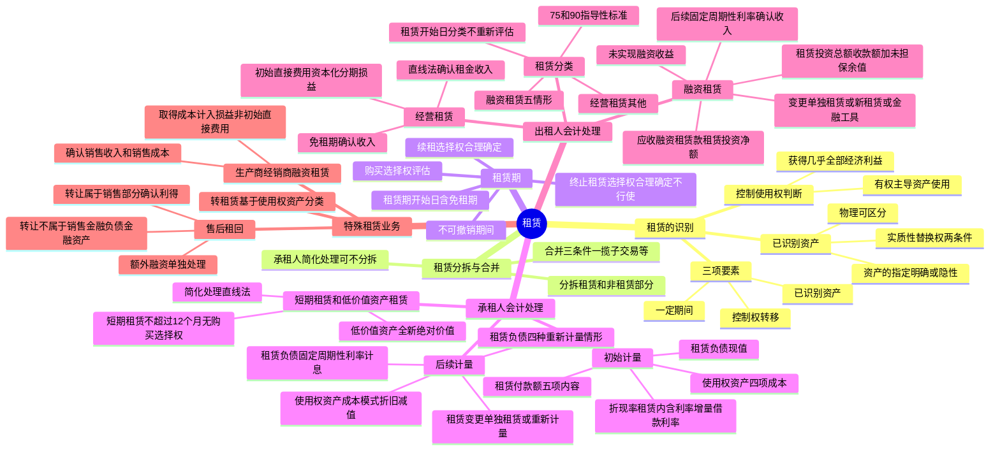

## 📍 章节定位

| 项目 | 信息 |
|------|------|
| **所属科目** | 📒 会计 |
| **难度等级** | ⭐⭐⭐⭐ |
| **历年分值** | 6-8分 |
| **建议学时** | 8-10h |

## 📝 考情分析

本章是会计科目的重要章节，新租赁准则下承租人不再区分经营租赁和融资租赁，大幅增加了承租人的核算内容，历年分值约 6-8 分，常以计算分析题和综合题形式考查，并广泛结合固定资产、收入、差错更正、资产负债表日后事项等章节出题。命题热点集中在：

1. **租赁的识别**：租赁的三项要素（一定期间、已识别资产、资产供应方转移对已识别资产使用权的控制），已识别资产的指定（明确指定和隐性指定）、物理可区分、实质性替换权的判断，客户是否控制已识别资产使用权（获得几乎全部经济利益、有权主导资产使用）。
2. **租赁期**：租赁期开始日的判断（包含免租期）、不可撤销期间的确定、续租选择权和终止租赁选择权的评估（合理确定的判断因素）、购买选择权的评估。
3. **承租人的会计处理**：租赁负债的初始计量（租赁付款额五项内容、折现率的确定——租赁内含利率优先，无法确定时用增量借款利率）、使用权资产的初始计量（四项成本）、租赁负债的后续计量（固定的周期性利率计算利息、四种重新计量情形）、使用权资产的折旧和减值、租赁变更的会计处理。
4. **短期租赁和低价值资产租赁**：简化处理的条件（租赁期不超过 12 个月、不含购买选择权；低价值资产基于全新状态绝对价值评估），简化处理方法（直线法计入相关资产成本或当期损益）。
5. **出租人的会计处理**：融资租赁与经营租赁的分类标准（五项情形 + 三项迹象，75% 和 90% 的指导性标准）、融资租赁的初始计量（租赁投资净额、租赁投资总额、未实现融资收益）、融资租赁的后续计量（固定的周期性利率确认利息收入）、经营租赁的会计处理（直线法确认租金收入）。
6. **特殊租赁业务**：转租赁（基于使用权资产分类）、生产商或经销商出租人的融资租赁（确认销售收入和销售成本、取得融资租赁发生的成本计入损益）、售后租回交易（资产转让是否属于销售的判断及会计处理）。

考生需重点掌握：承租人对于所有租赁（短期租赁和低价值资产租赁除外）均应确认使用权资产和租赁负债；租赁付款额包括固定付款额及实质固定付款额、取决于指数或比率的可变租赁付款额、购买选择权行权价格、终止租赁选择权款项、担保余值预计应付款项，注意只有取决于指数或比率的可变租赁付款额才纳入租赁负债初始计量；折现率优先使用租赁内含利率；使用权资产成本包括租赁负债初始计量金额、租赁期开始日或之前支付的租赁付款额、初始直接费用、拆卸及恢复成本；出租人融资租赁分类的五个情形（所有权转移、优惠购买选择权、租赁期占使用寿命 75% 以上、租赁收款额现值占公允价值 90% 以上、资产性质特殊）；售后租回交易中资产转让是否属于销售的不同会计处理。

## 🧠 知识框架



## 📖 核心精讲

### 一、租赁的识别

**租赁**是指在一定期间内，出租人将资产的使用权让与承租人以获取对价的合同。

一项租赁应当包含下列**三项要素**：一是存在一定期间；二是存在已识别资产；三是资产供应方向客户转移对已识别资产使用权的控制。如果合同一方让渡了在一定期间内控制一项或多项已识别资产使用的权利以换取对价，则该合同为租赁或者包含租赁。

企业应当在**合同开始日**评估合同是否为租赁或者包含租赁。除非合同条款或条件发生变化，否则无需在合同开始日后重新评估。

#### （一）已识别资产

**1. 对资产的指定**：已识别资产通常由合同明确指定，也可以在资产可供客户使用时**隐性指定**（如供应方仅拥有一节适合客户使用的火车车厢，必须使用其来履行合同）。

**2. 物理可区分**：如果资产的部分产能在物理上可区分（如建筑物的一层），则该部分产能属于已识别资产。如果资产的某部分产能与其他部分在物理上不可区分（如光缆的部分容量），则该部分不属于已识别资产，除非其实质上代表该资产的全部产能。

**3. 实质性替换权**：如果资产供应方在整个使用期间拥有对该资产的实质性替换权，即使合同已对资产进行指定，则该资产也不属于已识别资产。同时符合下列条件时表明拥有实质性替换权：①资产供应方拥有在整个使用期间替换资产的实际能力；②资产供应方通过行使替换资产的权利将获得经济利益。企业难以确定资产供应方是否拥有实质性替换权的，应视为资产供应方**没有**对该资产的实质性替换权。

#### （二）客户是否控制已识别资产使用权的判断

**1. 客户是否有权获得因使用资产所产生的几乎全部经济利益**：客户应当有权获得整个使用期间使用该资产所产生的几乎全部经济利益，包括资产的主要产出和副产品。如果合同规定客户应向资产供应方支付因使用资产所产生的部分现金流量作为对价，该现金流量仍应视为客户因使用资产而获得的经济利益的一部分。

**2. 客户是否有权主导资产的使用**：存在下列情形之一的，可视为客户有权主导对已识别资产在整个使用期间的使用：
- 客户有权在整个使用期间主导已识别资产的**使用目的和使用方式**；
- 已识别资产的使用目的和使用方式在使用期间前已预先确定，并且客户有权在整个使用期间自行运营该资产，或者**客户设计了**已识别资产并在设计时已预先确定了该资产的使用目的和使用方式。

### 二、租赁的分拆与合并

#### （一）租赁的分拆

合同中同时包含多项单独租赁的，承租人和出租人应当将合同予以分拆。同时符合下列条件的，使用已识别资产的权利构成一项单独租赁：①承租人可从单独使用该资产或将其与易于获得的其他资源一起使用中获利；②该资产与合同中的其他资产不存在高度依赖或高度关联关系。

合同中同时包含租赁和非租赁部分的，承租人和出租人应当将租赁和非租赁部分进行分拆，除非适用简化处理。

| 主体 | 分摊方法 |
|------|---------|
| **承租人** | 按各项租赁部分单独价格及非租赁部分单独价格的相对比例分摊合同对价；可按租赁资产类别选择不分拆（简化处理），将各租赁部分及相关的非租赁部分分别合并为租赁 |
| **出租人** | 按照《企业会计准则第 14 号——收入》关于交易价格分摊的规定分摊合同对价 |

#### （二）租赁的合并

企业与同一交易方或其关联方在同一时间或相近时间订立的两份或多份包含租赁的合同，在满足下列条件**之一**时，应当合并为一份合同进行会计处理：①基于总体商业目的而订立并构成"一揽子交易"；②某份合同的对价金额取决于其他合同的定价或履行情况；③让渡的资产使用权合起来构成一项单独租赁。

### 三、租赁期

**租赁期**是指承租人有权使用租赁资产且不可撤销的期间。承租人有续租选择权且合理确定将行使的，租赁期包含续租选择权涵盖的期间；承租人有终止租赁选择权且合理确定将不会行使的，租赁期包含终止租赁选择权涵盖的期间。

**（一）租赁期开始日**：是指出租人提供租赁资产使其可供承租人使用的起始日期。如果承租人在起租日或租金起付日之前已获得对租赁资产使用权的控制，则租赁期已经开始（**包含免租期**）。

**（二）不可撤销期间**：当承租人和出租人双方均有权在未经另一方许可的情况下终止租赁，且所受惩罚不重大时，该租赁不再可强制执行。如果只有承租人有权终止租赁，视为承租人可行使的终止租赁选择权；如果只有出租人有权终止租赁，不可撤销期间包括终止租赁选择权涵盖的期间。

**（三）续租选择权、终止租赁选择权和购买选择权**：在租赁期开始日，企业应当评估承租人是否**合理确定**将行使续租或购买选择权，或者将不行使终止租赁选择权。需考虑的因素包括：①与市价相比的选择权期间条款和条件；②重大租赁资产改良的预期经济利益；③与终止租赁相关的成本；④租赁资产对承租人运营的重要程度；⑤与行使选择权相关的条件。

**（四）重新评估**：发生承租人可控范围内的重大事件或变化，且影响承租人是否合理确定将行使相应选择权的，应当重新评估并修改租赁期。

### 四、承租人会计处理

在租赁期开始日，承租人应当对租赁确认**使用权资产**和**租赁负债**（短期租赁和低价值资产租赁简化处理的除外）。承租人**不区分**经营租赁和融资租赁。

#### （一）初始计量

**1. 租赁负债的初始计量**

租赁负债应当按照租赁期开始日尚未支付的租赁付款额的**现值**进行初始计量。

**租赁付款额**包括下列五项内容：

| 序号 | 内容 | 说明 |
|------|------|------|
| 1 | 固定付款额及实质固定付款额（存在租赁激励的，扣除租赁激励） | 实质固定付款额指形式上可能包含变量但实质上无法避免的付款额 |
| 2 | 取决于指数或比率的可变租赁付款额 | 根据租赁期开始日的指数或比率确定；其他可变租赁付款额不纳入租赁负债 |
| 3 | 购买选择权的行权价格 | 前提是承租人合理确定将行使该选择权 |
| 4 | 行使终止租赁选择权需支付的款项 | 前提是租赁期反映出承租人将行使终止租赁选择权 |
| 5 | 根据承租人提供的担保余值预计应支付的款项 | 反映预计将支付的金额，而非最大敞口 |

**注意**：增值税不属于租赁付款额；租赁保证金不属于租赁付款额，应作为单独的资产处理。

**折现率**：承租人应当采用**租赁内含利率**作为折现率；无法确定租赁内含利率的，应当采用**承租人增量借款利率**。
- **租赁内含利率**：使出租人的租赁收款额的现值与未担保余值的现值之和等于租赁资产公允价值与出租人的初始直接费用之和的利率。
- **承租人增量借款利率**：承租人在类似经济环境下为获得与使用权资产价值接近的资产，在类似期间以类似抵押条件借入资金须支付的利率。

**2. 使用权资产的初始计量**

使用权资产应当按照**成本**进行初始计量，该成本包括下列四项：

| 序号 | 成本项目 |
|------|---------|
| 1 | 租赁负债的初始计量金额 |
| 2 | 在租赁期开始日或之前支付的租赁付款额（存在租赁激励的，应扣除已享受的租赁激励） |
| 3 | 承租人发生的初始直接费用 |
| 4 | 承租人为拆卸及移除租赁资产、复原租赁资产所在场地预计将发生的成本 |

> 注：租赁资产改良支出不属于使用权资产，应记入"长期待摊费用"科目。

**会计分录示例**：

```
借：使用权资产                    （租赁负债现值 + 第1年付款 + 初始直接费用 - 租赁激励 + 拆卸成本）
    租赁负债——未确认融资费用      （付款额 - 现值）
    贷：租赁负债——租赁付款额      （尚未支付的付款额总额）
        银行存款                   （第1年付款 + 初始直接费用 - 租赁激励）
```

#### （二）后续计量

**1. 租赁负债的后续计量**

| 事项 | 处理 |
|------|------|
| 确认租赁负债的利息 | 增加租赁负债的账面金额（固定的周期性利率） |
| 支付租赁付款额 | 减少租赁负债的账面金额 |
| 重估或租赁变更导致付款额变动 | 重新计量租赁负债的账面价值 |

> 利息费用通常计入"财务费用"，但按照借款费用准则等规定应当计入相关资产成本的，从其规定。未纳入租赁负债计量的可变租赁付款额（非取决于指数或比率），在实际发生时计入当期损益。

**租赁负债的重新计量**（四种情形）：

| 情形 | 折现率 |
|------|--------|
| 实质固定付款额发生变动 | 原折现率不变 |
| 担保余值预计的应付金额发生变动 | 原折现率不变 |
| 用于确定租赁付款额的指数或比率（浮动利率除外）发生变动 | 原折现率不变 |
| 浮动利率变动 | 修订后的折现率 |
| 购买选择权、续租选择权或终止租赁选择权评估结果或实际行使情况发生变化 | 修订后的折现率（剩余租赁期间的租赁内含利率或重新评估日的增量借款利率） |

**2. 使用权资产的后续计量**

承租人应当采用**成本模式**对使用权资产进行后续计量，即以成本减累计折旧及累计减值损失计量。

- **折旧**：参照固定资产准则，自租赁期开始当月计提折旧。能够合理确定租赁期届满时取得所有权的，在租赁资产剩余使用寿命内计提折旧；无法合理确定的，在租赁期与租赁资产剩余使用寿命**孰短**的期间内计提折旧。
- **减值**：按照资产减值准则确定是否发生减值，减值准备一旦计提，**不得转回**。

**3. 租赁变更的会计处理**

| 情形 | 条件 | 会计处理 |
|------|------|---------|
| 作为一项单独租赁 | 扩大租赁范围 + 增加对价相当于扩大部分单独价格 | 作为新租赁处理 |
| 租赁范围缩小或租赁期缩短 | 未作为单独租赁 | 调减使用权资产账面价值，部分或完全终止租赁的利得或损失计入当期损益 |
| 其他租赁变更 | 未作为单独租赁 | 相应调整使用权资产账面价值，采用变更后的折现率重新计量租赁负债 |

> 注意：租赁变更导致租赁期缩短至 1 年以内的，不得改按短期租赁进行简化处理或追溯调整，相关利得或损失记入"资产处置损益"科目。

#### （三）短期租赁和低价值资产租赁

| 类型 | 定义 | 处理 |
|------|------|------|
| **短期租赁** | 租赁期开始日租赁期不超过 12 个月（1 年）的租赁；包含购买选择权的不属于短期租赁 | 按租赁资产类别选择简化处理，租赁付款额在租赁期内按直线法计入相关资产成本或当期损益 |
| **低价值资产租赁** | 单项租赁资产为全新资产时价值较低的租赁；基于全新状态绝对价值评估，不考虑承租人规模、性质等 | 根据每项租赁具体情况选择简化处理；已转租或预期转租的不能简化处理 |

### 五、出租人会计处理

#### （一）出租人的租赁分类

出租人应当在**租赁开始日**将租赁分为融资租赁和经营租赁。租赁开始日是指租赁合同签署日与租赁各方就主要租赁条款作出承诺日中的较早者（可能早于租赁期开始日）。除非发生租赁变更，出租人无须在租赁开始日后重新评估。

**融资租赁的分类标准**——存在下列一种或多种情形的，通常分类为融资租赁：

| 序号 | 情形 | 指导性标准 |
|------|------|-----------|
| 1 | 租赁期届满时，租赁资产的所有权转移给承租人 | — |
| 2 | 承租人有购买选择权，行权价格远低于届时公允价值，合理确定将行使 | — |
| 3 | 租赁期占租赁资产使用寿命的大部分 | **75% 以上** |
| 4 | 租赁开始日，租赁收款额的现值几乎相当于租赁资产的公允价值 | **90% 以上** |
| 5 | 租赁资产性质特殊，不作较大改造只有承租人才能使用 | — |

**其他迹象**（也可能分类为融资租赁）：①承租人撤销租赁的损失由承租人承担；②租赁资产余值公允价值波动的利得或损失归属于承租人；③承租人有能力以远低于市场水平的租金继续租赁。

#### （二）出租人对融资租赁的会计处理

**1. 初始计量**

出租人应当以**租赁投资净额**作为应收融资租赁款的入账价值，并终止确认融资租赁资产。

| 概念 | 计算公式 |
|------|---------|
| **租赁收款额** | 承租人固定付款额及实质固定付款额（扣除租赁激励）+ 取决于指数或比率的可变租赁付款额 + 购买选择权行权价格（合理确定行使时）+ 终止租赁选择权款项（租赁期反映行使时）+ 担保余值 |
| **租赁投资总额** | 租赁收款额 + 未担保余值 |
| **租赁投资净额** | 租赁期开始日租赁资产公允价值 + 出租人的初始直接费用 |
| **未实现融资收益** | 租赁投资总额 − 租赁投资净额 |
| **租赁内含利率** | 使租赁收款额现值 + 未担保余值现值 = 租赁资产公允价值 + 初始直接费用 的利率 |

**会计分录**：
```
借：应收融资租赁款——租赁收款额    （租赁投资总额）
    贷：融资租赁资产                （账面价值）
        资产处置损益                （公允价值与账面价值差额）
        银行存款                    （初始直接费用）
        应收融资租赁款——未实现融资收益  （未实现融资收益）
```

**2. 后续计量**

出租人应当按照**固定的周期性利率**计算并确认租赁期内各个期间的利息收入。

```
借：银行存款
    贷：应收融资租赁款——租赁收款额
借：应收融资租赁款——未实现融资收益
    贷：租赁收入
```

若预计未担保余值降低，应修改租赁期内的收益分配，立即确认预计的减少额。未纳入租赁投资净额计量的可变租赁付款额（与资产未来绩效或使用情况挂钩），在实际发生时计入当期损益。

**3. 融资租赁变更**

| 情形 | 会计处理 |
|------|---------|
| 同时满足扩大租赁范围 + 增加对价相当于单独价格 | 作为一项单独租赁处理 |
| 变更后在租赁开始日生效会被分类为经营租赁 | 自变更生效日作为一项新租赁处理，以变更前的租赁投资净额作为租赁资产账面价值 |
| 变更后在租赁开始日生效仍为融资租赁 | 按金融工具准则修改或重新议定合同的规定处理 |

#### （三）出租人对经营租赁的会计处理

- **租金**：采用直线法将经营租赁的租赁收款额确认为租金收入（其他系统合理方法更能反映受益模式的除外）。
- **免租期**：租金总额在不扣除免租期的整个租赁内按直线法分配，免租期内确认租金收入。
- **初始直接费用**：资本化至租赁资产成本，在租赁期内按与租金收入相同的确认基础分期计入当期损益。
- **折旧和减值**：经营租赁资产中的固定资产采用类似资产折旧政策计提折旧。
- **可变租赁付款额**：与指数或比率挂钩的在租赁期开始日计入租赁收款额；其他在实际发生时计入当期损益。
- **变更**：自变更生效日作为一项新租赁处理。

### 六、特殊租赁业务的会计处理

#### （一）转租赁

转租出租人应基于原租赁中产生的**使用权资产**（而不是租赁资产）进行分类。原租赁为短期租赁且转租出租人作为承租人已采用简化处理的，应将转租赁分类为经营租赁。

分类为融资租赁时：①终止确认与原租赁相关且转给转租承租人的使用权资产，确认转租赁投资净额；②将使用权资产与转租赁投资净额之间的差额确认为损益；③保留原租赁的租赁负债。

#### （二）生产商或经销商出租人的融资租赁会计处理

与一般融资租赁出租人的区别：

| 项目 | 一般出租人 | 生产商或经销商出租人 |
|------|-----------|-------------------|
| **收入确认** | 不确认销售收入 | 按资产公允价值与租赁收款额按市场利率折现的现值**孰低**确认收入 |
| **销售成本** | 不结转销售成本 | 按资产账面价值扣除未担保余值的现值结转销售成本 |
| **取得融资租赁发生的成本** | 计入租赁投资净额（初始直接费用） | **计入损益**（销售费用），不属于初始直接费用 |

> 注意：以较低利率报价时，销售利得应限制为采用市场利率所能取得的销售利得。

#### （三）售后租回交易的会计处理

企业应当按照收入准则评估资产转让是否属于销售。

**1. 资产转让属于销售**：

- **卖方兼承租人**：按资产账面价值中与租回获得的使用权有关的部分计量使用权资产，仅就转让至买方兼出租人的权利确认相关利得或损失。
- **买方兼出租人**：根据其他适用准则对资产购买进行会计处理，根据租赁准则对资产出租进行会计处理。
- **销售对价与公允价值不同**：低于市场价格的作为预付租金，高于市场价格的作为额外融资；承租人按公允价值调整销售利得或损失，出租人按市场价格调整租金收入。

**2. 资产转让不属于销售**：

- **卖方兼承租人**：不终止确认所转让的资产，收到的现金作为金融负债（长期应付款），按金融工具准则处理。
- **买方兼出租人**：不确认被转让资产，支付的现金作为金融资产（长期应收款），按金融工具准则处理。

**关键判断**：如果承租人在转让时通过远低于公允价值的回购价格等方式未将资产控制权转移给出租人，则不属于销售。

## 💡 典型例题

**【例题 1】（基础题，单选题）**

下列关于租赁的表述中，正确的是（　　）。
A. 承租人应当区分经营租赁和融资租赁分别进行会计处理
B. 短期租赁是指租赁期不超过 12 个月的租赁，包含购买选择权的也可选择简化处理
C. 承租人应当按照租赁期开始日尚未支付的租赁付款额的现值对租赁负债进行初始计量
D. 承租人应当采用承租人增量借款利率作为折现率

**答案**：C

**解析**：A 错误，承租人不区分经营租赁和融资租赁，对所有租赁（短期租赁和低价值资产租赁除外）确认使用权资产和租赁负债；B 错误，包含购买选择权的租赁不属于短期租赁，不能选择简化处理；C 正确，租赁负债按照租赁期开始日尚未支付的租赁付款额的现值进行初始计量；D 错误，承租人应当优先采用租赁内含利率，无法确定时才采用增量借款利率。

**【例题 2】（进阶题，单选题）**

下列各项中，不属于承租人租赁付款额的是（　　）。
A. 固定付款额及实质固定付款额
B. 取决于指数或比率的可变租赁付款额
C. 取决于租赁资产绩效的可变租赁付款额
D. 承租人提供的担保余值预计应支付的款项

**答案**：C

**解析**：租赁付款额包括五项内容：固定付款额及实质固定付款额、取决于指数或比率的可变租赁付款额、购买选择权行权价格、终止租赁选择权款项、担保余值预计应付款项。取决于租赁资产绩效的可变租赁付款额不纳入租赁负债的初始计量，应当在实际发生时计入当期损益，不属于租赁付款额。

**【例题 3】（计算题，承租人初始计量）**

承租人甲公司就某写字楼的某一层楼与出租人乙公司签订了为期 10 年的租赁协议，并拥有 5 年的续租选择权。有关资料如下：（1）初始租赁期内的不含税租金为每年 50 000 元，续租期间为每年 55 000 元，所有款项应于每年年初支付；（2）为获得该项租赁，甲公司发生初始直接费用 20 000 元（其中 15 000 元为向前任租户支付的款项，5 000 元为佣金）；（3）作为对甲公司的激励，乙公司同意补偿甲公司 5 000 元的佣金；（4）在租赁期开始日，甲公司评估后认为不能合理确定将行使续租选择权，将租赁期确定为 10 年；（5）甲公司无法确定租赁内含利率，其增量借款利率为每年 5%。

要求：计算甲公司使用权资产的初始成本并编制相关会计分录。

**答案**：

（1）计算租赁负债：
- 剩余 9 期租赁付款额 = 50 000 × 9 = 450 000（元）
- 租赁负债（现值）= 50 000 ×(P/A, 5%, 9) = 355 391（元）
- 未确认融资费用 = 450 000 − 355 391 = 94 609（元）

（2）会计分录：
```
① 确认租赁负债和使用权资产：
借：使用权资产                    405 391
    租赁负债——未确认融资费用      94 609
    贷：租赁负债——租赁付款额      450 000
        银行存款                   50 000

② 初始直接费用：
借：使用权资产                    20 000
    贷：银行存款                   20 000

③ 租赁激励：
借：银行存款                     5 000
    贷：使用权资产                 5 000
```

（3）使用权资产初始成本 = 405 391 + 20 000 − 5 000 = **420 391（元）**

**解析**：使用权资产成本包括租赁负债初始计量金额、租赁期开始日或之前支付的租赁付款额、初始直接费用，并扣除租赁激励。第 1 年租金在租赁期开始日支付，剩余 9 年租金折现确认租赁负债。

**【例题 4】（计算题，出租人融资租赁分类与计量）**

2×20 年 12 月 1 日，甲公司与乙公司签订了一份租赁合同，从乙公司租入塑钢机一台。主要条款：（1）租赁期开始日：2×21 年 1 月 1 日；（2）租赁期：6 年；（3）固定租金：每年年末支付 160 000 元，及时付款给予减少租金 10 000 元的奖励；（4）租赁开始日租赁资产公允价值 700 000 元，账面价值 600 000 元；（5）初始直接费用 10 000 元；（6）承租人购买选择权：租赁期届满时以 20 000 元购买，估计届时公允价值 80 000 元；（7）担保余值和未担保余值均为 0。

要求：判断租赁类型并计算租赁收款额、租赁投资总额、租赁投资净额和未实现融资收益。

**答案**：

（1）判断租赁类型：存在优惠购买选择权，购买价 20 000 元远低于届时公允价值 80 000 元，合理确定将行使；且租赁期 6 年占使用寿命的大部分。分类为**融资租赁**。

（2）确定租赁收款额：
- 固定付款额（扣除租赁激励）= (160 000 − 10 000) × 6 = 900 000（元）
- 购买选择权行权价格 = 20 000（元）
- **租赁收款额 = 900 000 + 20 000 = 920 000（元）**

（3）租赁投资总额 = 租赁收款额 + 未担保余值 = 920 000 + 0 = **920 000（元）**

（4）租赁投资净额 = 租赁资产公允价值 + 初始直接费用 = 700 000 + 10 000 = **710 000（元）**

（5）未实现融资收益 = 租赁投资总额 − 租赁投资净额 = 920 000 − 710 000 = **210 000（元）**

**解析**：出租人融资租赁以租赁投资净额作为应收融资租赁款入账价值。租赁激励应从固定付款额中扣除。优惠购买选择权行权价格应纳入租赁收款额。

**【例题 5】（计算题，租赁负债后续计量）**

承租人甲公司与出租人乙公司签订了为期 7 年的商铺租赁合同，每年租赁付款额为 450 000 元，于每年年末支付。甲公司无法确定租赁内含利率，其增量借款利率为 5.04%。在租赁期开始日，租赁负债为 2 600 000 元。

要求：计算第 1 年年末的利息费用和本金偿还额，并编制会计分录。

**答案**：

- 第 1 年利息费用 = 2 600 000 × 5.04% = 131 040（元）
- 本金偿还额 = 450 000 − 131 040 = 318 960（元）

```
借：租赁负债——租赁付款额          450 000
    贷：银行存款                   450 000
借：财务费用——利息费用            131 040
    贷：租赁负债——未确认融资费用    131 040
```

**解析**：租赁负债按固定的周期性利率计算利息，增加租赁负债账面金额；支付租赁付款额减少租赁负债账面金额。利息费用 = 期初租赁负债 × 折现率。

**【例题 6】（综合题，售后租回）**

甲公司（卖方兼承租人）以 40 000 000 元的价格向乙公司（买方兼出租人）转让一栋建筑物。转让前账面原值 24 000 000 元，累计折旧 4 000 000 元。甲公司取得该建筑物 4 年的使用权（全部剩余使用年限 40 年），年租金 2 400 000 元，年末支付。转让符合收入准则关于销售成立的条件。销售当日建筑物公允价值 36 000 000 元。租赁内含年利率 4.5%，4 年付款额现值假设按公允价值计算。

要求：说明售后租回的会计处理要点。

**答案**：

（1）由于销售对价 40 000 000 元高于公允价值 36 000 000 元，超额 4 000 000 元作为乙公司向甲公司提供的**额外融资**处理。

（2）甲公司按建筑物原账面价值中与租回获得的使用权有关的部分计量使用权资产，仅就转让至乙公司的权利确认利得。

（3）与转让至乙公司的权利相关的利得 = 全部利得 ×（转让权利比例）。全部利得 = 36 000 000 − 20 000 000 = 16 000 000（元），按租赁相关付款额现值占公允价值的比例分摊。

（4）若资产转让不属于销售（如约定远低于公允价值的回购价格）：甲公司不终止确认建筑物，收到的 40 000 000 元作为长期应付款；乙公司不确认建筑物，支付的 40 000 000 元作为长期应收款。

**解析**：售后租回交易核心是判断资产转让是否属于销售。属于销售的，卖方兼承租人仅就转让至买方兼出租人的权利确认利得，与租回获得的使用权相关的利得不确认；不属于销售的，作为融资交易处理。

## 🎯 记忆口诀

- **租赁三要素**："期间、资产、控制权"——一定期间、已识别资产、资产供应方转移使用权控制。
- **承租人双确认**："使用权资产 + 租赁负债"——承租人对所有租赁（短期和低价值除外）确认使用权资产和租赁负债，不区分经营和融资租赁。
- **租赁付款额五项**："固定、指数、购买、终止、担保"——固定付款额及实质固定付款额、取决于指数或比率的可变付款额、购买选择权行权价格、终止租赁选择权款项、担保余值预计应付款项。
- **折现率选择**："内含优先，增量兜底"——优先用租赁内含利率，无法确定时用增量借款利率。
- **使用权资产四成本**："负债现值、已付、直接费、拆卸费"——租赁负债初始金额、租赁期开始日或之前支付的付款额、初始直接费用、拆卸及恢复成本。
- **融资租赁五情形**："所有权、优惠购买、75%、90%、特殊资产"——所有权转移、优惠购买选择权、租赁期占使用寿命 75% 以上、收款额现值占公允价值 90% 以上、资产性质特殊。
- **出租人融资租赁计量**："投资净额入账，投资总额减净额得未实现收益"——应收融资租赁款按租赁投资净额入账，未实现融资收益 = 租赁投资总额 − 租赁投资净额。
- **短期租赁**："12 个月、无购买权、直线法"——租赁期不超过 12 个月、不含购买选择权，按直线法计入损益。
- **售后租回**："属于销售部分确认利得，不属于销售金融处理"——转让属于销售的仅就转让权利确认利得；不属于销售的不终止确认资产，作金融负债/资产处理。
- **生产商经销商出租人**："确认收入结转成本，取得成本计损益"——按公允价值与现值孰低确认收入，取得融资租赁成本计入损益而非租赁投资净额。

## ✅ 同步练习

1. （基础题）租赁的识别三要素，已识别资产的指定、物理可区分、实质性替换权的判断，客户控制使用权判断。提示：参见《必刷 550 题》租赁基础题。
2. （进阶题）租赁期的确定，租赁期开始日的判断（包含免租期），续租选择权和终止租赁选择权的评估，合理确定的判断因素。提示：参见《必刷 550 题》租赁进阶题。
3. （易错题）租赁付款额的五项内容，取决于指数或比率的可变租赁付款额与其他可变租赁付款额的区别，折现率的选择。提示：参见《必刷 550 题》租赁易错题。
4. （计算题）承租人使用权资产和租赁负债的初始计量，租赁负债的后续计量（利息费用计算），使用权资产的折旧。提示：参见《必刷 550 题》租赁计算题。
5. （真题改编）租赁负债的重新计量四种情形及折现率选择，租赁变更的会计处理。提示：参见历年真题计算分析题。
6. （综合题）出租人融资租赁的分类判断、初始计量（租赁投资净额、未实现融资收益）、后续计量（利息收入确认），经营租赁的会计处理。提示：参见历年真题综合题。
7. 综合复习转租赁（基于使用权资产分类）、生产商或经销商出租人融资租赁（收入成本确认）、售后租回交易（资产转让是否属于销售的不同处理）。
