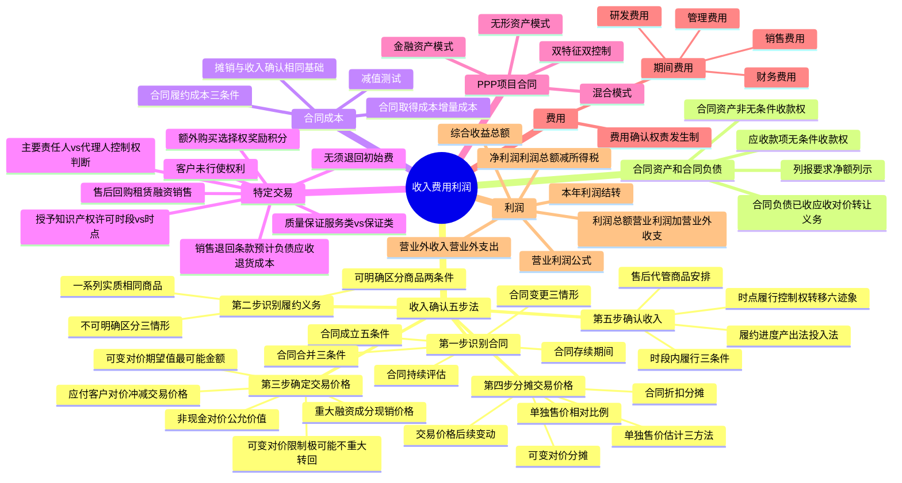

## 1. 章节定位

| 项目 | 信息 |
|------|------|
| 所属科目 | 会计 |
| 难度等级 | 4 |
| 历年分值 | 8-10 分 |
| 建议学时 | 10-12 小时 |
| 知识关联章节 | 第4章 固定资产（售后回购）、第14章 租赁（PPP与回购）、第18章 政府补助、第19章 所得税、第24章 会计政策变更与差错更正、第27章 资产负债表日后事项 |

## 2. 考情分析

本章是会计科目的核心重难点章节，历年分值约 8-10 分，几乎每年必考主观题，常以综合题或计算分析题形式出现，并广泛与所得税、差错更正、资产负债表日后事项等章节联动考查。

**命题规律**：本章内容覆盖面广、政策性强，主观题常以业务情境为载体，要求考生完成多个交易事项的会计处理及列报，单题分值高、综合性强。客观题则集中在概念判断、定义辨析与边界条件。

**高频考点分布**：

1. **收入确认五步法模型**：合同成立的五个条件、合同变更的三种情形、可明确区分商品的判断、可变对价最佳估计数及限制条件、重大融资成分、单独售价分摊、时段履行与时点履行的判断。几乎每年主观题都会涉及其中若干环节。
2. **某一时段内履行的履约义务**：三个判断条件（客户取得并消耗经济利益、客户控制在建商品、商品具有不可替代用途且有权收款）、履约进度的确定（产出法、投入法）、合同预计损失的处理。
3. **某一时点履行的履约义务**：控制权转移的六个迹象、售后代管商品安排的四个条件。
4. **合同成本**：合同履约成本的三个确认条件、合同取得成本（增量成本）的判断、摊销与减值。
5. **特定交易**：附有销售退回条款的销售（预计负债与应收退货成本）、附有质量保证条款的销售（服务类 vs 保证类）、主要责任人和代理人（控制权为核心判断标准）、附有客户额外购买选择权的销售（奖励积分的分摊与确认）、授予知识产权许可（时段履行三条件、特许权使用费例外规定）、售后回购（租赁交易与融资交易的区分）、客户未行使的权利、无须退回的初始费。
6. **PPP 项目合同**：双特征、双控制、三种会计处理模式（无形资产模式、金融资产模式、混合模式）。
7. **期间费用和利润**：管理费用、销售费用、研发费用、财务费用的核算内容；营业利润、利润总额、净利润的计算公式；营业外收支的核算范围。

**联动考查方式**：
- 与所得税章节结合：收入确认时点与计税基础差异、合同负债的计税基础；
- 与差错更正结合：错用总额法/净额法、错将合同履约成本计入当期损益等；
- 与资产负债表日后事项结合：销售退回在日后期间的处理；
- 与租赁章节结合：售后回购中的租赁交易处理、PPP 项目的会计处理。

**备考建议**：
- 牢记"客户取得商品控制权"是收入确认的核心原则，所有判断最终回归控制权；
- 区分"极可能"（远高于 50%）、"很可能"（>50%）、"基本确定"（>95%）三档概率用语；
- 注意合同资产与应收款项的本质区别（是否承担履约风险）；
- 主要责任人 vs 代理人的判断必须以控制权为核心，三个支持性迹象不能凌驾于控制权之上；
- 区分合同负债与金融负债、合同资产与应收款项的列报要求。

## 3. 知识框架

## 4. 核心精讲

### 4.1 收入的定义及其分类

**收入**是指企业在日常活动中形成的、会导致所有者权益增加的、与所有者投入资本无关的经济利益的总流入。其中，**日常活动**是指企业为完成其经营目标所从事的经常性活动以及与之相关的其他活动。

本节规范的范围：企业以存货换取客户的存货、固定资产、无形资产以及长期股权投资等，按照本节规定进行会计处理。本节不涉及：企业对外出租资产收取的租金、进行债权投资收取的利息、进行股权投资取得的现金股利、保险合同取得的保费收入等（这些适用其他准则）。其他非货币性资产交换，按照非货币性资产交换准则处理。

### 4.2 收入确认和计量的五步法模型

企业应当在履行了合同中的履约义务，即**客户取得相关商品控制权**时确认收入。取得商品控制权包括三个要素：①能力（拥有现时权利）；②主导该商品的使用；③能够获得几乎全部的经济利益。

收入确认和计量大致分为五步：**第一步识别与客户订立的合同；第二步识别合同中的单项履约义务；第三步确定交易价格；第四步将交易价格分摊至各单项履约义务；第五步履行各单项履约义务时确认收入**。其中，第一步、第二步和第五步主要与收入的确认有关，第三步和第四步主要与收入的计量有关。

#### 4.2.1 第一步：识别与客户订立的合同

**合同**是指双方或多方之间订立有法律约束力的权利义务的协议，包括书面形式、口头形式以及其他可验证的形式。

**（1）合同成立的条件**

企业与客户之间的合同**同时满足下列条件**的，企业应当在客户取得相关商品控制权时确认收入：

1. 合同各方已批准该合同并承诺将履行各自义务；
2. 该合同明确了合同各方与所转让的商品相关的权利和义务；
3. 该合同有明确的与所转让的商品相关的支付条款；
4. 该合同具有商业实质，即履行该合同将改变企业未来现金流量的风险、时间分布或金额；
5. 企业因向客户转让商品而有权取得的对价**很可能收回**。

注意：对于合同各方均有权单方面终止完全未执行的合同，且无须对合同其他方作出补偿的，企业应当视为该合同不存在。

**不满足条件时的处理**：企业只有在不再负有向客户转让商品的剩余义务，且已向客户收取的对价无须退回时，才能将已收取的对价确认为收入；否则，应当将已收取的对价作为负债进行会计处理。没有商业实质的非货币性资产交换，无论何时，均不应确认收入。

**（2）合同的持续评估**

对于在合同开始日即满足上述条件的合同，企业在后续期间无须重新评估，除非有迹象表明相关事实和情况发生重大变化。对于不满足上述条件的合同，企业应当在后续期间对其进行持续评估。

**（3）合同存续期间**

合同存续期间是合同各方拥有现时可执行的具有法律约束力的权利和义务的期间。当合同约定任何一方均可以随时无代价地终止合同时，合同存续期间不会超过已经提供的商品所涵盖的期间；当合同约定任何一方均可以提前终止合同，但要求终止合同的一方需要向另一方支付重大的违约金时，合同存续期间很可能与合同约定的期间一致。

**（4）合同合并**

企业与同一客户（或该客户的关联方）同时订立或在相近时间内先后订立的两份或多份合同，在满足下列条件**之一**时，应当合并为一份合同进行会计处理：①基于同一商业目的而订立并构成一揽子交易；②一份合同的对价金额取决于其他合同的定价或履行情况；③所承诺的商品构成单项履约义务。

**（5）合同变更**

合同变更的三种情形及会计处理如下表所示：

| 情形 | 条件 | 会计处理 |
|------|------|---------|
| 作为单独合同 | 合同变更增加了可明确区分的商品及合同价款，且新增合同价款反映新增商品单独售价 | 作为一份单独的合同进行会计处理 |
| 作为原合同终止及新合同订立 | 不属于上述第 1 种情形，且在合同变更日已转让商品与未转让商品之间可明确区分 | 视为原合同终止，将原合同未履约部分与合同变更部分合并为新合同。新合同交易价格 = 原合同尚未确认收入的对价 + 合同变更中客户已承诺的对价 |
| 作为原合同组成部分 | 不属于上述第 1 种情形，且在合同变更日已转让商品与未转让商品之间不可明确区分 | 作为原合同的组成部分，在合同变更日重新计算履约进度，调整当期收入和相应成本 |

**区分合同变更与可变对价**：合同变更是指经合同各方同意对原合同范围或价格作出的变更，是对原合同的后续变更；可变对价是指合同中约定的对价金额是可变的，不涉及对原合同的后续变更。

#### 4.2.2 第二步：识别合同中的单项履约义务

**履约义务**是指合同中企业向客户转让可明确区分商品的承诺。履约义务既包括合同中明确的承诺，也包括由于企业已公开宣布的政策、特定声明或以往的习惯做法等导致合同订立时客户合理预期企业将履行的承诺。

**（1）转让可明确区分商品的承诺**

可明确区分商品应**同时满足**两个条件：
- **商品本身可明确区分**：客户能够从该商品本身或者从该商品与其他易于获得的资源一起使用中受益。
- **合同层面可单独区分**：企业向客户转让该商品的承诺与合同中其他承诺可单独区分。

**表明不可明确区分的三种情形**：
1. 企业需提供重大的服务将商品与其他商品整合成组合产出转让给客户；
2. 该商品将对合同中承诺的其他商品予以重大修改或定制；
3. 该商品与合同中承诺的其他商品具有高度关联性。

**运输服务的特殊处理**：商品控制权转移给客户之后发生的运输活动可能构成单项履约义务；商品控制权转移之前发生的运输活动不构成单项履约义务，是履行合同的必要活动。

**（2）转让一系列实质相同且转让模式相同的可明确区分商品的承诺**

企业应当将实质相同且转让模式相同的一系列商品作为单项履约义务，即使这些商品可明确区分。其中，转让模式相同是指每一项可明确区分商品均满足在某一时段内履行履约义务的条件，且采用相同方法确定其履约进度。例如，保洁服务合同中每日提供的保洁服务。

#### 4.2.3 第三步：确定交易价格

**交易价格**是指企业因向客户转让商品而预期有权收取的对价金额。企业代第三方收取的款项（如增值税）以及预期将退还给客户的款项，应当作为负债，不计入交易价格。

**（1）可变对价**

合同中约定的对价金额可能因折扣、价格折让、返利、退款、奖励积分、激励措施、业绩奖金、索赔等因素而变化。

- **最佳估计数的确定**：按照**期望值**（按各种可能发生的对价金额及相关概率计算确定的金额）或**最可能发生金额**（一系列可能发生的对价金额中最可能发生的单一金额）确定。对于类似合同，应当采用相同的方法。当企业面临有限数量潜在结果时，最可能发生金额可能是更合适的；当企业面临大量潜在结果时，期望值可能更合适。
- **计入交易价格的限制条件**：包含可变对价的交易价格，应当不超过在相关不确定性消除时，累计已确认的收入**极可能不会发生重大转回**的金额。"极可能"发生的概率应远高于"很可能"（>50%），但不要求达到"基本确定"（>95%）。
- **每一资产负债表日**，企业应当重新估计应计入交易价格的可变对价金额。

**例外规定**：将可变对价计入交易价格的限制条件不适用于企业向客户授予知识产权许可并约定按客户实际销售或使用情况收取特许权使用费的情况。

**（2）合同中存在的重大融资成分**

当合同各方以约定的付款时间为客户或企业提供了重大融资利益时，合同中即包含了重大融资成分。合同中存在重大融资成分的，企业应当按照**现销价格**确定交易价格。

**表明未包含重大融资成分的情形**：①客户就商品支付了预付款，且可以自行决定转让时间（如储值卡、奖励积分）；②客户承诺支付的对价中有相当大的部分是可变的，取决于某一未来事项（如按实际销量收取的特许权使用费）；③合同对价与现销价格的差额是由于其他原因导致且相称（如保护性条款）。

**简化处理**：如果合同开始日预计客户取得商品控制权与客户支付价款间隔不超过一年的，可以不考虑重大融资成分。

**折现率**：企业确定的交易价格与合同承诺的对价金额之间的差额应当在合同期间内采用**实际利率法**摊销。折现率一经确定，不得因后续市场利率或客户信用风险等情况的变化而变更。

**（3）非现金对价**

- 通常按照非现金对价在**合同开始日的公允价值**确定交易价格。
- 非现金对价公允价值不能合理估计的，参照承诺向客户转让商品的单独售价间接确定。
- 合同开始日后，非现金对价的公允价值因对价形式以外的原因发生变动的，作为可变对价处理；因对价形式发生变动的（如股票价格波动），其变动不计入交易价格，按其他准则处理。

**（4）应付客户对价**

- 企业存在应付客户对价的，应当将该应付对价**冲减交易价格**，但为了自客户取得其他可明确区分商品的除外。
- 应付客户对价超过向客户取得可明确区分商品公允价值的，超过金额冲减交易价格。
- 在确认相关收入与支付（或承诺支付）客户对价二者**孰晚**的时点冲减当期收入。

#### 4.2.4 第四步：将交易价格分摊至各单项履约义务

当合同中包含两项或多项履约义务时，企业应当在**合同开始日**，按照各单项履约义务所承诺商品的**单独售价的相对比例**，将交易价格分摊至各单项履约义务。

**单独售价**的估计方法如下表：

| 方法 | 说明 |
|------|------|
| 市场调整法 | 根据某商品或类似商品的市场售价，考虑本企业的成本和毛利等进行适当调整 |
| 成本加成法 | 根据某商品的预计成本加上其合理毛利后的价格 |
| 余值法 | 根据合同交易价格减去合同中其他商品可观察的单独售价后的余值。仅在单独售价无法通过其他方法可靠估计时使用 |

**（1）分摊合同折扣**：合同折扣（各单项履约义务所承诺商品的单独售价之和高于合同交易价格的金额）应当在各单项履约义务之间按比例分摊。有确凿证据表明合同折扣仅与一项或多项（而非全部）履约义务相关的，应当分摊至相关履约义务。

**（2）分摊可变对价**：同时满足下列条件的，可变对价及后续变动额全部分摊至相关履约义务：①可变对价的条款专门针对该项履约义务所作的努力；②将可变金额全部分摊至该项履约义务符合分摊目标。

**（3）交易价格的后续变动**：按照合同开始日所采用的基础分摊。不得因合同开始日之后单独售价的变动而重新分摊。对于已履行的履约义务，其分摊的可变对价后续变动额应当调整变动当期的收入。

#### 4.2.5 第五步：履行每一单项履约义务时确认收入

企业应当首先判断履约义务是否满足在某一时段内履行的条件，如不满足，则属于在某一时点履行的履约义务。

**（1）在某一时段内履行的履约义务的收入确认条件**

满足下列条件**之一**的，属于在某一时段内履行的履约义务：

| 条件 | 说明 |
|------|------|
| 客户在企业履约的同时即取得并消耗企业履约所带来的经济利益 | 判断方法：假设更换其他企业继续履行，若实质上无须重新执行已完成的工作，则满足此条件。例如常规的保洁服务 |
| 客户能够控制企业履约过程中在建的商品 | 如在客户拥有的土地上建造厂房，客户终止合同时已建造部分归客户所有 |
| 企业履约过程中所产出的商品具有不可替代用途，且该企业在整个合同期间内有权就累计至今已完成的履约部分收取款项 | 两个条件须同时满足：商品具有不可替代用途 + 有权就累计已完成部分收取能补偿已发生成本和合理利润的款项 |

**"有权就累计至今已完成的履约部分收取款项"**是指在由于客户或其他方原因终止合同的情况下，企业有权就累计至今已完成的履约部分收取能够补偿其已发生成本和合理利润的款项，且该权利具有法律约束力。合同终止必须是由于客户或其他方而非企业自身的原因所致。

**（2）在某一时段内履行的履约义务的收入确认方法**

企业应当在该段时间内按照履约进度确认收入，采用**产出法**或**投入法**确定恰当的履约进度：

| 方法 | 说明 | 适用情形 |
|------|------|---------|
| 产出法 | 根据已转移给客户的商品对于客户的价值确定履约进度（如实际测量的完工进度、已达到的里程碑、时间进度、已完工或交付的产品） | 能够客观反映履约进度，信息可直接观察获得时 |
| 投入法 | 根据企业履行履约义务的投入确定履约进度（如投入的材料数量、人工工时、发生的成本） | 产出法所需信息无法直接观察获得或成本过高时 |

**成本法的特殊调整**：
- 已发生的成本并未反映履约进度的（如非正常消耗），需要调整。
- 已发生的成本与履约进度不成比例的（如施工中尚未安装的商品或材料成本占比较大），在满足特定条件时将该商品成本排除在已发生成本和预计总成本之外，同时按照该商品成本金额确认相应收入。

**当履约进度不能合理确定时**，企业已经发生的成本预计能够得到补偿的，应当按照已经发生的成本金额确认收入，直到履约进度能够合理确定为止。

**每一资产负债表日**，企业应当对履约进度进行重新估计，作为会计估计变更处理。

**合同预计损失的处理**：当企业预计履行履约义务所发生的成本超过预计能够得到补偿的对价时，应当将预计损失超出的部分确认为减值损失并计入主营业务成本，同时确认预计负债。

**（3）在某一时点履行的履约义务**

对于在某一时点履行的履约义务，企业应当在客户取得相关商品控制权时点确认收入。判断客户是否已取得商品控制权时，应当考虑下列迹象：

1. 企业就该商品享有**现时收款权利**；
2. 企业已将该商品的**法定所有权**转移给客户；
3. 企业已将该商品**实物转移**给客户；
4. 企业已将该商品所有权上的**主要风险和报酬**转移给客户；
5. **客户已接受**该商品；
6. 其他表明客户已取得商品控制权的迹象。

上述迹象并非穷尽，也无优先级之分，企业应当综合所有迹象判断控制权是否转移。需要特别注意，"客户已接受"是指客户确认商品符合合同约定（包括规格、质量等），而非仅是验收程序的完成。

**售后代管商品安排**：企业继续持有商品实物但已收款的情况，应当**同时满足下列条件**才表明客户取得了商品控制权：①该安排具有商业实质（如应客户要求订立）；②属于客户的商品能够单独识别；③该商品可以随时交付给客户；④企业不能自行使用该商品或将其提供给其他客户。

### 4.3 合同资产和合同负债

| 项目 | 定义 | 风险 |
|------|------|------|
| 合同资产 | 企业已向客户转让商品而有权收取对价的权利，且该权利取决于时间流逝之外的其他因素 | 承担信用风险 + 履约风险等其他风险 |
| 应收款项 | 企业无条件收取合同对价的权利，仅随着时间的流逝即可收款 | 仅承担信用风险 |
| 合同负债 | 企业已收或应收客户对价而应向客户转让商品的义务 | — |

**关键区分**：合同资产与应收款项的核心差异在于收款权利是否"无条件"。合同资产除承担信用风险外，还承担其他风险（如履约风险）；应收款项仅承担信用风险。当合同中的剩余履约义务履行完毕，合同资产即转为应收款项。

**注意**：
- 尚未向客户履行转让商品的义务而已收或应收客户对价中的**增值税部分**，因不符合合同负债的定义，不应确认为合同负债。
- 同一合同下的合同资产和合同负债应当以净额列示，不同合同下的不能相互抵销。
- 合同资产发生减值的，记入"资产减值损失"科目；应收款项减值记入"信用减值损失"科目。

### 4.4 合同成本

#### 4.4.1 合同履约成本

企业为履行合同发生的成本，不属于其他准则规范范围且**同时满足下列条件**的，应当作为合同履约成本确认为一项资产：

1. 该成本与一份当前或预期取得的合同**直接相关**（包括直接人工、直接材料、制造费用或类似费用、明确由客户承担的成本以及仅因该合同而发生的其他成本）；
2. 该成本增加了企业未来用于履行（或持续履行）履约义务的**资源**；
3. 该成本预期能够**收回**。

**应当计入当期损益的支出**（即使满足上述条件也不资本化）：
1. 管理费用（除非明确由客户承担）；
2. 非正常消耗的直接材料、直接人工和制造费用；
3. 与履约义务中已履行部分相关的支出；
4. 无法在尚未履行与已履行的履约义务之间区分的相关支出。

#### 4.4.2 合同取得成本

企业为取得合同发生的**增量成本**（不取得合同就不会发生的成本，如销售佣金）预期能够收回的，应当作为合同取得成本确认为一项资产。

**简化处理**：该资产摊销期限不超过一年的，可以在发生时计入当期损益。企业为取得合同发生的、除预期能够收回的增量成本之外的其他支出（如差旅费、投标费等），应当在发生时计入当期损益，除非明确由客户承担。

#### 4.4.3 摊销和减值

**摊销**：采用与该资产相关的商品收入确认相同的基础（即在履约义务履行的时点或按照履约进度）进行摊销，计入当期损益（销售费用）。

**减值**：合同履约成本和合同取得成本的账面价值高于下列两项差额的，超出部分应当计提减值准备：①企业因转让与该资产相关的商品预期能够取得的剩余对价；②为转让该相关商品估计将要发生的成本。以前期间减值的因素之后发生变化的，应当转回原已计提的资产减值准备。

### 4.5 特定交易的会计处理

#### 4.5.1 附有销售退回条款的销售

企业应当遵循以下原则进行会计处理：
- 按照预期有权收取的对价金额（**不包含**预期因销售退回将退还的金额）确认收入；
- 按照预期因销售退回将退还的金额确认**预计负债（应付退货款）**；
- 按照预期将退回商品转让时的账面价值，扣除收回该商品预计发生的成本后的余额，确认为**应收退货成本**；
- 每一资产负债表日重新估计，作为会计估计变更处理。

企业实际发生销售退回时，应当冲减预计负债和应收退货成本。

#### 4.5.2 附有质量保证条款的销售

| 类型 | 特征 | 会计处理 |
|------|------|---------|
| 服务类质量保证 | 在向客户保证所销售商品符合既定标准之外提供了一项单独的服务 | 作为单项履约义务，按收入准则处理，将部分交易价格分摊至该履约义务 |
| 保证类质量保证 | 仅向客户保证所销售商品符合既定标准（即产品本身的质量保证） | 按或有事项准则处理，确认预计负债并计入销售费用 |

判断考虑因素：①是否为法定要求；②质量保证期限；③企业承诺履行任务的性质。客户能够选择单独购买的质量保证，构成单项履约义务。同一合同可能同时包含两类质量保证，应当分别处理。

#### 4.5.3 主要责任人和代理人

企业应当根据其在**向客户转让商品前是否拥有对该商品的控制权**来判断其身份，这是核心判断原则。

| 身份 | 判断标准 | 收入确认 |
|------|---------|---------|
| 主要责任人 | 在向客户转让商品前能够控制该商品 | 按已收或应收对价**总额**确认收入 |
| 代理人 | 在向客户转让商品前不能控制该商品 | 按预期有权收取的佣金或手续费**净额**确认收入 |

**主要责任人能够控制商品的三种情形**：
1. 企业自第三方取得商品控制权后再转让给客户；
2. 企业能够主导该第三方代表本企业向客户提供服务；
3. 企业自第三方取得商品控制权后，通过提供重大服务将商品与其他商品整合成组合产出转让给客户。

如果企业仅仅是在特定商品的法定所有权转移给客户之前，暂时性地获得该特定商品的法定所有权，这并不意味着企业一定控制了该商品。实务中，企业在判断其在向客户转让特定商品之前是否已经拥有对该商品的控制权时，不应仅局限于合同的法律形式，应当综合考虑所有相关事实和情况进行判断。这些事实和情况包括：

1. **企业承担向客户转让商品的主要责任**。企业判断其是否承担向客户转让商品的主要责任时，应当从客户的角度进行评估，即客户认为哪一方承担了主要责任，例如客户认为谁对商品的质量或性能负责、谁负责提供售后服务、谁负责解决客户投诉等。
2. **企业在转让商品之前或之后承担了该商品的存货风险**。其中，存货风险主要是指存货可能发生减值、毁损或灭失等形成的损失。例如，如果企业在与客户订立合同之前已经购买或者承诺将自行购买特定商品，这可能表明企业在将该特定商品转让给客户之前，承担了该特定商品的存货风险。
3. **企业有权自主决定所交易商品的价格**。企业有权决定客户为取得特定商品所需支付的价格，可能表明企业有能力主导有关商品的使用并从中获得几乎全部的经济利益。然而，在某些情况下，代理人可能在一定程度上也拥有定价权（例如在主要责任人规定的某一价格范围内决定价格），即使代理人有一定的定价能力，也并不表明其身份是主要责任人，代理人只是放弃了一部分自己应当赚取的佣金或手续费而已。
4. 其他相关事实和情况。

**重要原则**：上述三个支持性迹象不能凌驾于控制权的判断之上，也不构成一项单独或额外的评估，只是帮助企业在难以评估特定商品转让给客户之前是否能够控制这些商品的情况下进行相关判断。这些事实和情况并无权重之分，也不能被孤立地用于支持某一结论。

#### 4.5.4 附有客户额外购买选择权的销售

企业应当评估该选择权是否向客户提供了一项**重大权利**。提供重大权利的，应当作为单项履约义务，按照交易价格分摊的要求将交易价格分摊至该履约义务，在客户未来行使购买选择权取得相关商品控制权时，或者该选择权失效时，确认相应的收入。

**重大权利的判断**：如果客户只有在订立了一项合同的前提下才取得了额外购买选择权，并且客户行使该选择权购买额外商品时，能够享受到超过该地区或该市场中其他同类客户所能够享有的折扣，则通常认为该选择权向客户提供了一项重大权利。客户行使该选择权购买商品时的价格反映了这些商品单独售价的，不应被视为企业向该客户提供了一项重大权利。

**简化处理**：当客户行使该权利购买的额外商品与原合同下购买的商品类似，且企业将按照原合同条款提供该额外的商品时（如续约选择权），企业可以无须估计该选择权的单独售价，而是直接把其预计将提供的额外商品的数量以及预计将收取的相应对价金额纳入原合同，并进行相应的会计处理。

**奖励积分的处理**：企业授予客户的奖励积分构成重大权利时，应当作为一项单独的履约义务，将销售商品收取的价款在销售商品和奖励积分之间按照单独售价的相对比例进行分摊。客户行使积分兑换商品时，按已兑换积分占预期将兑换的积分总数的比例确认收入；每一资产负债表日重新估计兑换率，调整当期收入。

#### 4.5.5 授予知识产权许可

企业向客户授予的知识产权常见的包括软件和技术、影视和音乐等的版权、特许经营权以及专利权、商标权和其他版权等。首先评估该知识产权许可是否构成单项履约义务。

**不构成单项履约义务的情形**：
1. 该知识产权许可构成有形商品的组成部分并且对于该商品的正常使用不可或缺（如设备内嵌的软件）；
2. 客户只有将该知识产权许可和相关服务一起使用才能够从中获益（如只能通过企业在线服务访问的授权内容）。

**构成单项履约义务时，进一步判断在某一时段内履行还是某一时点履行**。同时满足下列条件的，应当作为在某一时段内履行的履约义务确认相关收入；否则，作为在某一时点履行的履约义务：

1. 合同要求或客户能够合理预期企业将从事对该项知识产权有**重大影响**的活动（如显著改变知识产权的形式或功能的活动，或客户从知识产权获益能力依赖于该活动）；
2. 该活动对客户将产生**有利或不利影响**；
3. 该活动**不会导致向客户转让商品**。

具有重大独立功能的知识产权主要包括软件、生物合成物或药物配方以及已完成的媒体内容（如电影、电视节目、音乐录音）版权等。在判断时不应考虑：①该许可在时间、地域或使用方面的限制；②企业就其拥有的知识产权的有效性以及防止未经授权使用所提供的保证。

在某一时点履行的，应当在客户能够使用某项知识产权许可并开始从中获益之时确认收入。例如，企业授权客户在一定期间内使用软件，但在企业向客户提供该软件的密钥之前，客户都无法使用该软件，则不应确认收入。

**特许权使用费的例外规定**：企业向客户授予知识产权许可，并约定按客户实际销售或使用情况收取特许权使用费的，应当在下列两项**孰晚**的时点确认收入：
1. 客户后续销售或使用行为实际发生；
2. 企业履行相关履约义务。

该例外规定仅适用于：①特许权使用费仅与知识产权许可相关；②特许权使用费可能与合同中的知识产权许可和其他商品都相关，但与知识产权许可相关的部分占有主导地位。企业使用该例外规定时，应当对特许权使用费整体采用该规定，不应当分拆。如果与授予知识产权许可相关的对价同时包含固定金额和按客户实际销售或使用情况收取的变动金额两部分，则只有后者能采用该例外规定，前者应当在相关履约义务履行的时点或期间内确认收入。

#### 4.5.6 售后回购

**售后回购**是指企业销售商品的同时承诺或有权选择日后再将该商品（包括相同或几乎相同的商品，或以该商品作为组成部分的商品）购回的销售方式。企业应当区分下列两种情形分别进行会计处理：

| 情形 | 条件 | 会计处理 |
|------|------|---------|
| 远期安排 | 企业因与客户的远期安排负有回购义务或享有回购权利 | 客户在销售时点并未取得商品控制权，作为租赁交易或融资交易处理 |
| 应客户要求回购 | 客户具有行使该要求权的重大经济动因 | 按上述租赁或融资交易处理 |
| 应客户要求回购 | 客户无重大经济动因行权 | 作为附有销售退回条款的销售处理 |

**远期安排的细分**：回购价格低于原售价的，视为**租赁交易**，按租赁准则处理（客户实质上支付了对价取得了商品的使用权）；回购价格不低于原售价的，视为**融资交易**，在收到客户款项时确认金融负债，并将该款项和回购价格的差额在回购期间内确认为利息费用等。企业到期未行使回购权利的，应当在该回购权利到期时终止确认金融负债，同时确认收入。

**重大经济动因的判断**：应当综合考虑回购价格与预计回购时市场价格之间的比较，以及权利的到期日等因素。如果回购价格明显高于该资产回购时的市场价值，则表明客户有行权的重大经济动因。

**以购销合同方式进行的委托加工**：委托方与加工方通过签订销售合同的形式将原材料"销售"给加工方并委托其加工，同时签订采购合同将加工后的商品购回。在这种情况下，应根据合同条款和业务实质判断加工方是否已经取得待加工原材料的控制权，即加工方是否有权主导该原材料的使用并获得几乎全部经济利益。判断因素包括：原材料的性质是否为委托方的产品所特有、加工方是否有权按照自身意愿使用或处置该原材料、是否承担除因其保管不善之外的原因导致的该原材料毁损灭失的风险、是否承担该原材料价格变动的风险、是否能够取得与该原材料所有权有关的报酬等。如果加工方并未取得待加工原材料的控制权，该原材料仍然属于委托方的存货，委托方不应确认销售原材料的收入，而应将整个业务作为购买委托加工服务进行处理；相应地，加工方实质是为委托方提供受托加工服务，应当按照净额确认受托加工服务费收入。

#### 4.5.7 客户未行使的权利

企业向客户预收销售商品款项应当确认为合同负债，待履行了相关履约义务时再转为收入。当企业预收款项无须退回，且客户可能会放弃其全部或部分合同权利时（如放弃储值卡的使用等），企业预期将有权获得与客户所放弃的合同权利相关金额的，应当按照客户行使合同权利的模式**按比例确认收入**；否则，企业只有在客户要求其履行剩余履约义务的可能性极低时，才能将上述负债的相关余额转为收入。

企业在确定其是否预期将有权获得与客户所放弃的合同权利相关的金额时，应当考虑将估计的可变对价计入交易价格的限制要求。

**特殊规定**：如果有相关法律规定，企业所收取的与客户未行使权利相关的款项须转交给其他方的（如法律规定无人认领的财产需上交政府），企业不应将其确认为收入。此外，企业预收的款项中代其他方收取的部分不属于客户未行使的权利。

#### 4.5.8 无须退回的初始费

企业在合同开始（或接近合同开始）日向客户收取的无须退回的初始费（如俱乐部的入会费等）应当计入交易价格。企业应当评估该初始费是否与向客户转让已承诺的商品相关：

| 情形 | 会计处理 |
|------|---------|
| 初始费与转让已承诺的商品相关，且该商品构成单项履约义务 | 在转让该商品时，按分摊至该商品的交易价格确认收入 |
| 初始费与转让已承诺的商品相关，但该商品不构成单项履约义务 | 在包含该商品的单项履约义务履行时，按分摊至该单项履约义务的交易价格确认收入 |
| 初始费与转让已承诺的商品不相关 | 作为未来将转让商品的预收款，在未来转让该商品时确认为收入 |

**重要原则**：企业收取了无须退回的初始费且为履行合同应开展初始活动，但这些活动本身并没有向客户转让已承诺的商品的（如为履行会员健身合同开展的行政管理性质的准备工作），该初始费与未来将转让的已承诺商品相关，应当在未来转让该商品时确认为收入。企业在确定履约进度时不应考虑这些初始活动；企业为该初始活动发生的支出应当按照合同成本部分的要求确认为一项资产或计入当期损益。

### 4.6 社会资本方对 PPP 项目合同的会计处理

#### 4.6.1 PPP 项目合同的特征和条件

PPP 项目合同是指社会资本方与政府方依法依规就 PPP 项目合作所订立的合同。本部分规定的 PPP 项目合同应当同时具有以下两个特征（"**双特征**"）：
1. 社会资本方在合同约定的运营期间内代表政府方使用 PPP 项目资产提供公共产品和服务；
2. 社会资本方在合同约定的期间内就其提供的公共产品和服务获得补偿。

本部分规定的 PPP 项目还应当同时符合以下两个条件（"**双控制**"）：
1. 政府方控制或管制社会资本方使用 PPP 项目资产必须提供的公共产品和服务的类型、对象和价格；
2. PPP 项目合同终止时，政府方通过所有权、收益权或其他形式控制 PPP 项目资产的重大剩余权益。

对于运营期占项目资产全部使用寿命的 PPP 项目合同，即使项目合同结束时项目资产不存在重大剩余权益，如果该项目合同符合前述"双控制"条件中的第（1）项，则仍然适用本部分规定。不同时符合"双特征"和"双控制"的 PPP 项目合同，社会资本方应当根据其业务性质按照其他有关规定进行会计处理。

#### 4.6.2 会计处理模式

如果社会资本方根据 PPP 项目合同约定提供多项服务（如既提供建造服务，又提供建成后的运营服务、维护服务）的，应当识别合同中的单项履约义务，将交易价格按照各项履约义务单独售价的相对比例分摊至各项履约义务。社会资本方提供建造服务（含建设和改扩建）或发包给其他方等，应当确定其身份是主要责任人还是代理人，并进行会计处理，确认合同资产。

在 PPP 项目资产的建造过程中发生的借款费用，社会资本方应当按照《企业会计准则第17号——借款费用》的规定进行会计处理。对于下述确认为无形资产的部分，社会资本方在相关借款费用满足资本化条件时，应当将其予以资本化，记入"PPP 借款支出"科目，并在 PPP 项目资产达到预定可使用状态时，结转至无形资产。其他借款费用均应予以费用化，计入财务费用。

**三种会计处理模式**：

| 模式 | 适用情形 | 会计处理 |
|------|---------|---------|
| 无形资产模式 | 收费金额不确定，不构成无条件收取现金的权利 | 在 PPP 项目资产达到预定可使用状态时，将相关 PPP 项目资产的对价金额或确认的建造收入金额确认为无形资产，按无形资产准则处理 |
| 金融资产模式 | 满足有权收取可确定金额现金（或其他金融资产）的条件 | 在拥有收取对价的权利（该权利仅取决于时间流逝的因素）时确认为应收款项，按金融工具准则处理 |
| 混合模式 | 建造收入金额超过有权收取可确定金额现金的部分 | 超过部分确认为无形资产；同时存在应收款项和无形资产 |

社会资本方不应当将 PPP 项目资产确认为自有资产。PPP 项目资产达到预定可使用状态后，社会资本方应当按照收入准则确认与运营服务相关的收入。

社会资本方根据 PPP 项目合同，自政府方取得其他资产，该资产构成政府方应付合同对价的一部分的，社会资本方应当按照收入准则规定进行会计处理，不作为政府补助。为使 PPP 项目资产保持一定的服务能力或在移交给政府方之前保持一定的使用状态，社会资本方根据 PPP 项目合同而提供的服务不构成单项履约义务的，应当将预计发生的支出，按照或有事项准则规定进行会计处理（确认预计负债）。

### 4.7 费用

#### 4.7.1 费用的确认

**费用**是指企业在日常活动中发生的、会导致所有者权益减少的、与向所有者分配利润无关的经济利益的总流出。

费用有狭义和广义之分。广义的费用泛指企业各种日常活动发生的所有耗费，狭义的费用仅指与本期营业收入相配比的那部分耗费。费用应按照**权责发生制**确认：凡应属于本期发生的费用，不论其款项是否支付，均确认为本期费用；反之，不属于本期发生的费用，即使其款项已在本期支付，也不确认为本期费用。

确认费用时应当遵循以下程序：
1. 划分生产费用与非生产费用的界限。生产费用是指与企业日常生产经营活动有关的费用，如生产产品所发生的原材料费用、人工费用等；非生产费用是指不属于生产费用的费用，如支付给管理人员的薪酬等。
2. 分清生产费用与期间费用的界限。正常消耗的生产费用应当计入产品成本，而期间费用直接计入当期损益。
3. 对于期间费用，进一步划分为管理费用、销售费用、研发费用和财务费用。
4. 对于生产费用，根据费用发生的实际情况分别确认为不同产品所负担的费用；对于几种产品共同发生的费用，按受益原则分配计入相关产品的生产成本。

#### 4.7.2 期间费用

期间费用是企业当期发生的费用中的重要组成部分，是指本期发生的、不能直接或间接归入某种产品成本的、直接计入损益的各项费用，包括管理费用、销售费用、研发费用和财务费用。

**（1）管理费用**

管理费用是指企业为组织和管理企业生产经营所发生的管理费用，包括：企业在筹建期间内发生的开办费、董事会和行政管理部门在企业的经营管理中发生的或者应由企业统一负担的公司经费（包括行政管理部门职工工资及福利费、物料消耗、低值易耗品摊销、办公费和差旅费等）、工会经费、董事会费（包括董事会成员津贴、会议费和差旅费等）、聘请中介机构费、咨询费（含顾问费）、诉讼费、业务招待费、技术转让费、行政管理部门等发生的固定资产日常修理费用以及应缴纳的残疾人就业保障金等。

企业发生的管理费用，在"管理费用"科目核算，按费用项目设置明细账。期末，"管理费用"科目余额结转"本年利润"科目后无余额。

**（2）销售费用**

销售费用是指企业在销售商品和材料、提供劳务的过程中发生的各种费用，包括：企业在销售商品过程中发生的保险费、包装费、展览费和广告费、商品维修费、装卸费等，以及为销售本企业商品而专设的销售机构（含销售网点、售后服务网点等）的职工薪酬、业务费、折旧费、固定资产修理费用等费用。

企业发生的销售费用，在"销售费用"科目核算，按费用项目设置明细账。期末，"销售费用"科目余额结转"本年利润"科目后无余额。企业（金融）应将"销售费用"科目改为"业务及管理费"科目。

**（3）研发费用**

研发费用是指企业进行研究与开发过程中发生的费用化支出，以及计入管理费用的自行开发无形资产的摊销金额。其包括"管理费用"科目下"研究费用"明细科目的当期发生额，以及"管理费用"科目下"无形资产摊销"明细科目中属于开发费用资本化金额在当期的摊销额。

**（4）财务费用**

财务费用是指企业为筹集生产经营所需资金等而发生的应予费用化的筹资费用，包括利息支出（减利息收入）、汇兑损益等。

企业发生的财务费用，在"财务费用"科目核算，按费用项目设置明细账。期末，"财务费用"科目余额结转"本年利润"科目后无余额。

### 4.8 利润

#### 4.8.1 利润的构成

企业作为独立的经济实体，应当以自己的经营收入抵补其成本费用，并且实现盈利。**利润**是指企业在一定会计期间的经营成果，包括收入减去费用后的净额、直接计入当期利润的利得和损失等。

直接计入当期利润的利得和损失，是指应当计入当期损益、会导致所有者权益发生增减变动的、与所有者投入资本或者向所有者分配利润无关的利得或者损失。

**（1）营业利润**

营业利润 = 营业收入 − 营业成本 − 税金及附加 − 销售费用 − 管理费用（不含研发费用）− 研发费用 − 财务费用 + 其他收益 + 投资收益（−投资损失）+ 净敞口套期收益（−净敞口套期损失）+ 公允价值变动收益（−公允价值变动损失）− 信用减值损失 − 资产减值损失 + 资产处置收益（−资产处置损失）

其中：
- **营业收入**是企业经营业务所实现的收入总额，包括主营业务收入和其他业务收入；
- **营业成本**是企业经营业务所发生的实际成本总额，包括主营业务成本和其他业务成本；
- **资产减值损失**是企业计提各项资产减值（不含信用减值）准备所形成的损失；
- **信用减值损失**反映企业计提的各项金融工具信用减值准备所确认的信用损失；
- **公允价值变动收益（或损失）**是企业交易性金融资产等公允价值变动形成的应计入当期损益的利得（或损失）；
- **投资收益（或损失）**是企业以各种方式对外投资所取得的收益（或发生的损失）。

**（2）利润总额**

利润总额 = 营业利润 + 营业外收入 − 营业外支出

其中，营业外收入（或支出）是指企业发生的与日常活动无直接关系的各项利得（或损失）。

**（3）净利润**

净利润 = 利润总额 − 所得税费用

其中，所得税费用是指企业确认的应从当期利润总额中扣除的所得税费用。

**（4）综合收益总额**

净利润加上其他综合收益的税后净额为综合收益总额。

#### 4.8.2 营业外收支的会计处理

营业外收支是指企业发生的与日常活动无直接关系的各项收支。营业外收支虽然与企业生产经营活动没有多大的关系，但从企业主体来考虑，同样带来收益或形成企业的损失，也是增加或减少利润的因素。

**（1）营业外收入**

营业外收入是指企业发生的营业利润以外的收益，主要包括：非流动资产毁损报废利得、与企业日常活动无关的政府补助、盘盈利得、捐赠利得等。

| 项目 | 含义 |
|------|------|
| 非流动资产毁损报废利得 | 因自然灾害等发生毁损、已丧失使用功能而报废非流动资产所产生的清理收益 |
| 与企业日常活动无关的政府补助 | 与企业日常活动无关的、从政府无偿取得货币性资产或非货币性资产形成的利得 |
| 盘盈利得 | 企业对于现金等资产清查盘点中盘盈的资产，报经批准后计入营业外收入的金额 |
| 捐赠利得 | 企业接受捐赠产生的利得 |

**特殊处理**：企业接受控股股东（或控股股东的子公司）或非控股股东（或非控股股东的子公司）直接或间接捐赠，经济实质表明属于控股股东或非控股股东对企业的资本性投入，应当将相关利得计入所有者权益（资本公积），而不确认为营业外收入。

企业应当通过"营业外收入"科目核算。期末，应将该科目余额转入"本年利润"科目，结转后该科目无余额。

**（2）营业外支出**

营业外支出是指企业发生的营业利润以外的支出，主要包括：非流动资产毁损报废损失、公益性捐赠支出、非常损失、盘亏损失、企业未按规定缴纳残疾人就业保障金缴纳的滞纳金等。

| 项目 | 含义 |
|------|------|
| 非流动资产毁损报废损失 | 因自然灾害等发生毁损、已丧失使用功能而报废非流动资产所产生的清理损失 |
| 公益性捐赠支出 | 企业对外进行公益性捐赠发生的支出 |
| 非常损失 | 企业对于因客观因素（如自然灾害等）造成的损失，在扣除保险公司赔偿后计入营业外支出的净损失 |

企业应通过"营业外支出"科目核算。期末，应将该科目余额转入"本年利润"科目，结转后该科目无余额。

**重要原则**：营业外收入和营业外支出应当分别核算。在具体核算时，不得以营业外支出直接冲减营业外收入，也不得以营业外收入冲减营业外支出。

#### 4.8.3 本年利润的会计处理

企业应设置"本年利润"科目，核算企业当期实现的净利润（或发生的净亏损）。

企业期（月）末结转利润时，应将各损益类科目的金额转入本科目，结平各损益类科目。结转后本科目的贷方余额为当期实现的净利润；借方余额为当期发生的净亏损。

年度终了，应将本年收入、利得和费用、损失相抵后结出的本年实现的净利润，转入"利润分配"科目，借记本科目，贷记"利润分配——未分配利润"科目；如为净亏损作相反的会计分录。结转后本科目应无余额。

## 5. 典型例题

**【例题 1】（合同变更的会计处理）**

A 公司与客户签订合同，每周为客户的办公楼提供保洁服务，合同期限为三年，客户每年向 A 公司支付服务费 10 万元（假定该价格反映了合同开始日该项服务的单独售价）。在第二年末，合同双方对合同进行了变更，将第三年的服务费调整为 8 万元（假定该价格反映了合同变更日该项服务的单独售价），同时以 20 万元的价格将合同期限延长三年（假定该价格不反映合同变更日该三年服务的单独售价），即每年的服务费为 6.67 万元，于每年年初支付。

要求：说明 A 公司对该合同变更的会计处理。

**答案**：

在合同开始的前两年，A 公司每年确认收入 10 万元。

在合同变更日，由于新增的三年保洁服务的价格不能反映该项服务在合同变更时的单独售价，因此该合同变更不能作为单独的合同进行会计处理。由于在剩余合同期间需提供的服务与已提供的服务是可明确区分的，A 公司应当将该合同变更作为原合同终止，同时将原合同中未履约的部分与合同变更合并为一份新合同进行会计处理。

该新合同的合同期限为四年，对价为 28 万元，即原合同下尚未确认收入的对价 8 万元与新增的三年服务相应的对价 20 万元之和，新合同中 A 公司每年确认的收入为 7 万元（28÷4）。

**解析**：合同变更既未增加可明确区分的商品且新增价款不反映单独售价，且已转让与未转让商品可明确区分，属于第二种情形（作为原合同终止及新合同订立）。

**【例题 2】（奖励积分的会计处理）**

2×24 年 1 月 1 日，甲公司开始推行一项奖励积分计划。根据该计划，客户在甲公司每消费 10 元可获得 1 个积分，每个积分从次月开始在购物时可以抵减 1 元。截至 2×24 年 1 月 31 日，客户共消费 100 000 元，可获得 10 000 个积分，根据历史经验，甲公司估计该积分的兑换率为 95%。假定上述金额均不包含增值税等的影响。

截至 2×24 年 12 月 31 日，客户共兑换了 4 500 个积分，甲公司对该积分的兑换率进行了重新估计，仍然预计客户总共将会兑换 9 500 个积分。

截至 2×25 年 12 月 31 日，客户累计兑换了 8 500 个积分。甲公司对该积分的兑换率进行了重新估计，预计客户总共将会兑换 9 700 个积分。

要求：计算甲公司 2×24 年 1 月 31 日、2×24 年 12 月 31 日、2×25 年 12 月 31 日应确认的收入及合同负债余额。

**答案**：

（1）2×24 年 1 月 31 日：

积分的单独售价 = 1 元 × 10 000 个积分 × 95% = 9 500（元）

分摊至商品的交易价格 = [100 000 ÷ (100 000 + 9 500)] × 100 000 = **91 324（元）**

分摊至积分的交易价格 = [9 500 ÷ (100 000 + 9 500)] × 100 000 = **8 676（元）**

甲公司应当在商品控制权转移时确认收入 91 324 元，同时确认合同负债 8 676 元。

（2）2×24 年 12 月 31 日：

积分应确认的收入 = 4 500 ÷ 9 500 × 8 676 = **4 110（元）**

剩余未兑换的积分 = 8 676 − 4 110 = **4 566（元）**，仍然作为合同负债。

（3）2×25 年 12 月 31 日：

积分应确认的收入 = 8 500 ÷ 9 700 × 8 676 − 4 110 = **3 493（元）**

剩余未兑换的积分 = 8 676 − 4 110 − 3 493 = **1 073（元）**，仍然作为合同负债。

**解析**：奖励积分构成重大权利，应作为单项履约义务，按照商品和积分单独售价的相对比例分摊交易价格。每一资产负债表日重新估计兑换率，按已兑换积分占预期将兑换积分总数的比例确认收入。

**【例题 3】（主要责任人 vs 代理人）**

甲公司是一家经营高端品牌的百货公司，采用与品牌服装供应商合作的经营模式。某高端品牌供应商乙公司在甲公司指定区域设立专柜（或专卖店）提供约定品牌商品，并委派营业员销售商品。乙公司负责专柜内的商品保管、出售、调配或下架，承担丢失和毁损风险，拥有未售商品的所有权。乙公司负责实际定价销售，甲公司负责对百货公司内销售的商品统一收款，开具发票。甲公司将收到客户款项扣除 10% 后支付给乙公司。甲公司通过各种促销活动以提高百货公司的总体业绩，乙公司自行开展的打折活动需要获得甲公司同意。如有需办理退换货的，甲公司可自行决定为客户办理退换货、赔偿等事项，之后可向乙公司追偿。假定客户丙购买商品，向甲公司支付价款 1 000 元，甲公司扣除 100 元后支付给乙公司 900 元。

要求：分别说明甲公司和乙公司的会计处理。

**答案**：

- **乙公司**：在客户付款购买商品之前，乙公司能够主导商品的使用（如出售、调配或下架），并从中获得其几乎全部的经济利益，因此拥有对该商品的控制权，是**主要责任人**，在客户丙取得商品控制权时按总额确认收入 **1 000 元**。
- **甲公司**：在商品转移给客户之前，甲公司不能自行或要求乙公司把这些商品用于其他用途，也不能禁止乙公司把商品用于其他用途，因此甲公司没有获得对该商品的控制权，只是负责协助乙公司进行商品销售，是**代理人**，在客户丙取得商品控制权时按净额确认收入 **100 元**。

虽然从客户角度看，甲公司承担退换货和赔偿的主要责任；乙公司承担了该商品的存货风险；销售商品价格主要是由供应商乙公司确定但甲公司有一定影响力。但这三个支持性迹象并不能明确区分主要责任人和代理人，仅为支持控制权评估，不能取代控制权评估，也不能凌驾于控制权评估之上，更不是单独或额外的评估。

**解析**：主要责任人和代理人的判断核心是企业在向客户转让商品前是否拥有对该商品的控制权，三个支持性迹象（主要责任、存货风险、定价权）不能取代控制权评估。

## 6. 记忆口诀

**收入五步法**："一合同二义务三价格四分摊五确认"——识别合同、识别履约义务、确定交易价格、分摊交易价格、履行义务时确认收入。其中一、二、五步与确认相关，三、四步与计量相关。

**合同成立五条件**："批准承诺、明确权利义务、明确支付条款、商业实质、对价很可能收回"——五条件同时满足。

**合同变更三情形**："新增商品反映售价作单独，可区分作终止新订立，不可区分作原合同组成部分"——分别对应单独合同、原合同终止及新合同订立、原合同组成部分。

**可明确区分两条件**："本身能受益、合同可单独区分"——商品本身可明确区分 + 合同层面可单独区分。

**不可明确区分三情形**："重大整合、重大修改定制、高度关联"——需提供重大服务整合成组合产出、重大修改或定制、高度关联性。

**可变对价限制**："极可能不重大转回"——计入交易价格的可变对价不超过不确定性消除时累计已确认收入极可能不会发生重大转回的金额。

**重大融资成分**："现销价格定交易价格，实际利率法摊差额，一年以内可简化"——按现销价格确定交易价格，差额按实际利率法摊销，间隔不超过一年可简化。

**单独售价估计三方法**："市场调整、成本加成、余值兜底"——前两种优先使用，余值法仅在无法通过其他方法可靠估计时使用。

**时段内履行三条件**："同时取得消耗、控制在建、不可替代加收款"——客户取得并消耗经济利益、客户控制在建商品、商品不可替代用途且有权收款。

**时点履行六迹象**："收款权利、法定所有权、实物转移、风险报酬、客户接受、其他"——综合判断控制权转移时点。

**合同资产 vs 应收款项**："合同资产非无条件，承担履约加信用；应收款项无条件，只承担信用风险"——合同资产取决于时间流逝之外的其他因素。

**主要责任人 vs 代理人**："转让前能控制是主要，总额确认；不能控制是代理，净额确认"——核心是转让商品前是否拥有控制权，三个支持性迹象不能凌驾。

**售后回购**："低于原售价是租赁，不低于原售价是融资；应客户要求看动因，有动因同上无动因作退回"——远期安排按回购价格与原售价比较；应客户要求回购看是否有重大经济动因。

**质量保证两类**："服务类是单项义务按收入，保证类按或有事项"——服务类提供单独服务，保证类仅保证商品符合既定标准。

**知识产权许可三条件（时段）**："重大影响、有利不利影响、不转让商品"——同时满足作为时段履行，否则作为时点履行。

**特许权使用费**："销售发生与履约义务孰晚确认"——例外规定，仅适用于与知识产权许可相关的部分。

**PPP 项目双特征双控制**："代政府提供公共产品获得补偿，政府控类型对象价格控剩余权益"——双特征双控制同时满足。

**PPP 三模式**："收费不定作无形，确定金额作金融，超过部分作混合"——无形资产模式、金融资产模式、混合模式。

**利润三层次**："营业利润加营业外是利润总额，利润总额减所得税是净利润，净利润加其他综合收益是综合收益总额"。

**营业外收支原则**："分别核算不冲减"——营业外收入与营业外支出分别核算，不得相互冲减。

## 7. 同步练习

**295.（单选题）** 甲公司20×9年10月1日，向乙公司销售A产品10万件，每件不含税价格1000元，每件成本860元，当日A产品已发出，且实际控制权已经转移给乙公司；当日收到乙公司支付的货款。协议约定，购货方于次年1月31日之前有权退货。甲公司根据经验，估计退货率为10%。20×9年12月31日，甲公司对退货率进行了重新评估，认为只有8%的A产品会被退回。假定不考虑增值税的影响及其他因素的影响，甲公司20×9年12月31日应调整营业收入的金额是（　）。

A. 1000万元
B. 200万元
C. 800万元
D. 2000万元

---

**296.（单选题）** 2×22年5月16日，甲公司与乙公司签订一项软件授权许可合同，将其自行研发的成熟的标准化软件产品授权给乙公司永久使用。2×22年7月20日，甲公司按合同约定的价格向乙公司交付该软件产品，包括：①软件授权书；②软件及安装调试介质（光盘）。当日，乙公司清点验收完毕。合同约定，除非软件产品本身存在质量问题，否则乙公司无权要求退货；乙公司应于5个月内支付货款，并在支付完软件采购价款后才能在线提出申请激活码。甲公司判断乙公司具有可靠的偿付能力，但5个月时间超出其正常的信用期（1个月），因此甲公司在其系统中对出售给乙公司的软件授权书进行了备注，乙公司需在支付完软件采购价款后，在线提出申请激活码，经甲公司相关部门审核批准才能生成并获取激活码。2×22年8月15日，乙公司完成软件采购价款的支付，并向甲公司申请激活码，甲公司审核批准后，当日生成激活码并提供给乙公司。2×22年9月4日，乙公司正式开始使用该软件。该合同中仅包含软件授权许可一项履约义务，并属于在某一时点履行的履约义务，不考虑其他因素，甲公司确认该项收入的日期为（　）。

A. 2×22年8月15日
B. 2×22年7月20日
C. 2×22年5月16日
D. 2×22年9月4日

---

**297.（单选题）** 2×23年1月10日，甲公司与客户签订合同，以每件200元的价格销售A产品100件，并且在合同中约定，购买该产品的客户可得到一张折扣券，如果客户在未来30天内额外购买任何产品，在限额200元的范围内，可以享受6折优惠。此外，作为其年度大促的一部分，甲公司计划未来30天内对所有产品的销售实行8折优惠。上述两项优惠不能叠加使用。假定每位客户仅购买1件A产品，甲公司估计客户兑现折扣券的可能性为80%，且每位客户将平均购买100元的额外产品。假定不考虑其他因素，根据上述资料，甲公司销售A产品时应确认的收入为（　）。

A. 20000元
B. 18518.52元
C. 30000元
D. 1481.48元

---

**298.（单选题）** 2×22年1月1日，甲公司与当地政府签订PPP项目合同，甲公司作为社会资本方负责当地某一段高速公路的建设、运营。根据合同约定，PPP项目合同期间为10年，其中项目建设期为2年、运营期为8年；政府方需要对甲公司提供的PPP项目资产进行验收，如果政府方验收合格，则政府方应在运营期间内每年末向甲公司支付3000万元。甲公司合理估计其能够达到验收条件。运营期满后，甲公司将PPP项目资产无偿移交给政府方。甲公司采用成本加成法确定各单项履约义务的单独售价，考虑各项因素之后，估计建造、运营服务的合理成本加成率分别为10%和15%，预计其提供建造服务期间，每年成本4800万元，运营期间每年成本550万元。假设合同期间各年的现金流均在年末发生。甲公司的履约义务包括提供道路建造、运营的服务，假设上述服务均构成单项履约义务，均满足在某一时段内确认收入的条件，且甲公司从事PPP项目的身份是主要责任人。该合同满足"双特征"和"双控制"条件。假定不考虑其他因素，甲公司该项目相关会计处理的表述中，正确的是（　）。

A. 2×22年应确认提供建造服务收入4800万元
B. 2×22年应确认合同资产5280万元
C. 建设期内确认融资成分的影响应冲减无形资产成本
D. 运营期间每年自政府收取的对价，应确认为无形资产

---

**299.（单选题）**（2024年）不考虑其他因素，下列事项或交易中，应确认为合同履约成本的是（　）。

A. 通过电商平台自主销售商品并按销售额的5%支付给电商平台的使用费
B. 对出售商品计提的保证类质量保证费用30万元
C. 销售商品按签订合同金额的百分比支付给销售人员销售佣金50万元
D. 对已签订合同的新产品履约而制作新的生产模具制造费20万元，相关模具不得用于生产其他客户的订单

---

**300.（单选题）**（2023年）2×22年7月1日经销商向甲公司采购商品500万元，获得25万元返点。经销商可按25万元抵扣未来向甲公司采购商品的价款，或按25万元向甲公司换成现金。不考虑其他因素，下列各项关于甲公司在确认对返点会计处理的表述中，正确的是（　）。

A. 作为额外购买选择进行会计处理
B. 作为非现金对价进行会计处理
C. 作为可变对价进行会计处理
D. 作为重大融资成分进行会计处理

---

**301.（单选题）**（2023年）甲公司为了拓展业务，取得客户订单发生的下列支出中，属于为取得合同而发生的增量成本的是（　）。

A. 根据年度订单数量及个人综合表现考评确定的销售人员年度奖金
B. 为参与客户招标而准备招标资料发生的支出
C. 投标过程中聘请外部律师发生的支出
D. 根据订立合同金额的5%向代理商支付的代理费

---

**302.（单选题）**（2022年）2021年4月1日，甲公司与乙公司签订买卖合同，约定甲公司向乙公司交付产品，乙公司以面值600万元、当日公允价值580万元的债券支付。2021年5月9日，乙公司收到甲公司交付的产品并验收入库。当日债券的公允价值为585万元。2021年5月20日，乙公司向甲公司交付债券，当日公允价值为590万元。不考虑税费，甲公司向乙公司销售产品应确认的收入是（　）。

A. 585万元
B. 580万元
C. 590万元
D. 600万元

---

**303.（单选题）** 企业向客户授予知识产权许可，并约定按客户实际销售或使用情况收取特许权使用费的，确认收入的时点为（　）。

A. 客户后续销售或使用行为实际发生时
B. 收取特许权使用费时
C. 企业履行相关履约义务时
D. 客户后续销售或使用行为实际发生和企业履行相关履约义务二者孰晚的时点

---

**304.（单选题）** 2×21年7月1日，甲公司向乙公司销售其生产的一辆新型汽车，销售价格为320万元，成本为280万元，商品已发出，款项已收到。同时双方约定，甲公司在2年之后以200万元的价格回购该汽车。假定不考虑货币时间价值等其他因素的影响，下列关于甲公司会计处理的说法中不正确的是（　）。

A. 应作为租赁交易进行会计处理
B. 2×21年甲公司应确认收入30万元
C. 2×21年甲公司应确认利息费用30万元
D. 2×21年7月1日，收到320万元款项时应确认为负债

---

**305.（单选题）** 2×22年1月1日，甲建筑公司与乙公司签订一项大型设备建造工程合同，合同约定：该工程的造价为8000万元，工程期限为1年半，甲公司负责工程的施工及全面管理，乙公司按照第三方工程监理公司确认的工程完工量，每半年与甲公司结算一次。甲公司预计至2×22年年末其履约进度将达到80%，预计整项工程将在2×23年6月30日竣工，预计可能发生的总成本为4000万元。假定该建造工程整体构成单项履约义务，并属于在某一时段履行的履约义务，甲公司采用成本法确定履约进度。至2×22年6月30日，工程累计实际发生成本1500万元，预计的总成本不变；当日，甲公司与乙公司结算合同价款3500万元，甲公司实际收到价款2000万元。不考虑增值税等其他因素，下列说法中不正确的是（　）。

A. 甲公司在实际发生工程成本时，应将其计入合同履约成本
B. 2×22年6月30日，甲公司该项合同的履约进度为37.5%
C. 该项业务在甲公司的2×22年6月30日资产负债表中应列示合同资产500万元
D. 甲公司在2×22年6月30日应确认收入3000万元

---

**306.（多选题）** 甲公司为增值税一般纳税人，2×24年发生如下业务：①2×24年4月1日，与乙公司签订一项软件开发合同，为乙公司提供软件开发服务，采用产出法计量履约进度，当月为履行合同义务实际发生的成本超出按照产出法确定成本的金额20万元；②2×24年6月1日，与丙公司签订一项合同，丙公司于当日预付了包括增值税在内的价款共计113万元；③2×24年8月1日，与丁公司签订一项销售商品合同，甲公司按照以往习惯，约定如果丁公司当年采购数量达到1万件，将给予合同总价款2%的折扣，丁公司当年采购数量共计1.2万件；④2×24年10月1日，与戊公司签订一项合同，合同约定甲公司需要在5个月内提供设备维保服务，自2×25年1月1日起，戊公司可以无条件终止合同。针对上述业务，下列各项说法中不正确的有（　）。

A. 4月份为履行合同义务实际发生的成本超出按照产出法确定成本的金额20万元计入合同履约成本
B. 6月1日计入合同负债的金额为113万元
C. 与丁公司签订的合同发生的交易价格变动，属于合同变更
D. 与戊公司签订的合同的存续期为3个月

---

**307.（多选题）** 2×22年7月1日，A公司与B公司签订合同，向B公司销售其自产的甲、乙、丙三种不同型号设备，合同总价款为370万元，这三种设备构成三个单项履约义务。A公司经常单独出售甲设备，其可直接观察的单独售价为220万元。乙设备和丙设备的单独售价不可直接观察，A公司采用市场调整法估计乙设备的单独售价为110万元，采用成本加成法估计丙设备的单独售价为80万元。A公司经常以220万元的价格单独销售甲设备，同时经常将乙设备和丙设备组合在一起出售，出售价款为150万元。假定不考虑增值税等因素，A公司对此业务进行的下列会计处理中，正确的有（　）。

A. 合同折扣40万元应由三项设备共同分摊
B. 甲设备应分摊的交易价格为220万元
C. 乙设备应分摊的交易价格为86.84万元
D. 丙设备应分摊的交易价格为63.16万元

---

**308.（多选题）** 甲公司主要经营连锁美容店。2×18年1月1日，甲公司向客户销售了1000张储值卡，每张卡的面值为1万元，总额为1000万元。客户可在甲公司经营的任何一家门店使用该储值卡进行消费。该储值卡不兑现金不挂失。根据历史经验，甲公司预期客户购买的储值卡中将有大约相对于储值卡面值金额10%（即100万元）的部分不会被消费。截至2×18年12月31日，客户使用该储值卡消费的金额为600万元。甲公司为增值税一般纳税人，收取款项时即发生增值税纳税义务。假定甲公司适用的增值税税率为6%，以上收取和消费的价款均为含税价。不考虑其他因素，甲公司的相关账务处理正确的有（　）。

A. 2×18年1月1日，销售储值卡时一次性确认收入1000万元
B. 对于预期客户不会消费的储值金额，甲公司应当按照客户行使合同权利的模式按比例确认为收入
C. 2×18年根据储值卡的消费金额冲减合同负债628.93万元
D. 2×18年根据储值卡的消费金额确认收入628.93万元

---

**309.（多选题）** 下列关于附有质量保证条款的销售中的质量保证，表述正确的有（　）。

A. 企业提供的质量保证属于向客户保证所销售商品符合既定标准的服务的，应作为或有事项进行会计处理
B. 企业提供的保证所销售商品符合既定标准之外的质量保证，应作为单项履约义务
C. 企业提供的质量保证同时包含法定质保和额外服务且无法合理区分的，应当将这两类质量保证一起作为单项履约义务进行会计处理
D. 企业销售商品提供的质量保证，均应与商品销售作为一项履约义务

---

**310.（多选题）** A公司经营一家会员制健身俱乐部，其服务对象仅限于会员，客户只有入会之后才可以在该健身俱乐部健身。A公司与某客户签订了为期2年的合同，一次性收取2000元的健身年费（每年1000元），除此之外，A公司还向客户收取了200元的入会费，用于补偿俱乐部为客户进行登记注册的初始活动，A公司收取的年费和入会费均无需返还。不考虑其他因素，根据上述资料，下列关于入会费和年费会计处理的表述中，不正确的有（　）。

A. 入会费在收到时一次性确认为收入，年费在2年内分摊确认收入
B. 入会费是用于补偿初始活动的成本，所以在收到时冲减管理费用，年费在2年内分摊确认为收入
C. 入会费和年费均在收到时一次性确认为收入
D. 入会费和年费都要在2年内分摊确认为收入

---

**311.（多选题）**（2022年）甲公司与当地政府签订PPP项目合同，甲公司作为社会资本方负责污水处理厂的建设、运营和维护。PPP项目合同期为30年，包括2年的建设期和28年的运营期。政府规定了每年处理污水的单价，政府不对甲公司未来能够收取的污水处理费提供保证。项目建设期自2×20年1月1日开始。至2×21年12月31日完工达到预定可使用状态。该项目由甲公司自行建造，为此，甲公司2×20年1月15日向银行借款2亿元用于该项目建造。不考虑其他因素，下列关于甲公司PPP项目会计处理的表述中，正确的有（　）。

A. 建设期内借款费用计入当期损益
B. 建设期内按照已发生成本和合理的成本加成率确认合同资产
C. PPP项目资产达到预定可使用状态后按照已发生成本和合理的成本加成率确认无形资产
D. 建设期内按照已发生成本和合理的成本加成率确认建造服务收入

---

**312.（多选题）**（2021年）甲公司是一家房地产开发企业，甲公司委托乙公司进行房地产销售，并约定每签订一份销售合同，甲公司按照合同价款的10%向乙公司支付销售佣金。2×20年8月，甲公司签订的销售合同价款总计6000万元，其中2000万元所对应的房屋于2×20年12月交付给客户，剩余4000万元所对应的房屋预计将在2×21年12月交付客户。截至2×20年12月31日，佣金尚未支付给乙公司。下列各项关于甲公司2×20年销售佣金会计处理的表述中，正确的有（　）。

A. 确认应付乙公司的款项为600万元
B. 确认营业成本600万元
C. 确认销售费用200万元
D. 2×20年12月31日的合同取得成本余额为600万元

---

**313.（多选题）** 甲公司2×22年1月1日开始执行一项积分计划，约定客户每消费一元可积一分，满100分可抵现金1元。2×22年共发生符合条件的销售额2000万元，积分2000万分；甲公司预计将有100%的积分被使用。当年没有客户使用所授予积分。不考虑其他因素，下列关于甲公司积分业务的处理，表述正确的有（　）。

A. 甲公司应按照销售额确认商品销售收入2000万元
B. 甲公司应将积分价值20万元确认为收入
C. 2×22年甲公司因该业务应确认收入总额为1980.20万元
D. 客户实际使用积分时，甲公司应按照实际使用比例将积分对应的价值转入收入

---

**314.（多选题）** 2×21年1月1日，A公司向B公司销售其生产的一艘船舶，销售价格为80万元，双方约定，B公司在5年后有权要求A公司以30万元的价格回购该船舶，A公司预计该船舶在回购时的市场价格将高于30万元。假定不考虑货币时间价值等其他因素的影响，下列有关说法中正确的有（　）。

A. B公司具有行使该要求权的重大经济动因
B. B公司不具有行使该要求权的重大经济动因
C. 2×21年1月1日，A公司应该确认收入
D. 2×21年1月1日，A公司应作为附有销售退回条款的销售交易进行处理

---

**315.（计算分析题）** 甲公司为增值税一般纳税人，销售商品适用的增值税税率为13%，2×22年发生与A产品销售相关的如下交易：

（1）2×22年1月1日，向乙公司销售A产品1000件，每件售价2万元，每件成本1.5万元。当日收到乙公司支付的全部货款，并开出增值税专用发票。甲公司销售该商品的同时，约定该产品在3个月内如出现质量问题，可以将其退回。根据历史经验，甲公司预计其退货率为15%。

（2）2×22年1月31日，该商品尚未发生退回；甲公司根据对乙公司使用情况的回访，以及产品质量抽样，重新估计其退货率为10%。

（3）2×22年3月1日，乙公司将出现质量问题的A产品退回，退回数量为20件。甲公司验收之后将其入库，并开出增值税红字专用发票。应付乙公司退货款尚未支付。

（4）2×22年3月31日，退货期满，乙公司未继续退回A产品。甲公司向乙公司支付应付的退货款。

假定不考虑其他因素影响。

要求：
（1）计算甲公司2×22年1月1日销售发生时应确认销售收入、成本的金额，并编制相关会计分录。
（2）计算2×22年1月31日甲公司因重新估计退货率对营业利润的影响金额，并编制相关会计分录。
（3）编制甲公司2×22年3月1日在乙公司实际退货时的会计分录。
（4）编制2×22年3月31日退货期满时甲公司的会计分录，说明甲公司因该项销售业务最终确认收入的金额。

---

**316.（综合题）**（2024年）甲公司从事药物研发活动，相关交易或事项如下：

（1）2023年1月1日，甲公司与乙公司签订药品研发合同，约定甲公司为乙公司提供中国境内的A药品研发服务，包含增值税的合同价款为8480万元。乙公司按里程碑支付合同价款（含增值税），分别在完成试剂小试时支付1590万元，完成稳定性试验时支付2650万元，在甲公司辅助乙公司完成中国境内A药品注册时支付4240万元。若药品研发失败，甲公司退回所有已收取的里程碑价款；若甲公司单方面终止合同，甲公司除应向乙公司退回所有已收到的里程碑价款之外，还需要按合同价款（不含增值税）的30%支付违约金；若乙公司单方面终止合同，甲公司无需退回已收到的里程碑价款。该药品研发合同中仅有一项履约义务。在甲公司对A药品的研发过程中，乙公司不能控制甲公司的研发活动与相关资料，考虑到A药品研发的复杂性，甲公司若在研发过程中被更换，乙公司不能利用甲公司已有的研发成果。甲公司预计该药品研发合同的总成本为6000万元。

（2）由于A药品具有一定的创新性，甲公司于合同签订日不能合理确定A药品能否研发成功，截至2023年6月30日，甲公司为该研发合同已累计发生人工费用500万元，消耗原材料600万元。

（3）自2023年7月1日起，甲公司预计药品很可能研发成功。截至2023年12月31日，甲公司完成试剂小试，累计发生人工费用1000万元，累计消耗原材料900万元。当日，甲公司将乙公司支付的里程碑价款收存银行。完成试剂小试后，甲公司重新估计该药品研发合同的预计总成本为10200万元。

（4）截至2024年8月31日，药品研发累计发生人工费用1800万元，累计消耗原材料4000万元。甲公司完成稳定性实验当日，甲公司将乙公司支付的里程碑价款已收存银行。

（5）截至2024年12月31日，甲公司辅助乙公司完成中国境内药品注册，累计发生人工费用2800万元，累计消耗原材料6400万元，当日甲公司将里程碑价款收存银行。2024年12月31日，甲公司自查发现2023年12月31日重新估计合同总成本存在计算错误，预计合同总成本应为9200万元。

（6）2025年1月20日，甲公司与乙公司及乙公司在泰国的子公司丙公司签订药品研发合同，合同约定，甲公司辅助丙公司在泰国按当地要求完成A药品的研发实验，并完成A药品的注册。该合同价款由两部分组成。一是丙公司5%股权，在药品注册时由乙公司向甲公司交付。二是A药品在泰国销售收入的2%，由丙公司每年末向甲公司支付。除合同价款外，该合同的其他条款与甲公司、乙公司签订的中国境内A药品研发合同条款相同。当日丙公司5%股权的公允价值为3500万元，甲公司无法预计丙公司未来销售收入。

（7）2025年12月31日，甲公司辅助丙公司完成了A药品注册，当日甲公司取得丙公司股权，并完成股权转移手续，股权公允价值为4000万元。甲公司同时获知丙公司与泰国某药品公司签订了一项不可撤销的销售合同，约定该经销商独家代理A药品在泰国的销售，并于未来五年内向丙公司每年采购不低于3000万元的A药品。该经销商具有履行销售合同的能力。当日除上述不可撤销的合同外，甲公司无法合理预计丙公司药品在未来的销售收入。

（8）2026年，丙公司实现销售收入6000万元。2026年12月31日，甲公司将丙公司支付的120万元收存银行。当日除上述不可撤销的销售合同外，甲公司无法合理预计丙公司A药品在未来的销售收入。

其他资料：①甲公司为增值税一般纳税人，境内药品研发的增值税税率为6%，境外研发药品活动税率为零；假定税法规定，甲公司按里程碑收取合同价款时发生增值税纳税义务。②2023年和2024年财务报表重要性金额为500万元。③甲公司每年盈利，按照10%提取法定盈余公积，不计提任意盈余公积。④不考虑重大融资成分的影响和其他税费等影响因素。

要求：
（1）根据资料（1），判断甲公司为乙公司提供的A药品研发服务属于时点履约义务还是时段履约义务，并说明理由。
（2）根据资料（1）和资料（2），说明甲公司应当如何处理截至2023年6月30日的研发合同支出，并编制相关的会计分录。
（3）根据资料（1）至资料（3），判断2023年12月31日该合同是否为亏损合同，并说明理由；如果属于亏损合同，计算应确认预计负债的金额；编制2023年12月31日与该合同相关的会计分录。
（4）根据资料（1）至资料（5），判断2024年重新预计合同总成本应如何处理，并说明理由；编制2024年与该合同相关的会计分录；计算2024年应确认的主营业务成本金额。
（5）根据资料（6）至资料（8），计算2025年和2026年甲公司与丙公司销售合同应确认营业收入的金额。

---

**317.（综合题）**（2024年）甲公司是一家线上、线下同步销售美容产品的公司，并同步提供线下美容服务，2023年发生如下经济业务：

（1）甲公司在2023年3月1日至3月8日期间，在某第三方电商平台线上开展"三八节"护肤品的促销活动，期间卖出护肤品的销售价格为100万元，客户用原发放的折扣券抵减了20万元，甲公司实际收到现金80万元；同时，甲公司还向购买护肤品的客户赠送实体店护肤体验券1000张，每张体验券的市场价值为300元，4月1日以后可以使用，甲公司根据历史经验估计赠送的体验券客户使用的比例为20%。3月9日后恢复正常销售，月底前又在该电商平台实现销售额70万元。该电商平台按折扣前的总销售价格扣除5%手续费后，在当月通过银行转账支付给了甲公司。

（2）甲公司租入一家店铺，作为新开的直营店铺，租赁期限为2023年1月1日至2027年12月31日，每年年末支付当年租金，2025年12月31日甲公司有权终止租赁。甲公司2023年1月1日开始装修，并于当日支付装修款10万元。通常情况下，店铺有一个2至3年的预热过程，以后年度才能达到成熟并取得更多的经济利益。根据甲公司与出租方租赁合同约定，第一年的前两个月为装修期间，出租方不收租金，后续按照每月租金20万元和年销售额的20%孰高来确定租金；2025年1月1日后，按照每月25万元和年销售额的25%孰高来确定租金。甲公司不能确定租赁内含利率，其增量借款利率为6%。甲公司估计第1年的销售额为600万元，以后年度依次为800万元、1000万元、1300万元、1600万元。6%复利现值系数和年金现值系数表如下：

| 项目 | 1 | 2 | 3 | 4 | 5 |
|------|------|------|------|------|------|
| P/F | 0.9434 | 0.8900 | 0.8396 | 0.7921 | 0.7473 |
| P/A | 0.9434 | 1.8334 | 2.6730 | 3.4651 | 4.2124 |

（3）2023年6月，乙公司的新店铺加盟了甲公司的美容中心，加盟期限为5年，甲公司一次性收取了500万元的加盟费，并且为乙公司的装修补贴了5万元；后续加盟期间，甲公司可为该店铺提供相关产品和业务培训，但均按市场价格进行单独收费。

（4）甲公司委托外部机构进行美容新产品研发，支付款项1000万元；拟设立高校奖学金1000万元，已经支付了200万元；投资了非保本浮动利率银行理财产品300万元，基础资产为固定收益类资产池，资产池主要包括存放同业、债券投资及回购交易等，年末收回本金后收益为2.5万元，同时将收到的本金和利息全部存入银行。

假定不考虑相关税费和其他因素。

要求：
（1）根据资料（1），判断甲公司有几项履约义务，并说明理由。
（2）根据资料（1），计算甲公司2023年3月应确认销售收入的金额，并编制甲公司销售业务相关的会计分录（假定不考虑成本结转）。
（3）根据资料（2），判断租赁期开始日和租赁期，并说明理由。
（4）根据资料（2），计算租赁负债和使用权资产初始确认金额。
（5）根据资料（2），说明甲公司的装修款如何进行会计处理。
（6）根据资料（3），判断甲公司收取加盟费属于在某一时段内履行的履约义务还是在某一时点履行的履约义务，说明理由；判断支付给乙公司的装修补贴是否作为销售费用核算，并说明理由。
（7）根据资料（4），分别编制各项交易相关的会计分录。

---

**318.（综合题）**（2022年）甲公司从事高速公路建设及相关设施服务，2×20年发生的相关事项如下：

（1）2×20年1月1日，甲公司与某地政府就当地某段高速公路的建设以及维护签订PPP项目合同，该项目的期限为21年，其中一年为建设期间，20年为运营期间。甲公司按照政府标准，收取高速公路通行费用，政府不对未来能够取得的车辆通行费或者通过的车流量提供保证。在协议期满后，甲公司按照约定将高速公路无偿交给政府。2×20年项目建设期间，甲公司建造服务成本支出为8000万元。该年年末，甲公司如期完成相关建设并按照标准投入使用。市场上类似建造收入的成本加成率为10%。

（2）甲公司为建设高速公路，占用了一笔一般长期借款，该借款年利率为6%（等于实际利率），利息于每年末支付。2×20年1月1日、7月1日和12月31日分别支付给工程承包方高速公路的建设费为2000万元、5000万元和1000万元。

（3）2×21年1月1日，甲公司与乙公司签订协议，约定共同出资设立丙公司，从事高速公路广告服务业务，协议期限为10年。协议约定，甲公司和乙公司分别出资500万元设立丙公司，丙公司的所有重大事项均需要甲公司和乙公司的共同批准。甲公司出资的500万元，用于广告配套设施的建设和维护，享有丙公司经营收入的50%，建设资产归甲公司所有。乙公司负责丙公司的日常运营，享有丙公司经营收入的50%，承担丙公司日常运营产生的所有费用、支出和损失。2×21年1月1日，甲公司通过银行转账向丙公司出资500万元，其中400万元于当年用于建设高速公路广告配套设施，剩余100万元用于协议期间的维护费用。2×21年6月10日，甲公司完成配套设施建设，达到预计使用标准并投入使用。甲公司预计该设施的使用年限为10年，该资产采取年限平均法计提折旧，预计净残值为零。

（4）2×21年6月20日，丙公司与客户签订高速公路广告服务协议，为该客户提供高速公路投放广告服务，该协议自2×21年7月1日起生效，服务期限为5年，该客户每年向丙公司支付100万元的固定服务费，并根据高速公路通行费收入的1%支付变动服务费。丙公司为了优惠首批客户，免除了该客户半年的固定服务费。2×21年7月至12月期间，丙公司发生并由甲公司承担的高速公路广告设施维护费用为10万元。甲公司2×21年取得高速公路通行费收入9000万元，其中上半年3000万元，下半年6000万元，支付高速公路维护费用5800万元。

其他资料：①所有收入和费用均通过银行转账进行结算。②本题不考虑相关税费和其他相关因素。

要求：
（1）根据资料（1）和资料（2），计算甲公司2×20年PPP项目建设期间的建造服务收入，编制甲公司与建造服务成本和收入相关的会计分录。
（2）根据资料（1）和资料（2），计算甲公司PPP项目建设期间的借款费用的资本化金额，编制甲公司与借款费用、PPP项目完工相关的会计分录。
（3）根据资料（3），从甲公司的会计处理角度，判断甲公司投资设立丙公司的性质，并说明理由，编制甲公司的相关会计分录。
（4）根据资料（3）和资料（4），计算2×21年甲公司的高速公路广告费收入，编制甲公司运营高速公路成本和收入的相关会计分录。

---

**319.（综合题）**（2022年）甲公司2020年发生下列交易或事项：

（1）甲公司是一个医疗设备销售公司，乙公司是甲公司的经销商，甲公司与乙公司签订了一份一年期的协议，约定了乙公司向甲公司购买设备的型号、付款方式，但是没有约定具体的数量和单价，最终数量和单价以订单为准。甲公司的设备安装比较简单，也不需要拆包整合，其他公司也可以安装。出于持续合作的考虑，甲公司向乙公司承诺，可以为乙公司的终端客户免费安装并提供一年的法定质保服务。

（2）甲公司对外公开的销售政策：如果经销商年采购量达到了1万台，就可以享受10%的折扣，该折扣可以直接冲减购买账款。乙公司第一季度采购了2000台，价格为5000元/台，季度末，甲公司预计乙公司年采购量达不到1万台；第二季度采购量和单价与第一季度一致，季度末，甲公司预计乙公司年采购量仍达不到1万台；第三季度采购了4000台，价格为5000元/台；季度末，甲公司预计乙公司年采购量将达到1万台；第四季度采购量和单价与第三季度一致；甲公司针对质保支出（即保证类质量保证）的计提比例为销售额的1%。截至2020年末，乙公司支付给甲公司价款为3000万元。甲公司2020年没有实际发生质保支出。

（3）丙医院从甲公司购买了一台医疗设备，并与甲公司约定，甲公司为其提供三年的质检，包括云平台的检测和存储信息服务，固定费用为每年支付的120万元，同时每一份检测，还需要支付1元的服务费，2020年共检测10万份。

（4）丙医院计划从丁公司采购一批检测的耗材，委托甲公司办理耗材的采购，同时甲公司按照耗材价格的1%收取服务费，但实际上耗材物料的交接和采购款的支付都是丙医院和丁公司直接对接，丙医院本年实际采购的耗材是20万份，单价为10元/份，这期间丙医院没有向甲公司支付任何的价款。

其他资料：①题目中的所有的价款均不含税，并且所有的交易都是公允的；②不考虑增值税等其他因素的影响。

要求：
（1）根据资料（1），判断该合同属于框架合同还是季度订单合同，并说明理由；合同中的单项履约义务有哪些。
（2）根据资料（2），编制甲公司第一季度、第二季度、第三季度和第四季度的会计分录。
（3）根据资料（3），判断甲公司为丙医院提供三年的云平台的检测和存储信息服务属于某一时段内履行的履约义务还是某一时点履行的履约义务，并说明理由；编制甲公司2020年相关的会计分录。
（4）根据资料（4），判断甲公司是主要责任人还是代理人，并说明理由，并编制甲公司2020年相关的会计分录。

---

**320.（综合题）** 甲有限公司（以下简称"甲公司"）2×23年、2×24年发生的有关交易或事项如下：

（1）2×23年3月1日，甲公司与乙公司签订一项销售合同。合同约定，甲公司应分别于2×23年11月30日和2×24年10月31日向乙公司销售A产品和B产品。合同约定的对价包括2000万元的固定对价和估计金额为100万元的可变对价。假定该可变对价计入交易价格，满足将有关交易金额计入交易价格的限制条件。

（2）2×23年11月30日，甲公司按期向乙公司交付A产品。

（3）2×23年12月1日，甲公司和乙公司经协商一致，对合同范围、合同价款等进行了变更，协议约定甲公司需于2×24年6月30日额外向乙公司销售C产品，合同价款增加200万元，该增加的价款不反映C产品的单独售价。

（4）2×23年12月31日，甲公司预计有权收取的可变对价金额由100万元变更为150万元。

（5）2×24年10月31日，甲公司按期向乙公司交付B产品。

其他资料：①假定A产品、B产品、C产品均为可明确区分商品，其单独售价分别为800万元、600万元、600万元，且均属于在某一时点履行的履约义务。②上述三种产品的控制权均随产品交付而转移给乙公司。③不考虑增值税等其他因素。

要求：
（1）计算合同开始日A产品、B产品分摊的交易价格。
（2）判断甲公司2×23年12月1日合同变更的情形，并说明其会计处理原则。
（3）说明甲公司2×23年12月31日可变对价变更的处理原则，并计算此时B产品、C产品的交易价格。

**练习答案**：（本章答案缺失，可参考历年真题）
