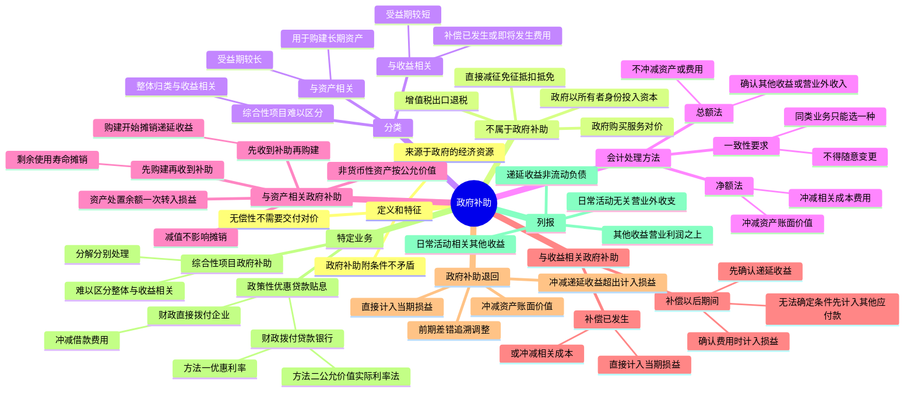

## 1. 章节定位

| 项目 | 信息 |
|------|------|
| 所属科目 | 会计 |
| 难度等级 | 2 |
| 历年分值 | 2-4 分 |
| 建议学时 | 3-4 小时 |
| 知识关联章节 | 第4章 固定资产（政府补助购建长期资产）、第7章 长期股权投资、第13章 金融工具（政策性优惠贷款贴息）、第17章 收入（区分政府补助与收入）、第19章 所得税（政府补助产生的暂时性差异） |

## 2. 考情分析

本章是会计科目的基础章节，历年分值约 2-4 分，主要以客观题和主观题中的部分业务为考查形式。本章内容相对集中，核心在于政府补助的定义判断、分类以及总额法与净额法的会计处理。

**命题规律**：本章主观题常以企业收到各种财政拨款、税收返还等业务为载体，要求考生判断是否属于政府补助、分类处理并完成会计分录；客观题则集中在定义辨析、分类标准和列报要求。

**高频考点分布**：

1. **政府补助的定义和特征**：来源于政府的经济资源、无偿性（不需要向政府交付商品或服务等对价）；政府补助附有条件与无偿性不矛盾。
2. **不属于政府补助的情形**：直接减征、免征、增加计税抵扣额、抵免部分税额等方式的税收优惠；增值税出口退税；政府以企业所有者身份投入资本；政府购买服务的对价（如新能源汽车补贴、高效照明产品补贴等）。
3. **政府补助的分类**：与资产相关的政府补助（用于购建或以其他方式形成长期资产）、与收益相关的政府补助（补偿已发生或即将发生的费用或损失）；综合性项目难以区分的，整体归类为与收益相关。
4. **总额法与净额法**：总额法将政府补助金额确认为收益（其他收益或营业外收入），不作为相关资产账面价值或费用的扣减；净额法将政府补助作为相关资产账面价值或所补偿费用的扣减。同一企业对同类或类似政府补助业务只能选用一种方法，不得随意变更。
5. **与资产相关的政府补助**：先收到补助资金再购建长期资产、先购建长期资产再收到补助资金的递延收益摊销起点；资产减值不影响递延收益摊销；资产处置时未摊销递延收益余额一次性转入损益。
6. **与收益相关的政府补助**：用于补偿以后期间的成本费用或损失（先确认递延收益，再在确认费用时计入损益）；用于补偿已发生的成本费用或损失（直接计入当期损益或冲减相关成本）。
7. **政府补助的退回**：三种处理情况（调整资产账面价值、冲减递延收益超出部分计入当期损益、直接计入当期损益）；前期差错追溯调整。
8. **政策性优惠贷款贴息**：财政将贴息资金拨付给贷款银行（两种方法选择）、财政将贴息资金直接拨付给受益企业（冲减相关借款费用）。
9. **政府补助的列报**：递延收益作为非流动负债单独列示；其他收益在营业利润之上单独列报；与企业日常活动无关的政府补助在营业外收支列报。

**联动考查方式**：
- 与所得税结合：政府补助产生的暂时性差异的所得税影响；
- 与收入结合：区分政府补助与收入（如新能源汽车补贴、高效照明产品补贴等属于对价组成部分的，按收入准则处理）；
- 与固定资产结合：政府补助购建长期资产的折旧处理；
- 与差错更正结合：错用总额法/净额法、错将政府补助计入营业外收入等。

**备考建议**：
- 牢记政府补助的两个核心特征：来源于政府的经济资源 + 无偿性；
- 区分"政府补助"与"政府购买服务"、"政府投资"、"税收优惠"的边界；
- 掌握总额法与净额法的核心区别：总额法确认收益（其他收益/营业外收入），净额法冲减资产账面价值或费用；
- 注意与资产相关和与收益相关的政府补助在递延收益摊销时点上的差异；
- 区分与企业日常活动相关（计入其他收益或冲减相关成本费用）和无关（计入营业外收支）的政府补助。

## 3. 知识框架

## 4. 核心精讲

### 4.1 政府补助概述

#### 4.1.1 政府补助的定义

根据《企业会计准则第 16 号——政府补助》的规定，**政府补助**是指企业从政府无偿取得货币性资产或非货币性资产。例如，政府对企业的无偿拨款，先征后返（退）、即征即退等方式的税收返还，直接向企业拨付财政贴息，以及无偿给予非货币性资产等。

**不属于政府补助的情形**：

1. **不涉及资产直接转移的经济支持**不属于政府补助。例如，直接减征、免征、增加计税抵扣额、抵免部分税额等方式的税收优惠，不适用《企业会计准则第 16 号——政府补助》。与所得税减免相关的，适用《企业会计准则第 18 号——所得税》。
2. **政府以企业所有者身份向企业投入资本**，享有相应的所有者权益，政府与企业之间是投资者与被投资者的关系，属于互惠交易，不属于政府补助。
3. **政府购买服务所支付的对价**。企业从政府取得的经济资源，如果与企业销售商品或提供劳务等活动密切相关，且来源于政府的经济资源是企业商品或服务的对价或者是对价的组成部分，应当按照收入准则的规定进行会计处理，不适用政府补助准则。
4. **增值税出口退税**不属于政府补助。根据税法规定，在对出口货物取得的收入免征增值税的同时，退付出口货物前道环节发生的进项税额，增值税出口退税实际上是政府退回企业事先垫付的进项税，所以不属于政府补助。

**例外情形**：虽然不涉及资产直接转移，但仍纳入政府补助准则范围的情况：一是企业取得政策性优惠贷款贴息且财政将贴息资金拨付给贷款银行的情况；二是部分减免税款需要按照政府补助准则进行会计处理。例如，属于一般纳税人的加工型企业根据税法规定招用自主就业退役士兵，并按定额扣减增值税的，应当将减征的税额计入当期损益，借记"应交税费——应交增值税（减免税款）"科目，贷记"其他收益"科目；即征即退的增值税，先按规定缴纳增值税，然后根据退回的增值税税额，借记"银行存款"等科目，贷记"其他收益"科目。企业超比例安排残疾人就业或者为安排残疾人就业作出显著成绩，按规定收到的奖励，记入"其他收益"科目。

#### 4.1.2 政府补助的特征

政府补助具有如下特征：

**（1）政府补助是来源于政府的经济资源**

政府主要指行政事业单位及类似机构。对企业收到的来源于其他方的补助，如有确凿证据表明政府是补助的实际拨付者，其他方只是起到代收代付的作用，则该项补助也属于来源于政府的经济资源。例如，某集团公司母公司收到一笔政府补助款，有确凿证据表明该补助款实际的补助对象为该母公司下属子公司，母公司只是起到代收代付作用，在这种情况下，该补助款属于对子公司的政府补助。

**（2）政府补助是无偿的**

无偿性是政府补助的基本特征，即企业取得来源于政府的经济资源，不需要向政府交付商品或服务等对价。这一特征将政府补助与政府作为企业所有者投入的资本、政府购买服务等互惠性交易区别开来。需要说明的是，政府补助通常附有一定条件，这与政府补助的无偿性并无矛盾，只是政府为了推行其宏观经济政策，对企业使用政府补助的时机、范围和方向进行了限制。

**判断要点**：企业从政府取得的经济资源，如果与企业销售商品或提供劳务等活动密切相关，且来源于政府的经济资源是企业商品或服务的对价或者是对价的组成部分，应按收入准则处理。例如，新能源汽车厂商通常以低于成本的价格销售新能源汽车，是考虑了其能够从政府取得的补贴。中央和地方财政补贴实质上是为消费者购买新能源汽车承担和支付了部分销售价款，该补贴与其销售新能源汽车密切相关，且是新能源汽车销售对价的组成部分，应属于新能源汽车厂商销售新能源汽车的收入，按收入准则处理。

### 4.2 政府补助的分类

确定了来源于政府的经济利益属于政府补助后，还应当对其进行恰当的分类。根据政府补助准则规定，政府补助应当划分为与资产相关的政府补助和与收益相关的政府补助，这是因为两类政府补助给企业带来经济利益或者弥补相关成本或费用的形式不同，从而在具体账务处理上存在差别。

**（1）与资产相关的政府补助**

与资产相关的政府补助，是指企业取得的、用于购建或以其他方式形成长期资产的政府补助。通常情况下，相关补助文件会要求企业将补助资金用于取得长期资产。长期资产将在较长的期间内给企业带来经济利益，因此相应的政府补助的受益期也较长。

**（2）与收益相关的政府补助**

与收益相关的政府补助，是指除与资产相关的政府补助之外的政府补助。此类补助主要是用于补偿企业已发生或即将发生的费用或损失。受益期相对较短，所以通常在满足补助所附条件时计入当期损益或冲减相关成本。

例如，甲公司租赁某物业，租赁期为 5 年，每 3 个月支付一次租金。为支持甲公司经营发展，当地政府为其提供租金扶持补贴。本例中，甲公司收到的政府补助在性质上为政府对企业所付物业租金的补贴，弥补的是企业相关期间的租赁成本费用，不符合与资产相关的政府补助的定义，因此属于与收益相关的政府补助。

**综合性项目政府补助**：同时包含与资产相关和与收益相关的，企业应当采用合理的方法将其进行分解并分别进行会计处理；确实难以区分的，企业应当将其整体归类为与收益相关的政府补助进行处理。

### 4.3 政府补助的会计处理方法

#### 4.3.1 确认和计量

政府补助同时满足下列条件的，才能予以确认：一是企业能够满足政府补助所附条件；二是企业能够收到政府补助。

**判断企业能够收到政府补助**，应着眼于分析和落实企业能够符合财政扶持政策规定的相关条件且预计能够收到财政扶持资金的"确凿证据"，例如：关注政府补助的发放主体是否具备相应的权力和资质，补助文件中引用的政策依据是否适用，申请政府补助的流程是否合法合规，是否已经履行完毕补助文件中的要求，实际收取资金前是否需要政府部门的实质性审核，同类型政府补助过往实际发放情况，补助文件是否有明确的支付时间，政府是否具备履行支付义务的能力等因素。

**计量**：

- 政府补助为货币性资产的，应当按照收到或应收的金额计量。如果企业已经实际收到补助资金，应当按照实际收到的金额计量；如果资产负债表日企业尚未收到补助资金，但企业在符合了相关政策规定后获得了收款权，且与之相关的经济利益很可能流入企业，企业应当在这项补助成为应收款时按照应收的金额计量。
- 政府补助为非货币性资产的，应当按照公允价值计量；公允价值不能可靠取得的，按照名义金额（1 元）计量。

#### 4.3.2 总额法与净额法

政府补助有两种会计处理方法：

| 方法 | 定义 | 处理方式 |
|------|------|---------|
| 总额法 | 在确认政府补助时将政府补助金额确认为收益，而不是作为相关资产账面价值或者费用的扣减 | 确认其他收益或营业外收入 |
| 净额法 | 将政府补助作为相关资产账面价值或所补偿费用的扣减 | 冲减资产账面价值或相关成本费用 |

根据《企业会计准则——基本准则》的要求，同一企业不同时期发生的相同或者相似的交易或者事项，应当采用一致的会计政策，不得随意变更。确需变更的，应当在附注中说明。企业应当根据经济业务的实质，判断某一类政府补助业务应当采用总额法还是净额法，通常情况下，对同类或类似政府补助业务只能选用一种方法，同时，企业对该业务应当一贯地运用该方法，不得随意变更。

**与日常活动相关性的判断**：与企业日常活动相关的政府补助，应当按照经济业务实质，计入其他收益或冲减相关成本费用。与企业日常活动无关的政府补助，计入营业外收支。通常情况下，若政府补助补偿的成本费用是营业利润之中的项目，或该补助与日常销售等经营行为密切相关（如增值税即征即退等），则认为该政府补助与日常活动相关。企业选择总额法对与日常活动相关的政府补助进行会计处理的，应在"其他收益"科目进行核算。

### 4.4 与资产相关的政府补助

#### 4.4.1 总额法

实务中，企业通常先收到补助资金，再按照政府要求将补助资金用于购建固定资产或无形资产等长期资产。企业在收到补助资金时，按照补助资金的金额借记"银行存款"等科目，贷记"递延收益"科目；然后在相关资产使用寿命内按合理、系统的方法分期计入损益。

**递延收益摊销的起点**：

- **先收到补助资金，再购建长期资产**：应当在开始对相关资产计提折旧或摊销时开始将递延收益分期计入损益；
- **先开始购建长期资产，再收到补助资金**：应当在相关资产的剩余使用寿命内按照合理、系统的方法将递延收益分期计入损益。

**重要规定**：

1. 如果对应的长期资产在持有期间发生减值损失，递延收益的摊销仍保持不变，不受减值因素的影响。
2. 企业对与资产相关的政府补助选择总额法后，为避免出现前后方法不一致的情况，结转递延收益时不得冲减相关成本费用，而是将递延收益分期转入其他收益或营业外收入，借记"递延收益"科目，贷记"其他收益"（与企业日常活动相关的政府补助）或"营业外收入"（与企业日常活动无关的政府补助）科目。
3. 相关资产在使用寿命结束时或结束前被处置（出售、转让、报废等），尚未分摊的递延收益余额应当一次性转入资产处置当期的损益，不再予以递延。

#### 4.4.2 净额法

按照补助资金的金额冲减相关资产账面价值。如果企业先取得与资产相关的政府补助，再确认所购建的长期资产的，净额法下应当将取得的政府补助先确认为递延收益，在相关资产达到预定可使用状态或预定用途时将递延收益冲减相关资产的账面价值，并按照扣减了政府补助后的账面价值和相关资产的剩余使用寿命计提折旧或进行摊销。

#### 4.4.3 非货币性资产政府补助

实务中存在政府无偿给予企业长期非货币性资产的情况，如无偿给予的土地使用权和天然起源的天然林等。企业取得的政府补助为非货币性资产的，应当按照公允价值计量；公允价值不能可靠取得的，按照名义金额（1 元）计量。

企业在收到非货币性资产的政府补助时，应当按照公允价值借记有关资产科目，贷记"递延收益"科目，在相关资产使用寿命内按合理、系统的方法分期计入损益，借记"递延收益"科目，贷记"其他收益"或"营业外收入"科目。但是对以名义金额（1 元）计量的政府补助，在取得时计入当期损益。

### 4.5 与收益相关的政府补助

对于与收益相关的政府补助，企业应当选择采用总额法或净额法进行会计处理。选择总额法的，应当计入其他收益或营业外收入。选择净额法的，应当冲减相关成本费用或营业外支出。

#### 4.5.1 用于补偿企业以后期间的相关成本费用或损失

用于补偿企业以后期间的相关成本费用或损失的，在收到时应当先判断企业能否满足政府补助所附条件。客观情况通常表明企业能够满足政府补助所附条件，企业应当将补助确认为递延收益，并在确认相关费用或损失的期间，计入当期损益或冲减相关成本。

**特殊情形**：如果企业在收到补助资金时暂时无法确定能否满足政府补助所附条件，则应当将收到的补助资金先记入"其他应付款"科目，待客观情况表明企业能够满足政府补助所附条件后再转入"递延收益"科目。

#### 4.5.2 用于补偿企业已发生的相关成本费用或损失

用于补偿企业已发生的相关成本费用或损失的，直接计入当期损益或冲减相关成本。这类补助通常与企业已经发生的行为有关，是对企业已发生的成本费用或损失的补偿，或是对企业过去行为的奖励。

例如：①软件企业即征即退增值税属于与企业的日常销售密切相关，属于与企业日常活动相关的政府补助。企业在申请退税并确定了增值税退税额时，借记"其他应收款"科目，贷记"其他收益"科目。②企业遭受重大自然灾害收到的政府补助资金，与企业日常活动无关，选择总额法的，借记"银行存款"科目，贷记"营业外收入"科目。③对使用燃料油、石脑油生产乙烯芳烃的企业，按实际耗用数量退还所含消费税的，企业应根据当期产量及所购原料供应商的消费税证明，申请退还相应的消费税，在期末结转存货成本和主营业务成本之前，借记"其他应收款"科目，贷记"生产成本"科目（净额法冲减相关成本）。

### 4.6 政府补助的退回

已计入损益的政府补助需要退回的，应当在需要退回的当期分情况按照以下规定进行会计处理：

| 情形 | 会计处理 |
|------|---------|
| 初始确认时冲减相关资产账面价值的（净额法） | 调整资产账面价值 |
| 存在相关递延收益的（总额法，递延收益尚有余额） | 冲减相关递延收益账面余额，超出部分计入当期损益 |
| 属于其他情况的 | 直接计入当期损益 |

此外，对于属于前期差错的政府补助退回，应当按照前期差错更正进行追溯调整。

**例题解析**：承例 18-5，假设 2×19 年 5 月，有关部门在对丁企业的检查中发现，丁企业不符合申请补助的条件，要求丁企业退回补助款 210 万元。

- **总额法**：应当结转递延收益，并将超出部分计入当期损益。因为以前期间计入其他收益，所以这部分返回的补助冲减应返回当期的其他收益。借记"递延收益"189 万元、"其他收益"21 万元，贷记"银行存款"210 万元。
- **净额法**：应当视同一开始就没有收到政府补助，调整固定资产的账面价值，将实际退回金额与账面价值调整数之间的差额计入当期其他收益。借记"固定资产"210 万元、"其他收益"21 万元，贷记"银行存款"210 万元、"累计折旧"21 万元。

### 4.7 特定业务的会计处理

#### 4.7.1 综合性项目政府补助

综合性项目政府补助同时包含与资产相关的政府补助和与收益相关的政府补助，企业应当采用合理的方法将其进行分解并分别进行会计处理；确实难以区分的，企业应当将其整体归类为与收益相关的政府补助进行处理。

分解方法：根据补助文件中明确指定的用途和金额进行分解。例如，某市科技创新委员会对乙企业的新药临床研究项目提供研究补助资金 200 万元，其中设备费 60 万元、材料费 15 万元、测试化验加工费 95 万元、差旅费 10 万元、会议费 5 万元、专家咨询费 8 万元、管理费用 7 万元。除设备费外的其他各项费用都计入研究支出。则设备费 60 万元部分属于与资产相关的政府补助（用于购建固定资产），其余 140 万元属于与收益相关的政府补助。

#### 4.7.2 政策性优惠贷款贴息

政策性优惠贷款贴息是政府为支持特定领域或领域发展，根据国家宏观经济形势和政策目标，对承贷企业的银行借款利息给予的补贴。企业取得政策性优惠贷款贴息的，应当区分财政将贴息资金拨付给贷款银行和财政将贴息资金直接拨付给受益企业两种情况，分别进行会计处理。

**（1）财政将贴息资金拨付给贷款银行**

在财政将贴息资金拨付给贷款银行的情况下，由贷款银行以政策性优惠利率向企业提供贷款。这种方式下，受益企业按照优惠利率向贷款银行支付利息，没有直接从政府取得利息补助，企业可以选择下列方法之一进行会计处理：

| 方法 | 入账价值 | 借款费用计算 | 差额处理 |
|------|---------|-------------|---------|
| 方法一 | 以实际收到的金额作为借款的入账价值 | 按照借款本金和该政策性优惠利率计算借款费用 | 无差额 |
| 方法二 | 以借款的公允价值作为借款的入账价值 | 按照实际利率法计算借款费用 | 实际收到金额与借款公允价值之间的差额确认为递延收益，递延收益在借款存续期内采用实际利率法摊销，冲减相关借款费用 |

企业选择了上述两种方法之一后，应当一致地运用，不得随意变更。在这种情况下，向企业发放贷款的银行并不是受益主体，其仍然按照市场利率收取利息，只是一部分利息来自企业，另一部分利息来自财政贴息。所以金融企业发挥的是中介作用，并不需要确认与贷款相关的递延收益。

**（2）财政将贴息资金直接拨付给受益企业**

财政将贴息资金直接拨付给受益企业，企业先按照同类贷款市场利率向银行支付利息，财政部门定期与企业结算贴息。在这种方式下，由于企业先按照同类贷款市场利率向银行支付利息，所以实际收到的借款金额通常就是借款的公允价值，企业应当将对应的贴息冲减相关借款费用。

会计处理：企业按月计提利息时，按照市场利率计算应向银行支付的利息金额，借记"在建工程"等科目，贷记"应付利息"科目；同时，按照应收政府贴息金额，借记"其他应收款"科目，贷记"在建工程"等科目（冲减相关借款费用）。

### 4.8 政府补助的列报

#### 4.8.1 在财务报表上的列示

计入递延收益的政府补助在资产负债表作为非流动负债，在"递延收益"项目中单独列示。

企业应当在利润表中的"营业利润"项目之上单独列报"其他收益"项目，计入其他收益的政府补助在该项目中反映。冲减相关成本费用的政府补助，在相关成本费用项目中反映。与企业日常经营活动无关的政府补助，在利润表的营业外收支项目中列报。

#### 4.8.2 附注披露

因政府补助涉及递延收益、其他收益、营业外收入以及成本费用等多个报表项目，为了全面反映政府补助情况，企业应当在附注中单独披露与政府补助有关的下列信息：

1. 政府补助的种类、金额和列报项目；
2. 计入当期损益的政府补助金额；
3. 本期退回的政府补助金额及原因。

## 5. 典型例题

**【例题 1】（与资产相关的政府补助——总额法与净额法）**

按照国家有关政策，企业购置环保设备可以申请补贴以补偿其环保支出。丁企业于 2×18 年 1 月向政府有关部门提交了 210 万元的补助申请，作为对其购置环保设备的补贴。2×18 年 3 月 15 日，丁企业收到了政府补贴款 210 万元。2×18 年 4 月 20 日，丁企业购入不需安装环保设备，实际成本为 480 万元，使用寿命 10 年，采用直线法计提折旧（不考虑净残值）。2×26 年 4 月，丁企业的这台设备发生毁损。不考虑相关税费。

要求：分别采用总额法和净额法编制丁企业的账务处理。

**答案**：

**方法一：总额法**

（1）2×18 年 3 月 15 日实际收到财政拨款，确认递延收益：

借：银行存款 2 100 000

　　贷：递延收益 2 100 000

（2）2×18 年 4 月 20 日购入设备：

借：固定资产 4 800 000

　　贷：银行存款 4 800 000

（3）自 2×18 年 5 月起每月月末计提折旧，同时分摊递延收益：

月折旧额 = 4 800 000 ÷ 10 ÷ 12 = 40 000（元）

月递延收益摊销额 = 2 100 000 ÷ 10 ÷ 12 = 17 500（元）

借：制造费用 40 000

　　贷：累计折旧 40 000

借：递延收益 17 500

　　贷：其他收益 17 500

（4）2×26 年 4 月设备毁损，同时转销递延收益余额：

①设备毁损（已计提折旧 8 年 = 96 个月）：

累计折旧 = 40 000 × 96 = 3 840 000（元）

固定资产账面价值 = 4 800 000 − 3 840 000 = 960 000（元）

借：固定资产清理 960 000

　　累计折旧 3 840 000

　　贷：固定资产 4 800 000

借：营业外支出 960 000

　　贷：固定资产清理 960 000

②转销递延收益余额（已摊销 96 个月）：

递延收益余额 = 2 100 000 − 17 500 × 96 = 2 100 000 − 1 680 000 = 420 000（元）

借：递延收益 420 000

　　贷：固定资产清理 420 000

借：固定资产清理 420 000

　　贷：营业外收入 420 000

**方法二：净额法**

（1）2×18 年 3 月 15 日实际收到财政拨款：

借：银行存款 2 100 000

　　贷：递延收益 2 100 000

（2）2×18 年 4 月 20 日购入设备，同时冲减资产账面价值：

借：固定资产 4 800 000

　　贷：银行存款 4 800 000

借：递延收益 2 100 000

　　贷：固定资产 2 100 000

固定资产净额 = 4 800 000 − 2 100 000 = 2 700 000（元）

（3）自 2×18 年 5 月起每月月末计提折旧：

月折旧额 = 2 700 000 ÷ 10 ÷ 12 = 22 500（元）

借：制造费用 22 500

　　贷：累计折旧 22 500

（4）2×26 年 4 月设备毁损（已计提折旧 96 个月）：

累计折旧 = 22 500 × 96 = 2 160 000（元）

固定资产账面价值 = 2 700 000 − 2 160 000 = 540 000（元）

借：固定资产清理 540 000

　　累计折旧 2 160 000

　　贷：固定资产 2 700 000

借：营业外支出 540 000

　　贷：固定资产清理 540 000

**解析**：总额法下递延收益在资产使用寿命内分期摊销计入其他收益，资产处置时尚未摊销的递延收益余额一次性转入损益（先贷记"固定资产清理"再转入"营业外收入"）；净额法下递延收益直接冲减资产账面价值，按冲减后的账面价值计提折旧。两种方法下最终对损益的净影响一致。

**【例题 2】（综合性项目政府补助的分解处理）**

2×13 年 6 月 15 日，某市科技创新委员会与乙企业签订了科技计划项目合同书，拟对乙企业的新药临床研究项目提供研究补助资金 200 万元。其中设备费 60 万元，材料费 15 万元，测试化验加工费 95 万元，差旅费 10 万元，会议费 5 万元，专家咨询费 8 万元，管理费用 7 万元（除设备费外的其他各项费用都计入研究支出）。乙企业于 2×13 年 7 月 10 日收到补助资金，于 2×13 年 7 月 25 日购置了相关设备，设备成本 150 万元（其中使用补助资金 60 万元），该设备使用年限为 10 年，采用直线法计提折旧（不考虑净残值）。假设乙企业对收到的与资产相关的政府补助选择净额法进行会计处理。不考虑相关税费。

要求：编制乙企业的账务处理。

**答案**：

本例中，乙企业收到的政府补助是综合性项目政府补助，其中设备费 60 万元属于与资产相关的政府补助，其余 140 万元属于与收益相关的政府补助。

（1）2×13 年 7 月 10 日乙企业实际收到补贴资金时：

借：银行存款 2 000 000

　　贷：递延收益 2 000 000

（2）2×13 年 7 月 25 日购入设备：

借：固定资产 1 500 000

　　贷：银行存款 1 500 000

借：递延收益 600 000

　　贷：固定资产 600 000

固定资产净额 = 1 500 000 − 600 000 = 900 000（元）

（3）自 2×13 年 8 月起每月月末计提折旧，折旧费用计入研发支出：

月折旧额 = 900 000 ÷ 10 ÷ 12 = 7 500（元）

借：研发支出 7 500

　　贷：累计折旧 7 500

（4）对其他与收益相关的政府补助（140 万元），乙企业应当按照相关经济业务的实质确定是计入其他收益还是冲减相关成本费用，在企业按规定用途实际使用补助资金时计入损益，或者在实际使用的当期期末根据当期累计使用的金额计入损益，借记"递延收益"科目，贷记有关损益科目。

**解析**：综合性项目政府补助需要将补助资金中用于购建长期资产的部分（设备费 60 万元）分解为与资产相关的政府补助，其余部分（140 万元）作为与收益相关的政府补助，分别采用不同的会计处理方法。

**【例题 3】（政策性优惠贷款贴息）**

2×15 年 1 月 1 日，丙企业向银行贷款 1 000 000 元，期限 2 年，按月计息，按季度付息，到期一次还本。由于这笔贷款资金将被用于国家扶持产业，符合财政贴息的条件，所以贷款利率显著低于丙企业取得同类贷款的市场利率。假设丙企业取得同类贷款的年市场利率为 9%，丙企业与银行签订的贷款合同约定的年利率为 3%，丙企业按季度向银行支付贷款利息，财政按年向银行拨付贴息资金。贷款期间的利息费用满足资本化条件，计入相关在建工程的成本。

要求：说明丙企业在财政将贴息资金拨付给贷款银行方式下的两种会计处理方法。

**答案**：

**方法一：以实际收到的金额作为借款的入账价值，按照借款本金和该政策性优惠利率计算借款费用。**

（1）2×15 年 1 月 1 日，丙企业取得银行贷款：

借：银行存款 1 000 000

　　贷：长期借款——本金 1 000 000

（2）每月月末，丙企业按月计提利息，企业实际承担的利息支出为：

1 000 000 × 3% ÷ 12 = 2 500（元）

借：在建工程 2 500

　　贷：应付利息 2 500

**方法二：以借款的公允价值作为借款的入账价值并按照实际利率法计算借款费用，实际收到的金额与借款公允价值之间的差额确认为递延收益，递延收益在借款存续期内采用实际利率法摊销，冲减相关借款费用。**

借款的公允价值（按月市场利率 0.75% 折现的现值）= 890 554（元）

递延收益 = 1 000 000 − 890 554 = 109 446（元）

（1）2×15 年 1 月 1 日，丙企业取得银行贷款：

借：银行存款 1 000 000

　　长期借款——利息调整 109 446

　　贷：长期借款——本金 1 000 000

　　　　递延收益 109 446

（2）2×15 年 1 月 31 日，丙企业按月计提利息（以第一个月为例）：

实际利息（按市场利率计算）= 890 554 × 0.75% = 6 679（元）

借：在建工程 6 679

　　贷：应付利息 2 500

　　　　长期借款——利息调整 4 179

同时，摊销递延收益：

借：递延收益 4 179

　　贷：在建工程 4 179

**解析**：两种方法下，计入在建工程的利息支出最终一致，均为 2 500 元/月。方法一较为简便，按优惠利率直接计算；方法二按公允价值入账并采用实际利率法摊销递延收益，较为复杂但更符合交易的经济实质。企业选择其中一种方法后应当一致运用，不得随意变更。

## 6. 记忆口诀

**政府补助两特征**："来源于政府的经济资源 + 无偿性"——两个特征同时具备。

**不属于政府补助**："税收优惠不转移、出口退税退垫付、政府投资是互惠、政府购买是收入"——四种不属于政府补助的情形。

**政府补助分类**："用于购建长期资产是与资产相关，补偿费用损失是与收益相关，综合性项目难以区分整体归收益"。

**总额法 vs 净额法**："总额法确认收益（其他收益/营业外收入），净额法冲减资产或费用"——核心区别。

**与资产相关递延收益摊销**："先收到补助再购建，购建开始才摊销；先购建再收到补助，剩余寿命来摊销；减值不影响摊销，处置余额一次转"。

**与收益相关政府补助**："补偿以后先递延，确认费用再转损益；补偿已发生直接进损益或冲减成本"。

**无法确定能否满足条件**："先记其他应付款，确定后转递延收益"。

**政府补助退回三情况**："净额法调资产账面，总额法冲递延收益超出进损益，其他直接进损益；前期差错要追溯"。

**综合性项目政府补助**："能分解分别处理，难区分整体归收益"。

**政策性贷款贴息两方式**："拨给银行两方法（优惠利率法、公允价值实际利率法），拨给企业冲减借款费用"。

**日常活动相关判断**："补偿营业利润项目或与日常经营密切相关（如即征即退）为相关"。

**列报位置**："递延收益非流动负债，其他收益营业利润之上，日常活动无关进营业外收支"。

**一致性要求**："同类业务只能选一种方法，一贯运用不得随意变更"。
