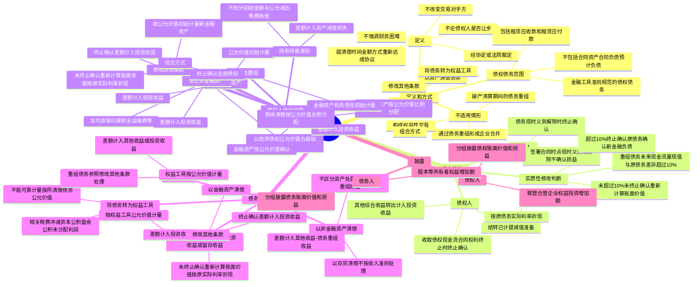

## 📍 章节定位

| 项目 | 信息 |
|------|------|
| **所属科目** | 📒 会计 |
| **难度等级** | ⭐⭐ |
| **历年分值** | 2-3分 |
| **建议学时** | 3-4h |

## 📝 考情分析

本章是会计科目的基础章节，历年分值约 2-3 分，常以客观题和计算分析题形式考查，命题热点集中在：

1. **债务重组的定义**：在不改变交易对手方的情况下，经债权人和债务人协定或法院裁定，就清偿债务的时间、金额或方式等重新达成协议的交易。债务重组不强调在债务人发生财务困难的背景下进行，也不论债权人是否作出让步。
2. **债务重组的方式**：以资产清偿债务、将债务转为权益工具、修改其他条款、组合方式。
3. **债权和债务的终止确认**：债权人在收取债权现金流量的合同权利终止时终止确认债权；债务人在债务的现时义务解除时终止确认债务。实质性修改的判断（现值差异超过 10%）。
4. **债权人的会计处理**：受让金融资产以公允价值计量，差额计入投资收益；受让非金融资产以放弃债权公允价值为基础确定成本，差额计入投资收益；受让多项资产按公允价值比例分配。
5. **债务人的会计处理**：以金融资产清偿的差额计入投资收益；以非金融资产清偿的差额计入其他收益-债务重组收益；将债务转为权益工具的差额计入投资收益。
6. **权益性交易的判断**：债权人直接或间接对债务人持股且以股东身份进行债务重组，或双方受同一方最终控制且实质为权益性分配或投入的，不确认债务重组相关损益。
7. **组合方式的会计处理**：一般可以认为对全部债权的合同条款作出了实质性修改，终止确认全部债权。

考生需重点掌握：债务重组**不强调财务困难、不论是否让步**；以非金融资产清偿债务的差额计入**其他收益-债务重组收益**，以金融资产清偿或将债务转为权益工具的差额计入**投资收益**；实质性修改的判断标准为重组债务未来现金流量现值与原债务剩余期间现金流量现值的差异**超过 10%**（按原债务实际利率折现）；构成权益性交易的部分**不确认损益**。

## 🧠 知识框架

## 📖 核心精讲

### 一、债务重组的定义和方式

#### （一）债务重组的定义

**债务重组**是指在不改变交易对手方的情况下，经债权人和债务人协定或法院裁定，就清偿债务的时间、金额或方式等重新达成协议的交易。

理解定义需注意以下要点：

1. **不改变交易对手方**：债务重组是在不改变交易对手方的情况下进行的交易。涉及第三方参与的情形（如第三方代偿、新公司承接债务、资产管理公司购得债权后再重组），应先考虑债权和债务是否终止确认，再就债务重组交易适用债务重组准则。
2. **不强调财务困难，不论是否让步**：无论何种原因导致债务人未按原定条件偿还债务，也无论双方是否同意债务人以低于债务的金额偿还债务，只要双方就债务条款重新达成协议，即符合债务重组定义。
3. **债权和债务的范围**：指金融工具准则规范的债权和债务，**不包括**合同资产、合同负债、预计负债，但**包括**租赁应收款和租赁应付款。

#### （二）不适用债务重组准则的情形

| 情形 | 适用准则 |
|------|---------|
| 破产清算期间的债务重组 | 企业破产清算有关会计处理规定 |
| 通过债务重组形成企业合并 | 企业合并准则 |
| 构成权益性交易 | 权益性交易的有关会计处理规定，不确认损益 |

**权益性交易的认定**：
- 债权人直接或间接对债务人持股，或债务人直接或间接对债权人持股，且持股方以股东身份进行债务重组；
- 债权人与债务人在债务重组前后均受同一方或相同的多方最终控制，且交易实质是权益性分配或权益性投入。

> **部分权益性交易的处理**：债务重组中不属于权益性交易的部分仍然应当确认债务重组相关损益。如股东债权人比其他债权人多豁免的部分作为权益性交易，与其他债权人同等豁免的部分确认债务重组损益。

#### （三）债务重组的方式

| 方式 | 含义 |
|------|------|
| **以资产清偿债务** | 债务人转让其资产给债权人以清偿债务（现金、应收账款、长期股权投资、固定资产、存货等） |
| **将债务转为权益工具** | 债务人将债务转为根据金融工具列报准则分类为"权益工具"的金融工具（股本、实收资本、资本公积等） |
| **修改其他条款** | 调整债务本金、改变债务利息、变更还款期限等，形成重组债权和重组债务 |
| **组合方式** | 三种方式中一种以上方式的组合 |

> **注意**：名义上"债转股"但附加回购义务、强制分红权等条款的，可能不属于权益工具，不适用将债务转为权益工具的债务重组方式。

### 二、债权和债务的终止确认

#### （一）终止确认原则

- **债权人**：在收取债权现金流量的合同权利终止时终止确认债权。对于终止确认的债权，应结转已计提的减值准备中对应终止确认部分的金额；对于分类为以公允价值计量且其变动计入其他综合收益的债权，之前计入其他综合收益的累计利得或损失应转出计入"投资收益"。
- **债务人**：在债务的现时义务解除时终止确认债务。在签署债务重组合同的时点，如果债务的现时义务尚未解除，债务人**不能确认**债务重组相关损益。

> **资产负债表日后事项**：对于在报告期间已经开始协商，但在报告期资产负债表日后完成的债务重组，**不属于**资产负债表日后调整事项。

#### （二）实质性修改的判断——10% 标准

对于修改其他条款方式，需判断是否构成"实质性修改"：

| 情形 | 处理 |
|------|------|
| 重组债务未来现金流量（包括支付和收取的某些费用）现值与原债务剩余期间现金流量现值之间的差异**超过 10%** | 视为实质性修改，终止确认原债务，按修改后条款确认新金融负债/新金融资产 |
| 差异**未超过 10%** | 未终止确认，重新计算重组债权/债务的账面余额/账面价值 |

> 现值计算均采用**原债务的实际利率**。购买或源生的已发生信用减值的重组债权，应按经信用调整的实际利率折现。

### 三、债权人的会计处理

#### （一）以资产清偿债务或将债务转为权益工具

**1. 债权人受让金融资产**

- 以**公允价值**初始计量金融资产
- 金融资产确认金额与债权终止确认日账面价值之间的差额，计入**"投资收益"**

**2. 债权人受让非金融资产**

以**放弃债权的公允价值**为基础，加上可直接归属于该资产的税金、运输费、装卸费、保险费等确定成本：

| 受让资产 | 成本构成 |
|---------|---------|
| 存货 | 放弃债权公允价值 + 可直接归属税金、运输费、装卸费、保险费等 |
| 对联营/合营企业投资 | 放弃债权公允价值 + 可直接归属税金等 |
| 投资性房地产 | 放弃债权公允价值 + 可直接归属税金等 |
| 固定资产 | 放弃债权公允价值 + 达到预定可使用状态前的税金、运输费、装卸费、安装费、专业人员服务费等（考虑预计弃置费用） |
| 生物资产 | 放弃债权公允价值 + 可直接归属税金、运输费、保险费等 |
| 无形资产 | 放弃债权公允价值 + 达到预定用途的税金等 |

放弃债权的公允价值与账面价值之间的差额，计入**"投资收益"**。

**3. 债权人受让多项资产**

- 受让的金融资产按公允价值确认
- 受让的非金融资产：按各项非金融资产在债务重组合同生效日的**公允价值比例**，对放弃债权公允价值扣除受让金融资产当日公允价值后的净额进行分配
- 放弃债权公允价值与账面价值的差额，计入**"投资收益"**

**4. 债权人受让处置组**

- 先对处置组中的金融资产和负债进行初始计量
- 再按金融资产以外的各项资产公允价值比例，对放弃债权公允价值 + 承担的处置组负债确认金额 - 受让金融资产公允价值后的净额进行分配
- 放弃债权公允价值与账面价值的差额，计入**"投资收益"**

**5. 划分为持有待售类别**

比较不划分为持有待售情况下的初始计量金额与公允价值减去出售费用后的净额，以**孰低**计量。公允价值减出售费用低于不划分初始金额的差额，计入**"资产减值损失"**。

#### （二）修改其他条款

| 情形 | 处理 |
|------|------|
| 修改导致全部债权终止确认 | 按修改后条款以公允价值初始计量新金融资产，确认金额与债权终止确认日账面价值的差额计入"投资收益" |
| 修改未导致债权终止确认 | 根据分类继续后续计量；以摊余成本计量的，按重新议定合同现金流量按**原实际利率**折现的现值重新计算账面余额，相关利得或损失计入"投资收益" |

#### （三）组合方式

一般可以认为对全部债权的合同条款作出了实质性修改：
- 终止确认全部债权
- 按修改后条款以公允价值初始计量新金融资产和受让的非金融资产
- 放弃债权公允价值与账面价值的差额，计入**"投资收益"**

### 四、债务人的会计处理

#### （一）债务人以资产清偿债务

**1. 以金融资产清偿债务**

- 债务账面价值与偿债金融资产账面价值的差额，计入**"投资收益"**
- 分类为以公允价值计量且其变动计入其他综合收益的债务工具投资，之前累计其他综合收益转出计入"投资收益"
- 指定为以公允价值计量且其变动计入其他综合收益的非交易性权益工具投资，之前累计其他综合收益转出计入**"盈余公积"等留存收益**

**2. 以非金融资产清偿债务**

- **不需要区分**资产处置损益和债务重组损益，也不需要区分不同资产的处置损益
- 所清偿债务账面价值与转让资产账面价值之间的差额，计入**"其他收益-债务重组收益"**
- 以日常活动产出的商品或服务清偿债务的，**不按收入准则**确认为商品或服务的销售处理，差额计入"其他收益-债务重组收益"
- 以包含非金融资产的处置组清偿债务的，所清偿债务和处置组中负债的账面价值之和与处置组中资产账面价值的差额，计入"其他收益-债务重组收益"

> **关键区分**：以金融资产清偿计入"投资收益"；以非金融资产清偿计入"其他收益-债务重组收益"。

#### （二）债务人将债务转为权益工具

- 初始确认权益工具按**权益工具的公允价值**计量
- 权益工具公允价值不能可靠计量的，按**所清偿债务的公允价值**计量
- 所清偿债务账面价值与权益工具确认金额之间的差额，计入**"投资收益"**
- 因发行权益工具支出的相关税费，依次冲减**资本公积（资本溢价或股本溢价）、盈余公积、未分配利润**

#### （三）修改其他条款

| 情形 | 处理 |
|------|------|
| 修改导致债务终止确认 | 按公允价值计量重组债务，终止确认债务账面价值与重组债务确认金额的差额计入"投资收益" |
| 修改未导致债务终止确认 | 继续按原分类后续计量；以摊余成本计量的，按重新议定合同现金流量按**原实际利率**折现的现值重新计算账面价值，相关利得或损失计入"投资收益" |

#### （四）组合方式

- 权益工具按公允价值计量（不能可靠计量按所清偿债务公允价值）
- 修改其他条款形成的重组债务参照"修改其他条款"处理
- 所清偿债务账面价值与转让资产账面价值、权益工具确认金额、重组债务确认金额之和的差额，计入**"其他收益-债务重组收益"**或**"投资收益"**（仅涉及金融工具、长期股权投资时）

> **破产重整的特殊处理**：企业因破产重整进行的债务重组，通常应在破产重整协议**履行完毕后**确认债务重组收益，除非有确凿证据表明重大不确定性已经消除。

## 💡 典型例题

**【例题 1】（基础题，单选题）**

下列关于债务重组的表述中，不正确的是（　　）。
A. 债务重组是指在不改变交易对手方的情况下，经债权人和债务人协定或法院裁定，就清偿债务的时间、金额或方式等重新达成协议的交易
B. 债务重组不强调在债务人发生财务困难的背景下进行，也不论债权人是否作出让步
C. 债务重组涉及的债权和债务包括合同资产、合同负债和预计负债
D. 通过债务重组形成企业合并的，适用企业合并准则

**答案**：C

**解析**：A 正确，符合债务重组的定义；B 正确，债务重组不强调财务困难，不论是否让步；C 错误，债务重组涉及的债权和债务**不包括**合同资产、合同负债、预计负债，但包括租赁应收款和租赁应付款；D 正确，通过债务重组形成企业合并的适用企业合并准则。

**【例题 2】（进阶题，单选题）**

甲公司应付乙公司账款 100 万元，因甲公司无法按期偿还，双方协商进行债务重组。甲公司以一项固定资产（账面价值 70 万元，公允价值 80 万元）清偿债务。乙公司已对该应收账款计提坏账准备 15 万元，该应收账款的公允价值为 85 万元。不考虑相关税费，下列会计处理中正确的是（　　）。

A. 甲公司确认其他收益 30 万元
B. 甲公司确认投资收益 30 万元
C. 乙公司确认投资收益 0 万元
D. 乙公司确认固定资产成本 80 万元

**答案**：A

**解析**：
- 甲公司（债务人）以非金融资产（固定资产）清偿债务，所清偿债务账面价值（100 万元）与转让资产账面价值（70 万元）的差额 30 万元计入"其他收益-债务重组收益"，A 正确，B 错误。
- 乙公司（债权人）受让非金融资产，以放弃债权的公允价值（85 万元）为基础确定固定资产成本，固定资产成本 = 85 万元，D 错误。放弃债权公允价值（85 万元）与债权账面价值（100 - 15 = 85 万元）的差额 0 万元计入投资收益，C 正确但题目要求选"不正确"的，故 C 不选。

本题问"正确的是"，A 正确（甲公司确认其他收益 30 万元）。

**【例题 3】（综合题，计算分析题）**

2×22 年 6 月 18 日，甲公司向乙公司销售商品一批，应收乙公司款项的入账金额为 95 万元。甲公司将该应收款项分类为以摊余成本计量的金融资产，乙公司将该应付账款分类为以摊余成本计量的金融负债。2×22 年 10 月 18 日，双方签订债务重组协议，乙公司以一项作为无形资产核算的非专利技术偿还该欠款。该无形资产的账面余额为 100 万元，累计摊销额为 10 万元，已计提减值准备 2 万元。2×22 年 10 月 22 日，双方办理完成该无形资产转让手续，甲公司支付评估费用 4 万元。当日，甲公司应收款项的公允价值为 87 万元，已计提坏账准备 7 万元，乙公司应付款项的账面价值仍为 95 万元。假设不考虑相关税费。

**要求**：分别编制甲公司和乙公司 2×22 年 10 月 22 日的会计分录。

**答案**：

（1）债权人甲公司的会计处理：

甲公司取得无形资产的成本 = 放弃债权公允价值 87 + 评估费用 4 = 91（万元）

借：无形资产　　　　　　　　　　　910 000
　　坏账准备　　　　　　　　　　　70 000
　　投资收益　　　　　　　　　　　10 000
　贷：应收账款　　　　　　　　　　950 000
　　　银行存款　　　　　　　　　　40 000

（2）债务人乙公司的会计处理：

借：应付账款　　　　　　　　　　　950 000
　　累计摊销　　　　　　　　　　　100 000
　　无形资产减值准备　　　　　　　20 000
　贷：无形资产　　　　　　　　　1 000 000
　　　其他收益-债务重组收益　　　　70 000

**解析**：
- 债权人受让非金融资产（无形资产），以放弃债权公允价值（87 万元）为基础，加上可直接归属的评估费用（4 万元）确定成本（91 万元）。放弃债权公允价值（87 万元）与债权账面价值（95 - 7 = 88 万元）的差额 1 万元计入投资收益（借方）。
- 债务人以非金融资产清偿债务，所清偿债务账面价值（95 万元）与转让资产账面价值（100 - 10 - 2 = 88 万元）的差额 7 万元计入其他收益-债务重组收益。注意债务人不需要区分资产处置损益和债务重组损益。

## 🎯 记忆口诀

**债务重组定义口诀**：
> 不换对手换条款，协定裁定两相安；
> 财务困难非必需，是否让步不纠缠。

**债务人损益科目口诀**：
> 金融资产投资收益，非金资产其他收益；
> 债转股也算投资收益，组合方式看资产类。

**债权人损益科目口诀**：
> 受让资产全记投资收益，无论金融非金融一视同仁；
> 公允价值为基础定成本，差额进投资收益莫记错。

**实质性修改口诀**：
> 十个点来分界限，现值差异超十成实质；
> 原实际利率来折现，超则终止确认新负债。

**权益性交易口诀**：
> 股东身份来重组，同一控制下分配；
> 权益性交易不确认，损益归零要记牢。

## ✅ 同步练习

**1. （单选题）下列各项中，不属于债务重组方式的是（　　）。**

A. 债务人以资产清偿债务
B. 债务人将债务转为权益工具
C. 债权人免除债务人部分债务本金
D. 债务人以发行股票形式取得非货币性资产

**2. （单选题）债务人以非金融资产清偿债务的，所清偿债务账面价值与转让资产账面价值之间的差额，应当计入（　　）。**

A. 投资收益
B. 其他收益-债务重组收益
C. 营业外收入
D. 资产处置损益

**3. （单选题）下列关于债务重组中实质性修改的判断标准，正确的是（　　）。**

A. 重组债务未来现金流量现值与原债务剩余期间现金流量现值之间的差异超过 5%
B. 重组债务未来现金流量现值与原债务剩余期间现金流量现值之间的差异超过 10%
C. 重组债务未来现金流量与原债务剩余期间现金流量之间的差异超过 10%
D. 重组债务未来现金流量现值与原债务剩余期间现金流量现值之间的差异超过 25%

**4. （多选题）下列各项中，构成权益性交易的有（　　）。**

A. 债权人直接对债务人持股，且以股东身份进行债务重组
B. 债权人与债务人在债务重组前后均受同一方最终控制，且交易实质为权益性分配
C. 债务人以日常活动产出的商品清偿债务
D. 债务人将债务转为权益工具

**5. （判断题）债务重组中，债权人在签署债务重组合同的时点即可终止确认债权并确认债务重组相关损益。（　　）**

**6. （计算分析题）** 2×22 年 1 月 1 日，甲公司从乙银行取得贷款 5000 万元，贷款期限 4 年，年利率 6%，按年付息，甲公司以摊余成本计量该贷款。2×22 年 12 月 31 日，甲公司无法偿还贷款本金。2×23 年 1 月 10 日，乙银行同意与甲公司重新达成协议：（1）甲公司以一项固定资产（账面原值 1200 万元，累计折旧 400 万元）抵偿债务本金 1000 万元；（2）甲公司向乙银行增发股票 500 万股（面值 1 元/股，公允价值 4 元/股），用于抵偿债务本金 2000 万元；（3）免除甲公司 500 万元债务本金，剩余 1500 万元展期至 2×23 年 12 月 31 日，年利率 8%。乙银行已计提贷款损失准备 300 万元，该贷款于 2×23 年 1 月 10 日的公允价值为 4600 万元，展期的 1500 万元贷款公允价值为 1500 万元。新借款的现金流量现值 = 1500 × (1+8%)/(1+6%) = 1528.3 万元。要求：判断 1500 万元本金部分的合同条款修改是否构成实质性修改，并说明理由。

📋 参考答案

**1. D**。债务人以发行股票形式取得非货币性资产，相当于以权益工具换入非货币性资产，适用相关资产准则，不属于债务重组。

**2. B**。债务人以非金融资产清偿债务的，不需要区分资产处置损益和债务重组损益，所清偿债务账面价值与转让资产账面价值之间的差额计入"其他收益-债务重组收益"。

**3. B**。重组债务未来现金流量（包括支付和收取的某些费用）现值与原债务的剩余期间现金流量现值之间的差异超过 10%的，意味着新的合同条款进行了"实质性修改"，有关现值的计算均采用原债务的实际利率。

**4. AB**。A、B 均构成权益性交易，不确认债务重组相关损益。C、D 属于正常的债务重组方式，应确认相关损益。

**5. ×**。债务人在债务的现时义务解除时才能终止确认相关债务并确认债务重组相关损益。在签署债务重组合同的时点，如果债务的现时义务尚未解除，债务人不能确认债务重组相关损益。债权人同理，在收取债权现金流量的合同权利终止时才终止确认债权。

**6. 不构成实质性修改。** 理由：新借款的现金流量现值 = 1500 × (1+8%)/(1+6%) = 1528.3（万元），现金流变化 = (1528.3 - 1500) / 1500 = 1.89% < 10%。由于重组债务未来现金流量现值与原债务剩余期间现金流量现值之间的差异未超过 10%，因此针对 1500 万元本金部分的合同条款修改不构成实质性修改，不终止确认该部分负债，债务人应重新计算该重组债务的账面价值。

