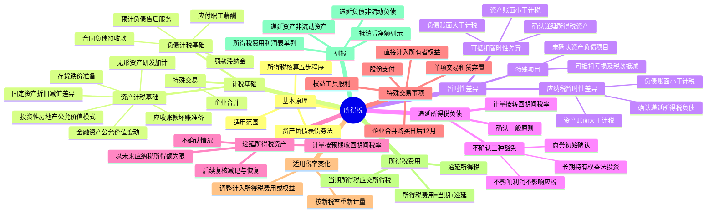

## 1. 章节定位

| 项目 | 信息 |
|------|------|
| 所属科目 | 会计 |
| 难度等级 | 5 |
| 历年分值 | 8-12 分 |
| 建议学时 | 10-12 小时 |
| 知识关联章节 | 第3章 存货（减值准备）、第4章 固定资产（折旧差异）、第6章 无形资产（研发加计扣除）、第13章 金融工具（公允价值变动）、第14章 租赁（使用权资产与租赁负债）、第16章 所有者权益（其他综合收益）、第17章 收入（合同负债）、第18章 政府补助、第26章 企业合并、第27章 合并财务报表 |

## 2. 考情分析

本章是会计科目的核心重难点章节，历年分值约 8-12 分，几乎每年必考主观题，常以综合题或计算分析题形式出现，并广泛与固定资产、无形资产、金融资产、收入、租赁、企业合并等章节联动考查。

**命题规律**：本章主观题常以企业多个交易事项为载体，要求考生计算资产、负债的计税基础，判断暂时性差异类型，确认递延所得税资产或负债，并最终计算所得税费用。综合性强、计算量大、链条长。客观题则集中在计税基础的确定、暂时性差异的分类、递延所得税确认的特殊规定等。

**高频考点分布**：

1. **资产负债表债务法的基本原理**：从资产负债表出发，比较资产、负债的账面价值与计税基础，确认递延所得税。
2. **资产的计税基础**：固定资产（折旧方法、折旧年限、减值准备差异）、无形资产（研发加计扣除、使用寿命不确定的无形资产）、以公允价值计量的金融资产、投资性房地产（公允价值模式）、存货跌价准备、应收账款坏账准备。
3. **负债的计税基础**：预计负债（售后服务）、合同负债（预收款项）、应付职工薪酬、罚款和滞纳金。
4. **暂时性差异**：应纳税暂时性差异（账面价值大于计税基础，确认递延所得税负债）、可抵扣暂时性差异（账面价值小于计税基础，确认递延所得税资产）；特殊项目（未作为资产负债确认的项目、可抵扣亏损及税款抵减）。
5. **递延所得税负债的确认**：一般原则（除特殊情况外均应确认）；不确认的三种特殊情况（商誉初始确认、既不影响利润也不影响应纳税所得额的交易、长期持有的权益法投资）。
6. **递延所得税资产的确认**：以未来期间可能取得的应纳税所得额为限；不确认的情况；后续复核（减记与恢复）。
7. **特殊交易或事项的所得税**：直接计入所有者权益的交易（其他综合收益）、企业合并（购买日后12个月内）、股份支付、单项交易（租赁、弃置费用）、权益工具股利的所得税影响。
8. **适用税率变化**：按新税率重新计量递延所得税资产和负债。
9. **所得税费用的计算**：所得税费用 = 当期所得税 + 递延所得税；递延所得税 =（递延所得税负债期末余额 − 期初余额）−（递延所得税资产期末余额 − 期初余额）。

**联动考查方式**：
- 与固定资产、无形资产结合：折旧方法、年限、减值差异产生暂时性差异；
- 与金融资产结合：公允价值变动产生暂时性差异；
- 与收入结合：合同负债的计税基础；
- 与租赁结合：使用权资产与租赁负债的单项交易递延所得税处理；
- 与企业合并结合：商誉的初始确认不确认递延所得税负债、购买日后12个月内的调整；
- 与所有者权益结合：其他综合收益的所得税影响计入所有者权益。

**备考建议**：
- 牢记"资产负债表债务法"的核心：从资产负债表出发，比较账面价值与计税基础；
- 区分"应纳税暂时性差异"（账面价值大于计税基础，确认递延所得税负债）和"可抵扣暂时性差异"（账面价值小于计税基础，确认递延所得税资产）；
- 掌握递延所得税确认的三个豁免：商誉初始确认、不影响利润和应纳税所得额的交易、长期持有的权益法投资；
- 注意递延所得税的计入方向：一般计入所得税费用，但直接计入所有者权益的交易事项和企业合并产生的计入所有者权益或商誉；
- 区分"当期所得税"（应交所得税）和"递延所得税"两部分构成所得税费用。

## 3. 知识框架

## 4. 核心精讲

### 4.1 所得税会计的基本原理

#### 4.1.1 资产负债表债务法

我国所得税会计采用了**资产负债表债务法**，要求企业从资产负债表出发，通过比较资产负债表上列示的资产、负债按照会计准则规定确定的账面价值与按照税法规定确定的计税基础，对于两者之间的差异分别应纳税暂时性差异与可抵扣暂时性差异，确认相关的递延所得税负债与递延所得税资产，在综合考虑当期应交所得税的基础上，确定每一会计期间利润表中的所得税费用。

资产负债表债务法在所得税的会计核算方面遵循了资产、负债的界定：

- **资产的账面价值小于其计税基础**，表明该项资产于未来期间产生的经济利益流入低于按照税法规定允许税前扣除的金额，产生可抵减未来期间应纳税所得额的因素，应确认为**递延所得税资产**。
- **资产的账面价值大于其计税基础**，两者之间的差额会增加企业于未来期间的应纳税所得额及应交所得税，应确认为**递延所得税负债**。

#### 4.1.2 所得税会计的一般程序

企业进行所得税核算一般应遵循以下程序：

1. 按照相关会计准则规定确定资产负债表中除递延所得税资产和递延所得税负债以外的其他资产和负债项目的账面价值；
2. 按照资产和负债计税基础的确定方法，以适用的税收法规为基础，确定资产负债表中有关资产、负债项目的计税基础；
3. 比较资产、负债的账面价值与其计税基础，对于两者之间存在差异的，分析其性质，分别应纳税暂时性差异与可抵扣暂时性差异，确定资产负债表日递延所得税负债和递延所得税资产的应有金额；
4. 按照适用的税法规定计算确定当期应纳税所得额，将应纳税所得额与适用的所得税税率计算的结果确认为当期应交所得税；
5. 确定利润表中的所得税费用（=当期所得税+递延所得税）。

### 4.2 资产、负债的计税基础

#### 4.2.1 资产的计税基础

**资产的计税基础**，是指企业收回资产账面价值过程中，计算应纳税所得额时按照税法规定可以自应税经济利益中抵扣的金额，即某一项资产在未来期间收回该资产的账面价值时，计税时按照税法规定可以税前扣除的总金额。

资产在初始确认时，其计税基础一般为取得成本。在资产持有过程中，其计税基础是指资产的取得成本减去以前期间按照税法规定已经税前扣除的金额后的余额。

**（1）固定资产**

以各种方式取得的固定资产，初始确认时按照会计准则规定确定的入账价值基本上是被税法认可的，即取得时其账面价值一般等于计税基础。固定资产在持有期间进行后续计量时，由于会计与税法规定就折旧方法、折旧年限以及固定资产减值准备的提取等处理的不同，造成固定资产的账面价值与计税基础的差异：

| 差异来源 | 说明 |
|---------|------|
| 折旧方法差异 | 会计可采用年限平均法、双倍余额递减法、年数总和法等；税法基本上只允许年限平均法（除规定可加速折旧外） |
| 折旧年限差异 | 会计由企业合理确定；税法规定了每类固定资产的最低折旧年限 |
| 减值准备差异 | 会计计提的减值准备减少账面价值；税法规定减值准备在发生实质性损失前不允许税前扣除，计税基础不变 |

**（2）无形资产**

除内部研究开发形成的无形资产以外，其他方式取得的无形资产，初始确认时按照会计准则规定确定的入账价值与按照税法规定确定的计税基础之间一般不存在差异。无形资产的差异主要产生于：

**①内部研究开发形成的无形资产**：会计准则规定，成本为开发阶段符合资本化条件以后至达到预定用途前发生的支出；税法规定，自行开发的无形资产以开发过程中符合资本化条件后至达到预定用途前发生的支出为计税基础。对于研究开发费用的加计扣除，未形成无形资产计入当期损益的，按照研究开发费用的 100% 加计扣除；形成无形资产的，按照无形资产成本的 200% 摊销。

**例外条款**：如该无形资产的确认不是产生于企业合并交易，同时在确认时既不影响会计利润也不影响应纳税所得额，则不确认该暂时性差异的所得税影响。

**②使用寿命不确定的无形资产**：会计处理时不要求摊销，但持有期间每年应进行减值测试；税法规定应在一定期限内摊销，计税时按照税法规定确定的摊销额允许税前扣除，造成账面价值与计税基础的差异。

**（3）以公允价值计量的金融资产**

以公允价值计量且其变动计入当期损益的金融资产于某一会计期末的账面价值为其公允价值。税法规定，持有期间公允价值的变动不计入应纳税所得额，在实际处置或结算时，处置取得的价款扣除其历史成本后的差额应计入处置或结算期间的应纳税所得额。因此，以公允价值计量的金融资产在某一会计期末的计税基础为其取得成本。

以公允价值计量且其变动计入其他综合收益的金融资产，其计税基础的确定与以公允价值计量且其变动计入当期损益的金融资产类似。

**（4）投资性房地产**

采用成本模式计量的投资性房地产，其账面价值与计税基础的确定与固定资产、无形资产相同；采用公允价值模式进行后续计量的投资性房地产，其账面价值为公允价值，而计税基础类似于固定资产或无形资产的计税基础（取得成本扣除税法规定的折旧或摊销）。

**（5）其他计提了资产减值准备的各项资产**

有关资产计提了减值准备后，其账面价值会随之下降，而税法规定资产在发生实质性损失之前，预计的减值损失不允许税前扣除，即其计税基础不会因减值准备的提取而变化。

#### 4.2.2 负债的计税基础

**负债的计税基础**，是指负债的账面价值减去未来期间计算应纳税所得额时按照税法规定可予抵扣的金额。对于预收收入，所产生负债的计税基础是其账面价值减去未来期间非应税收入的金额。公式为：

> 负债的计税基础 = 账面价值 − 未来期间按照税法规定可予税前扣除的金额（或未来期间非应税收入的金额）

负债的确认与偿还一般不会影响企业的损益，也不会影响其应纳税所得额，未来期间计算应纳税所得额时按照税法规定可予抵扣的金额为 0，计税基础即为账面价值。但某些情况下，负债的确认可能会影响企业的损益，进而影响不同期间的应纳税所得额，使得其计税基础与账面价值之间产生差额。

| 负债类型 | 计税基础 | 是否产生暂时性差异 |
|---------|---------|------------------|
| 预计负债（售后服务） | 账面价值 − 未来可税前扣除的金额 = 0（税法规定实际发生时扣除） | 产生可抵扣暂时性差异 |
| 合同负债（税法规定收到时计税） | 账面价值 − 未来非应税收入 = 0 | 产生可抵扣暂时性差异 |
| 合同负债（税法规定确认收入时计税） | 账面价值 − 0 = 账面价值 | 不产生暂时性差异 |
| 应付职工薪酬（超过税前扣除标准部分） | 账面价值 − 0 = 账面价值（超过部分当期和未来均不允许扣除） | 不产生暂时性差异（永久性差异） |
| 罚款和滞纳金 | 账面价值 − 0 = 账面价值（不允许税前扣除） | 不产生暂时性差异 |

#### 4.2.3 特殊交易或事项中产生资产、负债计税基础的确定

对于企业合并中取得资产、负债计税基础的确定：

- **同一控制下的企业合并**：合并中取得的有关资产、负债基本上维持其原账面价值不变；但从税法角度看，如不属于免税合并，则相关资产、负债的计税基础应重新认定，账面价值与计税基础会存在差异。因有关暂时性差异产生于同一控制下企业合并，在确认递延所得税时，相关影响应当计入所有者权益。
- **非同一控制下的企业合并**：购买方对于合并中取得的被购买方各项可辨认资产、负债应当按照公允价值确认。如属于免税合并，则计税基础承继其原有计税基础，账面价值（公允价值）与计税基础产生暂时性差异。因有关暂时性差异产生于非同一控制下企业合并，与暂时性差异相关的所得税影响确认的同时将影响合并中确认的商誉。

### 4.3 暂时性差异

**暂时性差异**是指资产、负债的账面价值与其计税基础不同产生的差额。根据暂时性差异对未来期间应纳税所得额的影响，分为应纳税暂时性差异和可抵扣暂时性差异。

#### 4.3.1 应纳税暂时性差异

**应纳税暂时性差异**，是指在确定未来收回资产或清偿负债期间的应纳税所得额时，将导致产生应税金额的暂时性差异，在其产生当期应当确认相关的递延所得税负债。

| 产生情况 | 说明 |
|---------|------|
| 资产的账面价值大于其计税基础 | 该项资产未来期间产生的经济利益不能全部税前抵扣，两者之间的差额需要交税 |
| 负债的账面价值小于其计税基础 | 意味着该项负债在未来期间可以税前抵扣的金额为负数，应调增未来期间应纳税所得额 |

#### 4.3.2 可抵扣暂时性差异

**可抵扣暂时性差异**是指在确定未来收回资产或清偿负债期间的应纳税所得额时，将导致产生可抵扣金额的暂时性差异。在可抵扣暂时性差异产生当期，符合确认条件时，应当确认相关的递延所得税资产。

| 产生情况 | 说明 |
|---------|------|
| 资产的账面价值小于其计税基础 | 资产在未来期间产生的经济利益少，按照税法规定允许税前扣除的金额多 |
| 负债的账面价值大于其计税基础 | 意味着未来期间按照税法规定与负债相关的全部或部分支出可以自未来应税经济利益中扣除 |

负债产生的暂时性差异 = 账面价值 − 计税基础 = 账面价值 −（账面价值 − 未来期间计税时按照税法规定可予税前扣除的金额）= 未来期间计税时按照税法规定可予税前扣除的金额。

#### 4.3.3 特殊项目产生的暂时性差异

**（1）未作为资产、负债确认的项目产生的暂时性差异**

某些交易或事项发生以后，因为不符合资产、负债确认条件而未体现为资产负债表中的资产或负债，但按照税法规定能够确定其计税基础的，其账面价值零与计税基础之间的差异也构成暂时性差异。如企业发生的符合条件的广告费和业务宣传费支出，不超过当年销售收入 15% 的部分准予扣除，超过部分准予在以后纳税年度结转扣除。

**（2）可抵扣亏损及税款抵减产生的暂时性差异**

按照税法规定可以结转以后年度的未弥补亏损及税款抵减，虽不是因资产、负债的账面价值与计税基础不同产生的，但与可抵扣暂时性差异具有同样的作用，均能够减少未来期间的应纳税所得额，会计处理上视同可抵扣暂时性差异，符合条件的情况下，应确认与其相关的递延所得税资产。

### 4.4 递延所得税负债的确认和计量

#### 4.4.1 递延所得税负债的确认

**一般原则**：除《企业会计准则第 18 号——所得税》中明确规定可不确认递延所得税负债的情况以外，企业对于所有的应纳税暂时性差异均应确认相关的递延所得税负债。除与直接计入所有者权益的交易或事项以及企业合并中取得资产、负债相关的以外，在确认递延所得税负债的同时，应增加利润表中的所得税费用。

**不确认递延所得税负债的特殊情况**：

**（1）商誉的初始确认**。非同一控制下的企业合并中，企业合并成本大于合并中取得的被购买方可辨认净资产公允价值份额的差额，按照会计准则规定应确认为商誉。因会计与税收的划分标准不同，会计上作为非同一控制下的企业合并，但如果按照税法规定计税时作为免税合并的情况下，商誉的计税基础为 0，其账面价值与计税基础形成应纳税暂时性差异，准则中规定不确认与其相关的递延所得税负债。

**重要补充**：按照会计准则规定在非同一控制下企业合并中确认了商誉，并且按照所得税法规的规定商誉在初始确认时计税基础等于账面价值的，该商誉在后续计量过程中因会计准则与税法规定不同产生暂时性差异的，应当确认相关的所得税影响。

**（2）除企业合并以外的其他交易或事项中**，如果该项交易或事项发生时既不影响会计利润，也不影响应纳税所得额，则所产生的资产、负债的初始确认金额与其计税基础不同，形成应纳税暂时性差异的，交易或事项发生时不确认相应的递延所得税负债。

**（3）与子公司、联营企业、合营企业投资等相关的应纳税暂时性差异**，一般应确认相应的递延所得税负债，但**同时满足以下两个条件的除外**：①投资企业能够控制暂时性差异转回的时间；②该暂时性差异在可预见的未来很可能不会转回。

对于采用权益法核算的长期股权投资，如果企业拟长期持有，因初始投资成本的调整产生的暂时性差异预计未来期间不会转回；因确认投资损益产生的暂时性差异，如果在未来期间分回现金股利或利润时免税（居民企业间的股息、红利免税），也不存在对未来期间的所得税影响；因确认应享有被投资单位其他权益变动而产生的暂时性差异，在长期持有的情况下预计未来期间也不会转回。因此，在准备长期持有的情况下，一般不确认相关的所得税影响。如果投资企业拟对外出售，则应确认相关的所得税影响。

#### 4.4.2 递延所得税负债的计量

资产负债表日，对于递延所得税负债，应当根据适用税法规定，按照预期收回该资产或清偿该负债期间的适用税率计量。即递延所得税负债应以相关应纳税暂时性差异转回期间按照税法规定适用的所得税税率计量。无论应纳税暂时性差异何时转回，相关的递延所得税负债不要求折现。

### 4.5 递延所得税资产的确认和计量

#### 4.5.1 递延所得税资产的确认

**一般原则**：递延所得税资产产生于可抵扣暂时性差异。确认因可抵扣暂时性差异产生的递延所得税资产应以未来期间可能取得的应纳税所得额为限。在可抵扣暂时性差异预期转回的未来期间内，企业无法产生足够的应纳税所得额用以利用可抵扣暂时性差异的影响，使得与可抵扣暂时性差异相关的经济利益无法实现的，不应确认递延所得税资产；企业有明确的证据表明其于可抵扣暂时性差异转回的未来期间能够产生足够的应纳税所得额，进而利用可抵扣暂时性差异的，则应以可能取得的应纳税所得额为限，确认相关的递延所得税资产。

在判断企业于可抵扣暂时性差异转回的未来期间是否能够产生足够的应纳税所得额时，应考虑企业在未来期间通过正常的生产经营活动能够实现的应纳税所得额以及以前期间产生的应纳税暂时性差异在未来期间转回时将增加的应纳税所得额。

**特殊情况**：

- **对与子公司、联营企业、合营企业的投资相关的可抵扣暂时性差异**，同时满足下列条件的，应当确认相关的递延所得税资产：①暂时性差异在可预见的未来很可能转回；②未来很可能获得用来抵扣可抵扣暂时性差异的应纳税所得额。
- **对于按照税法规定可以结转以后年度的未弥补亏损和税款抵减**，应视同可抵扣暂时性差异处理。在有关的亏损或税款抵减金额得到税务部门的认可或预计能够得到税务部门的认可且预计可利用未弥补亏损或税款抵减的未来期间内能够取得足够的应纳税所得额时，应当以可能取得的应纳税所得额为限，确认相应的递延所得税资产。

**不确认递延所得税资产的情况**：某些情况下，企业发生的某项交易或事项不属于企业合并，并且交易发生时既不影响会计利润也不影响应纳税所得额，且该项交易中产生的资产、负债的初始确认金额与其计税基础不同，产生可抵扣暂时性差异的，不确认相应的递延所得税资产。

#### 4.5.2 递延所得税资产的计量

确认递延所得税资产时，应当以预期收回该资产期间的适用所得税税率为基础计算确定。无论相关的可抵扣暂时性差异何时转回，递延所得税资产均不要求折现。

**后续复核**：企业在确认了递延所得税资产以后，资产负债表日，应当对递延所得税资产的账面价值进行复核。如果未来期间很可能无法取得足够的应纳税所得额用以利用可抵扣暂时性差异带来的利益，应当减记递延所得税资产的账面价值。减记的递延所得税资产，除原确认时计入所有者权益的，其减记金额亦应计入所有者权益外，其他的情况均应增加当期的所得税费用。以后期间根据新的环境和情况判断能够产生足够的应纳税所得额利用可抵扣暂时性差异，使得递延所得税资产包含的经济利益能够实现的，应当相应恢复递延所得税资产的账面价值。

### 4.6 特殊交易或事项中涉及递延所得税的确认和计量

#### 4.6.1 与直接计入所有者权益的交易或事项相关的所得税

与当期及以前期间直接计入所有者权益的交易或事项相关的当期所得税及递延所得税应当计入所有者权益。直接计入所有者权益的交易或事项主要有：会计政策变更采用追溯调整法或对前期差错更正采用追溯重述法调整期初留存收益、以公允价值计量且其变动计入其他综合收益的金融资产公允价值的变动金额、同时包含负债及权益成分的金融工具在初始确认时计入所有者权益、自用房地产转为采用公允价值模式计量的投资性房地产时公允价值大于原账面价值的差额计入其他综合收益等。

#### 4.6.2 与企业合并相关的递延所得税

在企业合并中，购买方取得的可抵扣暂时性差异，如购买日取得的被购买方在以前期间发生的未弥补亏损等，按照税法规定可以用于抵减以后年度应纳税所得额，但在购买日不符合递延所得税资产确认条件时不予以确认。购买日后 12 个月内，如取得新的或进一步的信息表明购买日的相关情况已经存在，预期被购买方在购买日可抵扣暂时性差异带来的经济利益能够实现的，应当确认相关的递延所得税资产，同时减少商誉，商誉不足冲减的，差额部分确认为当期损益；除上述情况以外，确认与企业合并相关的递延所得税资产，应当计入当期损益。

#### 4.6.3 与股份支付相关的当期及递延所得税

如果税法规定与股份支付相关的支出不允许税前扣除，则不形成暂时性差异；如果税法规定与股份支付相关的支出允许税前扣除，在按照会计准则规定确认成本费用的期间内，企业应当根据会计期末取得的信息估计可税前扣除的金额计算确定其计税基础及由此产生的暂时性差异，符合确认条件的情况下，应当确认相关的递延所得税。

对于附有业绩条件或服务条件的股权激励计划，企业按照会计准则的相关规定确认的成本费用在等待期内不得税前抵扣，待股权激励计划可行权时方可抵扣；可抵扣的金额为实际行权时的股票公允价值与激励对象支付的行权金额之间的差额。企业应根据期末的股票价格估计未来可以税前抵扣的金额，以未来期间很可能取得的应纳税所得额为限确认递延所得税资产。如果预计未来期间可抵扣的金额超过等待期内确认的成本费用，超出部分形成的递延所得税资产应直接计入所有者权益（资本公积——其他资本公积），而不是计入当期损益。

#### 4.6.4 与单项交易相关的递延所得税

对于不是企业合并、交易发生时既不影响会计利润也不影响应纳税所得额，且初始确认的资产和负债导致产生等额应纳税暂时性差异和可抵扣暂时性差异的单项交易（包括承租人在租赁期开始日初始确认租赁负债并计入使用权资产的租赁交易，以及因固定资产等存在弃置义务而确认预计负债并计入相关资产成本的交易等），**不适用**上述关于豁免初始确认递延所得税负债和递延所得税资产的规定。企业对该单项交易因资产和负债的初始确认所产生的应纳税暂时性差异和可抵扣暂时性差异，应当在交易发生时分别确认相应的递延所得税负债和递延所得税资产。

#### 4.6.5 发行方分类为权益工具的金融工具相关股利的所得税影响

对于企业按照《企业会计准则第 37 号——金融工具列报》等规定分类为权益工具的金融工具（如分类为权益工具的永续债等），相关股利支出按税收政策相关规定在企业所得税税前扣除的，企业应当在确认应付股利时，确认与股利相关的所得税影响。企业应当按照与过去产生可供分配利润的交易或事项时所采用的会计处理相一致的方式，将股利的所得税影响计入当期损益或所有者权益项目（含其他综合收益项目）。

### 4.7 适用税率变化对已确认递延所得税的影响

因税收法规的变化，导致企业在某一会计期间适用的所得税税率发生变化的，企业应对已确认的递延所得税资产和递延所得税负债按照新的税率进行重新计量。除直接计入所有者权益的交易或事项产生的递延所得税资产及递延所得税负债，相关的调整金额应计入所有者权益以外，其他情况下因税率变化产生的调整金额应确认为税率变化当期的所得税费用（或收益）。

### 4.8 所得税费用的确认和计量

所得税会计的主要目的之一是确定当期应交所得税以及利润表中的所得税费用。在按照资产负债表债务法核算所得税的情况下，利润表中的所得税费用包括当期所得税和递延所得税两个部分。

#### 4.8.1 当期所得税

**当期所得税**是指企业按照税法规定计算确定的针对当期发生的交易和事项，应交纳给税务部门的所得税金额，即当期应交所得税。应纳税所得额可在会计利润的基础上，按照适用税收法规的规定进行调整：

> 应纳税所得额 = 会计利润 + 按照会计准则规定计入利润表但计税时不允许税前扣除的费用 ± 计入利润表的费用与按照税法规定可予税前抵扣的金额之间的差额 ± 计入利润表的收入与按照税法规定应计入应纳税所得额的收入之间的差额 − 税法规定的不征税收入 ± 其他需要调整的因素

#### 4.8.2 递延所得税

**递延所得税**是指按照准则规定当期应予确认的递延所得税资产和递延所得税负债金额，即递延所得税资产及递延所得税负债当期发生额的综合结果，但不包括计入所有者权益的交易或事项的所得税影响。公式为：

> 递延所得税 =（递延所得税负债的期末余额 − 递延所得税负债的期初余额）−（递延所得税资产的期末余额 − 递延所得税资产的期初余额）

企业因确认递延所得税资产和递延所得税负债产生的递延所得税，一般应当计入所得税费用，但以下两种情况除外：

1. 某项交易或事项按照会计准则规定应计入所有者权益的，由该交易或事项产生的递延所得税资产或递延所得税负债及其变化亦应计入所有者权益，不构成利润表中的递延所得税费用（或收益）。
2. 企业合并中取得的资产、负债，其账面价值与计税基础不同，因而确认相关递延所得税的，该递延所得税的确认影响合并中产生的商誉或是计入当期损益的金额，不影响所得税费用。

#### 4.8.3 所得税费用

计算确定了当期所得税及递延所得税以后，利润表中应予确认的所得税费用为两者之和：

> 所得税费用 = 当期所得税 + 递延所得税

### 4.9 所得税的列报

递延所得税资产和递延所得税负债一般应当分别作为非流动资产和非流动负债在资产负债表中列示，所得税费用应当在利润表中单独列示。

一般情况下，在个别财务报表中，当期所得税资产与当期所得税负债、递延所得税资产及递延所得税负债可以以抵销后的净额列示。在合并财务报表中，纳入合并范围的企业中，一方的当期所得税资产或递延所得税资产与另一方的当期所得税负债或递延所得税负债一般不能予以抵销，除非所涉及的企业具有以净额结算的法定权利并且意图以净额结算。

企业还应在附注中就所得税费用（或收益）与会计利润的关系进行说明，即从会计利润到所得税费用之间的调节过程，包括与税率相关的调整、永久性差异（非应税收入、不可抵扣费用、加计扣除等）、可抵扣亏损的影响等。

## 5. 典型例题

**【例题 1】（综合所得税处理）**

A 公司 2×24 年度利润表中利润总额为 3 000 万元，适用的所得税税率为 25%。递延所得税资产及递延所得税负债不存在期初余额。2×24 年发生的有关交易和事项中，会计处理与税收处理存在差别的有：

（1）2×24 年 1 月开始计提折旧的一项固定资产，成本为 1 500 万元，使用年限为 10 年，净残值为 0，会计处理按双倍余额递减法计提折旧，税收处理按直线法计提折旧。假定税法规定的使用年限及净残值与会计规定相同。

（2）向关联企业捐赠现金 500 万元。假定按照税法规定，企业向关联方的捐赠不允许税前扣除。

（3）当期取得作为交易性金融资产核算的股票投资成本为 800 万元，2×24 年 12 月 31 日的公允价值为 1 200 万元。税法规定，以公允价值计量的金融资产持有期间市价变动不计入应纳税所得额。

（4）违反环保法规定应支付罚款 250 万元。

（5）期末对持有的存货计提了 75 万元的存货跌价准备。

要求：计算 A 公司 2×24 年度的当期所得税、递延所得税和所得税费用，并编制会计分录。

**答案**：

（1）2×24 年度当期应交所得税：

| 项目 | 会计处理 | 税法处理 | 调整金额 |
|------|---------|---------|---------|
| 固定资产折旧 | 双倍余额递减法：1 500 × 2/10 = 300 万元 | 直线法：1 500 ÷ 10 = 150 万元 | +150（会计折旧多扣150，调增） |
| 关联方捐赠 | 计入营业外支出 | 不允许税前扣除 | +500（调增） |
| 交易性金融资产公允价值变动 | 确认公允价值变动收益 400 万元 | 不计入应纳税所得额 | −400（调减） |
| 罚款 | 计入营业外支出 | 不允许税前扣除 | +250（调增） |
| 存货跌价准备 | 计入资产减值损失 75 万元 | 不允许税前扣除 | +75（调增） |

应纳税所得额 = 3 000 + 150 + 500 − 400 + 250 + 75 = 3 575（万元）

应交所得税 = 3 575 × 25% = 893.75（万元）

（2）2×24 年度递延所得税：

可抵扣暂时性差异：固定资产（账面价值 1 200 < 计税基础 1 350，差异 150 万元）+ 存货（账面价值 < 计税基础，差异 75 万元）= 225 万元

递延所得税资产 = 225 × 25% = 56.25（万元）

应纳税暂时性差异：交易性金融资产（账面价值 1 200 > 计税基础 800，差异 400 万元）

递延所得税负债 = 400 × 25% = 100（万元）

递延所得税 = 100 − 56.25 = 43.75（万元）

（3）利润表中应确认的所得税费用：

所得税费用 = 893.75 + 43.75 = 937.50（万元）

会计分录：

借：所得税费用 9 375 000

　　递延所得税资产 562 500

　　贷：应交税费——应交所得税 8 937 500

　　　　递延所得税负债 1 000 000

**解析**：罚款和关联方捐赠属于永久性差异（当期和未来均不允许税前扣除），不产生暂时性差异，不影响递延所得税；固定资产折旧差异、交易性金融资产公允价值变动、存货跌价准备产生暂时性差异，需确认递延所得税。

**【例题 2】（商誉的初始确认不确认递延所得税负债）**

A 企业以增发市场价值为 15 000 万元的自身普通股为对价购入 B 企业 100% 的净资产，对 B 企业进行吸收合并，合并前 A 企业与 B 企业不存在任何关联方关系。假定该项合并符合税法规定的免税合并条件，交易各方选择进行免税处理。购买日 B 企业各项可辨认资产、负债的公允价值及计税基础如下：固定资产公允价值 6 750 万元、计税基础 3 875 万元；应收账款公允价值 5 250 万元、计税基础 5 250 万元；存货公允价值 4 350 万元、计税基础 3 100 万元；其他应付款公允价值（750）万元、计税基础 0；应付账款公允价值（3 000）万元、计税基础（3 000）万元。B 企业适用的所得税税率为 25%。

要求：计算该项合并中应确认的递延所得税资产、递延所得税负债和商誉的金额。

**答案**：

可辨认资产、负债的公允价值（不含递延所得税）= 6 750 + 5 250 + 4 350 − 750 − 3 000 = 12 600（万元）

可辨认资产、负债的计税基础 = 3 875 + 5 250 + 3 100 − 0 − 3 000 = 9 225（万元）

暂时性差异 = 12 600 − 9 225 = 3 375（万元）

其中：
- 应纳税暂时性差异 = 固定资产 2 875 + 存货 1 250 = 4 125（万元）
- 可抵扣暂时性差异 = 其他应付款 750（万元）

递延所得税负债 = 4 125 × 25% = 1 031.25（万元）

递延所得税资产 = 750 × 25% = 187.5（万元）

考虑递延所得税后的可辨认净资产公允价值 = 12 600 − 1 031.25 + 187.5 = 11 756.25（万元）

商誉 = 企业合并成本 15 000 − 11 756.25 = 3 243.75（万元）

因该项合并为免税合并，商誉的计税基础为 0，账面价值 3 243.75 万元与计税基础 0 之间产生的应纳税暂时性差异，按照会计准则规定，不再进一步确认相关的所得税影响。

**解析**：非同一控制下免税合并中，商誉的初始确认产生的应纳税暂时性差异不确认递延所得税负债，这是递延所得税负债确认的三个豁免之一。但被购买方可辨认资产、负债按公允价值确认与原计税基础之间的暂时性差异，应确认递延所得税，并影响商誉金额。

**【例题 3】（单项交易的递延所得税处理——租赁）**

2×23 年 1 月 1 日（租赁期开始日），承租人甲公司与出租人乙公司签订了为期 7 年的商铺租赁合同。每年的租赁付款额为 450 000 元（不含税），于每年年末支付。甲公司无法确定租赁内含利率，其增量借款利率为每年 5.04%。在租赁期开始日，甲公司按租赁付款额的现值所确认的租赁负债为 2 600 000 元，甲公司已支付与该租赁相关的初始直接费用 50 000 元。假定按照适用税法规定，该交易属于税法上的经营租赁，甲公司支付的初始直接费用于实际发生时一次性税前扣除，每期支付的租金允许在支付当期进行税前扣除，甲公司适用的所得税税率为 25%。

要求：编制甲公司在租赁期开始日确认递延所得税的会计分录。

**答案**：

在租赁期开始日：

- 租赁负债的账面价值为 2 600 000 元，计税基础为 0（未来期间计算应纳税所得额时按照税法规定可予抵扣的金额为 2 600 000 元），产生可抵扣暂时性差异 2 600 000 元。
- 使用权资产的账面价值为 2 650 000 元（2 600 000 + 50 000），其中与租赁负债等额确认的使用权资产部分（2 600 000 元）的计税基础为 0，产生应纳税暂时性差异 2 600 000 元。
- 初始直接费用部分（50 000 元）的账面价值为 50 000 元，计税基础为 0（已从支付当年应纳税所得额中全额扣除），产生应纳税暂时性差异 50 000 元。

该单项交易不适用豁免初始确认递延所得税的规定，应当在交易发生时分别确认相应的递延所得税负债和递延所得税资产。

借：递延所得税资产 650 000（2 600 000 × 25%）

　　所得税费用 12 500

　　贷：递延所得税负债 662 500（2 650 000 × 25%）

**解析**：单项交易（租赁交易初始确认使用权资产和租赁负债、弃置费用确认预计负债和资产成本）不适用豁免规定，需要同时确认等额的递延所得税资产和递延所得税负债。其中，初始直接费用部分影响交易发生时的应纳税所得额（已一次性税前扣除），不属于"不影响会计利润和应纳税所得额"的情形，因此也需确认递延所得税负债。差额 12 500 元计入所得税费用。

## 6. 记忆口诀

**资产负债表债务法**："从资产负债表出发，比较账面价值与计税基础，确认递延所得税"——核心思路。

**资产计税基础**："未来可税前扣除的总金额"——收回资产账面价值过程中，计算应纳税所得额时按照税法规定可以自应税经济利益中抵扣的金额。

**负债计税基础**："账面价值减未来可税前扣除的金额"——负债的计税基础 = 账面价值 − 未来期间按照税法规定可予税前扣除的金额。

**暂时性差异两类**："应纳税（账面大于计税）确认递延负债，可抵扣（账面小于计税）确认递延资产"——资产看账面与计税大小，负债相反。

**递延所得税负债三豁免**："商誉初始确认、不影响利润不影响应税、长期持有权益法投资"——三种不确认递延所得税负债的特殊情况。

**递延所得税资产确认**："以未来可能取得的应纳税所得额为限"——超过部分不确认。

**递延所得税资产不确认**："不属于企业合并、不影响利润不影响应税、产生可抵扣差异"——不确认递延所得税资产。

**递延所得税计入方向**："一般进所得税费用，直接计入所有者权益的进权益，企业合并进商誉"——三种计入方向。

**所得税费用构成**："当期所得税（应交所得税）+ 递延所得税"——两部分构成利润表中的所得税费用。

**递延所得税公式**："（递延负债期末减期初）减（递延资产期末减期初）"——递延所得税 = 递延所得税负债增加额 − 递延所得税资产增加额。

**商誉免税合并**："会计确认商誉，免税合并计税基础为零，不确认递延所得税负债"——商誉初始确认豁免。

**购买日后12个月**："购买日情况已存在，调商誉；不存在，进当期损益"——企业合并相关递延所得税资产调整。

**单项交易不豁免**："租赁使用权资产与租赁负债、弃置费用预计负债与资产成本，等额确认递延"——不适用豁免规定。

**适用税率变化**："按新税率重新计量，调整计入所得税费用或所有者权益"——税率变动需重新计量。

**股份支付递延所得税**："超过成本费用部分进资本公积，不超过部分进所得税费用"——超出部分计入所有者权益。

**永久性差异不产生暂时性差异**："罚款、捐赠、超标准职工薪酬——当期和未来均不允许扣除"——不确认递延所得税。

**列报**："递延资产非流动资产，递延负债非流动负债，所得税费用利润表单列"——基本列报原则。

## 7. 同步练习

**338.（单选题）** 甲公司下列业务有关计税基础的确定，表述正确的是（　）。

A. 当期期末存货账面价值为200万元，已计提的存货跌价准备累计为20万元，当期期末存货的计税基础为200万元
B. 当期因计提保证类质量保证支出确认预计负债30万元，其预计负债期初余额为0，税法允许其在实际发生时扣除，当期期末预计负债的计税基础为0
C. 当期购入的交易性金融资产账面价值为100万元，其中成本明细80万元，公允价值变动明细20万元，当期期末交易性金融资产的计税基础为100万元
D. 当期期末应付职工薪酬余额50万元，税法允许当期税前抵扣的金额为36万元，其余允许以后实际支付时抵扣，当期期末应付职工薪酬的计税基础为14万元

---

**339.（单选题）** 按照《企业会计准则第18号——所得税》的规定，下列资产、负债项目的账面价值与其计税基础之间的差额，不得确认递延所得税的是（　）。

A. 采用公允价值模式计量的投资性房地产期末公允价值上升
B. 期末按公允价值调增其他债权投资的账面价值
C. 因非同一控制下的免税企业合并初始确认的商誉
D. 企业因销售商品提供保证类质保确认的预计负债

---

**340.（单选题）** 某公司自2×21年1月1日开始采用企业会计准则。2×21年利润总额为2000万元，适用的所得税税率为33%，自2×22年1月1日起适用的所得税税率变更为25%。2×21年发生的交易事项中，会计与税收规定之间存在差异的事项包括：①当期计提存货跌价准备700万元；②年末持有的以公允价值计量且其变动计入当期损益的金融资产当期公允价值上升1500万元。假定税法规定，资产在持有期间公允价值变动不计入应纳税所得额，出售时一并计算应税所得；③当年确认国债投资利息收入300万元。税法规定，该国债利息收入免征企业所得税。假定该公司2×21年1月1日不存在暂时性差异，预计未来期间能够产生足够的应纳税所得额用以利用可抵扣暂时性差异。不考虑其他因素，该公司2×21年度所得税费用为（　）。

A. 33万元
B. 97万元
C. 497万元
D. 561万元

---

**341.（单选题）** 甲公司2×21年10月20日自A客户处收到一笔合同预付款，金额为1000万元，作为合同负债核算，但按照税法规定，该款项应计入取得当期应纳税所得额；12月20日，甲公司自B客户处收到一笔合同预付款，金额为2000万元，作为合同负债核算，按照税法规定，该笔款项具有预收性质，不计入当期应纳税所得额。甲公司适用的所得税税率为25%，假定甲公司未来期间很可能获得足够的应纳税所得额用来抵扣可抵扣暂时性差异，不考虑其他因素，针对上述业务下列处理正确的是（　）。

A. 确认递延所得税资产250万元
B. 确认递延所得税资产500万元
C. 确认递延所得税负债250万元
D. 确认递延所得税资产750万元

---

**342.（单选题）** 某企业2×20年2月1日购入一项其他债权投资，取得成本为2500万元，2×20年12月31日公允价值为3000万元。2×21年末，该项其他债权投资的公允价值为2700万元。企业适用的所得税税率为25%，假定该企业未来期间有足够的应纳税所得额用于抵减可抵扣暂时性差异。不考虑其他因素，2×21年末该项金融资产对所得税影响的处理为（　）。

A. 应确认递延所得税负债50万元
B. 应转回递延所得税负债75万元
C. 应确认递延所得税资产75万元
D. 应确认递延所得税资产50万元

---

**343.（单选题）**（2023年）2×23年，甲公司发生的有关交易或事项如下：①出于短期获利的目的从公开市场买入股票，该股票当年产生公允价值变动收益200万元；②部分生产设备发生减值，计提固定资产减值准备1000万元；③租入某办公楼，同时确认使用权资产和租赁负债800万元。甲公司适用的企业所得税税率为25%，甲公司预计2×23年以及未来期间均有足够的应纳税所得额用于抵减可抵扣暂时性差异，不考虑其他因素，下列各项关于甲公司2×23年度所得税会计处理的表述中，正确的是（　）。

A. 确认递延所得税资产300万元
B. 确认递延所得税负债250万元
C. 因股票的公允价值变动确认递延所得税负债的同时调整其他综合收益50万元
D. 由于使用权资产和租赁负债金额相等，不确认递延所得税资产和递延所得税负债

---

**344.（单选题）**（2022年）2×20年5月1日，甲公司从独立第三方收购了乙公司60%股权并取得控制权，确认商誉800万元。购买日，乙公司存在历史期间尚可在税前抵扣的未弥补亏损500万元，因不符合确认条件而未确认递延所得税资产。2×21年2月1日，在甲公司的支持下，乙公司开展了新的业务，乙公司基于调整后的新业务预计未来期间能够产生足够的应纳税所得额用以抵减可抵扣暂时性差异，因此，乙公司于2×21年2月末确认了递延所得税资产，同时冲减所得税费用。甲公司在2×21年度合并乙公司财务报表时，下列各项有关所得税的抵销或调整的表述中，正确的是（　）。

A. 无需抵销或调整
B. 调整所得税费用和商誉
C. 调整所得税费用和资本公积
D. 调整所得税费用和年初未分配利润

---

**345.（单选题）**（2022年）甲公司2×21年实现利润总额1900万元，其中因权益法核算的长期股权投资确认盈利1200万元，税法规定当期不计入应纳税所得额，甲公司拟长期持有该项投资；年末预收货款1600万元，税法规定计入当期应纳税所得额。除上述差异外没有其他纳税调整事项和差异。甲公司适用所得税税率为25%，假定该公司预计未来期间能够产生足够的应纳税所得额用以抵扣可抵扣暂时性差异。不考虑其他因素，下列选项中表述不正确的是（　）。

A. 甲公司2×21年应交所得税为575万元
B. 甲公司2×21年递延所得税资产为400万元
C. 甲公司2×21年递延所得税负债为300万元
D. 甲公司2×21年所得税费用为175万元

---

**346.（单选题）** 下列关于企业持有的其他权益工具投资的所得税影响的表述，不正确的是（　）。

A. 其他权益工具投资持有期间的公允价值变动不计入应纳税所得额
B. 其他权益工具投资持有期间的公允价值变动计算应交所得税时不做纳税调整
C. 其他权益工具投资持有期间的公允价值变动计算应交所得税时需要做纳税调整
D. 根据其他权益工具投资产生的暂时性差异确认的递延所得税，应当计入其他综合收益

---

**347.（单选题）** B股份有限公司（以下简称B公司）2×22年实现利润总额500万元，适用的所得税税率为25%。B公司当年因发生违法经营被罚款5万元，税法规定违法罚款不允许税前扣除；业务招待费超支10万元，税法规定超支部分不允许税前扣除；国债利息收入30万元，税法规定国债利息收入免征所得税；B公司年初"预计负债——应付产品质量保证"余额为30万元，当年提取了保证类产品质量保证成本15万元，当年发生了6万元的保证类产品质量保证支出，税法规定实际支出时允许税前扣除。假定B公司在未来期间能够产生足够的应纳税所得额用以抵扣可抵扣暂时性差异，不考虑其他因素。B公司2×22年的净利润金额为（　）。

A. 160.05万元
B. 378.75万元
C. 330万元
D. 235.8万元

---

**348.（单选题）** 甲公司拥有乙公司80%有表决权股份，能够控制乙公司的生产经营决策，2×19年8月乙公司出售一批产品给甲公司，成本为200万元，售价为300万元，至2×19年12月31日，甲公司尚未出售该批商品。甲公司和乙公司适用的所得税税率均为25%。税法规定，企业的存货以历史成本作为计税基础。假定该项交易涉及的商品未发生减值，甲公司和乙公司在未来期间能够产生足够的应纳税所得额用以抵扣可抵扣暂时性差异，不考虑其他因素，甲公司2×19年合并报表中应确认的递延所得税资产为（　）。

A. 0
B. 50万元
C. 75万元
D. 25万元

---

**349.（多选题）** 甲公司适用的所得税税率为25%，其在2×22年发生的交易或事项中，会计与税收处理存在差异的事项如下：①当期购入股票投资指定为以公允价值计量且其变动计入其他综合收益的金融资产，期末公允价值比取得成本高160万元；②收到与资产相关政府补助1600万元，税法规定该补助在取得当年全部计入应纳税所得额。相关资产至年末尚未开始计提折旧，采用总额法核算政府补助。甲公司2×22年利润总额为5200万元，假定递延所得税资产、递延所得税负债年初余额为零，未来期间能够取得足够的应纳税所得额用以抵扣可抵扣暂时性差异。假定不考虑其他因素，下列关于甲公司2×22年所得税的处理中，正确的有（　）。

A. 所得税费用为900万元
B. 应交所得税为1300万元
C. 递延所得税负债为40万元
D. 递延所得税资产为400万元

---

**350.（多选题）**（2024年）下列关于会计报表附注中所得税与会计利润关系的说明，属于调整项目的有（　）。

A. 本期计提固定资产减值损失
B. 本期预计未来不可利用可抵扣暂时性差异而转回上期确认的递延所得税资产
C. 本期加计扣除的研发费用
D. 本期使用上期未确认递延所得税资产的可抵扣亏损

---

**351.（多选题）**（2021年）在未来期间能够产生足够的应纳税所得额用以抵减可抵扣暂时性差异，并且不考虑其他因素的情况下，下列各项交易或事项涉及所得税会计处理的表述中，正确的有（　）。

A. 内部研发形成的无形资产初始入账金额与计税基础之间的差异，应确认递延所得税，并计入当期损益
B. 企业发行可转换公司债券初始入账金额与计税基础之间的差异，应确认递延所得税，并计入当期损益
C. 股份支付产生的暂时性差异，如果预计未来期间可抵扣的金额超过等待期内确认的成本费用，超出部分形成的递延所得税应计入所有者权益
D. 以公允价值计量且其变动计入其他综合收益的非交易性权益工具投资的公允价值变动产生的暂时性差异，应确认递延所得税并计入其他综合收益

---

**352.（多选题）** 下列有关资产的计税基础与暂时性差异的说法中，正确的有（　）。

A. 当期期末存货账面余额为300万元，已计提的跌价准备累计为30万元，则当期期末存货的计税基础为300万元，可抵扣暂时性差异余额为30万元
B. 当期购入的其他权益工具投资期末账面价值为120万元，其中成本明细80万元，公允价值变动明细40万元，则当期末该其他权益工具投资的计税基础为80万元，产生应纳税暂时性差异40万元
C. 一项按照权益法核算的长期股权投资，购入时初始投资成本为1000万元，当期确认损益调整500万元、其他综合收益100万元，则当期末长期股权投资的账面价值与计税基础均为1600万元，不产生暂时性差异
D. 甲公司有一项使用寿命不确定的无形资产，账面原值为100万元，未计提减值准备，已使用2年，2年后该项无形资产的计税基础为100万元，不产生暂时性差异

---

**353.（多选题）** 下列有关所得税列报的表述中，不正确的有（　）。

A. 递延所得税资产一般作为非流动资产在资产负债表中列示
B. 递延所得税资产应当作为流动资产在资产负债表中列示
C. 递延所得税负债一般作为非流动负债在资产负债表中列示
D. 递延所得税负债应当作为流动负债在资产负债表中列示

---

**354.（计算分析题）** 甲公司适用的所得税税率为25%，预计以后期间不会变更，未来期间有足够的应纳税所得额用以抵扣可抵扣暂时性差异；2×22年年初递延所得税资产的账面余额为100万元，递延所得税负债的账面余额为零，不存在其他未确认暂时性差异所得税影响的事项。2×22年，甲公司发生的下列交易或事项，其会计处理与所得税法规规定存在差异：

（1）甲公司持有乙公司30%股权并具有重大影响，采用权益法核算，其初始投资成本为1000万元。截至2×22年12月31日，甲公司该股权投资的账面价值为1900万元，其中，因乙公司2×22年实现净利润，甲公司按持股比例计算确认增加的长期股权投资账面价值为300万元；因乙公司持有以公允价值计量且其变动计入其他综合收益的金融资产（不属于非交易性权益工具投资）产生的其他综合收益增加，甲公司按持股比例计算确认增加的长期股权投资账面价值80万元；其他长期股权投资账面价值的调整系按持股比例计算享有乙公司以前年度的净利润。甲公司计划于2×23年出售该项股权投资，但出售计划尚未经董事会和股东会批准。税法规定，居民企业间的股息、红利免税。

（2）1月4日，甲公司经股东会批准，授予其50名管理人员每人10万份股份期权，每份期权于到期日可以6元/股的价格购买甲公司1股普通股，但被授予股份期权的管理人员必须在甲公司工作满3年才可行权。甲公司因该股权激励于当年确认了550万元的股份支付费用。税法规定，行权时股份公允价值与员工实际支付价款之间的差额，可在行权期间计算应纳税所得额时扣除。甲公司预计该股份期权行权时可予税前抵扣的金额为4800万元，预计因该股权激励计划确认的股份支付费用合计数不会超过可税前抵扣的金额。

（3）2×22年，甲公司发生与生产经营活动有关的业务宣传费支出1600万元。税法规定，不超过当年销售收入15%的部分准予税前全额扣除；超过部分，准予在以后纳税年度结转扣除。甲公司2×22年度销售收入为9000万元。

（4）甲公司2×22年度利润总额4500万元，以前年度发生的可弥补亏损400万元尚在税法允许结转以后年度产生的所得抵扣的期限内。

其他资料：①除上述事项外，甲公司不存在其他纳税调整事项。②甲公司和乙公司均为境内居民企业。③不考虑中期财务报告及其他因素，甲公司于年末进行所得税会计处理。

要求：
（1）根据资料（1），说明甲公司长期股权投资权益法核算下的账面价值与计税基础是否产生暂时性差异；如果产生暂时性差异，说明是否应当确认递延所得税负债或递延所得税资产，并说明理由。
（2）根据上述资料，计算甲公司2×22年12月31日递延所得税负债或递延所得税资产的账面余额，并分别编制各业务确认递延所得税的会计分录。
（3）计算甲公司2×22年应确认应交所得税、所得税费用的金额，编制相关的会计分录。

---

**355.（计算分析题）** 甲公司为高新技术企业，适用的所得税税率为15%，2×22年1月1日递延所得税资产（全部因存货项目计提的跌价准备而确认）为15万元；递延所得税负债（全部因交易性金融资产项目的公允价值变动而确认）为7.5万元。根据税法规定自2×23年1月1日起甲公司不再属于高新技术企业，同时该公司适用的所得税税率变更为25%。该公司2×22年利润总额为5000万元，涉及所得税会计的交易或事项如下：

（1）2×22年1月1日，以1043.27万元自证券市场购入当日发行的一项3年期到期还本每年付息国债。该国债票面金额为1000万元，票面年利率为6%，实际利率为5%。甲公司将该国债作为以摊余成本计量的金融资产核算。税法规定，国债利息收入免交所得税。

（2）2×22年1月1日，以2000万元自证券市场购入当日发行的一项5年期到期还本每年付息的公司债券。该债券票面金额为2000万元，票面年利率为5%，实际利率为5%。甲公司将其作为以摊余成本计量的金融资产核算。税法规定，公司债券利息收入需要交所得税。

（3）2×21年11月23日，甲公司购入一项管理用设备，支付购买价款等共计1500万元。12月30日，该设备经安装达到预定可使用状态。甲公司预计该设备使用年限为5年，预计净残值为零，采用年数总和法计提折旧。税法规定，该设备采用年限平均法计提折旧，该类固定资产的折旧年限为5年。假定甲公司该设备预计净残值为零，符合税法规定。

（4）2×22年6月20日，甲公司因违反税收的规定被税务部门处以10万元罚款，罚款未支付。税法规定，企业违反国家法规所支付的罚款不允许在税前扣除。

（5）2×22年10月5日，甲公司自证券市场购入某股票，支付价款200万元（假定不考虑交易费用）。甲公司将该股票指定为以公允价值计量且其变动计入其他综合收益的金融资产。12月31日，该股票的公允价值为150万元。假定税法规定，金融资产持有期间的公允价值变动金额及减值损失不计入应纳税所得额，待出售时一并计入应纳税所得额。

（6）2×22年12月10日，甲公司被乙公司提起诉讼，要求其赔偿未履行合同造成的经济损失。12月31日，该诉讼尚未审结。甲公司预计很可能支出的金额为100万元。税法规定，该诉讼损失在实际发生时允许在税前扣除。

（7）2×22年计提产品质量保证160万元，实际发生保修费用80万元。该公司提供的上述质量保证服务属于保证类质保，不构成单项履约义务。根据税法规定，与产品质量保证相关的支出于实际发生时允许税前扣除。

（8）2×22年没有发生存货跌价准备的变动。

（9）2×22年没有发生交易性金融资产项目的公允价值变动。

其他资料：甲公司预计在未来期间有足够的应纳税所得额用于抵扣可抵扣暂时性差异，假定不考虑其他因素。

要求：
（1）计算甲公司2×22年应纳税所得额和应交所得税。
（2）计算甲公司2×22年应确认的递延所得税和所得税费用。
（3）编制甲公司2×22年确认所得税费用的相关会计分录。

---

**356.（综合题）** M公司适用的所得税税率为25%，2×22年度，M公司发生了如下交易或事项：

（1）1月1日，M公司对其50名中层以上管理人员每人授予10万份现金股票增值权，股份支付协议约定，这些人员从2×22年1月1日起必须在M公司连续服务3年，即可自2×24年12月31日起根据股价的增长幅度获得现金，该增值权应在2×25年12月31日之前行使完毕。2×22年末M公司估计，该增值权公允价值为每份15元。2×22年有4名管理人员离开M公司，M公司估计还将有3名管理人员离开。税法规定，因股份支付确认的职工薪酬在实际支付时才允许税前扣除。

（2）3月30日，企业购入一台环保设备，共发生支出200万元，购入后即投入使用。M公司预计该环保设备的使用年限为5年，采用年限平均法计提折旧，预计净残值为0。税法规定该环保设备按照10年计提折旧，预计净残值和折旧方法与会计规定一致。

（3）5月1日，M公司购入甲公司的一部分股权并将其分类为以公允价值计量且其变动计入当期损益的金融资产，实际支付价款为500万元。期末，该股权的公允价值为550万元。税法规定，该金融资产的计税基础与其原历史成本金额相等。

（4）12月31日，M公司对其存货计提存货跌价准备50万元。税法规定企业的资产减值损失只有在实际发生时才允许税前扣除。

（5）12月31日，确认国债利息收入20万元。税法规定，国债利息收入免税。

（6）2×22年累计发生行政罚款支出200万元。税法规定，行政性罚款支出不允许税前扣除。

其他资料：①M公司递延所得税资产的期初余额为50万元，均为对企业存货计提存货跌价准备造成的；递延所得税负债的期初余额为0。②M公司当年实现利润总额38000万元。③假定M公司在未来期间能够产生足够的应纳税所得额用以抵扣可抵扣暂时性差异，不考虑其他因素。

要求：
（1）根据资料（1），计算M公司当期应确认的应付职工薪酬金额，并编制股份支付相关的会计分录。
（2）根据资料（2），计算2×22年12月31日该固定资产的账面价值和计税基础。
（3）根据资料（3），编制M公司本年与交易性金融资产相关的会计分录。
（4）根据上述资料，计算M公司2×22年应确认的应交所得税、递延所得税及所得税费用，并编制确认所得税的相关会计分录。

---

**357.（综合题）**（2018年）甲公司适用的企业所得税税率为25%，经当地税务机关批准，甲公司自20×1年2月取得第一笔生产经营收入所属纳税年度起，享受"三免三减半"的税收优惠政策，即20×1年至20×3年免交企业所得税，20×4年至20×6年减半按照12.5%税率交纳企业所得税。甲公司20×3年至20×7年有关会计处理与税收处理不一致的交易或事项如下：

（1）20×2年12月10日，甲公司购入一台不需要安装即可投入使用的行政管理用A设备，成本为6000万元。该设备采用年数总和法计提折旧，预计使用5年，预计无净残值。税法规定，固定资产按照年限平均法计提的折旧准予在税前扣除。假定税法规定的A设备预计使用年限及净残值与会计规定相同。

（2）甲公司拥有一栋五层高的B楼房，用于本公司行政管理部门办公。迁往新建的办公楼后，甲公司20×7年1月1日与乙公司签订租赁协议，将B楼房租赁给乙公司使用。租赁合同约定，租赁期为3年，租赁期开始日为20×7年1月1日；年租金为240万元，于每月月末分期支付。B楼房转换为投资性房地产前采用年限平均法计提折旧，预计使用50年，预计无净残值；转换为投资性房地产后采用公允价值模式进行后续计量。转换日，B楼房原价为800万元，已计提折旧为400万元，公允价值为1300万元。20×7年12月31日，B楼房的公允价值为1500万元。税法规定，企业的各项资产以历史成本为计量基础；固定资产按照年限平均法计提的折旧准予在税前扣除。假定税法规定的B楼房使用年限及净残值与其转换为投资性房地产前的会计规定相同。

（3）20×7年7月1日，甲公司以1000万元的价格购入国家同日发行的国债，款项已用银行存款支付。该债券的面值为1000万元，期限为3年，年利率为5%（与实际利率相同），利息于每年6月30日支付，本金到期一次支付。甲公司根据其管理该国债的业务模式和该国债的合同现金流量特征，将购入的国债分类为以摊余成本计量的金融资产。税法规定，国债利息收入免交企业所得税。

（4）20×7年9月3日，甲公司向符合税法规定条件的公益性社会团体捐赠现金600万元。税法规定，企业发生的公益性捐赠支出，在年度利润总额12%以内的部分准予在计算应纳税所得额时扣除；超过年度利润总额12%部分，准予结转以后三年内在计算应纳税所得额时扣除。

其他资料：①20×7年度，甲公司实现利润总额4500万元。②20×3年初，甲公司递延所得税资产和递延所得税负债均无余额，无未确认递延所得税资产的可抵扣暂时性差异和可抵扣亏损。除上面所述外，甲公司20×3年至20×7年无其他会计处理与税收处理不一致的交易或事项。③20×3年至20×7年各年末，甲公司均有确凿证据表明未来期间很可能获得足够的应纳税所得额用来抵扣可抵扣暂时性差异。④不考虑除所得税外的其他税费及其他因素。

要求：
（1）根据资料（1），分别计算甲公司20×3年至20×7年各年A设备应计提的折旧，并填写完成下列表格（账面价值、计税基础、暂时性差异三行，20×3年至20×7年五个年度）。

| 项目 | 20×3年12月31日 | 20×4年12月31日 | 20×5年12月31日 | 20×6年12月31日 | 20×7年12月31日 |
|------|------|------|------|------|------|
| 账面价值 |  |  |  |  |  |
| 计税基础 |  |  |  |  |  |
| 暂时性差异 |  |  |  |  |  |

（2）根据资料（2），编制甲公司20×7年与B楼房转换为投资性房地产及其后续公允价值变动相关的会计分录。
（3）根据资料（3），编制甲公司20×7年与购入国债及确认利息相关的会计分录。
（4）根据上述资料，计算甲公司20×3年至20×6年各年末的递延所得税资产或负债余额。
（5）根据上述资料，计算甲公司20×7年的应交所得税、递延所得税资产或负债余额，以及所得税费用，并编制相关会计分录。

---

**358.（综合题）** 甲公司适用的所得税税率为25%，采用资产负债表债务法核算所得税。2×22年，甲公司实现利润总额1000万元，并发生以下交易或事项。

（1）1月1日，甲公司以银行存款200万元自公开市场购入一项股权投资，甲公司将其指定为以公允价值计量且其变动计入其他综合收益的金融资产，购入时另支付手续费10万元。12月31日，该项金融资产的公允价值为300万元。

（2）3月1日，甲公司为其子公司提供债务担保，确认预计负债100万元。税法规定，关联方因债务担保确认的损失不得在所得税税前扣除。

（3）12月31日，甲公司发现其持有的一项固定资产存在减值迹象，甲公司对其进行减值测试后确定预计未来现金流量现值为400万元，公允价值为500万元，预计发生的处置费用为40万元，当日计提减值前该项固定资产的账面价值为600万元。税法规定，资产减值损失在实际发生时可以税前扣除。

（4）1月1日，甲公司将投资性房地产后续计量模式由成本模式转为公允价值模式。甲公司持有的一项投资性房地产的账面价值为1000万元（其中，账面原值1200万元，已计提投资性房地产累计折旧200万元，未计提减值准备），变更当日该项投资性房地产的公允价值为1500万元。税法规定的计税基础与原采用成本模式计算的账面价值相等。

（5）甲公司当年发生广告费用及业务宣传费共计500万元，销售收入为2500万元，税法规定，企业发生的该类支出不超过当年销售收入15%的部分可以税前扣除，超过部分允许以后年度结转税前扣除。

其他资料：①甲公司按照净利润的10%提取法定盈余公积，不计提任意盈余公积，假定甲公司在未来期间能够产生足够的应纳税所得额用以抵扣可抵扣暂时性差异。②不考虑其他因素的影响。

要求：
（1）根据资料（1），编制甲公司与该金融资产相关的会计分录，确定该项金融资产在2×22年12月31日的账面价值和计税基础以及应确认的递延所得税的金额。
（2）根据资料（3），确定固定资产的可收回金额，计算甲公司应确认的减值损失金额，并编制确认减值相关的会计分录。
（3）根据资料（4），计算因投资性房地产后续计量模式的变更对期初留存收益的影响金额，并编制该投资性房地产由成本模式转为公允价值模式的会计分录。
（4）不考虑资料（4），计算甲公司2×22年应确认的应交所得税、递延所得税及所得税费用的金额，并编制与所得税相关的会计分录。

**练习答案**：（本章答案缺失，可参考历年真题）
