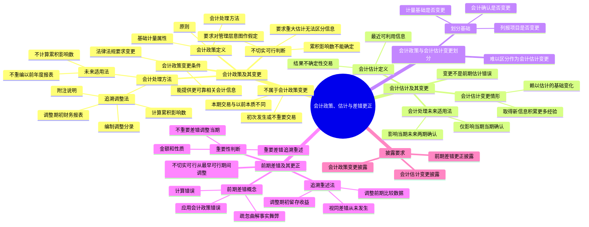

## 📍 章节定位

| 项目 | 信息 |
|------|------|
| **所属科目** | 📒 会计 |
| **难度等级** | ⭐⭐⭐ |
| **历年分值** | 4-5分 |
| **建议学时** | 5-6h |

## 📝 考情分析

本章是会计科目的重要章节，历年分值约 4-5 分，常以客观题和计算分析题形式考查，并广泛结合固定资产、收入、所得税、差错更正、资产负债表日后事项等章节出题。命题热点集中在：

1. **会计政策与会计估计的划分**：会计政策的定义（企业在会计确认、计量和报告中所采用的原则、基础和会计处理方法）、会计估计的定义（企业对结果不确定性的交易或者事项以最近可利用的信息为基础所作的判断），以会计确认、计量基础和列报项目是否发生变更作为划分基础。
2. **会计政策变更的会计处理**：追溯调整法的应用（计算累积影响数、编制调整分录、调整列报前期最早期初财务报表相关项目、附注说明），未来适用法的应用（不计算累积影响数，不重编以前年度财务报表），不切实可行的判断。
3. **会计估计变更的会计处理**：未来适用法的应用（仅影响变更当期的在当期确认；既影响当期又影响未来期间的在当期和未来期间确认）。
4. **前期差错更正的会计处理**：前期差错的概念（计算错误、应用会计政策错误、疏忽或曲解事实、舞弊产生的影响），前期差错重要性的判断，追溯重述法的应用（重要的前期差错），不重要的前期差错的处理。
5. **会计政策变更与会计估计变更的区分**：涉及会计确认、计量基础、列报项目变更的为会计政策变更；仅为取得与资产负债表项目有关的金额或数值所采用的处理方法变更的为会计估计变更；难以区分的作为会计估计变更处理。

考生需重点掌握：会计政策变更采用**追溯调整法**，将累积影响数调整列报前期最早期初留存收益；会计估计变更采用**未来适用法**，不改变以前期间的会计估计；重要的前期差错采用**追溯重述法**更正，视同该项前期差错从未发生过；不切实可行的判断（累积影响数不能确定、要求对管理层意图作出假定、要求对金额进行重大估计且无法区分两类信息）；滥用会计政策按前期差错更正处理；企业难以区分会计政策变更和会计估计变更的，应当将其作为会计估计变更处理。

## 🧠 知识框架



## 📖 核心精讲

### 一、会计政策及其变更

#### （一）会计政策的定义

**会计政策**，是指企业在会计确认、计量和报告中所采用的原则、基础和会计处理方法。

| 层次 | 内容 | 举例 |
|------|------|------|
| **原则** | 按照企业会计准则规定的、适合企业会计要素确认过程中所采用的具体会计原则 | 收入确认原则（客户取得商品控制权时确认收入） |
| **基础** | 为了将会计原则应用于交易或者事项而采用的基础，主要是计量基础（计量属性） | 历史成本、重置成本、可变现净值、现值、公允价值 |
| **会计处理方法** | 企业按照法律、行政法规或者国家统一的会计制度等规定采用或者选择的、适合本企业的具体会计处理方法 | 发出存货计价方法（先进先出法、加权平均法、个别计价法） |

会计政策具有以下特点：
1. **会计政策的选择性**：在允许的会计原则、基础和会计处理方法中作出指定或具体选择。
2. **会计政策应当在会计准则规定的范围内选择**：具有一定的强制性，企业必须在法规所允许的范围内选择。
3. **会计政策的层次性**：包括原则、基础和会计处理方法三个层次，三者是一个具有逻辑性的、密不可分的整体。

#### （二）会计政策变更的概念

**会计政策变更**，是指企业对相同的交易或者事项由原来采用的会计政策改用另一会计政策的行为。一般情况下，企业采用的会计政策在每一会计期间和前后各期应当保持一致，**不得随意变更**。满足下列条件之一的，可以变更会计政策：

1. **法律、行政法规或者国家统一的会计制度等要求变更**。
2. **会计政策变更能够提供更可靠、更相关的会计信息**。

> 如无充分、合理的证据表明会计政策变更的合理性，或者未重新经股东会或董事会批准擅自变更会计政策的，或者连续、反复地自行变更会计政策的，视为**滥用会计政策**，按照前期差错更正的方法进行会计处理。

#### （三）不属于会计政策变更的情况

下列两种情况**不属于**会计政策变更：

1. **本期发生的交易或者事项与以前相比具有本质差别而采用新的会计政策**。例如，企业将自用的办公楼改为出租，不属于会计政策变更，而是采用新的会计政策。
2. **对初次发生的或不重要的交易或者事项采用新的会计政策**。例如，甲公司为新设的建筑公司，首次签订建造合同并按履约进度确认收入，不属于会计政策变更。

### 二、会计估计及其变更

#### （一）会计估计的概念

**会计估计**，是指企业对结果不确定性的交易或者事项以最近可利用的信息为基础所作的判断。会计估计具有如下特点：

1. 会计估计的存在是由于经济活动中内在的不确定性因素的影响（如坏账、折旧年限、履约进度等）。
2. 进行会计估计时，往往以最近可利用的信息或资料为基础。
3. 进行会计估计并不会削弱会计确认和计量的可靠性。

通常属于会计估计的项目包括：存货可变现净值的确定、固定资产的预计使用寿命与净残值、无形资产的摊销年限、预计负债金额的确定、履约进度的确定、公允价值的确定、信用减值损失的确定等。

#### （二）会计估计变更的概念

**会计估计变更**，是指由于资产和负债的当前状况及预期经济利益和义务发生了变化，从而对资产或负债的账面价值或者资产的定期消耗金额进行调整。会计估计变更的情形包括：

1. **赖以进行估计的基础发生了变化**。例如，无形资产原按 10 年摊销，使用 3 年后估计尚存 4 年，将摊销年限变更为 7 年。
2. **取得了新的信息、积累了更多的经验**。例如，固定资产原估计使用 20 年，使用 5 年后根据最新信息判断尚可使用 10 年。

> **重要**：会计估计变更，并不意味着以前期间会计估计是错误的，只是由于情况发生变化或掌握了新信息。如果以前期间的会计估计是错误的，则属于**前期差错**，按前期差错更正处理。

### 三、会计政策变更与会计估计变更的划分

企业应当以**变更事项的会计确认、计量基础和列报项目是否发生变更**作为判断该变更是会计政策变更还是会计估计变更的划分基础。

| 划分基础 | 会计政策变更 | 会计估计变更 |
|---------|------------|------------|
| **会计确认是否发生变更** | 会计确认发生变更的属于会计政策变更（如研发费用由费用化改为资本化） | 不涉及会计确认变更 |
| **计量基础是否发生变更** | 计量基础发生变更的属于会计政策变更（如固定资产初始计量由全部价款改为购买价款现值） | 不涉及计量基础变更 |
| **列报项目是否发生变更** | 列报项目发生变更的属于会计政策变更（如进货费用由计入当期损益改为计入存货采购成本） | 不涉及列报项目变更 |
| **金额或数值的确定方法** | — | 为取得与资产负债表项目有关的金额或数值所采用的处理方法变更属于会计估计变更（如公允价值确定方法的变更） |

> **难以区分的处理**：企业通过判断会计政策变更和会计估计变更划分基础，仍然难以对某项变更进行区分的，应当将其作为**会计估计变更**处理。

**典型例子**：
- 固定资产折旧方法由双倍余额递减法改为直线法 → **会计估计变更**（计量基础、会计确认、列报项目均未变更，只是折旧金额变化）。
- 借款费用由计入当期损益改为资本化 → **会计政策变更**（会计确认和列报项目发生变更）。

### 四、会计政策变更的会计处理

#### （一）会计处理原则

会计政策变更根据具体情况分别按下列规定处理：

| 情形 | 处理方法 |
|------|---------|
| 法律法规要求变更，国家发布相关会计处理办法 | 按国家发布的相关会计处理规定处理 |
| 法律法规要求变更，国家没有发布相关会计处理办法 | 采用**追溯调整法** |
| 会计政策变更能提供更可靠、更相关的会计信息 | 采用**追溯调整法** |
| 确定会计政策变更对列报前期影响数不切实可行 | 从可追溯调整的最早期间期初开始应用变更后的会计政策 |
| 在当期期初确定会计政策变更对以前各期累积影响数不切实可行 | 采用**未来适用法**处理 |

#### （二）追溯调整法

**追溯调整法**，是指对某项交易或事项变更会计政策，视同该项交易或事项初次发生时即采用变更后的会计政策，并以此对财务报表相关项目进行调整的方法。

**追溯调整法的步骤**：
1. **计算会计政策变更的累积影响数**；
2. **编制相关项目的调整分录**；
3. **调整列报前期最早期初财务报表相关项目及其金额**；
4. **附注说明**。

**会计政策变更累积影响数**，是指按照变更后的会计政策对以前各期追溯计算的列报前期最早期初留存收益**应有金额**与**现有金额**之间的差额。上述留存收益金额包括法定盈余公积、任意盈余公积和未分配利润各项目，**不考虑**由于损益的变化而应当补分的利润或股利。

**累积影响数的计算步骤**：
1. 根据新会计政策重新计算受影响的前期交易或事项；
2. 计算两种会计政策下的差异；
3. 计算差异的所得税影响金额；
4. 确定前期中的每一期的税后差异；
5. 计算会计政策变更的累积影响数。

> 对以前年度损益进行追溯调整或财务报表追溯重述的，应当**重新计算各列报期间的每股收益**。

#### （三）不切实可行的判断

**不切实可行**，是指企业在作出所有合理努力后仍然无法采用某项会计准则规定。对于下列特定前期，对某项会计政策变更应用追溯调整法是不切实可行的：
1. 应用追溯调整法的累积影响数不能确定。
2. 应用追溯调整法要求对管理层在该期当时的意图作出假定。
3. 应用追溯调整法要求对有关金额进行重大估计，并且不可能将两类信息客观地加以区分。

> 当在前期采用一项新会计政策时，不论是对管理层在某个前期的意图作出假定，还是估计在前期确认、计量或者披露的金额，都**不应当使用"后见之明"**。

#### （四）未来适用法

**未来适用法**，是指将变更后的会计政策应用于变更日及以后发生的交易或者事项，或者在会计估计变更当期和未来期间确认会计估计变更影响数的方法。

在未来适用法下，**不需要计算**会计政策变更产生的累积影响数，也**无须重编**以前年度的财务报表。企业会计账簿记录及财务报表上反映的金额，变更之日仍保留原有的金额，不因会计政策变更而改变以前年度的既定结果。

#### （五）会计政策变更的披露

企业应当在附注中披露：
1. 会计政策变更的性质、内容和原因。
2. 当期和各个列报前期财务报表中受影响的项目名称和调整金额。
3. 无法进行追溯调整的，说明该事实和原因以及开始应用变更后会计政策的时点、具体应用情况。

### 五、会计估计变更的会计处理

企业对会计估计变更应当采用**未来适用法**处理：

| 情形 | 处理 |
|------|------|
| 仅影响变更当期 | 其影响数在变更当期予以确认 |
| 既影响变更当期又影响未来期间 | 其影响数在变更当期和未来期间予以确认 |

会计估计变更的影响数应当计入变更当期与前期相同的项目中，以保证不同期间的财务报表具有可比性。

> **关键判断**：企业难以区分会计政策变更和会计估计变更的，应当将其作为**会计估计变更**处理，采用未来适用法。

### 六、前期差错及其更正

#### （一）前期差错的概念

**前期差错**，是指由于没有运用或错误运用下列两种信息，而对前期财务报表造成省略或错报：
1. 编报前期财务报表时预期能够取得并加以考虑的可靠信息；
2. 前期财务报告批准报出时能够取得的可靠信息。

前期差错的情形主要包括：
1. **计算以及账户分类错误**。
2. **采用法律、行政法规或者国家统一的会计制度等不允许的会计政策**。
3. **对事实的疏忽或曲解事实，以及舞弊所产生的影响**。

#### （二）前期差错重要性的判断

前期差错分为**重要的前期差错**和**不重要的前期差错**：

| 类型 | 定义 |
|------|------|
| **重要的前期差错** | 足以影响财务报表使用者对企业财务状况、经营成果和现金流量作出正确判断的前期差错 |
| **不重要的前期差错** | 不足以影响财务报表使用者对企业财务状况、经营成果和现金流量作出正确判断的前期差错 |

前期差错的重要性取决于在相关环境下对遗漏或错误表述的**规模和性质**的判断。前期差错所影响的财务报表项目的金额越大、性质越严重，其重要性水平越高。

> **重要**：企业不应简单将会计估计与实际结果对比认定存在差错。如果企业前期作出会计估计时，未能合理使用报表编报时已经存在且能够取得的可靠信息，导致前期会计估计结果未恰当反映当时情况，则属于前期差错；反之，如果前期会计估计是以当时的信息、假设等并进行合理估计为基础作出的，随后因情况变化变更会计估计的，则属于会计估计变更。

#### （三）前期差错更正的会计处理

**1. 不重要的前期差错**

对于不重要的前期差错，企业**不需调整财务报表相关项目的期初数**，但应调整发现当期与前期相同的相关项目：
- 属于影响损益的，应直接计入本期与上期相同的净损益项目；
- 属于不影响损益的，应调整本期与前期相同的相关项目。

**2. 重要的前期差错**

企业应当采用**追溯重述法**更正重要的前期差错，但确定前期差错累积影响数不切实可行的除外。

**追溯重述法**，是指在发现前期差错时，视同该项前期差错从未发生过，从而对财务报表相关项目进行更正的方法。

对于重要的前期差错，企业应当在其发现当期的财务报表中，调整前期比较数据：
1. 追溯重述差错发生期间列报的前期比较金额；
2. 如果前期差错发生在列报的最早前期之前，则追溯重述列报的最早前期的资产、负债和所有者权益相关项目的期初余额。

对于发生的重要的前期差错：
- **影响损益的**，应将其对损益的影响数调整发现当期的期初留存收益，财务报表其他相关项目的期初数也应一并调整；
- **不影响损益的**，应调整财务报表相关项目的期初数。

**追溯重述法的会计分录**（通过"以前年度损益调整"科目）：

```
（1）补记费用：
借：以前年度损益调整
    贷：累计折旧（等相关科目）

（2）调整应交所得税：
借：应交税费——应交所得税
    贷：以前年度损益调整

（3）将"以前年度损益调整"科目余额转入利润分配：
借：利润分配——未分配利润
    贷：以前年度损益调整

（4）调整利润分配有关金额：
借：盈余公积
    贷：利润分配——未分配利润
```

> 上述会计处理也可以不通过"以前年度损益调整"科目。

#### （四）不切实可行的处理

确定前期差错影响数不切实可行的：
- 可以从可追溯重述的最早期间开始调整留存收益的期初余额；
- 也可以采用未来适用法。

> **注意**：对于年度资产负债表日至财务报告批准报出日之间发现的报告年度的会计差错及报告年度前不重要的前期差错，应按照《企业会计准则第 29 号——资产负债表日后事项》的规定进行处理。

#### （五）前期差错更正的披露

企业应当在附注中披露：
1. 前期差错的性质。
2. 各个列报前期财务报表中受影响的项目名称和更正金额。
3. 无法进行追溯重述的，说明该事实和原因以及对前期差错开始进行更正的时点、具体更正情况。

## 💡 典型例题

**【例题 1】（基础题，单选题）**

下列各项中，属于会计政策变更的是（　　）。
A. 固定资产折旧方法由年限平均法改为双倍余额递减法
B. 无形资产摊销年限由 10 年改为 8 年
C. 发出存货计价方法由后进先出法改为先进先出法
D. 固定资产预计净残值由 4 万元改为 2 万元

**答案**：C

**解析**：A 错误，固定资产折旧方法的改变属于会计估计变更（计量基础、会计确认、列报项目均未变更）；B 错误，无形资产摊销年限的改变属于会计估计变更；C 正确，发出存货计价方法的改变属于会计政策变更（会计处理方法发生变更）；D 错误，固定资产预计净残值的改变属于会计估计变更。

**【例题 2】（进阶题，单选题）**

下列关于会计政策变更会计处理的表述中，正确的是（　　）。
A. 企业因法律环境变化改变会计政策的，应当一律采用追溯调整法
B. 采用追溯调整法时，应当将会计政策变更累积影响数计入当期损益
C. 确定会计政策变更对列报前期影响数不切实可行的，应当采用未来适用法
D. 在当期期初确定会计政策变更对以前各期累积影响数不切实可行的，应当采用未来适用法

**答案**：D

**解析**：A 错误，法律环境变化改变会计政策，国家发布相关会计处理办法的按其规定处理，未发布的采用追溯调整法；B 错误，追溯调整法下累积影响数调整列报前期最早期初留存收益，不计入当期损益；C 错误，确定对列报前期影响数不切实可行的，应从可追溯调整的最早期间期初开始应用变更后的会计政策，不直接采用未来适用法；D 正确，在当期期初确定对以前各期累积影响数不切实可行的，采用未来适用法。

**【例题 3】（计算题，会计政策变更追溯调整法）**

甲公司是一家海洋石油开采公司，于 2×16 年 12 月 15 日建造完成一座海上石油开采平台并交付使用，建造成本共 120 000 000 元，预计使用寿命 10 年，采用年限平均法计提折旧。2×22 年 1 月 1 日甲公司开始执行企业会计准则，对于具有弃置义务的固定资产，要求将相关弃置费用计入固定资产成本，对之前尚未计入资产成本的弃置费用应当进行追溯调整。甲公司预计该开采平台的弃置费用 10 000 000 元，折现率（实际利率）为 10%。不考虑相关税费及其他因素影响。

要求：计算 2×22 年初会计政策变更的累积影响数并编制调整分录。

**答案**：

（1）计算累积影响数：

2×17 年 1 月 1 日弃置费用的现值 = 10 000 000 × (P/F, 10%, 10) = 10 000 000 × 0.3855 = **3 855 000（元）**

每年应计提折旧 = 3 855 000 ÷ 10 = 385 500（元）

各年利息费用计算（截至 2×21 年末）：
- 2×17 年：利息费用 385 500 元，折旧 385 500 元，合计影响 -771 000 元
- 2×18 年：利息费用 424 050 元，折旧 385 500 元，合计影响 -809 550 元
- 2×19 年：利息费用 466 455 元，折旧 385 500 元，合计影响 -851 955 元
- 2×20 年：利息费用 513 100.50 元，折旧 385 500 元，合计影响 -898 600.50 元
- 2×21 年：利息费用 564 410.55 元，折旧 385 500 元，合计影响 -949 910.55 元

**累积影响数** = 利息费用合计 − 折旧合计 = 2 353 516.05 − 1 927 500 = **−4 281 016.05（元）**

（即累积影响数为减少留存收益 4 281 016.05 元）

（2）编制 2×22 年 1 月 1 日的调整分录：

① 调整确认的弃置费用：
```
借：固定资产——开采平台——弃置义务   3 855 000
    贷：预计负债——开采平台弃置义务    3 855 000
```

② 调整会计政策变更累积影响数：
```
借：利润分配——未分配利润           4 281 016.05
    贷：累计折旧                    1 927 500.00
        预计负债——开采平台弃置义务   2 353 516.05
```

**解析**：追溯调整法下，将弃置费用的现值计入固定资产成本，同时确认预计负债；以前期间多计的利润（少计折旧和利息费用）通过"利润分配——未分配利润"调整。累积影响数为按新政策追溯计算的期初留存收益与现有金额的差额。

**【例题 4】（计算题，会计估计变更未来适用法）**

甲公司有一台管理用设备，原价为 84 万元，预计使用寿命为 8 年，预计净残值为 4 万元，自 2×18 年 1 月 1 日起按年限平均法计提折旧。2×22 年 1 月 1 日，由于新技术的发展等原因，需要对原预计使用寿命和净残值作出修正，修改后的预计使用寿命为 6 年，预计净残值为 2 万元，折旧方法不变。甲公司适用的企业所得税税率为 25%，假定税法允许按变更后的折旧额在税前扣除。

要求：计算 2×22 年的折旧费用并编制会计分录。

**答案**：

（1）不调整以前各期折旧，也不计算累积影响数（未来适用法）。

（2）变更日以后按新估计计提折旧：
- 已提折旧 4 年，共计 40 万元（每年 10 万元）
- 固定资产净值 = 84 − 40 = 44（万元）
- 2×22 年起每年折旧费用 = (44 − 2) ÷ (6 − 4) = 42 ÷ 2 = **21（万元）**

（3）会计分录：
```
借：管理费用                  210 000
    贷：累计折旧                210 000
```

（4）此估计变更影响本年度净利润减少数 = (21 − 10) × (1 − 25%) = 11 × 75% = **8.25（万元）**

**解析**：会计估计变更采用未来适用法，不调整以前各期折旧，不计算累积影响数，只在变更当期及以后期间按新估计计提折旧。

**【例题 5】（计算题，前期差错更正追溯重述法）**

B 公司在 2×26 年发现，2×25 年公司漏记一项管理用固定资产的折旧费用 150 000 元，所得税申报表中未扣除该项费用。假设 2×25 年适用所得税税率为 25%，无其他纳税调整事项。该公司按净利润的 10%、5% 提取法定盈余公积和任意盈余公积。假定税法允许调整应交所得税。

要求：编制前期差错更正的会计分录。

**答案**：

（1）分析前期差错的影响数：
- 2×25 年少计折旧费用 150 000 元
- 多计所得税费用 37 500 元（150 000 × 25%）
- 多计净利润 112 500 元
- 多计应交税费 37 500 元
- 多提法定盈余公积 11 250 元（112 500 × 10%）
- 多提任意盈余公积 5 625 元（112 500 × 5%）

（2）编制调整分录：

```
① 补记折旧：
借：以前年度损益调整              150 000
    贷：累计折旧                  150 000

② 调整应交所得税：
借：应交税费——应交所得税         37 500
    贷：以前年度损益调整           37 500

③ 将"以前年度损益调整"科目余额转入利润分配：
借：利润分配——未分配利润        112 500
    贷：以前年度损益调整          112 500

④ 调整利润分配有关金额：
借：盈余公积                     16 875
    贷：利润分配——未分配利润     16 875
```

**解析**：重要的前期差错采用追溯重述法更正，通过"以前年度损益调整"科目调整。先补记少记的费用，再调整多交的所得税，然后将以前年度损益调整余额转入未分配利润，最后调整多提的盈余公积。

**【例题 6】（综合题，会计政策变更与会计估计变更的区分）**

下列各项中，企业应当作为会计政策变更进行会计处理的有（　　）。
A. 投资性房地产后续计量由成本模式改为公允价值模式
B. 存货发出计价方法由加权平均法改为先进先出法
C. 固定资产预计使用年限由 10 年改为 8 年
D. 建造合同收入确认由完成合同法改为履约进度法

**答案**：A、B、D

**解析**：A 属于会计政策变更，投资性房地产后续计量模式变更涉及计量基础的变更（由历史成本改为公允价值）；B 属于会计政策变更，发出存货计价方法是会计处理方法，其变更属于会计政策变更；C 属于会计估计变更，固定资产预计使用年限是为取得与资产负债表项目有关金额所采用的处理方法，其变更属于会计估计变更；D 属于会计政策变更，收入确认方法（会计处理方法）的变更属于会计政策变更。

## 🎯 记忆口诀

- **会计政策三层次**："原则、基础、处理方法"——会计政策包括具体原则、计量基础和会计处理方法。
- **会计政策变更两条件**："法规要求或更可靠"——法律法规要求变更，或能提供更可靠更相关会计信息。
- **不属于政策变更两情况**："本质不同或初次发生"——本期交易与以前本质不同采用新政策、对初次或不重要交易采用新政策。
- **追溯调整四步**："算累积、编分录、调报表、附注说"——计算累积影响数、编制调整分录、调整期初财务报表、附注说明。
- **累积影响数**："应有金额减现有金额"——按新政策追溯计算的期初留存收益与现有金额的差额，不计入当期损益。
- **未来适用法**："不算累积不重编"——不计算累积影响数，不重编以前年度财务报表。
- **政策与估计划分**："确认、计量、列报变则政策，金额数值方法变则估计"——涉及会计确认、计量基础、列报项目变更的为会计政策变更。
- **难以区分**："作为估计变更处理"——难以区分会计政策变更和会计估计变更的，作为会计估计变更。
- **会计估计变更**："未来适用法，当期未来确认"——采用未来适用法，影响当期或当期及未来期间。
- **前期差错更正**："重要追溯重述，不重要调当期"——重要的前期差错采用追溯重述法，不重要的调整发现当期。
- **追溯重述法**："视同从未发生"——视同该项前期差错从未发生过，调整前期比较数据。
- **滥用会计政策**："按前期差错更正处理"——滥用会计政策视为前期差错。

## ✅ 同步练习

1. （基础题）会计政策的定义和特点，会计政策变更的条件，不属于会计政策变更的情形，滥用会计政策的处理。提示：参见《必刷 550 题》会计政策变更基础题。
2. （进阶题）会计估计的定义和特点，会计估计变更的情形，会计政策变更与会计估计变更的划分基础（会计确认、计量基础、列报项目）。提示：参见《必刷 550 题》会计估计变更进阶题。
3. （易错题）追溯调整法的应用步骤，累积影响数的计算，不切实可行的判断，未来适用法的应用条件。提示：参见《必刷 550 题》追溯调整法易错题。
4. （计算题）会计政策变更追溯调整法的会计处理（计算累积影响数、编制调整分录、调整财务报表），会计估计变更未来适用法的会计处理。提示：参见《必刷 550 题》会计政策变更计算题。
5. （真题改编）前期差错的概念和类型，前期差错重要性的判断，重要的前期差错追溯重述法的会计处理，不重要的前期差错的处理。提示：参见历年真题计算分析题。
6. （综合题）会计政策变更、会计估计变更、前期差错更正的综合运用，结合固定资产、收入、所得税等章节的差错更正，资产负债表日后事项与前期差错更正的关系。提示：参见历年真题综合题。
7. 综合复习会计政策变更与会计估计变更的区分（折旧方法变更、存货计价方法变更、投资性房地产计量模式变更等典型例子），追溯调整法与追溯重述法的异同，披露要求的对比。
