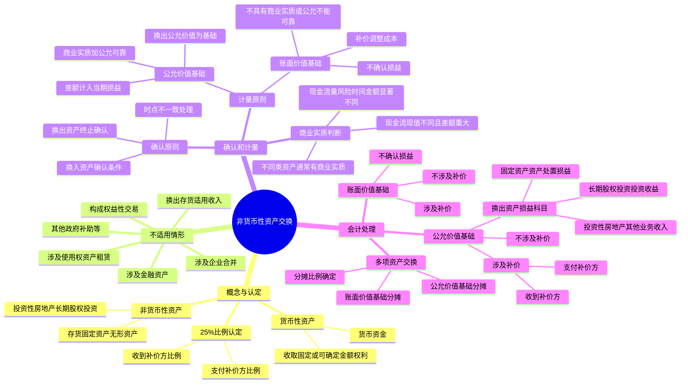

## 1. 章节定位

| 项目 | 信息 |
|------|------|
| 所属科目 | 会计 |
| 难度等级 | 3 |
| 历年分值 | 2-4 分 |
| 建议学时 | 3-4 小时 |
| 知识关联章节 | 第7章 固定资产（换出资产的清理与处置损益）、第8章 无形资产、第13章 金融工具（金融资产交换的特殊处理）、第17章 收入（换出存货适用收入准则）、第26章 企业合并（涉及企业合并不适用本章） |

## 2. 考情分析

本章属于会计科目的基础性章节，历年分值约 2-4 分，多以客观题和计算分析题形式出现，主观题中常以一项业务环节的形式出现在综合题中。

**命题规律**：本章考点相对集中，命题点清晰，主要考查非货币性资产交换的认定（25% 比例的判断）、商业实质的判断、以公允价值为基础计量与以账面价值为基础计量的会计处理差异、涉及补价和涉及多项资产的会计处理。近年来对换出资产不同类别对应不同损益科目的考查有所增加。

**高频考点分布**：

1. **货币性资产与非货币性资产的区分**：货币性资产（货币资金及固定或可确定金额的收取权利）vs 非货币性资产（存货、固定资产、无形资产、投资性房地产、长期股权投资等）。
2. **非货币性资产交换的认定（25% 比例）**：补价占整个资产交换金额的比例低于 25% 的视为非货币性资产交换；高于 25%（含 25%）的不视为非货币性资产交换，适用收入准则。
3. **不适用非货币性资产交换准则的情形**：换出资产为存货（适用收入准则）、涉及企业合并、涉及金融资产、涉及使用权资产或应收融资租赁款、构成权益性交易、其他（政府补助、分配给所有者、非货币性福利、发行股票取得资产）。
4. **商业实质的判断**：两个条件（现金流量的风险、时间分布或金额显著不同；现金流现值不同且差额重大）。
5. **以公允价值为基础计量**：同时满足商业实质 + 公允价值可靠计量的条件；以换出资产公允价值为基础（除非换入资产公允价值更可靠）；换出资产公允价值与账面价值的差额计入当期损益。
6. **换出资产不同类别对应的损益科目**：固定资产/无形资产/在建工程→资产处置损益；长期股权投资→投资收益；投资性房地产→其他业务收入/其他业务成本。
7. **以账面价值为基础计量**：不具有商业实质或公允价值不能可靠计量；不确认损益；补价作为换入资产成本的调整因素。
8. **涉及多项资产的交换**：按各项换入资产公允价值（或账面价值）的相对比例分摊换入资产总成本。

**联动考查方式**：
- 与固定资产章节结合：换出固定资产的清理与处置损益；
- 与收入章节结合：换出存货适用收入准则（不属于本章范围）；
- 与金融工具章节结合：涉及金融资产的交换适用金融工具准则；
- 与所得税章节结合：非货币性资产交换的递税处理。

**备考建议**：
- 牢记 25% 比例的判断公式：收到补价方 = 收到的补价 ÷ 换出资产公允价值（或换入资产公允价值 + 收到的补价）；支付补价方 = 支付的补价 ÷（换出资产公允价值 + 支付的补价）（或换入资产公允价值）；
- 区分两种计量基础的前提条件：商业实质 + 公允价值可靠计量 → 公允价值基础；否则 → 账面价值基础；
- 牢记换出资产不同类别对应的损益科目；
- 注意换出存货不适用本章，适用收入准则；
- 涉及多项资产交换时，分摊比例的确定（公允价值比例或账面价值比例）。

## 3. 知识框架

## 4. 核心精讲

### 4.1 非货币性资产交换的概念

#### 4.1.1 货币性资产与非货币性资产

资产按未来经济利益流入（表现形式是货币金额）是否固定或可确定，分为货币性资产和非货币性资产。

**货币性资产**是指企业持有的货币资金和收取固定或可确定金额的货币资金的权利，包括现金、银行存款、应收账款和应收票据等。

**非货币性资产**是指货币性资产以外的资产，如存货（原材料、包装物、低值易耗品、库存商品等）、固定资产、在建工程、生产性生物资产、无形资产、投资性房地产、长期股权投资等。非货币性资产有别于货币性资产的最基本特征是其在将来为企业带来的经济利益（即货币金额）是不固定的或不可确定的。

#### 4.1.2 非货币性资产交换的概念

**非货币性资产交换**是指企业主要以固定资产、无形资产、投资性房地产和长期股权投资等非货币性资产进行的交换。该交换不涉及或只涉及少量的货币性资产（即补价）。

非货币性资产交换具有如下特征：

1. **交易对象主要是非货币性资产**：企业为了满足各自生产经营的需要，同时减少货币性资产的流入和流出，进行非货币性资产交换交易。
2. **是以非货币性资产进行交换的行为**：交换通常是指一个企业和另一个企业之间的互惠转让。非互惠的非货币性资产转让（如企业捐赠非货币性资产等）不属于本章所述的非货币性资产交换。
3. **一般不涉及货币性资产，但有时也可能涉及少量的货币性资产**。

**判断角度**：企业应从自身的角度，根据交易的实质判断相关交易是否属于非货币性资产交换，不应基于交易双方的情况进行判断。例如，投资方以一项固定资产出资取得对被投资方的权益性投资，对投资方来说属于非货币性资产交换；对于被投资方来说，虽取得了实物资产，但属于接受权益性投资，不属于非货币性资产交换。

#### 4.1.3 非货币性资产交换的认定（25% 比例）

非货币性资产交换一般不涉及货币性资产，或只涉及少量货币性资产即补价。《企业会计准则第 7 号——非货币性资产交换》规定，认定涉及少量货币性资产的交换为非货币性资产交换，通常以补价占整个资产交换金额的比例是否低于 25% 作为参考比例：

| 角色 | 比例公式 | 认定 |
|------|---------|------|
| 收到补价方 | 收到的补价的公允价值 ÷ 换出资产公允价值（或换入资产公允价值 + 收到的货币性资产） | 低于 25% 的视为非货币性资产交换 |
| 支付补价方 | 支付的货币性资产 ÷（换出资产公允价值 + 支付的补价的公允价值）（或换入资产公允价值） | 低于 25% 的视为非货币性资产交换 |

如果上述比例高于 25%（含 25%）的，则不视为非货币性资产交换，适用《企业会计准则第 14 号——收入》等相关准则的规定。

### 4.2 非货币性资产交换不涉及的交易和事项

本章所指非货币性资产交换不涉及以下交易和事项：

1. **换出资产为存货的非货币性资产交换**：企业以存货换取客户的非货币性资产（如固定资产、无形资产等）的，换出存货的企业相关的会计处理适用收入准则。
2. **非货币性资产交换中涉及的企业合并**：适用企业合并准则、长期股权投资准则和合并财务报表准则。
3. **非货币性资产交换中涉及的金融资产**：金融资产的确认、终止确认和计量适用金融工具确认和计量准则、金融资产转移准则。
4. **非货币性资产交换中涉及使用权资产或应收融资租赁款**：相关资产的确认、终止确认和计量适用租赁准则。
5. **非货币性资产交换构成权益性交易**：非货币性资产交换的一方直接或间接对另一方持股且以股东身份进行交易，或者非货币性资产交换的双方均受同一方或相同的多方最终控制，且该非货币性资产交换的交易实质是交换的一方向另一方进行了权益性分配或交换的一方接受了另一方权益性投入，应当适用权益性交易的有关会计处理规定，不确认构成权益交易部分的相关损益。
6. **其他不适用非货币性资产交换准则的交易和事项**：
   - 企业从政府无偿取得非货币性资产的，适用政府补助准则；
   - 企业将非流动资产或处置组分配给所有者的，适用持有待售准则；
   - 企业以非货币性资产向职工发放非货币性福利的，适用职工薪酬准则；
   - 企业以发行股票形式取得的非货币性资产，相当于以权益工具换入非货币性资产，其成本确定适用相关资产准则；
   - 企业用于非货币性资产交换的非货币性资产应当符合资产的定义并满足资产的确认条件，且作为资产列报于企业的资产负债表上。

### 4.3 非货币性资产交换的确认原则

企业在非货币性资产交换中：

- 对于**换入资产**，应当在其符合资产定义并满足资产确认条件时予以确认；
- 对于**换出资产**，应当在其满足资产终止确认条件时终止确认。

通常情况下，换入资产的确认时点与换出资产的终止确认时点应当相同或相近。实务中，由于资产控制权转移所需的运输或转移程序等方面的原因，可能导致换入资产满足确认条件的时点与换出资产满足终止确认条件的时点存在短暂不一致：

| 情况 | 会计处理 |
|------|---------|
| 换入资产满足确认条件，换出资产尚未满足终止确认条件 | 在确认换入资产的同时将交付换出资产的义务确认为一项负债（如其他应付款等） |
| 换入资产尚未满足资产确认条件，换出资产满足终止确认条件 | 在终止确认换出资产的同时将取得换入资产的权利确认为一项资产（如其他应收款等） |

### 4.4 非货币性资产交换的计量原则

#### 4.4.1 以公允价值为基础计量

非货币性资产交换同时满足下列两个条件的，应当以公允价值和应支付的相关税费作为换入资产的成本，公允价值与换出资产账面价值的差额计入当期损益：

1. 该项交换具有**商业实质**；
2. 换入资产或换出资产的**公允价值能够可靠地计量**。

**公允价值的选择**：换入资产和换出资产公允价值均能够可靠计量的，应当以换出资产公允价值作为确定换入资产成本的基础。如果有确凿证据表明换入资产的公允价值更加可靠的，应当以换入资产公允价值为基础确定换入资产的成本。

#### 4.4.2 以账面价值为基础计量

不具有商业实质或交换涉及资产的公允价值均不能可靠计量的非货币性资产交换，应当按照换出资产的账面价值和应支付的相关税费，作为换入资产的成本，无论是否支付补价，均**不确认损益**；收到或支付的补价作为确定换入资产成本的调整因素。

### 4.5 商业实质的判断

非货币性资产交换具有商业实质，是能够以公允价值为基础计量的重要条件之一。企业应当重点考虑由于发生了该项资产交换预期使企业未来现金流量发生变动的程度，通过比较换出资产和换入资产预计产生的未来现金流量或其现值，确定非货币性资产交换是否具有商业实质。只有当换出资产和换入资产预计未来现金流量或其现值两者之间的差额较大时，才能表明交易的发生使企业经济状况发生了明显改变，非货币性资产交换因而具有商业实质。

企业发生的非货币性资产交换，满足下列条件之一的，视为具有商业实质：

**条件一：换入资产的未来现金流量在风险、时间分布或金额方面与换出资产显著不同**

通常情况下，只要换入资产和换出资产的未来现金流量在其中某个方面存在显著不同，即表明满足商业实质的判断条件。

例如，某企业以对联营企业的投资换入一项设备，两者产生现金流量的时间相差较大；又如甲企业以经营出租的公寓楼与乙企业同样用于经营出租的公寓楼交换，两楼租期、租金总额相同，但甲企业租给财务信用良好的企业（风险较小），乙企业租给散户（风险较大），两者现金流量流入的风险或不确定性程度存在明显差异。

**条件二：使用换入资产所产生的预计未来现金流量现值与继续使用换出资产所产生的预计未来现金流量现值不同，且其差额与换入资产和换出资产的公允价值相比是重大的**

资产预计未来现金流量现值，应当按照资产在持续使用过程和最终处置时预计产生的税后未来现金流量（使用企业自身的所得税税率），根据企业自身而不是市场参与者对资产特定风险的评价，选择恰当的折现率对预计未来现金流量折现后的金额加以确定，以体现资产对企业自身的特定价值。

**资产类别与商业实质的关系**：

- **不同类非货币性资产交换**：因其产生经济利益的方式不同，一般来说产生的未来现金流量风险、时间分布或金额也不相同，通常较易判断具有商业实质。例如，企业以投资性房地产交换固定资产自用。
- **同类非货币性资产交换**：是否具有商业实质通常较难判断，需要根据上述两项判断条件综合判断。例如，甲企业将自己拥有的一幢建筑物与乙企业在同一地点的另一幢建筑物交换，两幢建筑物的建造时间、建造成本等均相同，如果其中一幢可以立即出售，另一幢难以出售或只能在较长时间内出售，则两项资产未来现金流量的风险、时间分布或金额显著不同，具有商业实质。

### 4.6 以公允价值为基础计量的会计处理

非货币性资产交换具有商业实质且公允价值能够可靠计量的，应当以换出资产的公允价值和应支付的相关税费作为换入资产的成本，除非有确凿证据表明换入资产的公允价值比换出资产公允价值更加可靠。

**换出资产公允价值与账面价值的差额计入当期损益**，视换出资产的类别不同而有所区别：

| 换出资产类别 | 损益科目 |
|------------|---------|
| 固定资产、在建工程、生产性生物资产、无形资产 | 资产处置损益 |
| 长期股权投资 | 投资收益 |
| 投资性房地产 | 其他业务收入（按公允价值确认）/ 其他业务成本（按账面价值结转） |

#### 4.6.1 不涉及补价的情况

**【例 20-1 改编】（不涉及补价，以公允价值为基础）**

2×22 年 9 月，甲公司以生产经营过程中使用的一台设备交换乙打印机公司生产的一批打印机，换入的打印机作为固定资产管理。甲、乙公司均为增值税一般纳税人，假设适用的增值税税率均为 13%。设备的账面原值为 150 万元，在交换日的累计折旧为 45 万元，公允价值为 90 万元。打印机的账面价值为 110 万元，在交换日的市场价格为 90 万元，计税价格等于市场价格。假设甲公司此前没有为该项设备计提资产减值准备，整个交易过程中，除支付该项设备的运杂费 15 000 元外，没有发生其他相关税费。假设乙公司此前也没有为库存打印机计提存货跌价准备。

**分析**：整个资产交换过程没有涉及收付货币性资产，属于非货币性资产交换。两项资产交换后对换入企业的特定价值显著不同，具有商业实质；同时，两项资产的公允价值都能够可靠地计量，符合以公允价值计量的两个条件。

**甲公司的账务处理**：

- 换入打印机的增值税进项税额 = 900 000 × 13% = 117 000（元）
- 换出设备的增值税销项税额 = 900 000 × 13% = 117 000（元）

借：固定资产清理 1 050 000
　　累计折旧 450 000
　　贷：固定资产—设备 1 500 000

借：固定资产清理 15 000
　　贷：银行存款 15 000

借：固定资产—打印机 900 000
　　应交税费—应交增值税（进项税额） 117 000
　　资产处置损益 165 000
　　贷：固定资产清理 1 065 000
　　　　应交税费—应交增值税（销项税额） 117 000

**乙公司的账务处理**（换出存货适用收入准则）：

- 换出打印机的增值税销项税额 = 900 000 × 13% = 117 000（元）
- 换入设备的增值税进项税额 = 900 000 × 13% = 117 000（元）

借：固定资产—设备 900 000
　　应交税费—应交增值税（进项税额） 117 000
　　贷：主营业务收入 900 000
　　　　应交税费—应交增值税（销项税额） 117 000

借：主营业务成本 1 100 000
　　贷：库存商品—打印机 1 100 000

#### 4.6.2 涉及补价的情况

在以公允价值为基础确定换入资产成本的情况下，涉及补价的，支付补价方和收到补价方应当分别情况处理：

**支付补价方**：

- 以换出资产的公允价值为基础计量的：换入资产成本 = 换出资产公允价值 + 支付补价的公允价值 + 应支付的相关税费；换出资产公允价值与其账面价值之间的差额计入当期损益。
- 以换入资产的公允价值为基础计量的：换入资产成本 = 换入资产公允价值 + 应支付的相关税费；换入资产公允价值减去支付补价的公允价值，与换出资产账面价值之间的差额计入当期损益。

**收到补价方**：

- 以换出资产的公允价值为基础计量的：换入资产成本 = 换出资产公允价值 − 收到补价的公允价值 + 应支付的相关税费；换出资产公允价值与其账面价值之间的差额计入当期损益。
- 以换入资产的公允价值为基础计量的：换入资产成本 = 换入资产公允价值 + 应支付的相关税费；换入资产公允价值加上收到补价的公允价值，与换出资产账面价值之间的差额计入当期损益。

### 4.7 以账面价值为基础计量的会计处理

非货币性资产交换不具有商业实质，或者虽然具有商业实质但换入资产和换出资产的公允价值均不能可靠计量的，应当以换出资产账面价值为基础确定换入资产成本，无论是否支付补价，均**不确认损益**。

#### 4.7.1 不涉及补价的情况

对于换入资产，应当以换出资产的账面价值和应支付的相关税费作为换入资产的初始计量金额；对于换出资产，终止确认时不确认损益。

#### 4.7.2 涉及补价的情况

| 角色 | 换入资产初始计量金额 | 损益 |
|------|-------------------|------|
| 支付补价方 | 换出资产账面价值 + 支付补价的账面价值 + 应支付的相关税费 | 不确认损益 |
| 收到补价方 | 换出资产账面价值 − 收到补价的公允价值 + 应支付的相关税费 | 不确认损益 |

**【例 20-2 改编】（涉及补价，以账面价值为基础）**

甲公司拥有一台专有设备，该设备账面原值 450 万元，已计提折旧 330 万元；乙公司拥有一项长期股权投资，账面价值 90 万元，两项资产均未计提减值准备。甲公司决定以其专有设备交换乙公司的长期股权投资。由于专有设备系当时专门制造、性质特殊，其公允价值不能可靠计量；乙公司拥有的长期股权投资的公允价值也不能可靠计量。经双方商定，乙公司支付了 20 万元补价。假定交易不考虑相关税费。

**认定**：收到的补价 20 万元 ÷ 换出资产账面价值 120 万元 = 16.7% < 25%，属于非货币性资产交换。由于两项资产的公允价值不能可靠计量，应当以换出资产账面价值为基础计量。

**甲公司的账务处理**：

借：固定资产清理 1 200 000
　　累计折旧 3 300 000
　　贷：固定资产—专有设备 4 500 000

借：长期股权投资 1 000 000
　　银行存款 200 000
　　贷：固定资产清理 1 200 000

**乙公司的账务处理**：

借：固定资产—专有设备 1 100 000
　　贷：长期股权投资 900 000
　　　　银行存款 200 000

**解析**：在以账面价值计量的情况下，发生的补价只是用来调整换入资产的成本，不涉及确认损益。对甲公司而言，长期股权投资的成本 = 换出设备的账面价值 − 补价 = 120 − 20 = 100（万元）；对乙公司而言，专有设备的成本 = 换出资产的账面价值 = 90 + 20 = 110（万元）。

### 4.8 涉及多项非货币性资产交换的会计处理

企业以一项非货币性资产同时换入另一企业的多项非货币性资产，或同时以多项非货币性资产换入另一企业的一项非货币性资产，或以多项非货币性资产同时换入多项非货币性资产，也可能涉及补价。涉及多项资产的非货币性资产交换，企业无法将换出的某一资产与换入的某一特定资产相对应。

#### 4.8.1 以公允价值为基础计量的情况

**（1）以换出资产的公允价值为基础计量**

- 对于同时换入的多项资产：应当按照各项换入资产的公允价值的相对比例（换入资产的公允价值不能够可靠计量的，可以按照换入的金融资产以外的各项资产的原账面价值的相对比例或其他合理的比例），将换出资产公允价值总额（涉及补价的，加上支付补价的公允价值或减去收到补价的公允价值）分摊至各项换入资产，以分摊额和应支付的相关税费作为各项换入资产的成本进行初始计量。
- 对于同时换出的多项资产：应当将各项换出资产的公允价值与其账面价值之间的差额，在各项换出资产终止确认时计入当期损益。

**（2）以换入资产的公允价值为基础计量**

- 对于同时换入的多项资产：应当以各项换入资产的公允价值和应支付的相关税费作为各项换入资产的初始计量金额。
- 对于同时换出的多项资产：应当按照各项换出资产的公允价值的相对比例（换出资产的公允价值不能够可靠计量的，可以按照各项换出资产的账面价值的相对比例），将换入资产的公允价值总额（涉及补价的，减去支付补价的公允价值或加上收到补价的公允价值）分摊至各项换出资产，分摊额与各项换出资产账面价值之间的差额，在各项换出资产终止确认时计入当期损益。

#### 4.8.2 以账面价值为基础计量的情况

- 对于换入的多项资产：应当按照各项换入资产的公允价值的相对比例（换入资产的公允价值不能够可靠计量的，也可以按照各项换入资产的原账面价值的相对比例或其他合理的比例），将换出资产的账面价值总额（涉及补价的，加上支付补价的账面价值或减去收到补价的公允价值）分摊至各项换入资产，加上应支付的相关税费，作为各项换入资产的初始计量金额。
- 对于同时换出的多项资产：各项换出资产终止确认时均**不确认损益**。

**【例 20-4 改编】（多项资产交换，以账面价值为基础）**

2×22 年 5 月，甲公司因经营战略发生较大转变，将其专用设备连同专利技术与乙公司正在建造过程中的一幢建筑物，以及对丙公司的长期股权投资进行交换。甲公司换出专有设备的账面原值为 1 200 万元，已提折旧 750 万元；专利技术账面原值为 450 万元，已摊销金额为 270 万元。乙公司在建工程截止到交换日的成本为 525 万元，对丙公司的长期股权投资账面余额为 150 万元。由于公允价值均不能可靠计量。假定甲、乙公司均未对上述资产计提减值准备，不考虑相关税费等因素。

**甲公司的账务处理**：

（1）计算账面价值总额：

- 换入资产账面价值总额 = 525 + 150 = 675（万元）
- 换出资产账面价值总额 = (1 200 − 750) + (450 − 270) = 630（万元）

（2）确定换入资产总成本 = 630 万元

（3）按各项换入资产账面价值占换入资产账面价值总额的比例分摊：

- 在建工程比例 = 525 ÷ 675 = 77.8%
- 长期股权投资比例 = 150 ÷ 675 = 22.2%

（4）确定各项换入资产成本：

- 在建工程成本 = 630 × 77.8% = 490.14（万元）
- 长期股权投资成本 = 630 × 22.2% = 139.86（万元）

（5）会计分录：

借：固定资产清理 4 500 000
　　累计折旧 7 500 000
　　贷：固定资产—专有设备 12 000 000

借：在建工程 4 901 400
　　长期股权投资 1 398 600
　　累计摊销 2 700 000
　　贷：固定资产清理 4 500 000
　　　　无形资产—专利技术 4 500 000

## 5. 典型例题

**【例题 1】（涉及补价的非货币性资产交换，以公允价值为基础）**

甲公司以一项账面原值为 800 万元、已计提折旧 200 万元、公允价值为 700 万元的设备，换入乙公司的一项无形资产。乙公司换出无形资产的账面价值为 600 万元，公允价值为 650 万元。乙公司另向甲公司支付补价 50 万元。假设该项交换具有商业实质，甲、乙公司适用的增值税税率均为 13%（设备和无形资产的增值税税率相同），不考虑其他税费。

要求：

（1）判断该项交易是否属于非货币性资产交换；
（2）计算甲公司换入无形资产的入账成本及换出设备产生的损益；
（3）计算乙公司换入设备的入账成本及换出无形资产产生的损益。

**答案**：

（1）非货币性资产交换的认定：

- 甲公司（收到补价方）：收到的补价 50 万元 ÷ 换出资产公允价值 700 万元 = 7.14% < 25%，属于非货币性资产交换。
- 乙公司（支付补价方）：支付的补价 50 万元 ÷（换出资产公允价值 650 + 支付补价 50）= 7.14% < 25%，属于非货币性资产交换。

（2）甲公司的处理（以公允价值为基础）：

- 换入无形资产入账成本 = 换出资产公允价值 − 收到补价 + 应支付的相关税费 = 700 − 50 + 0 = 650（万元）
- 换出设备产生的损益 = 换出资产公允价值 − 换出资产账面价值 = 700 − (800 − 200) = 700 − 600 = 100（万元），计入资产处置损益。

（3）乙公司的处理（以公允价值为基础）：

- 换入设备入账成本 = 换出资产公允价值 + 支付补价 + 应支付的相关税费 = 650 + 50 + 0 = 700（万元）
- 换出无形资产产生的损益 = 换出资产公允价值 − 换出资产账面价值 = 650 − 600 = 50（万元），计入资产处置损益。

**解析**：以公允价值为基础计量时，换入资产成本以换出资产公允价值为基础确定（涉及补价的调整），换出资产公允价值与账面价值的差额计入当期损益。固定资产和无形资产的处置损益均计入"资产处置损益"科目。

**【例题 2】（多项资产交换，以公允价值为基础）**

甲公司以一台设备和一项专利权换入乙公司的一幢办公楼和一项长期股权投资。甲公司换出设备的账面原值为 1 000 万元，累计折旧 400 万元，公允价值为 700 万元；专利权的账面价值为 300 万元，公允价值为 400 万元。乙公司换出办公楼的公允价值为 800 万元，长期股权投资的公允价值为 300 万元。乙公司另向甲公司支付补价 100 万元。假设该项交换具有商业实质，不考虑相关税费。

要求：计算甲公司换入各项资产的入账成本及换出资产产生的损益总额。

**答案**：

（1）非货币性资产交换的认定：

- 甲公司收到的补价 100 万元 ÷ 换出资产公允价值总额 1 100 万元（700 + 400）= 9.09% < 25%，属于非货币性资产交换。

（2）换入资产总成本 = 换出资产公允价值总额 − 收到补价 = 700 + 400 − 100 = 1 000（万元）

（3）按各项换入资产公允价值的相对比例分摊：

- 办公楼比例 = 800 ÷ (800 + 300) = 72.73%
- 长期股权投资比例 = 300 ÷ (800 + 300) = 27.27%

（4）各项换入资产入账成本：

- 办公楼成本 = 1 000 × 72.73% = 727.27（万元）
- 长期股权投资成本 = 1 000 × 27.27% = 272.73（万元）

（5）换出资产产生的损益：

- 设备处置损益 = 700 − (1 000 − 400) = 700 − 600 = 100（万元），计入资产处置损益。
- 专利权处置损益 = 400 − 300 = 100（万元），计入资产处置损益。
- 换出资产损益总额 = 100 + 100 = 200（万元）。

**解析**：涉及多项资产交换且以公允价值为基础计量的，应按各项换入资产公允价值的相对比例分摊换入资产总成本；各项换出资产的公允价值与账面价值的差额分别计入当期损益。

## 6. 记忆口诀

**货币性 vs 非货币性资产**："金额固定可确定是货币性，不固定不可确定是非货币"——货币性资产包括货币资金、应收账款、应收票据等；非货币性资产包括存货、固定资产、无形资产、投资性房地产、长期股权投资等。

**25% 比例判断**："补价占比低于 25% 是非货币性，高于含 25% 适用收入"——收到补价方按收到补价 ÷ 换出资产公允价值；支付补价方按支付补价 ÷（换出资产公允价值 + 支付补价）。

**计量基础两条件**："商业实质加公允可靠用公允价值，否则用账面价值"——同时满足两个条件才能以公允价值为基础计量。

**公允价值基础**："换出公允为基础，除非换入更可靠；差额计入当期损益"——以换出资产公允价值为基础确定换入资产成本，换出资产公允价值与账面价值的差额计入当期损益。

**账面价值基础**："换出账面为基础，不确认损益，补价调整成本"——以换出资产账面价值为基础确定换入资产成本，不确认损益。

**换出资产损益科目**："固定无形资产处置损益，长期股权投资收益，投资性房地产其他业务"——固定资产、在建工程、生产性生物资产、无形资产的处置损益计入资产处置损益；长期股权投资的处置损益计入投资收益；投资性房地产按其他业务收入/其他业务成本处理。

**商业实质两条件**："现金流量风险时间金额显著不同，或现金流现值不同且重大"——满足其一即具有商业实质。

**不同类资产交换**："不同类通常有商业实质，同类需综合判断"——不同类资产产生经济利益方式不同，通常具有商业实质。

**多项资产分摊**："公允价值相对比例分摊"——以公允价值为基础时按各项换入资产公允价值的相对比例分摊；以账面价值为基础时按各项换入资产公允价值（或账面价值）的相对比例分摊。

**支付补价方换入成本**："换出公允加支付补价"——以换出资产公允价值为基础时，换入资产成本 = 换出资产公允价值 + 支付补价 + 相关税费。

**收到补价方换入成本**："换出公允减收到补价"——以换出资产公允价值为基础时，换入资产成本 = 换出资产公允价值 − 收到补价 + 相关税费。

**不适用本章的六类**："存货适用收入、企业合并、金融资产、使用权资产租赁、权益性交易、其他（政府补助、分配所有者、职工福利、发行股票）"——六类交易事项不适用非货币性资产交换准则。

**时点不一致处理**："换入已确认换出未终止确认作负债，换入未确认换出已终止确认作资产"——前者确认为其他应付款等负债，后者确认为其他应收款等资产。

## 7. 同步练习

**359.（单选题）** 下列项目中，不属于货币性资产的是（　）。

A. 应收账款
B. 预付账款
C. 现金等价物
D. 合同资产

---

**360.（单选题）** 2×21年10月，甲公司以一台自用的电子设备换入A公司的一批商品，甲公司换出设备的账面原价为800万元，已提折旧300万元，已提减值准备60万元，公允价值为500万元；A公司换出商品的账面成本为300万元，公允价值为400万元；假定税法规定，商品和设备适用的增值税税率均为13%，且公允价值均等于计税价格。A公司另向甲公司支付银行存款113万元。交易发生日，双方均已办妥资产所有权的划转手续。假定该项非货币性资产交换具有商业实质，且换入资产、换出资产的公允价值均能够可靠计量，不考虑其他因素，甲公司换入商品的入账价值为（　）。

A. 300万元
B. 400万元
C. 452万元
D. 500万元

---

**361.（单选题）** 甲公司为增值税一般纳税人，2×23年1月1日，甲公司以一项自用办公楼，换入乙公司一项生产设备、一项土地使用权和一项对丙公司的股权投资。甲公司换出办公楼（固定资产）的账面价值为370万元（其中原值500万元，累计折旧130万元），公允价值为400万元，适用增值税税率为9%。乙公司换出设备的账面价值为80万元，公允价值无法可靠计量，核定的增值税额为13万元；土地使用权的账面价值为120万元，公允价值无法可靠计量，核定的增值税额为7万元；对丙公司的股权投资的持股比例为5%，不具有重大影响，账面价值为160万元，公允价值为180万元。乙公司另向甲公司支付银行存款16万元。甲公司将换入的设备、土地使用权和股权投资分别作为固定资产、无形资产和交易性金融资产核算，为换入设备发生运输费5万元，为换入股权投资发生交易费用8万元，为换出办公楼发生清理费用7万元。假定该项交易具有商业实质。不考虑其他因素，下列有关甲公司会计处理的表述中，正确的是（　）。

A. 甲公司为换入资产发生的相关费用均应计入相关资产入账成本
B. 甲公司为换出办公楼发生的相关清理费应计入营业外支出
C. 甲公司应确认换入设备入账成本为93万元
D. 甲公司应确认换出办公楼处置损益为15万元

---

**362.（单选题）** 甲公司和乙公司均为增值税一般纳税人，交换设备适用的增值税税率均为13%。经甲、乙公司双方协商，甲公司以其一台生产用设备换入乙公司的一台管理用设备，甲公司生产用设备的账面余额为520000元，已计提累计折旧20000元，计税价格为600000元；交换过程中甲公司以现金支付给乙公司18500元作为补价，同时为换入资产支付相关费用3000元。乙公司管理用设备的原价为900000元，已计提折旧200000元，未计提减值准备，设备的公允价值为650000元（等于计税价格）。交换当日双方均已办妥资产所有权的转让手续，假设该项交换不具有商业实质。假定不考虑除增值税以外的其他相关税费及其他因素。甲公司换入设备的成本为（　）。

A. 653000元
B. 521500元
C. 615000元
D. 515000元

---

**363.（单选题）** 下列交易或事项中，甲公司应按照非货币性资产交换准则处理的是（　）。

A. 甲公司以发行股票的方式换入乙公司30%股权投资，对其形成重大影响
B. 甲公司以持有的丙公司股权投资作为对价，换入丁公司50%股权投资，对其形成共同控制
C. 甲公司以债权投资为对价取得戊公司80%股权投资，对其形成控制
D. 甲公司以一项其他权益工具投资为对价自庚公司处取得原材料

---

**364.（单选题）** 甲公司为增值税一般纳税人，2×19年1月25日以其拥有的一项非专利技术（免征增值税）与乙公司的一项设备交换，交换日，甲公司换出非专利技术的成本为80万元，累计摊销为15万元，未计提减值准备，公允价值无法可靠计量；换入设备的账面原值为72万元，未计提减值准备，公允价值为100万元，增值税额为13万元，甲公司将其作为固定资产核算；甲公司另收到乙公司支付的33万元银行存款。假定该交换具有商业实质。不考虑其他因素，甲公司对该交易应确认的收益为（　）。

A. 0
B. 22万元
C. 65万元
D. 81万元

---

**365.（单选题）**（2023年）甲公司、丙公司均为制造型企业，甲公司以其持有的作为存货核算的机器设备与丙公司持有的联营企业乙公司30%股权进行置换。假设具有商业实质，换入资产和换出资产公允价值均能可靠计量。下列说法正确的是（　）。

A. 甲公司以换出机器设备的公允价值计算收入
B. 甲公司将换出机器设备的公允价值与账面价值之间的差额计入资产处置损益
C. 丙公司以换出股权的账面价值计算机器设备的成本
D. 丙公司将换出股权的公允价值与账面价值之间的差额计入投资收益

---

**366.（单选题）** 下列关于非货币性资产交换的确认原则，表述不正确的是（　）。

A. 以公允价值为基础计量的非货币性资产交换，相关换入资产或换出资产的公允价值通常会在合同中约定；对于合同中没有约定的，应当按照合同开始日（合同生效日）的公允价值确定
B. 对于换入资产，应当在其符合资产定义并满足资产确认条件时予以确认
C. 对于换出资产，应当在其满足资产终止确认条件时终止确认
D. 通常情况下，换入资产的确认时点与换出资产的终止确认时点应当不同

---

**367.（单选题）** 2×19年8月，甲公司与乙公司协商，甲公司以一栋建筑物换入乙公司的一批材料和一台设备。已知甲公司换出建筑物的原值为300000元，已提折旧15000元，已提固定资产减值准备5000元，公允价值为250000元。乙公司换出原材料的公允价值和计税价格相等，均为100000元（等于按收入准则确定的交易价格）；换出设备的原值为200000元，已计提折旧20000元，未计提减值准备，公允价值为103000元。另外乙公司支付给甲公司补价47000元，假定该项非货币性资产交换具有商业实质。不考虑增值税等相关税费。甲公司换入资产的成本总额以及原材料的入账价值分别是（　）。

A. 203000元；92273元
B. 220000元；92273元
C. 203000元；100000元
D. 220000元；100000元

---

**368.（单选题）** 甲公司的下列各项非货币性资产交换业务中，不具有商业实质的是（　）。

A. 甲公司以自身的一批存货换入乙公司一项固定资产，换入资产与换出资产未来现金流量的时间分布、风险均不同
B. 甲公司以一项投资性房地产换入乙公司一项长期股权投资，换入资产与换出资产未来现金流量的时间分布、金额相同，但风险不同
C. 甲公司以一项指定为以公允价值计量且其变动计入其他综合收益的金融资产换入乙公司一批存货，换入资产与换出资产的预计未来现金流量现值不同，且其差额与换入资产和换出资产的公允价值相比重大
D. 甲公司以一项无形资产换入乙公司一项无形资产，换入资产与换出资产的预计未来现金流量在时间分布、风险、金额均相同

---

**369.（多选题）** 下列有关乙公司的各交易或事项中，不属于非货币性资产交换的有（　）。

A. 乙公司以公允价值为200万元的其他权益工具投资换入一项公允价值为160万元的专利权，并收取补价40万元
B. 乙公司以公允价值为3000万元的一栋写字楼换入一项公允价值为4000万元的土地使用权，同时支付补价600万元
C. 乙公司以公允价值为800万元的一台机器设备换入一项公允价值为600万元的债权投资，同时收取补价200万元
D. 乙公司以一张面值为200万元的商业汇票换入一批账面价值为320万元的原材料，同时支付补价120万元

---

**370.（多选题）** 2×20年，甲公司发生的有关交易或事项如下：①甲公司与丙公司签订的资产交换协议约定，甲公司以其拥有50年使用权的一宗土地，换取丙公司持有的乙公司40%股权；②丙公司以发行普通股换取甲公司一条生产线。假定上述资产交换具有商业实质，换出资产与换入资产的公允价值均能可靠计量。不考虑相关税费及其他因素，下列各项与上述交易或事项相关会计处理的表述中，正确的有（　）。

A. 甲公司以土地使用权换取的对乙公司40%股权，应按非货币性资产交换原则进行会计处理
B. 甲公司换出土地使用权公允价值与账面价值的差额，应确认为资产处置损益
C. 丙公司应按照换出股权的公允价值计量换入土地使用权的成本
D. 丙公司以发行自身普通股换取甲公司一条生产线，应按非货币性资产交换原则进行会计处理

---

**371.（多选题）** 关于非货币性资产交换的会计处理，下列说法中正确的有（　）。

A. 企业应当遵循实质重于形式的原则，判断非货币性资产交换是否具有商业实质
B. 对于同时换入多项资产且以账面价值为基础计量的非货币性资产交换，如果换入资产的公允价值能够可靠计量，一般应按照各项换入资产的公允价值的相对比例分摊确认各项换入资产的初始计量金额
C. 同时换出的多项资产，各项换出资产终止确认时均不确认损益
D. 对于以公允价值为基础计量的非货币性资产交换，有确凿证据表明换入资产的公允价值更加可靠的，应以换入资产的公允价值为基础确定换入资产的初始计量金额

---

**372.（多选题）**（2024年）下列交易和事项中，属于非货币性资产交换的有（　）。

A. 以存货向股东进行利润分配
B. 以固定资产换取存货
C. 以旧厂房和土地使用权换取政府提供的新土地使用权
D. 以应收票据背书转让换取原材料

---

**373.（多选题）**（2022年）下列各项交易中，不适用《企业会计准则第7号——非货币性资产交换》准则进行会计处理的有（　）。

A. 甲公司以应收丙公司的银行承兑汇票换取乙公司一批原材料
B. 甲公司以一项专利权交换乙公司持有的对丁公司的应收账款
C. 甲公司以持有丁公司的股权投资（甲公司对丁公司具有重大影响）换取乙公司一项非专利技术
D. 甲公司以一批产成品交换乙公司一栋办公用房

---

**374.（多选题）** 甲公司以一项商标权换取乙公司的生产用设备。商标权的原值为370万元，已计提摊销20万元，公允价值为400万元，税务机关核定其发生的增值税税额为24万元；设备的原价为420万元，已计提折旧70万元，税务机关核定其发生的增值税税额为56万元。乙公司支付给甲公司银行存款为8万元，另为换入商标权支付相关手续费5万元。假设该交换不具有商业实质，甲公司和乙公司均为增值税一般纳税人，不考虑其他因素，下列有关会计处理的表述中，不正确的有（　）。

A. 甲公司换入设备的入账价值为350万元
B. 乙公司换入商标权的入账价值为395万元
C. 乙公司应确认固定资产的处置损失10万元
D. 甲公司应确认资产处置损益50万元

---

**375.（综合题）** 2×18年1月1日，甲公司以对A公司25%股权投资和一项无形资产与乙公司一项在建写字楼进行交换，资料如下：

（1）甲公司换出A公司25%股权投资为2×16年7月1日取得，取得时支付银行存款1500万元，当时A公司可辨认净资产公允价值为5000万元（与账面价值相等），甲公司能够对A公司的生产经营决策施加重大影响。A公司2×16年7月1日至当年年末、2×17年实现的以投资日可辨认净资产的公允价值计算的净利润分别为1200万元、1500万元，2×17年A公司实现其他综合收益300万元（全部能够重分类进损益）。进行交换时此股权的公允价值为2400万元，A公司可辨认净资产公允价值为10000万元。换出无形资产的公允价值为600万元，账面原值为520万元，已累计摊销100万元，已计提减值准备20万元。

（2）乙公司换出在建写字楼在交换时的成本累计为2800万元，公允价值为3200万元。

（3）甲、乙双方于2×18年1月5日办妥各项资产的转移手续。乙公司为换入长期股权投资支付相关税费50万元。甲公司为换入在建写字楼支付产权转移手续费2万元，另向乙公司支付银行存款200万元。该项交换具有商业实质。乙公司取得换入资产后，仍作为长期股权投资和无形资产进行确认，并且对A公司能够施加重大影响。

（4）甲公司取得上述写字楼后继续建造，共发生人工支出200万元，领用工程物资608万元（不考虑增值税），写字楼于2×18年6月30日达到预定可使用状态并于当日投入使用。甲公司预计此写字楼的使用年限为50年，预计净残值为10万元，采用双倍余额递减法计提折旧。

其他资料：假定不考虑相关增值税等其他因素。

要求：
（1）根据资料（1），说明甲公司对A公司投资的核算方法并说明理由；编制甲公司2×16年、2×17年与A公司股权有关的会计分录（假定不需要区分各明细科目，下同），并计算进行非货币性资产交换时A公司股权的账面价值。
（2）根据资料（1）至（3），计算甲公司换入资产的入账价值，并编制相关会计分录。
（3）根据资料（1）至（3），计算乙公司换入各项资产的入账价值，并编制相关会计分录。
（4）根据资料（4），计算上述写字楼在甲公司2×18年年末资产负债表中列示的金额。

**练习答案**：（本章答案缺失，可参考历年真题）
