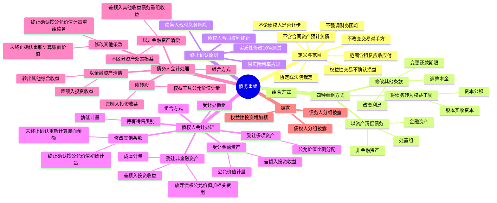

## 1. 章节定位

| 项目 | 信息 |
|------|------|
| 所属科目 | 会计 |
| 难度等级 | 3 |
| 历年分值 | 4-6 分 |
| 建议学时 | 4-6 小时 |
| 知识关联章节 | 第22号 金融工具确认和计量、第23号 金融资产转移、第37号 金融工具列报、第12号 债务重组、第20章 企业合并、第24章 差错更正、第25章 资产负债表日后事项 |

## 2. 考情分析

本章是会计科目的重要章节，历年分值约 4-6 分，常以计算分析题或综合题形式出现，常与金融工具、所得税、差错更正、资产负债表日后事项等章节联动考查。

**命题规律**：本章内容政策性强、与金融工具准则联系紧密，主观题常以债务人陷入财务困难的业务情境为载体，要求考生完成债权人和债务人双方的会计处理。客观题则集中在概念辨析、终止确认条件、实质性修改判断及权益性交易的认定。

**高频考点分布**：

1. **债务重组的定义与范围**：不改变交易对手方、不强调财务困难、不论债权人是否让步；债权和债务的范围（不含合同资产、合同负债、预计负债，含租赁应收款和应付款）；权益性交易的判断。
2. **四种重组方式**：以资产清偿债务、将债务转为权益工具、修改其他条款、组合方式。
3. **终止确认原则**：债权人收取债权现金流量的合同权利终止时终止确认债权；债务人现时义务解除时终止确认债务；"实质性修改"的 10% 测试。
4. **债权人的会计处理**：受让金融资产（公允价值计量，差额入投资收益）、受让非金融资产（成本计量，差额入投资收益）、受让多项资产（按公允价值比例分配）、受让处置组、持有待售类别的处理。
5. **债务人的会计处理**：以金融资产清偿（差额入投资收益）、以非金融资产清偿（差额入其他收益—债务重组收益）、债转股（差额入投资收益）、修改其他条款、组合方式。
6. **损益科目的区分**：仅涉及金融资产、长期股权投资时记入"投资收益"；涉及非金融资产时记入"其他收益—债务重组收益"。

**联动考查方式**：
- 与金融工具结合：受让金融资产的分类与计量、其他综合收益的转出；
- 与所得税结合：债务重组损益的计税基础差异；
- 与差错更正结合：错记损益科目、漏转其他综合收益；
- 与资产负债表日后事项结合：报告期资产负债表日后完成的债务重组不属于调整事项。

**备考建议**：
- 牢记债务重组的核心特征是"不改变交易对手方 + 重新达成协议"，不要求财务困难和债权人让步；
- 区分债权人和债务人的损益科目：非金融资产清偿债务时债务人记"其他收益—债务重组收益"，债权人记"投资收益"；
- 掌握实质性修改的 10% 测试：重组债务未来现金流量现值与原债务剩余现金流量现值差异超过 10% 的，终止确认原债务；
- 注意权益性交易不确认损益的特殊情形。

## 3. 知识框架



## 4. 核心精讲

### 4.1 债务重组的定义和方式

#### 4.1.1 债务重组的定义

**债务重组**，是指在不改变交易对手方的情况下，经债权人和债务人协定或法院裁定，就清偿债务的时间、金额或方式等重新达成协议的交易。债务重组涉及债权人和债务人，对债权人而言为"债权重组"，对债务人而言为"债务重组"，统称为"债务重组"。

债务重组的定义需要从以下三个方面理解：

**（1）关于交易对手方**

债务重组是在不改变交易对手方的情况下进行的交易。实务中经常出现第三方参与相关交易的情形，例如：
- 某公司以不同于原合同条款的方式代债务人向债权人偿债；
- 新组建的公司承接原债务人的债务，与债权人进行债务重组；
- 资产管理公司从债权人处购得债权，再与债务人进行债务重组。

在上述第三方参与相关交易的情形下，企业应当首先考虑债权和债务是否发生终止确认，适用《企业会计准则第 22 号——金融工具确认和计量》和《企业会计准则第 23 号——金融资产转移》等准则，再就债务重组交易适用《企业会计准则第 12 号——债务重组》。

**关键特征**：债务重组不强调在债务人发生财务困难的背景下进行，也不论债权人是否作出让步。也就是说，无论何种原因导致债务人未按原定条件偿还债务，也无论双方是否同意债务人以低于债务的金额偿还债务，只要债权人和债务人就债务条款重新达成了协议，就符合债务重组的定义。例如，债权人在减免债务人部分债务本金的同时提高剩余债务的利息，或者债权人同意债务人用等值库存商品抵偿到期债务等，均属于债务重组。

**（2）关于债权和债务的范围**

债务重组涉及的债权和债务，是指《企业会计准则第 22 号——金融工具确认和计量》规范的债权和债务，**不包括合同资产、合同负债、预计负债，但包括租赁应收款和租赁应付款**。债务重组中涉及的债权、重组债权、债务、重组债务和其他金融工具的确认、计量和列报，适用《企业会计准则第 22 号——金融工具确认和计量》和《企业会计准则第 37 号——金融工具列报》等金融工具相关准则。

**（3）关于债务重组的范围**

- 经法院裁定进行债务重整并按持续经营进行会计核算的，适用本章。债务人在破产清算期间进行的债务重组不属于本章规定的范围，应当按照企业破产清算有关会计处理规定处理。
- 通过债务重组形成企业合并的，适用《企业会计准则第 20 号——企业合并》。债务人以股权投资清偿债务或者将债务转为权益工具，可能导致债权人取得被投资单位或债务人控制权，在债权人的个别财务报表层面和合并财务报表层面，债权人取得长期股权投资或者资产和负债的确认与计量适用《企业会计准则第 20 号——企业合并》的有关规定。

**（4）权益性交易的特别处理**

债务重组构成权益性交易的，应当适用权益性交易的有关会计处理规定，债权人和债务人不确认构成权益性交易的债务重组相关损益。债务重组构成权益性交易的情形包括：
1. 债权人直接或间接对债务人持股，或者债务人直接或间接对债权人持股，且持股方以股东身份进行债务重组；
2. 债权人与债务人在债务重组前后均受同一方或相同的多方最终控制，且该债务重组的交易实质是债权人或债务人进行了权益性分配或接受了权益性投入。

**举例**：甲公司是乙公司股东，为了弥补乙公司临时性经营现金流短缺，甲公司向乙公司提供 1 000 万元无息借款，并约定于 6 个月后收回。借款期满时，尽管乙公司具有充足的现金流，甲公司仍然决定免除乙公司 800 万元本金还款义务，仅收回 200 万元借款。在此项交易中，如果甲公司不以股东身份而是以市场交易者身份参与交易，在乙公司具有足够偿债能力的情况下不可能会免除其部分本金。因此，甲公司和乙公司应当将该交易作为权益性交易，不确认债务重组相关损益。

**部分权益性交易的处理**：债务重组中不属于权益性交易的部分仍然应当确认债务重组相关损益。例如，假设前例中债务人乙公司确实出现财务困难，其他债权人（不含甲公司）对其债务普遍进行了减半的豁免，那么甲公司作为股东比其他债权人多豁免 300 万元债务的交易应当作为权益性交易，与其他债权人同等减半豁免 500 万元债务的交易应当确认债务重组相关损益。

**实质重于形式原则**：企业在判断债务重组是否构成权益性交易时，应当遵循实质重于形式原则。例如，假设债权人对债务人的权益性投资通过其他人代持，债权人虽不具有股东身份，但实质上拥有股东权利，是以股东身份进行债务重组，债权人和债务人应当认为该债务重组构成权益性交易。

#### 4.1.2 债务重组的方式

债务重组的方式主要包括：债务人以资产清偿债务、将债务转为权益工具、修改其他条款，以及前述一种以上方式的组合。这些债务重组方式都是通过债权人和债务人重新协定或者法院裁定达成的，与原来约定的偿债方式不同。

**（1）债务人以资产清偿债务**

债务人用于偿债的资产通常是已经在资产负债表中确认的资产，例如：现金、应收账款、长期股权投资、投资性房地产、固定资产、在建工程、生物资产、无形资产等。债务人以日常活动产出的商品或服务清偿债务的，用于偿债的资产可能体现为存货等资产。

除上述已经在资产负债表中确认的资产外，债务人也可能以不符合确认条件而未予确认的资产清偿债务。例如，债务人以未确认的内部产生品牌清偿债务，债权人在获得的商标权符合无形资产确认条件的前提下作为无形资产核算。在少数情况下，债务人还可能以处置组（即一组资产以及与这些资产直接相关的负债）清偿债务。

**核算类别的差异**：在受让上述资产后，按照相关会计准则要求及本企业会计核算要求，债权人核算相关受让资产的类别可能与债务人不同。例如，债务人以作为固定资产核算的房产清偿债务，债权人可能将受让的房产作为投资性房地产核算；债务人以部分长期股权投资清偿债务，债权人可能将受让的投资作为金融资产核算；债务人以存货清偿债务，债权人可能将受让的资产作为固定资产核算等。

**（2）债务人将债务转为权益工具**

这里的权益工具，是指根据《企业会计准则第 37 号——金融工具列报》分类为"权益工具"的金融工具，体现为股本、实收资本、资本公积等。

**注意**：实务中，有些债务重组名义上采用"债转股"的方式，但同时附加相关条款，如约定债务人在未来某个时点有义务以某一金额回购股权，或债权人持有的股份享有强制分红权等。对于债务人，这些"股权"可能并不是根据《企业会计准则第 37 号——金融工具列报》分类为权益工具的金融工具，从而不属于债务人将债务转为权益工具的债务重组方式。债权人和债务人还可能协议以一项同时包含金融负债成分和权益工具成分的复合金融工具替换原债权债务，这类交易也不属于债务人将债务转为权益工具的债务重组方式。

**（3）修改其他条款**

修改债权和债务的其他条款，是债务人不以资产清偿债务，也不将债务转为权益工具，而是改变债权或债务的其他条款的债务重组方式，如调整债务本金、改变债务利息、变更还款期限等。经修改其他条款的债权和债务分别形成**重组债权**和**重组债务**。

**（4）组合方式**

组合方式，是采用债务人以资产清偿债务、债务人将债务转为权益工具、修改其他条款三种方式中一种以上方式的组合清偿债务的债务重组方式。例如，债权人和债务人约定，由债务人以机器设备清偿部分债务，将另一部分债务转为权益工具，调减剩余债务的本金，但利率和还款期限不变；再如，债务人以现金清偿部分债务，同时将剩余债务展期等。

### 4.2 债权和债务的终止确认

债务重组中涉及的债权和债务的终止确认，应当遵循《企业会计准则第 22 号——金融工具确认和计量》和《企业会计准则第 23 号——金融资产转移》有关金融资产和金融负债终止确认的规定。

**终止确认的一般原则**：
- 债权人在收取债权现金流量的合同权利终止时终止确认债权；
- 债务人在债务的现时义务解除时终止确认债务。

由于债权人与债务人之间进行的债务重组涉及债权和债务的认定，以及清偿方式和期限等的协商，通常需要经历较长时间，例如破产重整中进行的债务重组。因此，债务人只有在符合上述终止确认条件时才能终止确认相关债务，并确认债务重组相关损益。在签署债务重组合同的时点，如果债务的现时义务尚未解除，债务人不能确认债务重组相关损益。

**资产负债表日后完成的债务重组**：对于在报告期间已经开始协商，但在报告期资产负债表日后完成的债务重组，**不属于资产负债表日后调整事项**。

**减值准备和累计其他综合收益的处理**：
- 对于终止确认的债权，债权人应当结转已计提的减值准备中对应债权终止确认部分的金额；
- 对于终止确认的分类为以公允价值计量且其变动计入其他综合收益的债权，之前计入其他综合收益的累计利得或损失应当从其他综合收益中转出，记入"投资收益"科目。

#### 4.2.1 以资产清偿债务或将债务转为权益工具

对于以资产清偿债务或者将债务转为权益工具方式进行的债务重组：
- **债权人**：在拥有或控制相关资产时，通常其收取债权现金流量的合同权利也同时终止，债权人一般可以终止确认该债权。
- **债务人**：通过交付资产或权益工具解除了其清偿债务的现时义务，债务人一般可以终止确认该债务。

#### 4.2.2 修改其他条款

**债权人的处理**：合同修改前后的交易对手方没有发生改变，合同涉及的本金、利息等现金流量很难在本息之间及债务重组前后作出明确分割，即很难单独识别合同的特定可辨认现金流量。因此，通常情况下，应当整体考虑是否对全部债权的合同条款作出了实质性修改。如果作出实质性修改，或者债权人与债务人之间签订协议，以获取实质上不同的新金融资产方式替换债权，应当终止确认原债权，并按照修改后的条款或新协议确认新金融资产。

**债务人的处理**：如果对债务或部分债务的合同条款作出"实质性修改"形成重组债务，或者债权人与债务人之间签订协议，以承担"实质上不同"的重组债务方式替换原债务，债务人应当终止确认原债务，同时按照修改后的条款确认一项新金融负债。

**实质性修改的 10% 测试**：如果重组债务未来现金流量（包括支付和收取的某些费用）现值与原债务的剩余期间现金流量现值之间的差异超过 10%，则意味着新的合同条款进行了"实质性修改"或者重组债务是"实质上不同"的。有关现值的计算均采用**原债务的实际利率**。

#### 4.2.3 组合方式

**债权人**：与"修改其他条款"部分的分析类似，通常情况下应当整体考虑是否终止确认全部债权。由于组合方式涉及多种债务重组方式，一般可以认为对全部债权的合同条款作出了实质性修改，从而终止确认全部债权，并按照修改后的条款确认新金融资产。

**债务人**：组合中以资产清偿债务或者将债务转为权益工具方式进行的债务重组，如果债务人清偿该部分债务的现时义务已经解除，应当终止确认该部分债务。组合中以修改其他条款方式进行的债务重组，需要根据具体情况，判断对应的部分债务是否满足终止确认条件。

### 4.3 债权人的会计处理

#### 4.3.1 以资产清偿债务或将债务转为权益工具

债务重组采用以资产清偿债务或者将债务转为权益工具方式进行的，债权人应当将受让的相关资产在符合其定义和确认条件时予以确认。

**（1）债权人受让金融资产**

债权人受让包括现金在内的单项或多项金融资产的，应当按照《企业会计准则第 22 号——金融工具确认和计量》的规定进行确认和计量。金融资产初始确认时应当以其**公允价值**计量，金融资产确认金额与债权终止确认日账面价值之间的差额，记入"投资收益"科目。

**公允价值与交易价格存在差异的处理**：取得的金融资产的公允价值与交易价格（即放弃债权的公允价值）存在差异的，企业应当区别下列情况进行处理：

| 情形 | 处理方式 |
|------|---------|
| 公允价值依据活跃市场报价或仅使用可观察市场数据的估值技术确定 | 将公允价值与交易价格之间的差额确认为一项利得或损失 |
| 公允价值以其他方式确定 | 将公允价值与交易价格之间的差额递延，初始确认后根据某一因素在相应会计期间的变动程度确认为相应会计期间的利得或损失（该因素仅限于市场参与者对该金融工具定价时将予考虑的因素，包括时间等） |

**（2）债权人受让非金融资产**

债权人初始确认受让的金融资产以外的资产时，应当按照下列原则以**成本**计量：

| 资产类别 | 成本构成 |
|---------|---------|
| 存货 | 放弃债权的公允价值 + 使资产达到当前位置和状态所发生的可直接归属于该资产的税金、运输费、装卸费、保险费等 |
| 对联营企业或合营企业投资 | 放弃债权的公允价值 + 可直接归属于该资产的税金等 |
| 投资性房地产 | 放弃债权的公允价值 + 可直接归属于该资产的税金等 |
| 固定资产 | 放弃债权的公允价值 + 使资产达到预定可使用状态前所发生的可直接归属于该资产的税金、运输费、装卸费、安装费、专业人员服务费等（应考虑预计弃置费用因素） |
| 生物资产 | 放弃债权的公允价值 + 可直接归属于该资产的税金、运输费、保险费等 |
| 无形资产 | 放弃债权的公允价值 + 可直接归属于使资产达到预定用途所发生的税金等 |

**核心要点**：放弃债权的公允价值与账面价值之间的差额，记入"投资收益"科目。如果债权人与债务人间的债务重组是在公平交易的市场环境中达成的交易，放弃债权的公允价值通常与受让资产的公允价值相等，且通常不高于放弃债权的账面余额。

**（3）债权人受让多项资产**

债权人受让多项非金融资产，或者包括金融资产、非金融资产在内的多项资产的，应当按照下列步骤处理：
1. 按照《企业会计准则第 22 号——金融工具确认和计量》的规定确认和计量受让的金融资产；
2. 按照受让的金融资产以外的各项资产在债务重组合同生效日的**公允价值比例**，对放弃债权在合同生效日的公允价值扣除受让金融资产当日公允价值后的净额进行分配；
3. 以分配额为基础分别确定各项资产的成本。

放弃债权的公允价值与账面价值之间的差额，记入"投资收益"科目。

**（4）债权人受让处置组**

债务人以处置组清偿债务的，债权人应当分别按照《企业会计准则第 22 号——金融工具确认和计量》和其他相关准则的规定，对处置组中的金融资产和负债进行初始计量，然后按照金融资产以外的各项资产在债务重组合同生效日的公允价值比例，对放弃债权在合同生效日的公允价值以及承担的处置组中负债的确认金额之和，扣除受让金融资产当日公允价值后的净额进行分配，并以此为基础分别确定各项资产的成本。放弃债权的公允价值与账面价值之间的差额，记入"投资收益"科目。

**（5）债权人将受让的资产或处置组划分为持有待售类别**

债务人以资产或处置组清偿债务，且债权人在取得日未将受让的相关资产或处置组作为非流动资产和非流动负债核算，而是将其划分为持有待售类别的，债权人应当在初始计量时，比较下列两项金额，**以两者孰低计量**：
- 假定其不划分为持有待售类别情况下的初始计量金额；
- 公允价值减去出售费用后的净额。

公允价值减去出售费用后的净额低于不划分为持有待售类别情况下的初始计量金额的差额，记入"资产减值损失"科目。

#### 4.3.2 修改其他条款

**（1）修改其他条款导致全部债权终止确认**

债权人应当按照修改后的条款以**公允价值**初始计量新的金融资产，新金融资产的确认金额与债权终止确认日账面价值之间的差额，记入"投资收益"科目。

**（2）修改其他条款未导致债权终止确认**

债权人应当根据其分类，继续以摊余成本、以公允价值计量且其变动计入其他综合收益，或者以公允价值计量且其变动计入当期损益进行后续计量。

对于以摊余成本计量的债权，债权人应当根据重新议定合同的现金流量变化情况，重新计算该重组债权的账面余额，并将相关利得或损失记入"投资收益"科目。重新计算的该重组债权的账面余额，应当根据将重新议定或修改的合同现金流量按**债权原实际利率**折现的现值确定；购买或源生的已发生信用减值的重组债权，应按经信用调整的实际利率折现。

对于修改或重新议定合同所产生的成本或费用，债权人应当调整修改后的重组债权的账面价值，并在修改后重组债权的剩余期限内摊销。

#### 4.3.3 组合方式

债务重组采用组合方式进行的，一般可以认为对全部债权的合同条款作出了实质性修改。债权人应当按照修改后的条款：
1. 以公允价值初始计量新的金融资产和受让的新金融资产；
2. 按照受让的金融资产以外的各项资产在债务重组合同生效日的公允价值比例，对放弃债权在合同生效日的公允价值扣除受让金融资产和重组债权当日公允价值后的净额进行分配；
3. 以分配额为基础分别确定各项资产的成本。

放弃债权的公允价值与账面价值之间的差额，记入"投资收益"科目。

### 4.4 债务人的会计处理

#### 4.4.1 债务人以资产清偿债务

债务重组采用以资产清偿债务方式进行的，债务人应当将所清偿债务账面价值与转让资产账面价值之间的差额计入当期损益。

**（1）债务人以金融资产清偿债务**

债务人以单项或多项金融资产清偿债务的，债务的账面价值与偿债金融资产账面价值的差额，记入"投资收益"科目。偿债金融资产已计提减值准备的，应结转已计提的减值准备。

**其他综合收益的转出**：
- 对于分类为以公允价值计量且其变动计入其他综合收益的**债务工具投资**清偿债务的，之前计入其他综合收益的累计利得或损失应当从其他综合收益中转出，记入"投资收益"科目；
- 对于以指定为以公允价值计量且其变动计入其他综合收益的**非交易性权益工具投资**清偿债务的，之前计入其他综合收益的累计利得或损失应当从其他综合收益中转出，记入"盈余公积"等留存收益科目。

**（2）债务人以非金融资产清偿债务**

债务人以单项或多项长期股权投资清偿债务的，债务的账面价值与偿债长期股权投资账面价值的差额，记入"投资收益"科目。

债务人以单项或多项其他非金融资产（如固定资产、投资性房地产、生物资产、无形资产、日常活动产出的商品或服务等）清偿债务，或者以包括金融资产和其他非金融资产在内的多项资产清偿债务的：
- **不需要区分**资产处置损益和债务重组损益；
- **不需要区分**不同资产的处置损益；
- 将所清偿债务账面价值与转让资产账面价值之间的差额，记入"**其他收益——债务重组收益**"科目。

偿债资产已计提减值准备的，应结转已计提的减值准备。

**处置组的特殊处理**：债务人以包含非金融资产的处置组（处置组中的资产均为长期股权投资的除外）清偿债务的，应当将所清偿债务和处置组中负债的账面价值之和，与处置组中资产的账面价值之间的差额，记入"其他收益——债务重组收益"科目。处置组所属的资产组或资产组组合按照《企业会计准则第 8 号——资产减值》分摊了企业合并中取得的商誉的，该处置组应当包含分摊至处置组的商誉。处置组中的资产已计提减值准备的，应结转已计提的减值准备。

**以存货清偿债务的特殊说明**：通常情况下，债务重组不属于企业的日常活动，因此债务重组中如债务人以日常活动产出的商品或服务清偿债务的，**不应按收入准则确认为商品或服务的销售处理**。债务人以日常活动产出的商品或服务清偿债务的（以企业的存货或提供服务清偿债务），应当将所清偿债务账面价值与存货等相关资产账面价值之间的差额，记入"其他收益——债务重组收益"科目。

**损益科目区分总结**：

| 偿债资产类型 | 损益科目 |
|------------|---------|
| 金融资产 | 投资收益 |
| 长期股权投资 | 投资收益 |
| 其他非金融资产（固定资产、投资性房地产、无形资产、存货等） | 其他收益——债务重组收益 |
| 包含非金融资产的处置组（资产均为长期股权投资的除外） | 其他收益——债务重组收益 |

#### 4.4.2 债务人将债务转为权益工具

债务重组采用将债务转为权益工具方式进行的：
- 债务人初始确认权益工具时，应按照权益工具的**公允价值**计量；
- 权益工具的公允价值不能可靠计量的，应当按照所清偿债务的**公允价值**计量；
- 所清偿债务账面价值与权益工具确认金额之间的差额，记入"投资收益"科目。

**发行费用的处理**：债务人因发行权益工具而支出的相关税费等，应当依次冲减**资本公积**（资本溢价或股本溢价）、**盈余公积**、**未分配利润**等。

#### 4.4.3 修改其他条款

**（1）修改其他条款导致债务终止确认**

债务人应当按照公允价值计量重组债务，终止确认的债务账面价值与重组债务确认金额之间的差额，记入"投资收益"科目。

**（2）修改其他条款未导致债务终止确认**

如果修改其他条款未导致债务终止确认，或者仅导致部分债务终止确认，对于未终止确认的部分债务，债务人应当继续按原分类进行后续计量。

对于以摊余成本计量的债务，债务人应当根据重新议定合同的现金流量变化情况，重新计算该重组债务的账面价值，并将相关利得或损失记入"投资收益"科目。重新计算的该重组债务的账面价值，应当根据将重新议定或修改的合同现金流量按**债务的原实际利率**或按《企业会计准则第 24 号——套期会计》规定重新计算的实际利率（如适用）折现的现值确定。

对于修改或重新议定合同所产生的成本或费用，债务人应当调整修改后的重组债务的账面价值，并在修改后重组债务的剩余期限内摊销。

#### 4.4.4 组合方式

债务重组采用以资产清偿债务、将债务转为权益工具、修改其他条款等组合方式进行的：
- 对于**权益工具**，债务人应当在初始确认时按照权益工具的公允价值计量；权益工具的公允价值不能可靠计量的，应当按照所清偿债务的公允价值计量。
- 对于**修改其他条款形成的重组债务**，债务人应当参照修改其他条款部分的内容，确认和计量重组债务。
- 所清偿债务的账面价值与转让资产的账面价值以及权益工具和重组债务的确认金额之和的差额，记入"其他收益——债务重组收益"或"投资收益"（仅涉及金融工具、长期股权投资时）科目。

**破产重整的特殊考虑**：对于企业因破产重整而进行的债务重组交易，由于涉及破产重整的债务重组协议执行过程及结果存在重大不确定性，因此，企业通常应在破产重整协议履行完毕后确认债务重组收益，除非有确凿证据表明上述重大不确定性已经消除。

### 4.5 债务重组的相关披露

债务重组中涉及的债权、重组债权、债务、重组债务和其他金融工具的披露，应当按照《企业会计准则第 37 号——金融工具列报》的规定处理。此外，债权人和债务人还应当在附注中披露与债务重组有关的额外信息。

**债权人的披露**：
1. 根据债务重组方式，分组披露债权账面价值和债务重组相关损益。分组时债权人可以按照以资产清偿债务方式、将债务转为权益工具方式、修改其他条款方式、组合方式为标准分组，也可以根据重要性原则以更细化的标准分组。
2. 债务重组导致的对联营企业或合营企业的权益性投资增加额，以及该投资占联营企业或合营企业股份总额的比例。

**债务人的披露**：
1. 根据债务重组方式，分组披露债务账面价值和债务重组相关损益。分组的标准与对债权人的要求类似。
2. 债务重组导致的股本等所有者权益的增加额。

**其他相关信息**：报表使用者可能关心与债务重组相关的其他信息，例如：
- 债权人和债务人是否具有关联方关系；
- 如何确定债务转为权益工具方式中的权益工具，以及修改其他条款方式中的新重组债权或重组债务等的公允价值；
- 是否存在与债务重组相关的或有事项等。

企业应当根据《企业会计准则第 13 号——或有事项》《企业会计准则第 22 号——金融工具确认和计量》《企业会计准则第 36 号——关联方披露》《企业会计准则第 37 号——金融工具列报》《企业会计准则第 39 号——公允价值计量》等准则规定，披露相关信息。

## 5. 典型例题

**【例题 1】（债权人受让非金融资产及持有待售类别的处理）**

2×22 年 6 月 18 日，甲公司向乙公司销售商品一批，应收乙公司款项的入账金额为 95 万元。甲公司将该应收款项分类为以摊余成本计量的金融资产。乙公司将该应付账款分类为以摊余成本计量的金融负债。

2×22 年 10 月 18 日，双方签订债务重组合同，乙公司以一项作为无形资产核算的非专利技术偿还该欠款。该无形资产的账面余额为 100 万元，累计摊销额为 10 万元，已计提减值准备 2 万元。

2×22 年 10 月 22 日，双方办理完成该无形资产转让手续，甲公司支付评估费用 4 万元。当日，甲公司应收款项的公允价值为 87 万元，已计提坏账准备 7 万元，乙公司应付款项的账面价值仍为 95 万元。假设不考虑相关税费。

要求：分别编制债权人和债务人的会计分录。

**答案**：

（1）债权人的会计处理。

2×22 年 10 月 22 日，债权人甲公司取得该无形资产的成本为债权公允价值 87 万元与评估费用 4 万元的合计 91 万元。

```
借：无形资产                     910 000
    坏账准备                       70 000
    投资收益                       10 000
    贷：应收账款                  950 000
        银行存款                   40 000
```

（2）债务人的会计处理。

乙公司 2×22 年 10 月 22 日的账务处理如下：

```
借：应付账款                     950 000
    累计摊销                       100 000
    无形资产减值准备                20 000
    贷：无形资产                 1 000 000
        其他收益——债务重组收益      70 000
```

**延伸情形**：假设甲公司管理层决议，受让该非专利技术后将在半年内将其出售，当日无形资产的公允价值为 87 万元，预计未来出售该非专利技术时将发生 1 万元的出售费用，该非专利技术满足持有待售资产确认条件。

2×22 年 10 月 22 日，甲公司对该非专利技术进行初始确认时，按照无形资产入账价值 91 万元与公允价值减出售费用 87 − 1 = 86（万元）孰低计量。债权人甲公司的账务处理如下：

```
借：持有待售资产——无形资产      860 000
    坏账准备                       70 000
    投资收益                       10 000
    资产减值损失                   50 000
    贷：应收账款                  950 000
        银行存款                   40 000
```

**解析**：债权人受让非金融资产以成本（放弃债权公允价值 + 直接归属费用）计量，放弃债权公允价值与账面价值的差额记入"投资收益"。划分为持有待售类别的，按"假定不划分为持有待售的初始计量金额"与"公允价值减出售费用后的净额"孰低计量，差额记入"资产减值损失"。债务人以非金融资产清偿债务，差额记入"其他收益——债务重组收益"。

**【例题 2】（债务转为权益工具）**

2×22 年 2 月 10 日，甲公司从乙公司购买一批材料，约定 6 个月后甲公司应结清款项 100 万元（假定无重大融资成分）。乙公司将该应收款项分类为以公允价值计量且其变动计入当期损益的金融资产；甲公司将该应付款项分类为以摊余成本计量的金融负债。

2×22 年 8 月 12 日，甲公司因无法支付货款与乙公司协商进行债务重组，双方商定乙公司将该债权转为对甲公司的股权投资。

2×22 年 10 月 20 日，甲公司应付款项的账面价值仍为 100 万元；乙公司办结了对甲公司的增资手续，甲公司和乙公司分别支付手续费等相关费用 1.5 万元和 1.2 万元。债转股后甲公司总股本为 100 万元，乙公司持有的抵债股权占甲公司总股本的 25%，对甲公司具有重大影响，甲公司股权公允价值不能可靠计量。

2×22 年 6 月 30 日，应收款项和应付款项的公允价值均为 85 万元。

2×22 年 8 月 12 日，应收款项和应付款项的公允价值均为 76 万元。

2×22 年 10 月 20 日，应收款项和应付款项的公允价值仍为 76 万元。

假定不考虑其他相关税费。

要求：分别编制债权人和债务人的会计分录。

**答案**：

（1）债权人的会计处理。

乙公司的账务处理如下：

① 2×22 年 6 月 30 日：

```
借：公允价值变动损益             150 000
    贷：交易性金融资产——公允价值变动  150 000
```

② 2×22 年 8 月 12 日：

```
借：公允价值变动损益              90 000
    贷：交易性金融资产——公允价值变动   90 000
```

③ 2×22 年 10 月 20 日，乙公司对甲公司长期股权投资的成本为应收款项公允价值 76 万元与相关税费 1.2 万元的合计 77.2 万元。

```
借：长期股权投资——甲公司        772 000
    交易性金融资产——公允价值变动  240 000
    贷：交易性金融资产——成本    1 000 000
        银行存款                   12 000
```

（2）债务人的会计处理。

2×22 年 10 月 20 日，由于甲公司股权的公允价值不能可靠计量，初始确认权益工具公允价值时应当按照所清偿债务的公允价值 76 万元计量，并扣除因发行权益工具支出的相关税费 1.5 万元。甲公司的账务处理如下：

```
借：应付账款                  1 000 000
    贷：实收资本                250 000
        资本公积——资本溢价      495 000
        银行存款                 15 000
        投资收益                240 000
```

**解析**：债转股方式下，债权人受让的对联营企业或合营企业投资以成本（放弃债权公允价值 + 相关税费）计量；债务人初始确认权益工具按公允价值计量，公允价值不能可靠计量时按所清偿债务的公允价值计量，差额记入"投资收益"。债务人发行权益工具的相关税费依次冲减资本公积、盈余公积、未分配利润。

**【例题 3】（受让多项资产）**

2×21 年 11 月 5 日，甲公司向乙公司赊购一批材料，含税价为 234 万元。甲公司将该应付款项分类为以摊余成本计量的金融负债，乙公司将该应收款项分类为以摊余成本计量的金融资产。

2×22 年 9 月 10 日，甲公司因发生财务困难，无法按合同约定偿还债务，双方协商进行债务重组，乙公司同意甲公司用其生产的商品、作为固定资产管理的机器设备和一项债券投资抵偿欠款。当日，该债权的公允价值为 210 万元，甲公司用于抵债的商品市价（不含增值税）为 90 万元，用于抵债设备的公允价值为 75 万元，用于抵债的债券投资市价为 23.55 万元。

2×22 年 9 月 20 日，抵债资产转让完毕，甲公司发生设备运输费用 0.65 万元，乙公司发生设备安装费用 1.5 万元。

2×22 年 9 月 20 日，乙公司对该应收款项已计提坏账准备 19 万元。乙公司将受让的商品、设备和债券投资分别作为低值易耗品、固定资产和以公允价值计量且其变动计入当期损益的金融资产核算。当日，乙公司受让债券投资的市价为 21 万元。

2×22 年 9 月 20 日，甲公司该应付款项的账面价值仍为 234 万元；当日，甲公司用于抵债的商品成本为 70 万元；抵债设备的账面原值为 150 万元，累计折旧为 40 万元，已计提减值准备 18 万元；甲公司以摊余成本计量用于抵债的债券投资，债券票面价值总额为 15 万元，票面利率与实际利率一致，按年付息，假定甲公司尚未对债券确认利息收入。

甲、乙公司均为增值税一般纳税人，适用增值税税率为 13%，经税务机关核定，该项交易中商品和设备的计税价格分别为 90 万元和 75 万元。不考虑其他相关税费。

要求：分别编制债权人和债务人的会计分录。

**答案**：

（1）债权人的会计处理。

低值易耗品可抵扣增值税 = 90 × 13% = 11.7（万元）

设备可抵扣增值税 = 75 × 13% = 9.75（万元）

低值易耗品和固定资产的成本应当以其公允价值比例（90:75）对放弃债权公允价值扣除受让金融资产公允价值后的净额进行分配后的金额为基础确定。

低值易耗品的成本 = 90 ÷ (90 + 75) × (210 − 23.55 − 11.7 − 9.75) = 90（万元）

固定资产的成本 = 75 ÷ (90 + 75) × (210 − 23.55 − 11.7 − 9.75) = 75（万元）

2×22 年 9 月 20 日，乙公司的账务处理如下：

① 结转债务重组相关损益：

```
借：周转材料——低值易耗品      900 000
    在建工程——在安装设备      750 000
    应交税费——应交增值税（进项税额） 214 500
    交易性金融资产            210 000
    坏账准备                  190 000
    投资收益                   75 500
    贷：应收账款——甲公司    2 340 000
```

② 支付安装成本：

```
借：在建工程——在安装设备     15 000
    贷：银行存款               15 000
```

③ 安装完毕达到可使用状态：

```
借：固定资产——××设备       765 000
    贷：在建工程——在安装设备  765 000
```

（2）债务人的会计处理。

甲公司 2×22 年 9 月 20 日的账务处理如下：

```
借：固定资产清理              920 000
    累计折旧                  400 000
    固定资产减值准备          180 000
    贷：固定资产            1 500 000

借：固定资产清理               6 500
    贷：银行存款               6 500

借：应付账款              2 340 000
    贷：固定资产清理          926 500
        库存商品              700 000
        应交税费——应交增值税（销项税额） 214 500
        债权投资——成本       150 000
        其他收益——债务重组收益  349 000
```

**解析**：债权人受让多项资产时，先按公允价值确认金融资产，再将放弃债权公允价值扣除金融资产公允价值后的净额按非金融资产公允价值比例分配。债务人以包含非金融资产的多项资产清偿债务时，不区分资产处置损益和债务重组损益，差额统一记入"其他收益——债务重组收益"。

**【例题 4】（组合方式——以资产、债转股、修改条款组合）**

2×19 年 1 月 1 日，甲公司取得乙银行贷款 5 000 万元，约定贷款期限为 4 年（即 2×22 年 12 月 31 日到期），年利率 6%，按年付息，甲公司以摊余成本计量该贷款。4 年期间，甲公司按时支付所有利息。

2×22 年 12 月 31 日，甲公司出现严重资金周转问题，多项债务违约，信用风险增加，无法偿还贷款本金。

2×23 年 1 月 10 日，甲公司该贷款的账面价值为 5 000 万元；当日，乙银行同意与甲公司就该项贷款重新达成协议，新协议约定：
1. 甲公司将一项作为固定资产核算的房产转让给乙银行，用于抵偿债务本金 1 000 万元，该房产账面原值 1 200 万元，累计折旧 400 万元，未计提减值准备；
2. 甲公司向乙银行增发股票 500 万股，面值为 1 元/股，占甲公司股份总额的 1%，用于抵偿债务本金 2 000 万元，甲公司股票于 2×23 年 1 月 10 日的收盘价为 4 元/股；
3. 在甲公司履行上述偿债义务后，乙银行免除甲公司 500 万元债务本金，并将尚未偿还的债务本金 1 500 万元展期至 2×23 年 12 月 31 日，年利率 8%；如果甲公司未能履行（1）、（2）所述偿债义务，乙银行有权终止债务重组协议，尚未履行的债权调整承诺随之失效。

乙银行以摊余成本计量该贷款，已计提贷款损失准备 300 万元。该贷款于 2×23 年 1 月 10 日的公允价值为 4 600 万元，予以展期的 1 500 万元贷款的公允价值为 1 500 万元。

2×23 年 3 月 2 日，双方办理完成房产转让手续，乙银行将该房产作为投资性房地产核算。

2×23 年 3 月 31 日，乙银行为全部贷款补提了 100 万元的损失准备。

2×23 年 5 月 9 日，双方办理完成股权转让手续，乙银行将该股权投资分类为以公允价值计量且其变动计入当期损益的金融资产，甲公司股票当日收盘价为 4.02 元/股。不考虑相关税费。

要求：分别编制债权人和债务人的会计分录。

**答案**：

甲公司与乙银行以组合方式进行债务重组，同时涉及以资产清偿债务、将债务转为权益工具、包括债务豁免的修改其他条款等方式，可以认为对全部债权的合同条款作出了实质性修改，债权人在放弃债权现金流量的合同权利终止时应当终止确认全部债权，即在 2×23 年 5 月 9 日该债务重组协议的执行过程和结果不确定性消除时，可以确认债务重组相关损益，并按照修改后的条款确认新金融资产。

（1）债权人的会计处理。

债权人乙银行的账务处理如下：

① 2×23 年 3 月 2 日：

投资性房地产成本 = 放弃债权公允价值 − 受让股权公允价值 − 重组债权公允价值 = 4 600 − 2 000 − 1 500 = 1 100（万元）

```
借：投资性房地产           11 000 000
    贷：贷款——本金        11 000 000
```

② 2×23 年 3 月 31 日：

```
借：信用减值损失           1 000 000
    贷：贷款损失准备       1 000 000
```

③ 2×23 年 5 月 9 日：

受让股权的公允价值 = 4.02 × 500 = 2 010（万元）

```
借：交易性金融资产       20 100 000
    贷款——本金          15 000 000
    贷款损失准备          4 000 000
    贷：贷款——本金      39 000 000
        投资收益           100 000
```

（2）债务人的会计处理。

该债务重组协议的执行过程和结果不确定性于 2×23 年 5 月 9 日消除时，债务人清偿该部分债务的现时义务已经解除，可以确认债务重组相关损益，并按照修改后的条款确认新金融负债。

债务人甲公司的账务处理如下：

① 2×23 年 3 月 2 日：

```
借：固定资产清理           8 000 000
    累计折旧               4 000 000
    贷：固定资产         12 000 000

借：长期借款——本金       8 000 000
    贷：固定资产清理       8 000 000
```

② 2×23 年 5 月 9 日：

借款的新现金流量 = 1 500 × (1 + 8%) ÷ (1 + 6%) = 1 528.3（万元）

现金流变化 = (1 528.3 − 1 500) ÷ 1 500 = 1.89% < 10%

因此针对 1 500 万元本金部分的合同条款的修改不构成实质性修改，不终止确认该部分负债。

```
借：长期借款——本金      42 000 000
    贷：股本              5 000 000
        资本公积         15 100 000
        长期借款——本金  15 283 000
        其他收益——债务重组收益  6 617 000
```

**解析**：组合方式下，债权人整体终止确认原债权，按修改后条款以公允价值初始计量新金融资产（投资性房地产、交易性金融资产、重组债权），放弃债权公允价值与账面价值差额记入"投资收益"。债务人分别确认各项偿债：以房产清偿的部分按账面价值结转，债转股部分按公允价值确认权益工具，修改条款部分需进行 10% 实质性修改测试，未超过 10% 的不终止确认，按原实际利率折现的现值确认重组债务账面价值，差额记入"其他收益——债务重组收益"。

**重要提示**：即使没有"甲公司未能履行（1）、（2）所述偿债义务，乙银行有权终止债务重组协议，其他债权调整承诺随之失效"的条款，债务人仍然应当谨慎处理，考虑在债务的现时义务解除时终止确认原债务。

## 6. 记忆口诀

**债务重组定义四要素**："不换对手方、协定或裁定、重新达协议、不论难让步"——不改变交易对手方、经协定或法院裁定、就清偿时间金额方式重新达成协议、不强调财务困难也不论债权人是否让步。

**债权债务范围**："含租赁应收付，不含合同资产负债和预计负债"——债务重组涉及的债权债务适用金融工具准则规范范围。

**四种重组方式**："资产清偿、债转股、改条款、组合拳"——以资产清偿债务、将债务转为权益工具、修改其他条款、组合方式。

**终止确认两原则**："债权人合同权利终止，债务人现时义务解除"——分别对应债权人和债务人的终止确认条件。

**实质性修改 10% 测试**："现值差异超十停确认，原实际利率来折现"——重组债务未来现金流量现值与原债务剩余现金流量现值差异超过 10% 的，终止确认原债务，按原实际利率折现。

**债权人受让资产计量**："金融资产按公允，非金融资产按成本，多项资产按比例分配"——金融资产以公允价值计量，非金融资产以放弃债权公允价值加直接归属费用计量，多项非金融资产按公允价值比例分配。

**债权人损益科目**："放弃债权公允与账面之差，统统记入投资收益"——无论受让何种资产，债权人放弃债权公允价值与账面价值的差额均记入"投资收益"。

**债务人损益科目区分**："金融资产长投记投资收益，非金融资产记其他收益"——以金融资产或长期股权投资清偿债务记"投资收益"，以其他非金融资产清偿债务记"其他收益——债务重组收益"。

**债转股计量**："权益工具按公允，不能可靠按债务公允，差额记入投资收益"——债务人初始确认权益工具按公允价值计量，公允价值不能可靠计量时按所清偿债务的公允价值计量。

**其他综合收益转出**："债务工具转投资收益，权益工具转留存收益"——以公允价值计量且其变动计入其他综合收益的债务工具投资清偿债务，其他综合收益转出至"投资收益"；非交易性权益工具投资清偿债务，其他综合收益转出至"盈余公积"等留存收益。

**持有待售类别**："假定初始与公允减费孰低，差额记入资产减值损失"——划分为持有待售类别的，按"假定不划分为持有待售的初始计量金额"与"公允价值减出售费用后的净额"孰低计量。

**权益性交易**："股东身份进行重组，不确认相关损益"——持股方以股东身份进行债务重组的，不确认债务重组相关损益。

**资产负债表日后完成的债务重组**："不属于调整事项"——报告期资产负债表日后完成的债务重组不属于资产负债表日后调整事项。

**破产重整**："协议履行完毕后确认收益"——破产重整协议执行过程及结果存在重大不确定性，通常在协议履行完毕后确认债务重组收益。
