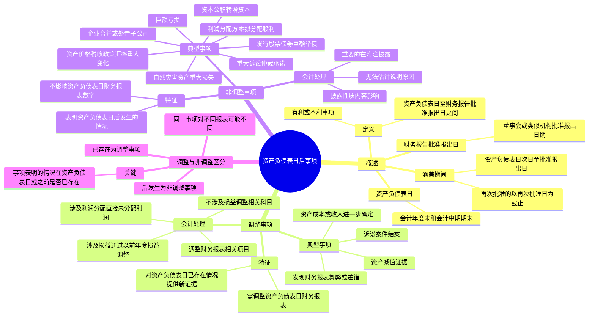

## 📍 章节定位

| 项目 | 信息 |
|------|------|
| **所属科目** | 📒 会计 |
| **难度等级** | ⭐⭐⭐ |
| **历年分值** | 4-5分 |
| **建议学时** | 4-5h |

## 📝 考情分析

本章是会计科目的重要章节，历年分值约 4-5 分，常以计算分析题和综合题形式考查，并广泛结合收入、或有事项、所得税、差错更正等章节出题。命题热点集中在：

1. **资产负债表日后事项的界定**：资产负债表日后事项的定义（资产负债表日至财务报告批准报出日之间发生的有利或不利事项），涵盖期间的确定（自资产负债表日次日起至财务报告批准报出日止），资产负债表日和财务报告批准报出日的判断。
2. **调整事项与非调整事项的区分**：调整事项（对资产负债表日已经存在的情况提供新的或进一步证据的事项），非调整事项（表明资产负债表日后发生的情况的事项），区分的关键在于该事项表明的情况在资产负债表日或之前是否已经存在。
3. **调整事项的会计处理**：涉及损益的事项通过"以前年度损益调整"科目核算，涉及利润分配调整的事项直接在"利润分配——未分配利润"科目核算，不涉及损益及利润分配的事项调整相关科目，调整财务报表相关项目的数字。
4. **非调整事项的披露**：重要的非调整事项应当在附注中披露其性质、内容及其对财务状况和经营成果的影响。
5. **典型调整事项**：资产负债表日后诉讼案件结案，资产负债表日后取得确凿证据表明资产减值或需要调整原减值金额，资产负债表日后进一步确定资产成本或售出资产收入，资产负债表日后发现财务报表舞弊或差错。
6. **典型非调整事项**：资产负债表日后发生重大诉讼、仲裁、承诺，资产价格、税收政策、外汇汇率发生重大变化，自然灾害导致资产重大损失，发行股票和债券及巨额举债，资本公积转增资本，发生巨额亏损，企业合并或处置子公司，利润分配方案中拟分配的现金股利或利润。

考生需重点掌握：调整事项的特征是"对资产负债表日**已经存在**的情况提供了新的或进一步证据"，需调整资产负债表日的财务报表；非调整事项的特征是"表明资产负债表日**后发生**的情况"，不影响资产负债表日的财务报表数字，但重要的非调整事项需在附注披露；涉及损益的调整事项通过"**以前年度损益调整**"科目核算，调整完成后将其余额转入"利润分配——未分配利润"；资产负债表日后发现财务报表舞弊或差错属于调整事项；资产负债表日后利润分配方案中拟分配的现金股利或利润属于**非调整事项**（不会导致在资产负债表日形成现时义务）；区分的关键在于事项表明的情况在资产负债表日或之前是否已经存在。

## 🧠 知识框架



## 📖 核心精讲

### 一、资产负债表日后事项概述

#### （一）资产负债表日后事项的定义

**资产负债表日后事项**，是指资产负债表日至财务报告批准报出日之间发生的**有利或不利事项**。

资产负债表日后事项不是在这个特定期间内发生的全部事项，而是：
1. 与资产负债表日存在状况有关的事项；或
2. 虽然与资产负债表日存在状况无关，但对企业财务状况具有重大影响的事项。

#### （二）资产负债表日

**资产负债表日**是指会计年度末和会计中期期末。中期是指短于一个完整的会计年度的报告期间，包括半年度、季度和月度。

- 年度资产负债表日：每年 12 月 31 日；
- 中期资产负债表日：各会计中期期末（如 3 月 31 日、6 月 30 日、9 月 30 日）。

> 如果母公司或者子公司在国外，无论其如何确定会计年度和会计中期，向国内提供的财务报告都应根据我国会计法和企业会计准则的要求确定资产负债表日。

#### （三）财务报告批准报出日

**财务报告批准报出日**是指董事会或类似机构批准财务报告报出的日期。

- 公司制企业：董事会批准财务报告报出的日期；
- 非公司制企业：经理（厂长）会议或类似机构批准财务报告报出的日期。

#### （四）资产负债表日后事项涵盖的期间

资产负债表日后事项涵盖的期间是自资产负债表日**次日起**至财务报告批准报出日**止**的一段时间。具体包括：

1. 报告期间下一期间的第一天至董事会或类似机构批准财务报告对外公布的日期。
2. 财务报告批准报出以后、实际报出之前又发生与资产负债表日或其后事项有关的事项，并由此影响财务报告对外公布日期的，应以董事会或类似机构**再次批准**财务报告对外公布的日期为截止日期。

### 二、资产负债表日后事项的内容

资产负债表日后事项包括**调整事项**和**非调整事项**。

#### （一）调整事项

**资产负债表日后调整事项**，是指对资产负债表日已经存在的情况提供了新的或进一步证据的事项。

如果资产负债表日及所属会计期间已经存在某种情况，但当时并不知道其存在或者不能知道确切结果，资产负债表日后发生的事项能够证实该情况的存在或者确切结果，则该事项属于调整事项。

企业发生的调整事项，通常包括下列各项：

| 序号 | 调整事项 |
|------|---------|
| 1 | 资产负债表日后诉讼案件结案，法院判决证实了企业在资产负债表日已经存在现时义务，需要调整原先确认的与该诉讼案件相关的预计负债，或确认一项新负债 |
| 2 | 资产负债表日后取得确凿证据，表明某项资产在资产负债表日发生了减值或者需要调整该项资产原先确认的减值金额 |
| 3 | 资产负债表日后进一步确定了资产负债表日前购入资产的成本或售出资产的收入 |
| 4 | 资产负债表日后发现了财务报表舞弊或差错 |

#### （二）非调整事项

**非调整事项**，是指表明资产负债表日后发生的情况的事项。非调整事项的发生不影响资产负债表日企业的财务报表数字，只说明资产负债表日后发生了某些情况。

重要的非调整事项虽然不影响资产负债表日的财务报表数字，但可能影响资产负债表日以后的财务状况和经营成果，不加以说明将会影响财务报告使用者作出正确估计和决策，因此需要适当披露。

非调整事项的主要例子有：

| 序号 | 非调整事项 |
|------|---------|
| 1 | 资产负债表日后发生重大诉讼、仲裁、承诺 |
| 2 | 资产负债表日后资产价格、税收政策、外汇汇率发生重大变化 |
| 3 | 资产负债表日后因自然灾害导致资产发生重大损失 |
| 4 | 资产负债表日后发行股票和债券以及其他巨额举债 |
| 5 | 资产负债表日后资本公积转增资本 |
| 6 | 资产负债表日后发生巨额亏损 |
| 7 | 资产负债表日后发生企业合并或处置子公司 |
| 8 | 资产负债表日后，企业利润分配方案中拟分配的以及经审议批准宣告发放的现金股利或利润 |

> **重要**：资产负债表日后利润分配方案中拟分配的以及经审议批准宣告发放的现金股利或利润属于**非调整事项**，因为该行为并不会导致企业在资产负债表日形成现时义务，支付义务在资产负债表日尚不存在。

此外，下列事项通常也属于非调整事项：
- 对于在报告期资产负债表日已经存在的债务，在其资产负债表日后期间与债权人达成的债务重组协议；
- 企业于资产负债表日对金融资产计提损失准备，资产负债表日至财务报告批准报出日之间该笔金融资产到期并全额收回（属于表明资产负债表日后发生的情况的事项）。

#### （三）调整事项与非调整事项的区分

资产负债表日后发生的某一事项究竟是调整事项还是非调整事项，取决于该事项表明的情况**在资产负债表日或资产负债表日以前是否已经存在**。

| 判断标准 | 类型 |
|---------|------|
| 该情况在资产负债表日或之前**已经存在** | **调整事项** |
| 该情况在资产负债表日**之后才发生** | **非调整事项** |

**典型例子**：
- 乙公司财务状况恶化导致甲公司应收账款无法收回 → 如果乙公司财务恶化在资产负债表日已存在（如已被宣告破产），属于**调整事项**；如果是资产负债表日后发生火灾导致，属于**非调整事项**。

> 同一性质的事项对于不同的财务报表而言，可能是调整事项，也可能是非调整事项，这取决于该事项所表明的情况是在资产负债表日或之前已经存在，还是在资产负债表日后才发生的。

### 三、调整事项的会计处理

#### （一）调整事项的处理原则

企业发生的调整事项，应当调整资产负债表日的财务报表。对于年度财务报告而言，由于资产负债表日后事项发生在报告年度的次年，报告年度的有关账目已经结转，特别是损益类科目在结账后已无余额。因此，应分别以下情况进行处理：

| 情形 | 处理方法 |
|------|---------|
| **涉及损益的事项** | 通过"**以前年度损益调整**"科目核算。调整增加以前年度利润或调整减少以前年度亏损的事项记入贷方；调整减少以前年度利润或调整增加以前年度亏损的事项记入借方。调整完成后，将其余额转入"利润分配——未分配利润"科目 |
| **涉及利润分配调整的事项** | 直接在"利润分配——未分配利润"科目核算 |
| **不涉及损益及利润分配的事项** | 调整相关科目 |
| **财务报表调整** | 调整资产负债表日编制的财务报表相关项目的期末数或本年发生数；当期编制的财务报表相关项目的期初数或上年数；报表附注内容 |

**所得税影响的处理**：涉及损益的调整事项，在企业所得税方面应按税收有关法律法规要求进行处理，可能会调整报告年度应纳税所得额、应纳所得税税额；也可能会调整本年度（即报告年度的次年）应纳税所得额、应纳所得税税额。

- 由于以前年度损益调整**增加**的所得税费用，记入"以前年度损益调整"科目的**借方**，同时贷记"应交税费——应交所得税"等科目；
- 由于以前年度损益调整**减少**的所得税费用，记入"以前年度损益调整"科目的**贷方**，同时借记"应交税费——应交所得税"等科目。

#### （二）调整事项的具体会计处理

**1. 资产负债表日后诉讼案件结案**

法院判决证实了企业在资产负债表日已经存在现时义务，需要调整原先确认的与该诉讼案件相关的预计负债，或确认一项新负债。

**调整分录示例**（以原确认预计负债 300 万元，法院判决赔偿 400 万元为例）：

```
（1）调整预计负债金额并调整递延所得税资产：
借：以前年度损益调整              1 000 000
    贷：其他应付款                1 000 000
借：应交税费——应交所得税        250 000
    贷：以前年度损益调整           250 000
借：应交税费——应交所得税        750 000
    贷：以前年度损益调整           750 000
借：以前年度损益调整              750 000
    贷：递延所得税资产             750 000
借：预计负债                     3 000 000
    贷：其他应付款                3 000 000
借：其他应付款                   4 000 000
    贷：银行存款                  4 000 000

（2）将"以前年度损益调整"科目余额转入未分配利润：
借：利润分配——未分配利润        750 000
    贷：以前年度损益调整           750 000

（3）调整盈余公积：
借：盈余公积                      75 000
    贷：利润分配——未分配利润     75 000
```

> 注：2×16 年年末因确认预计负债 300 万元时已确认相应的递延所得税资产，资产负债表日后事项发生后递延所得税资产不复存在，故应冲销相应记录。

**2. 资产负债表日后取得确凿证据表明资产减值或需要调整原减值金额**

在资产负债表日，根据当时的资料判断某项资产可能发生了损失或减值，但没有最后确定是否会发生，因而按照当时的最佳估计金额反映在财务报表中。但在资产负债表日后至财务报告批准报出日之间，所取得的确凿证据能证明该事实成立，即某项资产已经发生了损失或减值，则应对资产负债表日所作的估计予以修正。

**3. 资产负债表日后进一步确定资产成本或售出资产收入**

- 资产负债表日前购入的资产已经按暂估金额入账，资产负债表日后获得证据可以进一步确定该资产的成本，则应对已入账的资产成本进行调整。
- 企业在资产负债表日已根据收入确认条件确认资产销售收入，但资产负债表日后获得关于资产销售收入的进一步证据（如可变对价相关的后续变化等），应调整财务报表相关项目。

**销售退回的处理**：
- 销售商品附有销售退回条件的，资产负债表日后至财务报告批准报出日之间发生的销售退回如果与之前预计的情况不一致，如属于估计偏差，应予以调整；但如果属于资产负债表日后退回条件有所改变或市场突发难以预期的重大变化导致的，则不应调整。
- 企业销售商品未附有退回条件，资产负债表日后实际发生了退回的，如属于商品质量问题，应作为调整事项处理；如属于合同变更，则作为非调整事项处理。

**调整分录示例**（以销售退回为例，原售价 120 万元，成本 100 万元）：

```
① 调整销售收入：
借：以前年度损益调整              1 200 000
    应交税费——应交增值税（销项税额） 156 000
    贷：应收账款                  1 356 000

② 调整销售成本：
借：库存商品                     1 000 000
    贷：以前年度损益调整          1 000 000

③ 调整应缴纳的所得税：
借：应交税费——应交所得税         50 000
    贷：以前年度损益调整           50 000

④ 将"以前年度损益调整"科目余额转入利润分配：
借：利润分配——未分配利润        150 000
    贷：以前年度损益调整           150 000

⑤ 调整盈余公积：
借：盈余公积                      15 000
    贷：利润分配——未分配利润     15 000
```

**4. 资产负债表日后发现财务报表舞弊或差错**

这一事项属于调整事项，应按照前期差错更正的方法进行处理（追溯重述法）。

### 四、非调整事项的会计处理

#### （一）非调整事项的处理原则

资产负债表日后发生的非调整事项，是表明资产负债表日后发生的情况的事项，与资产负债表日存在状况无关，**不应当调整**资产负债表日的财务报表。但有的非调整事项对财务报告使用者具有重大影响，应在附注中进行披露。

#### （二）非调整事项的具体会计处理

资产负债表日后发生的非调整事项，应当在报表附注中披露每项重要的资产负债表日后非调整事项的**性质、内容及其对财务状况和经营成果的影响**。无法作出估计的，应当说明原因。

> 企业还应当在附注中披露与资产负债表日后事项有关的财务报告批准报出者和财务报告批准报出日。按照有关法律、行政法规等规定，企业所有者或其他方面有权对报出的财务报告进行修改的，应当披露这一情况。

## 💡 典型例题

**【例题 1】（基础题，单选题）**

下列关于资产负债表日后事项的表述中，正确的是（　　）。
A. 资产负债表日后事项是指资产负债表日至财务报告实际对外报出日之间发生的有利或不利事项
B. 资产负债表日后事项包括资产负债表日至财务报告批准报出日之间发生的全部事项
C. 资产负债表日后事项涵盖的期间自资产负债表日次日起至财务报告批准报出日止
D. 财务报告批准报出日是指财务报告实际对外公布的日期

**答案**：C

**解析**：A 错误，资产负债表日后事项是指资产负债表日至财务报告**批准报出日**之间发生的事项，不是实际对外报出日；B 错误，资产负债表日后事项不是该期间内发生的全部事项，而是与资产负债表日存在状况有关或对企业财务状况具有重大影响的事项；C 正确，涵盖期间自资产负债表日次日起至财务报告批准报出日止；D 错误，财务报告批准报出日是指董事会或类似机构批准财务报告报出的日期，不是实际对外公布的日期。

**【例题 2】（进阶题，单选题）**

下列资产负债表日后事项中，属于非调整事项的是（　　）。
A. 资产负债表日后诉讼案件结案，法院判决证实了资产负债表日已存在的现时义务
B. 资产负债表日后取得确凿证据，表明某项资产在资产负债表日发生了减值
C. 资产负债表日后发生重大自然灾害导致资产发生重大损失
D. 资产负债表日后发现了财务报表舞弊或差错

**答案**：C

**解析**：A、B、D 均属于调整事项，因为它们都是对资产负债表日已经存在的情况提供了新的或进一步证据；C 属于非调整事项，因为自然灾害是资产负债表日后才发生的，与资产负债表日存在状况无关，不影响资产负债表日的财务报表数字，但属于重要的非调整事项，应当在附注中披露。

**【例题 3】（计算题，诉讼案件结案的调整事项）**

甲公司因专利侵权被起诉。2×16 年 12 月 31 日法院尚未判决，甲公司确认了 500 万元的预计负债。2×17 年 2 月 20 日，在甲公司 2×16 年度财务报告批准报出之前，法院作出判决，要求甲公司支付赔偿款 700 万元。甲公司服从判决并于当日支付。甲公司适用的所得税税率为 25%，按净利润的 10% 提取法定盈余公积。假定该项预计负债产生的损失不允许在预计时税前扣除，只有在损失实际发生时才允许税前扣除。2×16 年所得税汇算清缴在 2×17 年 3 月 20 日完成。

要求：编制甲公司 2×17 年 2 月 20 日的调整分录。

**答案**：

（1）调整预计负债金额，并确认其他应付款：
```
借：以前年度损益调整              2 000 000
    贷：其他应付款                2 000 000
借：预计负债                     5 000 000
    贷：其他应付款                5 000 000
```

（2）调整应交所得税（损失实际发生，允许税前扣除）：
```
借：应交税费——应交所得税       1 750 000
    贷：以前年度损益调整         1 750 000
```
（700 × 25% = 175 万元）

（3）冲销原确认预计负债时确认的递延所得税资产：
```
借：以前年度损益调整             1 250 000
    贷：递延所得税资产           1 250 000
```
（500 × 25% = 125 万元）

（4）支付赔偿款：
```
借：其他应付款                   7 000 000
    贷：银行存款                 7 000 000
```

（5）将"以前年度损益调整"科目余额转入未分配利润：
- 以前年度损益调整余额 = 200 − 175 + 125 = 150（万元）（借方）
```
借：利润分配——未分配利润       1 500 000
    贷：以前年度损益调整         1 500 000
```

（6）调整盈余公积：
```
借：盈余公积                     150 000
    贷：利润分配——未分配利润    150 000
```

**解析**：资产负债表日后诉讼案件结案属于调整事项。原确认的预计负债 500 万元转为其他应付款，同时补记 200 万元的赔偿损失。由于损失实际发生允许税前扣除，调整应交所得税；原确认的递延所得税资产不再存在，应冲销。

**【例题 4】（计算题，销售退回的调整事项）**

甲公司 2×16 年 11 月 8 日销售一批商品给乙公司，取得收入 120 万元（不含税，增值税税率 13%）。甲公司发出商品后已确认收入，并结转成本 100 万元（不附返回条款）。2×16 年 12 月 31 日该笔货款尚未收到，甲公司未对应收账款计提坏账准备。2×17 年 1 月 12 日，乙公司认为该批商品存在质量问题，返回所购商品。甲公司适用的所得税税率为 25%，按净利润的 10% 提取法定盈余公积。假定该销售退回事项应调整 2×16 年度的应纳税所得额。

要求：编制甲公司 2×17 年 1 月 12 日的调整分录。

**答案**：

```
① 调整销售收入：
借：以前年度损益调整              1 200 000
    应交税费——应交增值税（销项税额） 156 000
    贷：应收账款                  1 356 000

② 调整销售成本：
借：库存商品                     1 000 000
    贷：以前年度损益调整          1 000 000

③ 调整应缴纳的所得税（(120 − 100) × 25% = 5 万元）：
借：应交税费——应交所得税         50 000
    贷：以前年度损益调整           50 000

④ 将"以前年度损益调整"科目余额转入利润分配（120 − 100 − 5 = 15 万元）：
借：利润分配——未分配利润        150 000
    贷：以前年度损益调整           150 000

⑤ 调整盈余公积（15 × 10% = 1.5 万元）：
借：盈余公积                      15 000
    贷：利润分配——未分配利润     15 000
```

**解析**：资产负债表日后发生的销售退回，如属于商品质量问题（资产负债表日已存在的情况），应作为调整事项处理，调整报告年度的收入、成本和所得税。

**【例题 5】（综合题，调整事项与非调整事项的判断）**

甲公司 2×25 年度财务报告于 2×26 年 4 月 30 日批准报出。2×26 年 1 月至 4 月发生下列事项：

（1）2×26 年 2 月 1 日，甲公司收到 2×25 年 10 月销售给乙公司商品的退回，退回原因为商品质量问题。
（2）2×26 年 2 月 15 日，甲公司因 2×25 年 12 月 31 日前发生的交通事故被法院判决赔偿 200 万元（原已确认预计负债 150 万元）。
（3）2×26 年 3 月 1 日，甲公司发行公司债券 5 亿元。
（4）2×26 年 3 月 20 日，甲公司董事会通过利润分配方案，拟分配现金股利 1 000 万元。
（5）2×26 年 4 月 10 日，甲公司因自然灾害导致一项固定资产发生重大损失 800 万元。

要求：逐项判断上述事项属于调整事项还是非调整事项。

**答案**：

| 序号 | 事项 | 类型 | 理由 |
|------|------|------|------|
| （1） | 销售退回（商品质量问题） | **调整事项** | 商品质量问题在资产负债表日已存在，销售退回是对资产负债表日已存在情况提供的进一步证据 |
| （2） | 法院判决赔偿 | **调整事项** | 交通事故在资产负债表日前已发生，法院判决证实了资产负债表日已存在的现时义务 |
| （3） | 发行公司债券 | **非调整事项** | 发行债券是资产负债表日后才发生的事项，与资产负债表日存在状况无关 |
| （4） | 利润分配方案拟分配现金股利 | **非调整事项** | 利润分配方案不会导致在资产负债表日形成现时义务，支付义务在资产负债表日尚不存在 |
| （5） | 自然灾害导致资产重大损失 | **非调整事项** | 自然灾害是资产负债表日后才发生的，与资产负债表日存在状况无关 |

**解析**：调整事项与非调整事项的区分关键在于该事项表明的情况在资产负债表日或之前是否已经存在。已存在的为调整事项，后发生的为非调整事项。

## 🎯 记忆口诀

- **日后事项定义**："表日至批准报出日，有利或不利事项"——资产负债表日至财务报告批准报出日之间发生的有利或不利事项。
- **涵盖期间**："次日始，批准日止"——自资产负债表日次日起至财务报告批准报出日止。
- **调整事项特征**："对已存在情况提供新证据"——对资产负债表日已经存在的情况提供新的或进一步证据的事项。
- **非调整事项特征**："表明日后发生的情况"——表明资产负债表日后发生的情况的事项，不影响资产负债表日财务报表数字。
- **区分关键**："已存在为调整，后发生为非调整"——事项表明的情况在资产负债表日或之前已存在的为调整事项，后发生的为非调整事项。
- **调整事项处理**："损益走以前年度损益调整，利润分配走未分配利润"——涉及损益通过"以前年度损益调整"科目，涉及利润分配直接在"利润分配——未分配利润"科目。
- **以前年度损益调整四步**："调损益、调所得税、转未分配利润、调盈余公积"——先调整损益，再调整所得税，然后将余额转入未分配利润，最后调整盈余公积。
- **四类调整事项**："诉讼结案、资产减值、成本收入确定、发现舞弊差错"——典型的四类调整事项。
- **现金股利**："拟分配股利为非调整事项"——利润分配方案中拟分配的现金股利或利润属于非调整事项，不调整资产负债表日财务报表。
- **财务报表调整**："调期末数、调期初数、调附注"——调整资产负债表日财务报表期末数、当期财务报表期初数、附注内容。
- **非调整事项披露**："披露性质、内容、影响"——重要非调整事项在附注中披露性质、内容及其对财务状况和经营成果的影响。

## ✅ 同步练习

1. （基础题）资产负债表日后事项的定义，资产负债表日和财务报告批准报出日的确定，涵盖期间的确定（包括再次批准的情形）。提示：参见《必刷 550 题》资产负债表日后事项基础题。
2. （进阶题）调整事项与非调整事项的区分（关键在于事项表明的情况在资产负债表日或之前是否已经存在），同一事项对不同报表可能是调整事项也可能是非调整事项。提示：参见《必刷 550 题》调整与非调整事项区分进阶题。
3. （易错题）调整事项的会计处理原则（涉及损益通过"以前年度损益调整"科目，涉及利润分配直接在"未分配利润"科目，不涉及损益调整相关科目），财务报表的调整（期末数、期初数、附注）。提示：参见《必刷 550 题》调整事项处理易错题。
4. （计算题）资产负债表日后诉讼案件结案的会计处理（调整预计负债、确认其他应付款、调整应交所得税、冲销递延所得税资产），资产负债表日后销售退回的会计处理（调整收入、成本、所得税）。提示：参见《必刷 550 题》调整事项计算题。
5. （真题改编）资产负债表日后资产减值的调整（调整原减值金额），资产负债表日后发现财务报表舞弊或差错的处理（追溯重述法），资产负债表日后进一步确定资产成本或售出资产收入的处理。提示：参见历年真题计算分析题。
6. （综合题）调整事项与非调整事项的综合判断（诉讼结案、自然灾害、发行债券、利润分配方案等），调整事项的综合会计处理（结合或有事项、所得税、收入等章节），非调整事项的披露。提示：参见历年真题综合题。
7. 综合复习资产负债表日后事项与前期差错更正的关系（资产负债表日后发现的前期差错按调整事项处理），与或有事项的关系（预计负债的调整），与收入的关系（销售退回的调整），现金股利分配的非调整事项性质。
