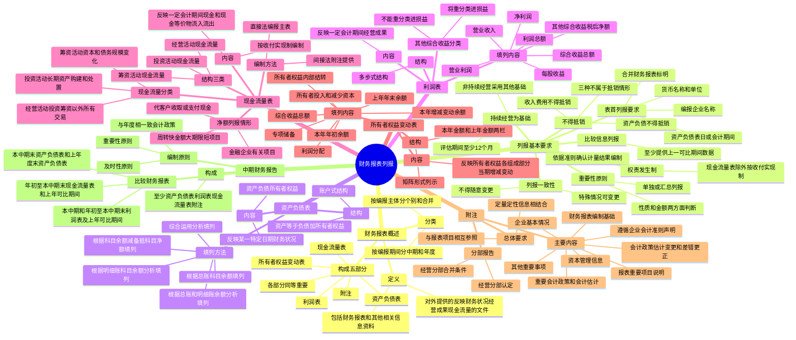

## 📍 章节定位

| 项目 | 信息 |
|------|------|
| **所属科目** | 📒 会计 |
| **难度等级** | ⭐⭐ |
| **历年分值** | 2-3分 |
| **建议学时** | 3-4h |

## 📝 考情分析

本章是会计科目的基础章节，历年分值约 2-3 分，常以客观题形式考查，命题热点集中在：

1. **财务报表的构成**：财务报表至少应当包括资产负债表、利润表、现金流量表、所有者权益变动表、附注五个组成部分，各组成部分具有同等的重要程度。
2. **财务报表列报的基本要求**：依据各项会计准则确认和计量的结果编制、以持续经营为基础、权责发生制（现金流量表除外）、列报一致性、重要性原则、不得抵销、比较信息列报等。
3. **资产负债表的填列方法**：根据总账科目余额填列、根据明细账科目余额分析计算填列、根据总账和明细账余额分析计算填列、根据科目余额减去备抵科目余额后的净额填列、综合运用上述方法分析填列。
4. **利润表的结构**：多步式结构，营业收入-营业成本-税金及附加-期间费用+其他收益+投资收益+公允价值变动收益+资产处置收益等=营业利润；营业利润+营业外收入-营业外支出=利润总额；利润总额-所得税费用=净利润。
5. **现金流量的分类**：经营活动、投资活动、筹资活动三类现金流量的划分，现金流量表的编制方法（直接法为主表，间接法为附注）。
6. **所有者权益变动表**：以矩阵形式列示，反映构成所有者权益各组成部分当期增减变动情况。
7. **附注披露**：企业的基本情况、财务报表编制基础、遵循企业会计准则的声明、重要会计政策和会计估计、报表重要项目的说明等。
8. **中期财务报告**：至少应当包括资产负债表、利润表、现金流量表和附注，遵循与年度财务报告相一致的会计政策、重要性原则、及时性原则。

考生需重点掌握：财务报表**至少包括五部分**且具有同等重要程度；现金流量表按**收付实现制**编制，其他报表按**权责发生制**编制；财务报表项目**不得抵销**（ except 三种不属于抵销的情形）；现金流量分为**经营、投资、筹资**三类；我国企业应当采用**直接法**编报现金流量表主表，同时在附注中提供**间接法**信息；中期财务报告至少应当编制**资产负债表、利润表、现金流量表和附注**。

## 🧠 知识框架

## 📖 核心精讲

### 一、财务报表概述

#### （一）财务报表的定义和构成

**财务报表**是对企业财务状况、经营成果和现金流量的结构性表述。财务报表至少应当包括下列五个组成部分（各组成部分具有**同等的重要程度**）：

1. 资产负债表
2. 利润表
3. 现金流量表
4. 所有者权益变动表
5. 附注

#### （二）财务报表的分类

| 分类标准 | 类别 |
|---------|------|
| 按编报期间不同 | 中期财务报表（月报、季报、半年报）、年度财务报表 |
| 按编报主体不同 | 个别财务报表、合并财务报表 |

### 二、财务报表列报的基本要求

#### （一）依据各项会计准则确认和计量的结果编制财务报表

企业不应以在附注中披露代替对交易和事项的确认和计量，不恰当的会计政策不得通过附注披露等其他形式予以更正。

#### （二）列报基础——持续经营

企业应当以**持续经营**为基础编制财务报表。管理层应当全面评估企业的持续经营能力，评估期间应包含企业自资产负债表日起至少 **12 个月**。

**非持续经营状态的情形**：
1. 企业已在当期进行清算或停止营业
2. 企业已经正式决定在下一个会计期间进行清算或停止营业
3. 企业已确定在当期或下一个会计期间没有其他可供选择的方案而将被迫进行清算或停止营业

> 企业处于非持续经营状态时，应当采用其他基础编制财务报表，并在附注中声明未以持续经营为基础列报的原因及编制基础。

#### （三）权责发生制

除**现金流量表**按照收付实现制编制外，企业应当按照**权责发生制**编制其他财务报表。

#### （四）列报的一致性

财务报表项目的列报应当在各个会计期间保持一致，不得随意变更。特殊情况可变更：会计准则要求改变；企业经营业务性质发生重大变化或重大交易事项后变更能提供更可靠、更相关的信息。

#### （五）依据重要性原则单独或汇总列报项目

| 项目特征 | 列报方式 |
|---------|---------|
| 性质或功能不同的项目 | 一般应当单独列报（不具有重要性的可汇总） |
| 性质或功能类似的项目 | 一般可以汇总列报（具有重要性的类别应单独） |

**重要性判断**：从项目的**性质**（是否属于日常活动、是否显著影响财务状况等）和**金额**（占资产总额、负债总额、营业收入总额等比重）两方面判断。

#### （六）财务报表项目金额间的相互抵销

财务报表项目应当以**总额**列报，资产和负债、收入和费用、直接计入当期利润的利得和损失项目的金额**不能相互抵销**。

**三种不属于抵销的情形**：
1. 一组类似交易形成的利得和损失以净额列示（如汇兑损益）
2. 资产或负债项目按扣除备抵项目后的净额列示（如应收账款扣除坏账准备）
3. 非日常活动产生的利得和损失，以同一交易形成的收益扣减相关费用后的净额列示（如非流动资产处置损益）

#### （七）比较信息的列报

企业列报当期财务报表时，至少应当提供所有列报项目上一个可比会计期间的比较数据。追溯应用会计政策或追溯重述时，应当至少列报**三期资产负债表、两期其他各报表**及相关附注。

#### （八）财务报表表首的列报要求

表首应当至少披露：编报企业名称；资产负债表日或会计期间；货币名称和单位（人民币）；财务报表是合并财务报表的应予以标明。

### 三、资产负债表

#### （一）资产负债表的内容和结构

**资产负债表**是反映企业在某一特定日期财务状况的会计报表。在我国，资产负债表采用**账户式结构**，报表分为左右两方，左方列示资产各项目，右方列示负债和所有者权益各项目。资产负债表左右双方平衡，**资产 = 负债 + 所有者权益**。

#### （二）资产负债表的填列方法

**1. 根据总账科目的余额填列**：如"短期借款""应付票据""实收资本""资本公积"等项目根据有关总账科目余额填列；"货币资金"项目根据"库存现金""银行存款""其他货币资金"等总账科目余额合计数填列。

**2. 根据明细账科目的余额分析计算填列**：如"应付账款"项目根据"应付账款"和"预付账款"科目所属相关明细科目的期末贷方余额合计数填列。

**3. 根据总账科目和明细账科目的余额分析计算填列**：如"长期借款"项目根据"长期借款"总账科目余额扣除一年内到期部分后的金额填列。

**4. 根据有关科目余额减去其备抵科目余额后的净额填列**：如"固定资产"项目根据"固定资产"科目期末余额减去"累计折旧"和"固定资产减值准备"科目期末余额后的金额填列。

**5. 综合运用上述填列方法分析填列**：如"存货"项目根据"材料采购""原材料""库存商品""生产成本"等科目期末余额合计，减去"存货跌价准备"等科目期末余额后的金额填列。

### 四、利润表

#### （一）利润表的内容和结构

**利润表**是反映企业在一定会计期间经营成果的会计报表。在我国，企业利润表采用**多步式结构**，费用按照**功能分类**列报（经营业务成本、管理费用、销售费用、研发费用、财务费用等），同时在附注中披露费用按照性质分类的补充资料。

#### （二）利润表的主要项目

| 项目 | 计算关系 |
|------|---------|
| 营业收入 | 主营业务收入 + 其他业务收入 |
| 营业利润 | 营业收入 - 营业成本 - 税金及附加 - 销售费用 - 管理费用 - 研发费用 - 财务费用 + 其他收益 + 投资收益 + 净敞口套期收益 + 公允价值变动收益 + 信用减值损失 + 资产减值损失 + 资产处置收益 |
| 利润总额 | 营业利润 + 营业外收入 - 营业外支出 |
| 净利润 | 利润总额 - 所得税费用（分为持续经营净利润和终止经营净利润） |
| 综合收益总额 | 净利润 + 其他综合收益税后净额 |

#### （三）其他综合收益的分类

| 类别 | 主要项目 |
|------|---------|
| **不能重分类进损益**的其他综合收益 | 重新计量设定受益计划变动额、权益法下不能转损益的其他综合收益、其他权益工具投资公允价值变动、企业自身信用风险公允价值变动 |
| **将重分类进损益**的其他综合收益 | 权益法下可转损益的其他综合收益、其他债权投资公允价值变动、金融资产重分类计入其他综合收益的金额、其他债权投资信用减值准备、现金流量套期储备、外币财务报表折算差额、自用房地产转换为公允价值模式投资性房地产转换日公允价值大于账面价值部分 |

### 五、现金流量表

#### （一）现金流量表的内容和结构

**现金流量表**是反映企业在一定会计期间现金和现金等价物流入和流出的报表，按照**收付实现制**原则编制。现金流量表分为经营活动、投资活动和筹资活动三个部分。

> **现金等价物**：企业持有的期限短、流动性强、易于转换为已知金额现金、价值变动风险很小的投资（通常指购买至到期不超过 3 个月的投资）。

#### （二）现金流量的分类

| 类别 | 含义 | 主要内容 |
|------|------|---------|
| **经营活动**产生的现金流量 | 企业投资活动和筹资活动以外的所有交易和事项 | 销售商品提供劳务收到的现金、购买商品接受劳务支付的现金、支付给职工的现金、支付的各项税费等 |
| **投资活动**产生的现金流量 | 企业长期资产的购建和不包括在现金等价物范围内的投资及其处置活动 | 购建固定资产无形资产支付的现金、投资支付的现金、收回投资收到的现金、处置固定资产收回的现金净额等 |
| **筹资活动**产生的现金流量 | 导致企业资本及债务规模和构成发生变化的活动 | 吸收投资收到的现金、取得借款收到的现金、偿还债务支付的现金、分配股利利润或偿付利息支付的现金等 |

> **特殊项目处理**：自然灾害损失、保险赔款、捐赠等应当归并到相关类别中。不能确指的列入经营活动。现金与现金等价物之间的转换不产生现金流量。

#### （三）现金流量表的编制方法

| 方法 | 特点 |
|------|------|
| **直接法**（主表） | 以利润表中的营业收入为起算点，调节与经营活动有关的项目增减变动，计算出经营活动产生的现金流量 |
| **间接法**（附注） | 将净利润调节为经营活动现金流量，将权责发生制下的净利润调整为现金净流入 |

> 我国企业会计准则规定企业应当采用**直接法**编报现金流量表，同时要求在附注中提供以净利润为基础调节到经营活动现金流量的信息（间接法）。

#### （四）现金流量的列示

通常情况下，现金流量应当分别按照现金流入和现金流出**总额**列报。但下列各项可以按照**净额**列报：
1. 代客户收取或支付的现金以及周转快、金额大、期限短项目的现金流入和现金流出
2. 金融企业的有关项目（期限较短、流动性强的项目）

### 六、所有者权益变动表

**所有者权益变动表**是反映构成所有者权益各组成部分当期增减变动情况的报表，以**矩阵**形式列示。

**所有者权益的来源**：所有者投入的资本（实收资本、其他权益工具、资本溢价等资本公积）、其他综合收益、专项储备、留存收益（盈余公积和未分配利润）。

**所有者权益变动表的主要项目**：
1. 上年年末余额
2. 本年年初余额（会计政策变更、前期差错更正等调整）
3. 本年增减变动余额：
   - 综合收益总额
   - 所有者投入和减少资本
   - 利润分配（提取盈余公积、对所有者的分配）
   - 所有者权益内部结转（资本公积转增资本、盈余公积转增资本、弥补亏损等）
   - 专项储备
4. 本年年末余额

### 七、附注

#### （一）附注披露的总体要求

附注是对在资产负债表、利润表、现金流量表和所有者权益变动表等报表中列示项目的文字描述或明细资料，以及对未能在这些报表中列示项目的说明。附注相关信息应当与报表中列示的项目相互参照。

#### （二）附注的主要内容

附注应当按照如下顺序至少披露：
1. 企业的基本情况
2. 财务报表的编制基础
3. 遵循企业会计准则的声明
4. 重要会计政策和会计估计
5. 会计政策和会计估计变更以及差错更正的说明
6. 报表重要项目的说明
7. 其他需要说明的重要事项（或有和承诺事项、资产负债表日后非调整事项、关联方关系及其交易等）
8. 有助于财务报表使用者评价企业管理资本的目标、政策及程序的信息

#### （三）分部报告

**经营分部**是指企业内同时满足下列条件的组成部分：
1. 该组成部分能够在日常活动中产生收入、发生费用
2. 企业管理层能够定期评价该组成部分的经营成果，以决定向其配置资源、评价其业绩
3. 企业能够取得该组成部分的财务状况、经营成果和现金流量等有关会计信息

**经营分部合并的条件**（具有相似经济特征且同时满足）：
1. 各项产品或劳务的性质相同或相似
2. 生产过程的性质相同或相似
3. 产品或劳务的客户类型相同或相似
4. 销售产品或提供劳务的方式相同或相似

### 八、中期财务报告

#### （一）中期财务报告的构成

中期财务报告至少应当包括**资产负债表、利润表、现金流量表和附注**。所有者权益变动表可以根据需要自行决定。

#### （二）中期财务报告的编制原则

| 原则 | 要求 |
|------|------|
| 与年度财务报告相一致的会计政策 | 将中期视同为一个独立的会计期间，会计政策与年度一致，不得随意变更 |
| 重要性原则 | 重要性程度的判断应当以**中期财务数据**为基础，不得以预计的年度财务数据为基础 |
| 及时性原则 | 中期财务报告计量相对于年度更大程度依赖于估计 |

#### （三）中期比较财务报表

中期财务报告应当按照下列规定提供比较财务报表：
1. 本中期末的资产负债表和上年度末的资产负债表
2. 本中期的利润表、年初至本中期末的利润表以及上年度可比期间的利润表
3. 年初至本中期末的现金流量表和上年度年初至上年可比中期末的现金流量表

## 💡 典型例题

**【例题 1】（基础题，单选题）**

下列各项中，不属于企业财务报表组成部分的是（　　）。
A. 资产负债表
B. 利润表
C. 董事会报告
D. 附注

**答案**：C

**解析**：财务报表至少应当包括资产负债表、利润表、现金流量表、所有者权益变动表、附注五个组成部分。董事会报告属于年度报告中的其他信息，不属于财务报表的组成部分。

**【例题 2】（基础题，单选题）**

下列关于财务报表列报的表述中，正确的是（　　）。
A. 企业应当以权责发生制为基础编制所有财务报表
B. 财务报表项目应当以净额列报，资产和负债可以相互抵销
C. 企业至少应当提供所有列报项目上一个可比会计期间的比较数据
D. 现金流量表应当按照权责发生制编制

**答案**：C

**解析**：A 错误，现金流量表按照收付实现制编制，其他财务报表按照权责发生制编制；B 错误，财务报表项目应当以总额列报，资产和负债、收入和费用等不得相互抵销（除三种不属于抵销的情形外）；C 正确，企业列报当期财务报表时至少应当提供所有列报项目上一个可比会计期间的比较数据；D 错误，现金流量表按照收付实现制编制。

**【例题 3】（进阶题，多选题）**

下列各项中，属于经营活动产生的现金流量的有（　　）。
A. 销售商品收到的现金
B. 购建固定资产支付的现金
C. 支付给职工以及为职工支付的现金
D. 偿还债务支付的现金

**答案**：AC

**解析**：A、C 属于经营活动产生的现金流量。B 属于投资活动产生的现金流量（购建长期资产）。D 属于筹资活动产生的现金流量（偿还债务导致债务规模变化）。

**【例题 4】（进阶题，单选题）**

下列各项中，属于将重分类进损益的其他综合收益的是（　　）。
A. 重新计量设定受益计划变动额
B. 其他权益工具投资公允价值变动
C. 其他债权投资公允价值变动
D. 企业自身信用风险公允价值变动

**答案**：C

**解析**：A、B、D 均属于不能重分类进损益的其他综合收益。C 属于将重分类进损益的其他综合收益（其他债权投资终止确认时公允价值变动转入投资收益）。

## 🎯 记忆口诀

**财务报表构成口诀**：
> 资产利润现金流，所有者权益加附注；
> 五大部分同等重，缺一不可记心间。

**列报基础口诀**：
> 持续经营为基础，十二个月评估期；
> 权责发生制为主，现金流量收付制。

**不得抵销口诀**：
> 资产负债不抵销，收入费用不抵销；
> 三种例外记清楚：类似交易净额列、
> 备抵项目净额列、非日常净额列。

**现金流量分类口诀**：
> 经营活动是日常，投资购建长期产；
> 筹资资本债务变，三类分清莫混淆。

**直接法间接法口诀**：
> 主表直接法编报，营业收入为起点；
> 附注间接法调节，净利润调现金流量。

**其他综合收益口诀**：
> 不能重分类进损益：设定受益权益法，其他权益自身信；
> 将重分类进损益：债权投资公允变，外币折算现金套期。

**中期财务报告口诀**：
> 资产利润现金流，附注四项不可少；
> 会计政策同年度，重要性看中期数。

## ✅ 同步练习

**1. （单选题）下列关于财务报表列报基本要求的表述中，不正确的是（　　）。**

A. 企业应当以持续经营为基础编制财务报表
B. 财务报表项目的列报应当在各个会计期间保持一致，不得随意变更
C. 企业应当以权责发生制为基础编制所有财务报表
D. 财务报表项目应当以总额列报，资产和负债、收入和费用不得相互抵销

**2. （单选题）下列各项中，不属于投资活动产生的现金流量的是（　　）。**

A. 购建固定资产支付的现金
B. 投资支付的现金
C. 收回投资收到的现金
D. 分配股利支付的现金

**3. （多选题）下列各项中，属于附注至少应当披露的内容有（　　）。**

A. 企业的基本情况
B. 财务报表的编制基础
C. 重要会计政策和会计估计
D. 报表重要项目的说明

**4. （多选题）下列各项中，属于中期财务报告至少应当包括的内容有（　　）。**

A. 资产负债表
B. 利润表
C. 现金流量表
D. 所有者权益变动表

**5. （判断题）企业编制现金流量表时，应当采用间接法编报主表，同时在附注中提供以直接法计算的信息。（　　）**

**6. （判断题）中期财务报告的重要性判断应当以预计的年度财务数据为基础，不得以中期财务数据为基础。（　　）**

📋 参考答案

**1. C**。企业应当以权责发生制为基础编制财务报表，但**现金流量表**按照收付实现制编制，因此 C 选项"以权责发生制为基础编制所有财务报表"不正确。

**2. D**。分配股利支付的现金属于筹资活动产生的现金流量（导致企业资本及债务规模和构成发生变化）。A、B、C 均属于投资活动产生的现金流量。

**3. ABCD**。附注应当按照如下顺序至少披露：企业的基本情况、财务报表的编制基础、遵循企业会计准则的声明、重要会计政策和会计估计、会计政策和会计估计变更以及差错更正的说明、报表重要项目的说明、其他需要说明的重要事项、有助于财务报表使用者评价企业管理资本的目标、政策及程序的信息。

**4. ABC**。中期财务报告至少应当包括资产负债表、利润表、现金流量表和附注。所有者权益变动表企业可以根据需要自行决定，不属于中期财务报告至少应当包括的内容。

**5. ×**。我国企业会计准则规定企业应当采用**直接法**编报现金流量表主表，同时在附注中提供以**间接法**（以净利润为基础调节到经营活动现金流量）的信息。题目表述正好相反。

**6. ×**。中期财务报告的重要性程度的判断应当以**中期财务数据**为基础，不得以预计的年度财务数据为基础。这里所指的"中期财务数据"，既包括本中期的财务数据，也包括年初至本中期末的财务数据。

