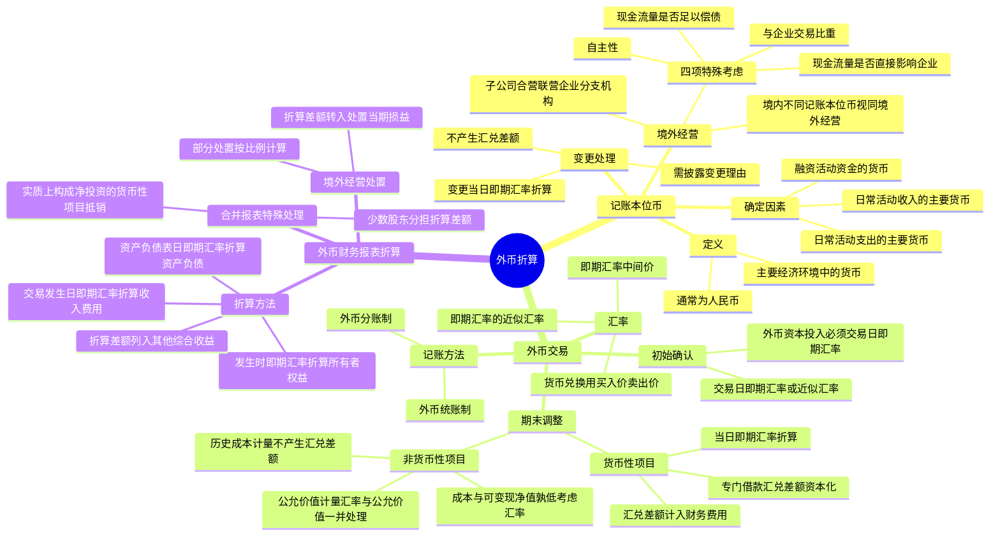

## 1. 章节定位

| 项目 | 信息 |
|------|------|
| 所属科目 | 会计 |
| 难度等级 | 3 |
| 历年分值 | 2-4 分 |
| 建议学时 | 3-5 小时 |
| 知识关联章节 | 第19章 所得税（汇兑差额的计税处理）、第20章 借款费用（外币专门借款汇兑差额资本化）、第22章 金融工具确认和计量（外币金融资产后续计量）、第27章 合并财务报表（境外经营合并报表折算）、第13章 或有事项（境外经营处置） |

## 2. 考情分析

本章是会计科目的中等难度章节，历年分值约 2-4 分，多以客观题或计算分析题形式出现，重点考查记账本位币的确定、外币交易期末调整、外币财务报表折算方法及境外经营处置等知识点。

**命题规律**：本章命题以业务情境为载体，重点考查外币货币性项目期末汇兑差额的计算与归属科目、外币非货币性项目的不同计量方式、外币财务报表折算汇率的选择及折算差额的列报。主观题常与借款费用资本化、金融资产后续计量等结合考查。

**高频考点分布**：

1. **记账本位币的确定**：三项考虑因素（日常活动收入、支出、融资活动）；境外经营记账本位币的四项特殊考虑；记账本位币变更采用变更当日的即期汇率折算，不产生汇兑差额。
2. **即期汇率的选择**：中国人民银行公布的中间价；货币兑换交易使用买入价或卖出价；即期汇率的近似汇率（当期平均汇率或加权平均汇率）。
3. **外币交易的初始确认**：采用交易日的即期汇率或即期汇率的近似汇率折算；外币资本投入必须采用交易日即期汇率，不产生外币资本折算差额。
4. **货币性项目期末调整**：以当日即期汇率折算，汇兑差额计入当期损益（财务费用——汇兑差额）；外币专门借款汇兑差额资本化条件。
5. **非货币性项目的处理**：以历史成本计量的不产生汇兑差额；以成本与可变现净值孰低计量的存货考虑汇率变动影响；以公允价值计量的金融资产汇率变动与公允价值变动一并处理。
6. **外币财务报表折算**：资产负债表资产和负债采用资产负债表日即期汇率；所有者权益项目（除未分配利润外）采用发生时即期汇率；利润表采用交易发生日即期汇率或近似汇率；折算差额列入其他综合收益。
7. **境外经营处置**：将相关外币报表折算差额转入处置当期损益。

**联动考查方式**：
- 与借款费用结合：外币专门借款汇兑差额的资本化处理；
- 与金融工具结合：以外币计价的交易性金融资产和其他权益工具投资的期末计量；
- 与合并财务报表结合：境外经营子公司合并报表的折算、少数股东应分担的折算差额、实质上构成对境外经营净投资的外币货币性项目抵销。

**备考建议**：
- 牢记货币性项目与非货币性项目的分类清单，这是判断是否产生汇兑差额的关键；
- 区分不同计量基础下非货币性项目的汇率处理（历史成本、可变现净值、公允价值）；
- 掌握外币财务报表折算的汇率选择规则，特别是所有者权益项目的特殊性；
- 注意外币资本投入必须采用交易日即期汇率，不采用合同约定汇率。

## 3. 知识框架

## 4. 核心精讲

### 4.1 记账本位币的确定

#### 4.1.1 记账本位币的定义

**记账本位币**是指企业经营所处的主要经济环境中的货币。**主要经济环境**，通常是指企业主要产生和支出现金的环境，使用该环境中的货币最能反映企业主要交易的经济结果。例如，我国大多数企业主要产生和支出现金的环境在国内，因此，企业通常应以人民币作为记账本位币。

《中华人民共和国会计法》规定，业务收支以人民币以外的货币为主的单位，可以选定其中一种货币作为记账本位币，但是编报的财务会计报告应当折算为人民币。

#### 4.1.2 记账本位币的确定因素

企业记账本位币的选定，应当考虑下列三项因素：

1. **从日常活动收入的角度**：所选择的货币能够对企业商品和劳务销售价格起主要作用，通常以该货币进行商品和劳务销售价格的计价和结算。
2. **从日常活动支出的角度**：所选择的货币能够对商品和劳务所需人工、材料和其他费用产生主要影响，通常以该货币进行这些费用的计价和结算。
3. **融资活动获得的资金以及保存从经营活动中收取款项时所使用的货币**。在有些情况下，企业根据收支情况难以确定记账本位币，需要在收支基础上结合融资活动获得的资金或保存从经营活动中收取款项时所使用的货币进行综合分析后作出判断。

**判断优先级**：一般情况下，综合考虑前两项即可确定企业的记账本位币，第三项为参考因素，视其对企业收支现金的影响程度而定。在综合考虑前两项因素仍不能确定企业记账本位币的情况下，第三项因素对企业记账本位币的确定起重要作用。上述因素的重要程度因企业具体情况不同而不同，需要企业管理当局根据实际情况进行判断。

**重要原则**：企业管理当局根据实际情况确定的记账本位币只有一种，该货币一经确定，不得随意变更，除非与确定记账本位币相关的企业经营所处的主要经济环境发生重大变化。

#### 4.1.3 境外经营记账本位币的确定

**境外经营的含义**：境外经营通常是指企业在境外的子公司、合营企业、联营企业、分支机构。当企业在境内的子公司、联营企业、合营企业或者分支机构选定的记账本位币不同于企业的记账本位币时，也应当视同境外经营。

**区分境外经营的关键**有两项：
- 该实体与企业的关系，是否为企业的子公司、合营企业、联营企业、分支机构；
- 该实体的记账本位币是否与企业记账本位币相同，而不是以该实体是否在企业所在地的境外作为标准。

**境外经营记账本位币的特殊考虑**：境外经营在确定其记账本位币时也应当考虑上述三项因素。同时，由于境外经营是企业的子公司、联营企业、合营企业或者分支机构，境外经营记账本位币的选择还应当考虑该境外经营与企业的关系：

| 考虑因素 | 选择企业记账本位币相同货币的情形 | 选择所处主要经济环境货币的情形 |
|------|------|------|
| 活动自主性 | 境外经营所从事的活动视同企业经营活动的延伸 | 境外经营所从事的活动拥有极大的自主性 |
| 与企业的交易比重 | 境外经营与企业的交易在境外经营活动中所占比例较高 | 与企业的交易在境外经营活动中所占比例较低 |
| 现金流量对企业的影响 | 境外经营现金流量直接影响企业现金流量，并可随时汇回 | 境外经营现金流量不直接影响企业，或不能随时汇回 |
| 现金流量偿债能力 | 境外经营现金流量在企业不提供资金的情况下难以偿还其现有债务和可预期债务 | 境外经营现金流量足以偿还其现有债务和可预期债务 |

#### 4.1.4 记账本位币变更的会计处理

企业因经营所处的主要经济环境发生重大变化，确需变更记账本位币的，应当采用**变更当日的即期汇率**将所有项目折算为变更后的记账本位币，折算后的金额作为新的记账本位币的历史成本。由于采用同一即期汇率进行折算，**不会产生汇兑差额**。

企业需要提供确凿的证据证明企业经营所处的主要经济环境确实发生了重大变化，并应当在附注中披露变更的理由。

### 4.2 外币交易的会计处理

#### 4.2.1 汇率

**汇率**是指两种货币相兑换的比率，是一种货币单位用另一种货币单位所表示的价格。通常在银行见到的汇率有三种表示方式：

| 汇率类型 | 含义 |
|------|------|
| 买入价 | 银行买入其他货币的价格 |
| 卖出价 | 银行出售其他货币的价格 |
| 中间价 | 银行买入价与卖出价的平均价 |

银行的卖出价一般高于买入价，以获取其中的差价。

**（1）即期汇率的选择**

即期汇率是相对于远期汇率而言的。远期汇率是在未来某一日交付时的结算价格。无论买入价还是卖出价均是立即交付的结算价格，都是即期汇率。

为方便核算，准则中企业用于记账的即期汇率一般应当采用中国人民银行公布的人民币汇率的中间价。但是，在企业发生单纯的货币兑换交易或涉及货币兑换的交易时，仅用中间价不能反映货币买卖的损益，需要使用买入价或卖出价折算。

**（2）即期汇率的近似汇率**

当汇率变动不大时，为简化核算，企业在外币交易日或对外币报表的某些项目进行折算时，也可以选择**即期汇率的近似汇率**折算。即期汇率的近似汇率是"按照系统合理的方法确定的、与交易发生日即期汇率近似的汇率"，通常是指**当期平均汇率**或**加权平均汇率**等。加权平均汇率需要采用外币交易的外币金额作为权重进行计算。

确定即期汇率的近似汇率的方法应在前后各期保持一致。如果汇率波动使得采用即期汇率的近似汇率折算不适当时，应当采用交易发生日的即期汇率折算。

#### 4.2.2 外币交易的记账方法

外币交易的记账方法有外币统账制和外币分账制两种：

| 方法 | 含义 | 适用范围 |
|------|------|------|
| 外币统账制 | 企业在发生外币交易时，即折算为记账本位币入账 | 绝大多数企业 |
| 外币分账制 | 企业在日常核算时分别币种记账，资产负债表日分别货币性项目和非货币性项目进行调整 | 银行等少数金融企业 |

无论是采用分账制还是统账制，只是账务处理的程序不同，但产生的结果应当相同，即计算出的汇兑差额相同；相应的会计处理也相同，即均计入当期损益。

#### 4.2.3 外币交易的初始确认

外币是企业记账本位币以外的货币。外币交易是指企业发生以外币计价或者结算的交易，包括：

1. 买入或者卖出以外币计价的商品或者劳务；
2. 借入或者借出外币资金；
3. 其他以外币计价或者结算的交易（如接受外币现金捐赠等）。

企业发生外币交易的，应在初始确认时采用**交易日的即期汇率**或**即期汇率的近似汇率**将外币金额折算为记账本位币金额。这里的即期汇率可以是外汇牌价的买入价或卖出价，也可以是中间价，在与银行不进行货币兑换的情况下，一般以中间价作为即期汇率。

**外币资本投入的特殊规定**：企业收到投资者以外币投入的资本，无论是否有合同约定汇率，均不采用合同约定汇率和即期汇率的近似汇率折算，应当采用**交易日即期汇率**折算。这样，外币投入资本与相应的货币性项目的记账本位币金额相等，**不产生外币资本折算差额**。

**货币兑换交易的处理**：企业与银行发生货币兑换，兑换所用汇率为银行的买入价或卖出价，而通常记账所用的即期汇率为中间价，由于汇率变动而产生的汇兑差额计入当期**财务费用——汇兑差额**。

#### 4.2.4 外币交易的期末调整或结算

期末，企业应当分别外币货币性项目和外币非货币性项目进行处理。

**（1）货币性项目**

**货币性项目**是企业持有的货币和将以固定或可确定金额的货币收取的资产或者偿付的负债。

| 类别 | 包含项目 |
|------|------|
| 货币性资产 | 现金、银行存款、应收账款、其他应收款、长期应收款、债权投资、其他债权投资等 |
| 货币性负债 | 应付账款、其他应付款、短期借款、应付债券、长期借款、长期应付款等 |

期末或结算货币性项目时，应以当日即期汇率折算外币货币性项目，该项目因当日即期汇率不同于该项目初始入账时或前一期末即期汇率而产生的汇兑差额计入**当期损益**（通常为"财务费用——汇兑差额"）。

**外币专门借款汇兑差额的资本化**：企业为购建或生产符合资本化条件的资产而借入的专门借款为外币借款时，在借款费用资本化期间内，由于外币借款在取得日、使用日及结算日的汇率不同而产生的汇兑差额，应当予以**资本化**，计入相关资产成本。

**（2）非货币性项目**

**非货币性项目**是货币性项目以外的项目，如预付账款、预收账款、合同负债、存货、长期股权投资、交易性金融资产（股票、基金）、固定资产、无形资产等。

非货币性项目根据其计量基础的不同，分为三种情形处理：

**情形一：以历史成本计量的外币非货币性项目**

已在交易发生日按当日即期汇率折算，资产负债表日**不应改变**其原记账本位币金额，**不产生汇兑差额**。

**情形二：以成本与可变现净值孰低计量的存货**

如果其可变现净值以外币确定，则在确定存货的期末价值时，应先将可变现净值按资产负债表日即期汇率折算为记账本位币，再与以记账本位币反映的存货成本进行比较。

**情形三：以公允价值计量的股票、基金等非货币性项目**

如果期末的公允价值以外币反映，则应当先将该外币按照公允价值确定当日的即期汇率折算为记账本位币金额，再与原记账本位币金额进行比较：

- 对于以公允价值计量且其变动计入当期损益的金融资产，折算后的记账本位币金额与原记账本位币金额之间的差额应计入**当期损益**（公允价值变动损益），该差额既包含公允价值变动的影响，又包含汇率变动的影响。
- 对于指定为以公允价值计量且其变动计入其他综合收益的非交易性权益工具投资，其折算后的记账本位币金额与原记账本位币金额之间的差额应计入**其他综合收益**（处置时直接转入留存收益，后续不得转入损益）。

### 4.3 外币财务报表折算

在将企业的境外经营通过合并、权益法核算等纳入企业的财务报表中时，需要将企业境外经营的财务报表折算为以企业记账本位币反映的财务报表，这一过程就是外币财务报表的折算。境外经营及其记账本位币的确定是进行财务报表折算的关键。

#### 4.3.1 境外经营财务报表的折算方法

对外币报表的折算，常见的方法一般有四种：流动和非流动法、货币性和非货币性法、时态法与现时汇率法。为与我国《企业会计准则第33号——合并财务报表》所采用的实体理论保持一致，我国《企业会计准则第19号——外币折算》基本采用**现时汇率法**。

在对企业境外经营财务报表进行折算前，应当调整境外经营的会计期间和会计政策，使之与企业会计期间和会计政策相一致，根据调整后会计政策及会计期间编制相应货币（记账本位币以外的货币）的财务报表，再按照以下方法对境外经营财务报表进行折算：

| 报表项目 | 折算汇率 |
|------|------|
| 资产负债表中的资产和负债项目 | 采用资产负债表日的即期汇率折算 |
| 资产负债表中的所有者权益项目（除"未分配利润"外） | 采用发生时的即期汇率折算 |
| 利润表中的收入和费用项目 | 采用交易发生日的即期汇率或即期汇率的近似汇率折算 |
| 产生的外币财务报表折算差额 | 在资产负债表中"所有者权益"项目下的"其他综合收益"项目列示 |

比较财务报表的折算比照上述规定处理。

**外币报表折算差额的计算**：外币报表折算差额为以记账本位币反映的资产总计与负债合计的差额，减去以记账本位币反映的实收资本、资本公积、累计盈余公积及累计未分配利润后的余额。

**盈余公积和未分配利润的折算**：当期计提的盈余公积采用当期平均汇率折算；期初盈余公积为以前年度计提的盈余公积按相应年度平均汇率折算后金额的累计；期初未分配利润记账本位币金额为以前年度未分配利润记账本位币金额的累计。

#### 4.3.2 包含境外经营的合并财务报表编制的特殊处理

**（1）少数股东应分担的外币报表折算差额**

在企业境外经营为其子公司的情况下，企业在编制合并财务报表时，对于境外经营财务报表折算差额，需要在母公司与子公司少数股东之间按照各自在境外经营所有者权益中所享有的份额进行分摊：

- 属于母公司应分担的部分，在合并资产负债表和合并所有者权益变动表中所有者权益项目下"其他综合收益"项目列示；
- 属于子公司少数股东应分担的部分，应并入"少数股东权益"项目列示。

**（2）实质上构成对境外经营净投资的外币货币性项目产生的汇兑差额**

母公司含有实质上构成对子公司（境外经营）净投资的外币货币性项目的情况下，在编制合并财务报表时，应分别以下两种情况编制抵销分录：

**情形一：外币货币性项目以母公司或子公司的记账本位币反映的**

应在抵销长期应收应付项目的同时，将其产生的汇兑差额转入"其他综合收益"项目。即借记或贷记"财务费用——汇兑差额"项目，贷记或借记"其他综合收益"项目。

**情形二：外币货币性项目以母、子公司的记账本位币以外的货币反映的**

应将母、子公司此项外币货币性项目产生的汇兑差额相互抵销，差额转入"其他综合收益"项目。

如果合并财务报表中各子公司之间也存在实质上构成对另一子公司（境外经营）净投资的外币货币性项目，在编制合并财务报表时应比照上述方法编制相应的抵销分录。

#### 4.3.3 境外经营的处置

企业可能通过出售、清算、返还股本或放弃全部或部分权益等方式处置其在境外经营中的利益。

企业在处置境外经营时，应当将资产负债表所有者权益项目中与该境外经营相关的外币财务报表折算差额，转入**处置当期损益**；如果是部分处置境外经营，应当按处置的比例计算处置部分的外币报表折算差额，转入处置当期损益。

### 4.4 外币交易处理要点归纳

#### 4.4.1 汇兑差额的归属科目归纳

| 项目类型 | 计量基础 | 期末汇率处理 | 汇兑差额归属科目 |
|------|------|------|------|
| 货币性项目 | 摊余成本等 | 按当日即期汇率折算 | 财务费用——汇兑差额 |
| 外币专门借款 | 摊余成本 | 按当日即期汇率折算 | 在建工程等相关资产成本（资本化） |
| 存货 | 成本与可变现净值孰低 | 可变现净值按即期汇率折算 | 资产减值损失（通过存货跌价准备） |
| 交易性金融资产 | 公允价值 | 公允价值按即期汇率折算 | 公允价值变动损益（含汇率和公允价值变动） |
| 其他权益工具投资 | 公允价值 | 公允价值按即期汇率折算 | 其他综合收益（含汇率和公允价值变动） |
| 以历史成本计量的非货币性项目 | 历史成本 | 不改变原记账本位币金额 | 不产生汇兑差额 |

#### 4.4.2 关键对比：货币性项目 vs 非货币性项目

**货币性项目**的核心特征是"将以固定或可确定金额的货币收取的资产或者偿付的负债"，因此汇率变动直接影响其未来现金流量的记账本位币金额，需要确认汇兑差额。

**非货币性项目**由于其金额不固定（如存货、固定资产、股权投资等），或已经按历史成本固定，汇率变动不直接影响其未来现金流量，因此：

- 以历史成本计量的不产生汇兑差额；
- 以可变现净值或公允价值计量的，汇率变动的影响与其他因素（价格变动）一并处理，不单独作为汇兑差额。

#### 4.4.3 外币财务报表折算的关键原则

1. **资产负债表**：资产和负债项目采用资产负债表日的即期汇率折算；所有者权益项目（除未分配利润外）采用发生时的即期汇率折算。
2. **利润表**：收入和费用项目采用交易发生日的即期汇率或即期汇率的近似汇率折算。
3. **折算差额**：产生的外币财务报表折算差额，在资产负债表中"所有者权益"项目下的"其他综合收益"项目列示。
4. **处置**：处置境外经营时，将相关折算差额转入处置当期损益。

## 5. 典型例题

**【例题 1】（外币货币性项目期末调整）**

国内甲公司的记账本位币为人民币。2×15年1月1日，为建造某固定资产专门借入长期借款20000美元，期限为2年，年利率为5%，每年年初支付利息，到期还本。

2×15年1月1日的即期汇率为1美元=6.45元人民币，2×15年12月31日的即期汇率为1美元=6.2元人民币。假定不考虑相关税费的影响。

要求：编制甲公司2×15年12月31日计提利息及汇兑差额的相关会计分录。

**答案**：

（1）2×15年12月31日，计提当年利息：
借：在建工程 （20 000 × 5% × 6.2）6 200
　　贷：应付利息——美元 6 200

（2）2×15年12月31日，美元借款本金由于汇率变动产生的汇兑差额应予资本化：
借：长期借款——美元 [20 000 × (6.45 − 6.2)] 5 000
　　贷：在建工程 5 000

**解析**：外币专门借款在借款费用资本化期间内产生的汇兑差额应当资本化，计入相关资产成本（在建工程）。本金汇兑差额=20000×(6.45-6.2)=5000元，因汇率下降（人民币升值），外币负债减少，产生汇兑收益。

**【例题 2】（外币交易性金融资产）**

国内甲公司的记账本位币为人民币。2×15年9月10日以每股1.5美元的价格购入乙公司B股10000股作为交易性金融资产，当日汇率为1美元=6.3元人民币，款项已付。

2×15年12月31日，由于市价变动，购入的乙公司B股的市价变为每股1美元，当日汇率为1美元=6.2元人民币。假定不考虑相关税费的影响。

要求：编制甲公司2×15年9月10日及12月31日的相关会计分录。

**答案**：

（1）2×15年9月10日，购入交易性金融资产：
借：交易性金融资产 （1.5 × 10 000 × 6.3）94 500
　　贷：银行存款——美元 94 500

（2）2×15年12月31日，确认公允价值变动（含汇率变动影响）：
借：公允价值变动损益 32 500
　　贷：交易性金融资产 32 500

**解析**：交易性金融资产期末以公允价值计量，外币计价的需同时考虑公允价值变动和汇率变动的影响。期末人民币金额=1×10000×6.2=62000元，与原账面价值94500元的差额=32500元，计入公允价值变动损益。该32500元既包含公允价值变动的影响（1.5美元降至1美元），又包含汇率变动的影响（6.3降至6.2）。

**【例题 3】（外币财务报表折算）**

国内甲公司的记账本位币为人民币，该公司在境外有一家子公司——乙公司，乙公司的记账本位币为美元。甲公司采用当期平均汇率折算乙公司利润表项目。

2×15年12月31日的汇率为1美元=6.2元人民币，2×15年的平均汇率为1美元=6.4元人民币，实收资本、资本公积发生日的即期汇率为1美元=7元人民币。

乙公司2×15年12月31日有关资料如下：股本为500万美元，累计盈余公积为50万美元，累计未分配利润为120万美元。乙公司资产总计为1700万美元，负债合计为750万美元。

要求：计算乙公司折算后的所有者权益各项目金额及外币报表折算差额。

**答案**：

（1）股本折算金额=500 × 7 = 3500（万元人民币）

（2）累计盈余公积=50 × 6.4 = 320（万元人民币）（按当期平均汇率折算简化计算）

（3）累计未分配利润=120 × 6.4 = 768（万元人民币）（按当期平均汇率折算简化计算）

（4）资产总计折算金额=1700 × 6.2 = 10540（万元人民币）

（5）负债合计折算金额=750 × 6.2 = 4650（万元人民币）

（6）外币报表折算差额=折算后资产总计 - 折算后负债合计 - 折算后股本 - 折算后盈余公积 - 折算后未分配利润
= 10540 - 4650 - 3500 - 320 - 768
= **1302（万元人民币）**

**解析**：外币报表折算时，资产和负债按资产负债表日即期汇率（6.2）折算；所有者权益项目除未分配利润外按发生时即期汇率（7）折算；折算差额=资产总计折算额-负债合计折算额-各所有者权益项目折算额，列入其他综合收益。

## 6. 记忆口诀

**记账本位币三因素**："收入定价、支出影响、融资货币"——日常活动收入对销售价格起主要作用的货币、日常活动支出对人工材料费用产生主要影响的货币、融资活动获得资金的货币。

**境外经营四考虑**："自主性、交易比重、现金影响、偿债能力"——活动自主性、与企业交易比重、现金流量对企业的影响、现金流量偿债能力。

**记账本位币变更**："变更当日即期汇率，同汇率折算无差额"——采用变更当日即期汇率将所有项目折算，不产生汇兑差额。

**即期汇率选择**："记账用中间价，兑换用买卖价"——一般记账采用中国人民银行公布的中间价；货币兑换交易使用银行买入价或卖出价。

**外币资本投入**："必须交易日即期汇率，不采用合同约定汇率"——外币投入资本采用交易日即期汇率折算，不产生外币资本折算差额。

**货币性项目期末**："当日即期汇率折算，汇兑差额计入财务费用"——货币性项目按当日即期汇率折算，汇兑差额通常计入财务费用——汇兑差额。

**专门借款汇兑差额**："资本化期间内资本化，计入资产成本"——外币专门借款在资本化期间内的汇兑差额应当资本化。

**非货币性项目三类**："历史成本不产生汇兑差额，可变现净值考虑汇率，公允价值汇率与公允价值一并处理"——三种计量基础的非货币性项目汇率处理方式不同。

**外币财务报表折算**："资产负债表日即期汇率，权益发生时即期汇率，收入费用交易发生日即期汇率或近似汇率"——外币报表折算的汇率选择规则。

**外币报表折算差额**："列入其他综合收益，处置转入当期损益"——折算差额在所有者权益下的其他综合收益列示，处置境外经营时转入处置当期损益。

**少数股东分担**："母公司分担列其他综合收益，少数股东分担列少数股东权益"——合并报表中折算差额在母公司与少数股东之间分摊。

**实质上构成净投资**："抵销长期应收应付，汇兑差额转其他综合收益"——实质上构成对境外经营净投资的外币货币性项目产生的汇兑差额转入其他综合收益。

## 7. 同步练习

**1.（单选题）** 下列关于境外经营的表述中，不正确的是（　）。

A. 境外经营通常指企业在境外的子公司等经营机构
B. 企业的境外经营也可以是国内的经营机构
C. 境外经营可以是企业的子公司、联营企业、合营企业但不可以是分支机构
D. 某实体是否为企业的境外经营不应以该实体是否在境外为标准

---

**2.（单选题）** 甲股份有限公司以人民币作为记账本位币，对外币业务采用业务发生时的即期汇率折算，按月结算汇兑损益。2×22年3月20日，该公司自银行购入300万美元，银行当日的美元卖出价为1美元=6.56元人民币，当日市场汇率为1美元=6.51元人民币。2×22年3月31日的市场汇率为1美元=6.52元人民币。不考虑其他因素，甲股份有限公司购入的该300万美元于2×22年3月所产生的汇兑损失为（　）。

A. 15万元人民币
B. 18万元人民币
C. 12万元人民币
D. 3万元人民币

---

**3.（单选题）** 下列关于外币交易的表述中，不正确的是（　）。

A. 外币是企业记账本位币以外的货币
B. 企业的外币可能是人民币
C. 企业的子公司采用企业的记账本位币以外的货币为记账本位币的，则此子公司视作企业的境外经营
D. 银行的买入价和卖出价不都属于即期汇率

---

**4.（单选题）** 国内甲公司的记账本位币为人民币，采用交易发生日的即期汇率折算外币业务。2×22年1月1日，甲公司支付价款1000万美元购入美国发行的3年期A公司债券，甲公司将其划分为以公允价值计量且其变动计入其他综合收益的金融资产。该债券面值1000万美元，票面利率6%（等于实际利率），于年末支付本年利息，当日汇率为1美元=6.83元人民币。12月31日，该债券公允价值为1100万美元，当日汇率为1美元=6.84元人民币。不考虑其他因素，甲公司2×22年末应确认其他综合收益的金额为（　）。

A. 0
B. 10万元人民币
C. 694万元人民币
D. 684万元人民币

---

**5.（单选题）** 甲公司记账本位币为人民币，采用业务发生时的即期汇率对各项外币业务进行折算，按季度计算汇兑损益。2×21年1月1日，该公司专门从银行贷款900万美元用于办公楼建造，年利率为8%，每季末计提利息，年末支付当年利息，当日市场汇率为1美元=6.20元人民币，3月31日市场汇率为1美元=6.22元人民币，6月1日市场汇率为1美元=6.25元人民币，6月30日市场汇率为1美元=6.26元人民币。甲公司该办公楼于2×21年3月1日正式开工建造，并于当日支付工程款150万美元。不考虑其他因素，该借款在第二季度可资本化的汇兑差额为（　）。

A. 75.12万元人民币
B. 36.9万元人民币
C. 36.72万元人民币
D. 43.2万元人民币

---

**6.（单选题）**（2022年）甲公司以人民币作为记账本位币，下列各项关于甲公司期末外币账户折算为人民币的表述中，正确的是（　）。

A. 外币合同资产按照资产负债表日的即期汇率进行折算
B. 以公允价值计量且其变动计入其他综合收益的外币债券投资汇兑差额计入其他综合收益
C. 持有的以摊余成本计量的外币债券投资按照资产负债表日的即期汇率进行折算
D. 外币预收账款按照资产负债表日的即期汇率进行折算

---

**7.（单选题）**（2021年）甲公司以人民币为记账本位币，采用交易发生日的即期汇率折算外币业务。2×18年3月10日，甲公司以每股5美元的价格购入乙公司在境外上市交易的股票20万股，发生相关交易费用1万美元，甲公司将其指定为以公允价值计量且其变动计入其他综合收益的金融资产，当日汇率为1美元=6.6元人民币。2×18年12月31日，乙公司股票的市场价格为每股6美元，当日汇率为1美元=6.9元人民币。2×19年2月5日，甲公司以每股8美元的价格将持有的乙公司股票全部出售，当日汇率为1美元=6.8元人民币。不考虑相关税费及其他因素，下列关于甲公司上述交易或事项会计处理的表述中，正确的是（　）。

A. 购入乙公司股票的初始入账金额为660万元人民币
B. 2×18年12月31日确认其他综合收益161.4万元人民币
C. 2×18年12月31日确认财务费用36万元人民币
D. 2×19年2月5日确认投资收益260万元人民币

---

**8.（单选题）**（2021年）在母公司含有实质上对子公司（境外经营）净投资的外币长期应收款项目的情况下，不考虑其他因素，下列各项关于甲公司合并财务报表有关外币报表折算会计处理的表述中，正确的是（　）。

A. 归属于少数股东的外币报表折算差额应在少数股东权益项目列示
B. 外币货币性项目以母公司记账本位币反映的，在抵销母子公司长期应收应付项目的同时，应将产生的汇兑差额在财务费用项目列示
C. 外币货币性项目以子公司记账本位币反映的，在抵销母子公司长期应收应付项目的同时，应将产生的汇兑差额在财务费用项目列示
D. 外币货币性项目以母公司或子公司以外的货币反映的，在抵销母子公司长期应收应付项目的同时，应将产生的汇兑差额在财务费用项目列示

---

**9.（单选题）** 某外商投资企业以人民币作为记账本位币，采用交易发生日的即期汇率折算外币业务，期初即期汇率为1美元=6.73元人民币。2×22年9月30日收到外国投资者作为投资而投入的生产线，合同约定的价值为45万美元（等于公允价值），约定的汇率为1美元=6.8元人民币，交易发生日的即期汇率为1美元=6.75元人民币，另外发生运杂费3万元人民币，进口关税10.85万元人民币；取得后发生安装调试费5万元人民币，至2×22年12月1日，该固定资产安装调试完毕。2×22年12月31日，该项固定资产的可收回金额为39万美元，当日即期汇率为1美元=6.68元人民币，假定不考虑固定资产折旧的影响及其他因素。2×22年末该固定资产应确认的减值准备金额为（　）。

A. 63.36万元人民币
B. 64.33万元人民币
C. 61.18万元人民币
D. 62.08万元人民币

---

**10.（单选题）** 企业对境外经营的财务报表进行折算时，产生的外币财务报表折算差额应当（　）。

A. 在所有者权益项目列示
B. 作为递延收益列示
C. 在相关资产类项目下列示
D. 在资产负债表上无须反映

---

**11.（多选题）** 下列各项金融资产或金融负债中，因汇率变动导致的汇兑差额应当计入当期财务费用的有（　）。

A. 外币应收账款
B. 外币债权投资产生的应计利息
C. 外币非交易性权益工具投资
D. 外币衍生金融负债

---

**12.（多选题）** 下列关于外币交易的处理的表述中，正确的有（　）。

A. 以历史成本计量的外币非货币性项目，按交易发生日当日即期汇率折算，不产生汇兑差额
B. 存货的可变现净值以外币确定，确定存货的期末价值时，要先将可变现净值折算为记账本位币，可变现净值小于存货成本的差额计入资产减值损失
C. 以外币计量的交易性金融资产，由于汇率变动引起的价值变动计入公允价值变动损益
D. 对境外经营财务报表进行折算时，外币利润表中的收入和费用项目，采用资产负债表日的即期汇率折算

---

**13.（多选题）** 下列关于外币报表折算的表述，正确的有（　）。

A. 部分处置境外经营的，应当按处置的比例计算处置部分的外币报表折算差额，转入处置当期损益
B. 对于境外经营财务报表折算差额，需要在母公司与子公司少数股东之间按照各自在境外经营所有者权益中所享有份额进行分摊
C. 少数股东应分担的外币报表折算差额应结转计入少数股东损益
D. 归属于母公司的外币报表折算差额应计入合并资产负债表的其他综合收益

---

**14.（多选题）** 企业对境外经营进行外币报表折算时，可以按照交易发生时的即期汇率进行折算的项目有（　）。

A. 未分配利润
B. 实收资本
C. 销售费用
D. 应付职工薪酬

---

**15.（多选题）**（2023年）甲公司的记账本位币为人民币，其子公司乙公司的记账本位币为港币，下列各项有关外币折算会计处理的表述中，正确的有（　）。

A. 乙公司发生的人民币交易无需进行外币折算
B. 甲公司将编制合并财务报表时产生的外币报表折算差额计入损益
C. 甲公司编制合并财务报表时，将乙公司财务报表中的资产负债项目采用资产负债表日的即期汇率折算
D. 甲公司以前年度向乙公司提供的实质上构成了对乙公司投资的港币借款，甲公司编制合并财务报表时，在抵销与该笔借款相关的应收应付款的同时，将产生的汇兑差额转入其他综合收益

---

**16.（多选题）**（2022年）甲公司有以下境外投资和经营实体：①在美国运营的子公司乙公司，记账本位币为美元；②在法国运营的合营企业丙公司，记账本位币为欧元；③在英国运营的联营企业丁公司，记账本位币为英镑；④在香港独立运营，单独核算的分支机构，记账本位币为港币。甲公司的记账本位币为人民币，以下属于甲公司境外经营的有（　）。

A. 乙公司
B. 丙公司
C. 丁公司
D. 香港分支机构

---

**17.（多选题）** 甲公司以人民币为记账本位币，下列各项关于甲公司外币折算会计处理的表述中，错误的有（　）。

A. 为购建符合资本化条件的资产而借入的外币专门借款本金及利息发生的汇兑损益在资本化期间内计入所购建资产的成本
B. 资产负债表日外币预付账款按即期汇率折算的人民币金额与其账面人民币金额之间的差额计入当期损益
C. 对境外经营财务报表进行折算产生的外币财务报表折算差额，归属于甲公司的部分应在合并资产负债表"其他综合收益"项目列示
D. 收到投资者投入的外币资本按合同约定汇率折算

---

**18.（计算分析题）** 甲公司为境内注册的公司，以人民币为记账本位币，其收入主要来自国外销售，甲公司销售商品通常以美元结算，其外币业务按照交易发生日的即期汇率折算。2×18年10月31日，应收账款余额400万美元，折合成人民币为2704万元。2×18年11月和12月甲公司发生如下外币业务：

（1）11月5日，甲公司收到A公司所欠货款400万美元，存入银行。当日的即期汇率为1美元=6.75元人民币。

（2）11月18日，甲公司进口商品一批，货款为300万美元，尚未支付。当日的即期汇率为1美元=6.85元人民币。

（3）11月25日，甲公司购入普通股股票200万股，市场价格为每股2.4美元，作为交易性金融资产核算，当日的即期汇率为1美元=6.80元人民币。11月30日，该股票价格为每股2.60美元。

（4）11月30日，甲公司向美国客户销售一批产品（已满足收入确认条件），价款为200万美元，当日即期汇率为1美元=6.78元人民币，款项尚未收到。

（5）12月5日，甲公司以人民币偿还11月18日进口产生的应付账款300万美元，当日的即期汇率为1美元=6.85元人民币，银行存款的卖出价为1美元=6.90元人民币。

（6）12月20日，以外币银行存款向外国公司支付生产线安装费用100万美元。当日的即期汇率为1美元=6.91元人民币。

其他资料：不考虑交易过程中发生的增值税等相关税费。

要求：计算2×18年甲公司上述事项对营业利润的影响金额，并编制相关会计分录。（不考虑外币账户的期末汇兑差额）

---

**19.（综合题）** A公司为从事货物生产、进出口销售的大型集团企业，其在美国、英国、法国等国设立多家子公司，主要从事自产货物的生产和销售等。A公司2×19年发生的有关交易或事项如下：

（1）2×19年2月1日，A公司从美国甲公司采购国内尚无市场的M产品200万件，每件产品的价格为3.3美元，当日即期汇率为1美元=6.72元人民币，款项以美元支付。A公司为运回该产品发生关税221.76万元人民币，支付增值税进项税额643.24万元人民币。至年末，尚有100万件M产品未对外出售，该产品的国际市场价格为每件2.8美元，预计销售剩余产品将发生销售税费合计0.2万美元。已知2×19年年末即期汇率为1美元=6.59元人民币。

（2）2×19年3月1日，A公司进口一台国际先进的生产设备，购买价款为250万美元，款项已支付。当日即期汇率为1美元=6.68元人民币，A公司为取得该设备发生关税83.5万元人民币，进口增值税242.21万元人民币，设备到港后发生装卸、运输安装费用2万元人民币。

由于该设备属于国际先进设备，A公司聘请技术人员对公司内部员工进行培训，以银行存款支付培训费用20万元人民币，同时报销聘请的外部培训讲师的差旅费1.8万元人民币。

（3）2×19年5月1日，A公司以每股12港元的价格购入乙公司H股10万股，A公司将其指定为以公允价值计量且其变动计入其他综合收益的金融资产，当日即期汇率为1港元=0.92元人民币，款项已支付。2×19年年末，由于市价变动，购入的乙公司H股市价变为每股15港元，当日即期汇率为1港元=0.89元人民币。

（4）A公司收到海外子公司分回的利润总计4000万美元，A公司随即于当日将其兑换为人民币，当日银行美元买入价为1美元=6.6元人民币，中间价为1美元=6.63元人民币，卖出价为1美元=6.66元人民币。

（5）A公司因以前年度对英国境外子公司丙公司销售货物形成长期应收款100万英镑，A公司对该款项暂无短期内收回的计划。2×19年年末，A公司针对该款项确认了汇兑损失20万元人民币。

（6）A公司对丙公司持股比例为80%，在将丙公司2×19年财务报表折算为记账本位币的过程中产生外币报表折算差额600万元人民币。

其他资料：①A公司以人民币作为记账本位币，采用交易发生日的即期汇率折算外币业务。②A公司属于增值税一般纳税人。③假设不考虑其他因素影响。

要求：

（1）根据资料（1）~（5），编制A公司个别报表的相关会计分录。

（2）根据资料（5）和资料（6），计算A公司在合并财务报表中应确认的其他综合收益金额，并编制合并财务报表相关的调整抵销分录。

---

**练习答案**：1.答案缺失　2.答案缺失　3.答案缺失　4.答案缺失　5.答案缺失　6.答案缺失　7.答案缺失　8.答案缺失　9.答案缺失　10.答案缺失　11.答案缺失　12.答案缺失　13.答案缺失　14.答案缺失　15.答案缺失　16.答案缺失　17.答案缺失　18.答案缺失　19.答案缺失（本章答案缺失，可参考09历年真题板块）
