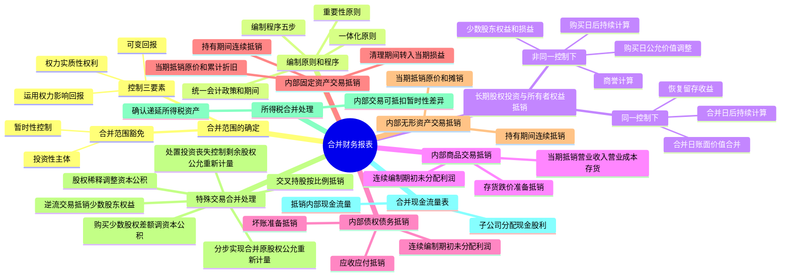

## 📍 章节定位

| 项目 | 信息 |
|------|------|
| **所属科目** | 📒 会计 |
| **难度等级** | ⭐⭐⭐⭐⭐ |
| **历年分值** | 10-12分 |
| **建议学时** | 15-20h |

## 📝 考情分析

本章是会计科目的最大重难点章节，历年分值约 10-12 分，是考试中必考的综合题章节，几乎每年都以综合题形式出现，涉及大量的抵销分录和调整分录。命题热点集中在：

1. **合并范围的确定**：控制的三要素（权力、可变回报、运用权力影响回报金额），权力的判断（实质性权利 vs 保护性权利、表决权、潜在表决权），可变回报的判断。
2. **长期股权投资与所有者权益的合并处理**：同一控制下取得子公司合并日和合并日后合并报表的编制（按账面价值合并、恢复留存收益、抵销长期股权投资与所有者权益），非同一控制下取得子公司购买日和购买日后合并报表的编制（按公允价值调整、抵销长期股权投资与所有者权益、商誉的计算）。
3. **内部商品交易的合并处理**：当期内部购销的抵销（借记营业收入，贷记营业成本；未实现内部销售利润借记营业成本，贷记存货），连续编制合并报表时的抵销（借记未分配利润——年初，贷记营业成本），存货跌价准备的合并处理。
4. **内部债权债务的合并处理**：内部应收应付的抵销，内部应收账款坏账准备的抵销（借记应收账款——坏账准备，贷记信用减值损失；连续编制时借记应收账款——坏账准备，贷记未分配利润——年初）。
5. **内部固定资产交易的合并处理**：当期购入固定资产的抵销（借记资产处置收益/营业收入，贷记固定资产——原价；多提折旧借记固定资产——累计折旧，贷记管理费用等），持有期间的抵销，清理期间的抵销。
6. **特殊交易在合并财务报表中的会计处理**：母公司购买子公司少数股东股权（差额调整资本公积），分步实现企业合并（原股权按公允价值重新计量），处置对子公司投资丧失控制权（剩余股权按公允价值重新计量），交叉持股，逆流交易。
7. **所得税会计相关的合并处理**：内部交易产生的可抵扣暂时性差异确认递延所得税资产。

考生需重点掌握：控制三要素（投资方拥有对被投资方的**权力**、通过参与被投资方相关活动享有**可变回报**、有能力运用权力**影响回报金额**）；非同一控制下购买日子公司可辨认资产负债按**公允价值**调整，合并成本 > 可辨认净资产公允价值份额确认**商誉**；内部商品交易未实现利润的抵销（借营业收入贷营业成本，借营业成本贷存货）；连续编制时先抵销期初未分配利润；内部固定资产交易当期抵销多提折旧，清理期间将未分配利润——年初转入资产处置收益或营业外收支；母公司购买少数股权的差额调整资本公积，不确认损益；处置部分投资丧失控制权的，剩余股权按公允价值重新计量，差额计入投资收益。

## 🧠 知识框架



## 📖 核心精讲

### 一、合并范围的确定

合并财务报表的合并范围应当以**控制**为基础予以确定。

#### （一）控制的三要素

投资方对被投资方拥有控制，需同时满足下列**三个要素**：

| 要素 | 内容 |
|------|------|
| **1. 权力** | 投资方拥有对被投资方的权力，即投资方主导被投资方相关活动的现时能力 |
| **2. 可变回报** | 投资方通过参与被投资方相关活动而享有可变回报（回报的金额随被投资方业绩变动） |
| **3. 运用权力影响回报** | 投资方有能力运用其对被投资方的权力影响其回报金额 |

#### （二）权力的判断

**1. 实质性权利 vs 保护性权利**：权力源于**实质性权利**（持有人有实际能力行使的可执行权利），而非保护性权利（仅保护持有者权益，不赋予主导权）。

**2. 表决权**：
- 持有半数以上表决权 → 通常拥有权力（除非有其他安排）
- 持有半数或以下表决权 → 综合考虑表决权规模、潜在表决权、合同安排等

**3. 相关活动**：对被投资方回报产生重大影响的活动，如商品销售、资产管理、研发活动、资本结构决策等。

#### （三）合并范围的豁免

- **投资性主体**：如果母公司是投资性主体，只将为投资性主体提供相关服务的子公司纳入合并范围，其他子公司按公允价值计量。
- **暂时性控制**：如果母公司计划在短期内出售子公司，可能不纳入合并范围。

### 二、合并财务报表的编制

#### （一）编制原则

1. **一体化原则**：将母公司和所有子公司视为一个整体。
2. **重要性原则**：不重要的项目可抵销也可不抵销。
3. 统一**会计政策和会计期间**。

#### （二）编制程序

1. 统一会计政策和会计期间；
2. 编制合并工作底稿；
3. 将母公司、子公司个别报表数据过入工作底稿；
4. 编制调整分录和抵销分录；
5. 计算合并金额。

### 三、长期股权投资与所有者权益的合并处理

#### （一）同一控制下取得子公司

**1. 合并日合并报表**

- 子公司资产、负债按在**最终控制方合并财务报表中的账面价值**并入。
- 抵销母公司长期股权投资与子公司所有者权益：

```
借：股本（子公司）
    资本公积（子公司）
    盈余公积（子公司）
    未分配利润（子公司）
    贷：长期股权投资（母公司）
        少数股东权益（子公司所有者权益 × 少数股东持股比例）
```

- **恢复留存收益**：将子公司合并前实现的留存收益中归属于母公司的部分自资本公积转入：

```
借：资本公积（以资本公积贷方余额为限）
    贷：盈余公积（子公司 × 母公司持股比例）
        未分配利润（子公司 × 母公司持股比例）
```

**2. 合并日后合并报表**

子公司资产、负债按自合并日开始**持续计算**的价值反映。抵销分录同上，但需将子公司所有者权益项目调整为合并日开始持续计算的金额。

#### （二）非同一控制下取得子公司

**1. 购买日合并报表**

- 将子公司可辨认资产、负债按**购买日公允价值**调整：

```
借：存货（公允价值 - 账面价值）
    固定资产（公允价值 - 账面价值）
    无形资产（公允价值 - 账面价值）
    贷：资本公积（调整总额）
```

- 抵销母公司长期股权投资与子公司所有者权益（按调整后公允价值）：

```
借：股本（子公司）
    资本公积（子公司，含公允价值调整）
    盈余公积（子公司）
    未分配利润（子公司）
    商誉（合并成本 > 可辨认净资产公允价值份额的差额）
    贷：长期股权投资（母公司）
        少数股东权益（调整后可辨认净资产公允价值 × 少数股东持股比例）
```

> 若合并成本 < 可辨认净资产公允价值份额，差额计入营业外收入（购买日合并利润表），不计入商誉。

**2. 购买日后合并报表**

- 子公司可辨认资产、负债按购买日公允价值**持续计算**的价值反映。
- 需调整购买日公允价值与账面价值差额的摊销（如固定资产按公允价值计提折旧）：

```
借：固定资产（公允价值差额）
    贷：资本公积
借：管理费用等（公允价值差额的摊销）
    贷：固定资产——累计折旧
```

- 抵销母公司长期股权投资（权益法调整后）与子公司所有者权益：

**权益法调整**（母公司个别报表采用成本法，合并报表需调整为权益法）：

```
借：长期股权投资（子公司净利润 × 母公司持股比例 - 公允价值差额摊销）
    贷：投资收益
借：长期股权投资（子公司其他综合收益 × 母公司持股比例）
    贷：其他综合收益
```

**抵销分录**：

```
借：股本（子公司）
    资本公积（子公司，含购买日公允价值调整）
    盈余公积（子公司）
    未分配利润——年末（子公司）
    商誉
    贷：长期股权投资（权益法调整后金额）
        少数股东权益（调整后可辨认净资产 × 少数股东持股比例）
```

**少数股东损益**：

```
借：少数股东损益（子公司净利润 × 少数股东持股比例）
    贷：未分配利润——年末
```

### 四、内部商品交易的合并处理

#### （一）当期内部购销的抵销

**1. 全部实现对外销售**：

```
借：营业收入（内部售价）
    贷：营业成本（内部售价）
```

**2. 部分实现对外销售、部分形成存货**：

```
借：营业收入（内部售价）
    贷：营业成本（内部售价）
借：营业成本（期末存货中未实现内部销售利润）
    贷：存货（期末存货中未实现内部销售利润）
```

> 未实现内部销售利润 = 期末内部购入存货 × 毛利率

#### （二）连续编制合并报表时的抵销

```
借：未分配利润——年初（期初存货中未实现内部销售利润）
    贷：营业成本
```

然后按当期内部购销进行抵销（同上）。

#### （三）存货跌价准备的合并处理

- 当期抵销（多提的跌价准备）：

```
借：存货——存货跌价准备
    贷：资产减值损失
```

- 连续编制时：

```
借：存货——存货跌价准备
    贷：未分配利润——年初
```

### 五、内部债权债务的合并处理

#### （一）内部应收应付的抵销

```
借：应付账款
    贷：应收账款
```

#### （二）内部应收账款坏账准备的抵销

**1. 当期抵销**：

```
借：应收账款——坏账准备
    贷：信用减值损失
```

**2. 连续编制时**：

```
借：应收账款——坏账准备
    贷：未分配利润——年初
```

然后抵销当期冲回或补提的部分。

### 六、内部固定资产交易的合并处理

#### （一）当期购入并作为固定资产使用

**1. 抵销原值中未实现内部销售利润**：

```
借：资产处置收益（或营业收入）
    贷：固定资产——原价（未实现内部销售利润）
```

**2. 抵销当期多提的折旧**：

```
借：固定资产——累计折旧（未实现利润 / 预计使用年限 × 当年计提月数/12）
    贷：管理费用等
```

#### （二）持有期间（第二年至清理前）

```
借：未分配利润——年初（原未实现内部销售利润）
    贷：固定资产——原价
借：固定资产——累计折旧（以前年度累计多提折旧）
    贷：未分配利润——年初
借：固定资产——累计折旧（当年多提折旧）
    贷：管理费用等
```

#### （三）清理期间

**1. 正常清理（期满清理）**：

```
借：未分配利润——年初（当年多提折旧）
    贷：管理费用等
```

> 固定资产清理后，原值和累计折旧均已转出，只需抵销当年多提折旧。

**2. 提前清理**：

```
借：未分配利润——年初（未实现利润 - 以前年度已抵销折旧）
    贷：资产处置收益（或营业外收入）
借：资产处置收益（或营业外收入）（当年多提折旧）
    贷：管理费用等
```

### 七、内部无形资产交易的合并处理

与固定资产交易类似，但无形资产摊销通常计入管理费用，且无残值。

```
借：资产处置收益（未实现内部销售利润）
    贷：无形资产——原价
借：无形资产——累计摊销（当年多摊销额）
    贷：管理费用
```

连续编制时比照固定资产处理。

### 八、特殊交易在合并财务报表中的会计处理

#### （一）母公司购买子公司少数股东股权

- **个别报表**：按长期股权投资准则确认入账价值。
- **合并报表**：子公司资产、负债以购买日或合并日开始持续计算的金额反映。支付的对价与按新增持股比例计算应享有子公司持续计算净资产份额的差额，**调整资本公积**（资本溢价或股本溢价），不足冲减的依次冲减盈余公积和未分配利润。

> **不确认损益**，与母公司所有者交易。

#### （二）分步实现企业合并

不属于"一揽子交易"的，在合并报表中：
- 购买日之前持有的股权按**购买日公允价值重新计量**。
- 原股权为 FVOCI 权益工具的，差额计入**留存收益**，原其他综合收益转入留存收益。
- 原股权为 FVTPL 或权益法核算的，差额计入**投资收益**，权益法下的其他综合收益按被投资方直接处置相关资产相同基础处理。

#### （三）处置对子公司投资丧失控制权

- **个别报表**：剩余股权按**账面价值**作为长期股权投资（或金融资产）初始投资成本。
- **合并报表**：剩余股权按**丧失控制权日公允价值重新计量**，差额计入**投资收益**。与原股权有关的其他综合收益等应当在丧失控制权时转为当期投资收益（可转损益的）或留存收益（不可转损益的）。

#### （四）因子公司增资导致母公司股权稀释

- 如果母公司仍保持控制：按增资前后持股比例计算应享有子公司净资产份额的差额，**调整资本公积**，不足冲减的调整留存收益。
- 如果母公司丧失控制：参照处置投资丧失控制权处理。

#### （五）交叉持股

子公司持有母公司股权的，在合并报表中应将子公司持有的母公司股权作为**库存股**处理。

#### （六）逆流交易

母公司与子公司之间的逆流交易（子公司向母公司销售），未实现内部销售利润在合并报表中应按**母公司持股比例**抵销归属于母公司的部分，同时调整少数股东权益和少数股东损益。

### 九、所得税会计相关的合并处理

内部交易抵销后，存货、固定资产等的账面价值（合并角度）与计税基础（个别报表角度）产生暂时性差异，应确认**递延所得税资产**或递延所得税负债。

```
借：递延所得税资产（未实现内部销售利润 × 所得税税率）
    贷：所得税费用
```

连续编制时：

```
借：递延所得税资产
    贷：未分配利润——年初
```

### 十、合并现金流量表的编制

合并现金流量表以母公司和子公司的个别现金流量表为基础，抵销内部交易产生的现金流量。

主要抵销项目：
- 内部购销商品产生的现金流量（借记经营活动现金流量——购买商品，贷记经营活动现金流量——销售商品）
- 内部债权债务产生的现金流量
- 子公司分配现金股利给母公司的部分
- 内部购销固定资产等产生的现金流量

## 💡 典型例题

**【例题 1】（基础题，单选题）**

下列关于合并财务报表合并范围的表述中，正确的是（　　）。
A. 母公司应当将其所有子公司纳入合并范围，无论控制是否暂时性
B. 投资方拥有对被投资方的权力是指投资方实际行使了主导权
C. 投资性主体应将其所有子公司纳入合并范围
D. 控制的三要素包括权力、可变回报和运用权力影响回报金额

**答案**：D

**解析**：A 错误，暂时性控制的子公司可能不纳入合并范围；B 错误，权力是主导相关活动的现时能力，不要求实际行使；C 错误，投资性主体只将为投资性主体提供相关服务的子公司纳入合并范围，其他子公司按公允价值计量；D 正确，控制三要素为权力、可变回报、运用权力影响回报金额。

**【例题 2】（进阶题，单选题）**

母公司当期以 2 000 万元自少数股东处购买子公司 15% 股权，子公司自购买日开始持续计算的净资产账面价值为 10 000 万元。母公司在合并报表中应（　　）。
A. 确认投资收益 500 万元
B. 确认商誉 500 万元
C. 调减资本公积 500 万元
D. 确认营业外收入 500 万元

**答案**：C

**解析**：母公司购买少数股东股权的，支付对价 2 000 万元与按新增持股比例计算应享有子公司持续计算净资产份额 1 500 万元（10 000 × 15%）的差额 500 万元，应当调整合并财务报表中的资本公积（资本溢价或股本溢价），不确认损益，不确认商誉。

**【例题 3】（计算题，内部商品交易抵销）**

甲公司为母公司，乙公司为子公司。2×24 年甲公司向乙公司销售商品，售价 500 万元（不含增值税），成本 400 万元。至 2×24 年末，该批商品有 60% 已对外销售，40% 仍为乙公司存货。

要求：编制 2×24 年合并报表中的抵销分录。

**答案**：

（1）抵销当期内部销售收入：
```
借：营业收入                  5 000 000
    贷：营业成本              5 000 000
```

（2）抵销期末存货中未实现内部销售利润：
- 期末存货 = 500 × 40% = 200（万元）
- 未实现内部销售利润 = 200 × (500 − 400) / 500 = 200 × 20% = 40（万元）

```
借：营业成本                  400 000
    贷：存货                  400 000
```

**解析**：先全额抵销内部销售收入和销售成本，再抵销期末存货中包含的未实现内部销售利润。未实现利润 = 期末存货金额 × 毛利率。

**【例题 4】（计算题，内部固定资产交易抵销）**

甲公司为母公司，乙公司为子公司。2×23 年 6 月 30 日，甲公司将一台账面价值 300 万元的设备以 400 万元出售给乙公司作为管理用固定资产，预计使用年限 5 年，直线法折旧，无残值。

要求：编制 2×23 年和 2×24 年合并报表中的抵销分录。

**答案**：

**2×23 年（交易当年）**：

（1）抵销固定资产原价中未实现内部销售利润：
```
借：资产处置收益              1 000 000
    贷：固定资产——原价      1 000 000
```

（2）抵销当年多提折旧（半年）：
- 年多提折旧 = 100 / 5 × 6/12 = 10（万元）
```
借：固定资产——累计折旧        100 000
    贷：管理费用              100 000
```

**2×24 年（次年）**：

```
① 抵销原价中未实现利润：
借：未分配利润——年初        1 000 000
    贷：固定资产——原价      1 000 000

② 抵销以前年度多提折旧：
借：固定资产——累计折旧        100 000
    贷：未分配利润——年初     100 000

③ 抵销当年多提折旧：
借：固定资产——累计折旧        200 000
    贷：管理费用              200 000
```

**解析**：内部固定资产交易当年抵销原价中未实现利润和当年多提折旧。连续编制时，将未实现利润转入未分配利润——年初，以前年度多提折旧转入未分配利润——年初，当年多提折旧抵销管理费用。

**【例题 5】（综合题，非同一控制下合并日后抵销）**

甲公司 2×24 年 1 月 1 日以 6 000 万元取得乙公司 80% 股权（非同一控制下企业合并）。购买日乙公司可辨认净资产公允价值为 7 000 万元，账面价值为 6 000 万元，差异为固定资产公允价值高于账面价值 1 000 万元（剩余使用年限 10 年，直线法折旧）。2×24 年乙公司实现净利润 1 200 万元（按账面价值计算），未分配现金股利，未发生其他综合收益。甲乙公司之前无关联方关系。

要求：计算 2×24 年末合并报表中的商誉、少数股东权益和少数股东损益。

**答案**：

（1）**商誉** = 合并成本 − 可辨认净资产公允价值份额 = 6 000 − 7 000 × 80% = 6 000 − 5 600 = **400（万元）**

（2）**调整后净利润**（按公允价值持续计算）：
= 账面净利润 − 公允价值差额摊销 = 1 200 − 1 000/10 = 1 200 − 100 = 1 100（万元）

（3）**少数股东损益** = 调整后净利润 × 少数股东持股比例 = 1 100 × 20% = **220（万元）**

（4）**少数股东权益**（2×24 年末）：
= （购买日可辨认净资产公允价值 + 调整后净利润）× 少数股东持股比例
= （7 000 + 1 100）× 20% = 8 100 × 20% = **1 620（万元）**

**解析**：非同一控制下取得子公司，少数股东权益和少数股东损益应按调整后（按购买日公允价值持续计算）的金额计算。调整后净利润 = 账面净利润 − 公允价值差额的摊销。商誉 = 合并成本 − 可辨认净资产公允价值份额。

**【例题 6】（综合题，处置投资丧失控制权）**

甲公司持有乙公司 80% 股权。2×24 年 6 月 30 日，甲公司出售所持乙公司 60% 股权，售价 5 400 万元，丧失控制权，剩余 20% 股权公允价值为 1 800 万元，改按权益法核算。出售日乙公司可辨认净资产公允价值为 8 000 万元。甲公司原对乙公司长期股权投资账面价值为 6 000 万元。

要求：计算合并报表中应确认的投资收益。

**答案**：

合并报表中应确认的投资收益 = 处置股权对价 + 剩余股权公允价值 − （子公司可辨认净资产公允价值 × 原持股比例 + 商誉）

由于丧失控制权，剩余股权按丧失控制权日公允价值重新计量：

- 处置股权对价 = 5 400（万元）
- 剩余股权公允价值 = 1 800（万元）
- 合计 = 5 400 + 1 800 = 7 200（万元）
- 原持股比例（80%）对应的净资产份额 = 8 000 × 80% = 6 400（万元）
- 合并报表投资收益 = 7 200 − 6 400 = **800（万元）**

**解析**：处置部分投资丧失控制权的，在合并报表中，剩余股权按丧失控制权日公允价值重新计量，处置对价与剩余股权公允价值之和与原持股比例对应的子公司净资产份额之间的差额计入投资收益。

## 🎯 记忆口诀

- **控制三要素**："权力、回报、能影响"——拥有权力、享有可变回报、有能力运用权力影响回报金额。
- **合并范围**："以控制为基础"——纳入合并范围的核心是控制，不是持股比例。
- **非同一控制下合并日**："公允调整、确认商誉、抵销投资权益"——按公允价值调整子公司资产负债，合并成本大于份额确认商誉，抵销长期股权投资与所有者权益。
- **内部商品交易**："全额抵收入成本，再抵存货未实现"——先全额抵销营业收入和营业成本，再抵销期末存货中未实现利润。
- **连续编制**："期初未分配利润接上年"——连续编制合并报表时，上年影响的抵销通过未分配利润——年初恢复。
- **内部固定资产**："当年抵原价抵折旧，连年转年初，清理转损益"——当年抵销原价和折旧，连续编制转入期初未分配利润，清理期间转入当期损益。
- **购买少数股权**："差额调资本公积，不确认损益"——支付对价与享有持续计算净资产份额的差额调整资本公积。
- **丧失控制权**："剩余股权按公允重新计量，差额入投资收益"——剩余股权按丧失控制权日公允价值重新计量。
- **少数股东损益**："调整后净利润乘少数比例"——按公允价值调整后的净利润乘以少数股东持股比例。
- **递延所得税**："未实现利润乘税率确认递延资产"——内部交易未实现利润产生的可抵扣暂时性差异确认递延所得税资产。

## ✅ 同步练习

1. （基础题）控制三要素的判断，权力的来源（表决权、潜在表决权），实质性权利与保护性权利的区分，合并范围的确定和豁免（投资性主体）。提示：参见《必刷 550 题》合并财务报表基础题。
2. （进阶题）同一控制下取得子公司合并日和合并日后合并报表的编制，恢复留存收益的处理，比较报表的追溯调整。提示：参见《必刷 550 题》合并财务报表进阶题。
3. （易错题）非同一控制下取得子公司购买日合并报表的编制，公允价值调整，商誉的计算，少数股东权益和少数股东损益的计算。提示：参见《必刷 550 题》合并财务报表易错题。
4. （计算题）内部商品交易的抵销（当期和连续编制），存货跌价准备的合并处理，内部债权债务及坏账准备的抵销。提示：参见《必刷 550 题》合并财务报表计算题。
5. （真题改编）内部固定资产交易的抵销（当期、持有期间、清理期间），内部无形资产交易的抵销。提示：参见历年真题综合题。
6. （综合题）母公司购买子公司少数股东股权（差额调资本公积），分步实现企业合并（原股权公允价值重新计量），处置投资丧失控制权（剩余股权公允价值重新计量，差额入投资收益）。提示：参见历年真题综合题。
7. 综合复习因子公司增资导致股权稀释的处理，交叉持股（库存股处理），逆流交易（按比例调整少数股东权益），所得税会计相关的合并处理（递延所得税资产确认），合并现金流量表的编制。
