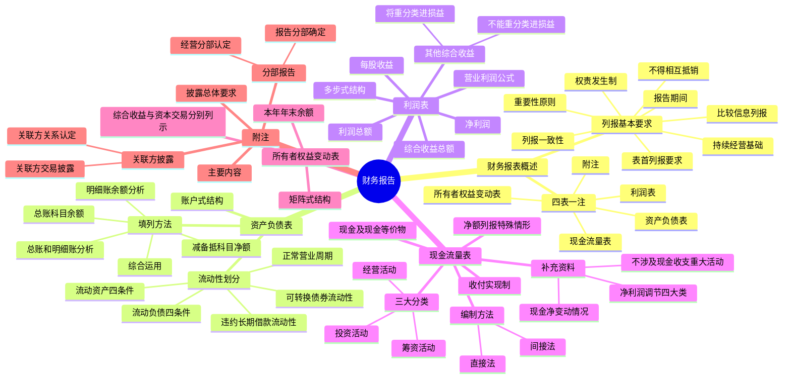

## 1. 章节定位

| 项目 | 信息 |
|------|------|
| 所属科目 | 会计 |
| 难度等级 | 4 |
| 历年分值 | 6-10 分 |
| 建议学时 | 8-10 小时 |
| 知识关联章节 | 第30号 财务报表列报、第31号 现金流量表、第35号 分部报告、第36号 关联方披露、第28章 会计政策变更与差错更正、第27章 合并财务报表 |

## 2. 考情分析

本章是会计科目的重要章节，历年分值约 6-10 分，几乎每年必考主观题，常以综合题形式出现，要求考生编制资产负债表、利润表或现金流量表的相关项目，并常与会计政策变更、差错更正、资产负债表日后事项等章节联动考查。

**命题规律**：本章内容覆盖面广，主观题常以业务情境为载体，要求考生完成报表项目的填列、现金流量的分类与计算。客观题则集中在列报要求、流动性划分、现金流量分类、报表项目填列方法等方面。

**高频考点分布**：

1. **财务报表列报的基本要求**：持续经营基础、权责发生制、列报一致性、重要性原则、相互抵销的限制、比较信息的列报。
2. **资产负债表的流动性与非流动性划分**：流动资产与非流动资产、流动负债与非流动负债的判断条件；可转换债券负债成分的流动性划分；长期借款违反合同条款时的流动性划分。
3. **资产负债表项目的填列方法**：根据总账科目余额填列、根据明细账科目余额分析计算填列、根据总账和明细账余额分析计算填列、根据科目余额减去备抵科目余额后的净额填列。
4. **利润表的结构与内容**：营业利润的计算公式、其他综合收益的分类（不能重分类进损益 vs 将重分类进损益）、综合收益总额。
5. **现金流量表的编制**：直接法与间接法、经营活动/投资活动/筹资活动现金流量的分类、现金及现金等价物的定义、现金流量净额列报的特殊情形。
6. **现金流量表补充资料**：将净利润调节为经营活动现金流量的四大类调整项目。
7. **所有者权益变动表**：矩阵式结构、综合收益与所有者资本交易分别列示。
8. **附注披露**：分部报告的经营分部认定、关联方关系的认定。

**联动考查方式**：
- 与会计政策变更、差错更正结合：调整"上年年末余额"栏；
- 与资产负债表日后事项结合：日后调整事项对报表项目的影响；
- 与合并财务报表结合：合并现金流量表的编制。

**备考建议**：
- 牢记现金流量表的三大分类及各类的具体项目，特别是容易混淆的项目（如银行承兑汇票贴现、定期存单质押等）；
- 掌握直接法和间接法的核心差异：直接法以营业收入为起算点，间接法以净利润为起算点；
- 理解资产负债表流动性划分的原则：以资产负债表日有效的合同安排为基础，不考虑资产负债表日后的再融资或展期；
- 掌握其他综合收益的两类分类及其具体项目。

## 3. 知识框架

## 4. 核心精讲

### 4.1 财务报表概述

#### 4.1.1 财务报表的定义和构成

**财务报告**是指企业对外提供的反映企业某一特定日期的财务状况和某一会计期间的经营成果、现金流量等会计信息的文件。财务报告包括财务报表和其他应当在财务报告中披露的相关信息和资料。

**财务报表**是对企业财务状况、经营成果和现金流量的结构性表述。财务报表至少应当包括下列组成部分（"**四表一注**"）：
1. 资产负债表；
2. 利润表；
3. 现金流量表；
4. 所有者权益（或股东权益）变动表；
5. 附注。

这些组成部分具有同等的重要程度。

**财务报表的分类**：
- 按编报期间不同：中期财务报表（月报、季报、半年报）和年度财务报表；
- 按编报主体不同：个别财务报表和合并财务报表。

#### 4.1.2 财务报表列报的基本要求

**（1）依据各项会计准则确认和计量的结果编制财务报表**

企业应当根据实际发生的交易和事项，遵循《企业会计准则——基本准则》、各项具体会计准则的规定进行确认和计量，并在此基础上编制财务报表。企业不应以在附注中披露代替对交易和事项的确认和计量。

**（2）列报基础**

企业应当以**持续经营**为基础编制财务报表。企业管理层应当全面评估企业的持续经营能力，评估涵盖的期间应包含企业自资产负债表日起至少 12 个月。

企业存在以下情况之一的，通常表明企业处于非持续经营状态：
1. 企业已在当期进行清算或停止营业；
2. 企业已经正式决定在下一个会计期间进行清算或停止营业；
3. 企业已确定在当期或下一个会计期间没有其他可供选择的方案而将被迫进行清算或停止营业。

企业处于非持续经营状态时，应当采用其他基础编制财务报表（如破产资产清算净值计量），并在附注中声明财务报表未以持续经营为基础列报。

**（3）权责发生制**

除现金流量表按照收付实现制编制外，企业应当按照权责发生制编制其他财务报表。

**（4）列报的一致性**

财务报表项目的列报应当在各个会计期间保持一致，不得随意变更。在以下情况下可以改变：①会计准则要求改变；②企业经营业务的性质发生重大变化或对企业经营影响较大的交易或事项发生后，变更能够提供更可靠、更相关的会计信息。

**（5）依据重要性原则单独或汇总列报项目**

重要性是指在合理预期下，如果财务报表某项目的省略或错报会影响使用者据此作出经济决策的，该项目就具有重要性。

- 性质或功能不同的项目，一般应当单独列报，不具有重要性的可以汇总列报；
- 性质或功能类似的项目，一般可以汇总列报，具有重要性的类别应当单独列报；
- 项目单独列报的原则不仅适用于报表，还适用于附注。

**（6）财务报表项目金额间的相互抵销**

财务报表项目应当以总额列报，资产和负债、收入和费用、直接计入当期利润的利得和损失项目的金额不能相互抵销，但企业会计准则另有规定的除外。

下列三种情况**不属于抵销**：
1. 一组类似交易形成的利得和损失以净额列示（如汇兑损益以净额列报）；
2. 资产或负债项目按扣除备抵项目后的净额列示（如资产减去减值准备后的净额）；
3. 非日常活动产生的利得和损失，以同一交易形成的收益扣减相关费用后的净额列示。

**（7）比较信息的列报**

企业在列报当期财务报表时，至少应当提供所有列报项目上一个可比会计期间的比较数据。当企业追溯应用会计政策或追溯重述，或者重新分类财务报表项目时，应当至少列报三期资产负债表、两期其他各报表及相关附注。

**（8）财务报表表首的列报要求**

企业在财务报表的表首应当至少披露：①编报企业的名称；②资产负债表日或报表涵盖的会计期间；③货币名称和单位；④合并财务报表的应当予以标明。

**（9）报告期间**

企业至少应当按年编制财务报表。年度财务报表涵盖的期间短于一年的，应当披露实际涵盖期间及其短于一年的原因。

### 4.2 资产负债表

#### 4.2.1 资产负债表的内容及结构

**资产负债表**是指反映企业在某一特定日期财务状况的会计报表，反映企业在某一特定日期所拥有或控制的经济资源、所承担的现时义务和所有者对净资产的要求权。

在我国，资产负债表采用**账户式结构**，报表分为左右两方：左方列示资产各项目，右方列示负债和所有者权益各项目。资产负债表左右双方平衡，"资产 = 负债 + 所有者权益"。各项目再分为"期末余额"和"上年年末余额"两栏分别填列。

#### 4.2.2 资产和负债按流动性列报

资产负债表上资产和负债应当按照流动性分别分为流动资产和非流动资产、流动负债和非流动负债列示。

**（1）流动资产的判断条件**

资产满足下列条件**之一**的，应当归类为流动资产：
1. 预计在一个正常营业周期中变现、出售或耗用（主要包括存货、应收票据、应收账款等）；
2. 主要为交易目的而持有；
3. 预计在资产负债表日起一年内（含一年）变现；
4. 自资产负债表日起一年内，交换其他资产或清偿负债的能力不受限制的现金或现金等价物。

**正常营业周期**是指企业从购买用于加工的资产起至实现现金或现金等价物的期间。正常营业周期通常短于一年，但因生产周期较长等导致正常营业周期长于一年的，相关资产仍应当划分为流动资产（如房地产开发企业开发用于出售的房地产开发产品、造船企业制造的用于出售的大型船只等）。正常营业周期不能确定时，应当以一年（12 个月）作为正常营业周期。

**（2）流动负债的判断条件**

负债满足下列条件**之一**的，应当归类为流动负债：
1. 预计在一个正常营业周期中清偿；
2. 主要为交易目的而持有；
3. 自资产负债表日起一年内到期应予以清偿；
4. 企业在资产负债表日没有将负债清偿推迟至资产负债表日后一年以上的实质性权利。

**关键原则**：企业在资产负债表上对债务流动和非流动的划分，应当反映在资产负债表日有效的合同安排上，考虑在资产负债表日起一年内企业是否必须无条件清偿，而资产负债表日之后的再融资、展期或提供宽限期等行为，与资产负债表日判断负债的流动性状况无关。

**特殊情形**：

| 情形 | 流动性划分 |
|------|----------|
| 资产负债表日起一年内到期的负债，企业有意图且有能力自主展期至一年以上 | 非流动负债 |
| 资产负债表日起一年内到期的负债，不能自主展期（即使日后签订重新安排清偿计划协议） | 流动负债 |
| 企业在资产负债表日或之前违反长期借款协议，导致贷款人可随时要求清偿 | 流动负债 |
| 违约后贷款人同意提供资产负债表日后一年以上的宽限期，企业能够改正违约行为且贷款人不能要求随时清偿 | 非流动负债 |
| 可转换债券负债成分（转股选择权分类为权益工具） | 不考虑转股导致的清偿，按原期限划分 |

**经营性负债的特殊处理**：企业正常营业周期中的经营性负债项目（包括应付账款、应付职工薪酬等）即使在资产负债表日后超过一年才予以清偿的，仍应划分为流动负债。

#### 4.2.3 资产负债表的填列方法

**"期末余额"栏的填列方法**主要有以下五种：

| 填列方法 | 典型项目 |
|---------|---------|
| 根据总账科目的余额填列 | 短期借款、应付票据、实收资本、资本公积、盈余公积等；货币资金（根据"库存现金""银行存款""其他货币资金"等总账科目余额合计数填列） |
| 根据明细账科目的余额分析计算填列 | 应付账款（"应付账款"和"预付账款"科目所属明细科目期末贷方余额合计数）、合同负债、一年内到期的非流动资产/负债等 |
| 根据总账科目和明细账科目的余额分析计算填列 | 长期借款（总账余额扣除一年内到期且无展期权利部分）、租赁负债、其他非流动负债等 |
| 根据有关科目余额减去其备抵科目余额后的净额填列 | 固定资产（余额减累计折旧和减值准备）、无形资产、长期股权投资等 |
| 综合运用上述填列方法分析填列 | 应收票据、应收账款（减坏账准备）、存货（多个科目余额合计减存货跌价准备等）、固定资产等 |

**"上年年末余额"栏的填列方法**：通常根据上年年末有关项目的期末余额填列。如果企业发生了会计政策变更、前期差错更正，应当对"上年年末余额"栏中的有关项目进行相应调整。

### 4.3 利润表

#### 4.3.1 利润表的内容及结构

**利润表**是反映企业在一定会计期间的经营成果的会计报表。在我国，企业利润表采用**多步式结构**，通过对当期的收入、费用、支出项目按性质加以归类，按利润形成的主要环节列示一些中间性利润指标，分步计算当期净损益。

企业对费用列报通常应当按照**功能分类**，即分为从事经营业务发生的成本、管理费用、销售费用、研发费用和财务费用等。同时，还应当在附注中披露按照性质分类的补充资料（如耗用的原材料、职工薪酬费用、折旧费用、摊销费用等）。

#### 4.3.2 利润表的主要项目

利润表主要反映以下内容：

**（1）营业利润**

营业利润 = 营业收入 − 营业成本 − 税金及附加 − 销售费用 − 管理费用 − 研发费用 − 财务费用 + 其他收益 + 投资收益（−投资损失）+ 净敞口套期收益（−净敞口套期损失）+ 公允价值变动收益（−公允价值变动损失）− 信用减值损失 − 资产减值损失 + 资产处置收益（−资产处置损失）

**（2）利润总额**

利润总额 = 营业利润 + 营业外收入 − 营业外支出

**（3）净利润**

净利润 = 利润总额 − 所得税费用

按照经营可持续性具体分为"持续经营净利润"和"终止经营净利润"两项。

**（4）其他综合收益**

其他综合收益分为两类：

| 类别 | 主要项目 |
|------|---------|
| 不能重分类进损益的其他综合收益 | 重新计量设定受益计划变动额、权益法下不能转损益的其他综合收益、其他权益工具投资公允价值变动、企业自身信用风险公允价值变动等 |
| 将重分类进损益的其他综合收益 | 权益法下可转损益的其他综合收益、其他债权投资公允价值变动、金融资产重分类计入其他综合收益的金额、其他债权投资信用减值准备、现金流量套期储备、外币财务报表折算差额、自用房地产或存货转换为公允价值模式计量的投资性房地产在转换日公允价值大于账面价值部分等 |

其他综合收益以扣除相关所得税影响后的净额列报。

**（5）综合收益总额**

综合收益总额 = 净利润 + 其他综合收益税后净额

**（6）每股收益**

包括基本每股收益和稀释每股收益两项指标。

### 4.4 现金流量表

#### 4.4.1 现金流量表的内容及结构

**现金流量表**是指反映企业在一定会计期间现金和现金等价物流入和流出的报表。现金流量表按照**收付实现制**原则编制，将权责发生制下的盈利信息调整为收付实现制下的现金流量信息。

**现金及现金等价物**：
- **现金**是指企业库存现金以及可以随时用于支付的存款；
- **现金等价物**是指企业持有的期限短、流动性强、易于转换为已知金额现金、价值变动风险很小的投资（通常指自购买日起三个月内到期的债券投资）。

企业现金（含现金等价物）形式的转换不会产生现金的流入和流出（如从银行提取现金、用现金购买三个月到期的国库券等）。

现金流量表在结构上将企业一定期间产生的现金流量分为三类：经营活动产生的现金流量、投资活动产生的现金流量和筹资活动产生的现金流量。

#### 4.4.2 现金流量的分类

**（1）经营活动产生的现金流量**

经营活动是指企业投资活动和筹资活动以外的所有交易和事项。对于工商企业而言，主要包括销售商品、提供劳务、购买商品、接受劳务、支付税费等。

主要项目：
- **流入**：销售商品、提供劳务收到的现金；收到的税费返还；收到其他与经营活动有关的现金。
- **流出**：购买商品、接受劳务支付的现金；支付给职工以及为职工支付的现金；支付的各项税费；支付其他与经营活动有关的现金。

**（2）投资活动产生的现金流量**

投资活动是指企业长期资产的购建和不包括在现金等价物范围内的投资及其处置活动。长期资产是指固定资产、无形资产、在建工程、其他资产等持有期限在一年或一个营业周期以上的资产。

主要项目：
- **流入**：收回投资收到的现金；取得投资收益收到的现金；处置固定资产、无形资产和其他长期资产收回的现金净额；处置子公司及其他营业单位收到的现金净额；收到其他与投资活动有关的现金。
- **流出**：购建固定资产、无形资产和其他长期资产支付的现金；投资支付的现金；取得子公司及其他营业单位支付的现金净额；支付其他与投资活动有关的现金。

**（3）筹资活动产生的现金流量**

筹资活动是指导致企业资本及债务规模和构成发生变化的活动。这里所说的资本，既包括实收资本（股本），也包括资本溢价（股本溢价）；这里所说的债务，指对外举债，包括向银行借款、发行债券以及偿还债务等。通常情况下，应付票据、应付账款等属于经营活动，不属于筹资活动。

主要项目：
- **流入**：吸收投资收到的现金；取得借款收到的现金；收到其他与筹资活动有关的现金。
- **流出**：偿还债务支付的现金；分配股利、利润或偿付利息支付的现金；支付其他与筹资活动有关的现金。

**特殊项目的分类**：

| 业务 | 分类 |
|------|------|
| 银行承兑汇票贴现（符合终止确认条件） | 经营活动现金流量 |
| 银行承兑汇票贴现（不符合终止确认条件） | 筹资活动现金流量 |
| 定期存单质押（非金融企业） | 筹资活动现金流量 |
| 定期存单质押（金融企业） | 经营活动现金流量 |
| 自然灾害损失（流动资产损失） | 经营活动现金流量 |
| 自然灾害损失（固定资产损失） | 投资活动现金流量 |
| 捐赠收入和支出 | 经营活动 |

#### 4.4.3 现金流量表的编制方法

编制现金流量表时，列报经营活动现金流量的方法有两种：

| 方法 | 起算点 | 说明 |
|------|-------|------|
| **直接法** | 以利润表中的营业收入为起算点 | 调节与经营活动有关项目的增减变动，计算出经营活动产生的现金流量 |
| **间接法** | 以净利润为起算点 | 将按权责发生制原则确定的净利润调整为现金净流入，并剔除投资和筹资活动对现金流量的影响 |

我国企业会计准则规定企业应当采用**直接法**编报现金流量表，同时要求在附注中提供以净利润为基础调节到经营活动现金流量的信息（即间接法）。

**现金流量列示的原则**：通常情况下，现金流量应当分别按照现金流入和现金流出**总额列报**。但是，下列各项可以按照**净额列报**：
1. 代客户收取或支付的现金以及周转快、金额大、期限短项目的现金流入和现金流出；
2. 金融企业的有关项目（期限较短、流动性强的项目）。

#### 4.4.4 现金流量表补充资料

企业还应在附注中披露将净利润调节为经营活动现金流量、不涉及现金收支的重大投资和筹资活动、现金及现金等价物净变动情况等信息。

**（1）将净利润调节为经营活动现金流量**

采用间接法列报经营活动产生的现金流量时，需要对四大类项目进行调整：
1. 实际没有支付现金的费用（如资产减值准备、折旧、摊销等）；
2. 实际没有收到现金的收益（如公允价值变动收益等）；
3. 不属于经营活动的损益（如投资收益、财务费用等）；
4. 经营性应收应付项目的增减变动。

主要调整项目包括：资产减值准备、信用减值准备、固定资产折旧、无形资产摊销、长期待摊费用摊销、处置固定资产损失、公允价值变动损失、财务费用、投资损失、递延所得税资产减少、递延所得税负债增加、存货的减少、经营性应收项目的减少、经营性应付项目的增加等。

**（2）不涉及现金收支的重大投资和筹资活动**

这些活动虽然不涉及现金收支，但对以后各期的现金流量有重大影响，主要包括：
1. 债务转为资本；
2. 一年内到期的可转换公司债券；
3. 新增使用权资产。

**（3）现金及现金等价物净变动情况**

企业应当披露现金及现金等价物的构成及其在资产负债表中的相应金额，以及企业持有但不能由母公司或集团内其他子公司使用的大额现金及现金等价物金额。

### 4.5 所有者权益变动表

#### 4.5.1 所有者权益变动表的内容及结构

**所有者权益变动表**是指反映构成所有者权益各组成部分当期增减变动情况的报表。所有者权益变动表应当全面反映一定时期所有者权益变动的情况，不仅包括所有者权益总量的增减变动，还包括所有者权益增减变动的重要结构性信息。

所有者权益的来源包括：所有者投入的资本（包括实收资本、其他权益工具、资本溢价等资本公积）、其他综合收益、专项储备、留存收益（包括盈余公积和未分配利润）等。

**矩阵式结构**：所有者权益变动表以矩阵的形式列示：
- 一方面，列示导致所有者权益变动的交易或事项，从所有者权益变动的来源全面反映一定时期所有者权益变动情况；
- 另一方面，按照所有者权益各组成部分（实收资本、其他权益工具、资本公积、其他综合收益、专项储备、盈余公积、未分配利润和库存股等）及其总额列示交易或事项对所有者权益的影响。

**核心要求**：综合收益和与所有者（或股东）的资本交易导致的所有者权益的变动，应当分别列示。与所有者的资本交易，是指与所有者以其所有者身份进行的、导致企业所有者权益变动的交易。

#### 4.5.2 所有者权益变动表的填列方法

所有者权益变动表各项目分为"本年金额"和"上年金额"两栏：

- "上年金额"栏：根据上年度所有者权益变动表"本年金额"栏内所列数字填列。
- "本年金额"栏：一般应根据"实收资本（或股本）""其他权益工具""资本公积""盈余公积""专项储备""其他综合收益""利润分配""库存股""以前年度损益调整"等科目及其明细科目的发生额分析填列。

主要项目包括：上年年末余额、会计政策变更和前期差错更正、本年年初余额、本年增减变动金额（综合收益总额、所有者投入和减少资本、利润分配、所有者权益内部结转、专项储备）、本年年末余额。

### 4.6 财务报表附注披露

#### 4.6.1 附注披露的总体要求

**附注**是对在资产负债表、利润表、现金流量表和所有者权益变动表等报表中列示项目的文字描述或明细资料，以及对未能在这些报表中列示项目的说明等。附注相关信息应当与报表中列示的项目相互参照。

#### 4.6.2 附注的主要内容

附注应当按如下顺序至少披露：
1. 企业的基本情况；
2. 财务报表的编制基础；
3. 遵循企业会计准则的声明；
4. 重要会计政策和会计估计（包括确定依据和计量基础）；
5. 会计政策和会计估计变更以及差错更正的说明；
6. 报表重要项目的说明；
7. 其他需要说明的重要事项（或有和承诺事项、资产负债表日后非调整事项、关联方关系及其交易等）；
8. 有助于财务报表使用者评价企业管理资本的目标、政策及程序的信息。

#### 4.6.3 分部报告

**经营分部**是指企业内同时满足下列条件的组成部分：
1. 该组成部分能够在日常活动中产生收入、发生费用；
2. 企业管理层能够定期评价该组成部分的经营成果，以决定向其配置资源、评价其业绩；
3. 企业能够取得该组成部分的财务状况、经营成果和现金流量等有关会计信息。

企业应当以内部组织结构、管理要求、内部报告制度为依据确定经营分部。具有相似经济特征的两个或两个以上经营分部，在同时满足下列条件时，可以合并为一个经营分部：
1. 各项产品或劳务的性质相同或相似；
2. 生产过程的性质相同或相似；
3. 产品或劳务的客户的类型相同或相似；
4. 销售产品或提供劳务的方式相同或相似；
5. 生产产品或提供劳务受法律、行政法规的影响相同或相似。

#### 4.6.4 关联方披露

**关联方关系的认定**：关联方关系的存在往往是以控制、共同控制或重大影响为前提条件的。在判断是否存在关联方关系时，应当遵循**实质重于形式**的原则。

关联方关系主要包括：
1. 该企业的主要投资者个人及与其关系密切的家庭成员；
2. 该企业的关键管理人员及与其关系密切的家庭成员；
3. 该企业的主要投资者个人、关键管理人员或与其关系密切的家庭成员控制、共同控制或施加重大影响的其他企业；
4. 该企业的母公司、子公司、受同一母公司控制的其他企业、对该企业实施共同控制的投资方、对该企业施加重大影响的投资方等。

**不构成关联方关系**的情形：与该企业发生日常往来的资金提供者、公用事业部门、政府部门和机构，与该企业发生大量交易而存在的经济依存关系的单个客户、供应商、特许商、经销商或代理商等。

## 5. 典型例题

**【例题 1】（可转换债券负债成分的流动性划分）**

2×22 年 12 月 1 日，甲公司发行总面值为 5 000 000 元的可转换债券，每张面值 1 000 元，期限 5 年，到期前债券持有人有权随时按每张面值 1 000 元的债券转换 50 股的转股价格，将持有的债券转换为甲公司的普通股。甲公司按照金融工具列报的规定将该选择权分类为权益工具并将其作为复合金融工具的权益组成部分单独确认。

要求：判断 2×22 年 12 月 31 日该可转换债券的负债成分应分类为流动负债还是非流动负债。

**答案**：

根据规定，负债的条款导致企业在交易对手方选择的情况下通过交付自身权益工具进行清偿的，如果该企业按照金融工具列报准则的规定将上述选择权分类为权益工具并将其作为复合金融工具的权益组成部分单独确认，则该条款不影响该项负债的流动性划分。

因此，甲公司在 2×22 年 12 月 31 日资产负债表日判断该可转换债券的负债成分为流动负债还是非流动负债时，不应考虑转股导致的清偿情况。该可转换债券的负债成分在 2×22 年 12 月 31 日甲公司的资产负债表上应当分类为**非流动负债**（假定不考虑其他因素和情况）。

**解析**：可转换债券的转股选择权分类为权益工具的，判断负债成分流动性时不考虑转股导致的清偿，按原期限（5 年）划分为非流动负债。

**【例题 2】（长期借款的流动性划分）**

甲企业于 2×18 年 7 月 1 日向 A 银行举借五年期的长期借款，借款于 2×23 年 6 月 30 日到期。在 2×22 年 12 月 31 日的资产负债表上，该长期借款应当划分为流动负债（因一年内到期）。假定存在以下情况：

（1）甲企业在 2×22 年 12 月 1 日与 A 银行完成长期再融资或展期；

（2）甲企业在 2×23 年 2 月 1 日（财务报告批准报出日为 2×23 年 3 月 31 日）完成长期再融资或展期；

（3）甲企业与 A 银行的贷款协议规定，甲企业在长期借款到期前可以自行决定是否展期，无须征得债权人同意，并且甲企业打算展期。

要求：分别判断上述三种情况下该借款在 2×22 年 12 月 31 日资产负债表上的流动性分类。

**答案**：

| 情形 | 流动性分类 | 原因 |
|------|----------|------|
| （1）2×22 年 12 月 1 日完成再融资或展期 | 非流动负债 | 在资产负债表日前已完成展期，企业有将清偿义务推迟至一年以上的实质性权利 |
| （2）2×23 年 2 月 1 日完成再融资或展期 | 流动负债 | 资产负债表日后（即使财务报告批准报出日前）的再融资、展期与资产负债表日判断流动性无关 |
| （3）协议规定企业可自主决定展期且打算展期 | 非流动负债 | 企业在资产负债表日有将清偿义务推迟至一年以上的实质性权利 |

**解析**：流动性划分的关键是资产负债表日企业是否拥有将清偿义务推迟至资产负债表日后一年以上的实质性权利。资产负债表日后的再融资、展期或提供宽限期等行为，与资产负债表日判断负债的流动性状况无关。

**【例题 3】（现金流量的分类）**

甲公司为一般工商企业（非金融企业），2×22 年发生以下业务：

（1）销售商品收到现金 500 万元；

（2）购建固定资产支付现金 200 万元；

（3）取得银行借款收到现金 300 万元；

（4）偿还到期债券本金支付现金 150 万元；

（5）支付现金股利 80 万元；

（6）收到被投资单位分派的现金股利 30 万元；

（7）以银行承兑汇票贴现取得现金 100 万元（符合金融资产终止确认条件）；

（8）支付生产工人工资 50 万元；

（9）以现金购买另一公司 5% 股权（无重大影响，分类为交易性金融资产）120 万元；

（10）发行股票筹集资金收到现金 400 万元。

要求：分别判断上述业务在现金流量表中所属的类别（经营活动、投资活动或筹资活动）。

**答案**：

| 业务 | 现金流量分类 | 具体项目 |
|------|------------|---------|
| （1）销售商品收到现金 500 万元 | 经营活动 | 销售商品、提供劳务收到的现金 |
| （2）购建固定资产支付现金 200 万元 | 投资活动 | 购建固定资产、无形资产和其他长期资产支付的现金 |
| （3）取得银行借款收到现金 300 万元 | 筹资活动 | 取得借款收到的现金 |
| （4）偿还到期债券本金支付现金 150 万元 | 筹资活动 | 偿还债务支付的现金 |
| （5）支付现金股利 80 万元 | 筹资活动 | 分配股利、利润或偿付利息支付的现金 |
| （6）收到被投资单位分派的现金股利 30 万元 | 投资活动 | 取得投资收益收到的现金 |
| （7）银行承兑汇票贴现取得现金 100 万元（符合终止确认） | 经营活动 | 销售商品、提供劳务收到的现金 |
| （8）支付生产工人工资 50 万元 | 经营活动 | 购买商品、接受劳务支付的现金（间接计入产品成本）或支付给职工以及为职工支付的现金 |
| （9）购买 5% 股权（交易性金融资产）120 万元 | 投资活动 | 投资支付的现金 |
| （10）发行股票收到现金 400 万元 | 筹资活动 | 吸收投资收到的现金 |

**解析**：现金流量分类的关键要点：
- 销售商品、购买商品、支付职工薪酬、支付税费属于经营活动；
- 购建和处置长期资产、对外投资和收回投资属于投资活动；
- 借款和偿还债务、发行股票和分配股利属于筹资活动；
- 银行承兑汇票贴现符合终止确认条件的属于经营活动，不符合终止确认条件的属于筹资活动；
- 收到的现金股利属于投资活动（取得投资收益收到的现金），支付的现金股利属于筹资活动。

**【例题 4】（将净利润调节为经营活动现金流量）**

甲公司 2×22 年度净利润为 1 000 万元，其他有关资料如下：

（1）计提固定资产折旧 200 万元；

（2）计提资产减值准备 50 万元；

（3）确认公允价值变动收益（交易性金融资产）80 万元；

（4）确认投资收益（权益法核算的长期股权投资）60 万元；

（5）确认财务费用（借款利息）40 万元；

（6）存货期末比期初增加 100 万元；

（7）经营性应收项目期末比期初增加 150 万元；

（8）经营性应付项目期末比期初增加 80 万元；

（9）递延所得税资产增加 30 万元。

要求：采用间接法计算甲公司 2×22 年度经营活动产生的现金流量净额。

**答案**：

经营活动产生的现金流量净额 = 净利润 + 实际没有支付现金的费用 − 实际没有收到现金的收益 − 不属于经营活动的损益 ± 经营性应收应付项目的增减变动

| 调节项目 | 金额（万元） | 调节方向 | 说明 |
|---------|------------|---------|------|
| 净利润 | 1 000 | 起算点 | — |
| 加：固定资产折旧 | 200 | + | 实际没有支付现金的费用 |
| 加：资产减值准备 | 50 | + | 实际没有支付现金的费用 |
| 减：公允价值变动收益 | 80 | − | 实际没有收到现金的收益 |
| 减：投资收益 | 60 | − | 不属于经营活动的损益 |
| 加：财务费用 | 40 | + | 不属于经营活动的损益（筹资活动） |
| 减：存货增加 | 100 | − | 经营性项目的增减变动（增加表示现金流出） |
| 减：经营性应收项目增加 | 150 | − | 经营性项目的增减变动（增加表示现金流出） |
| 加：经营性应付项目增加 | 80 | + | 经营性项目的增减变动（增加表示现金流入） |
| 减：递延所得税资产增加 | 30 | − | 实际没有支付现金的费用（递延所得税资产增加表示所得税费用减少，但未支付现金） |

**计算**：

经营活动产生的现金流量净额 = 1 000 + 200 + 50 − 80 − 60 + 40 − 100 − 150 + 80 − 30 = **950（万元）**

**解析**：间接法将净利润调节为经营活动现金流量时，需要调整四大类项目：
1. 实际没有支付现金的费用（折旧、减值准备等）——调增；
2. 实际没有收到现金的收益（公允价值变动收益等）——调减；
3. 不属于经营活动的损益（投资收益调减、筹资相关的财务费用调增）；
4. 经营性应收应付项目的增减变动（资产增加调减、负债增加调增）。

## 6. 记忆口诀

**财务报表四表一注**："资产负债利润现金流，所有者权益变动加附注"——资产负债表、利润表、现金流量表、所有者权益变动表、附注，具有同等重要程度。

**列报基础**："持续经营为基础，现金流量用收付实现制，其他用权责发生制"。

**不得抵销三例外**："类似交易净额列、备抵项目净额列、非日常活动净额列"——一组类似交易利得损失以净额列示、资产减备抵项目后净额列示、非日常活动收益扣减费用后净额列示，不属于抵销。

**流动资产四条件**："营业周期内变现、交易目的持有、一年内变现、一年内不受限制的现金"——满足之一即为流动资产。

**流动负债四条件**："营业周期内清偿、交易目的持有、一年内到期、无推迟一年以上的实质性权利"——满足之一即为流动负债。

**流动性划分原则**："看资产负债表日的合同安排，不看日后再融资展期"——以资产负债表日有效的合同安排为基础。

**可转换债券负债成分**："转股选择权分类为权益工具的，不考虑转股，按原期限划分"。

**利润表多步式**："营业收入减成本费用加其他收益投资收益加公允价值变动减减值损失加资产处置收益等于营业利润，加营业外收支等于利润总额，减所得税等于净利润，加其他综合收益等于综合收益总额"。

**其他综合收益两类**："不能重分类进损益（设定受益计划、其他权益工具投资、自身信用风险），将重分类进损益（其他债权投资、现金流量套期、外币报表折算差额、投资性房地产转换）"。

**现金流量三分类**："经营是日常、投资是长期资产和投资、筹资是资本和债务"——经营活动（销售商品、购买商品、支付薪酬税费）、投资活动（购建处置长期资产、对外投资）、筹资活动（借款还款、发行股票、分配股利）。

**直接法 vs 间接法**："直接法营业收入为起点，间接法净利润为起点；主表用直接法，附注用间接法"。

**现金等价物**："期限短、流动性强、易于转换已知金额现金、价值变动风险小，三个月内到期"。

**净额列报两情形**："代客户收付周转快金额大期限短，金融企业短期流动性强项目"。

**间接法四大调整**："没支付现金的费用调增，没收到现金的收益调减，不属于经营的损益调整，经营性应收应付增减变动"。

**所有者权益变动表矩阵**："横列权益各组成部分，纵列变动来源交易事项；综合收益与资本交易分别列示"。

**关联方判断**："控制共同控制重大影响为前提，实质重于形式原则"。

**银行承兑汇票贴现**："符合终止确认是经营，不符合终止确认是筹资"。

**现金股利**："收到投资收益是投资活动，支付股利是筹资活动"。
