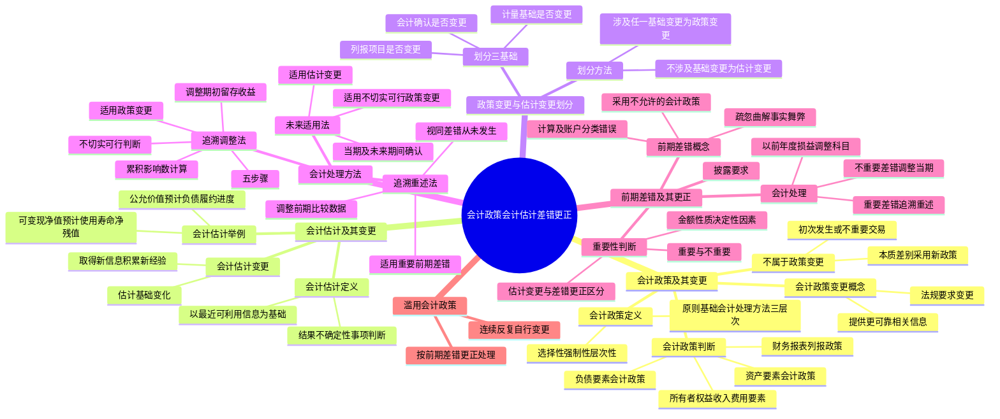

## 1. 章节定位

| 项目 | 信息 |
|------|------|
| 所属科目 | 会计 |
| 难度等级 | 4 |
| 历年分值 | 8-12 分 |
| 建议学时 | 8-10 小时 |
| 知识关联章节 | 第17章 收入（收入政策）、第19章 所得税（递延所得税）、第23章 财务报告（列报调整）、第25章 资产负债表日后事项（差错与日后事项区分）、第27章 合并财务报表（合并政策变更） |

## 2. 考情分析

本章是会计科目的核心重难点章节，历年分值约 8-12 分，几乎每年必考主观题，常以综合题或计算分析题形式出现，并与所得税、资产负债表日后事项、合并财务报表等章节联动考查，是典型的"工具型"章节——其方法论被广泛用于其他章节的差错更正与政策变更处理。

**命题规律**：本章内容政策性强、概念辨析多、会计处理方法有严格的适用条件。主观题常以业务情境为载体，要求考生完成会计政策变更的追溯调整、会计估计变更的未来适用处理、前期差错的追溯重述，并完成相应的报表调整与附注披露。客观题则集中在概念判断、划分基础、方法选择与披露要求。

**高频考点分布**：

1. **会计政策与会计估计的划分**：以会计确认、计量基础、列报项目是否发生变更作为划分基础。涉及确认变更或计量基础变更的属于会计政策变更；仅为取得金额或数值所采用处理方法的变更为会计估计变更。几乎每年客观题必考。
2. **会计政策变更的会计处理**：追溯调整法的五个步骤、累积影响数的计算、调整分录编制、报表调整与附注披露；未来适用法的适用情形（不切实可行时）。
3. **会计估计变更的会计处理**：未来适用法、影响数在当期及未来期间确认、难以区分时作为会计估计变更处理。
4. **前期差错更正**：重要与不重要的区分、追溯重述法的应用、调整分录编制（通过"以前年度损益调整"科目）、报表调整。
5. **会计估计变更与前期差错更正的区分**：以编报前期时是否合理使用当时可取得可靠信息为判断标准。
6. **滥用会计政策**：连续、反复自行变更会计政策视为滥用，按前期差错更正处理。

**联动考查方式**：
- 与所得税章节结合：政策变更与差错更正中递延所得税资产/负债的调整、应交所得税的调整；
- 与资产负债表日后事项结合：报告年度差错在日后期间的处理（作为调整事项）；
- 与收入章节结合：收入确认政策变更（新收入准则执行）的追溯调整；
- 与固定资产、无形资产结合：折旧/摊销方法变更、预计使用寿命变更的区分（估计变更）与弃置费用补计（政策变更）。

**备考建议**：
- 牢记划分三基础：会计确认、计量基础、列报项目，任一变更即为政策变更；
- 区分"追溯调整法"（政策变更）、"追溯重述法"（差错更正）、"未来适用法"（估计变更及不切实可行时）三者适用对象；
- 累积影响数计算时注意所得税影响（递延所得税而非应交所得税，除非税法允许调整）；
- 前期差错更正通过"以前年度损益调整"科目归集，最终转入"利润分配——未分配利润"，并调整盈余公积；
- 切勿将会计估计变更按追溯法处理，这是常见错误。

## 3. 知识框架



## 4. 核心精讲

### 4.1 会计政策的定义及其特点

**会计政策**，是指企业在会计确认、计量和报告中所采用的原则、基础和会计处理方法。其中：

- **原则**，是指按照企业会计准则规定的、适合企业会计要素确认过程中所采用的具体会计原则。例如，企业在客户取得商品控制权时确认收入的规定，属于收入确认的具体会计原则。
- **基础**，是指为了将会计原则应用于交易或者事项而采用的基础，主要是计量基础（即计量属性），包括历史成本、重置成本、可变现净值、现值和公允价值等。
- **会计处理方法**，是指企业按照法律、行政法规或者国家统一的会计制度等规定采用或者选择的、适合本企业的具体会计处理方法。

会计政策具有以下三个特点：

**第一，会计政策的选择性**。会计政策是在允许的会计原则、基础和会计处理方法中作出指定或具体选择。由于企业经济业务的复杂性和多样化，某些经济业务在符合会计原则和计量基础的要求下，可以有多种会计处理方法，即存在不止一种可供选择的会计政策。例如，确定发出存货的实际成本时可以在先进先出法、加权平均法或者个别计价法中进行选择。如果企业发生的某种交易或事项没有具体会计准则规定其相应的会计政策时，企业应当运用《企业会计准则——基本准则》的原则判断并自行确定一项恰当的会计政策。

**第二，会计政策应当在会计准则规定的范围内选择**。在我国，会计准则和会计制度属于行政规章，具有一定的强制性。企业必须在法规所允许的范围内选择适合本企业实际情况的会计政策。

**第三，会计政策的层次性**。会计政策包括原则、基础和会计处理方法三个层次，三者是一个具有逻辑性的、密不可分的整体。例如，《企业会计准则第 13 号——或有事项》规定的预计负债确认条件（现时义务、很可能导致经济利益流出、金额能够可靠计量）是确认预计负债的会计原则；公允价值减去处置费用后的净额作为可收回金额的确定基础，是计量基础；按某一时段内履行的履约义务确认收入，是会计处理方法。

### 4.2 会计政策的判断与举例

对会计政策的判断通常应当从会计要素的确认出发，根据各项资产、负债、所有者权益、收入、费用等会计要素的确认条件、计量属性以及两者相关的处理方法、列报要求等确定相应的会计政策。

**资产要素的会计政策**包括但不限于：存货的取得、发出和期末计量的处理方法（如先进先出法或加权平均法）；长期股权投资的取得及后续计量采用的方法（成本法或权益法）；投资性房地产的后续计量模式（成本模式或公允价值模式）；固定资产的取得确认和计量；无形资产的确认、初始计量和后续计量；金融资产的分类、初始计量和后续计量；非货币性资产交换的计量（公允价值为基础或账面价值为基础）；递延所得税资产的确认和计量等。

**负债要素的会计政策**包括：债务重组的确认和计量、预计负债的确认条件、应付职工薪酬和股份支付的确认和计量、金融负债的分类、借款费用的资本化、递延收益和递延所得税负债的确认和计量等。

**所有者权益、收入、费用要素的会计政策**分别包括权益工具的确认计量、复合金融工具的分拆；各类合同收入的确认与计量方法；营业成本的确认、期间费用的划分、所得税费用的确认和计量等。

除会计要素相关会计政策外，财务报表列报方面所涉及的编制现金流量表的直接法和间接法、合并财务报表合并范围的判断、分部报告中报告分部的确定等，也属于会计政策。企业应当在会计报表附注中披露采用的重要会计政策，不具有重要性的会计政策可以不予披露。

### 4.3 会计政策变更的概念及条件

**会计政策变更**，是指企业对相同的交易或者事项由原来采用的会计政策改用另一会计政策的行为。为保证会计信息的可比性，企业采用的会计政策在每一会计期间和前后各期应当保持一致，不得随意变更。但是，满足下列条件**之一**的，企业可以变更会计政策：

**（1）法律、行政法规或者国家统一的会计制度等要求变更**。例如，《企业会计准则第 1 号——存货》对发出存货实际成本的计价取消了后进先出法；《企业会计准则第 8 号——资产减值》规定已计提的固定资产、无形资产减值准备不允许转回；2017 年修订的《企业会计准则第 14 号——收入》规定企业应在客户取得相关商品控制权时确认收入等，均要求企业变更原有会计政策。

**（2）会计政策变更能够提供更可靠、更相关的会计信息**。由于经济环境、客观情况的改变，使企业原采用的会计政策所提供的会计信息不能恰当地反映企业的财务状况、经营成果和现金流量。例如，企业一直采用成本模式对投资性房地产进行后续计量，如果企业能够从房地产交易市场上持续地取得同类或类似房地产的市场价格，从而能够对投资性房地产的公允价值作出合理估计，此时可以将后续计量方法由成本模式变更为公允价值模式。

企业因满足第（2）项条件变更会计政策时，必须有充分、合理的证据表明其变更的合理性，并经股东会或董事会、经理（厂长）会议或类似机构批准。如无充分、合理的证据表明变更合理性，或未经批准擅自变更，或连续、反复地自行变更会计政策的，视为**滥用会计政策**，按照前期差错更正的方法进行会计处理。

### 4.4 不属于会计政策变更的情况

下列两种情况**不属于**会计政策变更：

**（1）本期发生的交易或者事项与以前相比具有本质差别而采用新的会计政策**。会计政策是针对特定类型的交易或事项，如果发生的交易或事项与其他交易或事项有本质区别，那么企业实际上是为新的交易或事项选择适当的会计政策，并没有改变原有的会计政策。例如，企业将自用的办公楼改为出租，不属于会计政策变更，而是采用新的会计政策；经营租赁改为融资租赁，由于两者有本质差别，也不属于会计政策变更。

**（2）对初次发生的或不重要的交易或者事项采用新的会计政策**。对初次发生的某类交易或事项采用适当的会计政策，并未改变原有的会计政策。例如，新设的建造公司首次签订建造合同并按履约进度确认收入，不属于会计政策变更。又如，丙公司原将不重要的出租部分商务楼按成本模式计量，后改为公允价值模式，由于该部分并不重大，不属于会计政策变更。

### 4.5 会计估计的概念及其特点

**会计估计**，是指企业对结果不确定性的交易或者事项以最近可利用的信息为基础所作的判断。由于商业活动中内在的不确定性因素影响，许多财务报表中的项目不能精确地计量，而只能加以估计。会计估计具有以下特点：

**（1）会计估计的存在是由于经济活动中内在的不确定性因素的影响**。例如，应收账款坏账、金融资产预计信用损失、固定资产折旧年限、固定资产残余价值、无形资产摊销年限、履约义务的履约进度等，都需要根据经验及相关信息作出估计。进行会计核算和相关信息披露的过程中，会计估计是不可避免的，企业以最近可利用的、可靠的信息为基础所作的估计，并不会削弱会计信息的可靠性。

**（2）进行会计估计时，往往以最近可利用的信息或资料为基础**。一些估计的主要目的是确定资产或负债的账面价值（如坏账准备、担保责任引起的负债）；另一些估计的主要目的是确定将在某一期间记录的收益或费用的金额（如某一期间的折旧、摊销的金额）。随着时间的推移、环境的变化，进行会计估计的基础可能会发生变化，因此进行会计估计所依据的信息或资料不得不经常发生变化。

**（3）进行会计估计并不会削弱会计确认和计量的可靠性**。因会计分期和货币计量的基本假设，在对会计要素确认和计量过程中，不得不对许多尚在延续中、其结果尚未确定的交易或事项予以估计，并按会计估计的结果进行相应的会计处理。

### 4.6 会计估计的判断及变更

下列各项通常属于会计估计：存货可变现净值的确定；公允价值模式下投资性房地产公允价值的确定；固定资产的预计使用寿命与净残值、折旧方法、弃置费用的确定；消耗性生物资产可变现净值的确定、生产性生物资产的使用寿命、预计净残值和折旧方法；使用寿命有限的无形资产的预计使用寿命、残值、摊销方法；非货币性资产公允价值的确定；非流动资产可收回金额的确定；职工薪酬的确定；股份支付相关公允价值的确定；债务重组相关公允价值的确定；预计负债金额的确定；收入中交易价格的确定、履约进度的确定；政府补助相关公允价值的确定；一般借款资本化金额的确定；应纳税暂时性差异和可抵扣暂时性差异的确定；非同一控制下企业合并相关公允价值的确定；租赁资产公允价值、租赁付款额现值、承租人折现率、未实现融资收益分配、未担保余值的确定；金融工具公允价值、摊余成本、信用减值损失的确定；套期工具和被套期项目公允价值的确定等。

**会计估计变更**，是指由于资产和负债的当前状况及预期经济利益和义务发生了变化，从而对资产或负债的账面价值或者资产的定期消耗金额进行调整。会计估计变更的情形包括：

**（1）赖以进行估计的基础发生了变化**。例如，某项无形资产原根据法律规定的年限按 10 年摊销，使用 3 年后根据市场情况表明尚存 4 年，因而将摊销年限由原 10 年变更为 7 年。

**（2）取得了新的信息、积累了更多的经验**。例如，企业根据当时能够获得的最佳信息确定的某项固定资产折旧年限为 20 年，使用 5 年后根据最新信息判断尚可使用 10 年，则将预计使用年限修改为 10 年。

需要强调的是，会计估计变更并不意味着以前期间会计估计是错误的，只是由于情况发生变化或者掌握了新的信息，使得变更会计估计能够更好地反映企业的财务状况和经营成果。如果以前期间的会计估计是错误的，则属于前期差错，按前期差错更正的会计处理方法进行会计处理。

### 4.7 会计政策变更与会计估计变更的划分

企业应当以变更事项的会计确认、计量基础和列报项目是否发生变更，作为判断该变更是会计政策变更，还是会计估计变更的划分基础。

**（1）以会计确认是否发生变更作为判断基础**。一般地，对会计确认的指定或选择是会计政策，其相应的变更是会计政策变更。会计确认、计量的变更一般会引起列报项目的变更。例如，研发项目从研究阶段（费用化）进入开发阶段且符合资本化条件（确认为资产），会计确认发生了变化，该变更属于会计政策变更。

**（2）以计量基础是否发生变更作为判断基础**。一般地，对计量基础的指定或选择是会计政策，其相应的变更是会计政策变更。例如，固定资产超过正常信用条件延期支付时，初始计量由全部应支付价款（历史成本）改为购买价款的现值为基础（现值），计量基础变化，属于会计政策变更。

**（3）以列报项目是否发生变更作为判断基础**。一般地，对列报项目的指定或选择是会计政策，其相应的变更是会计政策变更。例如，将商品采购过程中发生的运输费等进货费用由直接计入当期损益改为计入存货采购成本，导致列报项目变化，属于会计政策变更。

**（4）为取得与资产负债表项目有关的金额或数值所采用的处理方法**不是会计政策，而是会计估计，其相应的变更是会计估计变更。例如，企业需要对某项资产采用公允价值进行计量，而为确定公允价值所采用的处理方法（活跃市场报价法、调整可观察输入值法、不可观察输入值法）是会计估计。当面对的市场情况发生变化时，确定公允价值的方法变更是会计估计变更，不是会计政策变更。

**划分方法**：分析并判断该事项是否涉及会计确认、计量基础选择或列报项目的变更，当至少涉及上述一项划分基础变更时，该事项是会计政策变更；不涉及上述划分基础变更时，该事项可以判断为会计估计变更。例如，将一般借款费用由计入当期损益改为符合条件的予以资本化，涉及会计确认和列报的变更，属于会计政策变更；将固定资产折旧由双倍余额递减法改为直线法，计量基础（历史成本）未变、会计确认和列报项目也未变，只是相关金额发生变化，属于会计估计变更。

### 4.8 会计政策变更的会计处理

#### 4.8.1 会计处理原则

发生会计政策变更时，有两种会计处理方法：**追溯调整法**和**未来适用法**，两种方法适用于不同情形：

**（1）法律、行政法规或者国家统一的会计制度等要求变更**的情况下，企业应当分别按下列情况处理：①国家发布相关的会计处理办法，则按照国家发布的相关会计处理规定进行处理；②国家没有发布相关的会计处理办法，则采用追溯调整法进行会计处理。

**（2）会计政策变更能够提供更可靠、更相关的会计信息**的情况下，企业应当采用追溯调整法进行会计处理，将会计政策变更累积影响数调整列报前期最早期初留存收益，其他相关项目的期初余额和列报前期披露的其他比较数据也应当一并调整。

**（3）确定会计政策变更对列报前期影响数不切实可行的**，应当从可追溯调整的最早期间期初开始应用变更后的会计政策。

**（4）在当期期初确定会计政策变更对以前各期累积影响数不切实可行的**，应当采用未来适用法处理。例如，企业因账簿、凭证超过法定保存期限而销毁，或因不可抗力而毁坏、遗失，或因人为因素故意毁坏等，使确定累积影响数无法计算，即不切实可行。

#### 4.8.2 追溯调整法

**追溯调整法**，是指对某项交易或事项变更会计政策，视同该项交易或事项初次发生时即采用变更后的会计政策，并以此对财务报表相关项目进行调整的方法。采用追溯调整法时，对于比较财务报表期间的会计政策变更，应调整各期间净损益各项目和财务报表其他相关项目，视同该政策在比较财务报表期间一直采用。对于比较财务报表可比期间以前的会计政策变更的累积影响数，应调整比较财务报表最早期间的期初留存收益。追溯调整法将会计政策变更的累积影响数调整列报前期最早期初留存收益，而不是计入当期损益。

追溯调整法通常由以下步骤构成：

- **第一步**，计算会计政策变更的累积影响数；
- **第二步**，编制相关项目的调整分录；
- **第三步**，调整列报前期最早期初财务报表相关项目及其金额；
- **第四步**，附注说明。

**会计政策变更累积影响数**，是指按照变更后的会计政策对以前各期追溯计算的列报前期最早期初留存收益应有金额与现有金额之间的差额。上述留存收益金额，包括法定盈余公积、任意盈余公积和未分配利润各项目，不考虑由于损益的变化而应当补分的利润或股利。在财务报表只提供列报项目上一个可比会计期间比较数据的情况下，"现有金额"即为上期资产负债表所反映的期初留存收益，可以从上年资产负债表项目中获得；需要计算确定的是"应有金额"，即按变更后的会计政策对以前各期追溯计算所得到的上期期初留存收益金额。

累积影响数通常可以通过以下步骤计算获得：

- 第一步，根据新会计政策重新计算受影响的前期交易或事项；
- 第二步，计算两种会计政策下的差异；
- 第三步，计算差异的所得税影响金额；
- 第四步，确定前期中的每一期的税后差异；
- 第五步，计算会计政策变更的累积影响数。

需要注意的是，对以前年度损益进行追溯调整或财务报表追溯重述的，应当重新计算各列报期间的每股收益。

**不切实可行**，是指企业在作出所有合理努力后仍然无法采用某项会计准则规定。对于下列特定前期，对某项会计政策变更应用追溯调整法是不切实可行的：①应用追溯调整法的累积影响数不能确定；②应用追溯调整法要求对管理层在该期当时的意图作出假定；③应用追溯调整法要求对有关金额进行重大估计，并且不可能将提供有关交易发生时存在状况的证据以及该期间财务报表批准报出时能够取得的信息这两类信息与其他信息客观地加以区分。当追溯调整会计政策变更时，要作出切实可行的估计更加困难。此外，在前期采用一项新会计政策时，不论是对管理层在某个前期的意图作出假定，还是估计在前期确认、计量或者披露的金额，都不应当使用"后见之明"。

#### 4.8.3 未来适用法

**未来适用法**，是指将变更后的会计政策应用于变更日及以后发生的交易或者事项，或者在会计估计变更当期和未来期间确认会计估计变更影响数的方法。在未来适用法下，不需要计算会计政策变更产生的累积影响数，也无须重编以前年度的财务报表。企业会计账簿记录及财务报表上反映的金额，变更之后仍保留原有的金额，不因会计政策变更而改变以前年度的既定结果，而是在现有金额的基础上再按新的会计政策进行核算。

#### 4.8.4 会计政策变更的披露

企业应当在附注中披露与会计政策变更有关的下列信息：

- **（1）会计政策变更的性质、内容和原因**。包括对会计政策变更的简要阐述、变更的日期、变更前采用的会计政策和变更后所采用的新会计政策及会计政策变更的原因。依据法律或会计准则等行政法规、规章的要求变更会计政策时，应当披露所依据的文件。
- **（2）当期和各个列报前期财务报表中受影响的项目名称和调整金额**。包括采用追溯调整法时计算出的会计政策变更的累积影响数；当期和各个列报前期财务报表中需要调整的净损益及其影响金额，以及其他需要调整的项目名称和调整金额。
- **（3）无法进行追溯调整的**，说明该事实和原因以及开始应用变更后会计政策的时点、具体应用情况。

在以后期间的财务报表中，不需要重复披露在以前期间的附注中已披露的会计政策变更的信息。

### 4.9 会计估计变更的会计处理

企业对会计估计变更应当采用**未来适用法**处理。即在会计估计变更当期及以后期间，采用新的会计估计，不改变以前期间的会计估计，也不调整以前期间的报告结果。具体处理方法为：

**（1）会计估计变更仅影响变更当期的**，其影响数应当在变更当期予以确认。

**（2）既影响变更当期又影响未来期间的**，其影响数应当在变更当期和未来期间予以确认。例如，某项可计提折旧的固定资产有效使用年限或预计净残值的估计发生变更，会影响变更当期及以后使用年限内各个期间的折旧费用，应于变更当期及以后各期确认。

会计估计变更的影响数应计入变更当期与前期相同的项目中。为保证不同期间的财务报表具有可比性，如果以前期间的会计估计变更的影响数计入企业日常经营活动损益，则以后期间也应计入日常经营活动损益；如果以前期间的会计估计变更的影响数计入特殊项目，则以后期间也应计入特殊项目。

**（3）难以区分时的处理**。企业应当正确划分会计政策变更和会计估计变更，并按不同的方法进行相关会计处理。企业通过判断会计政策变更和会计估计变更划分基础，仍然难以对某项变更进行区分的，应当将其作为会计估计变更处理。

#### 4.9.1 会计估计变更的披露

企业应当在附注中披露与会计估计变更有关的下列信息：

- **（1）会计估计变更的内容和原因**。包括变更的内容、变更日期以及为什么要对会计估计进行变更。
- **（2）会计估计变更对当期和未来期间的影响数**。包括会计估计变更对当期和未来期间损益的影响金额，以及对其他各项目的影响金额。
- **（3）会计估计变更的影响数不能确定的**，披露这一事实和原因。

### 4.10 前期差错的概念

**前期差错**，是指由于没有运用或错误运用下列两种信息，而对前期财务报表造成省略或错报：一是编报前期财务报表时预期能够取得并加以考虑的可靠信息；二是前期财务报告批准报出时能够取得的可靠信息。

前期差错通常包括计算错误、应用会计政策错误、疏忽或曲解事实以及舞弊产生的影响等。没有运用或错误运用上述两种信息而形成前期差错的情形主要有：

**（1）计算以及账户分类错误**。例如，企业购入的五年期国债意图长期持有，但在记账时记入了交易性金融资产，导致账户分类上的错误，并导致在资产负债表上流动资产和非流动资产的分类也有误。

**（2）采用法律、行政法规或者国家统一的会计制度等不允许的会计政策**。例如，按照《企业会计准则第 17 号——借款费用》的规定，为购建固定资产的专门借款而发生的借款费用，满足一定条件的，在固定资产达到预定可使用状态前发生的应予资本化；在达到预定可使用状态后发生的计入当期损益。如果企业固定资产已达到预定可使用状态后发生的借款费用也计入该项固定资产的价值予以资本化，则属于采用法规所不允许的会计政策。

**（3）对事实的疏忽或曲解事实，以及舞弊所产生的影响**。例如，企业销售一批商品，商品的控制权已经发生转移，商品销售收入确认条件均已满足，但该企业在期末未确认收入。

### 4.11 前期差错重要性的判断

前期差错包括**重要的前期差错**和**不重要的前期差错**：

| 类别 | 定义 |
|------|------|
| 重要的前期差错 | 足以影响财务报表使用者对企业财务状况、经营成果和现金流量作出正确判断的前期差错 |
| 不重要的前期差错 | 不足以影响财务报表使用者对企业财务状况、经营成果和现金流量作出正确判断的前期差错 |

前期差错的重要性取决于在相关环境下对遗漏或错误表述的**规模和性质**的判断。前期差错所影响的财务报表项目的金额或性质是判断该前期差错是否具有重要性的决定性因素。一般来说，前期差错所影响的财务报表项目的金额越大、性质越严重，其重要性水平越高。

**会计估计变更与前期差错更正的区分**：企业应当严格区分会计估计变更和前期差错更正。实务中，会计估计变更与前期差错更正有时难以区分，尤其是难以区分会计估计变更和由于会计估计错误导致的前期差错更正。判断关键在于：

- 如果企业前期作出会计估计时，**未能合理使用**报表编报时已经存在且能够取得的可靠信息，导致前期会计估计结果未恰当反映当时情况，则属于**前期差错**，应当适用前期差错更正的会计处理方法；
- 如果企业前期的会计估计是以当时的信息、假设等并进行合理估计为基础作出的，随后因资产和负债的当前状况及预期经济利益和义务发生了变化而变更会计估计的，则属于**会计估计变更**，应当适用会计估计变更的会计处理方法。

企业不应简单将会计估计与实际结果对比认定存在差错。

### 4.12 前期差错更正的会计处理

#### 4.12.1 不重要的前期差错的会计处理

对于不重要的前期差错，企业不需调整财务报表相关项目的期初数，但应调整发现当期与前期相同的相关项目。属于影响损益的，应直接计入本期与上期相同的净损益项目；属于不影响损益的，应调整本期与前期相同的相关项目。

#### 4.12.2 重要的前期差错的会计处理

企业应当采用**追溯重述法**更正重要的前期差错，但确定前期差错累积影响数不切实可行的除外。

**追溯重述法**，是指在发现前期差错时，视同该项前期差错从未发生过，从而对财务报表相关项目进行更正的方法。

对于重要的前期差错，企业应当在其发现当期的财务报表中，调整前期比较数据。具体地说，企业应当在重要的前期差错发现当期的财务报表中，通过下述处理对其进行追溯更正：

1. 追溯重述差错发生期间列报的前期比较金额；
2. 如果前期差错发生在列报的最早前期之前，则追溯重述列报的最早前期的资产、负债和所有者权益相关项目的期初余额。

对于发生的重要的前期差错：

- **如影响损益**，应将其对损益的影响数调整发现当期的期初留存收益，财务报表其他相关项目的期初数也应一并调整；
- **如不影响损益**，应调整财务报表相关项目的期初数。

在编制比较财务报表时：

- 对于比较财务报表期间的重要的前期差错，应调整各该期间的净损益和其他相关项目，视同该差错在产生的当期已经更正；
- 对于比较财务报表期间以前的重要的前期差错，应调整比较财务报表最早期间的期初留存收益，财务报表其他相关项目的数字也应一并调整。

**"以前年度损益调整"科目的使用**：重要的前期差错更正通常通过"以前年度损益调整"科目归集调整分录中涉及以前年度损益的金额，最终将该科目余额转入"利润分配——未分配利润"，并相应调整盈余公积。

**确定前期差错影响数不切实可行的处理**：可以从可追溯重述的最早期间开始调整留存收益的期初余额，财务报表其他相关项目的期初余额也应当一并调整，也可以采用未来适用法。

**特殊注意事项**：

- 对于年度资产负债表日至财务报告批准报出日之间发现的报告年度的会计差错及报告年度前不重要的前期差错，应按照《企业会计准则第 29 号——资产负债表日后事项》的规定进行处理。
- 会计差错与会计造假及舞弊有着本质区别。会计造假及舞弊是导致会计差错的原因之一，也是前期差错更正的内容之一，会计差错仅仅是表现形式。对于前期差错更正的会计处理的要求，不影响对财务造假及舞弊行为的认定。

#### 4.12.3 前期差错更正的披露

企业应当在附注中披露与前期差错更正有关的下列信息：

- **（1）前期差错的性质**。
- **（2）各个列报前期财务报表中受影响的项目名称和更正金额**。
- **（3）无法进行追溯重述的**，说明该事实和原因以及对前期差错开始进行更正的时点、具体更正情况。

在以后期间的财务报表中，不需要重复披露在以前期间的附注中已披露的前期差错更正的信息。

## 5. 典型例题

### 例题 24-1：会计政策变更的追溯调整法（弃置费用补计）

甲股份有限公司是一家海洋石油开采公司，于 2×15 年开始建造一座海上石油开采平台，根据法律法规规定，该开采平台在使用期满后要将其拆除，需要对其造成的环境污染进行整治。2×16 年 12 月 15 日，该开采平台建造完成并交付使用，建造成本共 120 000 000 元，预计使用寿命 10 年，采用年限平均法计提折旧。2×22 年 1 月 1 日甲公司开始执行企业会计准则，企业会计准则对于具有弃置义务的固定资产，要求将相关弃置费用计入固定资产成本，对之前尚未计入资产成本的弃置费用应当进行追溯调整。甲公司预计该开采平台的弃置费用 10 000 000 元，折现率（实际利率）为 10%。不考虑相关税费及其他因素影响。

**要求**：采用追溯调整法进行会计处理。

**分析与解答**：

**第一步：计算确认弃置义务后的累积影响数**

2×17 年 1 月 1 日，该开采平台计入资产成本弃置费用的现值＝10 000 000 ×（P/F, 10%, 10）＝10 000 000 × 0.3855＝3 855 000（元）；每年应计提折旧额＝3 855 000 ÷ 10＝385 500（元）。

各年累积影响数计算如下：

| 年份 | 期初金额 | 利息费用 | 折旧额 | 当年影响数 |
|------|---------|---------|-------|---------|
| 2×17 | 3 855 000 | 385 500 | 385 500 | -771 000 |
| 2×18 | 4 240 500 | 424 050 | 385 500 | -809 550 |
| 2×19 | 4 664 550 | 466 455 | 385 500 | -851 955 |
| 2×20 | 5 131 005 | 513 100.50 | 385 500 | -898 600.50 |
| 2×21 | 5 644 105.50 | 564 410.55 | 385 500 | -949 910.55 |
| 合计 | — | 2 353 516.05 | 1 927 500 | **-4 281 016.05** |

甲公司确认该开采平台弃置费用后的净影响额为 -4 281 016.05 元，即为累积影响数。

**第二步：2×22 年 1 月 1 日，编制有关项目的调整分录**

①调整确认的弃置费用：

```
借：固定资产——开采平台——弃置义务       3 855 000
    贷：预计负债——开采平台弃置义务              3 855 000
```

②调整会计政策变更累积影响数：

```
借：利润分配——未分配利润                4 281 016.05
    贷：累计折旧                                1 927 500
        预计负债——开采平台弃置义务              2 353 516.05
```

**第三步：财务报表调整和重述**

甲公司在编制 2×22 年度的财务报表时，应调整资产负债表的年初数：固定资产调增 1 927 500 元（3 855 000 - 1 927 500），预计负债调增 6 208 516.05 元（3 855 000 + 2 353 516.05），未分配利润调减 4 281 016.05 元。利润表中 2×21 年度营业成本调增 385 500 元，财务费用调增 564 410.55 元，净利润调减 949 910.55 元。

**第四步：附注说明**（略）

### 例题 24-2：未来适用法的应用（存货计价方法变更）

乙公司原对发出存货采用后进先出法，由于采用新准则，从 2×25 年 1 月 1 日起改用先进先出法。2×25 年 1 月 1 日存货的价值为 2 500 000 元，公司当年购入存货的实际成本为 18 000 000 元，2×25 年 12 月 31 日按先进先出法计算确定的存货价值为 4 500 000 元，当年销售额为 25 000 000 元，假设该年度其他费用为 1 200 000 元，所得税税率为 25%。2×25 年 12 月 31 日按后进先出法计算的存货价值为 2 200 000 元。

**要求**：采用未来适用法计算会计政策变更对当期净利润的影响。

**分析与解答**：

由于法律环境变化而改变会计政策，采用未来适用法处理，不需要计算 2×25 年 1 月 1 日以前的影响金额。

| 项目 | 先进先出法 | 后进先出法 | 差额 |
|------|---------|---------|------|
| 营业收入 | 25 000 000 | 25 000 000 | — |
| 减：营业成本 | 16 000 000 | 18 300 000 | -2 300 000 |
| 其他费用 | 1 200 000 | 1 200 000 | — |
| 利润总额 | 7 800 000 | 5 500 000 | 2 300 000 |
| 减：所得税 | 1 950 000 | 1 375 000 | 575 000 |
| **净利润** | **5 850 000** | **4 125 000** | **1 725 000** |

其中：先进先出法销售成本＝期初存货＋购入存货实际成本－期末存货＝2 500 000＋18 000 000－4 500 000＝16 000 000（元）；后进先出法销售成本＝2 500 000＋18 000 000－2 200 000＝18 300 000（元）。

乙公司由于会计政策变更使当期净利润增加了 1 725 000 元。

### 例题 24-3：会计估计变更的未来适用法（折旧年限与净残值变更）

甲公司有一台管理用设备，原价为 84 万元，预计使用寿命为 8 年，预计净残值为 4 万元，自 2×18 年 1 月 1 日起按年限平均法计提折旧。2×22 年 1 月 1 日，由于新技术的发展等原因，需要对原预计使用寿命和净残值作出修正，修改后的预计使用寿命为 6 年，预计净残值为 2 万元，折旧方法不变。甲公司适用的企业所得税税率为 25%，假定税法允许按变更后的折旧额在税前扣除，不考虑减值等其他因素。

**要求**：进行会计估计变更的会计处理。

**分析与解答**：

**（1）不调整以前各期折旧，也不计算累积影响数。**

**（2）变更日以后发生的经济业务改按新估计使用寿命提取折旧。**

按原估计，每年折旧额为 10 万元[（84 - 4）÷ 8]，已提折旧 4 年，共计 40 万元，固定资产净值为 44 万元（84 - 40）。

改变估计使用寿命和净残值后，2×22 年 1 月 1 日起，每年计提的折旧费用为：

> 年折旧额＝（44 - 2）÷（6 - 4）＝21（万元）

**（3）编制会计分录：**

```
借：管理费用                    210 000
    贷：累计折旧                      210 000
```

**（4）附注说明**：本公司一台管理用设备，原值为 84 万元，原预计使用寿命为 8 年，预计净残值为 4 万元，按年限平均法计提折旧。由于新技术的发展，该设备已不能按原预计使用寿命计提折旧，本公司于 2×22 年初变更该设备的使用寿命为 6 年，预计净残值为 2 万元。此估计变更影响本年度净利润减少数为 8.25 万元[（21 - 10）×（1 - 25%）]。

### 例题 24-4：前期差错重要性的判断

甲公司 2×24 年度按照法律法规要求应补缴 2×23 年度企业所得税税款 500 万元。甲公司根据相关事实和情况进行分析后认定该事项构成前期差错。该差错对于甲公司 2×23 年年度财务报表不具有重要性，但对于 2×24 年年度财务报表具有重要性。

**要求**：判断甲公司应将该差错作为重要的前期差错追溯调整前期比较数据，还是作为不重要的前期差错将补缴税款计入 2×24 年度的所得税费用？

**分析与解答**：

甲公司判断前期差错是否重要时，应综合考虑该项差错对差错发现当期及其比较期间财务报表的影响。该差错虽然对于甲公司 2×23 年年度财务报表不具有重要性，但是对于甲公司 2×24 年年度财务报表具有重要性。因此，甲公司编制 2×24 年年度财务报表时，应将该差错作为**重要的前期差错**追溯调整作为前期比较数据的 2×23 年年度财务报表数据。

### 例题 24-5：重要的前期差错更正（漏记折旧费用）

B 公司在 2×26 年发现，2×25 年公司漏记一项管理用固定资产的折旧费用 150 000 元，所得税申报表中未扣除该项费用。假设 2×25 年适用所得税税率为 25%，无其他纳税调整事项。该公司按净利润的 10%、5% 提取法定盈余公积和任意盈余公积。公司发行股票份额为 1 800 000 股。假定税法允许调整应交所得税。

**要求**：采用追溯重述法进行前期差错更正的会计处理。

**分析与解答**：

**第一步：分析前期差错的影响数**

- 2×25 年少计折旧费用 150 000 元；
- 多计所得税费用 37 500 元（150 000 × 25%）；
- 多计净利润 112 500 元；
- 多计应交税费 37 500 元（150 000 × 25%）；
- 多提法定盈余公积 11 250 元（112 500 × 10%）、任意盈余公积 5 625 元（112 500 × 5%）。

**第二步：编制有关项目的调整分录**

①补提折旧：

```
借：以前年度损益调整                  150 000
    贷：累计折旧                        150 000
```

②调整应交所得税：

```
借：应交税费——应交所得税             37 500
    贷：以前年度损益调整                 37 500
```

③将"以前年度损益调整"科目余额转入利润分配：

```
借：利润分配——未分配利润            112 500
    贷：以前年度损益调整                112 500
```

④调整利润分配有关金额：

```
借：盈余公积                         16 875
    贷：利润分配——未分配利润           16 875
```

**第三步：财务报表调整和重述**

B 公司在列报 2×26 年财务报表时，应调整 2×26 年资产负债表有关项目的年初余额，利润表有关项目及所有者权益变动表的上年金额也应进行调整。

- **资产负债表项目调整**：调减固定资产 150 000 元；调减应交税费 37 500 元；调减盈余公积 16 875 元；调减未分配利润 95 625 元。
- **利润表项目调整**：调增营业成本上年金额 150 000 元；调减所得税费用上年金额 37 500 元；调减净利润上年金额 112 500 元；调减基本每股收益上年金额 0.0625 元。
- **所有者权益变动表项目调整**：调减前期差错更正项目中盈余公积上年金额 16 875 元，未分配利润上年金额 95 625 元，所有者权益合计上年金额 112 500 元。

## 6. 记忆口诀

**政策估计差错三字诀**：

> 政策看三基，确认计量列报齐；
> 估计看金额，数值方法随时变；
> 差错看重要，追溯重述调期初。

**三种方法适用对象口诀**：

> 追溯调整政策变，累积影响调留存；
> 未来适用估计变，当期未来一并认；
> 追溯重述差错更，视同从未发生过。

**划分判断口诀**：

> 确认变、计量变、列报变，三变任一政策变；
> 金额变、数值变、方法变，不涉三基估计变。

**前期差错更正步骤口诀**：

> 一算影响二调账，三调报表四披露；
> 以前年度损益调，最终转未分配；
> 盈余公积同步调，比较报表同期更。

**典型业务判断口诀**：

> 弃置费用是政策，补计追溯调留存；
> 折旧年限变估计，未来适用不追溯；
> 漏记折旧是差错，追溯重述调期初；
> 日后发现报告年度差错，按日后调整事项处理。

**追溯调整五步走**：

> 重新计算找差异，所得税影响要扣除；
> 税后差异逐期算，累积影响调期初。

**关键易错点提醒**：

- 滥用会计政策 → 按前期差错更正处理（不是政策变更）
- 难以区分政策变更与估计变更 → 按会计估计变更处理
- 会计估计与实际结果不同 → 不一定是差错（关键看编报时是否合理使用当时可取得信息）
- 追溯调整法调"期初留存收益"，未来适用法"不调以前"，追溯重述法"视同从未发生"

## 7. 同步练习

**1.（单选题）** 某企业对下列各项业务进行的会计处理中，一般需要进行追溯调整的是（　）。

A. 有证据表明原使用寿命不确定的无形资产的使用寿命已能够合理估计
B. 企业将投资性房地产的后续计量方法由成本模式变更为公允价值模式
C. 为原暂估入账的固定资产办理完竣工决算手续，最终确定的固定资产成本与原暂估入账成本存在差异
D. 提前报废某项固定资产

---

**2.（单选题）** 甲公司2×19年以前按销售额的1%计提保证类质量保证费用。董事会决定该公司自2×19年度开始改按销售额的10%计提保证类质量保证费用。假定以上事项具有重大影响，且每年按销售额的1%计提的保证类质量保证费用与实际发生的保证类质量保证费用大致相符。甲公司在2×20年年度财务报告中对上述事项正确的会计处理方法是（　）。

A. 作为会计估计变更予以调整，并在会计报表附注中披露
B. 作为会计政策变更予以调整，并在会计报表附注中披露
C. 作为前期差错更正采用追溯重述法进行调整，并在会计报表附注中披露
D. 不作为会计政策变更、会计估计变更或前期差错更正调整，不在会计报表附注中披露

---

**3.（单选题）** 甲公司2×15年2月购置了一栋办公楼，预计使用寿命40年，因此，该公司2×15年4月30日发布公告称：经公司董事会审议通过《关于公司固定资产折旧年限会计估计变更的议案》，决定调整公司房屋建筑物的预计使用寿命，从原定的20~30年调整为20~40年。不考虑其他因素，下列关于甲公司对该公告所述折旧年限调整会计处理的表述中，正确的是（　）。

A. 对房屋建筑物折旧年限的变更应当作为会计政策变更并进行追溯调整
B. 对房屋建筑物折旧年限变更作为会计估计变更并应当从2×15年1月1日起开始未来适用
C. 对2×15年2月新购置的办公楼按照新的会计估计40年折旧不属于会计估计变更
D. 对因2×15年2月新购置办公楼折旧年限的确定导致对原有房屋建筑物折旧年限的变更应当作为重大会计差错进行追溯重述

---

**4.（单选题）** 某股份有限公司2×23年发生或发现的下列交易或事项中（均具有重大影响），不会影响2×23年期初所有者权益的是（　）。

A. 发现2×22年漏记管理费用100万元
B. 2×23年初将某项固定资产的折旧年限由15年改为11年
C. 2×22年应确认为资本公积的5000万元计入了2×22年的投资收益
D. 因减资导致长期股权投资核算方法由成本法转为权益法

---

**5.（单选题）** 下列各项中属于会计政策变更的是（　）。

A. 甲公司自本年度起对出租的设备由经营租赁改为融资租赁，并自本年度起对新出租的设备均采用融资租赁会计处理方法进行核算
B. 乙公司是新设的建筑公司，首次与丙公司签订一项建造合同，该建筑合同整体构成单项履约义务，并属于在一段时间内履行的履约义务，乙公司在提供建造服务期间内确认收入
C. 因追加投资使得长期股权投资由权益法改为成本法核算
D. 与资产相关的政府补助核算方法由总额法改为净额法

---

**6.（单选题）**（2019年）甲公司注册地为乙市，在该市有大量的投资性房地产。由于地处偏僻，乙市没有活跃的房地产交易市场，无法取得同类或类似房地产的市场价格。以前年度，甲公司对乙市投资性房地产采用公允价值模式进行后续计量。经董事会批准，甲公司从20×9年1月1日起将投资性房地产的后续计量由公允价值模式改变为成本模式。假定投资性房地产后续计量模式的改变对财务报表的影响重大，甲公司正确的会计处理方法是（　）。

A. 作为会计政策变更采用未来适用法进行会计处理
B. 作为会计估计变更采用未来适用法进行会计处理
C. 作为会计政策变更采用追溯调整法进行会计处理，并相应调整可比期间信息
D. 作为前期差错更正采用追溯重述法进行会计处理，并相应调整可比期间信息

---

**7.（单选题）** 下列关于会计差错的表述中，不正确的是（　）。

A. 所有会计差错均应在会计报表附注中披露
B. 重要会计差错的内容应在会计报表附注中披露
C. 本期（非日后期间）发现的属于以前期间的重要差错，应调整发现当期的期初留存收益和会计报表其他相关项目的期初数
D. 本期（非日后期间）发现的属于以前年度的非重要会计差错，不调整会计报表相关项目的期初数，但应调整发现当期与前期相同的相关项目

---

**8.（多选题）** 下列有关会计政策变更以及会计差错的说法中正确的有（　）。

A. 会计政策变更调账时，资产负债表的科目正常写，利润表科目通过"以前年度损益调整"核算，一般不涉及应交所得税的调整，但可能涉及递延所得税的调整
B. 会计政策变更调整报表时，资产负债表调变更年度的年初数，利润表调变更年度的上年数
C. 前期重大差错更正调账时，资产负债表的科目正常写，利润表科目先换成"以前年度损益调整"，再转入"利润分配——未分配利润"
D. 前期重大差错（非日后期间发现的）更正调表时，资产负债表调当年的年初数，利润表调上年数

---

**9.（多选题）** 甲股份有限公司于2×20年4月15日，发现2×18年9月20日误将60万元的固定资产购买支出计入了管理费用，对利润影响较大。不考虑其他因素，在下列各项假定情况下，甲公司会计处理正确的有（　）。

A. 假定2×19年度的报表尚未批准报出，则应调整2×18年度会计报表相关项目的期初数
B. 假定2×19年度的报表尚未批准报出，则应调整2×19年度会计报表相关项目的期初数
C. 假定2×19年度的报表已经批准报出，则应调整2×19年度会计报表相关项目的期初数
D. 假定2×19年度的报表已经批准报出，则应调整2×20年度会计报表相关项目的期初数

---

**10.（多选题）** 下列关于会计估计及其变更的各项说法中，正确的有（　）。

A. 会计估计变更应采用追溯调整法进行会计处理
B. 如果以前期间的会计估计变更影响数包括在特殊项目中，则以后期间也应作为特殊项目处理
C. 会计估计变更说明企业以前的会计估计是错误的，应该对以前期间的会计估计进行调整
D. 判断企业会计估计是否重要，应当考虑与会计估计相关项目的性质和金额

---

**11.（多选题）** 甲公司是一家露天煤矿开采企业，于2×16年1月1日开始建造一座露天煤矿，根据法律法规规定，该露天煤矿在煤矿资源枯竭后需要将其回填、复原，需要对其造成的环境污染进行整治。2×17年12月10日，该露天煤矿建造完成并交付使用，建造成本共12000万元，预计使用寿命10年，采用年限平均法计提折旧，预计净残值为0。2×20年1月1日，甲公司开始执行企业会计准则，企业会计准则对于具有弃置义务的固定资产，要求将相关弃置费用计入固定资产成本，执行企业会计准则之前，未对弃置费用做出处理。已知甲公司保存的会计资料比较齐备，可以通过会计资料追溯计算。甲公司预计该露天煤矿的弃置费用为1000万元。假定甲公司只有该露天煤矿一项固定资产，所产出的产品均已对外出售。折现率（即为实际利率）为10%，已知：（P/F，10%，3）=0.3855，甲公司按照净利润的10%计提法定盈余公积，不计提任意盈余公积。不考虑其他因素。2×20年1月1日，甲公司的会计处理正确的有（　）。

A. 对露天煤矿的弃置义务进行确认属于会计政策变更
B. 追加固定资产成本385.5万元
C. 确认预计负债466.46万元
D. 确认财务费用159.06

---

**12.（多选题）** 甲股份有限公司2×18年度发生的下列交易或事项中，不需要采用追溯调整法或追溯重述法进行会计处理的有（　）。

A. 发现以前期间滥用会计政策变更，但相关累积影响数不切实可行
B. 发现以前会计期间滥用会计估计，将该滥用会计估计事项所形成的秘密准备予以冲销
C. 某固定资产用途发生变化导致使用寿命下降，将其折旧年限由10年改为5年
D. 出售某公司部分股份后对其不再具有控制但具有重大影响，将长期股权投资由成本法改按权益法核算

---

**13.（多选题）**（2024年）下列各项中，不属于会计政策变更的有（　）。

A. 投资性房地产由成本模式计量变更为公允价值模式计量
B. 收入履约进度确定方法由投入法变更为产出法
C. 业务模式变更导致金融资产由以摊余成本计量变更为以公允价值计量且其变动计入当期损益
D. 固定资产折旧方法由年限平均法变更为双倍余额递减法

---

**14.（多选题）** 甲公司2×20年12月购入一台无需安装的管理用设备，成本为3700万元，预计使用年限为12年，预计净残值为100万元，采用年限平均法计提折旧。2×23年1月1日考虑到技术进步因素，将原估计的使用年限改为10年，折旧方法由年限平均法改为双倍余额递减法，预计净残值不变。假定不考虑所得税等其他税费影响，甲公司下列会计处理的表述中，正确的有（　）。

A. 甲公司应将该项变更作为会计估计变更处理
B. 2×22年应计提折旧金额为300万元
C. 2×23年应计提折旧金额为600万元
D. 2×23年应追溯调整减少期初留存收益516万元

---

**15.（多选题）** 下列关于会计政策变更的各项表述中，不正确的有（　）。

A. 会计政策变更一律采用追溯调整法进行处理
B. 本期发生的交易或者事项与以前相比具有本质差异而采用新的会计政策，不属于会计政策变更
C. 对初次发生的或不重要的交易或者事项采用新的会计政策，属于会计政策变更
D. 会计政策变更说明前期所采用的原会计政策有误

---

**16.（计算分析题）** 甲公司的财务经理在复核20×9年度财务报表时，对以下交易或事项会计处理的正确性难以作出判断：

（1）为减少交易性金融资产市场价格波动对公司利润的影响，20×9年1月1日，甲公司将所持有乙公司股票从交易性金融资产重分类为其他权益工具投资，并将其作为会计政策变更采用追溯调整法进行会计处理。20×9年1月1日，甲公司所持有乙公司股票共计300万股，其中200万股系20×8年1月5日以每股12元的价格购入，支付价款2400万元，另支付相关交易费用8万元；100万股系20×8年10月18日以每股11元的价格购入，支付价款1100万元，另支付相关交易费用4万元。20×8年12月31日，乙公司股票的市场价格为每股10.5元。20×9年12月31日，甲公司对持有的乙公司股票按照年末公允价值进行了后续计量，并将其公允价值变动计入了所有者权益。20×9年12月31日，乙公司股票的市场价格为每股10元。

（2）为减少投资性房地产公允价值变动对公司利润的影响，从20×9年1月1日起，甲公司将一项投资性房地产的后续计量由公允价值模式变更为成本模式，并将其作为会计政策变更采用追溯调整法进行会计处理。甲公司拥有的投资性房地产系一栋专门用于出租的厂房，于20×6年12月31日建造完成达到预定可使用状态并用于出租，成本为8500万元。

20×9年年末，甲公司对出租厂房按照成本模式计提了折旧，并将其计入当期损益。在投资性房地产后续计量采用成本模式的情况下，甲公司对出租厂房采用年限平均法计提折旧，出租厂房自达到预定可使用状态的次月起计提折旧，预计使用25年，预计净残值为零。在投资性房地产后续计量采用公允价值模式的情况下，甲公司出租厂房各年末的公允价值如下：20×6年12月31日为8500万元；20×7年12月31日为8000万元；20×8年12月31日为7300万元；20×9年12月31日为6500万元。

（3）20×9年1月1日，甲公司按面值购入丙公司发行的分期付息、到期还本债券35万张，支付价款3500万元。该债券每张面值100元，期限为3年，票面年利率为6%，利息于每年末支付。甲公司将购入的丙公司债券分类为债权投资，20×9年12月31日，甲公司改变其管理金融资产的业务模式，将所持有丙公司债券重分类为其他债权投资，当日债券的公允价值为3700万元（与重分类日公允价值相等）。除丙公司债券投资外，甲公司未持有其他公司的债券。

其他资料：甲公司按照净利润的10%计提法定盈余公积，不计提任意盈余公积。本题不考虑所得税及其他因素。

要求：

（1）根据资料（1），判断甲公司20×9年1月1日将持有乙公司股票重分类并进行追溯调整以及后续计量的会计处理是否正确，同时说明判断依据；如果甲公司的会计处理不正确，编制更正的会计分录。

（2）根据资料（2），判断甲公司20×9年1月1日起变更投资性房地产的后续计量模式并进行追溯调整以及后续计量的会计处理是否正确，同时说明判断依据；如果甲公司的会计处理不正确，编制更正的会计分录。

（3）根据资料（3），判断甲公司20×9年12月31日将丙公司债券重分类为其他债权投资的会计处理是否正确，并说明判断依据；如果甲公司的会计处理不正确，编制更正的会计分录；如果甲公司的会计处理正确，编制重分类日的会计分录。

---

**17.（综合题）** 甲公司为上市公司，内审部门在审核公司2×21年度的财务报表时，对以下交易或事项的会计处理提出质疑。

（1）2×21年9月1日，经董事会批准，甲公司的母公司实施一项股权激励计划，其主要内容如下：甲公司的母公司向甲公司的50名管理人员每人授予1万份现金股票增值权，行权条件为甲公司管理人员必须连续服务满2年，每持有1份现金股票增值权即可以从甲公司的母公司获得相当于行权当日甲公司普通股股票每股市场价格的现金。甲公司本年度没有管理人员离职，预计剩余等待期内将有2名管理人员离职。每份现金股票增值权的公允价值如下：2×21年9月1日为9元；2×21年12月31日为10元。甲公司的会计处理如下：

```text
借：管理费用 80
贷：应付职工薪酬 80
```

（2）2×21年，甲公司将本公司商品出售给关联方（乙公司），价款为300万元，成本为120万元，期末形成应收账款339万元。乙公司2×21年末财务状况恶化，估计甲公司应收乙公司货款将于5年后收回，甲公司预计其预期信用损失为139万元。甲公司的会计处理如下：

```text
借：主营业务收入 300
贷：应收账款 300
```

（3）2×21年，甲公司发行了一项面值为10000万元、年利率为8%、无固定还款期限、可自主决定是否支付利息的不可累积永续债，其他合同条款如下（假定没有其他条款导致该工具分类为金融负债）：①该永续债嵌入了一项看涨期权，允许甲公司在发行后的第5年年末及之后以面值回购该永续债。②如果甲公司在第5年年末没有回购该永续债，则之后的票息率增加至12%（通常称为"票息递增"特征）。③该永续债票息在甲公司向其普通股股东支付股利时必须支付（即"股利推动机制"）。假设：甲公司根据相应的议事机制能够自主决定普通股股利的支付；该公司多年来均支付普通股股利，且本年已宣告发放普通股现金股利。甲公司的会计处理如下：

```text
借：银行存款 10000
贷：应付债券——面值 10000
借：财务费用 800
贷：应付债券——应计利息 800
```

（4）2×21年10月末，甲公司董事会通过一项决议，拟将一项资产组出售，该资产组包括一条生产线和该生产线生产产品的专利技术。该生产线账面价值为3000万元、专利技术账面价值为7000万元，上述资产未计提减值准备。甲公司11月3日与独立第三方签订出售协议，拟将该资产组以9500万元的价格出售给独立第三方，预计出售过程中将发生的出售费用为100万元。至2×21年12月31日，该资产组出售尚未完成，但甲公司预计将于2×22年第一季度完成。不考虑其他因素，甲公司的会计处理如下：

```text
借：资产减值损失 600
贷：固定资产减值准备 180
　　无形资产减值准备 420
```

其他相关资料：所涉及公司均为增值税一般纳税人，除特殊说明外，不考虑增值税等相关税费，不考虑提取盈余公积等因素。

要求：根据上述资料，逐项判断甲公司的会计处理是否正确，并说明理由；如果不正确，编制相关的更正会计分录。

---

**18.（综合题）**（2022年）甲公司为上市公司，乙公司和丙公司为其子公司。2×22年发生相关业务如下：

（1）2×22年1月1日，甲公司将一项管理用固定资产的预计使用年限由10年变更为8年，该固定资产成本2000万元，预计净残值为0，已经使用两年，采用直线法计提折旧。针对该事项，甲公司补提了前两年的折旧，会计处理为：

```text
借：利润分配——未分配利润 100
贷：累计折旧 100
```

（2）2×22年3月1日，甲公司上年销售的商品，由于质量问题被退回。针对该事项，甲公司冲减了当年的收入和成本，会计处理为：

```text
借：主营业务收入 1500
贷：应收账款 1500
借：库存商品 1000
贷：主营业务成本 1000
```

（3）2×22年5月10日，甲公司发现上年在计算所得税时，漏记了800万元的所得税费用。针对该事项，甲公司于2×22年5月10日，将漏记的费用计入了当期所得税费用，会计处理为：

```text
借：所得税费用 800
贷：应交税费——应交所得税 800
```

（4）2×22年1月1日，甲公司向乙公司10名高管人员每人授予50万份股票期权，乙公司高管人员在乙公司连续服务满3年，即可以4元每股购买50万股甲公司持有的乙公司股票。授予日，该股票期权的公允价值为3元每份。至2×22年末，有1名高管离职，预计剩余等待期内还有1人离职。乙公司认为其没有结算义务，因此未做会计处理。

（5）2×22年7月1日，丙公司将其外购的一栋办公楼出租给甲公司。该办公楼于6月20日购入，成本为6000万元，预计使用寿命为50年，预计净残值为0。甲公司与丙公司6月30日签订协议，约定租期为1年，年租金为150万元，甲公司于2×22年年末支付了150万元的租金。丙公司采用公允价值模式对投资性房地产进行后续计量。甲公司取得办公楼后将其投入管理部门使用。双方对自用房地产均采用直线法计提折旧。2×22年12月31日，该投资性房地产公允价值为6500万元。对于短期租赁，甲公司选择采用简化处理方法。针对该事项，甲公司2×22年合并财务报表的处理：

```text
借：营业收入 150
贷：管理费用 150
```

其他资料：①甲公司2×21年财务报告于2×22年4月30日对外报出；②不考虑所得税等其他税费影响，以及以前年度损益调整结转留存收益的会计处理；③甲公司审计的财报上述事项均具有重要性。

要求：

（1）根据资料（1），判断甲公司会计处理是否正确，说明理由；如果不正确，编制更正的会计分录；

（2）根据资料（2），判断甲公司会计处理是否正确，说明理由；如果不正确，编制更正的会计分录；

（3）根据资料（3），判断甲公司会计处理是否正确，说明理由；如果不正确，编制更正的会计分录；

（4）根据资料（4），判断乙公司会计处理是否正确，说明理由；如果不正确，编制更正的会计分录。

（5）根据资料（5），判断甲公司合并财务报表会计处理是否正确，说明理由；如果不正确，编制合并财务报表中该事项的更正分录。

---

**19.（综合题）** 注册会计师在对甲股份有限公司（以下简称"甲公司"）20×2年财务报表进行审计时，对其当年度发生的下列交易事项的会计处理提出疑问，希望能够与甲公司财务部门讨论：

（1）1月2日，甲公司自公开市场以2936.95万元购入乙公司于当日发行的公司债券30万张，该债券每张面值为100元，票面年利率为5.5%，该债券为5年期，分期付息（于下一年度的1月2日支付上一年利息）、到期还本。甲公司拟长期持有该债券以获得本息流入。因现金流充足，甲公司预计不会在到期前出售。甲公司根据其管理该债券的业务模式和该债券的合同现金流量特征，将该债券分类为以摊余成本计量的金融资产。甲公司对该交易事项的会计处理如下：

```text
借：债权投资——成本 3000
贷：银行存款 2936.95
　　财务费用 63.05
借：债权投资——应计利息 165
贷：投资收益 165
```

（2）7月20日，甲公司取得当地财政部门拨款1860万元，用于资助甲公司20×2年7月开始进行的一项研发项目的前期研究。该研发项目预计周期为两年，预计将发生研究支出3000万元。项目自20×2年7月开始启动，至年末累计发生研究支出1500万元（全部以银行存款支付）。甲公司对该交易事项的会计处理如下：

```text
借：银行存款 1860
贷：其他收益 1860
借：研发支出——费用化支出 1500
贷：银行存款 1500
借：管理费用 1500
贷：研发支出——费用化支出 1500
```

（3）甲公司持有的乙公司200万股股票于20×1年2月以12元/股购入，因对乙公司不具有重大影响，甲公司将其指定为以公允价值计量且其变动计入其他综合收益的金融资产。20×1年12月31日，乙公司股票市价为14元/股。自20×2年3月开始，乙公司股票价格持续下跌。至20×2年12月31日，已跌至4元/股。甲公司对该交易事项的会计处理如下：

```text
借：信用减值损失 2000
贷：其他权益工具投资 2000
```

（4）8月26日，甲公司与其全体股东协商，由各股东按照持股比例同比例增加投入资金的方式以满足生产线建设资金需求（甲公司注册资本不变）。8月30日，股东共新增投入甲公司资金3200万元，甲公司将该部分资金存入银行存款账户。9月1日，生产线工程开工建设，并于当日及12月1日分别支付建造承包商工程款600万元和800万元。甲公司将尚未动用增资款项投资货币市场，月收益率为0.4%。甲公司对该交易事项的会计处理如下：

```text
借：银行存款 3200
贷：资本公积 3200
借：在建工程 1400
贷：银行存款 1400
借：银行存款 38.40
贷：在建工程 38.40
```

其中，冲减在建工程的金额=2600×0.4%×3+1800×0.4%×1=38.40（万元）。

其他有关资料：（P/A，5%，5）=4.3295；（P/A，6%，5）=4.2124；（P/F，5%，5）=0.7835；（P/F，6%，5）=0.7473。本题中有关公司均按净利润的10%计提法定盈余公积，不计提任意盈余公积。甲公司对政府补助均采用总额法进行核算；对于该公司与收益相关且需摊销的政府补助，其按时间进度进行摊销是合理的。不考虑相关税费及其他因素。

要求：

判断甲公司对有关交易事项的会计处理是否正确，对于不正确的，说明理由并编制更正的会计分录。

---

**20.（综合题）** A股份有限公司（以下简称"A公司"）为一般工业企业，适用的所得税税率为25%，按净利润的10%提取法定盈余公积，不提取任意盈余公积。A公司2×17年度财务会计报告于2×18年3月20日批准对外报出，2×17年度的所得税汇算清缴在2×18年3月20日完成。假定汇算清缴前涉及损益的报告年度差错更正需要调整应交所得税的，按相关法律规定允许调整报告年度的应交所得税。A公司在2×18年度发生或发现如下事项。

（1）A公司于2×15年1月1日起计提折旧的一台管理用机器设备，原价为200万元，预计使用年限为10年（不考虑净残值因素），按年限平均法计提折旧。由于技术进步的原因，从2×18年1月1日起，A公司决定将原估计的使用年限改为7年，同时改按年数总和法计提折旧（本事项不考虑递延所得税的确认）。

（2）A公司有一项投资性房地产，此前采用成本模式进行后续计量，至2×18年1月1日，该办公楼的原价为4000万元，已提折旧240万元，已提减值准备100万元。2×18年1月1日，A公司决定采用公允价值模式对出租的办公楼进行后续计量。该办公楼在变更日的公允价值为3800万元。假定2×17年12月31日前无法取得该办公楼的公允价值。2×18年1月1日该办公楼的计税基础为3760万元。2×18年12月31日，该办公楼的公允价值为3850万元。

（3）A公司2×18年1月1日发现其自行建造的办公楼尚未办理结转固定资产手续。该办公楼已于2×17年6月30日达到预定可使用状态，并投入使用，A公司未按规定在6月30日办理竣工结算及结转固定资产的手续。2×17年6月30日该在建工程的科目余额为1000万元；2×17年12月31日该在建工程的科目余额为1095万元，其中包括建造该办公楼相关专门借款在2×17年7月至12月期间发生的利息25万元，应计入管理费用的支出70万元。

A公司预计该办公楼使用年限为50年，预计净残值为零，采用年限平均法计提折旧。

（4）A公司的一项短期利润分享计划规定：A公司销售部门的员工可按该公司年度净利润的3%获得奖励。A公司2×18年2月18日委托注册会计师进行审计的2×17年度财务报表确认的净利润为10000万元，因此，2×17年度销售人员应获得的奖励款项为300万元，2×18年2月20日，A公司发放了上述奖励。A公司将该奖励款项计入2×18年2月销售费用。税法规定该职工薪酬允许在2×17年税前扣除。

要求：

（1）判断上述事项分别属于何种会计变更或差错。

（2）根据上述事项编制2×18年相关的会计分录。

---

**练习答案**：1.答案缺失　2.答案缺失　3.答案缺失　4.答案缺失　5.答案缺失　6.答案缺失　7.答案缺失　8.答案缺失　9.答案缺失　10.答案缺失　11.答案缺失　12.答案缺失　13.答案缺失　14.答案缺失　15.答案缺失　16.答案缺失　17.答案缺失　18.答案缺失　19.答案缺失　20.答案缺失（本章答案缺失，可参考09历年真题板块）
